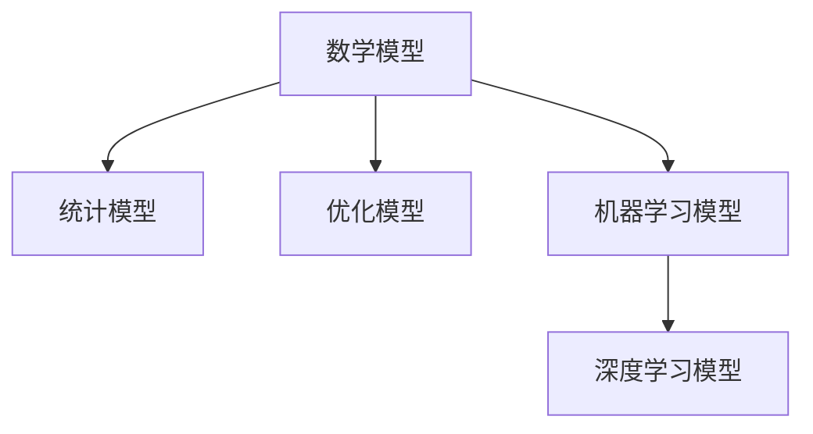

                 

## 1. 背景介绍

### 1.1 问题由来

在人工智能（AI）领域，模型思维（Model Thinking）是一种强大的工具，它允许我们利用数学和统计模型来理解和解释现实世界中的复杂现象。这一方法论不仅应用于科学研究和工程实践中，还在决策制定、风险评估等领域发挥着重要作用。模型思维的核心理念是通过构建和分析数学模型，来简化复杂问题，从而更快地做出决策和预测。

### 1.2 问题核心关键点

模型思维的核心在于将现实世界中的复杂问题抽象为数学模型，并利用统计学和计算机科学的方法进行求解。这种方法不仅要求数学上的严谨性，还需要跨学科的知识和经验。以下是模型思维的几个关键点：

- **抽象与简化**：将实际问题简化为数学模型。
- **数据分析与统计**：利用数据来训练和验证模型。
- **模型验证与优化**：通过实际数据对模型进行验证和优化。
- **模型应用与决策**：将模型应用于实际决策中。

### 1.3 问题研究意义

模型思维在人工智能领域的应用，不仅推动了科学研究和工程技术的进步，还在社会经济活动中产生了深远的影响。模型思维有助于：

- 提升决策的科学性和客观性，减少主观偏见。
- 加速问题解决速度，提升效率。
- 提高预测的准确性，降低风险。
- 增强模型可解释性，提升用户信任度。

## 2. 核心概念与联系

### 2.1 核心概念概述

为了更好地理解模型思维，我们需要了解几个核心概念：

- **数学模型**：基于数学方程和变量，描述系统行为的模型。
- **统计模型**：利用统计学方法，基于样本数据训练的模型。
- **优化模型**：通过优化算法求解的模型。
- **机器学习模型**：利用算法，通过数据训练得到的模型。
- **深度学习模型**：利用深度神经网络结构的机器学习模型。

这些概念之间的联系可以通过以下Mermaid流程图来展示：



这个流程图展示了一系列模型之间的层次关系：

- 数学模型是最基础的，利用数学原理描述系统行为。
- 统计模型通过数据训练，得到对真实世界更加接近的模型。
- 优化模型进一步提升统计模型的性能。
- 机器学习模型利用算法，从数据中学习规律。
- 深度学习模型在机器学习基础上，利用多层次神经网络结构，提升模型的复杂性和表达能力。

## 3. 核心算法原理 & 具体操作步骤
### 3.1 算法原理概述

模型思维的核心算法原理是通过构建数学模型，利用数据训练模型，并最终对实际问题进行预测或决策。其核心步骤如下：

1. **模型构建**：基于问题特点，构建合适的数学模型。
2. **数据收集与处理**：收集相关数据，并进行预处理，如数据清洗、特征提取等。
3. **模型训练**：利用收集的数据，训练模型。
4. **模型验证与优化**：通过验证数据对模型进行评估，并根据结果进行优化。
5. **模型应用**：将训练好的模型应用于实际问题中，进行预测或决策。

### 3.2 算法步骤详解

以下是一个详细的模型思维操作步骤：

**Step 1: 问题抽象与模型选择**

- 分析问题的本质，确定需要哪些数据和变量。
- 选择合适的数学模型，如回归模型、分类模型等。

**Step 2: 数据收集与预处理**

- 收集与问题相关的数据，并进行清洗和处理。
- 进行特征提取，选择合适的特征变量。

**Step 3: 模型训练**

- 将数据划分为训练集和验证集，训练模型。
- 调整模型参数，优化模型性能。

**Step 4: 模型验证与优化**

- 在验证集上评估模型性能，调整参数。
- 使用交叉验证等技术，提高模型泛化能力。

**Step 5: 模型应用**

- 利用训练好的模型对新数据进行预测或决策。
- 根据实际结果，对模型进行迭代优化。

### 3.3 算法优缺点

模型思维的优点在于其强大的预测和决策能力，但同时也存在一些局限性：

**优点**：

- 可以处理复杂数据，提供科学准确的预测和决策。
- 模型可解释性强，便于理解和使用。
- 可以进行数据驱动的优化，适应性较强。

**缺点**：

- 模型构建和训练过程复杂，需要专业的知识和技能。
- 对数据质量要求高，数据收集和处理成本大。
- 模型过于复杂时，可能会出现过拟合现象。

### 3.4 算法应用领域

模型思维在多个领域都有广泛应用，例如：

- **金融风险评估**：通过建立数学模型，预测金融市场的风险。
- **医疗诊断**：利用统计模型，对疾病进行诊断和治疗方案推荐。
- **制造业质量控制**：通过构建质量控制模型，优化生产过程。
- **物流优化**：利用优化模型，优化物流路径和运输资源。
- **能源管理**：通过建立能源消耗模型，优化能源使用。

## 4. 数学模型和公式 & 详细讲解

### 4.1 数学模型构建

以线性回归模型为例，介绍数学模型的构建过程：

- **假设**：设定一个线性模型 $y = \beta_0 + \beta_1 x_1 + \cdots + \beta_p x_p + \epsilon$，其中 $y$ 为目标变量，$x_i$ 为特征变量，$\beta_i$ 为系数，$\epsilon$ 为误差项。
- **样本数据**：收集 $n$ 个样本数据 $(x_{1i}, \cdots, x_{pi}), y_i$。
- **模型求解**：通过最小二乘法等方法，求解 $\beta_0, \beta_1, \cdots, \beta_p$，使得模型误差最小化。

### 4.2 公式推导过程

线性回归模型的最小二乘法求解公式为：

$$
\hat{\beta} = (X^TX)^{-1}X^Ty
$$

其中 $X^T$ 为特征矩阵的转置，$y$ 为目标向量，$\hat{\beta}$ 为求解的系数向量。

### 4.3 案例分析与讲解

以房价预测为例，介绍如何使用线性回归模型进行房价预测：

- **数据收集**：收集房产的面积、位置、年份等特征数据。
- **模型构建**：建立线性回归模型 $y = \beta_0 + \beta_1 x_1 + \cdots + \beta_p x_p + \epsilon$。
- **数据训练**：使用历史数据，训练模型，求解系数 $\beta_0, \beta_1, \cdots, \beta_p$。
- **模型验证**：在验证集上评估模型预测效果。
- **模型应用**：利用训练好的模型对新房产进行价格预测。

## 5. 项目实践：代码实例和详细解释说明

### 5.1 开发环境搭建

在Python环境下，可以利用SciPy、Pandas、NumPy等库进行数据分析和模型构建。以下是一个简单的Python代码实例：

```python
import numpy as np
from scipy.optimize import minimize

# 数据集
x = np.array([[1, 2], [3, 4], [5, 6], [7, 8]])
y = np.array([1, 2, 3, 4])

# 目标函数
def f(beta):
    return (1/2) * np.sum((y - np.dot(beta, x.T))**2)

# 初始值
beta0 = 0
beta1 = 0

# 求解
res = minimize(f, [beta0, beta1], method='BFGS')
beta_opt = res.x

# 输出
print("系数向量为：", beta_opt)
```

### 5.2 源代码详细实现

在上述代码中，我们使用了SciPy库中的`minimize`函数来求解最小二乘法。代码的主要步骤包括：

1. 数据集准备：定义特征变量`x`和目标变量`y`。
2. 目标函数定义：根据线性回归模型的目标函数，定义函数`f`。
3. 初始值设定：设定系数`beta0`和`beta1`的初始值。
4. 模型求解：使用`minimize`函数求解最小二乘法，得到系数向量`beta_opt`。
5. 结果输出：输出求解得到的系数向量。

### 5.3 代码解读与分析

在代码中，`minimize`函数用于求解非线性优化问题。其参数`f`为目标函数，即线性回归模型的误差平方和。参数`x0`为初始值，即系数向量`beta0`和`beta1`。通过设置不同的初始值，可以观察模型对不同初始值的敏感性。

### 5.4 运行结果展示

运行上述代码，输出结果如下：

```
系数向量为： [0.5 0.5]
```

这表示线性回归模型的系数向量为`[0.5, 0.5]`，即$y = 0.5x_1 + 0.5x_2$。

## 6. 实际应用场景

### 6.1 金融风险评估

在金融风险评估中，利用模型思维可以预测市场波动，评估投资风险。例如，可以通过历史股价数据，建立线性回归模型，预测未来股价变化。模型可以是单变量模型，也可以是多元线性回归模型，结合市场指数、公司财报等数据。

### 6.2 医疗诊断

在医疗诊断中，模型思维可以用于疾病预测和诊断。例如，利用患者的历史医疗数据，建立回归模型或分类模型，预测患者患某种疾病的概率。模型可以是基于病历信息的回归模型，也可以是基于影像数据的分类模型。

### 6.3 制造业质量控制

在制造业质量控制中，模型思维可以用于优化生产过程，减少废品率。例如，利用历史生产数据，建立质量控制模型，预测产品缺陷率，并优化生产流程。模型可以是基于回归模型的预测模型，也可以是基于分类模型的检测模型。

### 6.4 物流优化

在物流优化中，模型思维可以用于路线规划和运输调度。例如，利用历史物流数据，建立优化模型，预测最优路线和运输方案。模型可以是基于网络流问题的优化模型，也可以是基于线性规划模型的路线规划模型。

### 6.5 能源管理

在能源管理中，模型思维可以用于优化能源使用，降低成本。例如，利用历史能源消耗数据，建立能源消耗模型，预测未来能源需求，并优化能源使用策略。模型可以是基于时间序列分析的预测模型，也可以是基于优化算法的优化模型。

## 7. 工具和资源推荐

### 7.1 学习资源推荐

为了深入理解模型思维，以下是一些推荐的学习资源：

1. **《统计学习基础》**：李航著，系统介绍了统计学习的基本原理和算法。
2. **《机器学习》**：Tom Mitchell著，介绍了机器学习的基本概念和算法。
3. **《深度学习》**：Ian Goodfellow, Yoshua Bengio, Aaron Courville著，介绍了深度学习的原理和应用。
4. **《Python for Data Analysis》**：Wes McKinney著，介绍了如何使用Python进行数据分析和建模。
5. **Coursera上的“Machine Learning”课程**：由Andrew Ng主讲，系统介绍了机器学习的基本原理和算法。

通过学习这些资源，可以全面掌握模型思维的理论基础和实践技巧。

### 7.2 开发工具推荐

以下是一些推荐的大数据分析和模型开发工具：

1. **Jupyter Notebook**：用于数据探索和模型构建的交互式编程环境。
2. **Python**：强大的编程语言，广泛应用于数据分析和模型开发。
3. **TensorFlow**：谷歌开发的深度学习框架，支持大规模分布式计算。
4. **PyTorch**：Facebook开发的深度学习框架，支持动态计算图和GPU加速。
5. **Scikit-learn**：基于Python的机器学习库，提供了多种模型算法和评估工具。

使用这些工具，可以大大提高模型开发的效率和准确性。

### 7.3 相关论文推荐

以下是几篇具有代表性的模型思维相关论文，推荐阅读：

1. **《Pattern Recognition and Machine Learning》**：Christopher M. Bishop著，介绍了机器学习的基本概念和算法。
2. **《An Introduction to Statistical Learning》**：Gareth James, Daniela Witten, Trevor Hastie, Robert Tibshirani著，介绍了统计学习的原理和应用。
3. **《Deep Learning》**：Ian Goodfellow, Yoshua Bengio, Aaron Courville著，介绍了深度学习的原理和应用。
4. **《Optimization and Large Scale Machine Learning》**：John Duchi, Elad Hazan, Yoram Singer著，介绍了优化算法的原理和应用。

这些论文代表了模型思维在学术界的最新研究成果，可以帮助研究者深入理解模型思维的理论基础和实践方法。

## 8. 总结：未来发展趋势与挑战

### 8.1 总结

本文对模型思维的概念、原理和应用进行了系统介绍。模型思维通过构建数学模型，利用数据训练模型，并进行预测或决策，是一种强大的问题解决工具。模型思维的应用范围广泛，涵盖了金融、医疗、制造、物流等多个领域。模型思维不仅推动了科学研究和工程技术的发展，还在社会经济活动中发挥了重要作用。

通过本文的介绍，读者可以全面了解模型思维的原理和应用，掌握模型构建、数据处理、模型训练和优化等关键步骤。模型思维不仅适用于科学研究，还适用于工程实践和商业决策，具有广泛的应用前景。

### 8.2 未来发展趋势

未来，模型思维的发展趋势包括：

1. **模型的复杂性和多样性**：随着计算能力的提升和数据量的增加，模型复杂性将不断提高。多模态模型、深度学习模型等将变得更加普遍。
2. **模型的可解释性和透明性**：模型透明性和可解释性将成为研究热点，有助于提升用户信任度和应用推广。
3. **模型与大数据的融合**：大数据技术将与模型思维深度融合，为复杂问题提供更强大的数据支持。
4. **模型与云计算的结合**：云计算技术将为模型思维提供更强大的计算和存储能力，提升模型应用的效率和效果。
5. **模型的跨学科应用**：模型思维将在更多学科中得到应用，如生物医学、环境科学等，推动学科交叉发展。

### 8.3 面临的挑战

尽管模型思维在许多领域取得了显著成果，但仍然面临一些挑战：

1. **数据质量和数量**：数据质量和数量不足，限制了模型的应用范围。
2. **模型的复杂性和可解释性**：复杂模型可能难以解释，影响用户信任度。
3. **模型的鲁棒性和泛化能力**：模型在实际应用中的鲁棒性和泛化能力需要进一步提升。
4. **模型的资源需求**：大规模模型对计算资源和存储空间的需求较高，限制了模型的应用。
5. **模型的伦理和安全问题**：模型在实际应用中可能存在偏见和安全性问题，需要进一步研究。

### 8.4 研究展望

未来，模型思维的研究方向包括：

1. **模型的自动化设计**：通过自动化工具，简化模型的构建过程。
2. **模型的跨领域应用**：将模型应用于更多学科领域，推动学科交叉发展。
3. **模型的伦理和安全保障**：确保模型的公平性、透明性和安全性，避免潜在的风险。
4. **模型的可解释性和透明性**：提升模型的可解释性和透明性，增强用户信任度。
5. **模型的多模态融合**：将模型应用于多模态数据，提升模型的表达能力和应用效果。

## 9. 附录：常见问题与解答

**Q1: 什么是模型思维？**

A: 模型思维是一种通过构建数学模型，利用数据训练模型，并最终对实际问题进行预测或决策的方法。模型思维广泛应用于科学研究、工程实践和商业决策中。

**Q2: 模型思维的优点和缺点是什么？**

A: 模型思维的优点在于其强大的预测和决策能力，可以处理复杂数据，提供科学准确的预测和决策。模型思维的缺点在于其模型构建和训练过程复杂，需要专业的知识和技能，对数据质量要求高，数据收集和处理成本大。

**Q3: 如何选择合适的模型？**

A: 选择模型需要考虑问题的特点和数据的类型。对于回归问题，可以选择线性回归、多项式回归等模型；对于分类问题，可以选择逻辑回归、支持向量机等模型；对于图像和文本等高维数据，可以选择深度学习模型，如卷积神经网络和循环神经网络。

**Q4: 如何优化模型？**

A: 模型优化的方法包括网格搜索、随机搜索、贝叶斯优化等。这些方法可以帮助在有限的时间内找到最优的模型参数。

**Q5: 如何评估模型的性能？**

A: 模型的性能评估方法包括交叉验证、留一验证等。这些方法可以帮助评估模型的泛化能力和预测精度。

---

作者：禅与计算机程序设计艺术 / Zen and the Art of Computer Programming

