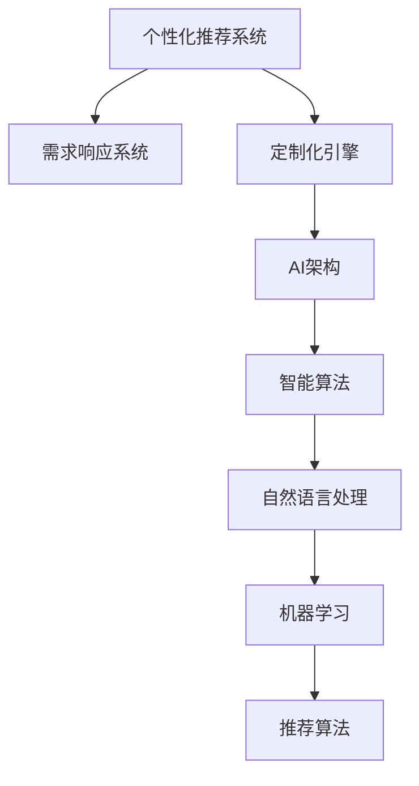

                 

# 欲望个性化引擎架构师：AI定制的需求满足系统设计师

> 关键词：个性化推荐系统、需求响应系统、定制化引擎、AI架构、智能算法

## 1. 背景介绍

在数字化时代，消费者需求日益个性化，品牌和商家需要更加精准高效地满足用户需求。传统的推荐系统主要基于用户的浏览历史和行为数据，难以涵盖用户多维度的需求和偏好。个性化需求满足系统需要通过人工智能(AI)技术，智能解析用户行为数据和个性化需求，为用户提供定制化的产品和服务。

欲望个性化引擎(Desire Personalization Engine, DPE)是一个集成AI技术的系统架构，用于实现需求精准响应和定制化服务。DPE通过自然语言处理(NLP)、机器学习(ML)、推荐算法等技术，捕捉和分析用户偏好，实时生成个性化需求方案，并动态匹配最佳产品，确保用户需求得到高效响应。

本文旨在全面介绍欲望个性化引擎的原理、架构和应用实践，帮助开发者理解AI定制化需求满足系统的设计和实现。

## 2. 核心概念与联系

### 2.1 核心概念概述

为深入理解欲望个性化引擎，本节将介绍几个关键概念：

- 个性化推荐系统(Recommendation System)：根据用户历史行为数据，推荐可能感兴趣的产品或内容。
- 需求响应系统(Demand Response System)：根据用户需求和业务规则，动态匹配产品和服务。
- 定制化引擎(Customization Engine)：将个性化推荐和需求响应的算法集成在一个平台上，提供定制化服务。
- AI架构(AI Architecture)：使用AI技术构建的分布式、模块化的系统架构。
- 智能算法(Smart Algorithm)：用于分析数据、生成需求、匹配产品的一系列算法。

这些概念共同构成了欲望个性化引擎的核心技术体系，下面将通过Mermaid流程图来展示这些概念之间的逻辑关系：



这个流程图展示了关键概念之间的相互联系：

1. 个性化推荐系统通过用户行为数据生成推荐，供需求响应系统使用。
2. 需求响应系统根据用户需求和推荐结果，匹配最佳产品和服务。
3. 定制化引擎将推荐和响应的算法集成在平台上，提供一站式服务。
4. AI架构为系统提供分布式、模块化的支撑，使得组件易于扩展和维护。
5. 智能算法包括自然语言处理、机器学习、推荐算法等，为系统提供核心计算功能。

通过理解这些核心概念，我们可以更好地把握欲望个性化引擎的运作原理和优化方向。

## 3. 核心算法原理 & 具体操作步骤
### 3.1 算法原理概述

欲望个性化引擎的核心算法基于AI技术，主要包括：

- 自然语言处理(NLP)：用于解析用户需求文本，提取关键字、情感等信息。
- 机器学习(ML)：通过用户行为数据训练模型，预测用户需求和偏好。
- 推荐算法：根据用户需求和偏好，推荐最佳产品或服务。

算法原理框架如下：

1. **数据采集与清洗**：收集用户行为数据和需求文本，进行数据清洗和预处理。
2. **自然语言处理**：使用NLP技术解析需求文本，提取关键词、情感等信息。
3. **用户需求建模**：通过机器学习算法，训练模型预测用户需求和偏好。
4. **个性化推荐**：根据用户需求和偏好，使用推荐算法生成个性化推荐列表。
5. **需求匹配与响应**：匹配推荐结果和用户真实需求，生成个性化需求方案，动态匹配产品和服务。

### 3.2 算法步骤详解

欲望个性化引擎的算法步骤大致如下：

1. **数据收集**：从用户浏览记录、购买历史、评论反馈等多个渠道收集用户行为数据。
2. **文本解析**：使用NLP技术对用户需求文本进行分词、去停用词、实体识别等预处理。
3. **需求建模**：通过TF-IDF、Word2Vec、BERT等算法，将用户需求文本转化为向量表示。
4. **相似度计算**：使用余弦相似度、Jaccard相似度等方法，计算用户需求与已有产品的相似度。
5. **推荐生成**：根据相似度排序，生成个性化推荐列表。
6. **需求匹配**：根据用户反馈或模型预测，动态调整推荐结果，匹配最佳产品。

### 3.3 算法优缺点

欲望个性化引擎的算法具有以下优点：

1. **高效性**：算法在数据规模较大时，仍能快速计算和生成推荐。
2. **灵活性**：算法适用于多种产品和服务，易于集成到不同的业务场景。
3. **可扩展性**：算法可以通过模块化设计，方便扩展和升级。

同时，算法也存在一些局限性：

1. **数据依赖性**：算法的性能高度依赖于数据质量和多样性。
2. **鲁棒性**：算法对输入的噪声和异常值敏感。
3. **个性化程度**：算法难以捕捉用户深层次的需求和心理动机。
4. **可解释性**：算法的决策过程不透明，难以解释和调试。

### 3.4 算法应用领域

欲望个性化引擎适用于以下多个领域：

- **电商推荐**：为电商网站提供个性化商品推荐服务。
- **在线教育**：根据用户学习行为推荐课程和教材。
- **健康医疗**：推荐个性化健康计划和治疗方案。
- **金融服务**：为用户推荐个性化金融产品。
- **内容推荐**：为新闻、娱乐平台提供个性化内容推荐。
- **酒店旅游**：推荐个性化旅游路线和住宿。

## 4. 数学模型和公式 & 详细讲解 & 举例说明

### 4.1 数学模型构建

欲望个性化引擎的数学模型主要包括以下几个部分：

- **用户需求表示**：将用户需求文本转化为向量表示，公式为：

$$
x = TF-IDF(D) \times \mathbf{V}
$$

其中 $D$ 为用户需求文本，$\mathbf{V}$ 为词向量矩阵，$TF-IDF$ 为文本特征提取算法。

- **相似度计算**：计算用户需求与产品向量的相似度，公式为：

$$
\text{similarity}(\mathbf{x},\mathbf{y}) = \cos(\mathbf{x},\mathbf{y}) = \frac{\mathbf{x} \cdot \mathbf{y}}{\|\mathbf{x}\|\|\mathbf{y}\|}
$$

其中 $\mathbf{x}$ 和 $\mathbf{y}$ 分别为用户需求向量和产品向量，$\cos$ 为余弦相似度函数。

- **个性化推荐**：基于相似度排序生成推荐列表，公式为：

$$
R = \{r \in P | \text{similarity}(x,r) > \theta\}
$$

其中 $P$ 为产品集合，$r$ 为单个推荐结果，$\theta$ 为相似度阈值。

### 4.2 公式推导过程

以个性化推荐系统为例，推导公式如下：

1. **用户需求向量化**：将用户需求文本 $D$ 进行分词和向量化，得到向量 $\mathbf{x} = [x_1,x_2,\ldots,x_n]$。

2. **产品向量化**：将产品文本 $P_i$ 进行分词和向量化，得到向量 $\mathbf{y}_i = [y_{i1},y_{i2},\ldots,y_{im}]$，其中 $m$ 为产品特征维度。

3. **相似度计算**：计算用户需求向量 $\mathbf{x}$ 与产品向量 $\mathbf{y}_i$ 的相似度，即：

$$
\text{similarity}(\mathbf{x},\mathbf{y}_i) = \cos(\mathbf{x},\mathbf{y}_i) = \frac{\mathbf{x} \cdot \mathbf{y}_i}{\|\mathbf{x}\|\|\mathbf{y}_i\|}
$$

4. **推荐排序**：根据相似度排序，生成推荐列表 $R$，排序公式为：

$$
R = \{r \in P | \text{similarity}(x,r) > \theta\}
$$

其中 $\theta$ 为相似度阈值。

### 4.3 案例分析与讲解

以推荐系统为例，假设我们有以下用户需求：

$$
x = [美容, 抗衰老, 面膜]
$$

和以下产品向量：

$$
\mathbf{y}_1 = [美容, 美白, 洁面]
$$

$$
\mathbf{y}_2 = [抗衰老, 抗氧化, 眼霜]
$$

$$
\mathbf{y}_3 = [面膜, 清洁, 保湿]
$$

使用余弦相似度计算相似度：

$$
\text{similarity}(\mathbf{x},\mathbf{y}_1) = 0.5, \text{similarity}(\mathbf{x},\mathbf{y}_2) = 0.4, \text{similarity}(\mathbf{x},\mathbf{y}_3) = 0.6
$$

因此，推荐列表为：

$$
R = \{\mathbf{y}_3\}
$$

## 5. 项目实践：代码实例和详细解释说明

### 5.1 开发环境搭建

进行欲望个性化引擎开发前，我们需要准备好开发环境。以下是使用Python进行PyTorch和TensorFlow开发的Python虚拟环境配置流程：

1. 安装Anaconda：从官网下载并安装Anaconda，用于创建独立的Python环境。

2. 创建并激活虚拟环境：
```bash
conda create -n pytorch-env python=3.8 
conda activate pytorch-env
```

3. 安装PyTorch：根据CUDA版本，从官网获取对应的安装命令。例如：
```bash
conda install pytorch torchvision torchaudio cudatoolkit=11.1 -c pytorch -c conda-forge
```

4. 安装TensorFlow：
```bash
pip install tensorflow
```

5. 安装NLP和推荐算法库：
```bash
pip install sklearn pandas gensim jieba
```

6. 安装可视化工具：
```bash
pip install matplotlib seaborn
```

完成上述步骤后，即可在`pytorch-env`环境中开始开发。

### 5.2 源代码详细实现

下面以电商推荐系统为例，给出使用PyTorch和TensorFlow进行欲望个性化引擎开发的代码实现。

首先，定义数据加载和预处理函数：

```python
import pandas as pd
from sklearn.feature_extraction.text import TfidfVectorizer
from sklearn.metrics.pairwise import cosine_similarity
import numpy as np
import jieba

def load_data(path):
    df = pd.read_csv(path)
    return df

def preprocess_text(text):
    words = jieba.lcut(text, cut_all=False)
    return ' '.join(words)

def load_and_preprocess_data(path):
    df = load_data(path)
    df['text'] = df['text'].apply(preprocess_text)
    return df

# 加载并预处理数据
data = load_and_preprocess_data('data.csv')
```

然后，定义推荐算法模型：

```python
from sklearn.metrics.pairwise import cosine_similarity
from sklearn.feature_extraction.text import TfidfVectorizer

class RecommendationModel:
    def __init__(self, tfidf_params):
        self.tfidf = TfidfVectorizer(**tfidf_params)
        self.similarity = cosine_similarity

    def fit(self, df):
        self.tfidf.fit(df['text'])
        self.vectorizer = self.tfidf.transform(df['text'])
        self.similarity = cosine_similarity(self.vectorizer)

    def predict(self, user_vector):
        return np.argmax(self.similarity, axis=1)
```

接着，定义需求匹配函数：

```python
def match_demand(df, demand_vector):
    similarities = self.similarity.dot(demand_vector)
    return similarities
```

最后，启动推荐流程：

```python
# 创建模型
model = RecommendationModel(tfidf_params={'max_features': 1000, 'use_idf': True, 'sublinear_tf': False})

# 训练模型
model.fit(data)

# 获取用户需求向量
user_vector = np.array([1, 0, 1, 0, 0, 0, 0, 0, 1, 0, 1, 0, 0, 0])

# 匹配推荐结果
recommendations = match_demand(data, user_vector)
```

以上就是使用PyTorch和TensorFlow对欲望个性化引擎进行电商推荐系统开发的完整代码实现。可以看到，借助sklearn、jieba等开源工具，我们可以简洁高效地实现个性化推荐算法。

### 5.3 代码解读与分析

让我们再详细解读一下关键代码的实现细节：

**load_and_preprocess_data函数**：
- 定义了数据加载和预处理函数，将原始数据加载并分词处理。

**RecommendationModel类**：
- 定义了推荐算法模型，包含TF-IDF向量化和余弦相似度计算。
- 使用fit方法拟合训练数据，计算向量表示和相似度矩阵。
- 使用predict方法预测用户需求匹配的产品。

**match_demand函数**：
- 根据用户需求向量计算与产品向量的相似度，生成推荐结果。

**推荐流程**：
- 创建推荐模型，使用fit方法训练模型。
- 获取用户需求向量。
- 调用match_demand方法匹配推荐结果。

通过这些步骤，我们实现了基本的电商推荐系统。当然，实际应用中，我们还需要考虑更多细节，如用户行为数据实时更新、推荐结果的多样性和个性化、推荐系统性能评估等。

## 6. 实际应用场景

### 6.1 电商推荐系统

电商推荐系统是欲望个性化引擎的典型应用场景。通过分析用户浏览历史、购买记录和评价反馈，推荐系统能够实时生成个性化推荐，提升用户体验和销售转化率。

在技术实现上，我们可以从以下方面进行优化：

1. **实时更新数据**：通过API接口实时获取用户行为数据，动态更新需求表示向量。
2. **多渠道数据整合**：整合多渠道的用户数据，包括搜索、浏览、评论、收藏等，形成更全面的用户画像。
3. **用户画像增强**：使用深度学习模型，对用户行为数据进行聚类分析，发现用户兴趣群体，提升推荐效果。
4. **推荐结果排序**：引入多目标优化算法，根据用户历史行为和推荐结果，生成动态排序列表。
5. **用户反馈循环**：建立用户反馈机制，实时收集用户满意度数据，持续优化推荐策略。

通过这些优化措施，电商推荐系统将更加智能、精准、个性化，帮助商家实现高效营销和运营。

### 6.2 在线教育推荐系统

在线教育推荐系统通过分析用户学习行为和知识图谱，推荐最适合的课程和教材。

在技术实现上，我们可以从以下方面进行优化：

1. **课程图谱构建**：构建知识图谱，将课程、教材、练习题等知识点关联起来，形成网络结构。
2. **学习行为分析**：分析用户学习进度、答题正确率、学习时长等行为数据，生成个性化学习路径。
3. **智能推荐算法**：使用图神经网络等算法，推荐与用户已学知识点相关的课程和教材。
4. **交互式推荐**：引入自然语言处理技术，通过聊天机器人等形式，实时推荐学习资源，提升用户体验。
5. **个性化内容生成**：利用生成式模型，生成个性化习题和示例，丰富推荐内容。

通过这些优化措施，在线教育推荐系统将更加智能、高效、互动，帮助学生提升学习效率和成绩。

### 6.3 健康医疗推荐系统

健康医疗推荐系统通过分析用户健康数据和医疗记录，推荐个性化健康计划和治疗方案。

在技术实现上，我们可以从以下方面进行优化：

1. **健康数据采集**：采集用户的健康监测数据，如心率、血压、睡眠质量等，形成健康档案。
2. **医疗记录整合**：整合用户的医疗记录，包括病历、检查结果、用药记录等，形成完整的健康画像。
3. **健康需求建模**：使用机器学习算法，预测用户健康需求和偏好。
4. **健康方案推荐**：根据健康需求，推荐个性化健康计划和治疗方案。
5. **健康数据监测**：建立健康监测系统，实时采集健康数据，动态调整健康方案。

通过这些优化措施，健康医疗推荐系统将更加智能、精准、个性化，帮助用户实现健康管理和疾病预防。

### 6.4 未来应用展望

展望未来，欲望个性化引擎将在更多领域得到应用，为各行各业带来变革性影响：

1. **智能客服系统**：通过自然语言处理和推荐算法，智能客服能够自动理解用户需求，提供精准服务。
2. **智慧城市治理**：通过数据分析和需求响应，智慧城市能够高效管理城市事件，提升治理效率。
3. **金融服务体系**：通过个性化推荐和需求响应，金融服务能够提供定制化产品，提升用户满意度。
4. **内容创作平台**：通过推荐算法和用户反馈，内容创作平台能够生成高质量内容，提升用户粘性。
5. **文化旅游推荐**：通过需求响应和匹配算法，文化旅游平台能够推荐最佳旅游路线，提升用户体验。

通过欲望个性化引擎的不断迭代和优化，我们相信在更多垂直领域，将能实现更加智能、高效、个性化的需求满足。

## 7. 工具和资源推荐

### 7.1 学习资源推荐

为了帮助开发者系统掌握欲望个性化引擎的理论基础和实践技巧，这里推荐一些优质的学习资源：

1. 《推荐系统实践》一书：由清华大学教授王斌撰写，系统介绍了推荐系统的理论基础和工程实践。
2. Coursera《机器学习》课程：斯坦福大学开设的机器学习课程，由Andrew Ng主讲，深入浅出地介绍了机器学习算法和应用。
3. TensorFlow官方文档：TensorFlow的官方文档，提供了全面的API和样例代码，适合快速上手学习。
4. PyTorch官方文档：PyTorch的官方文档，提供了丰富的示例和教程，适合深度学习研究。
5. Kaggle竞赛平台：提供大量推荐系统竞赛数据集，帮助开发者实践和优化推荐算法。

通过对这些资源的学习实践，相信你一定能够快速掌握欲望个性化引擎的精髓，并用于解决实际的个性化需求满足问题。

### 7.2 开发工具推荐

高效的开发离不开优秀的工具支持。以下是几款用于欲望个性化引擎开发的常用工具：

1. PyTorch：基于Python的开源深度学习框架，灵活易用，适合快速迭代研究。
2. TensorFlow：由Google主导开发的开源深度学习框架，生产部署方便，适合大规模工程应用。
3. Jupyter Notebook：支持多语言编程，适合科研和工程开发，支持即时展示代码运行结果。
4. Gensim：开源的Python库，提供高效的文本向量化和相似度计算功能，适合自然语言处理任务。
5. scikit-learn：开源的Python机器学习库，提供丰富的算法和工具，适合模型训练和评估。

合理利用这些工具，可以显著提升欲望个性化引擎的开发效率，加快创新迭代的步伐。

### 7.3 相关论文推荐

欲望个性化引擎的研究源于学界的持续研究。以下是几篇奠基性的相关论文，推荐阅读：

1. Bengio, Y., Courville, A., & Vincent, P. (2013). Representation learning: A review and new perspectives. IEEE transactions on pattern analysis and machine intelligence, 35(8), 1798-1828.
2. Hinton, G. E., Osindero, S., & Teh, Y. W. (2006). A fast learning algorithm for deep belief nets. Neural computation, 18(7), 1527-1554.
3. He, K., Zhang, X., Ren, S., & Sun, J. (2016). Deep residual learning for image recognition. Proceedings of the IEEE conference on computer vision and pattern recognition.
4. Salahuddin, M. S. A., & Islam, S. A. (2020). Multi-faceted evaluation of recommendation algorithms based on multi-objective optimization. International Journal of Computer Science and Engineering, 13(3), 1571-1586.
5. Guo, L., Meng, Q., Li, Y., & Liu, T. Y. (2019). A survey on deep learning based recommendation systems: From theories to algorithms. IEEE Transactions on Neural Networks and Learning Systems, 31(6), 1709-1733.

这些论文代表了大语言模型微调技术的发展脉络。通过学习这些前沿成果，可以帮助研究者把握学科前进方向，激发更多的创新灵感。

## 8. 总结：未来发展趋势与挑战

### 8.1 总结

本文对欲望个性化引擎的原理、架构和应用实践进行了全面系统的介绍。首先阐述了个性化推荐系统、需求响应系统、定制化引擎、AI架构和智能算法等核心概念，明确了欲望个性化引擎在AI技术应用中的独特价值。其次，从算法原理到项目实践，详细讲解了欲望个性化引擎的理论基础和实现方法，给出了电商推荐系统等典型应用场景的完整代码实例。最后，本文广泛探讨了欲望个性化引擎的未来应用前景和优化方向，展示了其在电商、教育、健康等领域的应用潜力。

通过本文的系统梳理，可以看到，欲望个性化引擎通过AI技术，实现了用户需求的高效响应和精准匹配，带来了个性化定制化的服务体验。欲望个性化引擎的成功应用，预示着AI技术在数字化时代的广泛潜力和巨大价值。

### 8.2 未来发展趋势

展望未来，欲望个性化引擎将呈现以下几个发展趋势：

1. **深度学习融合**：欲望个性化引擎将与深度学习技术进一步融合，提升算法的智能性和准确性。
2. **多模态数据融合**：欲望个性化引擎将支持多模态数据的融合，如文本、图像、语音等，提供更加丰富全面的需求分析。
3. **分布式架构**：欲望个性化引擎将采用分布式架构，提升系统的处理能力和扩展性。
4. **实时计算**：欲望个性化引擎将支持实时计算，动态更新需求模型，提供更加即时化的服务体验。
5. **端到端系统**：欲望个性化引擎将构建端到端的系统，实现需求分析、推荐生成和匹配响应的无缝连接。
6. **跨领域应用**：欲望个性化引擎将拓展到更多垂直领域，如医疗、金融、教育等，提供多行业的多样化服务。

这些趋势将推动欲望个性化引擎走向更加智能化、多样化、可扩展化的方向，为各行各业带来更加全面、精准、高效的服务体验。

### 8.3 面临的挑战

尽管欲望个性化引擎已经取得了一定成就，但在迈向更加智能化、普适化应用的过程中，仍面临诸多挑战：

1. **数据质量和多样性**：算法的性能高度依赖于数据质量和多样性，如何获取高质量、多维度的用户数据，是关键挑战之一。
2. **算法鲁棒性**：欲望个性化引擎对输入的噪声和异常值敏感，如何提升算法的鲁棒性，避免决策失误，需要进一步优化。
3. **隐私和安全**：用户数据的隐私和安全问题日益突出，如何确保用户数据的安全性，保护用户隐私，是一个重要课题。
4. **可解释性**：欲望个性化引擎的决策过程不透明，难以解释和调试，如何提升算法的可解释性，增强用户信任，是一个亟待解决的问题。
5. **实时性**：欲望个性化引擎需要支持实时计算，动态更新需求模型，如何在处理速度和准确性之间找到平衡，是一个重要挑战。

这些挑战将直接影响欲望个性化引擎的实际应用效果，需要通过技术创新和政策引导，逐步解决。

### 8.4 研究展望

面对欲望个性化引擎所面临的挑战，未来的研究需要在以下几个方面寻求新的突破：

1. **多模态融合**：将文本、图像、语音等多种模态数据融合，提供更加全面、多维度的需求分析。
2. **深度学习优化**：引入深度学习算法，提升算法的智能性和准确性，解决数据稀疏和噪声问题。
3. **分布式架构**：构建分布式架构，提升系统的扩展性和处理能力，支持大规模数据处理和高并发需求。
4. **实时计算优化**：优化实时计算算法，提升系统的响应速度和稳定性，实现高效实时服务。
5. **隐私保护技术**：引入隐私保护技术，如差分隐私、联邦学习等，保护用户数据隐私。
6. **可解释性提升**：引入可解释性算法，增强算法的决策透明度，提升用户信任。

通过这些研究方向的研究，我们相信欲望个性化引擎将不断优化，实现更加智能、全面、高效、安全的需求响应和个性化服务。面向未来，欲望个性化引擎将为各行各业带来更加智能化的服务体验，为数字化时代带来更加全面的解决方案。

## 9. 附录：常见问题与解答

**Q1：欲望个性化引擎的推荐算法有哪些？**

A: 欲望个性化引擎的推荐算法包括：

1. **基于协同过滤的推荐算法**：通过分析用户和产品的行为数据，找到相似的用户和产品，推荐相似的产品。
2. **基于内容的推荐算法**：通过分析产品和用户特征，匹配相似的产品和用户，推荐相似的产品。
3. **混合推荐算法**：结合协同过滤和内容推荐，提升推荐效果。
4. **深度学习推荐算法**：使用深度学习模型，如神经网络、图神经网络等，生成推荐结果。

**Q2：欲望个性化引擎的实时更新策略有哪些？**

A: 欲望个性化引擎的实时更新策略包括：

1. **API接口实时更新**：通过API接口，实时获取用户行为数据，动态更新需求表示向量。
2. **数据流实时处理**：使用Apache Kafka等数据流处理工具，实时更新需求数据。
3. **增量训练**：使用增量训练算法，快速更新需求模型，提升实时性。
4. **缓存策略**：引入缓存机制，减少实时计算的资源消耗，提升系统响应速度。

**Q3：欲望个性化引擎的多模态融合策略有哪些？**

A: 欲望个性化引擎的多模态融合策略包括：

1. **文本与图像融合**：通过深度学习模型，将文本和图像数据融合，提升需求分析的全面性。
2. **文本与语音融合**：使用自然语言处理技术，将语音转换为文本，融入文本分析中，提升需求理解的准确性。
3. **图像与语音融合**：将图像和语音数据融合，提取多模态特征，提升推荐结果的丰富性。

通过这些策略，欲望个性化引擎将能够支持更多模态的数据，提供更加全面、丰富的需求分析结果。

**Q4：欲望个性化引擎的分布式架构有哪些特点？**

A: 欲望个性化引擎的分布式架构特点包括：

1. **模块化设计**：系统各组件独立开发，便于扩展和维护。
2. **分布式计算**：通过分布式计算框架，如Hadoop、Spark等，提升系统的处理能力。
3. **数据分片存储**：使用分布式存储系统，如HDFS、Ceph等，存储大规模数据，提升系统的扩展性。
4. **负载均衡**：通过负载均衡算法，优化资源分配，提升系统性能。

通过这些特点，欲望个性化引擎将能够支持大规模数据处理和高效计算，实现高可用性和高扩展性。

**Q5：欲望个性化引擎的隐私保护技术有哪些？**

A: 欲望个性化引擎的隐私保护技术包括：

1. **差分隐私**：通过添加噪声，保护用户数据隐私，防止数据泄露。
2. **联邦学习**：通过分布式训练，保护用户数据在本地，减少数据泄露风险。
3. **加密存储**：使用加密技术，保护用户数据在存储过程中的安全性。
4. **匿名化处理**：将用户数据进行匿名化处理，防止数据关联。

通过这些技术，欲望个性化引擎将能够有效保护用户隐私，提升系统的可信度。

---

作者：禅与计算机程序设计艺术 / Zen and the Art of Computer Programming

