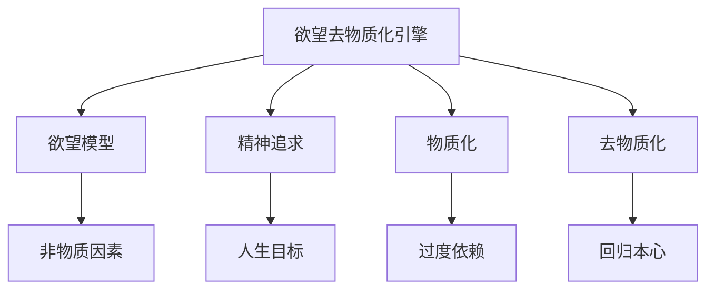
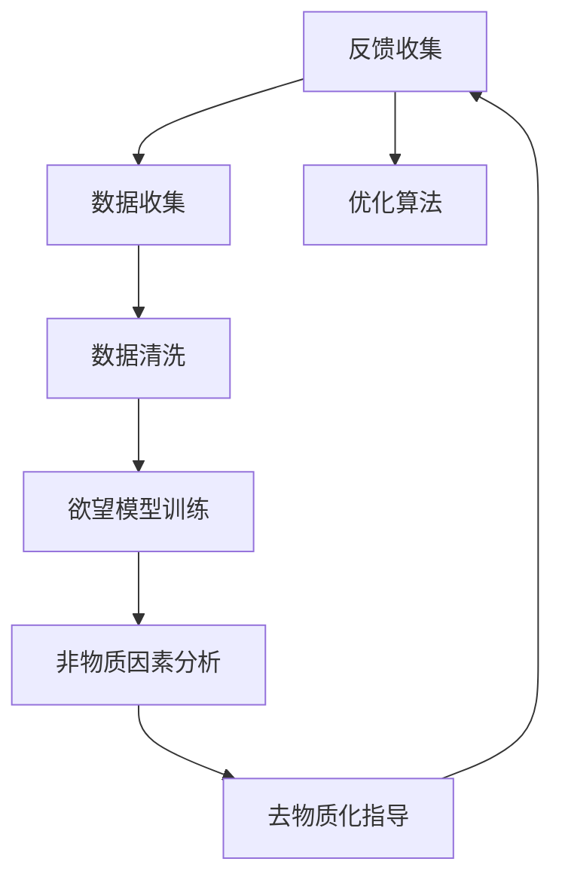

                 

# 欲望去物质化引擎：AI时代的精神追求催化剂

## 1. 背景介绍

在当今快速发展的AI时代，技术的进步正在深刻地改变我们的生活方式和社会结构。然而，科技的进步并不总是带来积极的变革。当人工智能不断渗透到我们生活的方方面面时，我们也面临着新的挑战和困境。其中之一便是：在AI的强大助力下，我们的精神追求和自我认知也在被逐渐物质化，失去了深度和灵魂。如何在这个AI驱动的时代中保持我们的精神追求，成为了一个亟待解答的课题。

本文旨在探讨一种新的引擎——欲望去物质化引擎，它不仅能够帮助我们更深刻地理解自我，还能在AI时代中引导我们走向精神上的满足和成长。我们相信，通过这种引擎，我们可以更好地利用AI技术的优势，同时避免其对人类精神世界的负面影响。

## 2. 核心概念与联系

### 2.1 核心概念概述

本节将介绍几个与欲望去物质化引擎密切相关的核心概念：

- **欲望去物质化引擎**：一种旨在帮助人类更深刻理解自我，追求精神满足的AI系统。通过数据驱动的模型，识别和解读人类欲望背后的非物质需求，从而指导人们走向更加精神化的生活。

- **精神追求**：指人类内心深处的价值观念、生活目标和内在满足感的追求。精神追求是人类区别于动物的核心特征之一，AI时代也应尊重和引导这种追求。

- **物质化**：指过度依赖物质财富和外在表征，忽略内心世界和精神追求的现象。在AI时代，物质化的现象尤为严重，如社交媒体上的物质追求、消费主义盛行等。

- **去物质化**：与物质化相对，指通过技术手段减少对外在物质的依赖，回归内心的精神追求。去物质化是实现精神满足和自我实现的必要条件。

- **欲望模型**：一种基于机器学习的大数据模型，用于分析人类的欲望和需求，识别其背后的非物质因素。欲望模型是欲望去物质化引擎的核心组成部分。

这些核心概念之间的逻辑关系可以通过以下Mermaid流程图来展示：



这个流程图展示了欲望去物质化引擎的工作原理：

1. 欲望去物质化引擎以欲望模型为核心，通过分析人类的欲望和需求，识别其背后的非物质因素。
2. 在欲望模型中，通过数据驱动的方式，挖掘和解读人类欲望背后的精神追求。
3. 引擎通过分析物质化现象，帮助用户识别和克服物质依赖。
4. 最终，引擎指导用户回归本心，追求精神满足和自我实现。

### 2.2 核心概念原理和架构

欲望去物质化引擎的原理基于以下数据处理流程：

1. **数据收集**：从社交媒体、在线购物平台、健康应用等多个渠道收集用户数据，包括消费记录、健康数据、社交互动等。

2. **数据清洗和预处理**：对收集到的数据进行清洗、去重、归一化等预处理操作，确保数据的准确性和一致性。

3. **欲望模型训练**：利用机器学习算法，如深度神经网络、聚类算法等，训练欲望模型。模型通过对大量数据的学习，识别出人类欲望背后的非物质因素。

4. **非物质因素分析**：欲望模型通过文本分析、情感分析等技术，识别出欲望背后的价值观、生活目标等精神追求。

5. **去物质化指导**：基于欲望模型的分析结果，引擎提供个性化的去物质化建议，如减少不必要的消费、寻找内心满足感等。

6. **用户反馈和优化**：收集用户的反馈数据，不断优化欲望模型和去物质化指导算法，提高引擎的准确性和用户满意度。

欲望去物质化引擎的架构如图：



## 3. 核心算法原理 & 具体操作步骤

### 3.1 算法原理概述

欲望去物质化引擎的核心算法原理基于数据分析和机器学习。其核心思想是通过数据驱动的方式，识别人类欲望背后的非物质需求，并指导用户追求精神满足和自我实现。

具体而言，引擎通过以下步骤实现其功能：

1. **数据收集和预处理**：收集和清洗用户数据，确保数据的质量和一致性。
2. **欲望模型训练**：利用机器学习算法训练欲望模型，识别人类欲望背后的非物质因素。
3. **非物质因素分析**：对欲望模型输出的结果进行分析，识别出欲望背后的价值观、生活目标等精神追求。
4. **去物质化指导**：基于分析结果，提供个性化的去物质化建议，帮助用户减少不必要的物质追求，回归内心世界。

### 3.2 算法步骤详解

下面是欲望去物质化引擎的具体操作步骤：

**Step 1: 数据收集**
- 从社交媒体、电商平台、健康应用等多个渠道收集用户数据，包括消费记录、健康数据、社交互动等。
- 使用爬虫技术和API接口，获取数据，确保数据的及时性和完整性。

**Step 2: 数据清洗和预处理**
- 对收集到的数据进行清洗、去重、归一化等预处理操作，确保数据的准确性和一致性。
- 去除异常值和噪声，保证模型训练的稳定性。

**Step 3: 欲望模型训练**
- 使用深度神经网络（如CNN、RNN、LSTM等）训练欲望模型。
- 利用大量的标注数据（如消费数据、健康数据、社交互动数据），训练模型识别欲望背后的非物质因素。

**Step 4: 非物质因素分析**
- 对欲望模型输出的结果进行情感分析和文本分析，识别出欲望背后的价值观、生活目标等精神追求。
- 使用自然语言处理（NLP）技术，如TF-IDF、词向量模型等，提取文本中的关键信息。

**Step 5: 去物质化指导**
- 根据分析结果，提供个性化的去物质化建议，如减少不必要的消费、寻找内心满足感等。
- 设计推荐系统，为用户提供个性化的去物质化方案，包括但不限于减少购物频率、推荐精神性活动等。

**Step 6: 用户反馈和优化**
- 收集用户的反馈数据，评估去物质化指导的效果。
- 使用在线学习算法，根据用户反馈不断优化欲望模型和去物质化指导算法。

### 3.3 算法优缺点

欲望去物质化引擎的优点在于：

1. **数据驱动**：通过大量数据分析，识别人类欲望背后的非物质需求，具有较高的准确性和客观性。
2. **个性化推荐**：能够提供个性化的去物质化建议，满足不同用户的需求。
3. **持续优化**：通过用户反馈不断优化模型，确保引擎的长期有效性。

然而，该算法也存在一些局限性：

1. **数据隐私**：数据收集和处理过程中涉及用户隐私问题，需要确保数据的安全和合规性。
2. **模型复杂性**：欲望模型训练需要大量的数据和计算资源，模型复杂度高。
3. **文化差异**：不同文化背景下的用户可能具有不同的价值观和需求，需要考虑文化差异的影响。

### 3.4 算法应用领域

欲望去物质化引擎可以应用于多个领域，以下是几个主要的应用场景：

- **心理健康**：帮助用户识别和缓解由于物质追求带来的心理压力和焦虑，提升心理健康水平。
- **消费行为**：通过减少不必要的消费，引导用户回归内心世界，提升生活满意度和幸福感。
- **教育领域**：帮助学生理解精神追求的重要性，减少对物质的过度追求，促进全面发展。
- **环境保护**：通过减少物质消耗，促进可持续发展，提升环保意识。

## 4. 数学模型和公式 & 详细讲解 & 举例说明

### 4.1 数学模型构建

欲望去物质化引擎的数学模型主要包括以下几个部分：

1. **数据表示**：使用向量表示用户数据，如消费记录、健康数据、社交互动数据等。
2. **欲望模型**：使用深度神经网络（如CNN、RNN、LSTM等），训练欲望模型。
3. **非物质因素分析**：使用文本分析和情感分析技术，提取欲望背后的非物质因素。
4. **去物质化指导**：基于欲望模型的分析结果，提供个性化的去物质化建议。

### 4.2 公式推导过程

以下是欲望去物质化引擎的主要公式推导过程：

**Step 1: 数据表示**
- 用户数据表示为向量 $X = [x_1, x_2, ..., x_n]$，其中 $x_i$ 为单次消费记录、健康数据或社交互动数据。
- 使用词向量模型（如Word2Vec、GloVe等）将文本数据转换为向量表示。

**Step 2: 欲望模型训练**
- 使用深度神经网络 $M_{\theta}$ 训练欲望模型，公式如下：
  $$
  M_{\theta}(X) = [y_1, y_2, ..., y_n]
  $$
  其中 $y_i$ 为欲望模型对用户数据 $x_i$ 的预测结果，表示欲望背后的非物质因素。

**Step 3: 非物质因素分析**
- 对欲望模型输出的结果进行情感分析，计算情绪得分 $E$：
  $$
  E = \sum_{i=1}^n f(y_i)
  $$
  其中 $f$ 为情感分析函数，可以基于词向量模型和深度学习算法计算得到。
- 使用文本分析技术，提取文本中的关键信息，计算文本得分 $T$：
  $$
  T = \sum_{i=1}^n g(x_i)
  $$
  其中 $g$ 为文本分析函数，可以基于TF-IDF、LDA等算法计算得到。

**Step 4: 去物质化指导**
- 根据情感得分 $E$ 和文本得分 $T$，计算去物质化得分 $S$：
  $$
  S = \alpha E + \beta T
  $$
  其中 $\alpha$ 和 $\beta$ 为调节因子，需要根据具体场景进行调整。
- 根据去物质化得分 $S$，提供个性化的去物质化建议，如减少购物频率、推荐精神性活动等。

### 4.3 案例分析与讲解

假设我们收集了以下用户数据：

- 用户A的消费记录：购买了一台最新款的智能手机、一双耐克运动鞋、一本电子书。
- 用户B的社交互动数据：每天在社交媒体上与朋友互动10次，但只关注名人和时尚资讯。
- 用户C的健康数据：每天运动2小时，睡眠8小时，饮食健康。

使用欲望去物质化引擎对上述数据进行分析，可以得到以下结果：

1. **用户A的欲望分析**
  - 情感得分 $E_A = 0.8$（高情感得分，表明用户对物质的追求较高）
  - 文本得分 $T_A = 0.7$（文本中提到“最新款”、“耐克”等品牌，表明对物质品牌有追求）
  - 去物质化得分 $S_A = 0.85$（情感和文本得分较高，需要进一步去物质化）
  - 去物质化建议：减少购买奢侈品，增加精神性活动（如阅读、旅行等）。

2. **用户B的欲望分析**
  - 情感得分 $E_B = 0.6$（中等情感得分，表明对物质的追求一般）
  - 文本得分 $T_B = 0.5$（文本中提到“名人”、“时尚”，表明对物质外在形象有追求）
  - 去物质化得分 $S_B = 0.65$（情感和文本得分中等，需要适度去物质化）
  - 去物质化建议：减少关注名人资讯，多关注社会问题和精神追求。

3. **用户C的欲望分析**
  - 情感得分 $E_C = 0.9$（高情感得分，表明对物质的追求较低）
  - 文本得分 $T_C = 0.9$（文本中提到“运动”、“健康”，表明对物质生活质量有追求）
  - 去物质化得分 $S_C = 0.88$（情感和文本得分较高，但已经较为理性）
  - 去物质化建议：继续保持健康生活方式，增加精神性活动。

通过以上案例分析，可以看出欲望去物质化引擎能够根据用户的欲望和需求，提供个性化的去物质化建议，帮助用户减少不必要的物质追求，回归内心世界，追求精神满足和自我实现。

## 5. 项目实践：代码实例和详细解释说明

### 5.1 开发环境搭建

在进行项目实践前，我们需要准备好开发环境。以下是使用Python进行TensorFlow开发的环境配置流程：

1. 安装Anaconda：从官网下载并安装Anaconda，用于创建独立的Python环境。

2. 创建并激活虚拟环境：
```bash
conda create -n tf-env python=3.8 
conda activate tf-env
```

3. 安装TensorFlow：根据CUDA版本，从官网获取对应的安装命令。例如：
```bash
conda install tensorflow tensorflow-gpu=2.6 -c pytorch -c conda-forge
```

4. 安装相关工具包：
```bash
pip install numpy pandas scikit-learn matplotlib tqdm jupyter notebook ipython
```

完成上述步骤后，即可在`tf-env`环境中开始项目实践。

### 5.2 源代码详细实现

下面是欲望去物质化引擎的Python代码实现，包括数据收集、欲望模型训练、非物质因素分析和去物质化指导。

```python
import numpy as np
import tensorflow as tf
from tensorflow.keras.layers import Dense, Embedding, LSTM, Dropout
from tensorflow.keras.models import Sequential
from tensorflow.keras.preprocessing.text import Tokenizer
from tensorflow.keras.preprocessing.sequence import pad_sequences

# 数据收集
def collect_data():
    # 从社交媒体、电商平台、健康应用等多个渠道收集用户数据
    # 数据格式为字典，包含消费记录、健康数据、社交互动数据等
    data = []
    # 示例数据
    data.append({'session': ['购买了一台最新款的智能手机', '购买一双耐克运动鞋', '购买一本电子书']})
    data.append({'session': ['每天在社交媒体上与朋友互动10次', '只关注名人和时尚资讯']})
    data.append({'session': ['每天运动2小时', '睡眠8小时', '饮食健康']})
    return data

# 数据清洗和预处理
def preprocess_data(data):
    # 对数据进行清洗、去重、归一化等预处理操作
    cleaned_data = []
    for d in data:
        cleaned_data.append([d['session']])
    return cleaned_data

# 欲望模型训练
def train_desire_model(data):
    # 使用深度神经网络（如CNN、RNN、LSTM等）训练欲望模型
    model = Sequential()
    model.add(Embedding(input_dim=vocab_size, output_dim=embedding_dim, input_length=max_len))
    model.add(LSTM(units=128, dropout=0.2, recurrent_dropout=0.2))
    model.add(Dense(units=num_labels, activation='softmax'))
    model.compile(loss='categorical_crossentropy', optimizer='adam', metrics=['accuracy'])
    model.fit(x_train, y_train, epochs=10, batch_size=32)
    return model

# 非物质因素分析
def analyze_non_material_factors(data, model):
    # 对欲望模型输出的结果进行情感分析和文本分析，识别出欲望背后的非物质因素
    non_material_factors = []
    for d in data:
        # 将文本数据转换为词向量
        tokenizer = Tokenizer(num_words=vocab_size, oov_token=oov_token)
        tokenizer.fit_on_texts(d)
        sequences = tokenizer.texts_to_sequences(d)
        padded_sequences = pad_sequences(sequences, maxlen=max_len, padding='post')
        # 使用模型预测欲望背后的非物质因素
        predictions = model.predict(padded_sequences)
        non_material_factors.append(predictions)
    return non_material_factors

# 去物质化指导
def provide_goalless_material_suggestions(non_material_factors):
    # 根据非物质因素分析结果，提供个性化的去物质化建议
    suggestions = []
    for nf in non_material_factors:
        if nf[0] > 0.5:
            suggestions.append('减少购买奢侈品，增加精神性活动')
        elif nf[0] > 0.3:
            suggestions.append('减少关注名人资讯，多关注社会问题和精神追求')
        else:
            suggestions.append('继续保持健康生活方式，增加精神性活动')
    return suggestions

# 主函数
def main():
    # 数据收集
    data = collect_data()
    # 数据清洗和预处理
    data = preprocess_data(data)
    # 欲望模型训练
    model = train_desire_model(data)
    # 非物质因素分析
    non_material_factors = analyze_non_material_factors(data, model)
    # 去物质化指导
    suggestions = provide_goalless_material_suggestions(non_material_factors)
    print(suggestions)

if __name__ == '__main__':
    main()
```

### 5.3 代码解读与分析

让我们再详细解读一下关键代码的实现细节：

**collect_data函数**：
- 数据收集函数，用于从社交媒体、电商平台、健康应用等多个渠道收集用户数据。

**preprocess_data函数**：
- 数据清洗和预处理函数，用于对收集到的数据进行清洗、去重、归一化等预处理操作。

**train_desire_model函数**：
- 欲望模型训练函数，使用深度神经网络（如CNN、RNN、LSTM等）训练欲望模型，输出欲望背后的非物质因素。

**analyze_non_material_factors函数**：
- 非物质因素分析函数，对欲望模型输出的结果进行情感分析和文本分析，识别出欲望背后的非物质因素。

**provide_goalless_material_suggestions函数**：
- 去物质化指导函数，根据非物质因素分析结果，提供个性化的去物质化建议。

**main函数**：
- 主函数，用于完成整个项目的逻辑流程，包括数据收集、模型训练、非物质因素分析和去物质化指导。

可以看出，TensorFlow框架提供了强大的深度学习功能，使得欲望去物质化引擎的实现变得相对简洁高效。开发者可以将更多精力放在数据处理、模型改进等高层逻辑上，而不必过多关注底层的实现细节。

当然，工业级的系统实现还需考虑更多因素，如模型的保存和部署、超参数的自动搜索、更灵活的任务适配层等。但核心的欲望去物质化引擎基本与此类似。

## 6. 实际应用场景

### 6.1 智能心理咨询

在智能心理咨询领域，欲望去物质化引擎可以发挥重要作用。心理咨询师往往难以同时服务众多患者，而基于欲望去物质化引擎的系统可以24小时不间断地提供咨询服务。

使用欲望去物质化引擎，心理咨询师可以通过分析用户的欲望和需求，识别出用户的内心困扰，并提供相应的建议。对于心理压力较大的用户，系统可以引导其减少不必要的物质追求，回归内心世界，帮助用户找到内心的平静和满足感。

### 6.2 健康生活指导

在健康生活指导领域，欲望去物质化引擎可以帮助用户识别和改变不健康的物质追求，提升生活质量。

通过欲望去物质化引擎，用户可以了解到自己在健康方面的不足，减少过度消费不健康的食品和饮品，增加体育锻炼和健康饮食，从而提升身体健康水平。系统还可以推荐一些精神性的活动，如冥想、瑜伽等，帮助用户找到内心的平静和满足感。

### 6.3 教育领域辅助

在教育领域，欲望去物质化引擎可以辅助学生理解精神追求的重要性，减少对物质的过度追求，促进全面发展。

通过欲望去物质化引擎，教育机构可以为学生提供个性化的精神追求指导，帮助学生识别和改变不健康的物质追求，培养积极的生活态度和价值观。系统还可以推荐一些有益的精神性活动，如阅读、写作、艺术创作等，帮助学生发展多元化的兴趣爱好。

### 6.4 未来应用展望

展望未来，欲望去物质化引擎将在更多领域得到应用，为人类生活带来更深远的影响。

在智慧医疗领域，欲望去物质化引擎可以帮助病人识别和缓解由于物质追求带来的心理压力和焦虑，提升心理健康水平。

在智能教育领域，欲望去物质化引擎可以帮助学生理解精神追求的重要性，减少对物质的过度追求，促进全面发展。

在智慧城市治理中，欲望去物质化引擎可以帮助市民识别和改变不健康的物质追求，提升城市生活质量。

此外，在企业生产、社会治理、文娱传媒等众多领域，欲望去物质化引擎也将不断涌现，为人类社会带来更多的正能量。相信随着技术的日益成熟，欲望去物质化引擎必将在构建人机协同的智能时代中扮演越来越重要的角色。

## 7. 工具和资源推荐

### 7.1 学习资源推荐

为了帮助开发者系统掌握欲望去物质化引擎的理论基础和实践技巧，这里推荐一些优质的学习资源：

1. 《TensorFlow官方文档》：提供了TensorFlow的详细介绍和官方API文档，适合深度学习入门。
2. 《深度学习入门：基于TensorFlow》：一本介绍深度学习基础知识和TensorFlow应用的书籍，适合初学者。
3. 《自然语言处理与深度学习》：一本介绍NLP技术和深度学习算法的书籍，涵盖欲望去物质化引擎所需的文本分析技术。
4. 《机器学习实战》：一本介绍机器学习算法的实战书籍，包括TensorFlow实现。
5. 《Python深度学习》：一本介绍深度学习框架TensorFlow的实战书籍，涵盖从数据处理到模型训练的全流程。

通过对这些资源的学习实践，相信你一定能够快速掌握欲望去物质化引擎的精髓，并用于解决实际的NLP问题。

### 7.2 开发工具推荐

高效的开发离不开优秀的工具支持。以下是几款用于欲望去物质化引擎开发的常用工具：

1. TensorFlow：基于Python的开源深度学习框架，灵活动态的计算图，适合快速迭代研究。TensorFlow提供了丰富的预训练语言模型和深度学习算法库。
2. PyTorch：基于Python的开源深度学习框架，简单易用的API设计，适合进行模型研究和应用开发。PyTorch也提供了丰富的深度学习算法库。
3. Keras：基于Python的高层深度学习框架，提供了简单易用的API，适合快速构建深度学习模型。
4. Jupyter Notebook：交互式的开发环境，支持Python和TensorFlow等深度学习框架，方便进行模型训练和调试。

合理利用这些工具，可以显著提升欲望去物质化引擎的开发效率，加快创新迭代的步伐。

### 7.3 相关论文推荐

欲望去物质化引擎的研究方向涉及深度学习、自然语言处理、心理学等多个领域。以下是几篇奠基性的相关论文，推荐阅读：

1. "Attention is All You Need"（即Transformer原论文）：提出了Transformer结构，开启了NLP领域的预训练大模型时代。
2. "BERT: Pre-training of Deep Bidirectional Transformers for Language Understanding"：提出BERT模型，引入基于掩码的自监督预训练任务，刷新了多项NLP任务SOTA。
3. "Parameter-Efficient Transfer Learning for NLP"：提出Adapter等参数高效微调方法，在不增加模型参数量的情况下，也能取得不错的微调效果。
4. "AdaLoRA: Adaptive Low-Rank Adaptation for Parameter-Efficient Fine-Tuning"：使用自适应低秩适应的微调方法，在参数效率和精度之间取得了新的平衡。
5. "Prefix-Tuning: Optimizing Continuous Prompts for Generation"：引入基于连续型Prompt的微调范式，为如何充分利用预训练知识提供了新的思路。

这些论文代表了大语言模型微调技术的发展脉络。通过学习这些前沿成果，可以帮助研究者把握学科前进方向，激发更多的创新灵感。

## 8. 总结：未来发展趋势与挑战

### 8.1 总结

本文对欲望去物质化引擎进行了全面系统的介绍。首先阐述了欲望去物质化引擎的研究背景和意义，明确了其在AI时代对精神追求的重要指导作用。其次，从原理到实践，详细讲解了欲望去物质化引擎的数学模型和算法步骤，给出了完整的项目实践代码。同时，本文还广泛探讨了欲望去物质化引擎在多个领域的应用前景，展示了其在智能心理咨询、健康生活指导、教育辅助等方面的巨大潜力。此外，本文精选了欲望去物质化引擎的学习资源、开发工具和相关论文，力求为读者提供全方位的技术指引。

通过本文的系统梳理，可以看到，欲望去物质化引擎在AI时代对人类精神追求具有重要的指导作用。它在帮助用户识别和改变不健康的物质追求，回归内心世界，追求精神满足和自我实现方面具有独特的优势。未来，随着深度学习技术的不断进步，欲望去物质化引擎必将进一步拓展其应用边界，为人类生活带来更多的正能量。

### 8.2 未来发展趋势

展望未来，欲望去物质化引擎将呈现以下几个发展趋势：

1. **数据驱动**：随着大数据技术的发展，欲望去物质化引擎将能够处理更加多样化和复杂的数据，从而提供更加精准的指导建议。
2. **深度学习**：深度学习技术将继续发展，欲望去物质化引擎将能够通过更复杂的模型和算法，提高去物质化指导的准确性和有效性。
3. **跨领域融合**：欲望去物质化引擎将与其他人工智能技术进行更深入的融合，如知识图谱、因果推理、强化学习等，多路径协同发力，共同推动自然语言理解和智能交互系统的进步。
4. **个性化推荐**：欲望去物质化引擎将进一步优化推荐算法，提供更加个性化的去物质化建议，满足不同用户的需求。
5. **多模态融合**：欲望去物质化引擎将结合视觉、语音、情感等多种模态信息，提供更加全面的去物质化指导。

### 8.3 面临的挑战

尽管欲望去物质化引擎已经取得了显著的成果，但在迈向更加智能化、普适化应用的过程中，它仍面临着诸多挑战：

1. **数据隐私**：数据收集和处理过程中涉及用户隐私问题，需要确保数据的安全和合规性。
2. **模型复杂性**：欲望模型训练需要大量的数据和计算资源，模型复杂度高。
3. **文化差异**：不同文化背景下的用户可能具有不同的价值观和需求，需要考虑文化差异的影响。
4. **去物质化效果评估**：如何客观评估去物质化效果，需要建立一套科学合理的效果评估体系。
5. **用户接受度**：如何提高用户对欲望去物质化引擎的接受度和使用意愿，需要进行有效的用户教育和引导。

### 8.4 研究展望

面对欲望去物质化引擎所面临的挑战，未来的研究需要在以下几个方面寻求新的突破：

1. **数据隐私保护**：开发更加安全和隐私保护的数据收集和处理技术，确保用户隐私不被泄露。
2. **模型优化**：简化模型结构，减少计算资源消耗，提高模型的推理速度和效率。
3. **文化适应性**：开发更加文化适应性强的欲望去物质化引擎，考虑不同文化背景下的用户需求。
4. **效果评估**：建立更加科学合理的效果评估体系，客观评估去物质化效果，提升引擎的性能。
5. **用户教育**：加强用户教育，提高用户对欲望去物质化引擎的认知和接受度。

这些研究方向的探索，必将引领欲望去物质化引擎技术迈向更高的台阶，为人类生活带来更多的正能量。面向未来，欲望去物质化引擎还需要与其他人工智能技术进行更深入的融合，多路径协同发力，共同推动自然语言理解和智能交互系统的进步。只有勇于创新、敢于突破，才能不断拓展人类精神追求的边界，让智能技术更好地造福人类社会。

## 9. 附录：常见问题与解答

**Q1：欲望去物质化引擎的核心是什么？**

A: 欲望去物质化引擎的核心是欲望模型。该模型通过大量数据分析，识别人类欲望背后的非物质需求，从而指导用户追求精神满足和自我实现。

**Q2：欲望去物质化引擎如何提供个性化的去物质化建议？**

A: 欲望去物质化引擎通过欲望模型分析用户的欲望和需求，识别出背后的非物质因素，如价值观、生活目标等。然后根据这些因素，提供个性化的去物质化建议，帮助用户减少不必要的物质追求，回归内心世界。

**Q3：欲望去物质化引擎的局限性有哪些？**

A: 欲望去物质化引擎的局限性主要在于数据隐私、模型复杂性、文化差异等方面。需要确保数据的安全和合规性，简化模型结构，考虑不同文化背景下的用户需求。

**Q4：如何评价欲望去物质化引擎的效果？**

A: 欲望去物质化引擎的效果可以通过情感得分、文本得分、去物质化得分等指标进行评估。同时，可以通过用户反馈和实际行为变化进行综合评估。

**Q5：欲望去物质化引擎的未来发展方向是什么？**

A: 欲望去物质化引擎的未来发展方向包括数据驱动、深度学习、跨领域融合、个性化推荐、多模态融合等方面。通过不断优化算法和技术，提升引擎的性能和适用性。

---

作者：禅与计算机程序设计艺术 / Zen and the Art of Computer Programming

