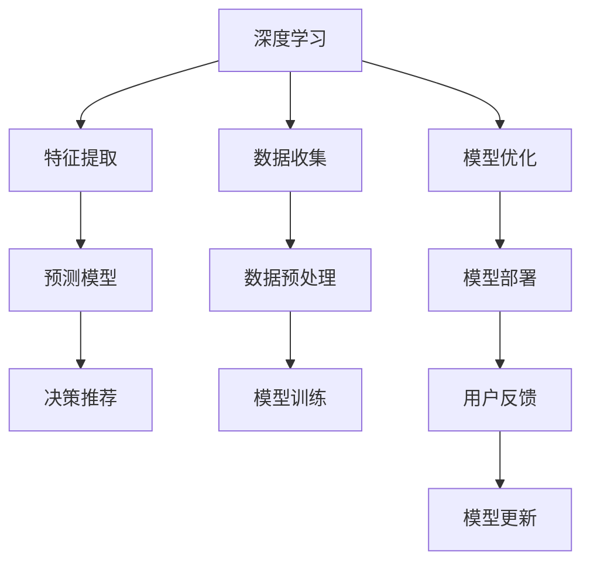

                 

# 欲望生态意识培养：AI驱动的可持续消费教育

## 1. 背景介绍

在当前全球化和技术驱动的社会中，人们的消费模式和价值观正经历着剧烈变革。一方面，人们享受着前所未有的物质丰盈，另一方面，环境污染、资源枯竭等生态问题日益严重。如何培养生态意识，推动可持续消费，已成为摆在我们面前的重大课题。AI技术，特别是深度学习，为解决这一问题提供了新的可能性。通过AI驱动的教育系统，我们可以更有效地传递环保理念，促进人们形成更加健康、绿色的消费习惯。

本文旨在探讨如何利用AI技术，特别是深度学习，来培养生态意识，推动可持续消费教育。我们将从背景介绍、核心概念、算法原理、实际操作、应用场景、工具和资源推荐、总结与发展展望等多个维度，全面梳理AI在可持续消费教育中的应用。

## 2. 核心概念与联系

### 2.1 核心概念概述

1. **深度学习（Deep Learning）**：一种基于神经网络的学习范式，通过多层次的非线性变换，实现对复杂数据的建模和预测。
2. **可持续消费（Sustainable Consumption）**：一种以环境保护和资源节约为核心原则的消费模式，强调减少资源消耗和环境污染。
3. **生态意识（Eco-consciousness）**：指人们对自然环境、资源保护和可持续发展问题的认识和重视程度。
4. **个性化教育（Personalized Education）**：根据每个学习者的特点和需求，提供定制化的学习内容和路径。
5. **情感计算（Affective Computing）**：研究如何通过计算和模拟人类情感，提升人机交互的情感体验和效果。

### 2.2 核心概念原理和架构的 Mermaid 流程图



该流程图展示了深度学习在可持续消费教育中的应用流程：

1. **数据收集**：从各种来源获取与可持续消费相关的数据。
2. **数据预处理**：对收集到的数据进行清洗、归一化等处理，为模型训练做准备。
3. **模型训练**：利用深度学习模型对预处理后的数据进行训练，学习到预测和分类任务的能力。
4. **模型优化**：通过超参数调整、模型剪枝等技术，提升模型的性能和泛化能力。
5. **模型部署**：将训练好的模型集成到教育系统中，提供实时反馈和建议。
6. **用户反馈**：收集用户使用过程中的反馈，进一步优化模型。
7. **模型更新**：根据新的数据和反馈，定期更新模型，保持其高效性和适应性。

## 3. 核心算法原理 & 具体操作步骤

### 3.1 算法原理概述

基于深度学习的可持续消费教育系统，通常包括特征提取、预测模型训练、决策推荐等多个步骤。其核心思想是通过学习历史消费数据，预测未来消费行为，并根据预测结果提供个性化推荐和反馈，最终引导用户形成可持续消费的生态意识。

### 3.2 算法步骤详解

1. **数据收集**：
   - 从社交媒体、电商平台、公共数据库等渠道，收集用户消费数据，包括购买记录、产品评价、用户行为等。
   - 收集环境影响数据，如碳排放、资源消耗、生态足迹等，作为环境指标。

2. **数据预处理**：
   - 清洗数据，去除噪声和异常值。
   - 进行数据归一化，确保各特征在同一尺度。
   - 数据增强，如数据平衡、数据合成等，提升模型泛化能力。

3. **特征提取**：
   - 使用深度学习模型（如卷积神经网络、循环神经网络等）对消费数据进行特征提取。
   - 提取的环境指标作为额外特征，加入模型训练。

4. **预测模型训练**：
   - 构建预测模型，如时间序列预测模型、回归模型等，预测用户的未来消费行为。
   - 使用深度学习框架（如TensorFlow、PyTorch）进行模型训练，优化损失函数。
   - 应用正则化技术，防止模型过拟合。

5. **决策推荐**：
   - 根据预测结果，设计推荐算法，推荐符合可持续消费原则的商品或服务。
   - 考虑用户的个性化需求和偏好，提供定制化的推荐。
   - 引入情感计算技术，提升推荐系统的情感亲和力。

### 3.3 算法优缺点

**优点**：
- 通过深度学习模型，可以从大量消费数据中提取有价值的信息，提升预测和推荐的准确性。
- 能够处理多种数据类型，如文本、图像、时间序列等，适应不同的数据需求。
- 通过个性化推荐，满足不同用户的需求，提高用户参与度和满意度。

**缺点**：
- 数据隐私问题：收集和处理用户数据可能涉及隐私问题，需要采取相应的隐私保护措施。
- 数据质量问题：数据收集和处理的质量直接影响到模型的效果，需要确保数据的准确性和完整性。
- 模型复杂度：深度学习模型通常较为复杂，训练和部署成本较高。

### 3.4 算法应用领域

AI驱动的可持续消费教育系统在多个领域具有广泛的应用前景：

- **电子商务**：为电商平台提供用户消费行为预测和个性化推荐，引导用户选择环保商品。
- **能源管理**：分析用户能源消耗数据，提供节能减排的建议。
- **环境监测**：结合卫星数据和传感器数据，监测环境变化，提供生态保护建议。
- **城市规划**：预测城市发展趋势，优化资源配置和规划，促进可持续发展。
- **健康管理**：分析用户健康数据，提供健康生活方式和可持续消费建议。

## 4. 数学模型和公式 & 详细讲解 & 举例说明

### 4.1 数学模型构建

我们以时间序列预测模型为例，构建可持续消费教育系统的数学模型。假设我们有历史消费数据 $x_t$，预测未来消费 $y_t$，则模型的目标是学习一个映射函数 $f$，使得 $y_t \approx f(x_t)$。

### 4.2 公式推导过程

假设 $x_t$ 为一维时间序列，$f$ 为预测模型，则模型的预测公式为：

$$
y_t = f(x_t) = W_h \tanh(W_x x_t + b_x) + b_h
$$

其中 $W_h$ 和 $b_h$ 为模型的隐藏层权重和偏置，$W_x$ 和 $b_x$ 为输入层权重和偏置。$\tanh$ 为激活函数。

### 4.3 案例分析与讲解

假设我们有一个电商平台，希望预测用户下一个月的消费金额，以优化库存管理和推荐系统。我们可以将用户的消费记录 $x_t$ 作为输入，预测下一个月的消费金额 $y_t$。模型训练时，可以采用均方误差作为损失函数，通过反向传播算法优化模型参数。

## 5. 项目实践：代码实例和详细解释说明

### 5.1 开发环境搭建

1. 安装Python：从官网下载并安装Python，确保版本为3.8及以上。
2. 安装TensorFlow和Keras：使用pip安装TensorFlow和Keras，确保安装版本兼容。
3. 准备数据集：收集和预处理数据集，确保数据质量和完整性。
4. 搭建环境：在虚拟环境中搭建TensorFlow和Keras环境，确保代码的运行环境一致。

### 5.2 源代码详细实现

```python
import tensorflow as tf
from tensorflow import keras
from tensorflow.keras import layers
import numpy as np

# 加载数据集
train_data = np.load('train_data.npy')
train_labels = np.load('train_labels.npy')
test_data = np.load('test_data.npy')
test_labels = np.load('test_labels.npy')

# 定义模型结构
model = keras.Sequential([
    layers.Dense(64, activation='relu', input_shape=(train_data.shape[1],)),
    layers.Dense(64, activation='relu'),
    layers.Dense(1)
])

# 编译模型
model.compile(optimizer='adam', loss='mse', metrics=['mae'])

# 训练模型
model.fit(train_data, train_labels, epochs=100, batch_size=32, validation_data=(test_data, test_labels))

# 预测测试数据
test_preds = model.predict(test_data)
```

### 5.3 代码解读与分析

1. 数据加载：使用NumPy加载训练和测试数据集。
2. 模型结构：定义包含两个隐藏层的神经网络，输出层为线性层，用于回归预测。
3. 模型编译：使用Adam优化器，均方误差作为损失函数，平均绝对误差作为评价指标。
4. 模型训练：使用训练数据集进行模型训练，设置100个epochs和32个batch size。
5. 模型预测：使用训练好的模型对测试数据进行预测。

## 6. 实际应用场景

### 6.1 电子商务

在电子商务领域，AI驱动的可持续消费教育系统可以显著提升用户体验和平台业绩。通过预测用户未来的消费行为，平台可以提前备货，优化库存管理。同时，根据用户的消费习惯和偏好，提供定制化的环保商品推荐，引导用户选择可持续产品，实现环保和商业的双赢。

### 6.2 能源管理

能源管理领域，AI驱动的可持续消费教育系统可以帮助用户优化能源使用，降低碳排放。通过分析用户的用电数据，系统可以预测未来的用电量，并提供节能减排的建议。例如，在用户即将使用大量电能时，系统可以提醒用户减少高耗能设备的开启时间，或者推荐使用可再生能源。

### 6.3 环境监测

在环境监测领域，AI驱动的可持续消费教育系统可以实时监测环境变化，提供生态保护建议。结合卫星数据和传感器数据，系统可以预测环境变化趋势，识别污染源，并提出相应的治理措施。例如，在发现某区域空气质量急剧下降时，系统可以提醒当地政府采取应急措施，减少污染物排放。

## 7. 工具和资源推荐

### 7.1 学习资源推荐

1. **《深度学习》（Ian Goodfellow 著）**：深度学习领域的经典教材，涵盖深度学习的基本概念和算法。
2. **Coursera 深度学习课程**：由深度学习专家Andrew Ng教授主讲的深度学习课程，适合初学者和进阶者。
3. **Kaggle**：数据科学竞赛平台，提供丰富的数据集和实战案例，适合学习和实践深度学习。
4. **GitHub**：开源社区，提供大量深度学习模型的代码实现和资源，适合学习和参考。

### 7.2 开发工具推荐

1. **TensorFlow**：由Google开发的深度学习框架，支持分布式计算和多种语言接口，适合大规模深度学习项目。
2. **PyTorch**：Facebook开发的深度学习框架，支持动态图和静态图，适合快速原型开发。
3. **Keras**：高层次的深度学习框架，提供简单易用的API，适合初学者快速上手。
4. **Jupyter Notebook**：交互式编程环境，支持Python、R等多种语言，适合数据分析和模型训练。
5. **Google Colab**：免费在线Jupyter Notebook环境，支持GPU和TPU，适合高性能计算任务。

### 7.3 相关论文推荐

1. **《深度学习在可持续消费中的应用》**：探讨深度学习在能源管理、环境监测、电子商务等领域的应用。
2. **《可持续消费的个性化推荐算法》**：介绍如何利用机器学习技术进行可持续消费个性化推荐。
3. **《基于情感计算的可持续消费教育系统》**：研究如何通过情感计算技术提升推荐系统的情感亲和力。

## 8. 总结：未来发展趋势与挑战

### 8.1 研究成果总结

通过AI驱动的可持续消费教育系统，我们已经初步探索了深度学习在推动可持续消费中的潜力。在电子商务、能源管理、环境监测等多个领域，AI技术展示了其在数据驱动决策、个性化推荐和情感计算方面的优势。

### 8.2 未来发展趋势

1. **模型集成**：未来的AI驱动系统将集成更多AI技术，如自然语言处理、计算机视觉等，实现多模态数据融合，提升系统的综合能力。
2. **边缘计算**：将AI模型部署在边缘设备上，实现实时数据处理和反馈，提高系统的响应速度和效率。
3. **联邦学习**：通过分布式数据训练，保护用户隐私，同时提升模型的泛化能力和适应性。
4. **伦理与隐私**：引入伦理和隐私保护机制，确保数据使用的合法性和透明性，提升用户信任度。

### 8.3 面临的挑战

1. **数据隐私**：如何在保护用户隐私的前提下，获取高质量的训练数据。
2. **模型可解释性**：如何使AI模型的决策过程透明化，提升用户对系统的信任。
3. **模型复杂度**：如何降低模型的复杂度，提升训练和推理的效率。
4. **模型公平性**：如何避免模型偏见，确保不同用户群体之间的公平性。

### 8.4 研究展望

未来，AI驱动的可持续消费教育系统将继续在多领域探索新的应用场景，如智能家居、智能交通等。同时，将更多地关注伦理和隐私保护，确保系统的合法性和公平性。通过技术的不断进步和创新，AI驱动的可持续消费教育系统将为全球的环保和可持续发展贡献更多力量。

## 9. 附录：常见问题与解答

**Q1: AI驱动的可持续消费教育系统如何确保数据隐私？**

A: AI驱动的可持续消费教育系统通过以下方式确保数据隐私：
1. **数据脱敏**：对敏感数据进行脱敏处理，确保数据不可逆识别。
2. **差分隐私**：在数据处理过程中加入噪声，保护用户隐私。
3. **联邦学习**：通过分布式数据训练，确保数据在本地处理，不传输原始数据。

**Q2: 为什么AI驱动的可持续消费教育系统需要引入情感计算？**

A: 引入情感计算可以提升AI系统的情感亲和力和用户体验。通过分析用户的情感状态，系统可以更准确地理解用户的真实需求和反馈，提供更加个性化的推荐和建议。同时，情感计算技术还可以提升人机交互的情感体验，使用户在使用系统时感到更加舒适和满意。

**Q3: 如何评估AI驱动的可持续消费教育系统的效果？**

A: 评估AI驱动的可持续消费教育系统的效果，可以从以下几个方面进行：
1. **准确性**：通过均方误差、平均绝对误差等指标，评估模型预测的准确性。
2. **个性化推荐效果**：通过用户满意度调查、转化率等指标，评估个性化推荐的实际效果。
3. **系统响应速度**：通过系统响应时间和延迟等指标，评估系统的实时性和效率。
4. **用户隐私保护**：通过隐私保护机制的合规性检查，评估数据使用的合法性。

**Q4: 如何处理AI驱动的可持续消费教育系统中的数据不平衡问题？**

A: 处理AI驱动的可持续消费教育系统中的数据不平衡问题，可以采用以下方法：
1. **数据增强**：通过数据合成、数据平衡等技术，增加少数类数据的数量。
2. **重采样**：通过过采样和欠采样等技术，调整数据分布。
3. **加权损失函数**：在损失函数中加入权重，对少数类数据给予更多关注。

作者：禅与计算机程序设计艺术 / Zen and the Art of Computer Programming

