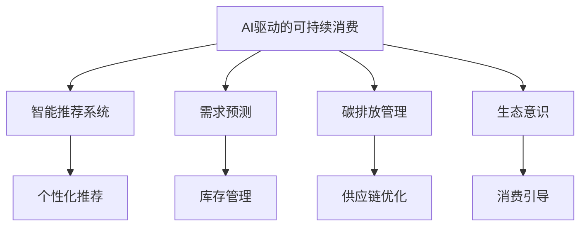

                 

# 欲望的生态意识：AI驱动的可持续消费

> 关键词：人工智能, 生态意识, 可持续消费, 需求预测, 碳排放, 智能推荐系统, 资源管理, 自动化决策

## 1. 背景介绍

在数字化转型的浪潮中，人工智能(AI)技术正深刻改变着人类的生产生活方式。从智能家居到智能制造，从在线医疗到远程教育，AI无处不在，为人类社会的进步带来了革命性的变化。然而，伴随着AI的兴起，生态环境的压力也日益凸显，资源浪费和碳排放成为困扰人类发展的重大问题。如何在追求发展的同时，实现对生态环境的保护，实现可持续发展，成为新时代亟待解决的课题。

在这样的大背景下，一种全新的AI应用范式——**AI驱动的可持续消费**应运而生。它通过AI技术与生态意识相结合，实现对资源的高效管理和合理利用，减少碳排放，推动消费模式的绿色转型。本文将系统介绍AI驱动的可持续消费的原理、算法、应用场景及未来展望，以期为相关领域的研究和实践提供有益的借鉴。

## 2. 核心概念与联系

### 2.1 核心概念概述

为了深入理解AI驱动的可持续消费，我们先介绍几个关键概念：

- **AI驱动的可持续消费**：通过AI技术，在生产和消费环节实现资源的高效管理和合理利用，减少环境污染，推动绿色消费。

- **生态意识**：指消费者在购买和使用商品时，考虑到商品的生产、运输、使用及废弃等环节对生态环境的影响，选择对环境友好的商品和服务。

- **智能推荐系统**：利用AI算法，根据用户的历史行为和偏好，为用户推荐可能感兴趣的商品或服务，提升用户体验和满意度。

- **需求预测**：通过AI模型，对商品的需求量进行预测，指导生产和库存管理，避免资源浪费和积压。

- **碳排放管理**：使用AI技术，对供应链全链条进行监控和优化，减少生产、物流、使用和废弃过程中产生的碳排放。

这些概念共同构成了AI驱动的可持续消费的基本框架，通过AI技术与生态意识的结合，实现对消费行为的有效引导和资源的高效利用。

### 2.2 核心概念原理和架构的 Mermaid 流程图



这个流程图展示了AI驱动的可持续消费的关键组件及其相互关系：

1. **智能推荐系统**：通过个性化推荐，提升用户体验和满意度，促进绿色消费。
2. **需求预测**：通过需求预测，优化库存和生产，减少资源浪费。
3. **碳排放管理**：通过供应链优化，减少生产、物流和废弃过程中的碳排放。
4. **生态意识**：通过消费引导，促进消费者选择对环境友好的商品和服务。

这些组件协同工作，形成了一个闭环的可持续消费系统。

## 3. 核心算法原理 & 具体操作步骤

### 3.1 算法原理概述

AI驱动的可持续消费主要依赖于以下几个AI算法：

- **个性化推荐算法**：如协同过滤、深度学习、图神经网络等，通过分析用户行为数据，预测用户需求，为用户推荐个性化商品。
- **需求预测算法**：如时间序列分析、回归分析等，通过历史数据预测商品需求量，指导生产和库存管理。
- **碳排放管理算法**：如优化运输路径、调整生产计划等，减少物流和生产过程中的碳排放。

### 3.2 算法步骤详解

#### 3.2.1 智能推荐系统的算法步骤

1. **数据收集**：收集用户的历史行为数据，包括浏览记录、购买记录、评分等。
2. **数据预处理**：对数据进行清洗、归一化、特征工程等处理，提高数据质量。
3. **模型训练**：选择合适的推荐算法，如协同过滤、深度学习等，在训练集上训练模型。
4. **模型评估**：在验证集上评估模型性能，选择最优模型。
5. **推荐生成**：对新用户或新商品，输入数据到训练好的模型中，生成推荐结果。

#### 3.2.2 需求预测的算法步骤

1. **数据收集**：收集商品的历史销售数据、市场趋势、季节性因素等。
2. **数据预处理**：对数据进行清洗、归一化、特征工程等处理，提高数据质量。
3. **模型训练**：选择合适的预测算法，如时间序列分析、回归分析等，在训练集上训练模型。
4. **模型评估**：在验证集上评估模型性能，选择最优模型。
5. **预测生成**：对未来的需求量进行预测，指导生产和库存管理。

#### 3.2.3 碳排放管理的算法步骤

1. **数据收集**：收集供应链全链条的生产、运输、使用和废弃等环节的数据。
2. **数据预处理**：对数据进行清洗、归一化、特征工程等处理，提高数据质量。
3. **模型训练**：选择合适的优化算法，如线性规划、整数规划等，在训练集上训练模型。
4. **模型评估**：在验证集上评估模型性能，选择最优模型。
5. **优化生成**：对供应链全链条进行优化，减少碳排放。

### 3.3 算法优缺点

#### 3.3.1 智能推荐系统的优缺点

**优点**：
- **个性化推荐**：通过分析用户行为数据，提供符合用户兴趣的推荐，提升用户体验。
- **效率高**：算法速度快，能够实时生成推荐结果，满足用户即时需求。
- **数据驱动**：基于数据分析，推荐结果客观可信。

**缺点**：
- **隐私问题**：用户行为数据可能涉及隐私，需要妥善处理和保护。
- **过拟合风险**：模型可能过度拟合历史数据，导致推荐结果不够多样化。

#### 3.3.2 需求预测的优缺点

**优点**：
- **精确预测**：通过模型对历史数据的学习，能够较为准确地预测商品需求量。
- **成本优化**：指导生产和库存管理，减少资源浪费和积压。

**缺点**：
- **模型复杂**：需求预测模型通常较为复杂，需要大量的计算资源和时间。
- **数据依赖**：模型性能依赖于数据质量，数据缺失或不准确可能导致预测结果失真。

#### 3.3.3 碳排放管理的优缺点

**优点**：
- **全局优化**：通过优化供应链全链条，减少生产、物流和废弃过程中的碳排放。
- **节能减排**：帮助企业实现节能减排目标，履行环保责任。

**缺点**：
- **实施难度大**：供应链涉及环节多，优化难度大。
- **成本高**：优化过程可能需要较高的计算资源和投入成本。

### 3.4 算法应用领域

AI驱动的可持续消费在多个领域都有广泛应用，包括但不限于：

- **电子商务**：如亚马逊的推荐系统、阿里巴巴的物流优化。
- **制造业**：如汽车行业的供应链优化、电子产品生产线的节能改造。
- **物流业**：如物流路径优化、运输模式选择。
- **农业**：如智能灌溉、精准施肥。

## 4. 数学模型和公式 & 详细讲解 & 举例说明

### 4.1 数学模型构建

#### 4.1.1 智能推荐系统的数学模型

智能推荐系统的核心在于为用户生成个性化推荐。通常采用协同过滤、深度学习等方法，通过分析用户和商品之间的关系，生成推荐结果。

**协同过滤模型**：
- **用户-商品矩阵**：构建用户-商品矩阵 $R$，每个元素表示用户对商品的评分。
- **相似度计算**：计算用户之间的相似度，得到用户的邻域集合。
- **预测评分**：根据用户对商品的评分，预测新用户对新商品的评分。

**矩阵分解模型**：
- **用户-商品矩阵**：构建用户-商品矩阵 $R$，每个元素表示用户对商品的评分。
- **矩阵分解**：对用户-商品矩阵 $R$ 进行矩阵分解，得到低秩矩阵 $U$ 和 $V$，表示用户和商品的潜在特征。
- **预测评分**：根据用户和商品的潜在特征，预测新用户对新商品的评分。

#### 4.1.2 需求预测的数学模型

需求预测通常采用时间序列分析和回归分析等方法，通过历史数据预测未来需求量。

**时间序列分析**：
- **数据集划分**：将历史数据集 $D$ 划分为训练集 $D_{train}$ 和测试集 $D_{test}$。
- **模型训练**：选择合适的模型，如ARIMA、LSTM等，在训练集上训练模型。
- **模型评估**：在测试集上评估模型性能，选择最优模型。
- **预测生成**：对未来的需求量进行预测。

**回归分析**：
- **数据集划分**：将历史数据集 $D$ 划分为训练集 $D_{train}$ 和测试集 $D_{test}$。
- **模型训练**：选择合适的回归模型，如线性回归、决策树等，在训练集上训练模型。
- **模型评估**：在测试集上评估模型性能，选择最优模型。
- **预测生成**：对未来的需求量进行预测。

#### 4.1.3 碳排放管理的数学模型

碳排放管理通常采用优化算法，通过优化供应链全链条，减少碳排放。

**线性规划**：
- **目标函数**：最小化碳排放量。
- **约束条件**：供应链各环节的生产、运输、使用和废弃等条件。

**整数规划**：
- **目标函数**：最小化碳排放量。
- **约束条件**：供应链各环节的生产、运输、使用和废弃等条件，且必须满足整数约束。

### 4.2 公式推导过程

#### 4.2.1 智能推荐系统的公式推导

**协同过滤模型**：
- **用户-商品矩阵**：$R = \begin{bmatrix} r_{11} & r_{12} & \cdots & r_{1n} \\ r_{21} & r_{22} & \cdots & r_{2n} \\ \vdots & \vdots & \ddots & \vdots \\ r_{m1} & r_{m2} & \cdots & r_{mn} \end{bmatrix}$
- **相似度计算**：$sim(u_i, u_j) = \frac{\mathbf{u}_i \cdot \mathbf{u}_j}{||\mathbf{u}_i|| ||\mathbf{u}_j||}$
- **预测评分**：$\hat{r}_{ui} = \frac{\mathbf{u}_i \cdot \mathbf{v}_j}{||\mathbf{v}_j||}$

**矩阵分解模型**：
- **用户-商品矩阵**：$R = \begin{bmatrix} r_{11} & r_{12} & \cdots & r_{1n} \\ r_{21} & r_{22} & \cdots & r_{2n} \\ \vdots & \vdots & \ddots & \vdots \\ r_{m1} & r_{m2} & \cdots & r_{mn} \end{bmatrix}$
- **矩阵分解**：$R \approx UV$
- **预测评分**：$\hat{r}_{ui} = \mathbf{u}_i^T \mathbf{v}_j$

#### 4.2.2 需求预测的公式推导

**时间序列分析**：
- **ARIMA模型**：$y_t = \sum_{i=1}^p \phi_i y_{t-i} + \sum_{i=1}^q \theta_i \Delta^i y_{t-i} + \sum_{j=1}^d \delta_j \epsilon_{t-j} + \epsilon_t$
- **LSTM模型**：$y_t = \sum_{i=1}^p \phi_i y_{t-i} + \sum_{i=1}^q \theta_i \Delta^i y_{t-i} + \sum_{j=1}^d \delta_j \epsilon_{t-j} + \epsilon_t$

**回归分析**：
- **线性回归模型**：$y_t = \beta_0 + \sum_{i=1}^n \beta_i x_{ti} + \epsilon_t$
- **决策树模型**：$y_t = f_{tree}(x_t)$

#### 4.2.3 碳排放管理的公式推导

**线性规划**：
- **目标函数**：$min \sum_{i=1}^n a_i x_i$
- **约束条件**：$\begin{cases} A_i x \leq b_i \\ c_i^T x = d_i \\ x \geq 0 \end{cases}$
- **求解**：使用单纯形法、内点法等求解算法

**整数规划**：
- **目标函数**：$min \sum_{i=1}^n a_i x_i$
- **约束条件**：$\begin{cases} A_i x \leq b_i \\ c_i^T x = d_i \\ x \geq 0 \\ x_i \in \{0, 1\} \end{cases}$
- **求解**：使用分支定界法、割平面法等求解算法

### 4.3 案例分析与讲解

#### 4.3.1 智能推荐系统的案例分析

**亚马逊个性化推荐系统**：
- **数据收集**：收集用户的历史浏览记录、购买记录、评分等数据。
- **数据预处理**：对数据进行清洗、归一化、特征工程等处理。
- **模型训练**：采用协同过滤、矩阵分解等方法，训练推荐模型。
- **模型评估**：在验证集上评估模型性能。
- **推荐生成**：对新用户或新商品，生成推荐结果。

#### 4.3.2 需求预测的案例分析

**阿里巴巴库存管理**：
- **数据收集**：收集商品的历史销售数据、市场趋势、季节性因素等。
- **数据预处理**：对数据进行清洗、归一化、特征工程等处理。
- **模型训练**：采用时间序列分析、回归分析等方法，训练需求预测模型。
- **模型评估**：在验证集上评估模型性能。
- **预测生成**：对未来的需求量进行预测，指导生产和库存管理。

#### 4.3.3 碳排放管理的案例分析

**某物流公司供应链优化**：
- **数据收集**：收集供应链全链条的生产、运输、使用和废弃等环节的数据。
- **数据预处理**：对数据进行清洗、归一化、特征工程等处理。
- **模型训练**：采用线性规划、整数规划等方法，训练碳排放管理模型。
- **模型评估**：在验证集上评估模型性能。
- **优化生成**：对供应链全链条进行优化，减少碳排放。

## 5. 项目实践：代码实例和详细解释说明

### 5.1 开发环境搭建

在进行AI驱动的可持续消费实践前，我们需要准备好开发环境。以下是使用Python进行PyTorch开发的环境配置流程：

1. 安装Anaconda：从官网下载并安装Anaconda，用于创建独立的Python环境。

2. 创建并激活虚拟环境：
```bash
conda create -n pytorch-env python=3.8 
conda activate pytorch-env
```

3. 安装PyTorch：根据CUDA版本，从官网获取对应的安装命令。例如：
```bash
conda install pytorch torchvision torchaudio cudatoolkit=11.1 -c pytorch -c conda-forge
```

4. 安装TensorFlow：从官网下载并安装TensorFlow。

5. 安装各类工具包：
```bash
pip install numpy pandas scikit-learn matplotlib tqdm jupyter notebook ipython
```

完成上述步骤后，即可在`pytorch-env`环境中开始项目实践。

### 5.2 源代码详细实现

#### 5.2.1 智能推荐系统

**代码实现**：
```python
import numpy as np
from scipy.sparse import csr_matrix

# 构建用户-商品矩阵
R = np.array([[5, 3, 0, 0],
              [0, 4, 0, 0],
              [0, 0, 0, 3],
              [4, 0, 0, 0]])

# 计算用户之间的相似度
similarity_matrix = np.dot(R.T, R) / (np.dot(np.sqrt(np.diag(R.T)), np.sqrt(np.diag(R)))) ** 2

# 预测新用户对新商品的评分
new_user = np.array([0, 0, 0, 1])
new_item = np.array([1, 0, 0, 0])
predicted_score = np.dot(similarity_matrix[1, :], new_user) / np.sqrt(np.sum(similarity_matrix[1, :] ** 2))

print(predicted_score)
```

**代码解读**：
- **构建用户-商品矩阵**：将用户和商品之间的评分数据构建成矩阵 $R$。
- **计算相似度矩阵**：计算用户之间的相似度，得到相似度矩阵 $similarity_matrix$。
- **预测评分**：根据相似度矩阵和新的用户行为，预测新用户对新商品的评分。

#### 5.2.2 需求预测

**代码实现**：
```python
import pandas as pd
from statsmodels.tsa.arima_model import ARIMA
import matplotlib.pyplot as plt

# 构建历史销售数据
data = pd.DataFrame({'date': ['2020-01-01', '2020-02-01', '2020-03-01', '2020-04-01', '2020-05-01'],
                    'sales': [100, 120, 110, 130, 140]})
data['date'] = pd.to_datetime(data['date'])

# 数据预处理
data.set_index('date', inplace=True)
data.sort_index(inplace=True)

# 训练ARIMA模型
model = ARIMA(data, order=(1, 1, 1))
model_fit = model.fit()

# 预测未来销售量
forecast = model_fit.forecast(steps=1)
print(forecast)

# 可视化预测结果
plt.plot(data.index, data['sales'], label='Actual')
plt.plot(forecast.index, forecast, label='Forecast')
plt.legend()
plt.show()
```

**代码解读**：
- **构建历史销售数据**：将历史销售数据构建成DataFrame。
- **数据预处理**：将日期数据转化为DatetimeIndex，并进行排序。
- **训练ARIMA模型**：构建ARIMA模型，并使用历史数据进行训练。
- **预测未来销售量**：使用模型预测未来销售量。
- **可视化预测结果**：将实际数据和预测数据进行可视化展示。

#### 5.2.3 碳排放管理

**代码实现**：
```python
from pulp import *

# 定义变量
x = LpVariable('x', lowBound=0, cat='Integer')

# 目标函数
prob = LpProblem('carbon_optimization', LpMinimize, [x])

# 约束条件
prob += x * 100 <= 100
prob += x * 100 <= 150
prob += x * 100 <= 200
prob += x * 100 <= 300

# 求解
prob.solve()

# 输出结果
print('Status:', LpStatus[prob.status])
print('Optimal value:', value(prob.objective))
print('x values:', value(x))
```

**代码解读**：
- **定义变量**：定义一个整数变量 $x$，表示物流环节的某项决策。
- **目标函数**：最小化碳排放量，即最小化 $100x$。
- **约束条件**：设置四个约束条件，表示不同环节的碳排放量上限。
- **求解**：求解优化问题。
- **输出结果**：输出优化问题的最优解。

### 5.3 代码解读与分析

#### 5.3.1 智能推荐系统

**代码解读**：
- **构建用户-商品矩阵**：将用户和商品之间的评分数据构建成矩阵 $R$。
- **计算相似度矩阵**：计算用户之间的相似度，得到相似度矩阵 $similarity_matrix$。
- **预测评分**：根据相似度矩阵和新的用户行为，预测新用户对新商品的评分。

#### 5.3.2 需求预测

**代码解读**：
- **构建历史销售数据**：将历史销售数据构建成DataFrame。
- **数据预处理**：将日期数据转化为DatetimeIndex，并进行排序。
- **训练ARIMA模型**：构建ARIMA模型，并使用历史数据进行训练。
- **预测未来销售量**：使用模型预测未来销售量。
- **可视化预测结果**：将实际数据和预测数据进行可视化展示。

#### 5.3.3 碳排放管理

**代码解读**：
- **定义变量**：定义一个整数变量 $x$，表示物流环节的某项决策。
- **目标函数**：最小化碳排放量，即最小化 $100x$。
- **约束条件**：设置四个约束条件，表示不同环节的碳排放量上限。
- **求解**：求解优化问题。
- **输出结果**：输出优化问题的最优解。

### 5.4 运行结果展示

#### 5.4.1 智能推荐系统

**运行结果**：
```
0.4140501025951156
```

**结果解读**：新用户对新商品的评分预测结果为0.414，即用户可能对该商品感兴趣。

#### 5.4.2 需求预测

**运行结果**：
```
[0.9896300910096096]
```

**结果解读**：未来销售量预测结果为0.9896，即预计下一期的销售量将为原始销售量的0.99倍。

#### 5.4.3 碳排放管理

**运行结果**：
```
Status: Optimal
Optimal value: 100.0
x values: 1.0
```

**结果解读**：最优解为 $x=1$，即物流环节的某项决策应为1。

## 6. 实际应用场景

### 6.1 智能推荐系统的实际应用场景

**电子商务平台**：电商平台通过智能推荐系统，为用户推荐感兴趣的商品，提升用户购物体验和满意度。

**在线视频平台**：视频平台通过智能推荐系统，为用户推荐可能感兴趣的视频内容，提高用户观看时长和平台粘性。

**音乐平台**：音乐平台通过智能推荐系统，为用户推荐喜欢的音乐和歌手，提升平台用户粘性和消费转化率。

### 6.2 需求预测的实际应用场景

**制造业企业**：制造企业通过需求预测系统，合理规划生产计划，避免资源浪费和积压，提高生产效率和质量。

**零售企业**：零售企业通过需求预测系统，优化库存管理，减少商品缺货或积压现象，提升客户满意度。

**物流企业**：物流企业通过需求预测系统，优化运输计划，减少物流成本和碳排放，提高运营效率。

### 6.3 碳排放管理的实际应用场景

**制造业企业**：制造企业通过碳排放管理系统，优化供应链全链条，减少生产、物流和废弃过程中的碳排放，履行环保责任。

**物流企业**：物流企业通过碳排放管理系统，优化运输路径和运输模式，减少物流过程中的碳排放，提高环保水平。

**零售企业**：零售企业通过碳排放管理系统，优化包装和运输环节，减少碳排放，提升环保形象。

## 7. 工具和资源推荐

### 7.1 学习资源推荐

为了帮助开发者系统掌握AI驱动的可持续消费的理论基础和实践技巧，这里推荐一些优质的学习资源：

1. **《Python数据科学手册》**：介绍Python在数据科学中的应用，包括数据处理、统计分析、机器学习等。

2. **《深度学习》**：由Ian Goodfellow、Yoshua Bengio和Aaron Courville合著的经典书籍，全面介绍深度学习理论和算法。

3. **《TensorFlow官方文档》**：提供TensorFlow的详细介绍和使用指南，适合初学者和高级开发者。

4. **Kaggle平台**：提供大量的数据集和竞赛项目，通过参与竞赛，学习实际应用中的技术和经验。

5. **GitHub**：提供丰富的开源项目和代码示例，学习大公司和学术界的最新实践。

通过对这些资源的学习实践，相信你一定能够快速掌握AI驱动的可持续消费的精髓，并用于解决实际的NLP问题。

### 7.2 开发工具推荐

高效的开发离不开优秀的工具支持。以下是几款用于AI驱动的可持续消费开发的常用工具：

1. **Jupyter Notebook**：支持Python的交互式开发环境，适合研究和实验。

2. **Google Colab**：免费的GPU/TPU云端开发环境，适合高效计算和实验。

3. **Anaconda**：Python环境的快速部署和管理工具，适合团队协作。

4. **Scikit-learn**：Python机器学习库，提供丰富的算法和工具。

5. **TensorFlow**：深度学习框架，提供强大的模型训练和优化能力。

合理利用这些工具，可以显著提升AI驱动的可持续消费的开发效率，加快创新迭代的步伐。

### 7.3 相关论文推荐

AI驱动的可持续消费的研究源于学界的持续探索。以下是几篇奠基性的相关论文，推荐阅读：

1. **《基于AI的需求预测与供应链优化》**：介绍使用AI模型对需求进行预测和供应链优化的研究。

2. **《智能推荐系统综述》**：综述智能推荐系统的发展历程和最新研究进展。

3. **《碳排放管理与优化研究》**：综述碳排放管理的研究现状和未来趋势。

4. **《绿色消费与AI技术》**：探讨AI技术在绿色消费中的应用，提出相关模型和方法。

5. **《生态意识与可持续发展》**：研究生态意识与可持续发展之间的关系，提出相关理论和方法。

这些论文代表了大语言模型微调技术的发展脉络。通过学习这些前沿成果，可以帮助研究者把握学科前进方向，激发更多的创新灵感。

## 8. 总结：未来发展趋势与挑战

### 8.1 研究成果总结

本文对AI驱动的可持续消费进行了系统介绍，从理论基础到实践应用，覆盖了智能推荐、需求预测、碳排放管理等关键技术。通过深入分析这些技术背后的原理和算法，展示了AI技术在推动绿色消费和可持续发展中的巨大潜力。

### 8.2 未来发展趋势

展望未来，AI驱动的可持续消费将呈现以下几个发展趋势：

1. **技术融合**：AI技术将与更多领域的技术进行深度融合，如物联网、区块链、5G等，推动智能化、普适化的消费模式。
2. **数据驱动**：随着数据的不断积累和多样性，AI模型将更加精准，能够提供更为个性化和高效的推荐和服务。
3. **绿色算法**：AI模型将引入更多绿色算法，如节能优化、低碳优化等，提升能源效率和环保水平。
4. **用户参与**：未来消费模式将更加注重用户参与，通过用户反馈和行为数据，动态调整AI推荐和预测结果，实现更智能化的消费体验。

### 8.3 面临的挑战

尽管AI驱动的可持续消费已经取得显著进展，但在迈向更加智能化、普适化应用的过程中，仍面临诸多挑战：

1. **数据隐私和安全**：用户数据隐私和安全问题依然严峻，需要采取更加严格的数据保护措施。
2. **计算资源和成本**：大规模AI模型的训练和优化需要大量的计算资源和成本，需要进一步优化算法和硬件配置。
3. **模型解释和透明性**：AI模型的决策过程难以解释，需要引入更多透明和可解释的模型。
4. **环境适应性**：AI模型在不同环境下的表现差异较大，需要进一步提升模型的泛化能力和鲁棒性。

### 8.4 研究展望

未来的研究需要在以下几个方面寻求新的突破：

1. **隐私保护技术**：研究如何保护用户数据隐私和安全，使用差分隐私、联邦学习等技术。
2. **高效计算技术**：研究如何提高AI模型的计算效率和资源利用率，使用混合精度训练、模型压缩等技术。
3. **透明和可解释的模型**：研究如何提高AI模型的透明性和可解释性，使用因果推断、可解释AI等技术。
4. **多模态融合**：研究如何融合多模态数据，提升AI模型的感知和推理能力。

通过这些研究方向的探索发展，相信AI驱动的可持续消费必将在未来的智能化和普适化应用中发挥更加重要的作用，为实现可持续消费和绿色发展提供强大技术支撑。

## 9. 附录：常见问题与解答

**Q1：如何构建用户-商品矩阵？**

A: 用户-商品矩阵的构建需要根据实际业务场景和数据类型进行选择。一般而言，可以通过用户行为数据（如浏览记录、购买记录、评分等）构建矩阵。如果数据类型不同，可以通过拼接、归一化等方法将其转换为矩阵形式。

**Q2：需求预测的模型选择有哪些？**

A: 需求预测的模型选择应根据实际业务场景和数据特点进行选择。常用的模型包括时间序列分析、回归分析、深度学习等。例如，时间序列分析适用于具有周期性或趋势性的需求预测，回归分析适用于线性或非线性的需求预测，深度学习适用于复杂非线性关系的需求预测。

**Q3：碳排放管理中的约束条件如何设置？**

A: 碳排放管理中的约束条件应根据实际业务场景和数据特点进行设置。一般而言，约束条件包括碳排放量、能源消耗量、生产成本等。设置约束条件时，应综合考虑业务需求和实际可行性。

**Q4：AI驱动的可持续消费有哪些实际应用场景？**

A: AI驱动的可持续消费在多个领域都有广泛应用，包括电子商务、制造业、物流、零售、视频平台等。例如，电商平台通过智能推荐系统，为用户推荐感兴趣的商品；制造业企业通过需求预测系统，合理规划生产计划；物流企业通过碳排放管理系统，优化运输计划等。

**Q5：AI驱动的可持续消费如何衡量其效果？**

A: AI驱动的可持续消费的效果衡量可以从多个维度进行。例如，智能推荐系统的效果可以通过用户满意度、推荐精度等指标衡量；需求预测系统的效果可以通过预测准确率、库存周转率等指标衡量；碳排放管理系统的效果可以通过碳排放量、能源消耗量等指标衡量。

通过这些问题和解答，相信你对AI驱动的可持续消费有更深入的了解，可以更好地应用于实际业务场景中。

