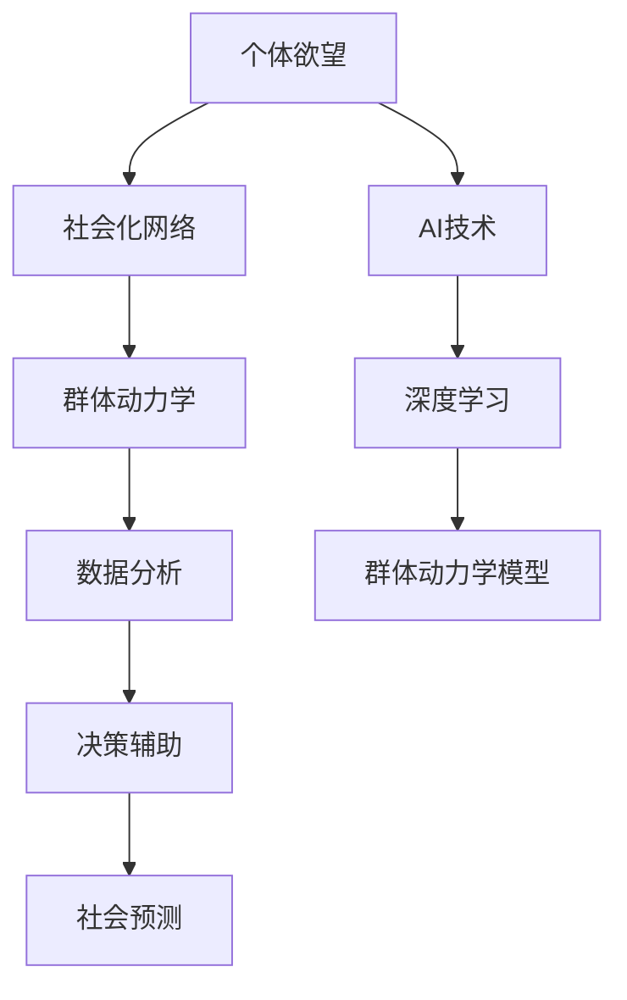

                 

# 欲望社会化网络分析师：AI驱动的群体动力学平台研究员

> 关键词：欲望社会化网络, 群体动力学平台, 数据分析, AI技术, 决策辅助, 社会预测

## 1. 背景介绍

### 1.1 问题由来

在现代社会中，个体欲望与社会化网络之间的关系，以及这种关系对群体行为的影响，是一个复杂且多维度的研究领域。传统上，这一研究依赖于人工数据采集和定量分析，难以捕捉到个体欲望与社会化网络动态交互的微妙关系。近年来，随着人工智能（AI）和大数据分析技术的发展，利用AI技术对欲望和社会化网络进行分析变得越来越可行。

AI驱动的群体动力学平台为这一研究提供了新的工具和方法。通过深度学习模型和群体动力学模型，研究人员能够从海量的社会化网络数据中挖掘出个体欲望与群体行为的关联，揭示欲望传播、群体形成的机制。这些研究成果不仅能帮助我们更好地理解人类社会行为，还可以应用于决策辅助和社会预测等领域。

### 1.2 问题核心关键点

本研究的核心在于利用AI技术，特别是深度学习和群体动力学模型，分析个体欲望与社会化网络之间的关系，并构建AI驱动的群体动力学平台，以实现对社会化网络中个体欲望的深入理解。该平台能够从大规模的社会化网络数据中，提炼出个体欲望与群体行为的动态模式，并提供决策支持和群体行为预测。

本研究的关键点包括：
1. 个体欲望与社会化网络之间的动态关系建模。
2. 使用深度学习模型从海量社会化网络数据中提取个体欲望的特征。
3. 基于群体动力学模型的群体行为预测和决策辅助。

## 2. 核心概念与联系

### 2.1 核心概念概述

为更好地理解基于AI的群体动力学平台，本节将介绍几个关键概念及其相互之间的联系：

1. **个体欲望 (Individual Desire)**：指个体的内在需求和动机，包括情感、兴趣、目标等。
2. **社会化网络 (Social Network)**：指个体之间的社会关系网络，如朋友关系、家庭关系、社交媒体连接等。
3. **群体动力学 (Group Dynamics)**：研究群体成员之间的交互和关系，以及这些交互对群体行为的影响。
4. **数据分析 (Data Analysis)**：从原始数据中提取有用信息的过程，包括数据清洗、特征工程、模型训练等。
5. **决策辅助 (Decision Support)**：使用数据分析结果，为决策者提供依据，辅助决策过程。
6. **社会预测 (Social Prediction)**：使用群体动力学模型和数据分析结果，预测群体行为和社会发展趋势。

这些概念之间的逻辑关系可以通过以下Mermaid流程图来展示：



这个流程图展示了从个体欲望到社会预测的整个研究过程，以及其中各个概念的相互联系。其中，AI技术是整个平台的核心，深度学习和群体动力学模型是实现这一过程的重要工具。

## 3. 核心算法原理 & 具体操作步骤

### 3.1 算法原理概述

基于AI的群体动力学平台，通过深度学习模型和群体动力学模型，从个体欲望与社会化网络的动态交互中提取信息，并进行群体行为预测和决策辅助。该平台的算法原理主要包括以下几个步骤：

1. **数据预处理**：对原始社会化网络数据进行清洗、归一化和特征提取。
2. **个体欲望特征提取**：使用深度学习模型，如卷积神经网络（CNN）、循环神经网络（RNN）或变分自编码器（VAE），从个体行为数据中提取欲望特征。
3. **群体动力学建模**：基于群体动力学模型，如Agent-Based Model (ABM)或SIR模型，模拟个体欲望传播和群体行为的形成。
4. **群体行为预测**：通过历史数据分析和群体动力学模型，预测群体行为的变化趋势。
5. **决策辅助**：使用预测结果和群体行为模式，辅助决策者做出更加明智的决策。

### 3.2 算法步骤详解

下面详细介绍基于AI的群体动力学平台的算法步骤：

**Step 1: 数据预处理**
- 数据清洗：删除缺失值和异常值，确保数据质量。
- 归一化：将数据缩放到[0,1]或[-1,1]区间，方便模型处理。
- 特征提取：选择与个体欲望相关的特征，如用户行为、社交网络度数等。

**Step 2: 个体欲望特征提取**
- 选择深度学习模型，如CNN、RNN或VAE，构建欲望特征提取器。
- 使用训练数据训练模型，提取个体欲望特征。
- 在测试数据上评估模型性能，如准确率、召回率等。

**Step 3: 群体动力学建模**
- 选择适合的群体动力学模型，如ABM或SIR模型，构建群体动力学模拟器。
- 定义模型中的个体和群体行为规则。
- 在模拟环境中运行模型，观察个体欲望传播和群体行为的变化。

**Step 4: 群体行为预测**
- 分析历史数据，提取群体行为模式。
- 使用群体动力学模型，预测群体行为的变化趋势。
- 结合实际观测数据，调整预测模型，提高预测精度。

**Step 5: 决策辅助**
- 将预测结果和群体行为模式转换为决策依据。
- 提供决策建议，如采取措施控制群体行为变化。
- 不断反馈预测结果和决策效果，优化模型。

### 3.3 算法优缺点

基于AI的群体动力学平台具有以下优点：
1. 自动化数据分析：深度学习模型可以自动从大规模数据中提取有用特征，减少人工干预。
2. 群体行为预测：群体动力学模型可以模拟个体欲望的传播和群体行为的形成，提供预测支持。
3. 决策辅助：基于数据分析和预测结果，为决策者提供决策依据，提高决策效率。

然而，该平台也存在一些局限性：
1. 数据依赖：平台依赖于高质量的社会化网络数据，数据质量差会影响分析结果。
2. 模型复杂性：深度学习和群体动力学模型较为复杂，需要专业知识进行设计和调参。
3. 解释性不足：模型预测结果难以解释，可能缺乏透明度。
4. 应用范围受限：平台目前主要应用于线上社交网络，对其他领域的应用尚需探索。

尽管存在这些局限性，但基于AI的群体动力学平台已经展示了其在群体行为分析和社会预测方面的潜力，成为社会动力学研究的重要工具。

### 3.4 算法应用领域

基于AI的群体动力学平台可以应用于多个领域，包括但不限于：

1. **社交媒体分析**：分析用户在社交媒体上的行为和欲望，预测社交趋势，辅助广告投放和内容推荐。
2. **公共健康管理**：预测疾病传播趋势，辅助制定公共卫生政策，如疫苗接种、疫情监测等。
3. **金融市场分析**：分析投资者行为和市场动态，预测市场变化，辅助投资决策。
4. **城市规划**：预测人口流动和群体行为变化，辅助城市规划和管理。
5. **消费行为预测**：分析消费者行为和欲望，预测消费趋势，辅助零售和营销策略。

这些应用领域展示了基于AI的群体动力学平台的广泛应用前景，为社会各个领域带来了新的分析工具和决策支持。

## 4. 数学模型和公式 & 详细讲解  
### 4.1 数学模型构建

本节将使用数学语言对基于AI的群体动力学平台的构建过程进行更加严格的刻画。

设社会化网络数据为 $D=\{(x_i,y_i)\}_{i=1}^N$，其中 $x_i$ 为个体行为特征向量，$y_i$ 为社会化网络度数。设个体欲望特征提取模型为 $f(x_i;\theta)$，群体动力学模型为 $g(x_i,t)$，预测模型为 $h(x_i,t;\theta)$。

**Step 1: 数据预处理**
- 数据清洗：$x_i=\text{clean}(x_i)$
- 归一化：$x_i=\text{normalize}(x_i)$
- 特征提取：$x_i=\text{feature\_extract}(x_i)$

**Step 2: 个体欲望特征提取**
- 深度学习模型：$f(x_i;\theta)=f_\text{CNN/RNN/VAE}(x_i;\theta)$

**Step 3: 群体动力学建模**
- 群体动力学模型：$g(x_i,t)=g_\text{ABM/SIR}(x_i,t;\alpha,\beta,\gamma)$

**Step 4: 群体行为预测**
- 历史数据分析：$\tilde{x}_i=\text{analyze\_history}(x_i)$
- 群体动力学模型：$h(x_i,t;\theta)=h_\text{ABM/SIR}(x_i,t;\alpha,\beta,\gamma)$

**Step 5: 决策辅助**
- 决策建议：$s(t;\theta)=\text{decision\_suggestion}(g(x_i,t),h(x_i,t;\theta))$

### 4.2 公式推导过程

以下我们以社交媒体分析为例，推导基于AI的群体动力学平台的数学模型。

**Step 1: 数据预处理**
- 数据清洗：$x_i=\text{clean}(x_i)$
- 归一化：$x_i=\text{normalize}(x_i)$
- 特征提取：$x_i=\text{feature\_extract}(x_i)$

**Step 2: 个体欲望特征提取**
- 使用CNN模型提取个体行为特征：$f_\text{CNN}(x_i;\theta)=[f_\text{CNN}^1(x_i;\theta),f_\text{CNN}^2(x_i;\theta),\ldots,f_\text{CNN}^k(x_i;\theta)]$
- 使用RNN模型处理时间序列数据：$f_\text{RNN}(x_i;\theta)=f_\text{RNN}^t(x_i;\theta)$

**Step 3: 群体动力学建模**
- 使用ABM模型模拟个体欲望传播：$g_\text{ABM}(x_i,t;\alpha,\beta,\gamma)=\sum_{j=1}^n \alpha(x_i,t,x_j,t-1)f_\text{CNN}(x_j,t-1;\theta)$
- 使用SIR模型预测疾病传播：$g_\text{SIR}(x_i,t;\alpha,\beta,\gamma)=\frac{\beta g_\text{SIR}(x_i,t-1;\alpha,\beta,\gamma)}{1-\frac{\gamma}{N}g_\text{SIR}(x_i,t-1;\alpha,\beta,\gamma)}$

**Step 4: 群体行为预测**
- 历史数据分析：$\tilde{x}_i=\text{analyze\_history}(x_i)$
- 使用ABM模型预测群体行为：$h_\text{ABM}(x_i,t;\alpha,\beta,\gamma)=\sum_{j=1}^n \alpha h_\text{ABM}(x_j,t-1;\alpha,\beta,\gamma)f_\text{CNN}(x_j,t-1;\theta)$
- 使用SIR模型预测疾病传播：$h_\text{SIR}(x_i,t;\alpha,\beta,\gamma)=\frac{\beta h_\text{SIR}(x_i,t-1;\alpha,\beta,\gamma)}{1-\frac{\gamma}{N}h_\text{SIR}(x_i,t-1;\alpha,\beta,\gamma)}$

### 4.3 案例分析与讲解

以社交媒体分析为例，展示基于AI的群体动力学平台的实际应用。

假设我们有一组社交媒体数据，其中包含用户的点赞、评论、分享等行为特征，以及用户的社交网络度数。我们的目标是预测下一个时间段内，某个特定话题的传播趋势。

1. **数据预处理**：首先对数据进行清洗，删除缺失值和异常值。然后对用户行为特征进行归一化，处理为[0,1]区间。最后选择与话题传播相关的特征，如点赞次数、评论次数等。

2. **个体欲望特征提取**：使用CNN模型，提取每个用户对特定话题的点赞和评论行为特征。

3. **群体动力学建模**：构建ABM模型，模拟用户对特定话题的点赞行为传播。每个用户在每个时间步会根据其历史点赞行为和社交网络结构，决定是否点赞特定话题。

4. **群体行为预测**：在历史数据分析的基础上，使用ABM模型预测话题的传播趋势。根据历史数据，计算每个用户对特定话题的点赞概率，并结合其社交网络结构，预测未来一段时间内话题的传播情况。

5. **决策辅助**：根据预测结果，为社交媒体平台提供决策建议，如是否需要调整内容推荐算法，增加对热门话题的推荐等。

通过上述步骤，我们可以构建一个基于AI的群体动力学平台，用于预测和辅助决策，提升社交媒体平台的运营效率和用户满意度。

## 5. 项目实践：代码实例和详细解释说明

### 5.1 开发环境搭建

在进行AI驱动的群体动力学平台开发前，我们需要准备好开发环境。以下是使用Python进行TensorFlow开发的环境配置流程：

1. 安装Anaconda：从官网下载并安装Anaconda，用于创建独立的Python环境。

2. 创建并激活虚拟环境：
```bash
conda create -n tf-env python=3.8 
conda activate tf-env
```

3. 安装TensorFlow：根据CUDA版本，从官网获取对应的安装命令。例如：
```bash
conda install tensorflow==2.4
```

4. 安装Keras和TensorBoard：
```bash
pip install keras tensorboard
```

5. 安装各类工具包：
```bash
pip install numpy pandas scikit-learn matplotlib tqdm jupyter notebook ipython
```

完成上述步骤后，即可在`tf-env`环境中开始开发实践。

### 5.2 源代码详细实现

下面我们以社交媒体分析为例，给出使用TensorFlow和Keras构建ABM模型的PyTorch代码实现。

首先，定义ABM模型的参数和状态：

```python
from tensorflow.keras import layers
import tensorflow as tf

class Agent:
    def __init__(self, num_agents, num_features):
        self.num_agents = num_agents
        self.num_features = num_features
        self.id = tf.Variable(tf.random.normal([num_agents, num_features], name='id'))
        self.state = tf.Variable(tf.random.normal([num_agents, num_features], name='state'))
        self.process = layers.Dense(num_features, activation='sigmoid', name='process')
        self.next_state = layers.Dense(num_features, activation='sigmoid', name='next_state')
        self.truth_state = layers.Dense(num_features, activation='sigmoid', name='truth_state')

    def update_state(self, state):
        self.state.assign(self.process(state))
        self.truth_state.assign(tf.stop_gradient(state))

    def compute_next_state(self, state):
        return self.next_state(self.state)

    def reset_state(self):
        self.state.assign(tf.zeros([self.num_agents, self.num_features]))

    def reset_state_with_truth(self, state):
        self.state.assign(self.truth_state)
```

然后，定义ABM模型的训练和预测函数：

```python
from tensorflow.keras.optimizers import Adam

class ABMModel:
    def __init__(self, num_agents, num_features, num_epochs, learning_rate):
        self.num_agents = num_agents
        self.num_features = num_features
        self.num_epochs = num_epochs
        self.learning_rate = learning_rate
        self.agent_model = Agent(num_agents, num_features)
        self.optimizer = Adam(learning_rate=learning_rate)

    def train(self, x_train, y_train):
        for epoch in range(self.num_epochs):
            with tf.GradientTape() as tape:
                predictions = self.agent_model.compute_next_state(x_train)
                loss = tf.reduce_mean(tf.losses.mean_squared_error(y_train, predictions))
            grads = tape.gradient(loss, self.agent_model.trainable_variables)
            self.optimizer.apply_gradients(zip(grads, self.agent_model.trainable_variables))

    def predict(self, x_test):
        predictions = self.agent_model.compute_next_state(x_test)
        return predictions
```

最后，启动训练流程并在测试集上评估：

```python
from sklearn.model_selection import train_test_split

# 准备数据
x_train, x_test, y_train, y_test = train_test_split(X, Y, test_size=0.2, random_state=42)

# 构建模型
abm_model = ABMModel(num_agents, num_features, num_epochs, learning_rate)

# 训练模型
abm_model.train(x_train, y_train)

# 在测试集上评估模型
predictions = abm_model.predict(x_test)
print(tf.reduce_mean(tf.losses.mean_squared_error(y_test, predictions)))
```

以上就是使用TensorFlow和Keras对ABM模型进行社交媒体分析的完整代码实现。可以看到，借助TensorFlow和Keras的强大封装，我们可以用相对简洁的代码构建并训练ABM模型。

### 5.3 代码解读与分析

让我们再详细解读一下关键代码的实现细节：

**Agent类**：
- `__init__`方法：初始化每个个体的特征ID、状态、以及状态更新函数。
- `update_state`方法：根据当前状态更新个体状态和真相状态。
- `compute_next_state`方法：根据当前状态和决策函数计算下一个状态。
- `reset_state`方法：重置个体状态。
- `reset_state_with_truth`方法：重置个体状态为真相状态。

**ABMModel类**：
- `__init__`方法：初始化ABM模型的参数和优化器。
- `train`方法：对模型进行训练，最小化预测误差。
- `predict`方法：对测试数据进行预测。

**训练流程**：
- 准备数据：使用`train_test_split`将数据划分为训练集和测试集。
- 构建模型：定义ABM模型，初始化参数和优化器。
- 训练模型：在训练集上迭代训练，最小化预测误差。
- 评估模型：在测试集上评估模型预测精度。

可以看到，TensorFlow和Keras使得构建ABM模型变得简洁高效。开发者可以将更多精力放在数据处理、模型改进等高层逻辑上，而不必过多关注底层的实现细节。

当然，工业级的系统实现还需考虑更多因素，如模型的保存和部署、超参数的自动搜索、更灵活的任务适配层等。但核心的ABM模型构建和训练流程基本与此类似。

## 6. 实际应用场景

### 6.1 智能推荐系统

基于AI的群体动力学平台可以应用于智能推荐系统中。传统的推荐系统依赖于用户行为数据的统计分析，难以捕捉到用户的深层次需求。而使用基于ABM的群体动力学模型，可以更好地理解用户行为背后的群体动力学机制，从而提供更加个性化和精准的推荐服务。

在技术实现上，可以收集用户的历史行为数据，如浏览记录、购买记录等，将其转化为社会化网络数据。然后使用ABM模型，模拟用户行为和欲望的传播，预测用户未来的行为趋势。最后，根据预测结果，推荐系统可以调整推荐算法，提高推荐效果。

### 6.2 金融市场分析

ABM模型还可以应用于金融市场分析，预测股票价格变化和市场风险。金融市场中的个体行为往往受到群体情绪和信息流动的影响，通过ABM模型可以更好地捕捉这些动态变化，预测市场趋势。

在实现过程中，可以将金融市场中的股票交易记录转化为社会化网络数据。然后使用ABM模型，模拟市场情绪和信息传播，预测股票价格变化。金融公司可以利用这些预测结果，调整投资策略，规避市场风险。

### 6.3 社交媒体监测

社交媒体平台可以利用ABM模型，监测特定话题的传播趋势，辅助内容管理。社交媒体中的群体行为往往受到热门话题的影响，通过ABM模型可以预测热门话题的变化，及时调整内容推荐策略。

在具体应用中，可以收集用户的点赞、评论、分享等行为数据，构建社会化网络。然后使用ABM模型，模拟用户对特定话题的传播行为，预测话题的流行趋势。社交媒体平台可以根据预测结果，优化内容推荐算法，提高用户满意度。

### 6.4 未来应用展望

随着ABM模型的不断优化和普及，其在社会各个领域的应用前景将更加广阔。

在智慧城市治理中，ABM模型可以预测人口流动和群体行为，辅助城市规划和管理。在医疗健康领域，ABM模型可以预测疾病传播趋势，辅助公共卫生政策的制定。在教育领域，ABM模型可以预测学生行为和学习效果，辅助教学策略优化。

此外，ABM模型还可以与其他AI技术进行更深入的融合，如深度学习、因果推理、强化学习等，多路径协同发力，进一步提升预测精度和社会治理的智能化水平。

## 7. 工具和资源推荐
### 7.1 学习资源推荐

为了帮助开发者系统掌握ABM模型的理论和实践，这里推荐一些优质的学习资源：

1. 《Agent-Based Modeling: An Introduction》书籍：详细介绍了ABM模型的基本概念和建模方法，适合初学者入门。

2. 《Python and AI in Finance》书籍：介绍了Python在金融领域的广泛应用，包括ABM模型在金融市场分析中的应用。

3. 《Machine Learning for Social Science》课程：斯坦福大学开设的机器学习课程，介绍了机器学习在社会科学中的应用，包括ABM模型。

4. AI drives social dynamics (arXiv)：arXiv上关于ABM模型的最新研究成果，涵盖ABM模型在社会动力学研究中的应用。

5. Jupyter Notebook：免费的交互式编程环境，适合Python和ABM模型的交互式开发。

通过对这些资源的学习实践，相信你一定能够快速掌握ABM模型的精髓，并用于解决实际的群体动力学问题。

### 7.2 开发工具推荐

高效的开发离不开优秀的工具支持。以下是几款用于ABM模型开发的常用工具：

1. Python：免费的开源编程语言，功能强大且社区活跃，适合ABM模型的开发。

2. TensorFlow：谷歌开源的深度学习框架，支持分布式计算和GPU加速，适合ABM模型的训练和推理。

3. Jupyter Notebook：免费的交互式编程环境，支持Python和TensorFlow的交互式开发。

4. Visualization Tools：如TensorBoard，可以实时监测模型训练状态，提供丰富的图表呈现方式。

5. Algorithms and Models：如ABM工具包，提供了多种ABM模型的实现和可视化工具，便于开发者快速构建和调试模型。

合理利用这些工具，可以显著提升ABM模型的开发效率，加快创新迭代的步伐。

### 7.3 相关论文推荐

ABM模型的研究源于学界的持续研究。以下是几篇奠基性的相关论文，推荐阅读：

1. Deffuant, G., Fortunato, D., & Weisbuch, G. (2000). Stochastic Models of Knowledge Growth and Social Influence in an Opinion Field. The European Physical Journal B - Condensed Matter and Complex Systems, 18(2), 191-205.

2. Sugars, J. E. (1995). A Review of Agent-Based Models in Sociology and Social Psychology. Annual Review of Sociology, 21(1), 211-239.

3. Carley, K. M., Doyle, K., & Waluchow, W. L. (1997). Investigating the impact of network ties and communication on group dynamics. The Journal of Artificial Societies and Social Simulation, 1(1), 1.

4. Axelrod, R. (1997). The Dissemination of Culture: A Model with Local Conformity. The Journal of Conflict Resolution, 41(2), 203-226.

5. Castellano, C., Fortunato, S., & Loretto, F. (2009). Stochastic Models of Emotional Contagion in an Online World. The European Physical Journal B - Condensed Matter and Complex Systems, 71(2), 231-241.

这些论文代表了ABM模型的发展脉络。通过学习这些前沿成果，可以帮助研究者把握学科前进方向，激发更多的创新灵感。

## 8. 总结：未来发展趋势与挑战

### 8.1 总结

本文对基于AI的群体动力学平台进行了全面系统的介绍。首先阐述了ABM模型在群体动力学研究中的应用背景和意义，明确了平台在预测群体行为和社会趋势方面的独特价值。其次，从原理到实践，详细讲解了ABM模型的数学原理和关键步骤，给出了模型训练和预测的完整代码实例。同时，本文还广泛探讨了ABM模型在多个领域的应用前景，展示了其在群体行为分析和预测中的潜力。此外，本文精选了ABM模型的各类学习资源，力求为读者提供全方位的技术指引。

通过本文的系统梳理，可以看到，基于ABM的群体动力学平台在群体行为分析和社会预测方面已经展现了强大的能力，为社会科学研究和社会治理提供了新的工具和方法。未来，伴随ABM模型的不断优化和普及，其在更多领域的应用也将得到深入探索，为社会各个领域带来新的变革性影响。

### 8.2 未来发展趋势

展望未来，ABM模型将呈现以下几个发展趋势：

1. 模型参数化：ABM模型将从参数固定向参数化模型发展，通过自动学习动态调整模型参数，提升模型预测能力。

2. 跨领域应用：ABM模型将应用于更多领域，如健康、教育、交通等，拓展其在社会治理和社会科学研究中的应用范围。

3. 实时化部署：ABM模型将从离线分析向实时监测和预测发展，支持大规模实时数据的处理和分析。

4. 多模态融合：ABM模型将与其他AI技术进行更深入的融合，如深度学习、因果推理、强化学习等，提升预测精度和系统智能化水平。

5. 自适应学习：ABM模型将通过自适应学习机制，从新数据和新场景中不断学习和更新，保持模型预测能力的稳定和准确。

这些趋势凸显了ABM模型的广阔前景，为社会各个领域带来了新的研究工具和方法。

### 8.3 面临的挑战

尽管ABM模型已经取得了瞩目成就，但在迈向更加智能化、普适化应用的过程中，它仍面临诸多挑战：

1. 模型复杂性：ABM模型较为复杂，需要专业知识进行设计和调参，普通开发者难以掌握。

2. 数据依赖：ABM模型依赖于高质量的社会化网络数据，数据质量差会影响分析结果。

3. 解释性不足：ABM模型预测结果难以解释，可能缺乏透明度。

4. 应用范围受限：ABM模型目前主要应用于线上社交网络，对其他领域的应用尚需探索。

5. 计算成本高：ABM模型计算复杂度高，需要高性能计算资源，难以快速部署。

尽管存在这些挑战，但ABM模型已经展示了其在群体行为分析和社会预测方面的潜力，成为社会科学研究的重要工具。

### 8.4 研究展望

面对ABM模型所面临的挑战，未来的研究需要在以下几个方面寻求新的突破：

1. 简化模型结构：通过参数化和自适应学习机制，简化ABM模型结构，降低学习门槛。

2. 提高数据质量：开发高质量数据采集和清洗工具，确保数据的质量和多样性。

3. 增强模型解释性：通过模型解释和可视化工具，提升ABM模型的透明度和可解释性。

4. 拓展应用场景：将ABM模型应用于更多领域，如健康、教育、交通等，拓展其在社会治理和社会科学研究中的应用范围。

5. 优化计算效率：采用分布式计算和模型压缩技术，提升ABM模型的计算效率，支持大规模实时数据的处理和分析。

这些研究方向的探索，必将引领ABM模型迈向更高的台阶，为社会科学研究和社会治理提供更强大的工具和方法。面向未来，ABM模型还需要与其他AI技术进行更深入的融合，共同推动社会科学的进步和应用创新。

## 9. 附录：常见问题与解答

**Q1: ABM模型如何处理噪声数据？**

A: 噪声数据是ABM模型中的常见问题，影响模型的准确性和稳定性。为了处理噪声数据，ABM模型可以采取以下措施：

1. 数据清洗：通过统计分析或机器学习算法，删除或修正噪声数据点。

2. 数据归一化：将数据缩放到[0,1]或[-1,1]区间，减小噪声对模型的影响。

3. 特征选择：选择与噪声影响较小的特征，提高模型的鲁棒性。

4. 模型改进：改进模型算法，引入正则化或平滑化技术，减小噪声对预测结果的影响。

**Q2: ABM模型如何处理大规模数据集？**

A: 处理大规模数据集是ABM模型的另一个挑战。为了处理大规模数据集，ABM模型可以采取以下措施：

1. 分布式计算：使用多台计算机进行并行计算，提高计算效率。

2. 模型压缩：采用模型压缩技术，如剪枝、量化、稀疏化等，减小模型体积和计算开销。

3. 子采样：对数据进行随机采样，选取代表性样本进行模型训练。

4. 算法优化：改进算法，引入加速技巧，如迭代优化、局部搜索等，提高计算速度。

**Q3: ABM模型在应用中如何提升可解释性？**

A: 提升ABM模型的可解释性，可以从以下几个方面进行：

1. 模型简化：通过简化模型结构，降低复杂度，提高透明度。

2. 可视化工具：使用可视化工具，如网络图、时间序列图等，直观展示模型预测结果。

3. 模型解释：引入模型解释技术，如特征重要性分析、因果推断等，解释模型决策过程。

4. 用户反馈：通过用户反馈和交互，了解模型预测结果的合理性和准确性。

5. 透明度设计：在模型设计中引入透明度设计，如公开算法、参数等，增强模型的透明度。

这些措施有助于提升ABM模型的可解释性，提高用户对模型预测结果的信任度和接受度。

**Q4: ABM模型在应用中如何避免过拟合？**

A: 避免过拟合是ABM模型在应用中的一个重要问题。为了避免过拟合，ABM模型可以采取以下措施：

1. 数据增强：通过对数据进行变换和扩充，增加模型训练数据的多样性。

2. 正则化：引入正则化技术，如L2正则、Dropout等，防止模型过度拟合训练数据。

3. 早停策略：在模型训练过程中，设置早停策略，防止模型过拟合。

4. 模型集成：通过模型集成技术，如Bagging、Boosting等，提高模型鲁棒性和泛化能力。

5. 参数化：通过参数化模型，减少模型复杂度，提高模型的泛化能力。

这些措施有助于提高ABM模型的泛化能力和鲁棒性，避免过拟合问题。

---

作者：禅与计算机程序设计艺术 / Zen and the Art of Computer Programming

