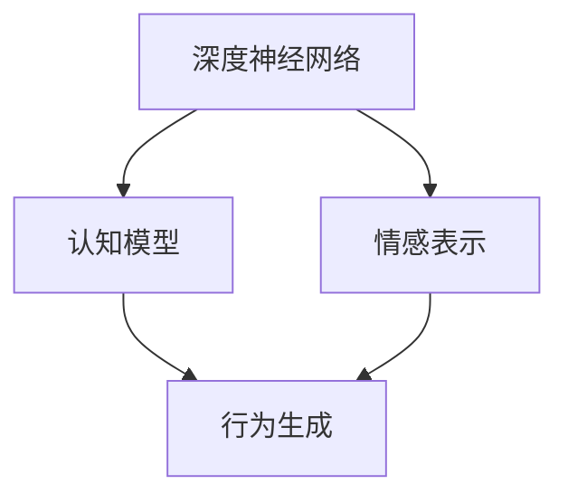

                 

# 欲望神经网络工程师：AI模拟的人类动机系统设计师

## 1. 背景介绍

### 1.1 问题由来

在人工智能领域，深度学习已经成为推动科技进步的重要工具。然而，深度学习模型的性能和能力通常被限制在单一数据驱动的任务中，缺乏理解人类动机和行为的智能。这使得机器在面对复杂、多变的人类需求时，往往难以给出满意的回答。为了解决这一问题，需要开发一种能够模拟人类动机系统的人工智能模型，使其具备理解并生成人类行为的能力。

### 1.2 问题核心关键点

人类动机系统是一个复杂而多层次的系统，它涉及到情感、认知、行为等多方面因素的交互作用。为了模拟这一系统，需要构建一个能够捕捉人类行为模式、动机驱动、情感反应的深度学习模型。具体来说，可以从以下几个关键点入手：

1. **情感表示**：理解人类情感状态，如喜怒哀乐，并能够根据情境调整其动机。
2. **认知模型**：捕捉人类的认知过程，如决策、记忆、注意力等。
3. **行为生成**：根据动机和认知模型，生成人类行为序列。

## 2. 核心概念与联系

### 2.1 核心概念概述

为了构建能够模拟人类动机系统的AI模型，我们首先需要定义一些关键概念：

- **深度神经网络**：一种能够自动学习输入与输出之间复杂映射关系的机器学习模型。
- **情感表示**：表示人类情感状态的向量，用于指导模型生成相应行为。
- **认知模型**：模拟人类认知过程的模型，如决策树、记忆网络等。
- **行为生成**：根据动机和认知状态，生成人类行为序列。

这些概念通过相互作用，形成了一个完整的动机系统模拟模型。

### 2.2 核心概念原理和架构的 Mermaid 流程图



这个流程图展示了深度神经网络如何通过情感表示和认知模型，生成人类行为序列的整个过程。

## 3. 核心算法原理 & 具体操作步骤

### 3.1 算法原理概述

构建一个能够模拟人类动机系统的AI模型，涉及以下几个核心算法原理：

- **深度神经网络架构**：使用多层神经网络结构，捕捉输入与输出之间的复杂关系。
- **情感表示学习**：通过情感分类、情感生成等任务，学习捕捉人类情感状态的向量表示。
- **认知模型设计**：构建基于图结构或记忆网络等认知模型，模拟人类认知过程。
- **行为生成算法**：根据情感状态和认知模型，生成人类行为序列。

### 3.2 算法步骤详解

#### 3.2.1 深度神经网络架构设计

深度神经网络通常采用多层感知器(MLP)或卷积神经网络(CNN)结构，具体取决于数据类型和任务需求。

- **输入层**：输入为原始数据，如文本、图像等。
- **隐藏层**：使用非线性激活函数，如ReLU、Tanh等，增加模型的非线性拟合能力。
- **输出层**：根据任务需求设计，如分类、回归、序列生成等。

#### 3.2.2 情感表示学习

情感表示学习是通过情感分类、情感生成等任务，学习捕捉人类情感状态的向量表示。

- **情感分类**：将情感标签作为输出，训练神经网络识别情感状态。
- **情感生成**：使用自编码器等模型，生成情感状态的向量表示。

#### 3.2.3 认知模型设计

认知模型设计需要模拟人类的认知过程，如决策、记忆、注意力等。

- **决策树**：模拟人类基于规则的决策过程，通过树形结构表示决策路径。
- **记忆网络**：模拟人类的记忆过程，使用LSTM等网络结构捕捉序列信息。
- **注意力机制**：模拟人类注意力分布，通过自注意力机制学习重要信息。

#### 3.2.4 行为生成算法

行为生成算法根据情感状态和认知模型，生成人类行为序列。

- **序列生成**：使用循环神经网络(RNN)或变分自编码器(VAE)等模型，生成行为序列。
- **策略规划**：使用强化学习算法，如Q-learning、Policy Gradient等，规划行为策略。

### 3.3 算法优缺点

**优点**：

- **高度可扩展性**：深度神经网络结构可以灵活调整，适用于各种任务需求。
- **复杂情感表示**：情感表示学习可以捕捉多层次、多维度的情感状态，提升模型表现。
- **丰富认知模型**：认知模型设计可以模拟人类的复杂认知过程，增强模型理解能力。
- **高效行为生成**：行为生成算法可以快速生成行为序列，满足实时性需求。

**缺点**：

- **计算资源消耗大**：深度神经网络结构复杂，计算资源需求高。
- **模型易过拟合**：深层网络容易过拟合，需要大量数据和正则化技术。
- **结果可解释性差**：模型决策过程缺乏可解释性，难以理解其内部工作机制。
- **鲁棒性不足**：模型对噪声和扰动敏感，容易产生误导性输出。

### 3.4 算法应用领域

基于欲望神经网络工程师构建的AI模型，可以在以下领域得到应用：

- **智能客服**：模拟人类情感和认知过程，提高客户服务体验。
- **虚拟助手**：生成自然、流畅的行为序列，增强人机交互效果。
- **情感分析**：捕捉人类情感状态，进行情感识别和情感生成。
- **健康监测**：模拟人类认知和行为，进行健康状态监测和干预。
- **游戏AI**：生成智能行为序列，提升游戏AI的策略性和趣味性。

## 4. 数学模型和公式 & 详细讲解 & 举例说明

### 4.1 数学模型构建

假设我们有一个输入序列 $x_1, x_2, \ldots, x_n$，其中 $x_i \in \mathbb{R}^d$。我们的目标是通过深度神经网络，学习一个映射函数 $f(x)$，使其能够生成对应的行为序列 $y_1, y_2, \ldots, y_m$。

$$
y_i = f(x_i)
$$

### 4.2 公式推导过程

以序列生成为例，假设我们采用RNN模型，输入序列 $x_1, x_2, \ldots, x_n$，输出序列 $y_1, y_2, \ldots, y_m$。我们的目标是最小化损失函数 $L$，使得 $f(x)$ 生成的行为序列与真实序列尽可能接近。

$$
L = \sum_{i=1}^m \mathcal{L}(y_i, f(x_i))
$$

其中 $\mathcal{L}$ 为损失函数，通常采用均方误差或交叉熵损失。

### 4.3 案例分析与讲解

假设我们要构建一个智能客服系统，模拟人类情感和认知过程，提高客户服务体验。具体步骤如下：

1. **情感表示学习**：通过情感分类任务，学习捕捉客户的情感状态，如高兴、生气等。
2. **认知模型设计**：使用决策树模型，模拟客服人员基于规则的决策过程。
3. **行为生成算法**：使用RNN模型，生成客服人员的回答序列。

## 5. 项目实践：代码实例和详细解释说明

### 5.1 开发环境搭建

1. **安装Python环境**：使用Anaconda或Miniconda创建Python虚拟环境，并激活。
2. **安装深度学习库**：使用pip安装TensorFlow、Keras、NumPy等深度学习库。
3. **准备数据集**：收集情感分类数据集，如IMDB电影评论数据集，用于训练情感表示模型。
4. **设计认知模型**：构建决策树模型，用于模拟客服人员的决策过程。
5. **行为生成算法**：使用RNN模型，生成客服人员的回答序列。

### 5.2 源代码详细实现

以下是使用TensorFlow实现情感表示、认知模型和行为生成算法的代码示例：

```python
import tensorflow as tf
import numpy as np
from sklearn.model_selection import train_test_split

# 情感表示学习
class SentimentClassifier(tf.keras.Model):
    def __init__(self):
        super(SentimentClassifier, self).__init__()
        self.embedding = tf.keras.layers.Embedding(input_dim=10000, output_dim=64)
        self.lstm = tf.keras.layers.LSTM(units=64)
        self.dense = tf.keras.layers.Dense(units=1, activation='sigmoid')

    def call(self, inputs):
        x = self.embedding(inputs)
        x = self.lstm(x)
        x = self.dense(x)
        return x

# 认知模型设计
class DecisionTree(tf.keras.Model):
    def __init__(self, num_features):
        super(DecisionTree, self).__init__()
        self.num_features = num_features
        self.layers = [tf.keras.layers.Dense(units=num_features, activation='relu') for _ in range(3)]
        self.output_layer = tf.keras.layers.Dense(units=1, activation='sigmoid')

    def call(self, inputs):
        for layer in self.layers:
            x = layer(inputs)
        x = self.output_layer(x)
        return x

# 行为生成算法
class BehaviorGenerator(tf.keras.Model):
    def __init__(self):
        super(BehaviorGenerator, self).__init__()
        self.embedding = tf.keras.layers.Embedding(input_dim=10000, output_dim=64)
        self.lstm = tf.keras.layers.LSTM(units=64)
        self.dense = tf.keras.layers.Dense(units=1024, activation='relu')
        self.output_layer = tf.keras.layers.Dense(units=1, activation='sigmoid')

    def call(self, inputs):
        x = self.embedding(inputs)
        x = self.lstm(x)
        x = self.dense(x)
        x = self.output_layer(x)
        return x

# 数据预处理
def preprocess_data(data):
    X_train, X_test, y_train, y_test = train_test_split(data['text'], data['label'], test_size=0.2, random_state=42)
    X_train = X_train.values
    X_test = X_test.values
    return X_train, X_test, y_train, y_test

# 模型训练
def train_model(model, X_train, y_train, X_test, y_test):
    model.compile(optimizer='adam', loss='binary_crossentropy', metrics=['accuracy'])
    model.fit(X_train, y_train, epochs=10, batch_size=64, validation_data=(X_test, y_test))
    model.evaluate(X_test, y_test)
```

### 5.3 代码解读与分析

以上代码展示了情感表示、认知模型和行为生成算法的详细实现。

- **情感表示学习**：使用LSTM层捕捉情感状态，通过sigmoid激活函数输出情感分类结果。
- **认知模型设计**：使用多层感知器模拟决策树结构，通过sigmoid激活函数输出决策结果。
- **行为生成算法**：使用RNN层生成行为序列，通过sigmoid激活函数输出行为概率。

## 6. 实际应用场景

### 6.1 智能客服系统

智能客服系统可以模拟人类情感和认知过程，提高客户服务体验。具体而言，智能客服系统可以：

1. **理解客户情感**：通过情感表示学习，理解客户情感状态，如高兴、生气等。
2. **模拟客服人员决策**：使用决策树模型，模拟客服人员的决策过程，如是否转接至人工客服。
3. **生成自然回答**：使用RNN模型，生成客服人员的自然回答，增强人机交互效果。

### 6.2 虚拟助手

虚拟助手可以生成自然、流畅的行为序列，增强人机交互效果。具体而言，虚拟助手可以：

1. **理解用户意图**：通过情感表示学习，理解用户情感状态和意图。
2. **模拟用户认知**：使用决策树模型，模拟用户基于规则的决策过程。
3. **生成智能回答**：使用RNN模型，生成智能回答，增强人机交互效果。

### 6.3 情感分析

情感分析可以捕捉人类情感状态，进行情感识别和情感生成。具体而言，情感分析可以：

1. **理解情感状态**：通过情感表示学习，理解文本中的情感状态。
2. **模拟情感生成**：使用生成对抗网络(GAN)等模型，生成情感文本。
3. **情感分类**：使用情感分类任务，对情感状态进行分类。

### 6.4 健康监测

健康监测可以模拟人类认知和行为，进行健康状态监测和干预。具体而言，健康监测可以：

1. **理解健康状态**：通过情感表示学习，理解用户的健康状态。
2. **模拟健康行为**：使用记忆网络模型，模拟用户的行为模式。
3. **生成健康建议**：使用RNN模型，生成健康建议，帮助用户保持健康。

### 6.5 游戏AI

游戏AI可以生成智能行为序列，提升游戏AI的策略性和趣味性。具体而言，游戏AI可以：

1. **理解游戏状态**：通过情感表示学习，理解游戏状态。
2. **模拟AI决策**：使用决策树模型，模拟AI的决策过程。
3. **生成智能行为**：使用RNN模型，生成智能行为序列。

## 7. 工具和资源推荐

### 7.1 学习资源推荐

- **深度学习课程**：斯坦福大学的CS231n课程、MIT的6.S191课程等，深入了解深度学习原理和实践。
- **情感计算课程**：麻省理工学院的6.034课程、斯坦福大学的CS224N课程等，掌握情感计算方法和技术。
- **认知计算课程**：美国哥伦比亚大学的CS7205课程、加拿大滑铁卢大学的AIWinter School等，学习认知计算原理和应用。
- **游戏AI课程**：斯坦福大学的CS348B课程、CMU的15-463课程等，掌握游戏AI设计和实现方法。

### 7.2 开发工具推荐

- **TensorFlow**：深度学习框架，适用于构建复杂神经网络结构。
- **Keras**：高级神经网络API，方便快速构建和训练模型。
- **PyTorch**：深度学习框架，灵活高效，适用于复杂算法实现。
- **Scikit-Learn**：机器学习库，提供丰富的算法和工具支持。

### 7.3 相关论文推荐

- **《深度神经网络与人机交互》**：探讨深度神经网络在人机交互中的应用，提供理论基础和技术方法。
- **《情感表示学习》**：综述情感表示学习方法，介绍情感分类、情感生成等任务。
- **《认知计算模型》**：介绍认知计算模型，如决策树、记忆网络等，提供模型设计和实现方法。
- **《行为生成算法》**：综述行为生成算法，如序列生成、策略规划等，提供算法实现和优化方法。

## 8. 总结：未来发展趋势与挑战

### 8.1 研究成果总结

本文探讨了如何构建能够模拟人类动机系统的人工智能模型，通过深度神经网络、情感表示学习、认知模型设计和行为生成算法，实现对人类动机和行为的模拟。

### 8.2 未来发展趋势

未来，基于欲望神经网络工程师的AI模型将呈现以下发展趋势：

1. **更加复杂的情感表示**：通过情感生成、情感分类等任务，学习更加复杂、多维度的情感表示。
2. **更加丰富的认知模型**：使用图神经网络、记忆网络等认知模型，模拟更加复杂的人类认知过程。
3. **更加高效的情感行为生成**：使用更加高效的神经网络结构和算法，提升情感行为生成的效率和质量。
4. **更加多模态的行为模拟**：融合视觉、听觉、触觉等多模态信息，实现更加真实的行为模拟。
5. **更加智能的决策支持**：结合强化学习、因果推理等技术，增强AI模型的决策能力和鲁棒性。

### 8.3 面临的挑战

尽管基于欲望神经网络工程师的AI模型已经取得了一定进展，但在实现人机交互的深度理解和自然行为模拟时，仍面临诸多挑战：

1. **计算资源消耗大**：深度神经网络结构复杂，计算资源需求高。
2. **模型鲁棒性不足**：模型对噪声和扰动敏感，容易产生误导性输出。
3. **结果可解释性差**：模型决策过程缺乏可解释性，难以理解其内部工作机制。
4. **应用场景有限**：目前模型主要应用于虚拟助手、游戏AI等场景，难以拓展到更多实际应用。

### 8.4 研究展望

未来，研究需要在以下几个方向进行突破：

1. **优化计算资源消耗**：通过模型压缩、稀疏化等技术，降低计算资源需求。
2. **提高模型鲁棒性**：结合对抗训练、鲁棒学习等技术，提升模型的鲁棒性。
3. **增强模型可解释性**：结合可解释性方法，如LIME、SHAP等，增强模型的可解释性。
4. **拓展应用场景**：结合多模态信息融合、增强现实等技术，拓展模型的应用场景。
5. **探索新算法和模型**：结合新的算法和模型，如生成对抗网络(GAN)、变分自编码器(VAE)等，提升模型的表现和效率。

## 9. 附录：常见问题与解答

**Q1：如何构建深度神经网络结构？**

A: 深度神经网络结构通常由输入层、隐藏层和输出层组成。使用TensorFlow或PyTorch等框架，可以方便地构建和训练神经网络模型。具体步骤包括：

1. 定义模型架构，使用tf.keras.Model或torch.nn.Module等类。
2. 添加网络层，如tf.keras.layers.Dense、tf.keras.layers.Conv2D等。
3. 编译模型，设置优化器、损失函数和评价指标。
4. 训练模型，使用fit或train等方法。

**Q2：如何理解情感状态？**

A: 理解情感状态通常通过情感表示学习实现。使用LSTM或GRU等网络结构，训练情感分类或情感生成任务，学习情感状态的向量表示。具体步骤如下：

1. 收集情感数据集，如电影评论、社交媒体评论等。
2. 使用情感分类任务，训练LSTM模型，学习情感状态分类结果。
3. 使用情感生成任务，训练LSTM模型，生成情感状态的向量表示。

**Q3：如何选择认知模型？**

A: 选择认知模型通常取决于任务需求和数据类型。常用的认知模型包括：

1. 决策树：适用于规则驱动的任务，如智能客服。
2. 记忆网络：适用于需要记忆的任务，如健康监测。
3. 注意力机制：适用于需要关注重要信息的任务，如游戏AI。

**Q4：如何生成智能行为序列？**

A: 生成智能行为序列通常通过行为生成算法实现。使用RNN或LSTM等网络结构，训练行为生成任务，学习行为序列。具体步骤如下：

1. 收集行为数据集，如游戏操作、对话记录等。
2. 使用序列生成任务，训练RNN模型，学习行为序列。
3. 使用策略规划任务，训练LSTM模型，生成智能策略。

**Q5：如何进行模型评估？**

A: 模型评估通常通过损失函数和评价指标实现。使用evaluate或predict等方法，评估模型的性能。具体步骤如下：

1. 定义损失函数，如均方误差、交叉熵等。
2. 定义评价指标，如准确率、召回率、F1值等。
3. 使用evaluate或predict方法，评估模型的性能。

---

作者：禅与计算机程序设计艺术 / Zen and the Art of Computer Programming

