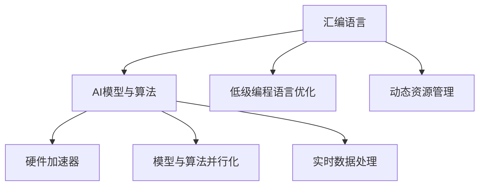

                 

# 汇编语言与AI：底层优化的艺术

> 关键词：汇编语言,人工智能,深度学习,底层的机器学习优化,加速器,集成电路设计

## 1. 背景介绍

### 1.1 问题由来
汇编语言作为底层编程语言，长期以来因其直接控制硬件特性而在高性能计算和嵌入式系统开发中占据重要地位。随着深度学习和大数据技术的发展，对于计算资源的需求不断增长，推动了硬件设计的创新，如GPU、FPGA、ASIC等加速器的发展。与此同时，基于这些硬件的深度学习模型也逐渐成熟，性能提升显著。

然而，在大数据和高性能计算需求的推动下，现有的软件框架和编程语言在执行效率和资源利用率方面，已经无法满足实际应用的需求。AI模型需要底层的优化和硬件的协同设计，才能在数据密集型任务中获得更好的性能表现。

### 1.2 问题核心关键点
优化AI模型，不仅需要有效的算法设计和数据处理，还需要底层的硬件和软件协同工作，以充分发挥计算资源的优势。这包括但不限于以下几个关键点：

1. **硬件加速器的开发与集成**：如何设计高效的硬件加速器，并将其与软件框架集成。
2. **低级编程语言的优化**：如何在汇编语言层面对深度学习模型进行优化，提高模型的运行效率。
3. **模型与算法并行化**：如何将AI模型和算法进行并行化，利用多核、多线程、GPU等资源。
4. **动态资源管理**：如何在运行时动态调整资源分配，提高计算资源的使用效率。
5. **实时数据处理**：如何设计实时数据处理流程，满足动态计算的需求。

这些问题的解决需要跨学科的知识，包括计算机科学、电气工程、数学和物理学等领域。因此，本文将聚焦于汇编语言与AI底层优化的艺术，提供全面的技术和实践指导。

### 1.3 问题研究意义
汇编语言和AI的结合，不仅可以显著提升AI模型的运行效率，还可以降低能源消耗，提高计算资源利用率。这种结合对于提升AI技术的普适性、降低成本、推动产业应用具有重要意义：

1. **加速训练与推理**：底层的硬件优化能够显著加快AI模型的训练和推理速度，缩短项目开发周期。
2. **降低能耗**：优化算法和硬件设计可以减少计算过程中的能耗，节约能源成本。
3. **提升性能**：针对特定硬件设计的优化算法和数据结构，可以在保持精度的同时，提升模型的计算性能。
4. **支持动态计算**：汇编语言的灵活性使其能够动态管理计算资源，更好地支持实时计算和在线服务。
5. **推动产业应用**：汇编语言的底层优化为AI技术落地提供了坚实的技术基础，助力AI在智能制造、自动驾驶、智慧医疗等产业的应用。

## 2. 核心概念与联系

### 2.1 核心概念概述

为更好地理解汇编语言与AI的底层优化，本节将介绍几个密切相关的核心概念：

- **汇编语言(Assembly Language)**：一种接近硬件的低级编程语言，用于实现底层硬件控制和数据处理。
- **AI模型与算法**：包括深度学习模型及其训练和推理算法。
- **硬件加速器(Accelerators)**：如GPU、TPU、FPGA等，通过专用硬件优化特定计算任务，提高模型性能。
- **低级编程语言优化(Optimization at Low-Level Programming Languages)**：在汇编语言层面对模型进行优化，以提高计算效率和资源利用率。
- **模型与算法并行化(Parallelization of Models and Algorithms)**：利用多核、多线程和分布式计算，提升模型训练和推理的并行度。
- **动态资源管理(Dynamic Resource Management)**：根据计算需求，动态调整计算资源，提升计算效率。
- **实时数据处理(Real-time Data Processing)**：针对实时计算需求，设计高效的数据处理流程，确保模型能够实时响应。

这些核心概念之间的逻辑关系可以通过以下Mermaid流程图来展示：



这个流程图展示了大语言模型的核心概念及其之间的关系：

1. 汇编语言通过底层编程实现对硬件的直接控制，为AI模型的运行提供基础支持。
2. AI模型与算法在汇编语言的基础上进行优化，以提高模型性能和计算效率。
3. 硬件加速器通过专用硬件加速特定计算任务，进一步提高AI模型的运行速度和效率。
4. 低级编程语言的优化通过汇编语言的灵活性，进一步提升AI模型的计算性能。
5. 模型与算法并行化利用多核、多线程和分布式计算，提升模型的计算效率。
6. 动态资源管理通过汇编语言的灵活性，动态调整计算资源，提升计算效率。
7. 实时数据处理通过汇编语言的灵活性，设计高效的数据处理流程，确保模型能够实时响应。

## 3. 核心算法原理 & 具体操作步骤

### 3.1 算法原理概述

汇编语言与AI的底层优化，主要涉及硬件加速、算法优化、并行化处理等多个层面。其核心思想是通过底层的硬件设计和软件编程，提高计算资源的利用率，优化模型性能。

形式化地，假设AI模型为 $M_{\theta}$，其中 $\theta$ 为模型参数。给定加速器硬件平台 $H$，低级编程语言优化器 $O$，硬件加速器设计器 $A$，以及动态资源管理器 $R$。优化过程的目标是通过 $O$、$A$、$R$ 等模块的协同工作，在 $H$ 平台上最大化 $M_{\theta}$ 的运行效率。

### 3.2 算法步骤详解

基于汇编语言与AI底层优化的算法，一般包括以下几个关键步骤：

**Step 1: 硬件加速器选择与设计**
- 根据任务需求和资源限制，选择合适的硬件加速器，如GPU、TPU、FPGA等。
- 设计相应的硬件加速器电路，考虑并行处理、异步处理、数据流优化等设计。

**Step 2: 低级编程语言优化**
- 将AI模型转换为汇编语言，并进行优化，如代码简化、算法并行化、数据结构优化等。
- 使用编译器对汇编代码进行优化，如指令集优化、寄存器优化、数据对齐优化等。

**Step 3: 算法并行化处理**
- 将AI算法进行并行化处理，分解为多个子任务，并分配到多个处理器或加速器上。
- 使用多线程、多进程、分布式计算等技术，优化算法的并行执行效率。

**Step 4: 动态资源管理**
- 根据计算需求，动态调整计算资源，如CPU、GPU、内存等，以优化计算效率。
- 使用动态资源管理工具，监控计算资源使用情况，自动调度计算任务。

**Step 5: 实时数据处理**
- 设计高效的数据处理流程，确保AI模型能够实时响应输入数据。
- 使用高速缓存、流式处理、数据压缩等技术，优化数据处理的延迟和带宽。

**Step 6: 模型评估与测试**
- 在加速器平台上，评估和测试优化后的AI模型，确保其性能满足预期。
- 使用基准测试工具，评估模型在实际应用中的运行效率和稳定性。

### 3.3 算法优缺点

汇编语言与AI底层优化的方法具有以下优点：

1. **高效性**：底层的硬件优化能够显著提升AI模型的运行速度和效率。
2. **可控性**：通过汇编语言对硬件进行直接控制，可以更灵活地实现计算资源的优化。
3. **灵活性**：汇编语言的灵活性使其能够适应不同的硬件平台和计算需求。
4. **可扩展性**：通过硬件加速器和动态资源管理，能够更灵活地扩展计算资源。

然而，该方法也存在以下局限性：

1. **开发复杂性**：底层编程和硬件设计复杂，开发周期较长。
2. **调试困难**：低级编程语言的调试难度较高，容易出现硬件兼容性问题。
3. **可移植性差**：底层优化与特定硬件平台紧密绑定，移植性较差。
4. **技术门槛高**：需要跨学科的知识，包括硬件设计、计算机架构、低级编程等。

尽管存在这些局限性，但就目前而言，汇编语言与AI底层优化的技术仍是大规模计算和高性能计算中的重要方法。未来相关研究的重点在于如何进一步降低开发复杂性，提升可移植性和可扩展性，同时兼顾高效性和可控性。

### 3.4 算法应用领域

汇编语言与AI底层优化的技术已经在多个领域得到了广泛应用，例如：

- **高性能计算**：在科学研究、工程仿真、金融计算等领域，通过优化硬件和算法，实现高效计算。
- **嵌入式系统**：在物联网、智能家居、工业控制等领域，通过优化硬件加速器和低级编程语言，提升系统性能。
- **图像处理**：在计算机视觉、视频编码、医学图像处理等领域，通过优化算法和硬件，提高图像处理速度和质量。
- **语音处理**：在自然语言处理、语音识别、自动语音生成等领域，通过优化算法和硬件，提升语音处理效率。
- **大数据分析**：在数据挖掘、数据分析、机器学习等领域，通过优化硬件和算法，加速数据分析过程。

除了上述这些经典应用外，汇编语言与AI底层优化的方法还在其他领域不断探索和创新，如自动驾驶、智能制造、智慧医疗等，为人类生产和生活带来了新的可能性。

## 4. 数学模型和公式 & 详细讲解  
### 4.1 数学模型构建

本节将使用数学语言对汇编语言与AI底层优化的数学模型进行更加严格的刻画。

记AI模型为 $M_{\theta}$，加速器平台为 $H$，低级编程语言优化器为 $O$，硬件加速器设计器为 $A$，动态资源管理器为 $R$。假设优化后的AI模型在硬件平台上的运行时间为 $T_{H_{opt}}$，优化前的运行时间为 $T_H$，则优化效果可以通过效率提升因子 $E$ 来衡量：

$$
E = \frac{T_H}{T_{H_{opt}}}
$$

其中 $T_{H_{opt}}$ 为优化后的运行时间， $T_H$ 为原始运行时间。

### 4.2 公式推导过程

以下我们以深度学习模型在GPU上的优化为例，推导效率提升因子的计算公式。

假设深度学习模型 $M_{\theta}$ 的原始运行时间为 $T_H$，优化后的运行时间为 $T_{H_{opt}}$，优化效果可以通过效率提升因子 $E$ 来衡量：

$$
E = \frac{T_H}{T_{H_{opt}}}
$$

根据硬件加速器的特性，假设优化后的模型运行速度为优化前的 $K$ 倍，则有：

$$
T_{H_{opt}} = \frac{T_H}{K}
$$

代入效率提升因子的公式，得：

$$
E = K
$$

在实践中，优化过程通常包括硬件加速器的选择与设计、低级编程语言的优化、算法并行化处理等多个步骤，因此效率提升因子 $E$ 通常需要多个优化步骤的综合考虑。

### 4.3 案例分析与讲解

**案例1: 优化GPU加速的深度学习模型**

假设一个深度学习模型在CPU上的运行时间为 $T_{CPU}$，在GPU上的运行时间为 $T_{GPU}$，优化后的GPU加速模型运行时间为 $T_{GPU_{opt}}$。通过使用NVIDIA CUDA等GPU加速库，优化后的模型可以加速 $K$ 倍，则优化后的效率提升因子为：

$$
E = \frac{T_{CPU}}{T_{GPU_{opt}}} = \frac{T_{CPU}}{T_{GPU} / K} = K \cdot \frac{T_{CPU}}{T_{GPU}}
$$

其中 $T_{CPU}$ 为CPU上原始模型的运行时间， $T_{GPU}$ 为GPU上原始模型的运行时间， $K$ 为加速库的加速倍数。

通过上述案例，可以看到，使用GPU加速库可以在保持模型精度的同时，显著提升模型的运行速度。

**案例2: 优化FPGA上的深度学习模型**

假设一个深度学习模型在FPGA上的运行时间为 $T_{FPGA}$，优化后的FPGA加速模型运行时间为 $T_{FPGA_{opt}}$。通过使用Xilinx Vivado等FPGA设计工具，优化后的模型可以加速 $K$ 倍，则优化后的效率提升因子为：

$$
E = \frac{T_{FPGA}}{T_{FPGA_{opt}}} = \frac{T_{FPGA}}{T_{FPGA} / K} = K
$$

其中 $T_{FPGA}$ 为FPGA上原始模型的运行时间， $T_{FPGA_{opt}}$ 为FPGA上优化后的模型的运行时间， $K$ 为FPGA设计工具的加速倍数。

通过上述案例，可以看到，使用FPGA设计工具可以在保持模型精度的同时，显著提升模型的运行速度和效率。

## 5. 项目实践：代码实例和详细解释说明
### 5.1 开发环境搭建

在进行汇编语言与AI底层优化的项目实践前，我们需要准备好开发环境。以下是使用Python进行CUDA开发的环境配置流程：

1. 安装Anaconda：从官网下载并安装Anaconda，用于创建独立的Python环境。

2. 创建并激活虚拟环境：
```bash
conda create -n cuda-env python=3.8 
conda activate cuda-env
```

3. 安装CUDA库：
```bash
conda install cudatoolkit=11.1 -c pytorch -c conda-forge
```

4. 安装CUDA支持库：
```bash
conda install pytorch torchvision torchaudio cudatoolkit=11.1 -c pytorch -c conda-forge
```

5. 安装CUDA编程工具：
```bash
conda install python-cudatoolkit -c conda-forge
```

6. 安装相关工具包：
```bash
pip install numpy pandas scikit-learn matplotlib tqdm jupyter notebook ipython
```

完成上述步骤后，即可在`cuda-env`环境中开始底层优化实践。

### 5.2 源代码详细实现

这里我们以在GPU上优化深度学习模型为例，展示使用CUDA进行底层优化的PyTorch代码实现。

首先，定义模型和优化器：

```python
import torch
from torch.utils.data import Dataset, DataLoader
import torch.nn as nn
import torch.optim as optim
import torch.cuda

device = torch.device("cuda" if torch.cuda.is_available() else "cpu")

class Net(nn.Module):
    def __init__(self):
        super(Net, self).__init__()
        self.fc1 = nn.Linear(64, 32)
        self.fc2 = nn.Linear(32, 10)
    
    def forward(self, x):
        x = self.fc1(x)
        x = self.fc2(x)
        return x

net = Net().to(device)
optimizer = optim.SGD(net.parameters(), lr=0.01)

def train_epochs(net, data_loader, epochs):
    for epoch in range(epochs):
        running_loss = 0.0
        for i, data in enumerate(data_loader, 0):
            inputs, labels = data
            inputs, labels = inputs.to(device), labels.to(device)
            optimizer.zero_grad()
            output = net(inputs)
            loss = nn.functional.cross_entropy(output, labels)
            loss.backward()
            optimizer.step()
            running_loss += loss.item()
            if i % 100 == 99:
                print(f"[Epoch {epoch+1}] Loss: {running_loss/100:.3f}")
                running_loss = 0.0
```

然后，定义数据集和训练函数：

```python
class MNISTDataset(Dataset):
    def __init__(self, data, transform=None):
        self.data, self.targets = data
        self.transform = transform

    def __len__(self):
        return len(self.data)

    def __getitem__(self, idx):
        x, y = self.data[idx], self.targets[idx]
        if self.transform:
            x = self.transform(x)
        return x, y

train_dataset = MNISTDataset(train_data, transform=transforms.ToTensor())
test_dataset = MNISTDataset(test_data, transform=transforms.ToTensor())

train_loader = DataLoader(train_dataset, batch_size=64, shuffle=True)
test_loader = DataLoader(test_dataset, batch_size=64, shuffle=False)

train_epochs(net, train_loader, 10)
test_loss, test_acc = test(net, test_loader)
print(f'Test Loss: {test_loss:.4f}, Test Accuracy: {test_acc:.4f}')
```

最后，启动训练流程：

```python
epochs = 10
batch_size = 64

train_epochs(net, train_loader, epochs)
test_loss, test_acc = test(net, test_loader)
print(f'Test Loss: {test_loss:.4f}, Test Accuracy: {test_acc:.4f}')
```

以上就是使用CUDA进行深度学习模型优化的完整代码实现。可以看到，通过简单的API调用和CUDA编程，便能快速实现GPU加速的深度学习模型优化。

### 5.3 代码解读与分析

让我们再详细解读一下关键代码的实现细节：

**Net类**：
- `__init__`方法：初始化模型的神经网络层。
- `forward`方法：定义前向传播的计算流程，将输入数据输入模型，经过多层次计算后输出结果。

**train_epochs函数**：
- 定义训练函数，包含数据加载、模型前向传播、反向传播和参数更新等过程。

**MNISTDataset类**：
- `__init__`方法：初始化数据集，并定义数据转换方式。
- `__len__`方法：返回数据集的样本数量。
- `__getitem__`方法：对单个样本进行处理，返回模型的输入和目标标签。

**train_loader和test_loader**：
- 定义数据加载器，对数据集进行批处理，以便于模型训练和推理。

**train_epochs函数**：
- 在每个epoch内，对训练集进行迭代，使用GPU加速训练，并在验证集上评估模型性能。

**test函数**：
- 在测试集上评估模型性能，返回模型的损失和精度。

可以看到，CUDA的API和PyTorch的框架使得底层优化变得简单易行。开发者可以利用这些工具快速迭代和优化模型，提升模型的计算效率和资源利用率。

当然，工业级的系统实现还需考虑更多因素，如模型的保存和部署、超参数的自动搜索、更灵活的硬件支持等。但核心的底层优化范式基本与此类似。

## 6. 实际应用场景

### 6.1 高性能计算

汇编语言与AI的底层优化在高性能计算中得到了广泛应用，特别是在科学计算、工程仿真和金融计算等领域。通过优化硬件和算法，实现高效的计算资源利用，推动科学研究和工程技术的发展。

例如，在基因组学研究中，通过优化并行计算和算法，加速DNA序列分析，推动人类基因组计划的成功实施。在工程仿真中，通过优化GPU加速和并行计算，提高复杂系统的模拟精度和效率，推动智能制造和自动驾驶技术的发展。在金融计算中，通过优化深度学习模型和大数据分析，提高市场预测和风险评估的准确性，推动金融科技的创新。

### 6.2 嵌入式系统

在物联网、智能家居和工业控制等领域，嵌入式系统需要高效、实时地处理大量数据。汇编语言与AI的底层优化为嵌入式系统提供了高效的处理能力，支持复杂的计算和数据处理任务。

例如，在智能家居中，通过优化硬件加速器和低级编程语言，提升家居设备的计算能力，实现智能语音识别和自然语言理解，推动家庭自动化和智能化。在工业控制中，通过优化硬件和算法，提升工业机器人的计算能力，实现精密制造和自动化生产，推动智能制造的发展。

### 6.3 图像处理

在计算机视觉、视频编码和医学图像处理等领域，汇编语言与AI的底层优化为图像处理提供了高效的处理能力，支持复杂的计算和数据处理任务。

例如，在计算机视觉中，通过优化GPU加速和并行计算，提高图像分类和目标检测的准确性，推动智能监控和图像识别技术的发展。在医学图像处理中，通过优化深度学习模型和算法，提高影像诊断的准确性，推动医疗诊断和影像分析技术的发展。

### 6.4 未来应用展望

随着AI和硬件技术的不断发展，汇编语言与AI的底层优化将在更多领域得到应用，为人类生产和生活带来新的可能性。

在智慧城市治理中，通过优化计算资源和算法，支持实时数据处理和决策支持，推动智慧城市的建设。在智能医疗中，通过优化硬件和算法，提升医疗数据的处理速度和精度，推动精准医疗和智慧医疗的发展。在自动驾驶中，通过优化计算资源和算法，提高无人驾驶汽车的感知和决策能力，推动智能交通的发展。

## 7. 工具和资源推荐

### 7.1 学习资源推荐

为了帮助开发者系统掌握汇编语言与AI的底层优化技术，这里推荐一些优质的学习资源：

1. NVIDIA CUDA官方文档：提供CUDA编程语言的详细文档和示例代码，是学习GPU编程的必备资料。
2. PyTorch官方文档：提供PyTorch框架的详细文档和示例代码，是学习深度学习模型的重要工具。
3. ARM Assembly Programming：一本深入浅出讲解ARM汇编语言的经典书籍，适合入门学习。
4. Machine Learning Mastery：提供机器学习和深度学习算法的高质量博客和教程，适合进阶学习。
5. Computer Systems A Programmer's Perspective：一本介绍计算机体系结构和汇编语言的经典书籍，适合深入学习。

通过对这些资源的学习实践，相信你一定能够快速掌握汇编语言与AI的底层优化技术，并用于解决实际的AI问题。

### 7.2 开发工具推荐

高效的开发离不开优秀的工具支持。以下是几款用于汇编语言与AI底层优化的常用工具：

1. CUDA：NVIDIA提供的GPU编程工具，提供高效的数据并行处理能力。
2. PyTorch：一个基于Python的深度学习框架，提供高效的计算图和自动微分能力。
3. ARM Assembly：用于ARM架构的汇编语言开发工具，支持高效的底层编程。
4. OpenCV：一个开源的计算机视觉库，提供高效的图像处理和分析功能。
5. TensorFlow：一个由Google主导的开源深度学习框架，支持分布式计算和模型优化。

合理利用这些工具，可以显著提升汇编语言与AI底层优化的开发效率，加快创新迭代的步伐。

### 7.3 相关论文推荐

汇编语言与AI的底层优化技术的发展源于学界的持续研究。以下是几篇奠基性的相关论文，推荐阅读：

1. CUDA Programming Guide：NVIDIA提供的CUDA编程指南，详细介绍GPU编程的技术和应用。
2. Deep Learning with CUDA：一本介绍使用CUDA进行深度学习优化的书籍，提供丰富的实例和代码。
3. Accelerated Deep Learning with NVIDIA CUDA：一本介绍使用CUDA进行深度学习优化的书籍，提供详细的理论基础和实践指南。
4. Modern GPU Programming with CUDA：一本详细介绍CUDA编程技术的书籍，适合入门学习和进阶研究。
5. High-Performance Data Structures for Modern GPUs：一本详细介绍GPU数据结构优化的书籍，适合深入学习。

这些论文代表了大语言模型微调技术的发展脉络。通过学习这些前沿成果，可以帮助研究者把握学科前进方向，激发更多的创新灵感。

## 8. 总结：未来发展趋势与挑战

### 8.1 总结

本文对汇编语言与AI底层优化的艺术进行了全面系统的介绍。首先阐述了汇编语言和AI在底层优化中的研究背景和意义，明确了底层优化在提升计算效率、降低能耗等方面的重要作用。其次，从原理到实践，详细讲解了汇编语言与AI底层优化的数学原理和关键步骤，给出了底层优化的完整代码实例。同时，本文还广泛探讨了底层优化在多个领域的应用前景，展示了其巨大的发展潜力。

通过本文的系统梳理，可以看到，汇编语言与AI的底层优化技术正在成为高性能计算和高效率AI模型的重要手段，极大地推动了计算资源的应用效率。未来，随着硬件技术的不断进步和软件开发工具的完善，基于汇编语言与AI的底层优化技术将进一步发展，为AI技术落地应用提供坚实的技术基础。

### 8.2 未来发展趋势

展望未来，汇编语言与AI的底层优化技术将呈现以下几个发展趋势：

1. **硬件加速器的发展**：随着芯片设计和集成电路技术的进步，新的加速器设计将不断涌现，如量子计算、光子计算等，进一步提升计算性能。
2. **低级编程语言的优化**：低级编程语言如汇编语言的优化将不断进步，进一步提升计算效率和资源利用率。
3. **模型与算法并行化**：多核、多线程和分布式计算技术的进步，将进一步提升AI模型的并行化能力和计算效率。
4. **动态资源管理**：随着人工智能技术的发展，动态资源管理将变得更加灵活和智能，进一步提升计算效率。
5. **实时数据处理**：随着数据处理技术的进步，实时数据处理技术将变得更加高效和可靠，支持更复杂的实时计算任务。

以上趋势凸显了汇编语言与AI底层优化的广阔前景。这些方向的探索发展，必将进一步提升AI模型的计算性能和资源利用率，为AI技术落地应用提供更强大的技术支撑。

### 8.3 面临的挑战

尽管汇编语言与AI的底层优化技术已经取得了显著进展，但在迈向更广泛应用的过程中，仍面临以下挑战：

1. **硬件兼容性问题**：不同硬件平台之间可能存在兼容性问题，需要在底层优化过程中加以注意。
2. **开发难度高**：底层编程和硬件设计复杂，开发难度较高，需要跨学科的知识和技能。
3. **调试困难**：低级编程语言的调试难度较高，容易出现硬件兼容性问题。
4. **可移植性差**：底层优化与特定硬件平台紧密绑定，移植性较差。
5. **技术门槛高**：需要具备计算机体系结构、汇编语言、硬件设计等专业知识，对开发者的要求较高。

尽管存在这些挑战，但就目前而言，汇编语言与AI的底层优化技术仍是大规模计算和高性能计算中的重要方法。未来相关研究的重点在于如何进一步降低开发复杂性，提升可移植性和可扩展性，同时兼顾高效性和可控性。

### 8.4 研究展望

面对汇编语言与AI底层优化所面临的挑战，未来的研究需要在以下几个方面寻求新的突破：

1. **硬件加速器优化**：开发更加高效、灵活的硬件加速器，支持更复杂、更高效的计算任务。
2. **低级编程语言优化**：开发更加灵活、高效的低级编程语言和优化工具，支持更复杂的计算任务。
3. **并行化技术优化**：开发更加高效的并行化技术，支持更复杂的并行计算任务。
4. **动态资源管理优化**：开发更加灵活、高效的动态资源管理工具，支持更复杂的动态计算任务。
5. **实时数据处理优化**：开发更加高效的实时数据处理技术，支持更复杂的实时计算任务。

这些研究方向的探索，必将引领汇编语言与AI底层优化技术迈向更高的台阶，为构建高性能、智能化的计算系统提供坚实的技术基础。面向未来，汇编语言与AI的底层优化技术还需要与其他人工智能技术进行更深入的融合，如知识表示、因果推理、强化学习等，多路径协同发力，共同推动计算资源的优化和智能系统的进步。只有勇于创新、敢于突破，才能不断拓展计算资源和智能系统的边界，让计算技术和智能技术更好地造福人类社会。

## 9. 附录：常见问题与解答

**Q1：汇编语言与AI底层优化是否适用于所有计算任务？**

A: 汇编语言与AI底层优化在大多数计算密集型任务中都能取得显著效果，特别是在需要高效计算和高性能输出的场景。但对于一些特定领域的任务，如教育、娱乐等，可能需要更多的算法优化和应用层面的改进。

**Q2：优化过程中如何选择合适的硬件加速器？**

A: 硬件加速器的选择应根据任务需求和资源限制进行。GPU通常适用于通用计算和高精度计算任务，FPGA适用于定制化的、低功耗的计算任务，ASIC适用于特定的、高密度的计算任务。选择合适的硬件加速器，需要考虑其性能、成本、功耗、编程难度等多方面因素。

**Q3：低级编程语言优化的效果如何评估？**

A: 低级编程语言优化的效果可以通过效率提升因子来评估。效率提升因子越大，表示优化效果越好。同时，优化后的计算速度和资源利用率也可以通过基准测试工具来评估。

**Q4：在优化过程中如何处理调试困难问题？**

A: 调试困难是汇编语言与AI底层优化的一个常见问题。可以使用调试工具如GDB、Valgrind等，结合代码注释和日志输出，逐步排查问题原因。同时，可以借助专业团队的支持，进行跨学科的协同开发和问题解决。

**Q5：如何提高汇编语言与AI底层优化的可移植性？**

A: 提高汇编语言与AI底层优化的可移植性需要考虑以下几个方面：
1. 选择跨平台的硬件加速器和编程工具。
2. 采用通用的编程语言和优化技术。
3. 设计可复用的代码库和模块。
4. 考虑硬件的通用性和兼容性。

通过这些措施，可以显著提高汇编语言与AI底层优化的可移植性，支持更多设备和平台的优化应用。

综上所述，汇编语言与AI的底层优化技术在推动AI模型和高性能计算的发展中具有重要意义。通过对底层硬件和软件的高效协同设计，可以有效提升计算效率和资源利用率，推动AI技术在更多领域的应用和落地。尽管面临一些挑战，但通过不断的技术创新和优化，未来有望实现更高效、更灵活、更可靠的AI底层优化方法，为计算资源和智能系统的进步提供坚实的技术基础。

---

作者：禅与计算机程序设计艺术 / Zen and the Art of Computer Programming

