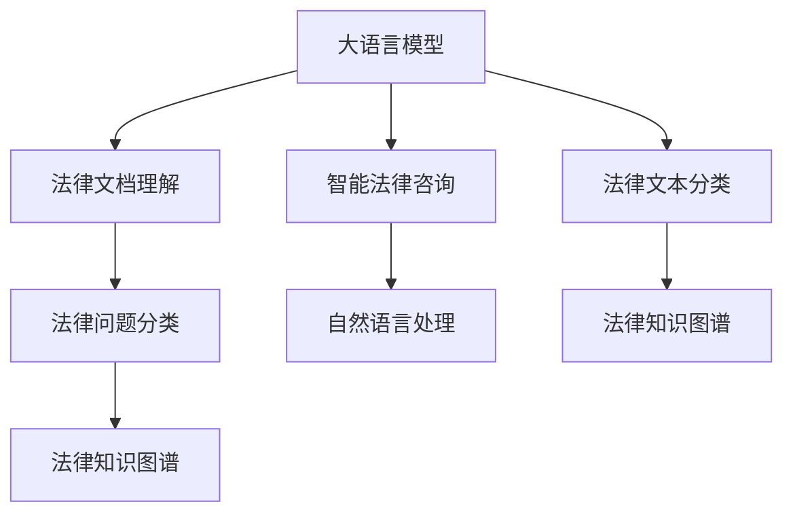

                 

# 法律研究助手：LLM 简化法律复杂性

> 关键词：法律研究,大语言模型,自然语言处理,LLM,法律知识图谱,智能法律咨询

## 1. 背景介绍

### 1.1 问题由来
法律研究是一个复杂且耗时的过程。对于法律从业者来说，他们需要花费大量的时间来检索和分析大量的案例、法规、条款和文献。随着法律文档的爆炸式增长，传统的法律研究工作变得愈加困难。为此，法律行业需要借助先进的技术手段来提升法律研究效率，优化法律咨询服务。

在信息技术和人工智能技术快速发展的背景下，自然语言处理(Natural Language Processing, NLP)技术在法律研究中的应用逐渐成为热点。尤其是大语言模型（Large Language Models, LLMs），因其强大的语言理解和生成能力，在法律领域展现出巨大的应用潜力。

### 1.2 问题核心关键点
大语言模型通过大规模无标签文本数据预训练，学习到了丰富的语言知识和常识。在法律领域，通过将其应用于法律文档的语义理解、自动分类、关键信息提取等任务，可以有效提升法律研究的工作效率和质量。大语言模型在法律领域的应用可以归纳为以下几个核心关键点：

1. **法律文档理解**：利用大语言模型对法律文档进行语义理解，提取关键信息和要点。
2. **法律问题分类**：对法律问题进行自动分类，如合同纠纷、劳动争议、知识产权等。
3. **法律知识图谱构建**：构建包含法律关系、法规、案例等信息的知识图谱，用于知识检索和推理。
4. **智能法律咨询**：提供基于大语言模型的智能法律咨询服务，回答用户的法律问题，提供个性化建议。

### 1.3 问题研究意义
利用大语言模型简化法律复杂性，不仅能够提升法律研究工作者的效率，还能够为公众提供更便捷、高效的法律咨询服务。其意义主要体现在以下几个方面：

1. **提升效率**：大语言模型能够快速理解法律文档和问题，减少人工查找和整理的工作量。
2. **降低成本**：减少对高成本的法律咨询服务需求，降低法律服务的总体成本。
3. **增强准确性**：大语言模型通过训练得到大量法律数据，能提供比人工更为准确的法律建议。
4. **扩大覆盖范围**：大语言模型可以覆盖更多法律领域和细分类别，提供更加全面的法律信息。
5. **促进普及**：降低法律服务的门槛，让更多人能够获得优质的法律服务。

## 2. 核心概念与联系

### 2.1 核心概念概述

为更好地理解大语言模型在法律领域的应用，本节将介绍几个关键概念及其联系：

- **大语言模型 (LLM)**：以自回归（如GPT）或自编码（如BERT）模型为代表的大规模预训练语言模型。通过在海量无标签文本数据上预训练，学习到丰富的语言知识和常识。

- **法律知识图谱**：一种将法律关系、法规、案例等信息表示为图形结构的知识库。用于构建知识图谱的大规模法律数据集可以从法律网站、法院判决、法规数据库等来源获取。

- **智能法律咨询**：基于大语言模型的自然语言处理技术，为用户提供法律问题的解答和建议。

- **自然语言处理 (NLP)**：涉及自然语言理解、生成、推理等技术的学科，是人工智能和计算机科学的重要分支。

- **法律文本分类**：将法律文本分为合同、判决、法规等类别，用于自动化的法律文档处理和分类。

这些概念之间的联系可以通过以下Mermaid流程图来展示：



这个流程图展示了大语言模型与法律研究各个环节的联系：

1. 大语言模型通过预训练获取语言理解能力，用于法律文档理解和文本分类。
2. 理解后的法律文档和文本通过分类和知识图谱构建，为智能法律咨询提供支持。
3. 智能法律咨询基于自然语言处理技术，为用户提供法律咨询服务。

## 3. 核心算法原理 & 具体操作步骤
### 3.1 算法原理概述

利用大语言模型简化法律复杂性的核心思想，是通过将法律文档和问题转化为自然语言输入，利用模型的语言理解和生成能力，自动提取关键信息，进行法律问题分类和推理。

具体来说，基于大语言模型的法律研究助手流程如下：

1. **预训练模型加载**：从开源平台或自建模型中加载大语言模型。
2. **法律文本输入**：将法律文档或问题文本输入到模型中。
3. **语义理解**：大语言模型对输入文本进行语义理解，提取关键信息。
4. **文本分类**：根据理解后的文本进行自动分类，如合同、纠纷、劳动法等。
5. **知识图谱构建**：基于分类后的文本，构建法律知识图谱，用于知识检索和推理。
6. **智能咨询**：根据用户的问题，结合法律知识图谱和理解后的文本，生成智能法律咨询。

### 3.2 算法步骤详解

基于大语言模型的法律研究助手，具体步骤如下：

1. **模型选择**：根据应用场景选择合适的预训练大语言模型。如对于法律问题分类，BERT、RoBERTa等模型效果较好；对于合同文本理解，GPT-3等模型则更为适合。

2. **数据预处理**：对输入的法律文本进行预处理，包括分词、去停用词、词性标注等操作，以便模型更好地理解文本。

3. **模型微调**：在特定法律数据集上微调模型，如将合同文本作为微调数据，优化模型在合同分类、条款理解等任务上的性能。

4. **知识图谱构建**：根据微调后的模型，构建法律知识图谱。图谱节点包括法规、案例、法律实体等，边表示法律关系和引用关系。

5. **智能咨询实现**：开发智能法律咨询系统，结合用户问题和法律知识图谱，生成个性化法律咨询。系统可以采用基于规则的模板，也可以利用大语言模型生成自然语言回复。

### 3.3 算法优缺点

利用大语言模型简化法律复杂性具有以下优点：

1. **效率提升**：大语言模型能够快速理解和分析法律文本，减少人工查找和整理的时间。
2. **准确性提高**：模型通过大规模法律数据训练，提供了比人工更为准确的法律建议。
3. **覆盖范围广**：模型可以覆盖多个法律领域和细分类别，提供全面的法律信息。

然而，也存在以下缺点：

1. **依赖数据**：大语言模型的性能依赖于训练数据的质量和数量，特别是法律领域的标注数据较少，可能导致模型泛化能力不足。
2. **法律准确性**：虽然模型能够提供较为准确的法律咨询，但在复杂案件中仍需人工审核和补充。
3. **数据隐私**：法律文本和咨询内容涉及敏感信息，需要确保数据隐私和安全。

### 3.4 算法应用领域

基于大语言模型的法律研究助手，在多个领域有着广泛的应用：

- **合同审核**：对合同文本进行自动分类和条款理解，识别合同中的关键信息，减少人工审核的工作量。
- **法律咨询**：提供基于大语言模型的智能法律咨询服务，回答用户的法律问题，提供个性化的建议。
- **法律文书生成**：生成标准的法律文书，如起诉状、答辩状、合同书等，提高法律文档的撰写效率。
- **法律知识库构建**：构建法律知识图谱，用于知识检索和推理，提升法律研究的工作效率。
- **法律教育**：提供基于自然语言处理的法律教育资源，如法律案例分析、法规解读等。

## 4. 数学模型和公式 & 详细讲解 & 举例说明

### 4.1 数学模型构建

本节将使用数学语言对基于大语言模型的法律研究助手进行严格的刻画。

记输入的法律文本为 $x$，输出为 $y$，如合同分类、案件标签等。定义大语言模型 $M_{\theta}$，其中 $\theta$ 为模型参数。假设训练集为 $D=\{(x_i, y_i)\}_{i=1}^N$。

定义模型在训练样本上的损失函数为 $\ell(M_{\theta}(x), y)$，则经验风险为：

$$
\mathcal{L}(\theta) = \frac{1}{N} \sum_{i=1}^N \ell(M_{\theta}(x_i), y_i)
$$

其中 $\ell$ 为损失函数，如交叉熵损失。

### 4.2 公式推导过程

以合同分类任务为例，定义模型的损失函数为交叉熵损失：

$$
\ell(M_{\theta}(x), y) = -\log M_{\theta}(x)[y]
$$

将损失函数带入经验风险公式：

$$
\mathcal{L}(\theta) = -\frac{1}{N} \sum_{i=1}^N \log M_{\theta}(x_i)[y_i]
$$

模型对参数 $\theta$ 的梯度为：

$$
\nabla_{\theta} \mathcal{L}(\theta) = -\frac{1}{N} \sum_{i=1}^N \frac{1}{M_{\theta}(x_i)[y_i]} (1 - M_{\theta}(x_i)[y_i]) \nabla_{\theta} M_{\theta}(x_i)[y_i]
$$

其中 $M_{\theta}(x_i)[y_i]$ 表示模型在输入 $x_i$ 下的输出概率，$\nabla_{\theta} M_{\theta}(x_i)[y_i]$ 为模型的梯度。

### 4.3 案例分析与讲解

假设模型在合同分类任务上的训练集为 $D=\{(x_1, y_1), (x_2, y_2), \dots, (x_N, y_N)\}$，其中 $x_i$ 为合同文本，$y_i \in \{1, 2, 3\}$ 表示合同类型。

采用交叉熵损失函数进行训练，模型的梯度计算公式为：

$$
\nabla_{\theta} \mathcal{L}(\theta) = -\frac{1}{N} \sum_{i=1}^N \frac{1}{M_{\theta}(x_i)[y_i]} (1 - M_{\theta}(x_i)[y_i]) \nabla_{\theta} M_{\theta}(x_i)[y_i]
$$

其中 $M_{\theta}(x_i)[y_i]$ 表示模型在输入 $x_i$ 下的输出概率，$\nabla_{\theta} M_{\theta}(x_i)[y_i]$ 为模型的梯度。

在训练过程中，模型将通过反向传播算法计算梯度，并利用梯度下降等优化算法更新参数 $\theta$，最小化损失函数 $\mathcal{L}(\theta)$。

## 5. 项目实践：代码实例和详细解释说明

### 5.1 开发环境搭建

在进行法律研究助手开发前，我们需要准备好开发环境。以下是使用Python进行PyTorch开发的环境配置流程：

1. 安装Anaconda：从官网下载并安装Anaconda，用于创建独立的Python环境。

2. 创建并激活虚拟环境：
```bash
conda create -n llm-env python=3.8 
conda activate llm-env
```

3. 安装PyTorch：根据CUDA版本，从官网获取对应的安装命令。例如：
```bash
conda install pytorch torchvision torchaudio cudatoolkit=11.1 -c pytorch -c conda-forge
```

4. 安装Transformers库：
```bash
pip install transformers
```

5. 安装各类工具包：
```bash
pip install numpy pandas scikit-learn matplotlib tqdm jupyter notebook ipython
```

完成上述步骤后，即可在`llm-env`环境中开始法律研究助手的开发。

### 5.2 源代码详细实现

下面以合同分类任务为例，给出使用Transformers库对BERT模型进行微调的PyTorch代码实现。

首先，定义合同分类任务的数据处理函数：

```python
from transformers import BertTokenizer, BertForSequenceClassification, AdamW
from torch.utils.data import Dataset, DataLoader
import torch

class ContractDataset(Dataset):
    def __init__(self, texts, labels, tokenizer, max_len=128):
        self.texts = texts
        self.labels = labels
        self.tokenizer = tokenizer
        self.max_len = max_len
        
    def __len__(self):
        return len(self.texts)
    
    def __getitem__(self, item):
        text = self.texts[item]
        label = self.labels[item]
        
        encoding = self.tokenizer(text, return_tensors='pt', max_length=self.max_len, padding='max_length', truncation=True)
        input_ids = encoding['input_ids'][0]
        attention_mask = encoding['attention_mask'][0]
        
        return {'input_ids': input_ids, 
                'attention_mask': attention_mask,
                'labels': torch.tensor(label, dtype=torch.long)}
        
# 创建dataset
tokenizer = BertTokenizer.from_pretrained('bert-base-uncased')

train_dataset = ContractDataset(train_texts, train_labels, tokenizer)
dev_dataset = ContractDataset(dev_texts, dev_labels, tokenizer)
test_dataset = ContractDataset(test_texts, test_labels, tokenizer)
```

然后，定义模型和优化器：

```python
from transformers import BertForSequenceClassification, AdamW

model = BertForSequenceClassification.from_pretrained('bert-base-uncased', num_labels=3)

optimizer = AdamW(model.parameters(), lr=2e-5)
```

接着，定义训练和评估函数：

```python
from torch.utils.data import DataLoader
from tqdm import tqdm
from sklearn.metrics import accuracy_score

device = torch.device('cuda') if torch.cuda.is_available() else torch.device('cpu')
model.to(device)

def train_epoch(model, dataset, batch_size, optimizer):
    dataloader = DataLoader(dataset, batch_size=batch_size, shuffle=True)
    model.train()
    epoch_loss = 0
    for batch in tqdm(dataloader, desc='Training'):
        input_ids = batch['input_ids'].to(device)
        attention_mask = batch['attention_mask'].to(device)
        labels = batch['labels'].to(device)
        model.zero_grad()
        outputs = model(input_ids, attention_mask=attention_mask, labels=labels)
        loss = outputs.loss
        epoch_loss += loss.item()
        loss.backward()
        optimizer.step()
    return epoch_loss / len(dataloader)

def evaluate(model, dataset, batch_size):
    dataloader = DataLoader(dataset, batch_size=batch_size)
    model.eval()
    preds, labels = [], []
    with torch.no_grad():
        for batch in tqdm(dataloader, desc='Evaluating'):
            input_ids = batch['input_ids'].to(device)
            attention_mask = batch['attention_mask'].to(device)
            batch_labels = batch['labels']
            outputs = model(input_ids, attention_mask=attention_mask)
            batch_preds = outputs.logits.argmax(dim=1).to('cpu').tolist()
            batch_labels = batch_labels.to('cpu').tolist()
            for pred, label in zip(batch_preds, batch_labels):
                preds.append(pred)
                labels.append(label)
                
    print(f"Accuracy: {accuracy_score(labels, preds)}")
```

最后，启动训练流程并在测试集上评估：

```python
epochs = 5
batch_size = 16

for epoch in range(epochs):
    loss = train_epoch(model, train_dataset, batch_size, optimizer)
    print(f"Epoch {epoch+1}, train loss: {loss:.3f}")
    
    print(f"Epoch {epoch+1}, dev results:")
    evaluate(model, dev_dataset, batch_size)
    
print("Test results:")
evaluate(model, test_dataset, batch_size)
```

以上就是使用PyTorch对BERT进行合同分类任务微调的完整代码实现。可以看到，得益于Transformers库的强大封装，我们可以用相对简洁的代码完成BERT模型的加载和微调。

### 5.3 代码解读与分析

让我们再详细解读一下关键代码的实现细节：

**ContractDataset类**：
- `__init__`方法：初始化文本、标签、分词器等关键组件。
- `__len__`方法：返回数据集的样本数量。
- `__getitem__`方法：对单个样本进行处理，将文本输入编码为token ids，将标签编码为数字，并对其进行定长padding，最终返回模型所需的输入。

**训练和评估函数**：
- 使用PyTorch的DataLoader对数据集进行批次化加载，供模型训练和推理使用。
- 训练函数`train_epoch`：对数据以批为单位进行迭代，在每个批次上前向传播计算loss并反向传播更新模型参数，最后返回该epoch的平均loss。
- 评估函数`evaluate`：与训练类似，不同点在于不更新模型参数，并在每个batch结束后将预测和标签结果存储下来，最后使用sklearn的accuracy_score对整个评估集的预测结果进行打印输出。

**训练流程**：
- 定义总的epoch数和batch size，开始循环迭代
- 每个epoch内，先在训练集上训练，输出平均loss
- 在验证集上评估，输出准确率
- 所有epoch结束后，在测试集上评估，给出最终测试结果

可以看到，PyTorch配合Transformers库使得BERT微调的代码实现变得简洁高效。开发者可以将更多精力放在数据处理、模型改进等高层逻辑上，而不必过多关注底层的实现细节。

当然，工业级的系统实现还需考虑更多因素，如模型的保存和部署、超参数的自动搜索、更灵活的任务适配层等。但核心的微调范式基本与此类似。

## 6. 实际应用场景
### 6.1 智能合同审查

基于大语言模型的智能合同审查系统，可以自动审核合同文本，检查合同条款的合法性、合规性，并提供合同生成建议。系统通过理解合同文本的语义，自动标注合同条款的类型，如要约、承诺、违约责任等，并进行关键信息提取，如合同金额、期限、违约金等。此外，系统还能识别出合同中的潜在风险点，如合同漏洞、条款冲突等，提出改进建议。

在技术实现上，可以收集大量的合同文本数据，利用BERT等大语言模型进行微调，构建合同文本分类和关键信息提取模型。在审查合同时，将合同文本输入模型，获取分类结果和关键信息，并结合法律知识图谱，提供个性化的合同审查建议。

### 6.2 智能法律咨询

智能法律咨询系统可以为用户提供基于大语言模型的法律咨询服务，解答用户的法律问题，提供个性化的法律建议。用户通过自然语言输入法律问题，系统自动提取问题中的关键词和短语，并结合法律知识图谱进行推理，生成符合逻辑的法律建议。

在技术实现上，可以使用大语言模型对法律问题进行自动分类，如劳动争议、知识产权、合同纠纷等。在用户输入问题后，系统自动识别问题类别，并调用对应的法律知识图谱进行推理，生成最终的咨询结果。

### 6.3 法律文书生成

基于大语言模型的法律文书生成系统，可以自动生成标准的法律文书，如起诉状、答辩状、合同书等。系统通过理解用户提供的文书内容和需求，生成符合法律规范的文书模板。

在技术实现上，可以收集大量的法律文书样本数据，利用大语言模型进行微调，构建法律文书生成模型。用户输入文书需求后，系统自动匹配模板，并利用模型生成符合需求的文书草稿，供用户进一步修改和确认。

### 6.4 法律知识图谱构建

法律知识图谱是将法律关系、法规、案例等信息表示为图形结构的知识库，用于知识检索和推理。法律知识图谱的构建需要大量的法律数据和专家知识，可以通过大语言模型自动标注和推理构建。

在技术实现上，可以收集法律网站、法院判决、法规数据库等数据，利用BERT等大语言模型进行预训练和微调，构建法律知识图谱。通过知识图谱的节点和边，系统可以提供法律案例分析、法规解读等智能服务。

## 7. 工具和资源推荐
### 7.1 学习资源推荐

为了帮助开发者系统掌握大语言模型在法律领域的应用，这里推荐一些优质的学习资源：

1. 《自然语言处理综述与深度学习》书籍：介绍自然语言处理的基本概念和深度学习技术，适合初学者入门。

2. 《深度学习理论与实践》书籍：深入介绍深度学习的基本理论和实践技巧，适合有一定基础的读者。

3. 《法律知识图谱构建与应用》课程：讲解法律知识图谱的构建方法和应用场景，适合法律领域的数据科学家。

4. 《法律研究助手技术实践》系列博文：由大语言模型技术专家撰写，详细讲解法律研究助手开发中的技术要点。

5. 法律行业期刊和会议：如《法律情报杂志》、《国际法律信息学大会》等，了解法律研究领域的最新进展和应用实践。

通过对这些资源的学习实践，相信你一定能够快速掌握大语言模型在法律领域的应用，并用于解决实际的法律问题。
###  7.2 开发工具推荐

高效的开发离不开优秀的工具支持。以下是几款用于大语言模型在法律领域开发常用的工具：

1. PyTorch：基于Python的开源深度学习框架，灵活动态的计算图，适合快速迭代研究。大部分预训练语言模型都有PyTorch版本的实现。

2. TensorFlow：由Google主导开发的开源深度学习框架，生产部署方便，适合大规模工程应用。同样有丰富的预训练语言模型资源。

3. Transformers库：HuggingFace开发的NLP工具库，集成了众多SOTA语言模型，支持PyTorch和TensorFlow，是进行法律研究助手开发的利器。

4. Weights & Biases：模型训练的实验跟踪工具，可以记录和可视化模型训练过程中的各项指标，方便对比和调优。与主流深度学习框架无缝集成。

5. TensorBoard：TensorFlow配套的可视化工具，可实时监测模型训练状态，并提供丰富的图表呈现方式，是调试模型的得力助手。

6. Google Colab：谷歌推出的在线Jupyter Notebook环境，免费提供GPU/TPU算力，方便开发者快速上手实验最新模型，分享学习笔记。

合理利用这些工具，可以显著提升大语言模型在法律领域的研究和开发效率，加快创新迭代的步伐。

### 7.3 相关论文推荐

大语言模型在法律领域的研究始于学界的持续研究。以下是几篇奠基性的相关论文，推荐阅读：

1. "A Survey of Natural Language Processing Techniques in Legal Research"：综述了自然语言处理在法律研究中的应用，包括文本分类、情感分析、知识图谱构建等。

2. "Legal Research Assistant: A Study of Large Language Models in Law"：提出基于BERT等大语言模型的法律研究助手模型，评估其在法律咨询、文书生成等任务上的表现。

3. "Knowledge Graph Construction for Legal Research"：探讨了法律知识图谱的构建方法，利用大语言模型自动标注和推理，构建法律知识图谱。

4. "Legal Document Understanding with Large Language Models"：介绍使用大语言模型对法律文档进行语义理解，提取关键信息和要点。

5. "Intelligent Legal Consultation System: A Study of Large Language Models"：提出基于大语言模型的智能法律咨询系统，解决法律问题的自动分类和推理。

这些论文代表了大语言模型在法律领域的研究方向和发展脉络。通过学习这些前沿成果，可以帮助研究者把握学科前进方向，激发更多的创新灵感。

## 8. 总结：未来发展趋势与挑战

### 8.1 总结

本文对基于大语言模型的法律研究助手方法进行了全面系统的介绍。首先阐述了大语言模型在法律研究中的应用背景和研究意义，明确了法律研究助手在大模型微调中的应用场景。其次，从原理到实践，详细讲解了大语言模型在法律领域的微调过程，提供了代码实现和详细解释。同时，本文还探讨了大语言模型在智能合同审查、智能法律咨询、法律文书生成等实际应用场景中的应用，展示了其广阔的应用前景。此外，本文精选了法律研究助手开发的学习资源、开发工具和相关论文，力求为读者提供全方位的技术指引。

通过本文的系统梳理，可以看到，大语言模型在法律领域的微调方法正在成为研究热点，极大地提升了法律研究的效率和效果，推动了法律服务技术的创新和应用。

### 8.2 未来发展趋势

展望未来，大语言模型在法律领域的微调技术将呈现以下几个发展趋势：

1. **模型规模持续增大**：随着算力成本的下降和数据规模的扩张，预训练语言模型的参数量还将持续增长。超大规模语言模型蕴含的丰富法律知识，将使得法律研究助手更加智能化和精确化。

2. **法律理解能力提升**：通过引入更多法律领域的数据和任务，大语言模型的法律理解能力将进一步提升，能够处理更加复杂的法律文档和问题。

3. **法律知识图谱丰富化**：随着法律知识图谱构建方法的改进，图谱中的法律关系和法规将更加丰富和精确，提供更加全面的法律信息检索和推理支持。

4. **智能咨询更加个性化**：结合用户的法律背景和需求，大语言模型生成的法律咨询将更加个性化和精准。

5. **跨领域融合**：将大语言模型与区块链、物联网、智能合约等新兴技术结合，提供更加全面的智能法律服务。

### 8.3 面临的挑战

尽管大语言模型在法律领域的应用取得了一定进展，但在迈向更加智能化、普适化应用的过程中，仍面临以下挑战：

1. **数据获取困难**：法律领域的标注数据获取难度大、成本高，限制了大语言模型微调的普及和应用。

2. **法律准确性问题**：尽管大语言模型可以提供较为准确的法律咨询，但在复杂案件中仍需人工审核和补充。

3. **法律知识图谱构建**：法律知识图谱的构建需要大量法律专家参与，工作量大、周期长。

4. **模型泛化能力不足**：大语言模型在特定法律领域的泛化能力不足，需要进一步提升模型的训练数据量和泛化能力。

5. **数据隐私和安全**：法律文本和咨询内容涉及敏感信息，需要确保数据隐私和安全。

6. **技术门槛高**：大语言模型在法律领域的微调需要较强的技术背景和实践经验，对普通从业者来说存在一定的门槛。

### 8.4 研究展望

面对大语言模型在法律领域面临的挑战，未来的研究需要在以下几个方面寻求新的突破：

1. **多领域融合**：将大语言模型与自然语言推理、知识图谱构建等技术结合，提升法律研究助手的推理能力和知识整合能力。

2. **弱监督学习**：探索利用弱监督数据（如法律摘要、法律判例）进行微调，减少对标注数据的依赖。

3. **法律多模态融合**：将法律文档、法律案例、法律判例等多种模态数据融合，提升法律研究助手的理解能力。

4. **法律推理机制**：研究如何在大语言模型中引入法律推理机制，提升法律咨询的逻辑性和可解释性。

5. **法律伦理和安全**：在法律研究助手开发过程中，引入伦理和安全机制，确保模型输出的合法性和安全性。

这些研究方向将推动大语言模型在法律领域的应用向更加智能化、普适化方向发展，为构建高效、智能、安全的法律研究助手奠定基础。

## 9. 附录：常见问题与解答

**Q1：大语言模型在法律领域的应用是否可行？**

A: 大语言模型在法律领域的应用是可行的，但需要解决以下问题：

1. 数据获取：法律领域的标注数据获取难度大，需要大量法律专家参与。
2. 模型泛化：大语言模型在特定法律领域的泛化能力不足，需要进一步提升模型的训练数据量和泛化能力。
3. 法律准确性：在复杂案件中，大语言模型生成的法律咨询仍需人工审核和补充。

**Q2：如何选择适合法律领域的大语言模型？**

A: 选择适合法律领域的大语言模型主要考虑以下几个因素：

1. 模型规模：法律领域的微调需要大模型，以获取足够的法律知识。BERT、RoBERTa等大模型效果较好。
2. 任务适配：针对具体的法律任务，选择适配的模型和任务适配层。如合同分类任务，可以选择BERT或RoBERTa。
3. 预训练数据：选择包含大量法律数据的预训练模型，以便更好地理解法律文本。

**Q3：如何构建法律知识图谱？**

A: 构建法律知识图谱需要以下步骤：

1. 数据收集：收集法律网站、法院判决、法规数据库等数据。
2. 数据标注：对数据进行标注，提取法律关系和法规信息。
3. 知识图谱构建：使用大语言模型自动标注和推理，构建法律知识图谱。
4. 图谱更新：不断更新图谱，保持其时效性和准确性。

**Q4：如何提高大语言模型在法律领域的泛化能力？**

A: 提高大语言模型在法律领域的泛化能力主要通过以下方法：

1. 数据多样化：收集不同领域的法律数据，涵盖多种法律类型和问题。
2. 任务多样性：设计多种任务，如合同分类、案件推理、法律文书生成等。
3. 模型微调：在特定法律数据集上微调模型，提升其在特定领域的表现。
4. 多模型融合：将多个模型组合使用，提升泛化能力。

**Q5：大语言模型在法律领域的安全性如何保障？**

A: 大语言模型在法律领域的安全性保障主要通过以下方法：

1. 数据隐私保护：使用数据脱敏和加密技术，保护法律文本和咨询内容的安全。
2. 模型鲁棒性提升：通过正则化、对抗训练等技术，提升模型的鲁棒性和抗干扰能力。
3. 法律伦理审查：引入伦理和安全机制，确保模型输出的合法性和安全性。

---

作者：禅与计算机程序设计艺术 / Zen and the Art of Computer Programming

