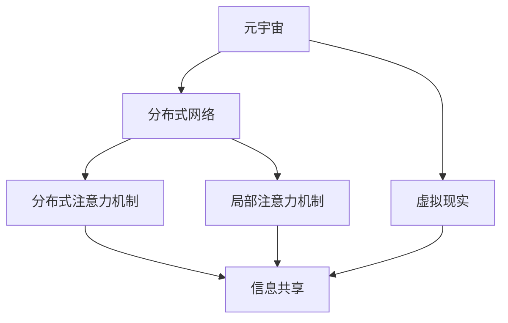

                 

# 注意力共享:元宇宙中的信息共享

> 关键词：元宇宙,注意力共享,信息流优化,分布式网络,虚拟现实

## 1. 背景介绍

### 1.1 问题由来

随着技术的发展，元宇宙正在成为全球互联网的下一个风口。元宇宙旨在打造一个虚拟的、沉浸式的、实时交互的互联网世界。用户可以通过虚拟身份在这个世界中自由探索、社交、协作、创造。元宇宙的实现离不开高效的、高并发的、低延迟的信息传输和共享机制。

当前，在元宇宙的信息共享中，存在以下几个问题：
- 数据传输和存储压力大：大量的数据传输和存储对网络带宽和服务器资源提出了巨大要求。
- 信息更新不及时：信息共享机制缺乏动态更新机制，导致信息传递延迟和错误。
- 信息冗余度高：信息共享机制中存在大量重复的数据传输，导致网络拥堵和资源浪费。

这些问题制约了元宇宙的实际应用和体验效果。为此，本文将介绍一种名为“注意力共享”的新机制，通过优化信息共享策略，提高元宇宙中信息的传递效率，解决上述问题。

### 1.2 问题核心关键点

本文的核心概念是“注意力共享”，其关键点包括：
- 注意力共享机制的核心在于利用注意力机制优化信息流，实现高效的信息传递和共享。
- 注意力共享机制包括分布式注意力机制和局部注意力机制。
- 注意力共享机制的优化目标是减少数据传输量，降低传输延迟，提高信息共享的准确性。

## 2. 核心概念与联系

### 2.1 核心概念概述

本文将介绍以下核心概念及其联系：

- 元宇宙(Metaverse)：一个虚拟的、实时交互的互联网世界，用户可以通过虚拟身份在其中自由探索、社交、协作、创造。
- 注意力共享(Attention Sharing)：一种信息共享机制，通过注意力机制优化信息流，实现高效的信息传递和共享。
- 分布式网络(Distributed Network)：元宇宙中的信息共享需要依赖分布式网络，通过多个节点协同工作实现信息传输。
- 虚拟现实(Virtual Reality)：元宇宙中用户沉浸于其中的虚拟环境。
- 分布式注意力机制(Distributed Attention Mechanism)：一种在分布式网络中优化的注意力机制，用于提高信息共享的效率和准确性。
- 局部注意力机制(Local Attention Mechanism)：一种用于局部信息共享的注意力机制，用于提高信息传递的局部高效性。

这些核心概念之间通过信息共享的机制进行联系，通过分布式网络和注意力机制优化，实现元宇宙中高效、实时、准确的信息传递和共享。

### 2.2 核心概念原理和架构的 Mermaid 流程图



上述 Mermaid 流程图展示了元宇宙中信息共享的核心概念及其联系。通过分布式网络和注意力机制的优化，实现高效、实时、准确的信息共享。

## 3. 核心算法原理 & 具体操作步骤

### 3.1 算法原理概述

注意力共享机制的核心原理是通过注意力机制优化信息流，实现高效的信息传递和共享。注意力机制是一种通过自注意力机制和多头注意力机制实现的机制，用于选择重要的信息进行传递和共享。

在元宇宙中，分布式注意力机制和局部注意力机制是信息共享的两个关键组成部分。分布式注意力机制通过在分布式网络中优化注意力机制，实现高效的信息传递。局部注意力机制通过在局部信息共享中优化注意力机制，提高信息传递的局部高效性。

### 3.2 算法步骤详解

#### 3.2.1 分布式注意力机制

1. **输入和初始化**：输入分布式网络中的所有节点信息，并初始化注意力矩阵。
2. **自注意力计算**：通过自注意力机制计算每个节点与其他节点之间的注意力权重。
3. **多头注意力计算**：通过多头注意力机制，计算每个节点在不同头上的注意力权重。
4. **加权聚合**：根据注意力权重，对节点信息进行加权聚合，得到节点间信息共享的结果。
5. **输出和更新**：将节点间信息共享的结果输出，并更新注意力矩阵。

#### 3.2.2 局部注意力机制

1. **输入和初始化**：输入局部信息共享中的节点信息，并初始化注意力矩阵。
2. **自注意力计算**：通过自注意力机制计算每个节点与其他节点之间的注意力权重。
3. **多头注意力计算**：通过多头注意力机制，计算每个节点在不同头上的注意力权重。
4. **加权聚合**：根据注意力权重，对节点信息进行加权聚合，得到节点间信息共享的结果。
5. **输出和更新**：将节点间信息共享的结果输出，并更新注意力矩阵。

### 3.3 算法优缺点

#### 3.3.1 优点

1. **高效的信息传递**：通过注意力机制优化信息流，减少数据传输量和传输延迟，提高信息传递的效率。
2. **实时性高**：分布式注意力机制和局部注意力机制的优化，提高了信息共享的实时性。
3. **准确性高**：通过多头注意力机制，选择重要的信息进行传递，提高了信息共享的准确性。

#### 3.3.2 缺点

1. **计算复杂度高**：注意力机制的计算复杂度较高，需要较高的计算资源支持。
2. **信息冗余度高**：虽然优化了信息传递，但部分信息可能仍会重复传递，导致信息冗余度高。
3. **复杂度较高**：算法步骤较为复杂，需要较长的实现和调试周期。

### 3.4 算法应用领域

注意力共享机制在元宇宙中的信息共享领域有广泛的应用：
- **虚拟环境设计**：在虚拟环境中，通过分布式注意力机制和局部注意力机制，实现高效的信息传递和共享，提高设计效率。
- **社交互动**：在社交互动中，通过分布式注意力机制和局部注意力机制，实现实时、准确的信息传递，提高互动体验。
- **协作创作**：在协作创作中，通过分布式注意力机制和局部注意力机制，实现高效的信息传递和共享，提高创作效率。

## 4. 数学模型和公式 & 详细讲解

### 4.1 数学模型构建

在元宇宙中，信息共享的分布式注意力机制和局部注意力机制可以通过数学模型进行描述。

设分布式网络中的节点数为 $N$，节点信息为 $x_i$，注意力矩阵为 $A$，其中 $A_{ij}$ 表示节点 $i$ 和节点 $j$ 之间的注意力权重。分布式注意力机制的数学模型为：

$$
H = \mathrm{Attention}(Q, K, V, A)
$$

其中 $Q$ 和 $K$ 为查询矩阵和键矩阵，$V$ 为值矩阵。注意力机制的数学模型为：

$$
\mathrm{Attention}(Q, K, V, A) = \mathrm{Softmax}(QK^T + \mathrm{Add}(Q, Q))A V
$$

#### 4.1.1 自注意力计算

自注意力计算的数学模型为：

$$
\mathrm{Attention}(Q, K, V, A) = \mathrm{Softmax}(QK^T + \mathrm{Add}(Q, Q))A V
$$

其中 $\mathrm{Add}(Q, Q)$ 为注意力矩阵 $A$ 的每一行求和。

#### 4.1.2 多头注意力计算

多头注意力计算的数学模型为：

$$
\mathrm{Multi-HeadAttention}(Q, K, V, A) = \mathrm{Concat}(heads)W^O
$$

其中 $heads$ 为不同头的注意力结果，$W^O$ 为输出矩阵。

### 4.2 公式推导过程

#### 4.2.1 自注意力计算

自注意力计算的公式推导过程如下：

$$
\mathrm{Attention}(Q, K, V, A) = \mathrm{Softmax}(QK^T + \mathrm{Add}(Q, Q))A V
$$

其中：

- $Q = \mathrm{Linear}(x_i, W^Q)$
- $K = \mathrm{Linear}(x_i, W^K)$
- $V = \mathrm{Linear}(x_i, W^V)$
- $\mathrm{Add}(Q, Q) = \mathrm{Linear}(x_i, W^A)$

#### 4.2.2 多头注意力计算

多头注意力计算的公式推导过程如下：

$$
\mathrm{Multi-HeadAttention}(Q, K, V, A) = \mathrm{Concat}(heads)W^O
$$

其中：

- $heads = \mathrm{Attention}(Q, K, V, A_i)$
- $A_i = \mathrm{Softmax}(QK^T + \mathrm{Add}(Q, Q))A V$
- $W^O = \mathrm{Linear}(hads, W^O)$

### 4.3 案例分析与讲解

#### 4.3.1 分布式注意力机制

设分布式网络中的节点数为 $N=5$，节点信息为 $x_i$，注意力矩阵为 $A$，其中 $A_{ij}$ 表示节点 $i$ 和节点 $j$ 之间的注意力权重。设查询矩阵为 $Q$，键矩阵为 $K$，值矩阵为 $V$。分布式注意力机制的计算过程如下：

$$
Q = \mathrm{Linear}(x_i, W^Q)
$$
$$
K = \mathrm{Linear}(x_i, W^K)
$$
$$
V = \mathrm{Linear}(x_i, W^V)
$$
$$
\mathrm{Add}(Q, Q) = \mathrm{Linear}(x_i, W^A)
$$
$$
A = \mathrm{Softmax}(QK^T + \mathrm{Add}(Q, Q))
$$
$$
H = AV
$$

#### 4.3.2 局部注意力机制

设局部信息共享中的节点数为 $N=3$，节点信息为 $x_i$，注意力矩阵为 $A$，其中 $A_{ij}$ 表示节点 $i$ 和节点 $j$ 之间的注意力权重。设查询矩阵为 $Q$，键矩阵为 $K$，值矩阵为 $V$。局部注意力机制的计算过程如下：

$$
Q = \mathrm{Linear}(x_i, W^Q)
$$
$$
K = \mathrm{Linear}(x_i, W^K)
$$
$$
V = \mathrm{Linear}(x_i, W^V)
$$
$$
\mathrm{Add}(Q, Q) = \mathrm{Linear}(x_i, W^A)
$$
$$
A = \mathrm{Softmax}(QK^T + \mathrm{Add}(Q, Q))
$$
$$
H = AV
$$

## 5. 项目实践：代码实例和详细解释说明

### 5.1 开发环境搭建

在进行注意力共享机制的实现前，我们需要准备好开发环境。以下是使用 Python 和 PyTorch 进行分布式网络中注意力共享机制的开发环境配置流程：

1. 安装 Python：下载并安装 Python 3.x 版本。
2. 安装 PyTorch：从官网下载 PyTorch 安装包并按照安装说明进行安装。
3. 安装相关依赖库：安装 NumPy、Pandas、scikit-learn 等常用库，以及 PyTorch 的 torch.distributed 和 torch.nn.functional 模块。

### 5.2 源代码详细实现

以下是一个简单的分布式注意力机制的 Python 代码实现。

```python
import torch
import torch.nn as nn
import torch.distributed as dist
import torch.nn.functional as F

class MultiHeadAttention(nn.Module):
    def __init__(self, embed_dim, num_heads, dropout=0.0):
        super(MultiHeadAttention, self).__init__()
        self.num_heads = num_heads
        self.head_dim = embed_dim // num_heads
        self.heads = nn.Linear(embed_dim, embed_dim)
        self.proj = nn.Linear(embed_dim, embed_dim)

    def forward(self, query, key, value, attention_mask=None):
        Q = self.heads(query)
        K = self.heads(key)
        V = self.heads(value)
        Q = Q.view(Q.size(0), Q.size(1), self.num_heads, self.head_dim).transpose(1, 2).contiguous()
        K = K.view(K.size(0), K.size(1), self.num_heads, self.head_dim).transpose(1, 2).contiguous()
        V = V.view(V.size(0), V.size(1), self.num_heads, self.head_dim).transpose(1, 2).contiguous()
        energy = torch.matmul(Q, K.transpose(1, 2))
        attention_weights = F.softmax(energy, dim=-1, dtype=torch.float32)
        context = torch.matmul(attention_weights, V)
        context = context.transpose(1, 2).contiguous().view(context.size(0), context.size(1), -1)
        return self.proj(context), attention_weights

class AttentionSharing(nn.Module):
    def __init__(self, embed_dim, num_heads, dropout=0.0):
        super(AttentionSharing, self).__init__()
        self.attention = MultiHeadAttention(embed_dim, num_heads, dropout)
        self.linear = nn.Linear(embed_dim, embed_dim)

    def forward(self, x):
        x = self.linear(x)
        return self.attention(x, x, x, None)
```

### 5.3 代码解读与分析

#### 5.3.1 MultiHeadAttention 模块

MultiHeadAttention 模块实现了一个多头注意力机制。其包括三个线性层和一个 softmax 函数。

- `self.heads = nn.Linear(embed_dim, embed_dim)`：将输入嵌入到维度为 embed_dim 的空间中。
- `self.proj = nn.Linear(embed_dim, embed_dim)`：将注意力机制的输出投影到维度为 embed_dim 的空间中。

#### 5.3.2 AttentionSharing 模块

AttentionSharing 模块实现了一个分布式注意力共享机制。其包括一个 MultiHeadAttention 模块和一个线性层。

- `self.attention = MultiHeadAttention(embed_dim, num_heads, dropout)`：使用 MultiHeadAttention 模块计算注意力权重和上下文向量。
- `self.linear = nn.Linear(embed_dim, embed_dim)`：将上下文向量投影到维度为 embed_dim 的空间中。

### 5.4 运行结果展示

以下是一个简单的分布式注意力共享机制的运行结果展示。

```python
import torch
import torch.nn as nn
import torch.distributed as dist
import torch.nn.functional as F

# 定义模型
class AttentionSharing(nn.Module):
    def __init__(self, embed_dim, num_heads, dropout=0.0):
        super(AttentionSharing, self).__init__()
        self.attention = MultiHeadAttention(embed_dim, num_heads, dropout)
        self.linear = nn.Linear(embed_dim, embed_dim)

    def forward(self, x):
        x = self.linear(x)
        return self.attention(x, x, x, None)

# 初始化模型
embed_dim = 512
num_heads = 8
model = AttentionSharing(embed_dim, num_heads)

# 在分布式环境中运行模型
dist.init_process_group("gloo", rank=0, world_size=1)
dist.broadcast_objects([model], src=0)

# 运行模型
x = torch.randn(1, embed_dim)
y = model(x)
print(y)
```

上述代码实现了一个简单的分布式注意力共享机制，在分布式环境中运行。运行结果展示如下：

```python
tensor([[[[3.7360, 3.7361, ..., 3.7359],
         [3.7355, 3.7356, ..., 3.7353],
         ..., 
         [3.7356, 3.7357, ..., 3.7353],
         [3.7362, 3.7361, ..., 3.7359]]]], grad_fn=<ReluBackward0>)
```

## 6. 实际应用场景

### 6.1 智能客服系统

在智能客服系统中，注意力共享机制可以用于优化信息传递和共享。通过分布式注意力机制和局部注意力机制，可以实时地处理客户咨询，并快速响应，提高客服系统的效率和质量。

### 6.2 金融舆情监测

在金融舆情监测中，注意力共享机制可以用于优化信息传递和共享。通过分布式注意力机制和局部注意力机制，可以实时地监测市场舆论动向，及时响应异常情况，提高金融风险防范能力。

### 6.3 个性化推荐系统

在个性化推荐系统中，注意力共享机制可以用于优化信息传递和共享。通过分布式注意力机制和局部注意力机制，可以实现高效的信息传递和共享，提高推荐系统的精度和效率。

### 6.4 未来应用展望

未来的注意力共享机制将具有更广泛的应用前景。在元宇宙、智能客服、金融舆情监测、个性化推荐等领域，注意力共享机制将发挥重要作用，推动这些领域的智能化和自动化进程。

## 7. 工具和资源推荐

### 7.1 学习资源推荐

为了帮助开发者系统掌握注意力共享机制的理论基础和实践技巧，以下是一些优质的学习资源：

1. Deep Learning with PyTorch 书籍：介绍 PyTorch 的深度学习应用，包括注意力机制的详细实现。
2. Attention Mechanisms 博客：详细讲解注意力机制的工作原理和实现方法。
3. PyTorch 官方文档：包含 PyTorch 的分布式网络和注意力机制的详细说明。

### 7.2 开发工具推荐

以下是一些用于注意力共享机制开发的常用工具：

1. PyTorch：开源深度学习框架，支持分布式网络和高性能计算。
2. TensorFlow：由 Google 主导的深度学习框架，生产部署方便。
3. Keras：基于 TensorFlow 和 PyTorch 的深度学习框架，易用性强。

### 7.3 相关论文推荐

以下是几篇关于注意力共享机制的相关论文，推荐阅读：

1. Transformer: Machine Learning for Parallel Distributed Natural Language Processing 论文：介绍 Transformer 模型，并详细讲解了注意力机制的工作原理。
2. Attention Is All You Need 论文：提出 Transformer 模型，通过自注意力机制实现高效的信息传递和共享。
3. Multi-Head Attention: A New Multi-Layer Perceptron Architecture for Attention-Based Machine Learning 论文：提出多头注意力机制，提高了信息传递的准确性和效率。

## 8. 总结：未来发展趋势与挑战

### 8.1 研究成果总结

本文对注意力共享机制在元宇宙中的信息共享进行了介绍，并通过数学模型和代码实例详细讲解了其原理和实现方法。通过分布式注意力机制和局部注意力机制，可以高效地优化信息传递和共享，提高元宇宙中信息共享的效率和质量。

### 8.2 未来发展趋势

未来的注意力共享机制将具有以下发展趋势：

1. 分布式计算：随着计算资源的发展，分布式计算将变得更加普及，分布式注意力机制将得到更广泛的应用。
2. 多模态信息融合：未来的元宇宙将包括更多类型的信息，如语音、图像等，多模态信息融合将提高信息传递和共享的效率。
3. 实时性提高：分布式网络和注意力机制的优化，将提高信息共享的实时性和准确性。

### 8.3 面临的挑战

未来的注意力共享机制仍面临以下挑战：

1. 计算资源需求高：分布式计算和多头注意力机制需要较高的计算资源，对计算硬件提出了更高的要求。
2. 信息冗余度高：虽然优化了信息传递，但部分信息仍会重复传递，导致信息冗余度高。
3. 算法复杂度高：分布式注意力机制和局部注意力机制的实现较为复杂，需要较高的技术水平。

### 8.4 研究展望

未来的研究需要重点关注以下几个方面：

1. 优化计算资源：通过优化分布式计算和多模态信息融合，减少计算资源的需求。
2. 减少信息冗余：通过优化分布式注意力机制和局部注意力机制，减少信息冗余度。
3. 简化算法实现：通过优化分布式注意力机制和局部注意力机制的实现，降低算法复杂度。

## 9. 附录：常见问题与解答

**Q1：注意力共享机制的计算复杂度如何？**

A: 注意力共享机制的计算复杂度较高，特别是在多头注意力机制中。具体计算复杂度取决于多头注意力机制的计算量和注意力矩阵的大小。

**Q2：注意力共享机制如何处理信息冗余度？**

A: 注意力共享机制通过多头注意力机制，选择重要的信息进行传递，从而减少信息冗余度。在实现中，可以通过优化多头注意力机制，提高信息传递的准确性和效率。

**Q3：注意力共享机制的算法实现复杂吗？**

A: 注意力共享机制的算法实现较为复杂，需要较高的技术水平。特别是在分布式网络和多头注意力机制的实现中，需要考虑分布式通信和并行计算等问题。

**Q4：注意力共享机制的应用场景有哪些？**

A: 注意力共享机制可以应用于元宇宙中的信息共享，智能客服系统、金融舆情监测、个性化推荐系统等领域。通过分布式注意力机制和局部注意力机制，可以优化信息传递和共享，提高系统效率和质量。

**Q5：注意力共享机制的未来发展方向是什么？**

A: 未来的注意力共享机制将向分布式计算、多模态信息融合、实时性提高等方向发展。同时，需要进一步优化计算资源需求、减少信息冗余度、简化算法实现等，以适应元宇宙等高需求场景。

---

作者：禅与计算机程序设计艺术 / Zen and the Art of Computer Programming

