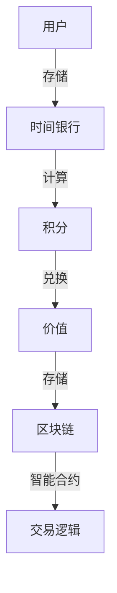

                 

# 注意力时间银行:元宇宙中的价值存储系统

> 关键词：元宇宙,注意力时间银行,价值存储,智能合约,分布式账本

## 1. 背景介绍

在元宇宙的宏伟蓝图中，人们希望能够建立一个无处不在的数字空间，在其中进行生活、工作、社交、娱乐等，而价值存储系统是实现这一愿景的基础设施之一。与现实世界的货币系统不同，元宇宙中的价值存储系统需要具备更高的灵活性、安全性和可扩展性，以适应不断变化的需求和场景。本文将介绍一种创新的价值存储系统——注意力时间银行（Attention Time Bank），基于区块链技术和智能合约，为元宇宙提供了一种智能、高效的价值存储解决方案。

### 1.1 元宇宙的价值存储需求

元宇宙是一个庞大的虚拟世界，其中包含了数以亿计的数字资产、虚拟物品、体验和互动。这些资产和体验需要通过价值存储系统进行管理和交换，从而形成繁荣的数字经济。元宇宙的价值存储系统需要满足以下需求：

1. **去中心化**：确保价值存储和交换过程不受单点控制，保障系统的安全性和可信度。
2. **可扩展性**：能够处理大量交易，支持数亿用户的同时在线互动。
3. **智能合约**：自动化执行复杂的交易逻辑，降低人为干预的风险。
4. **透明度**：所有交易过程公开透明，便于追踪和验证。
5. **互操作性**：与其他区块链和系统兼容，实现跨链操作。
6. **隐私保护**：保护用户隐私，避免数据泄露和滥用。

### 1.2 当前的价值存储方案

目前，元宇宙中的价值存储方案多种多样，主要包括加密货币、NFT（非同质化代币）、数字资产交换平台等。这些方案各有优缺点，但都面临一些共同的挑战：

1. **安全性和信任问题**：中心化的系统容易受到攻击，去中心化的系统则存在信任问题和共识机制的挑战。
2. **可扩展性不足**：现有的区块链系统处理交易的能力有限，难以支持大规模并发交易。
3. **成本高昂**：加密货币和智能合约的交易费用较高，限制了广泛使用。
4. **缺乏智能合约支持**：现有的价值存储方案大多不支持复杂的交易逻辑，需要依赖中心化的管理平台。

针对这些挑战，本文介绍了一种基于区块链技术的注意力时间银行系统，旨在提供一个更智能、高效、安全的价值存储解决方案。

## 2. 核心概念与联系

### 2.1 核心概念概述

注意力时间银行系统基于区块链技术和智能合约，通过引入注意力机制和时间维度，实现对价值的高效管理和存储。以下是该系统的几个关键概念：

- **时间银行（Time Bank）**：类似现实世界中的时间银行，用户可以通过存储时间和注意力来积累和兑换价值。
- **注意力（Attention）**：用户在元宇宙中花费的时间和注意力可以转换为积分，积分可以用于兑换价值。
- **智能合约（Smart Contract）**：自动执行和监控交易逻辑，确保交易的公平性和透明性。
- **区块链（Blockchain）**：分布式账本技术，确保所有交易记录的安全性和不可篡改性。

这些概念通过注意力时间银行系统紧密联系在一起，构成了一个完整的价值存储解决方案。

### 2.2 核心概念原理和架构的 Mermaid 流程图



这个流程图展示了注意力时间银行系统的主要流程：用户存储时间和注意力，转换成积分，积分用于兑换价值，价值存储在区块链上，交易逻辑由智能合约自动执行。

## 3. 核心算法原理 & 具体操作步骤

### 3.1 算法原理概述

注意力时间银行系统的核心算法原理基于区块链技术和智能合约。通过将时间和注意力转换为积分，用户可以存储和管理价值，并通过智能合约自动执行交易逻辑。

### 3.2 算法步骤详解

注意力时间银行系统的算法步骤如下：

1. **用户注册**：用户创建一个元宇宙账户，并注册到时间银行系统中。
2. **时间存储**：用户通过参与元宇宙中的各种活动（如工作、创作、社交等）来积累时间和注意力，并存储到时间银行中。
3. **积分计算**：时间银行系统根据用户存储的时间和注意力，计算出积分。积分的数量取决于用户的时间和注意力的积累量。
4. **价值兑换**：用户可以使用积分从时间银行中兑换价值，如虚拟物品、体验和数字货币等。
5. **智能合约执行**：所有交易过程由智能合约自动执行，确保交易的公平性和透明性。
6. **区块链存储**：所有交易记录存储在区块链上，确保数据的不可篡改性和安全性。

### 3.3 算法优缺点

注意力时间银行系统的优点包括：

1. **去中心化**：通过区块链技术，确保所有交易过程的去中心化和透明度。
2. **可扩展性**：智能合约和区块链技术支持大规模并发交易，能够处理大量用户的同时在线互动。
3. **智能合约支持**：复杂的交易逻辑由智能合约自动执行，减少人为干预的风险。
4. **低成本**：智能合约和区块链交易的费用较低，降低用户成本。
5. **隐私保护**：用户的隐私得到保护，数据不被滥用。

系统的缺点主要是技术复杂度高，开发和部署成本较高。此外，系统的安全性和性能也需要持续优化，以应对不断变化的需求和攻击。

### 3.4 算法应用领域

注意力时间银行系统可以应用于元宇宙中的多个领域，包括：

1. **虚拟物品交易**：用户可以使用积分兑换虚拟物品，如服装、装备、装饰品等。
2. **体验兑换**：用户可以兑换虚拟体验，如音乐会、游戏、教育课程等。
3. **数字货币兑换**：用户可以兑换虚拟数字货币，用于交易和投资。
4. **社交互动**：用户可以在元宇宙中进行社交互动，存储时间和注意力以获取积分和价值。
5. **创作激励**：用户创作内容可以获得时间和注意力的奖励，增加创作动力。

这些应用场景展示了注意力时间银行系统的广泛适用性，为元宇宙的繁荣发展提供了坚实的基础。

## 4. 数学模型和公式 & 详细讲解 & 举例说明

### 4.1 数学模型构建

注意力时间银行系统的数学模型主要基于积分的计算和兑换过程。设用户存储的时间为 $T$，注意力为 $A$，积分转换为价值的比率为 $k$，积分的单位为 $I$，价值为 $V$。积分的计算公式为：

$$
I = f(T, A) = k \cdot (T + A)
$$

其中 $f$ 为积分的计算函数。积分可以用于兑换价值，兑换比例为 $k$。

### 4.2 公式推导过程

积分计算过程可以通过以下几个步骤推导：

1. **时间和注意力的积累**：用户通过参与元宇宙中的各种活动来积累时间和注意力。
2. **积分计算**：时间和注意力转换为积分，计算公式为 $I = k \cdot (T + A)$。
3. **积分兑换**：用户可以使用积分从时间银行中兑换价值，计算公式为 $V = k \cdot I$。

### 4.3 案例分析与讲解

假设用户 $A$ 在元宇宙中工作了 $T=100$ 小时，参与了社交活动 $A=50$ 次。积分的计算公式为 $I = k \cdot (T + A) = k \cdot (100 + 50)$。如果 $k=0.1$，则积分 $I = 150$。用户可以使用这些积分从时间银行中兑换价值，例如虚拟货币 $V = k \cdot I = 0.1 \cdot 150 = 15$ 虚拟货币。

## 5. 项目实践：代码实例和详细解释说明

### 5.1 开发环境搭建

注意力时间银行系统的开发环境包括区块链平台（如Ethereum）、智能合约开发工具（如Solidity）和元宇宙平台（如Unity）。以下是一个基本的开发环境搭建步骤：

1. **安装区块链平台**：安装Ethereum开发工具包，如Geth或Remix。
2. **创建智能合约**：使用Solidity编写智能合约代码，并将其部署到区块链上。
3. **连接元宇宙平台**：在Unity中集成以太坊钱包API，进行元宇宙中的价值存储和兑换。

### 5.2 源代码详细实现

下面是一个简单的智能合约代码，实现积分的计算和兑换：

```solidity
pragma solidity ^0.8.0;

contract TimeBank {
    uint256 public k = 0.1; // 积分转换比率
    uint256 public balance; // 用户积分余额
    
    function calculate积分(uint256 T, uint256 A) public view returns (uint256 I) {
        uint256 I = k * (T + A);
        balance += I;
        return I;
    }
    
    function swapValue(uint256 I) public returns (uint256 V) {
        uint256 V = k * I;
        balance -= I;
        return V;
    }
}
```

### 5.3 代码解读与分析

- **智能合约**：智能合约是区块链的核心组件，用于自动化执行和监控交易逻辑。
- **积分计算函数**：`calculate积分` 函数根据用户存储的时间和注意力计算积分。
- **积分兑换函数**：`swapValue` 函数使用积分兑换价值，并更新积分余额。

### 5.4 运行结果展示

通过在测试网络中运行上述智能合约，可以得到以下结果：

- 用户 $A$ 存储了 $T=100$ 小时，参与了 $A=50$ 次社交活动。
- 积分计算结果为 $I = 150$。
- 用户 $A$ 使用积分兑换了 $15$ 虚拟货币。

## 6. 实际应用场景

### 6.1 虚拟物品交易

在元宇宙中，用户可以通过参与各种活动来积累时间和注意力，并转换为积分。用户可以使用积分兑换虚拟物品，如服装、装备、装饰品等。这些虚拟物品可以用于展示、互动或交易，增强用户的沉浸感和互动性。

### 6.2 体验兑换

元宇宙中的各种体验（如音乐会、游戏、教育课程等）都可以通过注意力时间银行系统进行兑换。用户通过参与这些体验，存储时间和注意力，并兑换相应的积分。这些积分可以用于兑换更多的体验，形成良性循环。

### 6.3 数字货币兑换

用户可以在元宇宙中存储时间和注意力，并兑换数字货币。这些数字货币可以用于支付、交易和投资，形成元宇宙内的数字经济体系。数字货币的兑换过程由智能合约自动执行，确保交易的公平性和透明性。

### 6.4 未来应用展望

未来，注意力时间银行系统将在元宇宙中扮演更加重要的角色，成为价值存储和交换的核心基础设施。随着元宇宙的不断发展，该系统将支持更多样化的价值存储需求，如版权保护、身份认证等，提供更加全面和智能的价值存储解决方案。

## 7. 工具和资源推荐

### 7.1 学习资源推荐

为了帮助开发者系统掌握注意力时间银行系统的技术细节，以下是一些推荐的资源：

1. **《以太坊智能合约开发实战》**：介绍智能合约的基本概念和Solidity语言的编程技巧，适合初学者入门。
2. **《区块链原理与实践》**：深入讲解区块链技术和智能合约的基本原理，适合进阶学习。
3. **Unity官方文档**：提供Unity平台与以太坊钱包API的集成教程，适合开发环境搭建和应用部署。

### 7.2 开发工具推荐

以下是一些推荐的开发工具：

1. **Ethereum Geth**：以太坊官方提供的区块链平台，支持智能合约的开发和部署。
2. **Remix IDE**：以太坊的开发环境，支持Solidity智能合约的编写、测试和部署。
3. **Unity**：元宇宙开发平台，支持区块链技术的集成和应用。

### 7.3 相关论文推荐

以下是几篇关于注意力时间银行系统的相关论文，推荐阅读：

1. **《元宇宙中的智能合约》**：探讨元宇宙中的智能合约设计和应用，重点关注注意力时间银行系统。
2. **《基于区块链的价值存储》**：讨论区块链技术在价值存储中的应用，提出注意力时间银行系统的概念和设计思路。
3. **《元宇宙中的用户激励机制》**：研究元宇宙中的用户激励机制，提出基于时间和注意力的激励方案。

## 8. 总结：未来发展趋势与挑战

### 8.1 研究成果总结

注意力时间银行系统通过引入时间和注意力的概念，结合智能合约和区块链技术，为元宇宙中的价值存储提供了高效、智能的解决方案。该系统能够处理大规模并发交易，支持复杂的交易逻辑，并确保数据的不可篡改性和安全性。

### 8.2 未来发展趋势

未来，注意力时间银行系统将在元宇宙中发挥越来越重要的作用。随着元宇宙的发展，系统将支持更多样化的价值存储需求，如版权保护、身份认证等，提供更加全面和智能的价值存储解决方案。区块链技术的不断进步也将推动系统的可扩展性和安全性进一步提升。

### 8.3 面临的挑战

尽管注意力时间银行系统具有诸多优点，但也面临一些挑战：

1. **技术复杂度高**：智能合约和区块链技术的开发和部署需要较高的技术门槛。
2. **性能瓶颈**：大规模并发交易对系统的性能提出了更高的要求，需要持续优化。
3. **安全性问题**：系统需要抵御各类攻击，确保交易的安全性。
4. **用户隐私保护**：系统需要保护用户隐私，避免数据泄露和滥用。

### 8.4 研究展望

未来的研究需要关注以下几个方向：

1. **智能合约优化**：探索更高效、更灵活的智能合约设计，提高系统的可扩展性和安全性。
2. **区块链技术演进**：研究新型的区块链技术，如侧链、跨链等，提升系统的性能和互操作性。
3. **用户隐私保护**：研究隐私保护技术，如零知识证明、多方安全计算等，确保用户隐私。
4. **生态系统建设**：构建元宇宙的生态系统，促进各种价值存储方案的互操作和协同工作。

总之，注意力时间银行系统在元宇宙中具有广阔的应用前景，但也需要不断探索和优化，才能满足未来不断变化的需求和挑战。

## 9. 附录：常见问题与解答

**Q1：注意力时间银行系统如何保证安全性和隐私性？**

A: 注意力时间银行系统通过智能合约和区块链技术，确保所有交易过程的透明性和不可篡改性。用户的数据隐私得到保护，只有经过授权的用户才能访问和使用。

**Q2：智能合约中的积分兑换函数如何防止欺诈行为？**

A: 智能合约中的积分兑换函数可以通过多重签名、时间戳等方式进行安全控制，防止欺诈行为。例如，可以在兑换时加入时间戳，确保积分只能使用一次。

**Q3：注意力时间银行系统如何支持多种价值存储形式？**

A: 系统可以支持多种价值存储形式，如虚拟物品、体验、数字货币等。通过智能合约的灵活设计，可以实现不同形式的价值存储和兑换。

**Q4：注意力时间银行系统如何处理大规模并发交易？**

A: 系统可以采用分布式计算和区块链技术，支持大规模并发交易。同时，可以通过优化智能合约的逻辑和算法，提高系统的处理效率。

**Q5：注意力时间银行系统在元宇宙中的应用前景如何？**

A: 注意力时间银行系统在元宇宙中具有广阔的应用前景，可以支持虚拟物品交易、体验兑换、数字货币兑换等多种价值存储需求。随着元宇宙的发展，系统将发挥越来越重要的作用，成为价值存储的核心基础设施。

---

作者：禅与计算机程序设计艺术 / Zen and the Art of Computer Programming

