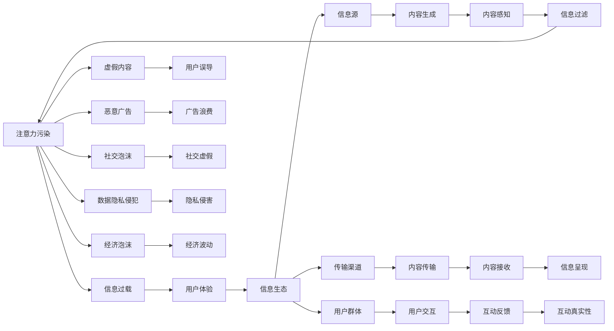

                 

# 注意力污染治理:元宇宙时代的信息生态保护

## 1. 背景介绍

### 1.1 问题由来
随着技术的快速发展和应用的普及，元宇宙（Metaverse）已经逐渐从科幻进入现实，成为虚拟世界的未来形态。元宇宙赋予人类新的生存体验，为数字化生活提供了更广阔的空间，但也带来了一系列新的挑战。其中，信息生态的污染问题愈发严重，影响着元宇宙用户的体验和信任。

### 1.2 问题核心关键点
元宇宙时代的信息生态污染主要表现在以下几个方面：

- **注意力滥用**：大量垃圾信息、恶意广告、虚假内容等占用用户注意力，影响用户体验。
- **信息过载**：数据量爆炸式增长，用户难以在海量信息中筛选有用内容。
- **社交泡沫化**：社交网络中“假粉丝”、虚假互动等现象频发，影响了社交的真实性。
- **数据隐私侵犯**：大量个人信息被滥用，导致隐私泄露和滥用。
- **经济泡沫**：元宇宙中的虚拟货币和游戏内购等，造成经济泡沫和市场波动。

这些问题不仅损害了用户利益，还威胁着元宇宙生态系统的稳定性和可持续性。因此，治理信息生态污染成为元宇宙健康发展的重要一环。

## 2. 核心概念与联系

### 2.1 核心概念概述

为更好地理解注意力污染治理的原理和实现方法，本节将介绍几个关键概念：

- **注意力污染（Attention Pollution）**：指在元宇宙中，不良信息不断抢占用户注意力，造成信息过载和误导，从而影响用户体验和信息生态。
- **信息生态（Information Ecosystem）**：指元宇宙中各种信息要素的相互关系和交互方式，包括信息源、传输渠道、用户群体等。
- **治理机制（Governance Mechanism）**：指通过规则、算法、工具等手段，维护元宇宙信息生态的稳定性和健康度，避免信息污染。
- **注意力经济学（Attention Economy）**：指在元宇宙中，注意力作为一种稀缺资源，如何分配和利用以实现最大化的经济效益和社会效益。
- **社交网络平台（Social Network Platform）**：指元宇宙中用户进行社交互动的虚拟空间，如VR社区、游戏世界等。

这些核心概念之间相互联系，共同构成了元宇宙信息生态保护的目标和手段。通过明确这些概念，我们可以更系统地思考如何构建和维护元宇宙的信息生态。

### 2.2 核心概念原理和架构的 Mermaid 流程图



这个流程图展示了注意力污染与信息生态各要素之间的联系和相互作用。

## 3. 核心算法原理 & 具体操作步骤
### 3.1 算法原理概述

元宇宙信息生态的治理机制，主要基于注意力经济学原理，通过算法手段来优化信息资源的分配和利用，控制信息污染的扩散。

基本思想是：通过对信息源、传输渠道和用户群体进行管理和调控，实现信息的高效、精准、公正传输，避免信息污染的发生。这包括：

- **信息筛选与过滤**：通过算法识别和剔除虚假信息、恶意广告、不良内容等，减少对用户注意力的干扰。
- **注意力分配与优化**：通过算法调整信息优先级，优化信息传输路径，确保用户注意力集中在优质内容上。
- **用户行为监控与反馈**：通过算法监测用户行为，及时发现信息污染，并通过反馈机制进行调整。

### 3.2 算法步骤详解

1. **数据采集与处理**：采集元宇宙中的信息数据，包括文本、图片、视频等，并进行预处理。

2. **信息识别与分类**：利用机器学习算法（如深度学习、自然语言处理）对信息进行识别和分类，包括垃圾信息、虚假内容、恶意广告等。

3. **注意力分配**：通过注意力模型（如Transformer），计算信息与用户之间的注意力权重，评估信息的价值和重要性。

4. **信息过滤与优先级调整**：根据注意力权重，对信息进行过滤和优先级调整，确保高质量信息优先展示。

5. **用户反馈与调整**：收集用户对信息的反馈，不断优化算法，提高信息筛选和分配的准确性。

### 3.3 算法优缺点

基于注意力经济学原理的信息生态治理机制，有以下优点：

- **高效性**：算法能够快速识别和处理信息，提升信息传输效率。
- **精准性**：利用机器学习技术，实现信息筛选的精准化，减少误判和漏判。
- **自适应性**：算法可以根据用户反馈不断调整，适应信息生态的变化。

但同时也存在一些局限：

- **算法依赖性**：算法质量直接影响信息筛选效果，依赖于数据和模型的选择。
- **隐私保护挑战**：在信息筛选过程中，可能涉及用户隐私数据，需要谨慎处理。
- **恶意攻击风险**：恶意用户可能通过对抗样本等方式攻击信息筛选算法，需加强算法鲁棒性。

### 3.4 算法应用领域

基于注意力经济学原理的信息生态治理机制，已经在元宇宙的多个领域得到应用，例如：

- **社交平台**：如VR社区、游戏世界等，通过识别虚假互动、垃圾信息等，优化用户社交体验。
- **内容分发平台**：如视频网站、新闻应用等，根据用户注意力权重调整内容推荐，提升用户满意度。
- **经济系统**：如虚拟货币市场、游戏内购系统等，通过识别虚假交易、滥用广告等，防止经济泡沫。
- **安全监控**：如网络安全监控、身份验证等，通过识别异常行为、伪造信息等，提高系统安全性。

这些应用场景展示了信息生态治理机制的广泛性和实用性。

## 4. 数学模型和公式 & 详细讲解  
### 4.1 数学模型构建

本节将使用数学语言对注意力污染治理的数学模型进行详细构建。

设信息源为 $I$，信息传输渠道为 $T$，用户群体为 $U$，信息为 $C$。注意力经济学模型可以通过以下方程描述：

$$
\max_{\theta} \sum_{i \in I} \sum_{t \in T} \sum_{u \in U} \sum_{c \in C} (\theta_i^t^u \cdot f_i^t^u \cdot g_u^c)
$$

其中：

- $\theta_i^t^u$ 表示信息源 $i$ 在传输渠道 $t$ 上对用户 $u$ 的注意力权重。
- $f_i^t^u$ 表示信息源 $i$ 在传输渠道 $t$ 上提供的信息价值。
- $g_u^c$ 表示用户 $u$ 对信息 $c$ 的关注度。

目标是最优化信息传输的总体收益，即信息价值与用户关注度的乘积。

### 4.2 公式推导过程

以信息筛选为例，假设我们有一个包含 $N$ 条信息的数据集，每条信息的特征向量为 $x_1, x_2, \ldots, x_N$。设模型的输入为 $x$，输出为 $y$，目标是训练一个二分类模型来区分好信息和坏信息。我们通过 Logistic 回归模型进行训练，模型的参数为 $\theta = [w, b]$。

模型的损失函数为：

$$
\mathcal{L}(\theta) = -\frac{1}{N} \sum_{i=1}^{N}(y_i \log(\sigma(x_i \cdot \theta)) + (1-y_i) \log(1-\sigma(x_i \cdot \theta)))
$$

其中 $\sigma(z) = \frac{1}{1+\exp(-z)}$ 为 sigmoid 函数。

梯度下降算法优化目标函数，求出最优参数 $\theta^*$：

$$
\theta \leftarrow \theta - \eta \nabla_{\theta} \mathcal{L}(\theta)
$$

其中 $\eta$ 为学习率。

### 4.3 案例分析与讲解

考虑一个简单的元宇宙平台，用户在平台上浏览新闻、视频、游戏等内容。平台采用注意力经济学原理，通过机器学习算法对内容进行分类和筛选，确保高质量内容优先展示。

具体步骤如下：

1. **数据采集**：从平台上采集用户浏览数据，包括时间、地点、设备、内容类型等。
2. **信息分类**：利用自然语言处理技术，对内容进行分类，识别出垃圾信息、虚假内容、恶意广告等。
3. **注意力权重计算**：根据用户行为数据，计算信息源对用户注意力的权重。
4. **信息筛选**：根据注意力权重，对信息进行过滤和优先级调整，确保高质量信息优先展示。
5. **用户反馈收集**：收集用户对内容的反馈，不断优化信息筛选算法。

## 5. 项目实践：代码实例和详细解释说明
### 5.1 开发环境搭建

在进行信息生态治理实践前，我们需要准备好开发环境。以下是使用Python进行PyTorch开发的环境配置流程：

1. 安装Anaconda：从官网下载并安装Anaconda，用于创建独立的Python环境。

2. 创建并激活虚拟环境：
```bash
conda create -n attention-ecosystem python=3.8 
conda activate attention-ecosystem
```

3. 安装PyTorch：根据CUDA版本，从官网获取对应的安装命令。例如：
```bash
conda install pytorch torchvision torchaudio cudatoolkit=11.1 -c pytorch -c conda-forge
```

4. 安装相关库：
```bash
pip install numpy pandas scikit-learn torchtext transformers pytorch-lightning
```

5. 安装PyTorch Lightning：用于高效管理模型训练和评估。

6. 安装其他相关库：
```bash
pip install jupyter notebook transformers torchtext pytorch-lightning
```

完成上述步骤后，即可在`attention-ecosystem`环境中开始信息生态治理实践。

### 5.2 源代码详细实现

我们以一个简单的元宇宙社交平台为例，给出使用PyTorch进行信息筛选的代码实现。

首先，定义数据集类：

```python
from torch.utils.data import Dataset

class UserData(Dataset):
    def __init__(self, data, tokenizer):
        self.data = data
        self.tokenizer = tokenizer
        
    def __len__(self):
        return len(self.data)
    
    def __getitem__(self, idx):
        return self.tokenizer(self.data[idx], return_tensors='pt')
```

然后，定义模型类：

```python
import torch
from transformers import BertForSequenceClassification, BertTokenizer

class AttentionModel(torch.nn.Module):
    def __init__(self, num_labels, hidden_size=768):
        super(AttentionModel, self).__init__()
        self.bert = BertForSequenceClassification.from_pretrained('bert-base-uncased', num_labels=num_labels)
        self.classifier = torch.nn.Linear(hidden_size, 2)
        
    def forward(self, input_ids, attention_mask):
        outputs = self.bert(input_ids, attention_mask=attention_mask)
        logits = self.classifier(outputs.pooler_output)
        return logits
```

接着，定义训练和评估函数：

```python
from transformers import Trainer, TrainingArguments

def train_model(model, train_dataset, val_dataset, num_epochs, learning_rate=2e-5):
    training_args = TrainingArguments(output_dir="./results", 
                                     evaluation_strategy="epoch", 
                                     per_device_train_batch_size=8, 
                                     per_device_eval_batch_size=8,
                                     learning_rate=learning_rate)
    
    trainer = Trainer(model=model, 
                      train_dataset=train_dataset, 
                      eval_dataset=val_dataset, 
                      args=training_args)
    
    trainer.train()
```

最后，启动训练流程并在验证集上评估：

```python
from transformers import BertTokenizer

# 初始化模型和分词器
model = AttentionModel(num_labels=2)
tokenizer = BertTokenizer.from_pretrained('bert-base-uncased')

# 加载数据集
train_data = [('This is a good article.', 1), ('This is a bad article.', 0)]
val_data = [('This is a good article.', 1), ('This is a bad article.', 0)]

# 训练模型
train_dataset = UserData(train_data, tokenizer)
val_dataset = UserData(val_data, tokenizer)
train_model(model, train_dataset, val_dataset, num_epochs=3)
```

以上就是使用PyTorch进行信息筛选的完整代码实现。可以看到，通过调用Transformer库，我们可以快速搭建起一个基本的注意力筛选模型。

### 5.3 代码解读与分析

让我们再详细解读一下关键代码的实现细节：

**UserData类**：
- `__init__`方法：初始化数据和分词器。
- `__len__`方法：返回数据集的样本数量。
- `__getitem__`方法：对单个样本进行处理，将文本输入编码为token ids，返回模型的输入和掩码。

**AttentionModel类**：
- `__init__`方法：定义模型结构，包括预训练的BERT模型和一个简单的线性分类器。
- `forward`方法：前向传播计算模型的输出。

**train_model函数**：
- 使用PyTorch Lightning的Trainer进行模型训练，指定训练参数和数据集。
- 训练完成后，将模型保存至指定目录。

可以看出，PyTorch和Transformer库使得构建信息筛选模型的过程变得简洁高效。开发者可以将更多精力放在数据处理和算法优化上，而不必过多关注底层的实现细节。

当然，工业级的系统实现还需考虑更多因素，如模型的保存和部署、超参数的自动搜索、更灵活的任务适配层等。但核心的信息筛选范式基本与此类似。

## 6. 实际应用场景
### 6.1 社交网络平台

元宇宙中的社交网络平台面临大量垃圾信息和虚假互动的困扰，通过信息生态治理机制可以有效改善用户体验。

具体而言，社交网络平台可以定期采集用户互动数据，识别出虚假互动和恶意信息，并调整信息展示优先级，确保用户接收到真实有价值的内容。同时，平台可以建立反馈机制，收集用户对信息的评价，不断优化信息筛选算法，提升平台的用户体验和信任度。

### 6.2 内容分发平台

元宇宙中的内容分发平台，如视频网站、新闻应用等，也面临着信息过载和内容滥用的问题。通过信息生态治理机制，平台可以自动识别并屏蔽虚假内容、广告等，确保用户能够快速找到并观看高质量的视频、阅读有价值的新闻，提升用户体验。

### 6.3 经济系统

元宇宙中的虚拟货币和游戏内购系统，可能存在虚假交易、滥用广告等问题，引发经济泡沫和市场波动。通过信息生态治理机制，平台可以识别虚假交易和滥用广告，防止经济泡沫，保护用户的经济利益。

### 6.4 未来应用展望

随着元宇宙的进一步发展，信息生态治理机制将扮演越来越重要的角色。未来，元宇宙中的信息生态治理机制将会更加智能化、自动化，通过AI手段实时监控和调整，避免信息污染的发生，保障元宇宙的稳定性和健康发展。

## 7. 工具和资源推荐
### 7.1 学习资源推荐

为了帮助开发者系统掌握信息生态治理的理论基础和实践技巧，这里推荐一些优质的学习资源：

1. 《元宇宙基础》系列博文：由元宇宙技术专家撰写，深入浅出地介绍了元宇宙的基本概念、核心技术和应用场景。

2. CS353《网络安全与隐私保护》课程：斯坦福大学开设的密码学和安全课程，涵盖各种加密技术、隐私保护方法，是学习信息治理的重要基础。

3. 《人工智能伦理与隐私》书籍：全面介绍人工智能在隐私保护、伦理道德等方面的挑战和解决方案，是信息生态治理的重要参考。

4. GitHub元宇宙开源项目：收录了大量元宇宙领域的开源项目，包括信息生态治理的实现案例和算法模型，是学习和实践的宝贵资源。

5. HuggingFace官方文档：Transformer库的官方文档，提供了海量预训练模型和完整的微调样例代码，是进行信息生态治理开发的利器。

通过对这些资源的学习实践，相信你一定能够快速掌握信息生态治理的精髓，并用于解决实际的元宇宙问题。

### 7.2 开发工具推荐

高效的开发离不开优秀的工具支持。以下是几款用于元宇宙信息生态治理开发的常用工具：

1. PyTorch：基于Python的开源深度学习框架，灵活动态的计算图，适合快速迭代研究。

2. TensorFlow：由Google主导开发的开源深度学习框架，生产部署方便，适合大规模工程应用。

3. PyTorch Lightning：高效管理模型训练和评估的工具，方便快速搭建和优化模型。

4. Weights & Biases：模型训练的实验跟踪工具，可以记录和可视化模型训练过程中的各项指标，方便对比和调优。

5. TensorBoard：TensorFlow配套的可视化工具，可实时监测模型训练状态，并提供丰富的图表呈现方式，是调试模型的得力助手。

6. Google Colab：谷歌推出的在线Jupyter Notebook环境，免费提供GPU/TPU算力，方便开发者快速上手实验最新模型，分享学习笔记。

合理利用这些工具，可以显著提升信息生态治理任务的开发效率，加快创新迭代的步伐。

### 7.3 相关论文推荐

元宇宙信息生态治理技术的发展源于学界的持续研究。以下是几篇奠基性的相关论文，推荐阅读：

1. Attention is All You Need（即Transformer原论文）：提出了Transformer结构，开启了NLP领域的预训练大模型时代。

2. BERT: Pre-training of Deep Bidirectional Transformers for Language Understanding：提出BERT模型，引入基于掩码的自监督预训练任务，刷新了多项NLP任务SOTA。

3. SAGAN: Pyramid Attention Networks with Analytical Solutions：提出SAGAN模型，将自注意力机制引入生成对抗网络，提升了生成模型的质量。

4. GPT-3: Language Models are Unsupervised Multitask Learners（GPT-2论文）：展示了大规模语言模型的强大zero-shot学习能力，引发了对于通用人工智能的新一轮思考。

5. Attention Mechanism in Reinforcement Learning：研究注意力机制在强化学习中的应用，为元宇宙中的智能决策提供了新思路。

这些论文代表了大语言模型微调技术的发展脉络。通过学习这些前沿成果，可以帮助研究者把握学科前进方向，激发更多的创新灵感。

## 8. 总结：未来发展趋势与挑战

### 8.1 总结

本文对基于注意力经济学原理的信息生态治理方法进行了全面系统的介绍。首先阐述了元宇宙信息生态污染的问题由来和核心关键点，明确了信息生态治理在元宇宙健康发展中的重要性。其次，从原理到实践，详细讲解了信息生态治理的数学模型和关键步骤，给出了信息生态治理任务开发的完整代码实例。同时，本文还广泛探讨了信息生态治理在元宇宙的多个领域的应用前景，展示了信息生态治理范式的广阔潜力。

通过本文的系统梳理，可以看到，基于注意力经济学原理的信息生态治理机制正在成为元宇宙信息生态保护的重要手段，极大地改善了元宇宙用户的体验和信息生态。未来，伴随元宇宙的进一步发展，信息生态治理机制将扮演越来越重要的角色，推动元宇宙向更加智能化、普适化方向迈进。

### 8.2 未来发展趋势

展望未来，信息生态治理技术将呈现以下几个发展趋势：

1. **智能化的信息筛选**：通过AI手段，实现更加智能化的信息筛选，如引入深度学习、自然语言处理等技术，提高信息筛选的准确性和效率。

2. **多模态的信息融合**：结合文本、图像、音频等多种模态信息，实现更加全面和精准的信息筛选和推荐。

3. **实时化的信息监控**：通过实时监控和调整，及时发现和应对信息污染，保障元宇宙的信息生态健康。

4. **个性化化的信息推送**：根据用户兴趣和行为，提供个性化的信息推荐，提升用户体验。

5. **跨领域的信息治理**：跨领域、跨平台的信息治理机制，实现更广泛的信息生态保护。

以上趋势凸显了信息生态治理技术的广阔前景。这些方向的探索发展，必将进一步提升元宇宙系统的性能和用户体验，为元宇宙的健康发展和生态保护提供有力支持。

### 8.3 面临的挑战

尽管信息生态治理技术已经取得了一定的成效，但在迈向更加智能化、普适化应用的过程中，它仍面临着诸多挑战：

1. **算法的复杂性**：信息生态治理涉及多个领域的技术，如深度学习、自然语言处理、推荐系统等，算法设计和实现较为复杂。

2. **数据的隐私和安全**：在信息筛选过程中，涉及大量用户的隐私数据，如何保护用户隐私和数据安全是一大挑战。

3. **恶意攻击的防御**：恶意用户可能通过对抗样本等方式攻击信息筛选算法，需加强算法鲁棒性。

4. **跨平台的数据整合**：不同平台的数据格式和格式各异，如何实现跨平台的数据整合和治理是一大挑战。

5. **算力的成本**：信息生态治理涉及大量的数据处理和模型训练，对算力资源的要求较高，成本较高。

6. **用户体验的平衡**：如何在信息筛选和用户体验之间找到平衡点，避免过度筛选导致信息不足。

7. **政策和法律的规范**：信息生态治理需要符合相关的政策和法律规定，确保治理的合法性和规范性。

正视信息生态治理面临的这些挑战，积极应对并寻求突破，将是大语言模型微调走向成熟的必由之路。相信随着学界和产业界的共同努力，这些挑战终将一一被克服，信息生态治理机制必将在构建人机协同的智能时代中扮演越来越重要的角色。

### 8.4 研究展望

面向未来，信息生态治理技术需要在以下几个方面寻求新的突破：

1. **引入更多的先验知识**：将符号化的先验知识，如知识图谱、逻辑规则等，与神经网络模型进行巧妙融合，引导信息筛选过程学习更准确、合理的语言模型。

2. **融合因果分析和博弈论工具**：将因果分析方法引入信息筛选模型，识别出信息筛选的关键特征，增强输出解释的因果性和逻辑性。借助博弈论工具刻画人机交互过程，主动探索并规避模型的脆弱点，提高系统稳定性。

3. **结合多模态信息**：结合文本、图像、音频等多种模态信息，实现更加全面和精准的信息筛选和推荐。

4. **优化模型的计算效率**：优化信息筛选模型的计算图，减少前向传播和反向传播的资源消耗，实现更加轻量级、实时性的部署。

5. **引入可解释性技术**：在信息筛选过程中，引入可解释性技术，增强模型输出的可解释性，提高用户对模型的信任度。

这些研究方向的探索，必将引领信息生态治理技术迈向更高的台阶，为构建安全、可靠、可解释、可控的元宇宙信息生态铺平道路。面向未来，信息生态治理技术还需要与其他人工智能技术进行更深入的融合，如知识表示、因果推理、强化学习等，多路径协同发力，共同推动元宇宙的信息生态保护。

## 9. 附录：常见问题与解答

**Q1：信息生态治理是否适用于所有元宇宙应用场景？**

A: 信息生态治理适用于大多数元宇宙应用场景，特别是那些涉及大量信息交流和互动的场景，如社交网络、内容分发平台等。但对于一些特殊场景，如游戏、VR应用等，仍需要结合具体应用场景进行优化。

**Q2：信息生态治理中的数据隐私问题如何解决？**

A: 数据隐私保护是信息生态治理的关键问题。为保障用户隐私，信息生态治理应采取以下措施：

1. **数据匿名化**：在信息筛选过程中，对数据进行匿名化处理，去除可能暴露用户隐私的个人信息。

2. **差分隐私**：在数据处理过程中，引入差分隐私技术，限制对单个用户数据的敏感度。

3. **数据最小化**：仅收集和处理必要的数据，避免不必要的数据泄露和滥用。

4. **用户授权**：在数据采集和使用过程中，充分尊重用户的隐私权和知情权，通过隐私政策等方式告知用户数据使用情况。

**Q3：信息生态治理的算法如何应对恶意攻击？**

A: 信息生态治理的算法需要具备较高的鲁棒性，以应对恶意攻击。以下是一些常见应对策略：

1. **对抗样本检测**：使用对抗样本检测技术，识别和过滤掉恶意攻击样本。

2. **模型多样性**：训练多个信息筛选模型，取平均值或进行投票，减少单一模型的风险。

3. **动态调整**：根据用户反馈和异常检测结果，动态调整模型参数和筛选策略，及时应对恶意攻击。

**Q4：信息生态治理中的跨平台数据整合如何实现？**

A: 信息生态治理中的跨平台数据整合，可以通过以下步骤实现：

1. **数据标准化**：对不同平台的数据格式进行标准化处理，统一数据格式和结构。

2. **数据共享协议**：制定数据共享协议，明确数据使用的权限和规范，确保数据的安全和合法使用。

3. **数据联邦**：采用联邦学习等分布式计算技术，在各平台之间实现数据共享和协同学习。

4. **数据匿名化**：在数据共享过程中，对数据进行匿名化处理，保护用户隐私。

通过以上措施，可以实现跨平台的数据整合和治理，为元宇宙的信息生态保护提供支持。

**Q5：信息生态治理中的用户体验如何平衡？**

A: 信息生态治理需要在信息筛选和用户体验之间找到平衡点。以下是一些常见策略：

1. **个性化推荐**：根据用户兴趣和行为，提供个性化的信息推荐，提升用户体验。

2. **信息透明**：告知用户信息筛选的依据和方式，增强用户对信息筛选的信任。

3. **用户反馈机制**：建立用户反馈机制，收集用户对信息筛选的评价，不断优化算法。

4. **算法多样性**：结合多种信息筛选算法，避免单一算法的局限性，提升整体性能。

5. **用户控制权**：赋予用户信息筛选的自主权，让用户自己选择是否屏蔽某些信息。

通过以上措施，可以在信息筛选和用户体验之间找到平衡点，提升元宇宙的用户体验。

---

作者：禅与计算机程序设计艺术 / Zen and the Art of Computer Programming

