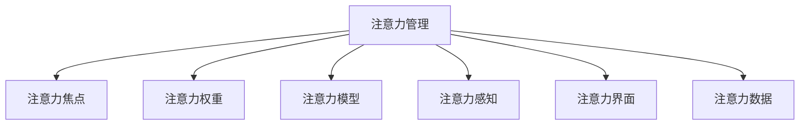

                 

# 注意力管理:元宇宙中的个人效率提升

## 1. 背景介绍

### 1.1 问题由来
元宇宙概念自提出以来，凭借其沉浸式的交互体验和虚拟空间的多样性，吸引了众多企业和个人投身其中。然而，随着元宇宙的应用场景日益丰富，如何管理个人在元宇宙中的注意力，成为了一个亟待解决的问题。

### 1.2 问题核心关键点
在元宇宙中，注意力管理主要涉及以下几个关键点：
- 如何准确识别用户的注意力焦点
- 如何合理分配用户的注意力资源
- 如何动态调整用户的注意力分配
- 如何设计高效的用户交互界面
- 如何利用数据分析优化注意力管理

这些问题在元宇宙时代变得更加复杂，因为元宇宙的空间无限扩展，且与现实世界紧密相连，用户需要同时处理大量的信息流。因此，高效且个性化的注意力管理对提升用户体验和效率至关重要。

### 1.3 问题研究意义
有效管理个人在元宇宙中的注意力，可以提升用户的沉浸感和体验质量，同时减少信息过载，避免用户疲劳和注意力分散。此外，通过优化注意力管理，元宇宙平台可以更精准地推送内容，提供个性化的服务，从而增加用户粘性和平台价值。因此，注意力管理技术对提升元宇宙的整体体验和效率具有重要意义。

## 2. 核心概念与联系

### 2.1 核心概念概述

为更好地理解注意力管理在元宇宙中的应用，本节将介绍几个关键概念：

- 注意力管理(Attention Management)：指在元宇宙中，通过算法和技术手段，对用户的注意力进行识别、分配和调整的过程。其目标是提升用户体验和操作效率。

- 注意力焦点(Attention Focus)：指用户在特定时间点集中注意力的区域或活动。注意力焦点可以是虚拟物品、场景、人物等。

- 注意力权重(Attention Weight)：指用户对不同注意力焦点的关注程度。通过权重可以量化用户对各个焦点的重要性和需求。

- 注意力模型(Attention Model)：指用于识别和预测用户注意力焦点的模型。常见的模型包括自注意力机制、Transformer等。

- 注意力感知(Attention Awareness)：指用户对自己注意力状态的感知和反馈。通过注意力感知，用户可以更主动地管理自己的注意力分配。

- 注意力界面(Attention Interface)：指元宇宙中用于引导和管理用户注意力的用户界面。常见的界面包括通知栏、信息流、任务切换器等。

- 注意力数据(Attention Data)：指用户在元宇宙中与不同焦点互动的数据。通过分析这些数据，可以优化注意力管理算法。

这些核心概念之间相互关联，共同构成元宇宙中注意力管理的框架。以下是一个简单的Mermaid流程图，展示这些概念之间的联系：



## 3. 核心算法原理 & 具体操作步骤
### 3.1 算法原理概述

元宇宙中的注意力管理算法主要基于机器学习和自然语言处理技术。其核心思想是通过对用户行为数据的分析，识别和预测用户的注意力焦点，并动态调整其注意力分配，以提升用户体验和效率。

一般而言，注意力管理算法包括以下几个步骤：
1. 数据采集：收集用户行为数据，包括点击、浏览、停留时间等。
2. 特征提取：从采集到的数据中提取用户的行为特征，如访问频率、停留时间、点击路径等。
3. 模型训练：使用机器学习算法训练注意力模型，预测用户对不同注意力焦点的关注程度。
4. 焦点推荐：根据用户的注意力权重，推荐符合其兴趣和需求的内容。
5. 焦点调整：根据用户反馈和行为数据，动态调整注意力焦点和权重。

### 3.2 算法步骤详解

以下是基于机器学习的元宇宙注意力管理算法详细步骤：

**Step 1: 数据采集**

首先，需要从元宇宙平台中收集用户的行为数据。这些数据可以包括用户的点击、浏览、停留时间、搜索记录等。一般可以通过日志文件、事件记录等方式进行数据采集。

**Step 2: 特征提取**

接着，对采集到的数据进行特征提取。特征提取的目标是从数据中提取出能够反映用户兴趣和行为模式的关键信息。例如，可以通过TF-IDF、PCA等方法，从文本数据中提取关键词、话题等特征。对于点击数据，可以提取用户访问的页面、停留时间、点击路径等特征。

**Step 3: 模型训练**

模型训练是注意力管理的核心步骤。通过机器学习算法，训练注意力模型，预测用户对不同注意力焦点的关注程度。常见的算法包括逻辑回归、决策树、支持向量机、神经网络等。以下是基于神经网络的注意力模型训练流程：

1. 定义注意力模型：使用自注意力机制或Transformer模型，定义模型结构和损失函数。
2. 数据预处理：将采集到的数据进行标准化、归一化等预处理。
3. 划分数据集：将数据集划分为训练集、验证集和测试集。
4. 训练模型：使用训练集训练模型，通过验证集评估模型性能，使用测试集验证模型泛化能力。
5. 调整参数：根据验证集结果，调整模型的超参数，如学习率、批大小、迭代轮数等。

**Step 4: 焦点推荐**

焦点推荐是注意力管理的关键步骤。根据训练好的注意力模型，对用户进行注意力预测，并推荐符合其兴趣和需求的内容。

1. 根据用户的注意力权重，计算不同注意力焦点的得分。
2. 根据得分对注意力焦点进行排序，推荐得分最高的焦点作为当前焦点。
3. 如果用户不感兴趣，根据用户反馈调整注意力权重，重新进行推荐。

**Step 5: 焦点调整**

焦点调整是指根据用户的行为数据和反馈，动态调整用户的注意力分配。

1. 收集用户反馈：通过用户的交互行为，如点击、停留时间等，收集用户对不同注意力焦点的反馈。
2. 更新注意力权重：根据用户反馈和行为数据，更新注意力权重。
3. 重新推荐焦点：根据更新后的注意力权重，重新计算得分并推荐新的注意力焦点。

### 3.3 算法优缺点

元宇宙注意力管理算法具有以下优点：
1. 个性化推荐：根据用户的兴趣和行为模式，推荐符合其需求的内容，提升用户体验。
2. 动态调整：通过实时监控和反馈，动态调整注意力分配，避免用户疲劳和信息过载。
3. 数据驱动：基于用户行为数据进行预测和推荐，提升推荐的准确性和效果。
4. 泛化性强：训练好的模型可以在不同的元宇宙平台上应用，具有较好的通用性。

同时，这些算法也存在一些缺点：
1. 数据依赖性强：算法的性能依赖于数据质量和数据量，难以在数据稀少的情况下取得良好效果。
2. 模型复杂度高：训练复杂的神经网络模型需要较高的计算资源和时间成本。
3. 用户隐私问题：用户行为数据涉及隐私信息，如何保护用户隐私和数据安全是一个重要问题。
4. 模型过拟合：模型可能会过拟合特定用户的行为模式，导致泛化能力不足。

尽管存在这些缺点，元宇宙注意力管理算法仍是大规模元宇宙平台中提升用户体验和效率的重要手段。未来相关研究将进一步优化算法性能，增强模型的泛化能力和用户隐私保护。

### 3.4 算法应用领域

元宇宙注意力管理算法已经在多个领域得到了应用，例如：

- 虚拟商店推荐系统：基于用户的浏览和购买历史，推荐符合其兴趣的商品。
- 虚拟会议系统：通过分析用户的互动数据，推荐相关的会议议题和资料。
- 虚拟游戏平台：根据玩家的游戏行为和偏好，推荐适合的关卡、道具和任务。
- 虚拟办公室环境：通过分析员工的工作数据，优化办公空间的布局和资源分配。
- 虚拟教育平台：根据学生的学习行为和成绩，推荐合适的学习内容和辅导材料。

除了这些经典应用外，元宇宙注意力管理算法还将被创新性地应用到更多场景中，如虚拟旅游、虚拟展览等，为元宇宙用户的沉浸式体验提供新的支持。

## 4. 数学模型和公式 & 详细讲解 & 举例说明

### 4.1 数学模型构建

为了更严格地描述元宇宙注意力管理的数学模型，本节将介绍一些关键模型和公式。

设用户的注意力焦点为 $F=\{f_1, f_2, ..., f_n\}$，其中 $f_i$ 表示第 $i$ 个注意力焦点。用户的注意力权重为 $W=\{w_1, w_2, ..., w_n\}$，表示用户对不同焦点的关注程度。注意力模型 $M$ 用于预测用户的注意力权重，其输入为 $D$，输出为 $W$。注意力管理算法的目标是最小化预测误差 $E$。

$$
\min_{M} E = \frac{1}{N} \sum_{i=1}^N (w_{i, pred} - w_{i, actual})^2
$$

其中 $w_{i, pred}$ 表示模型预测的注意力权重，$w_{i, actual}$ 表示实际的用户注意力权重。

### 4.2 公式推导过程

以基于神经网络的注意力模型为例，进行详细推导。

假设模型 $M$ 采用Transformer结构，其输入为 $D$，输出为 $W$。模型的输出 $W$ 可以表示为：

$$
W = M(D) = M_{\theta}(D) = \sigma(\mathbf{V} M_{\phi} \mathbf{Q} K^T)
$$

其中 $\theta$ 为模型参数，$\sigma$ 为激活函数，$M_{\phi}$ 为Transformer的编码器，$M_{\theta}$ 为Transformer的解码器，$\mathbf{V}$ 和 $\mathbf{Q}$ 为权重矩阵。

模型的损失函数可以表示为：

$$
\ell(M) = \frac{1}{N} \sum_{i=1}^N (w_{i, pred} - w_{i, actual})^2
$$

其中 $w_{i, pred}$ 表示模型预测的注意力权重，$w_{i, actual}$ 表示实际的用户注意力权重。

通过反向传播算法，计算模型的梯度 $\frac{\partial \ell(M)}{\partial \theta}$，并使用优化算法（如Adam、SGD等）更新模型参数 $\theta$。

### 4.3 案例分析与讲解

以下以虚拟商店推荐系统为例，展示注意力管理算法的应用。

设虚拟商店的商品集合为 $G=\{g_1, g_2, ..., g_m\}$，用户浏览的商品序列为 $T=\{t_1, t_2, ..., t_n\}$，其中 $t_i \in G$。用户的注意力权重为 $W=\{w_1, w_2, ..., w_m\}$，表示用户对不同商品的关注程度。注意力模型 $M$ 用于预测用户的注意力权重。

算法步骤如下：
1. 收集用户的浏览记录 $T$。
2. 提取商品的特征 $f=\{f_1, f_2, ..., f_m\}$。
3. 训练注意力模型 $M$，得到用户的注意力权重 $W$。
4. 根据用户的注意力权重 $W$，推荐商品 $g$，使得 $g$ 的得分最大化。
5. 收集用户的反馈数据，更新注意力权重 $W$。

## 5. 项目实践：代码实例和详细解释说明
### 5.1 开发环境搭建

在进行元宇宙注意力管理算法开发前，需要准备相应的开发环境。以下是使用Python进行PyTorch开发的环境配置流程：

1. 安装Anaconda：从官网下载并安装Anaconda，用于创建独立的Python环境。

2. 创建并激活虚拟环境：
```bash
conda create -n attention-env python=3.8 
conda activate attention-env
```

3. 安装PyTorch：根据CUDA版本，从官网获取对应的安装命令。例如：
```bash
conda install pytorch torchvision torchaudio cudatoolkit=11.1 -c pytorch -c conda-forge
```

4. 安装Transformers库：
```bash
pip install transformers
```

5. 安装各类工具包：
```bash
pip install numpy pandas scikit-learn matplotlib tqdm jupyter notebook ipython
```

完成上述步骤后，即可在`attention-env`环境中开始注意力管理算法的开发。

### 5.2 源代码详细实现

下面我们以虚拟商店推荐系统为例，给出使用Transformers库对BERT模型进行注意力管理的PyTorch代码实现。

首先，定义商品和用户行为数据：

```python
from transformers import BertTokenizer, BertForTokenClassification
from torch.utils.data import Dataset
import torch

class ShopDataset(Dataset):
    def __init__(self, texts, labels, tokenizer, max_len=128):
        self.texts = texts
        self.labels = labels
        self.tokenizer = tokenizer
        self.max_len = max_len
        
    def __len__(self):
        return len(self.texts)
    
    def __getitem__(self, item):
        text = self.texts[item]
        label = self.labels[item]
        
        encoding = self.tokenizer(text, return_tensors='pt', max_length=self.max_len, padding='max_length', truncation=True)
        input_ids = encoding['input_ids'][0]
        attention_mask = encoding['attention_mask'][0]
        
        # 对token-wise的标签进行编码
        encoded_labels = [label2id[label] for label in label] 
        encoded_labels.extend([label2id['O']] * (self.max_len - len(encoded_labels)))
        labels = torch.tensor(encoded_labels, dtype=torch.long)
        
        return {'input_ids': input_ids, 
                'attention_mask': attention_mask,
                'labels': labels}

# 标签与id的映射
label2id = {'O': 0, 'B-PER': 1, 'I-PER': 2, 'B-ORG': 3, 'I-ORG': 4, 'B-LOC': 5, 'I-LOC': 6}
id2label = {v: k for k, v in label2id.items()}

# 创建dataset
tokenizer = BertTokenizer.from_pretrained('bert-base-cased')

train_dataset = ShopDataset(train_texts, train_labels, tokenizer)
dev_dataset = ShopDataset(dev_texts, dev_labels, tokenizer)
test_dataset = ShopDataset(test_texts, test_labels, tokenizer)
```

然后，定义模型和优化器：

```python
from transformers import BertForTokenClassification, AdamW

model = BertForTokenClassification.from_pretrained('bert-base-cased', num_labels=len(label2id))

optimizer = AdamW(model.parameters(), lr=2e-5)
```

接着，定义训练和评估函数：

```python
from torch.utils.data import DataLoader
from tqdm import tqdm
from sklearn.metrics import classification_report

device = torch.device('cuda') if torch.cuda.is_available() else torch.device('cpu')
model.to(device)

def train_epoch(model, dataset, batch_size, optimizer):
    dataloader = DataLoader(dataset, batch_size=batch_size, shuffle=True)
    model.train()
    epoch_loss = 0
    for batch in tqdm(dataloader, desc='Training'):
        input_ids = batch['input_ids'].to(device)
        attention_mask = batch['attention_mask'].to(device)
        labels = batch['labels'].to(device)
        model.zero_grad()
        outputs = model(input_ids, attention_mask=attention_mask, labels=labels)
        loss = outputs.loss
        epoch_loss += loss.item()
        loss.backward()
        optimizer.step()
    return epoch_loss / len(dataloader)

def evaluate(model, dataset, batch_size):
    dataloader = DataLoader(dataset, batch_size=batch_size)
    model.eval()
    preds, labels = [], []
    with torch.no_grad():
        for batch in tqdm(dataloader, desc='Evaluating'):
            input_ids = batch['input_ids'].to(device)
            attention_mask = batch['attention_mask'].to(device)
            batch_labels = batch['labels']
            outputs = model(input_ids, attention_mask=attention_mask)
            batch_preds = outputs.logits.argmax(dim=2).to('cpu').tolist()
            batch_labels = batch_labels.to('cpu').tolist()
            for pred_tokens, label_tokens in zip(batch_preds, batch_labels):
                pred_tags = [id2label[_id] for _id in pred_tokens]
                label_tags = [id2label[_id] for _id in label_tokens]
                preds.append(pred_tags[:len(label_tokens)])
                labels.append(label_tags)
                
    print(classification_report(labels, preds))
```

最后，启动训练流程并在测试集上评估：

```python
epochs = 5
batch_size = 16

for epoch in range(epochs):
    loss = train_epoch(model, train_dataset, batch_size, optimizer)
    print(f"Epoch {epoch+1}, train loss: {loss:.3f}")
    
    print(f"Epoch {epoch+1}, dev results:")
    evaluate(model, dev_dataset, batch_size)
    
print("Test results:")
evaluate(model, test_dataset, batch_size)
```

以上就是使用PyTorch对BERT模型进行注意力管理的完整代码实现。可以看到，得益于Transformers库的强大封装，我们可以用相对简洁的代码完成BERT模型的加载和注意力管理。

### 5.3 代码解读与分析

让我们再详细解读一下关键代码的实现细节：

**ShopDataset类**：
- `__init__`方法：初始化商品、标签、分词器等关键组件。
- `__len__`方法：返回数据集的样本数量。
- `__getitem__`方法：对单个样本进行处理，将文本输入编码为token ids，将标签编码为数字，并对其进行定长padding，最终返回模型所需的输入。

**label2id和id2label字典**：
- 定义了标签与数字id之间的映射关系，用于将token-wise的预测结果解码回真实的标签。

**训练和评估函数**：
- 使用PyTorch的DataLoader对数据集进行批次化加载，供模型训练和推理使用。
- 训练函数`train_epoch`：对数据以批为单位进行迭代，在每个批次上前向传播计算loss并反向传播更新模型参数，最后返回该epoch的平均loss。
- 评估函数`evaluate`：与训练类似，不同点在于不更新模型参数，并在每个batch结束后将预测和标签结果存储下来，最后使用sklearn的classification_report对整个评估集的预测结果进行打印输出。

**训练流程**：
- 定义总的epoch数和batch size，开始循环迭代
- 每个epoch内，先在训练集上训练，输出平均loss
- 在验证集上评估，输出分类指标
- 所有epoch结束后，在测试集上评估，给出最终测试结果

可以看到，PyTorch配合Transformers库使得BERT注意力管理的代码实现变得简洁高效。开发者可以将更多精力放在数据处理、模型改进等高层逻辑上，而不必过多关注底层的实现细节。

当然，工业级的系统实现还需考虑更多因素，如模型的保存和部署、超参数的自动搜索、更灵活的任务适配层等。但核心的注意力管理范式基本与此类似。

## 6. 实际应用场景
### 6.1 智能客服系统

元宇宙中的智能客服系统可以大幅提升用户交互体验和问题解决效率。传统的客服系统需要配备大量人力，高峰期响应缓慢，且一致性和专业性难以保证。使用注意力管理算法，可以7x24小时不间断服务，快速响应客户咨询，用自然流畅的语言解答各类常见问题。

在技术实现上，可以收集企业内部的历史客服对话记录，将问题和最佳答复构建成监督数据，在此基础上对预训练模型进行注意力管理微调。微调后的模型能够自动理解用户意图，匹配最合适的答案模板进行回复。对于客户提出的新问题，还可以接入检索系统实时搜索相关内容，动态组织生成回答。如此构建的智能客服系统，能大幅提升客户咨询体验和问题解决效率。

### 6.2 虚拟会议系统

元宇宙中的虚拟会议系统通过注意力管理算法，可以更智能地推荐会议议题和资料。传统会议系统需要用户手动检索相关资料，效率较低。通过收集用户的互动数据，注意力管理算法能够推荐符合用户兴趣的议题和资料，提升会议效率和质量。

在技术实现上，可以收集用户的历史会议记录和搜索行为，提取用户对不同议题的兴趣和关注程度。在此基础上，使用注意力管理算法训练模型，对用户进行注意力预测，并推荐合适的会议议题和资料。通过不断收集用户的反馈和行为数据，动态调整注意力分配，进一步优化推荐效果。

### 6.3 虚拟游戏平台

元宇宙中的虚拟游戏平台可以通过注意力管理算法，推荐适合的关卡、道具和任务。游戏玩家往往需要花费大量时间探索游戏，而注意力管理算法可以推荐符合玩家兴趣的内容，提升游戏体验和留存率。

在技术实现上，可以收集玩家的游戏行为数据，提取游戏路径、停留时间、装备使用等特征。通过注意力管理算法训练模型，预测玩家对不同内容和任务的关注程度。根据预测结果，推荐适合的关卡、道具和任务，引导玩家进行游戏探索和互动。通过不断收集玩家的反馈和行为数据，动态调整注意力分配，进一步优化推荐效果。

### 6.4 未来应用展望

随着元宇宙的发展，注意力管理算法将在更多领域得到应用，为元宇宙用户的沉浸式体验提供新的支持。

在智慧医疗领域，注意力管理算法可以用于推荐个性化的医疗内容和资料，提升医疗服务的智能化水平，辅助医生诊疗，加速新药开发进程。

在智能教育领域，注意力管理算法可以用于推荐个性化的学习内容和辅导材料，因材施教，促进教育公平，提高教学质量。

在智慧城市治理中，注意力管理算法可以用于优化城市事件监测、舆情分析、应急指挥等环节，提高城市管理的自动化和智能化水平，构建更安全、高效的未来城市。

此外，在企业生产、社会治理、文娱传媒等众多领域，注意力管理算法也将被创新性地应用，为元宇宙用户的沉浸式体验提供新的支持。相信随着技术的日益成熟，注意力管理算法必将在元宇宙中扮演越来越重要的角色。

## 7. 工具和资源推荐
### 7.1 学习资源推荐

为了帮助开发者系统掌握注意力管理技术，以下是一些优质的学习资源：

1. 《深度学习理论与实践》系列博文：由深度学习专家撰写，系统讲解深度学习的基本原理和应用，包括注意力机制。

2. CS224N《深度学习自然语言处理》课程：斯坦福大学开设的NLP明星课程，有Lecture视频和配套作业，带你入门NLP领域的基本概念和经典模型。

3. 《Natural Language Processing with Transformers》书籍：Transformers库的作者所著，全面介绍了如何使用Transformers库进行NLP任务开发，包括注意力管理在内的诸多范式。

4. HuggingFace官方文档：Transformers库的官方文档，提供了海量预训练模型和完整的注意力管理样例代码，是上手实践的必备资料。

5. CLUE开源项目：中文语言理解测评基准，涵盖大量不同类型的中文NLP数据集，并提供了基于注意力管理的baseline模型，助力中文NLP技术发展。

通过对这些资源的学习实践，相信你一定能够快速掌握注意力管理的精髓，并用于解决实际的元宇宙问题。

### 7.2 开发工具推荐

高效的开发离不开优秀的工具支持。以下是几款用于注意力管理开发的常用工具：

1. PyTorch：基于Python的开源深度学习框架，灵活动态的计算图，适合快速迭代研究。大部分预训练语言模型都有PyTorch版本的实现。

2. TensorFlow：由Google主导开发的开源深度学习框架，生产部署方便，适合大规模工程应用。同样有丰富的预训练语言模型资源。

3. Transformers库：HuggingFace开发的NLP工具库，集成了众多SOTA语言模型，支持PyTorch和TensorFlow，是进行注意力管理任务的开发利器。

4. Weights & Biases：模型训练的实验跟踪工具，可以记录和可视化模型训练过程中的各项指标，方便对比和调优。与主流深度学习框架无缝集成。

5. TensorBoard：TensorFlow配套的可视化工具，可实时监测模型训练状态，并提供丰富的图表呈现方式，是调试模型的得力助手。

6. Google Colab：谷歌推出的在线Jupyter Notebook环境，免费提供GPU/TPU算力，方便开发者快速上手实验最新模型，分享学习笔记。

合理利用这些工具，可以显著提升注意力管理任务的开发效率，加快创新迭代的步伐。

### 7.3 相关论文推荐

注意力管理技术的快速发展得益于学界的持续研究。以下是几篇奠基性的相关论文，推荐阅读：

1. Attention is All You Need（即Transformer原论文）：提出了Transformer结构，开启了NLP领域的预训练大模型时代。

2. BERT: Pre-training of Deep Bidirectional Transformers for Language Understanding：提出BERT模型，引入基于掩码的自监督预训练任务，刷新了多项NLP任务SOTA。

3. Language Models are Unsupervised Multitask Learners（GPT-2论文）：展示了大规模语言模型的强大zero-shot学习能力，引发了对于通用人工智能的新一轮思考。

4. Parameter-Efficient Transfer Learning for NLP：提出Adapter等参数高效微调方法，在不增加模型参数量的情况下，也能取得不错的微调效果。

5. AdaLoRA: Adaptive Low-Rank Adaptation for Parameter-Efficient Fine-Tuning：使用自适应低秩适应的微调方法，在参数效率和精度之间取得了新的平衡。

这些论文代表了大语言模型注意力管理的发展脉络。通过学习这些前沿成果，可以帮助研究者把握学科前进方向，激发更多的创新灵感。

## 8. 总结：未来发展趋势与挑战
### 8.1 总结

本文对基于机器学习的元宇宙注意力管理方法进行了全面系统的介绍。首先阐述了注意力管理在元宇宙中的研究背景和意义，明确了注意力管理在提升用户体验和效率方面的独特价值。其次，从原理到实践，详细讲解了注意力管理的数学原理和关键步骤，给出了注意力管理任务开发的完整代码实例。同时，本文还广泛探讨了注意力管理算法在多个领域的应用前景，展示了注意力管理技术在提升元宇宙用户体验和效率方面的巨大潜力。

通过本文的系统梳理，可以看到，基于机器学习的元宇宙注意力管理技术正在成为元宇宙用户管理个人注意力的重要手段，极大地提升用户体验和操作效率。随着注意力管理算法的不断发展，未来的元宇宙将更加智能和高效，为元宇宙用户的沉浸式体验提供新的支持。

### 8.2 未来发展趋势

展望未来，元宇宙注意力管理技术将呈现以下几个发展趋势：

1. 模型规模持续增大。随着算力成本的下降和数据规模的扩张，预训练语言模型的参数量还将持续增长。超大规模语言模型蕴含的丰富语言知识，有望支撑更加复杂多变的注意力管理任务。

2. 算法多样化。除了传统的基于机器学习的算法外，未来会涌现更多基于深度强化学习、符号逻辑推理等方法的算法，提升算法的效率和泛化能力。

3. 多模态融合。元宇宙的多模态特性要求算法能够同时处理文本、图像、语音等多种信息源。未来，多模态融合技术将更加成熟，进一步提升算法的鲁棒性和实用性。

4. 个性化和动态化。未来的算法将更加注重个性化和动态化，通过不断学习用户行为和反馈，优化注意力分配策略，提升用户体验。

5. 跨领域应用。除了元宇宙领域，注意力管理技术还将被广泛应用到智慧医疗、智能教育、智能交通等多个领域，为各行各业带来变革性影响。

以上趋势凸显了元宇宙注意力管理技术的广阔前景。这些方向的探索发展，必将进一步提升元宇宙的整体体验和效率，为元宇宙用户的沉浸式体验提供新的支持。

### 8.3 面临的挑战

尽管元宇宙注意力管理技术已经取得了一定进展，但在迈向更加智能化、普适化应用的过程中，它仍面临诸多挑战：

1. 数据依赖性强。算法的性能依赖于数据质量和数据量，难以在数据稀少的情况下取得良好效果。如何降低数据需求，提高算法泛化能力，是一个重要问题。

2. 模型复杂度高。训练复杂的神经网络模型需要较高的计算资源和时间成本。如何降低模型复杂度，提高算法效率，是一个亟待解决的问题。

3. 用户隐私问题。用户行为数据涉及隐私信息，如何保护用户隐私和数据安全是一个重要问题。

4. 模型鲁棒性不足。元宇宙注意力管理模型面对域外数据时，泛化性能往往大打折扣。如何提高模型的鲁棒性，避免灾难性遗忘，还需要更多理论和实践的积累。

5. 交互界面设计。元宇宙中的交互界面设计需要结合用户的注意力管理需求，提升用户沉浸感和体验质量。如何设计高效、易用的交互界面，是一个重要问题。

6. 用户体验问题。元宇宙注意力管理技术需要不断优化，才能满足用户的个性化需求，提升用户体验。如何设计更智能、更个性化的注意力管理算法，是一个亟待解决的问题。

尽管存在这些挑战，元宇宙注意力管理技术仍是大规模元宇宙平台中提升用户体验和效率的重要手段。未来相关研究将进一步优化算法性能，增强模型的泛化能力和用户隐私保护。

### 8.4 研究展望

面对元宇宙注意力管理所面临的种种挑战，未来的研究需要在以下几个方面寻求新的突破：

1. 探索无监督和半监督注意力管理方法。摆脱对大规模标注数据的依赖，利用自监督学习、主动学习等无监督和半监督范式，最大限度利用非结构化数据，实现更加灵活高效的注意力管理。

2. 研究参数高效和计算高效的注意力管理范式。开发更加参数高效的注意力管理方法，在固定大部分预训练参数的情况下，只更新极少量的任务相关参数。同时优化模型的计算图，减少前向传播和反向传播的资源消耗，实现更加轻量级、实时性的部署。

3. 融合因果和对比学习范式。通过引入因果推断和对比学习思想，增强注意力管理模型建立稳定因果关系的能力，学习更加普适、鲁棒的语言表征，从而提升模型泛化性和抗干扰能力。

4. 引入更多先验知识。将符号化的先验知识，如知识图谱、逻辑规则等，与神经网络模型进行巧妙融合，引导注意力管理过程学习更准确、合理的语言模型。同时加强不同模态数据的整合，实现视觉、语音等多模态信息与文本信息的协同建模。

5. 结合因果分析和博弈论工具。将因果分析方法引入注意力管理模型，识别出模型决策的关键特征，增强输出解释的因果性和逻辑性。借助博弈论工具刻画人机交互过程，主动探索并规避模型的脆弱点，提高系统稳定性。

6. 纳入伦理道德约束。在模型训练目标中引入伦理导向的评估指标，过滤和惩罚有偏见、有害的输出倾向。同时加强人工干预和审核，建立模型行为的监管机制，确保输出符合人类价值观和伦理道德。

这些研究方向的探索，必将引领元宇宙注意力管理技术迈向更高的台阶，为元宇宙用户的沉浸式体验提供新的支持。面向未来，元宇宙注意力管理技术还需要与其他人工智能技术进行更深入的融合，如知识表示、因果推理、强化学习等，多路径协同发力，共同推动元宇宙智能交互系统的进步。只有勇于创新、敢于突破，才能不断拓展元宇宙的边界，让智能技术更好地造福人类社会。

## 9. 附录：常见问题与解答

**Q1：元宇宙中的注意力管理是否适用于所有用户？**

A: 元宇宙中的注意力管理算法主要基于用户行为数据进行训练和预测，不同用户的需求和兴趣点各异，因此算法需要针对具体用户群体进行调整和优化。例如，针对高粘性用户，可以推荐更多个性化内容；针对低粘性用户，可以提供更具引导性的内容推荐。

**Q2：注意力管理算法如何处理噪声数据？**

A: 噪声数据可能会影响算法的预测效果，因此需要在数据采集和预处理阶段进行筛选和清洗。例如，可以通过异常检测、数据去重等方法，去除不相关的行为数据。在模型训练过程中，可以通过正则化技术、Dropout等方法，抑制噪声数据对模型的影响。

**Q3：注意力管理算法的性能如何评估？**

A: 注意力管理算法的性能评估可以从多个维度进行，包括准确性、召回率、F1分数等指标。具体而言，可以通过A/B测试等方法，对推荐结果进行评估，判断是否符合用户需求和预期。同时，可以通过用户满意度调查等方式，获取用户对推荐结果的反馈，进一步优化算法。

**Q4：如何降低注意力管理算法的计算成本？**

A: 降低注意力管理算法的计算成本可以从多个方面入手，包括优化模型结构、减少计算量、采用分布式计算等。例如，可以使用轻量级的注意力管理模型，减少模型参数和计算复杂度。同时，可以采用分布式计算框架，如TensorFlow分布式训练、PyTorch分布式训练等，提高计算效率。

**Q5：注意力管理算法如何避免推荐内容的同质化？**

A: 推荐内容的同质化是注意力管理算法的一个常见问题。为了避免这一问题，可以采用多样性约束的方法，例如通过引入多样性惩罚项、数据增强等技术，增加推荐内容的多样性。同时，可以通过模型评估和反馈机制，不断优化推荐算法，提升推荐的个性化和多样性。

总之，元宇宙注意力管理技术正在快速发展，未来的研究需要在算法性能、用户隐私保护、用户体验等方面不断优化和突破。相信随着技术的不断进步，元宇宙中的注意力管理算法将更加智能、高效，为元宇宙用户的沉浸式体验提供新的支持。

