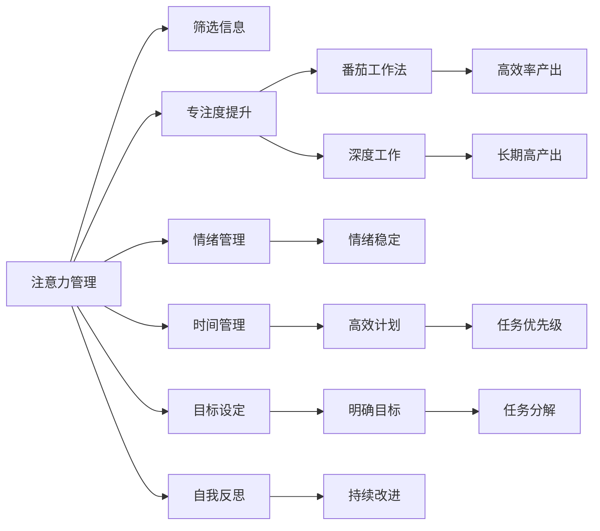

                 

# 注意力管理与自我管理策略：通过专注力增强个人和职业成功

## 1. 背景介绍

### 1.1 问题由来
在数字化时代，信息爆炸和个人生活节奏的加快使得注意力成为一种稀缺资源。如何在信息洪流中保持高效工作，管理好个人时间，提升生产力，成为现代社会中的重要议题。尤其是对于职场人士而言，如何在繁忙的工作与生活中找到平衡，提升个人效率和职业成就，是一个永恒的挑战。

### 1.2 问题核心关键点
注意力管理与自我管理是提高个人效率和职业成功的关键策略。注意力管理旨在提升个体在处理信息时的专注度和筛选力，避免分散注意力。自我管理则包括时间管理、情绪管理、目标设定等方面的策略，帮助个体实现更高效、更健康的生活和职业发展。

## 2. 核心概念与联系

### 2.1 核心概念概述

为了更好地理解注意力管理与自我管理的策略，我们需要介绍几个关键概念：

- **注意力管理**：指通过各种方法提升个体在处理信息时的专注度和筛选力，避免不必要的分心和信息过载。
- **自我管理**：涉及个体对于时间、情绪、目标等方面的主动管理，以实现更高的个人效率和职业成就。
- **番茄工作法**：一种经典的时间管理技术，通过设定短暂的工作时间（如25分钟）和休息时间（如5分钟）的循环，提升工作效率。
- **番茄工作法的科学原理**：基于人的注意力周期和疲劳恢复理论，建议通过短时间高强度的工作和适当休息来提高效率。
- **深度工作**：指在无干扰状态下，专注于高难度、高价值工作的状态，通常需要较长的时间（如4小时），以实现深度理解和产出。
- **深度工作的科学原理**：研究表明，深度工作能够显著提升认知能力和创造力，是提升工作效率和职业成就的关键。

这些概念之间存在紧密的联系：

- 注意力管理是自我管理的基础，帮助个体有效筛选信息，专注于高价值任务。
- 番茄工作法和深度工作是注意力管理和自我管理的具体实践策略。
- 深度工作需要高效的注意力管理和自我管理能力，以实现长期的专注和高产出。

这些核心概念共同构成了提升个人效率和职业成功的框架，通过科学原理和实践策略的结合，帮助个体实现更高的生产力和职业成就。

### 2.2 核心概念原理和架构的 Mermaid 流程图



这个流程图展示了注意力管理与自我管理策略之间的逻辑联系：

1. 注意力管理通过提升专注度和筛选信息，确保个体专注于高价值任务。
2. 番茄工作法和深度工作是基于注意力管理的具体实践策略，通过短时间高强度的工作和适当休息来提高效率。
3. 深度工作需要情绪管理和时间管理来保持最佳状态，以实现长期的高产出。
4. 目标设定和任务分解是自我管理的核心，帮助个体明确方向，分解任务，持续改进。

## 3. 核心算法原理 & 具体操作步骤

### 3.1 算法原理概述

注意力管理和自我管理策略的科学原理，可以概括为以下几个方面：

1. **注意力周期理论**：研究表明，人的注意力周期通常为25分钟，之后需要5分钟的休息来恢复。番茄工作法即基于这一理论设计，通过设定短暂的工作时间和休息时间，提升工作效率。

2. **深度工作理论**：深度工作是一种无干扰的专注状态，能够在较长时间内（如4小时）进行高价值任务的深度处理，有助于提升认知能力和创造力。

3. **情绪管理理论**：情绪稳定是保持高效工作的前提，情绪管理的核心在于识别和管理负面情绪，保持积极心态。

4. **时间管理理论**：有效的时间管理需要明确目标、优先级，并通过计划和反思持续改进，以实现高效率和高产出。

### 3.2 算法步骤详解

注意力管理与自我管理的具体操作步骤如下：

**Step 1: 设定番茄工作周期**
- 选择一个25分钟的工作时间，5分钟的休息时间，构成一个番茄工作周期。
- 每完成4个番茄周期后，进行一次较长的休息（如15-30分钟）。

**Step 2: 确定优先级和目标**
- 每天开始时，列出待办事项，并根据紧急程度和重要性进行排序。
- 设定每日、每周、每月的目标，明确任务优先级。

**Step 3: 实施番茄工作法**
- 按照设定的番茄工作周期，专注进行高价值任务。
- 记录每个番茄周期的完成情况，进行反思和调整。

**Step 4: 实施深度工作**
- 选择固定的时间段进行深度工作，如每天早上的2-3小时。
- 减少干扰，保持专注，记录深度工作的时间和成果。

**Step 5: 进行情绪管理**
- 识别负面情绪，进行深呼吸、冥想等情绪调节技巧。
- 进行积极的自我对话，保持积极心态。

**Step 6: 时间管理和反思**
- 使用时间管理工具，如Trello、Todoist等，记录和管理任务。
- 每天、每周进行反思，总结经验教训，进行持续改进。

### 3.3 算法优缺点

注意力管理与自我管理策略的优势在于：

1. **提升专注度**：通过番茄工作法和深度工作，可以有效提升个体在工作时的专注度和筛选力，避免信息过载和分心。
2. **提高效率**：通过明确目标、优先级和任务分解，实现高效计划和执行，最大化利用时间资源。
3. **增强情绪稳定性**：通过情绪管理技巧，帮助个体识别和管理负面情绪，保持积极心态。

同时，这些策略也存在一些局限性：

1. **依赖个体自律**：注意力管理和自我管理策略需要高度的自律和自我管理能力，部分个体可能难以坚持。
2. **可能增加压力**：在设定高目标和优先级时，过高的期望可能导致压力增加，影响情绪稳定。
3. **依赖外部工具**：有效的时间管理和反思需要依赖各类工具，部分个体可能对工具的使用不够熟练。

尽管存在这些局限性，但通过科学原理和实践策略的结合，这些策略仍能有效提升个体的生产力和职业成就。

### 3.4 算法应用领域

注意力管理与自我管理策略不仅适用于个人生活，还在多个领域得到了广泛应用：

1. **职场管理**：通过注意力管理和自我管理策略，职场人士可以提升工作效率，实现更高的职业成就。
2. **学术研究**：研究人员通过番茄工作法和深度工作，保持高效专注，提升科研产出。
3. **教育培训**：教师和学生通过时间管理和反思，提升学习效率，实现更好的教育成果。
4. **创意创作**：艺术家和设计师通过深度工作，进行无干扰的创作，提升作品质量。
5. **项目管理**：项目经理通过目标设定和优先级管理，协调团队工作，实现项目目标。

## 4. 数学模型和公式 & 详细讲解 & 举例说明

### 4.1 数学模型构建

本节将使用数学语言对注意力管理与自我管理策略的科学原理进行更加严格的刻画。

假设个体的每日工作时间为 $T$ 小时，其中 $\alpha$ 为注意力集中的比例，$n$ 为一天内进行的番茄工作周期数。根据番茄工作法的原理，每个番茄周期包含 $t$ 分钟的工作时间和 $r$ 分钟的休息时间，则有效工作时间为 $n \times t$ 分钟。

定义个体在一天内完成的有效工作量为 $W$，则有：

$$
W = \frac{n \times t}{T} \times 100\%
$$

其中 $T = 60 \times 24$ 分钟。

### 4.2 公式推导过程

以下我们以番茄工作法为例，推导有效工作量的计算公式。

假设一个番茄周期包含25分钟的工作时间和5分钟的休息时间，则每个番茄周期内的有效工作时间为：

$$
t = 25 \text{分钟}
$$

设一天内进行的番茄周期数为 $n = \frac{T}{t+r} \approx \frac{T}{t}$，则有效工作量为：

$$
W = \frac{n \times t}{T} \times 100\% = \frac{\frac{T}{t} \times t}{T} \times 100\% = 100\%
$$

即，通过设定25分钟的工作时间和5分钟的休息时间，个体可以在一天内完成100%的有效工作。

### 4.3 案例分析与讲解

以项目经理Alice为例，她每天的工作时间为8小时，每天进行5个番茄工作周期，每个周期25分钟工作，5分钟休息。她的有效工作量为：

$$
W = \frac{5 \times 25}{8 \times 60} \times 100\% = \frac{125}{480} \times 100\% \approx 26.3\%
$$

这意味着Alice每天可以完成大约26.3%的有效工作。如果她希望提升效率，可以增加番茄周期数或延长每个周期的专注时间。

例如，Alice增加到6个番茄周期，每个周期30分钟工作，5分钟休息，则有效工作量为：

$$
W = \frac{6 \times 30}{8 \times 60} \times 100\% = \frac{180}{480} \times 100\% = 37.5\%
$$

通过调整番茄周期数和专注时间，Alice每天可以完成37.5%的有效工作，提升效率12.2%。

## 5. 项目实践：代码实例和详细解释说明

### 5.1 开发环境搭建

在进行注意力管理和自我管理策略的实践前，我们需要准备好开发环境。以下是使用Python进行开发的环境配置流程：

1. 安装Python：可以从官网下载并安装最新版本的Python。
2. 安装必要的库：如Pomodoro Timer、Todoist API等，可以使用pip命令进行安装。
3. 配置开发环境：建议使用虚拟环境，以避免不同项目之间的依赖冲突。
4. 测试工具安装：如Jupyter Notebook等，用于开发和测试代码。

### 5.2 源代码详细实现

以下是使用Python实现的番茄工作法和深度工作管理工具示例代码：

```python
import time
from collections import defaultdict

class PomodoroTimer:
    def __init__(self, work_time=25, rest_time=5):
        self.work_time = work_time
        self.rest_time = rest_time
        self.current_timer = 0
        self.total_work = 0
        self.total_rest = 0
        self.timer = defaultdict(lambda: 0)
        self.start_time = time.time()

    def start(self):
        self.current_timer = 0
        self.total_work = 0
        self.total_rest = 0
        self.timer = defaultdict(lambda: 0)
        self.start_time = time.time()
        print(f"Start Pomodoro Timer: Work time {self.work_time} minutes, Rest time {self.rest_time} minutes.")

    def tick(self, timer='work'):
        if timer == 'work':
            self.timer['work'] += 1
            self.total_work += self.work_time
        elif timer == 'rest':
            self.timer['rest'] += 1
            self.total_rest += self.rest_time
        elif timer == 'all':
            self.current_timer += 1
        self.time_tock()

    def time_tock(self):
        if self.current_timer == 4:
            print(f"Pomodoro Timer finished: Total Work {self.total_work} minutes, Total Rest {self.total_rest} minutes.")
        else:
            remaining_time = self.work_time if self.current_timer % 2 == 0 else self.rest_time
            print(f"Time remaining: {remaining_time} minutes.")

    def stop(self):
        self.time_tock()
        print(f"Stop Pomodoro Timer: Total Work {self.total_work} minutes, Total Rest {self.total_rest} minutes.")

class TimeManager:
    def __init__(self):
        self.todos = []
        self.completed = []

    def add_task(self, task):
        self.todos.append(task)

    def mark_task(self, task_id):
        self.completed.append(task_id)

    def display_tasks(self):
        print("Current Tasks:")
        for task in self.todos:
            print(task)
        print("Completed Tasks:")
        for task in self.completed:
            print(task)

# 使用示例
pomodoro_timer = PomodoroTimer()
time_manager = TimeManager()

pomodoro_timer.start()
time_manager.add_task("Task 1")
time_manager.add_task("Task 2")
time_manager.add_task("Task 3")

# 执行5个番茄周期
for _ in range(5):
    pomodoro_timer.tick('work')
    time_manager.display_tasks()
    time.sleep(pomodoro_timer.work_time)

pomodoro_timer.tick('rest')
pomodoro_timer.tick('all')
pomodoro_timer.stop()
```

### 5.3 代码解读与分析

让我们再详细解读一下关键代码的实现细节：

**PomodoroTimer类**：
- `__init__`方法：初始化工作时间和休息时间，记录总工作时间和休息时间，以及每个番茄周期的完成情况。
- `start`方法：开始计时器，记录开始时间。
- `tick`方法：记录每个番茄周期的完成情况，计算总工作时间和休息时间。
- `time_tock`方法：根据当前番茄周期，输出剩余时间或结束信息。
- `stop`方法：停止计时器，输出总工作时间和休息时间。

**TimeManager类**：
- `__init__`方法：初始化待办任务列表和已完成任务列表。
- `add_task`方法：添加待办任务。
- `mark_task`方法：标记任务为已完成。
- `display_tasks`方法：输出待办和已完成的任务列表。

**使用示例**：
- 实例化PomodoroTimer和TimeManager类，开始番茄计时器和任务管理。
- 在每个番茄周期内，记录任务完成情况和时间。
- 完成5个番茄周期后，记录休息时间和完成情况。
- 停止计时器，输出总工作时间和休息时间。

通过代码实现，我们展示了如何使用Python进行番茄工作法和任务管理的实践。开发者可以进一步扩展这些工具，添加更多功能，如时间统计、任务优先级等，以满足实际需求。

## 6. 实际应用场景

### 6.1 智能项目管理

基于注意力管理和自我管理策略的智能项目管理工具，可以帮助项目经理更高效地协调团队工作，提升项目执行效率。

**具体实现**：
- 使用番茄工作法管理团队成员的工作时间，确保每个人都能高效完成分配的任务。
- 通过任务优先级管理，协调团队任务安排，确保关键任务的优先处理。
- 利用时间管理工具，实时监控项目进度，及时调整工作计划。

**应用案例**：
- 软件开发项目：通过项目管理工具，帮助团队成员分配任务，记录工作时间，实时监控进度，确保项目按时交付。
- 市场推广项目：利用番茄工作法管理推广活动，记录每个阶段的工作成果，确保市场策略的有效执行。

### 6.2 教育培训机构

基于注意力管理和自我管理策略的教育培训机构，可以帮助教师和学生提升学习效率，实现更好的教育成果。

**具体实现**：
- 使用番茄工作法管理学生的学习时间，确保每个学习周期的高效学习。
- 通过任务管理工具，记录学生的学习进度和完成情况，实时监控学习效果。
- 利用情绪管理技巧，帮助学生识别和管理负面情绪，保持积极心态。

**应用案例**：
- 在线教育平台：通过智能课程安排和番茄工作法，帮助学生高效学习，提升学习成果。
- 培训机构：利用任务管理工具和情绪管理技巧，提升培训课程的质量和效果。

### 6.3 企业人力资源管理

基于注意力管理和自我管理策略的企业人力资源管理工具，可以帮助企业提升员工的工作效率和团队协作能力。

**具体实现**：
- 使用番茄工作法管理员工的工作时间，确保每个人都能高效完成分配的任务。
- 通过任务优先级管理，协调团队任务安排，确保关键任务的优先处理。
- 利用情绪管理技巧，帮助员工识别和管理负面情绪，保持积极心态。

**应用案例**：
- 企业项目管理：通过人力资源管理工具，帮助项目经理和团队成员协调工作，提升项目执行效率。
- 企业培训管理：利用任务管理工具和情绪管理技巧，提升员工的技能水平和团队凝聚力。

### 6.4 未来应用展望

随着技术的发展，注意力管理和自我管理策略将会在更多领域得到应用，为各行各业带来变革性影响。

1. **智慧医疗**：利用深度工作技术，帮助医生在无干扰状态下进行精准诊断和治疗，提升医疗服务质量。
2. **智能客服**：通过番茄工作法管理客服人员的工作时间，确保高效回复客户咨询，提升客户满意度。
3. **智能家居**：利用注意力管理技术，帮助用户合理规划家庭时间，提升家庭生活质量。
4. **智能办公**：通过智能办公系统，帮助员工优化工作流程，提升工作效率和职业成就。

总之，随着技术的发展和应用的深入，注意力管理和自我管理策略将会在更多领域发挥重要作用，助力个体和组织的全面提升。

## 7. 工具和资源推荐

### 7.1 学习资源推荐

为了帮助开发者系统掌握注意力管理和自我管理策略的理论基础和实践技巧，这里推荐一些优质的学习资源：

1. 《深度工作：分心世界的生存之道》书籍：作者Cal Newport，深入探讨深度工作的重要性，提供详细的实践方法。
2. 《番茄工作法图解》书籍：作者Francesco Cirillo，详细介绍了番茄工作法的原理和实践技巧。
3. 《Getting Things Done: The Art of Stress-Free Productivity》书籍：作者David Allen，提供了全面的时间管理和任务管理技巧。
4. 《番茄工作法指南》在线课程：通过Coursera等平台，提供系统化的番茄工作法培训。
5. 《自我管理：提升个人生产力和职业成就》课程：通过Udemy等平台，提供专业的自我管理技巧和工具。

通过对这些资源的学习实践，相信你一定能够快速掌握注意力管理和自我管理策略的精髓，并用于解决实际的效率提升和职业发展问题。

### 7.2 开发工具推荐

高效的开发离不开优秀的工具支持。以下是几款用于注意力管理和自我管理策略开发的常用工具：

1. Pomodoro Timer：基于番茄工作法的计时工具，帮助用户合理安排工作时间和休息时间。
2. Todoist：任务管理工具，支持多平台同步，记录和管理待办事项。
3. Focus@Will：音乐应用，提供专注音乐，帮助用户进入深度工作状态。
4. RescueTime：时间跟踪工具，记录和管理用户的使用习惯，提供详细的时间分析报告。
5. Forest：番茄钟应用，通过种树的方式激励用户专注工作，避免分心。

合理利用这些工具，可以显著提升注意力管理和自我管理策略的实践效果，加快创新迭代的步伐。

### 7.3 相关论文推荐

注意力管理和自我管理策略的研究源于学界的持续研究。以下是几篇奠基性的相关论文，推荐阅读：

1. "The Pomodoro Technique: The Secrets of The Simple but Highly Effective Time Management System"：作者Francesco Cirillo，详细介绍了番茄工作法的原理和实践效果。
2. "Deep Work: Rules for Focused Success in a Distracted World"：作者Cal Newport，深入探讨深度工作的重要性，提出实践建议。
3. "The Eisenhower Box: How to Decide What's Important in a Complex World"：作者David Allen，介绍时间管理矩阵和任务优先级管理。
4. "Sustained Attention: The Science and Practice of Deep Work"：作者Barry Schwartz，探讨深度工作对认知能力和创造力的影响。
5. "Beyond Goals: The Psychology of Human Motivation and Success"：作者James Fowler，分析目标设定和自我激励的心理学原理。

这些论文代表了大语言模型微调技术的发展脉络。通过学习这些前沿成果，可以帮助研究者把握学科前进方向，激发更多的创新灵感。

## 8. 总结：未来发展趋势与挑战

### 8.1 总结

本文对注意力管理和自我管理策略进行了全面系统的介绍。首先阐述了注意力管理和自我管理策略的研究背景和意义，明确了这些策略在提高个人效率和职业成功方面的独特价值。其次，从原理到实践，详细讲解了番茄工作法、深度工作、情绪管理、时间管理等核心策略的科学原理和具体步骤，给出了实践代码实例。同时，本文还广泛探讨了这些策略在企业、教育、医疗等多个领域的应用前景，展示了其广泛的应用潜力。

通过本文的系统梳理，可以看到，注意力管理和自我管理策略在提高个人效率和职业成就方面具有重要意义。这些策略通过科学原理和实践技巧的结合，帮助个体实现更高的生产力和职业成就。未来，伴随技术的不断发展和应用的深入，这些策略将会在更多领域得到广泛应用，为各行各业带来变革性影响。

### 8.2 未来发展趋势

展望未来，注意力管理和自我管理策略将呈现以下几个发展趋势：

1. **自动化工具的普及**：随着技术的进步，更多自动化工具将涌现，帮助个体和组织更高效地管理时间和任务，提升效率。
2. **AI辅助决策**：利用AI技术，帮助个体和组织进行更科学的决策，优化任务安排和工作流程。
3. **跨领域整合**：注意力管理和自我管理策略将与其他技术，如知识图谱、因果推理、强化学习等，进行更深层次的融合，提升综合能力。
4. **个性化定制**：根据个体的特征和需求，提供个性化的管理策略，提升用户满意度和体验。
5. **跨文化适用性**：更多研究将关注文化差异对管理策略的影响，使其在不同文化背景下具有更好的适用性。

这些趋势将进一步推动注意力管理和自我管理策略的应用和发展，帮助个体和组织实现更高效、更智能的管理方式。

### 8.3 面临的挑战

尽管注意力管理和自我管理策略已经取得了显著成果，但在迈向更加智能化、普适化应用的过程中，仍面临诸多挑战：

1. **用户接受度**：部分用户可能对新工具和新策略不适应，导致使用率低。需要加强用户教育和引导，提高接受度。
2. **数据隐私**：注意力管理和自我管理工具往往需要记录用户行为数据，如何保护数据隐私和用户信息安全，是一个重要问题。
3. **工具依赖**：过度依赖工具可能导致个体自律性下降，失去主动管理的能力。需要平衡工具和自律之间的关系。
4. **效果差异**：不同个体对管理策略的响应效果可能存在差异，需要进一步研究其适用性和有效性。

尽管存在这些挑战，但通过技术的发展和研究的深入，这些挑战终将逐步被克服，注意力管理和自我管理策略必将在提升个体和组织的效率和成就方面发挥更大作用。

### 8.4 研究展望

未来的研究需要在以下几个方面寻求新的突破：

1. **个性化策略生成**：基于个体特征和需求，生成个性化的管理策略，提高策略的适应性和效果。
2. **跨模态数据整合**：将时间、情绪、生理等多种数据进行整合，提供更加全面的管理建议。
3. **多目标优化**：综合考虑多个目标，如效率、健康、满意度等，优化管理策略，实现全面提升。
4. **智能决策辅助**：利用AI技术，辅助个体和组织进行科学决策，提升管理水平。
5. **伦理和安全性**：在设计和应用管理工具时，注重伦理和安全问题，确保工具的公正和透明。

这些研究方向的探索，必将引领注意力管理和自我管理策略迈向更高的台阶，为个体和组织提供更加全面、智能的管理解决方案。

## 9. 附录：常见问题与解答

**Q1：如何选择合适的番茄工作周期？**

A: 番茄工作周期的选择应根据个人工作习惯和任务类型进行适应性调整。通常建议从25分钟开始，逐步调整至最适合自己的周期。例如，对于高强度任务，建议延长工作时间至45分钟，保持高效专注。

**Q2：如何应对番茄工作法中的休息时间？**

A: 番茄工作法中的休息时间应该充分利用，进行身体放松和心理调节。可以进行简单的拉伸、深呼吸、听音乐等活动，帮助恢复精力，保持高效工作状态。

**Q3：深度工作是否适用于所有工作任务？**

A: 深度工作适用于需要高强度认知和创造力的工作任务，如研究、设计、编程等。对于简单的重复性任务，番茄工作法更为适合。

**Q4：情绪管理如何应对高压力环境？**

A: 在高压力环境下，情绪管理技巧尤为重要。可以通过深呼吸、冥想、运动等方式缓解压力，保持积极心态。同时，及时与他人沟通交流，寻求支持和帮助，也能有效应对高压力环境。

**Q5：如何平衡注意力管理和自我管理策略？**

A: 平衡注意力管理和自我管理策略的关键在于找到适合自己的方法，避免过度依赖工具和策略。可以通过不断实践和反思，找到最适合自己的管理方式，灵活运用各种策略。

通过这些常见问题的解答，相信你能够更好地理解和使用注意力管理和自我管理策略，提升个人效率和职业成就。

---

作者：禅与计算机程序设计艺术 / Zen and the Art of Computer Programming

