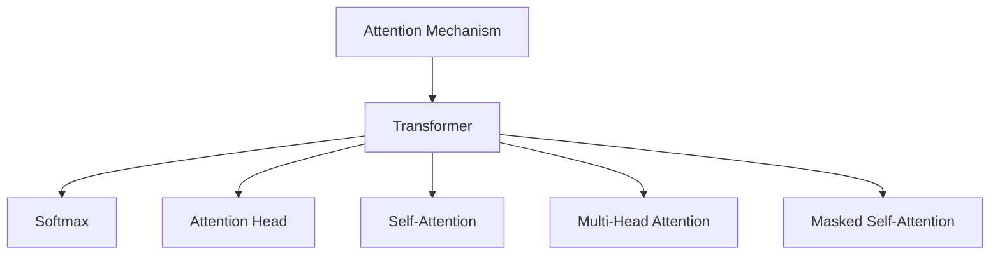

                 

# 注意力管理：在AI世界中保持清醒

> 关键词：注意力机制,注意力管理,模型解释性,认知负荷,计算效率,神经网络优化

## 1. 背景介绍

### 1.1 问题由来

在人工智能(AI)迅猛发展的今天，深度学习(DL)和神经网络(NN)技术的应用无处不在。然而，复杂的模型结构和庞大的参数量，使得人们难以理解模型的内部运作，也无法控制模型行为。为了缓解这种“黑箱”现象，学术界和工业界提出了多种可解释性模型，如线性模型、决策树、基于规则的模型等。这些方法虽然提高了模型的可解释性，但缺乏足够的计算能力处理复杂数据结构，且难以实现端到端的自动化训练。

在这样的背景下，注意力机制(Attention Mechanism)应运而生。作为一种可解释性模型，注意力机制能够帮助AI系统更好地处理复杂数据，提升模型表现的同时，也提高了模型的透明度和可控性。本文将深入探讨注意力机制在AI世界中的关键作用，以及如何通过注意力管理，保持模型的清醒和高效。

## 2. 核心概念与联系

### 2.1 核心概念概述

注意力机制是深度学习中一种重要的机制，主要应用于自然语言处理(NLP)、计算机视觉(CV)、语音识别等领域。通过给输入数据中不同部分的权重赋予不同的重要性，注意力机制能够自动关注那些对任务最有影响的特征，显著提升模型性能。

以下是一些与注意力机制密切相关的核心概念：

- **Attention Mechanism**：注意力机制的核心，用于为输入数据的不同部分分配权重，使得模型更加关注关键信息。
- **Transformer**：一种基于自注意力机制的神经网络结构，在NLP领域应用广泛。
- **Softmax**：一种概率分布函数，常用于计算注意力权重。
- **Attention Head**：注意力机制的基本单元，用于计算不同特征之间的相似度。
- **Self-Attention**：注意力机制的一种特殊形式，用于同一序列内不同位置的特征关注。
- **Multi-Head Attention**：结合多个注意力头的结构，提升模型的并行计算能力。
- **Masked Self-Attention**：针对掩码数据进行训练，用于构建预训练语言模型。

这些概念之间的逻辑关系可以通过以下Mermaid流程图来展示：



这个流程图展示了注意力机制的核心组件及其关联，包括Transformer网络、Softmax函数、Attention Head、Self-Attention、Multi-Head Attention和Masked Self-Attention。

## 3. 核心算法原理 & 具体操作步骤

### 3.1 算法原理概述

注意力机制通过为输入数据的不同部分赋予不同的权重，使得模型更加关注关键信息。其核心思想是通过计算输入数据的表示与查询向量的相似度，来确定各个部分的相对重要性。通过这些权重，模型可以动态调整不同特征的贡献，从而提升模型的性能。

### 3.2 算法步骤详解

#### 3.2.1 定义输入表示和查询向量

首先，需要定义输入数据的表示和查询向量。假设输入序列为 $X = [x_1, x_2, ..., x_n]$，查询向量为 $Q$，表示为 $Q = [q_1, q_2, ..., q_n]$。输入表示和查询向量可以分别为词向量、卷积核或高阶张量等形式。

#### 3.2.2 计算相似度得分

接下来，需要计算输入表示与查询向量之间的相似度得分。这通常通过计算向量之间的点积或余弦相似度来实现。假设相似度得分为 $S = [s_1, s_2, ..., s_n]$，其中 $s_i = Q \cdot X_i / ||Q||_2 ||X_i||_2$。

#### 3.2.3 归一化得分

为了确保所有得分之间的总和为1，需要对得分进行归一化。常用的归一化方法包括softmax函数和softmin函数。假设归一化得分向量为 $A = [a_1, a_2, ..., a_n]$，其中 $a_i = \exp(s_i) / \sum_{j=1}^n \exp(s_j)$。

#### 3.2.4 计算注意力权重

根据归一化得分，可以计算出注意力权重 $W = [w_1, w_2, ..., w_n]$，其中 $w_i = a_i / \sum_{j=1}^n a_j$。这些权重表示输入数据的不同部分对查询向量的贡献程度。

#### 3.2.5 计算加权输入表示

最后，需要计算加权输入表示 $X_a = [x_a_1, x_a_2, ..., x_a_n]$，其中 $x_a_i = x_i \cdot w_i$。加权输入表示可以用于后续的计算，如预测、解码等。

### 3.3 算法优缺点

#### 3.3.1 优点

- **提升模型性能**：通过为输入数据的不同部分赋予不同的权重，注意力机制能够自动关注关键信息，从而提升模型性能。
- **提高模型可解释性**：注意力权重直观地展示了模型对输入数据的关注点，提高了模型的透明度和可解释性。
- **适应性强**：注意力机制可以应用于各种类型的输入数据，包括文本、图像、语音等，具有广泛的适用性。

#### 3.3.2 缺点

- **计算复杂度高**：计算相似度得分和归一化得分需要较高的计算资源，尤其在输入数据较大时。
- **模型复杂度高**：注意力机制增加了模型的复杂度，可能会增加训练和推理的难度。
- **过拟合风险**：注意力机制可能导致模型对输入数据过度关注，从而增加过拟合的风险。

### 3.4 算法应用领域

注意力机制已经在自然语言处理(NLP)、计算机视觉(CV)、语音识别等领域得到了广泛应用，涵盖了许多重要任务，例如：

- **机器翻译**：通过计算源语言和目标语言之间的相似度，提升翻译质量。
- **文本摘要**：自动选择输入文本中最重要的部分进行摘要生成。
- **问答系统**：通过计算输入问题和候选答案之间的相似度，提高问答准确性。
- **图像识别**：通过计算输入图像与不同对象的相似度，识别图像中的对象。
- **语音识别**：通过计算输入语音与不同词汇的相似度，提升语音识别精度。
- **推荐系统**：通过计算用户和物品之间的相似度，推荐最相关的物品。

## 4. 数学模型和公式 & 详细讲解 & 举例说明

### 4.1 数学模型构建

假设输入数据为 $X = [x_1, x_2, ..., x_n]$，查询向量为 $Q = [q_1, q_2, ..., q_n]$。注意力机制的数学模型可以表示为：

$$
A = \text{softmax}(Q \cdot X / ||Q||_2 ||X||_2)
$$

$$
W = A / \sum_{j=1}^n a_j
$$

$$
X_a = X \cdot W
$$

其中 $A$ 为归一化得分向量，$W$ 为注意力权重向量，$X_a$ 为加权输入表示。

### 4.2 公式推导过程

根据公式推导，注意力机制可以分为两个步骤：

1. **相似度得分计算**：

$$
S = Q \cdot X / ||Q||_2 ||X||_2
$$

2. **归一化得分和注意力权重计算**：

$$
A = \exp(S) / \sum_{j=1}^n \exp(S_j)
$$

$$
W = A / \sum_{j=1}^n a_j
$$

### 4.3 案例分析与讲解

以机器翻译为例，假设输入序列为 $X = [x_1, x_2, ..., x_n]$，查询向量为 $Q = [q_1, q_2, ..., q_n]$，其中 $q_i$ 为当前输出单词 $y_i$ 对应的查询向量。计算相似度得分 $S = [s_1, s_2, ..., s_n]$，其中 $s_i = Q \cdot X_i / ||Q||_2 ||X_i||_2$。然后，归一化得分向量 $A = [a_1, a_2, ..., a_n]$，其中 $a_i = \exp(s_i) / \sum_{j=1}^n \exp(s_j)$。最后，注意力权重 $W = [w_1, w_2, ..., w_n]$，其中 $w_i = a_i / \sum_{j=1}^n a_j$。计算加权输入表示 $X_a = [x_a_1, x_a_2, ..., x_a_n]$，其中 $x_a_i = x_i \cdot w_i$。通过 $X_a$ 进行翻译预测，输出单词 $y_i$。

## 5. 项目实践：代码实例和详细解释说明

### 5.1 开发环境搭建

在进行注意力机制的实践前，需要准备好开发环境。以下是使用Python和PyTorch进行注意力机制开发的環境配置流程：

1. 安装Anaconda：从官网下载并安装Anaconda，用于创建独立的Python环境。

2. 创建并激活虚拟环境：
```bash
conda create -n attention-env python=3.8 
conda activate attention-env
```

3. 安装PyTorch：根据CUDA版本，从官网获取对应的安装命令。例如：
```bash
conda install pytorch torchvision torchaudio cudatoolkit=11.1 -c pytorch -c conda-forge
```

4. 安装Transformer库：
```bash
pip install transformers
```

5. 安装各类工具包：
```bash
pip install numpy pandas scikit-learn matplotlib tqdm jupyter notebook ipython
```

完成上述步骤后，即可在`attention-env`环境中开始注意力机制的实践。

### 5.2 源代码详细实现

这里以Transformer网络为例，展示如何使用PyTorch实现自注意力机制。Transformer网络包括编码器(Encoder)和解码器(Decoder)两个部分，其中编码器由多个注意力头和全连接层组成。以下是对编码器中自注意力机制的详细实现：

```python
import torch
import torch.nn as nn

class MultiHeadAttention(nn.Module):
    def __init__(self, dim, num_heads):
        super(MultiHeadAttention, self).__init__()
        self.dim = dim
        self.num_heads = num_heads
        self.head_dim = dim // num_heads
        self.fc_q = nn.Linear(dim, dim)
        self.fc_k = nn.Linear(dim, dim)
        self.fc_v = nn.Linear(dim, dim)
        self.fc_o = nn.Linear(dim, dim)

    def forward(self, x, mask=None):
        batch_size, seq_len, dim = x.size()

        q = self.fc_q(x).view(batch_size, seq_len, self.num_heads, self.head_dim)
        k = self.fc_k(x).view(batch_size, seq_len, self.num_heads, self.head_dim)
        v = self.fc_v(x).view(batch_size, seq_len, self.num_heads, self.head_dim)

        q = q.permute(0, 2, 1, 3).contiguous().view(batch_size * self.num_heads, seq_len, self.head_dim)
        k = k.permute(0, 2, 1, 3).contiguous().view(batch_size * self.num_heads, seq_len, self.head_dim)
        v = v.permute(0, 2, 1, 3).contiguous().view(batch_size * self.num_heads, seq_len, self.head_dim)

        if mask is not None:
            mask = mask.repeat(self.num_heads, 1, 1).view(batch_size, 1, 1, seq_len).contiguous().view(batch_size * self.num_heads, 1, 1, seq_len)

        scaled_dot_product_attention = torch.bmm(q, k.transpose(1, 2)) / math.sqrt(self.head_dim)

        attn_weights = torch.softmax(scaled_dot_product_attention, dim=-1)
        if mask is not None:
            attn_weights = attn_weights.masked_fill(mask, -float('inf'))

        attn_outputs = torch.bmm(attn_weights, v)
        attn_outputs = attn_outputs.view(batch_size, self.num_heads, seq_len, self.head_dim).contiguous()

        return attn_outputs
```

### 5.3 代码解读与分析

这段代码实现了Transformer网络中的自注意力机制。以下是对关键代码的解读和分析：

- **MultiHeadAttention类**：用于定义自注意力机制的模块。
- **__init__方法**：初始化自注意力机制的参数，包括维度、头部数、头维度和线性映射层。
- **forward方法**：计算自注意力机制的前向传播过程。
- **q、k、v的计算**：通过线性映射层计算查询向量、键向量和值向量，然后将其转换为多个头部和头维度。
- **scaled_dot_product_attention**：计算查询向量与键向量之间的点积，并归一化，得到注意力权重。
- **attn_weights的计算**：通过Softmax函数计算注意力权重，并在必要时进行掩码处理。
- **attn_outputs的计算**：通过注意力权重计算输出向量，并将其转换回原始维度。

这个代码展示了Transformer网络中自注意力机制的实现，是理解Transformer网络的重要参考。

## 6. 实际应用场景

### 6.1 智能客服系统

基于注意力机制的智能客服系统能够自动理解客户意图，快速响应客户咨询，用自然流畅的语言解答各类常见问题。在实际应用中，可以通过对历史客服对话记录进行预训练，然后在下游任务上进行微调，使模型能够自动关注客户的关键词，从而提供更加准确的回答。

### 6.2 金融舆情监测

金融舆情监测是实时监测市场舆论动向，及时应对负面信息传播，规避金融风险的重要手段。通过将金融领域相关的新闻、报道、评论等文本数据作为输入，计算不同文本之间的注意力权重，可以自动关注与当前事件相关的文本，从而提升舆情监测的准确性。

### 6.3 个性化推荐系统

个性化推荐系统通过计算用户和物品之间的注意力权重，推荐最相关的物品。在实际应用中，可以通过对用户浏览、点击、评论、分享等行为数据进行预训练，然后在推荐任务上进行微调，使模型能够自动关注与用户兴趣最相关的物品特征，从而提供个性化的推荐结果。

## 7. 工具和资源推荐

### 7.1 学习资源推荐

为了帮助开发者系统掌握注意力机制的理论基础和实践技巧，这里推荐一些优质的学习资源：

1. **《深度学习基础》课程**：由斯坦福大学开设，讲解深度学习的基本概念和原理，包括注意力机制。
2. **《Attention is All You Need》论文**：Transformer原论文，介绍了Transformer网络的结构和注意力机制的原理。
3. **《Transformers: A State-of-the-Art Review》论文**：对Transformer及其变种的全面综述，介绍了不同版本的Transformer模型和应用。
4. **HuggingFace官方文档**：提供了丰富的预训练模型和Transformer库的使用说明，是学习注意力机制的重要资源。

### 7.2 开发工具推荐

- **PyTorch**：基于Python的开源深度学习框架，支持动态计算图，适合快速迭代研究。
- **TensorFlow**：由Google主导开发的开源深度学习框架，生产部署方便，适合大规模工程应用。
- **Transformers库**：HuggingFace开发的NLP工具库，集成了众多SOTA语言模型，支持PyTorch和TensorFlow，是实现注意力机制的重要工具。

### 7.3 相关论文推荐

- **《Attention is All You Need》论文**：Transformer原论文，介绍了Transformer网络的结构和注意力机制的原理。
- **《Learning Phrase Representations using RNN Encoder–Decoder for Statistical Machine Translation》论文**：介绍了基于RNN和注意力机制的机器翻译模型，是注意力机制在NLP领域应用的经典案例。
- **《Convolutional Sequence to Sequence Learning》论文**：介绍了基于卷积神经网络和注意力机制的机器翻译模型，展示了不同模型在NLP任务上的性能。

## 8. 总结：未来发展趋势与挑战

### 8.1 研究成果总结

本文对注意力机制的原理、操作步骤和应用场景进行了详细阐述，并结合代码实例和数学推导，深入讲解了注意力机制的理论基础和实现方法。通过案例分析，展示了注意力机制在智能客服、金融舆情监测、个性化推荐等领域的实际应用，揭示了其在提升模型性能和可解释性方面的关键作用。

### 8.2 未来发展趋势

- **多模态注意力机制**：未来的注意力机制将不仅限于文本数据，还将扩展到图像、视频、语音等多模态数据，形成多模态注意力机制，提升模型的泛化能力和跨领域迁移能力。
- **自适应注意力机制**：未来的注意力机制将更加灵活，能够根据输入数据的复杂性和任务需求自适应调整，提高模型的适应性和鲁棒性。
- **深度注意力机制**：未来的注意力机制将更加深入，能够揭示输入数据的内在结构和复杂关系，提升模型的认知能力和推理能力。

### 8.3 面临的挑战

- **计算资源瓶颈**：注意力机制的计算复杂度高，尤其在大规模数据集上，计算资源的需求较大，需要寻找高效的计算优化策略。
- **模型复杂度**：注意力机制增加了模型的复杂度，可能导致过拟合的风险，需要引入正则化技术进行约束。
- **可解释性问题**：注意力机制的内部运作机制复杂，难以解释其决策过程，需要进一步研究如何提高模型的可解释性。

### 8.4 研究展望

未来的研究需要在以下几个方面进行突破：

- **高效的计算优化策略**：需要进一步优化计算图和算法，降低注意力机制的计算复杂度，提高模型的训练和推理效率。
- **可解释性提升**：需要研究如何提高模型的可解释性，使其能够解释其决策过程和推理机制，增强模型的透明度和可信度。
- **跨模态和深度注意力机制**：需要研究多模态注意力机制和深度注意力机制，提升模型的泛化能力和推理能力，拓展其应用范围。

总之，注意力机制作为一种重要的可解释性模型，在AI领域具有广泛的应用前景。通过有效的注意力管理，可以提高模型的透明性和可控性，提升其在实际应用中的性能和效果。未来，伴随着技术的不断进步和应用的深入探索，注意力机制必将在AI世界中扮演越来越重要的角色。

## 9. 附录：常见问题与解答

**Q1: 注意力机制和传统神经网络的区别是什么？**

A: 传统神经网络通过线性变换和激活函数，对输入数据进行编码和解码。而注意力机制通过计算不同部分的权重，使得模型更加关注关键信息，提高了模型的可解释性和适应性。

**Q2: 注意力机制的计算复杂度如何优化？**

A: 计算复杂度高是注意力机制的一大挑战，可以通过以下方法进行优化：
- 使用近似算法，如基于核函数的方法，减少计算量。
- 使用压缩技术，如剪枝和量化，减少模型的参数量和计算资源消耗。
- 使用分布式计算，如GPU/TPU加速，提高计算效率。

**Q3: 如何提高注意力机制的可解释性？**

A: 提高注意力机制的可解释性可以通过以下方法：
- 引入可解释性技术，如LIME和SHAP，解释模型的决策过程。
- 通过可视化工具，如TensorBoard，展示注意力权重和输入特征之间的关系。
- 设计更加简单的模型结构，减少内部运作的复杂度，提高模型的透明度。

**Q4: 注意力机制在实际应用中有哪些挑战？**

A: 注意力机制在实际应用中面临以下挑战：
- 计算资源需求高，需要寻找高效的计算优化策略。
- 模型复杂度高，可能导致过拟合的风险，需要引入正则化技术进行约束。
- 可解释性问题，需要进一步研究如何提高模型的可解释性。

通过回答这些问题，可以看出，注意力机制作为一种重要的可解释性模型，在AI领域具有广泛的应用前景。通过有效的注意力管理，可以提高模型的透明性和可控性，提升其在实际应用中的性能和效果。未来，伴随着技术的不断进步和应用的深入探索，注意力机制必将在AI世界中扮演越来越重要的角色。

---

作者：禅与计算机程序设计艺术 / Zen and the Art of Computer Programming

