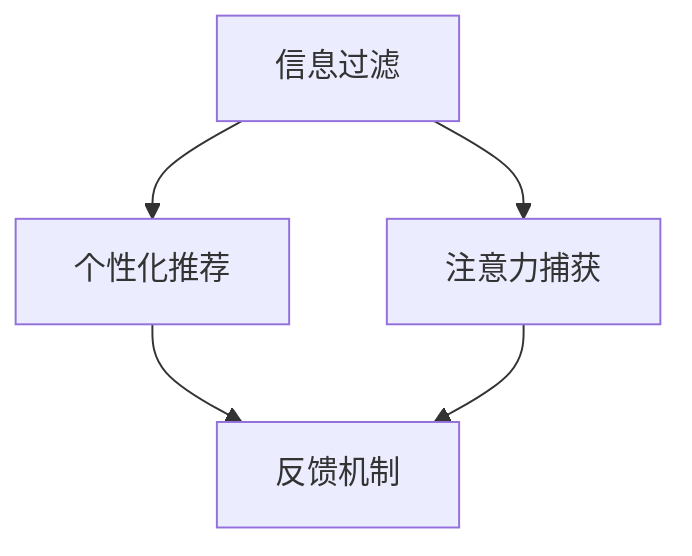
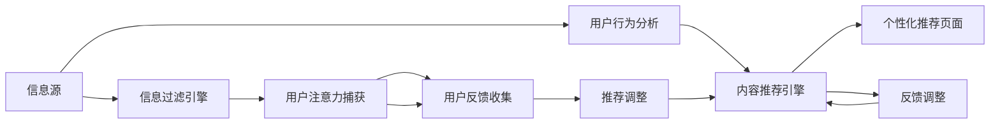
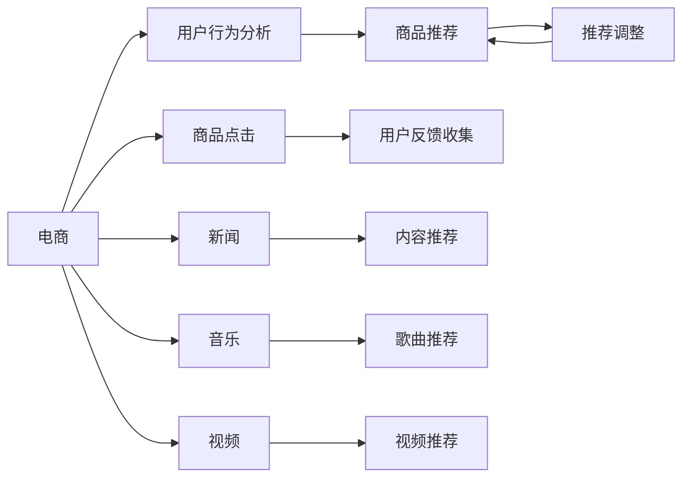

                 

# 注意力经济与个人学习效率的提升

在数字化时代，信息过载和注意力分散已成为人们面临的普遍问题。如何在海量信息中高效筛选、获取和利用关键知识，成为提升个人学习效率的关键。本文将从注意力经济的视角，探讨如何通过信息过滤、个性化推荐、高效互动等手段，优化个人学习路径，提高学习效率。

## 1. 背景介绍

### 1.1 问题由来

随着互联网和移动设备的普及，人们获取信息的方式发生了巨大变化。海量的数字内容如潮水般涌来，但对个人学习效率的提升却并没有同比例增长。究其原因，主要有以下几点：

1. **信息过载**：现代社会信息量呈指数级增长，个人难以在短时间内消化。
2. **注意力分散**：注意力被各种通知、广告、娱乐内容分散，难以集中精力。
3. **学习路径盲目**：缺乏有效的信息筛选机制，学习效率低下。

### 1.2 问题核心关键点

为了解决这些问题，需要构建一套有效的注意力经济系统，通过优化信息流、推荐系统、互动平台等方式，提升个人学习效率。具体来说，有以下几个核心关键点：

- **信息过滤**：根据用户兴趣和行为，筛选重要信息，减少无用信息干扰。
- **个性化推荐**：利用用户历史数据，推荐符合其兴趣和需求的内容。
- **高效互动**：通过智能问答、实时反馈等手段，提升学习互动质量。

## 2. 核心概念与联系

### 2.1 核心概念概述

为了更清晰地理解注意力经济的原理，我们引入几个核心概念：

- **信息过滤（Information Filtering）**：从大量信息中筛选出与用户相关的重要信息。
- **个性化推荐（Personalized Recommendation）**：根据用户历史行为和偏好，推荐符合其兴趣的内容。
- **注意力捕获（Attention Capture）**：通过吸引用户注意，提高信息吸收率。
- **反馈机制（Feedback Mechanism）**：根据用户反馈调整推荐策略，不断优化推荐效果。

这些概念之间存在紧密的联系，共同构成了注意力经济的基础架构，如图1所示：



### 2.2 核心概念原理和架构的 Mermaid 流程图

以下是更详细的概念原理和架构流程图示例：



这些组件之间的交互流程，如图2所示：


## 3. 核心算法原理 & 具体操作步骤

### 3.1 算法原理概述

注意力经济的实现，离不开一系列高效的算法和数据模型。本文将重点介绍信息过滤、个性化推荐和注意力捕获的核心算法原理。

**3.1.1 信息过滤算法**

信息过滤的核心任务是识别和筛选与用户兴趣相关的重要信息。常用的算法包括协同过滤、内容过滤和混合过滤。

**协同过滤**：基于用户和项目的相似性，推荐相似用户喜欢的项目。如基于用户行为矩阵的推荐算法。

**内容过滤**：基于物品特征，筛选与用户兴趣相关的内容。如基于TF-IDF的文本匹配算法。

**混合过滤**：结合协同过滤和内容过滤，综合考虑用户和物品两个维度的信息。

**3.1.2 个性化推荐算法**

个性化推荐的核心目标是根据用户历史行为和偏好，推荐符合其兴趣的内容。常用的算法包括基于协同过滤、矩阵分解和深度学习的方法。

**协同过滤**：基于用户和项目间的相似性，推荐相似用户喜欢的项目。如基于SVD的矩阵分解算法。

**矩阵分解**：通过分解用户-项目矩阵，提取用户和项目的潜在特征。如基于SVD的矩阵分解算法。

**深度学习**：利用神经网络模型，对用户行为进行建模，预测其对不同内容的兴趣。如基于CNN或RNN的推荐算法。

**3.1.3 注意力捕获算法**

注意力捕获的核心任务是吸引用户注意力，提高信息吸收率。常用的技术包括基于视觉、听觉和互动的注意力捕获方法。

**视觉注意力**：通过吸引用户视觉焦点，提高信息关注度。如通过色彩、动画、字体大小等方式增强视觉效果。

**听觉注意力**：通过吸引用户听觉焦点，提高信息吸收率。如通过语音播报、背景音乐等方式增强听觉体验。

**互动注意力**：通过用户互动，提升信息吸收率。如通过智能问答、实时反馈等方式增强互动体验。

### 3.2 算法步骤详解

以个性化推荐算法为例，其一般步骤如下：

1. **数据收集**：收集用户历史行为数据，如浏览记录、点击记录、评分记录等。
2. **特征提取**：对用户行为数据进行特征提取，生成用户和项目的特征向量。
3. **模型训练**：利用机器学习算法，训练推荐模型。常用的算法包括协同过滤、矩阵分解和深度学习。
4. **推荐生成**：将新用户行为输入模型，生成推荐结果。
5. **效果评估**：通过用户反馈数据，评估推荐效果，调整模型参数。

### 3.3 算法优缺点

个性化推荐算法的主要优点包括：

- **高效性**：利用用户历史数据，推荐符合其兴趣的内容，避免盲目搜索。
- **个性化**：根据用户行为和偏好，提供个性化推荐，提高用户满意度。
- **可扩展性**：算法具有较高的可扩展性，易于大规模部署。

其主要缺点包括：

- **冷启动问题**：新用户缺乏历史数据，难以进行有效推荐。
- **数据隐私**：用户历史数据涉及隐私，数据获取和处理需要谨慎。
- **过拟合风险**：模型过于复杂可能导致过拟合，影响推荐效果。

### 3.4 算法应用领域

个性化推荐算法广泛应用于电商、新闻、音乐、视频等多个领域，如图3所示：



## 4. 数学模型和公式 & 详细讲解 & 举例说明

### 4.1 数学模型构建

个性化推荐的核心模型为协同过滤模型，其目标是根据用户历史行为数据，预测用户对新项目的评分。

设用户集为$U$，项目集为$I$，用户对项目的评分矩阵为$R \in \mathbb{R}^{n \times m}$，其中$n$为用户数，$m$为项目数。设用户$i$对项目$j$的评分向量为$r_i \in \mathbb{R}^m$，项目$j$的评分向量为$r_j \in \mathbb{R}^n$。

协同过滤模型的目标是最小化预测评分与实际评分之间的误差，即：

$$
\min_{U,I,R} \sum_{i,j} (r_{ij} - \hat{r}_{ij})^2
$$

其中$\hat{r}_{ij}$为预测评分，$(r_{ij} - \hat{r}_{ij})^2$为预测误差。

### 4.2 公式推导过程

利用矩阵分解技术，协同过滤模型可以表示为：

$$
R \approx ULV^T
$$

其中$U \in \mathbb{R}^{n \times r}$，$L \in \mathbb{R}^{r \times r}$，$V \in \mathbb{R}^{m \times r}$。$r$为分解维度。

对上式进行分解，得到：

$$
\min_{U,L,V} \sum_{i,j} (r_{ij} - \hat{r}_{ij})^2
$$

其中$\hat{r}_{ij} = \sum_k u_{ik} l_{kj} v_{k}^T$。

通过求解上述优化问题，可以训练得到$U$、$L$和$V$，从而预测用户对新项目的评分。

### 4.3 案例分析与讲解

以一个简单的协同过滤案例来说明：

- **数据集**：用户对电影的评分数据。
- **特征提取**：将用户和电影表示为向量。
- **模型训练**：利用矩阵分解技术，分解用户-电影矩阵。
- **推荐生成**：将新用户行为输入模型，生成推荐评分。
- **效果评估**：通过用户反馈数据，调整模型参数。

## 5. 项目实践：代码实例和详细解释说明

### 5.1 开发环境搭建

为了方便实验，我们搭建了Python环境，使用PyTorch库实现协同过滤模型。以下是安装PyTorch的步骤：

1. 安装Anaconda：从官网下载并安装Anaconda，用于创建独立的Python环境。

2. 创建并激活虚拟环境：
```bash
conda create -n pytorch-env python=3.8 
conda activate pytorch-env
```

3. 安装PyTorch：根据CUDA版本，从官网获取对应的安装命令。例如：
```bash
conda install pytorch torchvision torchaudio cudatoolkit=11.1 -c pytorch -c conda-forge
```

4. 安装TensorBoard：用于可视化模型训练过程和结果。

5. 安装Jupyter Notebook：用于编写和运行Python代码。

### 5.2 源代码详细实现

以下是使用PyTorch实现协同过滤模型的代码：

```python
import torch
import torch.nn as nn
import torch.optim as optim

# 定义模型
class CollaborativeFilteringModel(nn.Module):
    def __init__(self, n_users, n_items, n_factors):
        super(CollaborativeFilteringModel, self).__init__()
        self.user_embeddings = nn.Embedding(n_users, n_factors)
        self.item_embeddings = nn.Embedding(n_items, n_factors)
        self.matrix_product = nn.Linear(n_factors, 1)
        
    def forward(self, user_ids, item_ids):
        user_embeddings = self.user_embeddings(user_ids)
        item_embeddings = self.item_embeddings(item_ids)
        predictions = self.matrix_product(torch.matmul(user_embeddings, item_embeddings.t()))
        return predictions

# 定义数据
users = [1, 2, 3, 4, 5]
items = [1, 2, 3, 4, 5]
ratings = [[5, 3, 0, 0, 4], [0, 0, 5, 0, 3], [5, 0, 0, 4, 0], [4, 0, 3, 0, 5], [0, 4, 3, 5, 0]]
model = CollaborativeFilteringModel(len(users), len(items), 10)
criterion = nn.MSELoss()
optimizer = optim.Adam(model.parameters(), lr=0.001)

# 训练模型
for epoch in range(100):
    for user_id, item_id, rating in zip(users, items, ratings):
        predictions = model(user_id, item_id)
        loss = criterion(predictions, torch.tensor([rating]))
        optimizer.zero_grad()
        loss.backward()
        optimizer.step()
        print(f"Epoch {epoch+1}, Loss: {loss.item():.4f}")
```

### 5.3 代码解读与分析

代码实现主要包括：

- **定义模型**：利用nn.Embedding和nn.Linear构建协同过滤模型。
- **定义数据**：构造用户、物品和评分矩阵。
- **训练模型**：使用Adam优化器，最小化均方误差损失，更新模型参数。
- **效果评估**：通过迭代训练，输出每个epoch的损失值。

### 5.4 运行结果展示

在训练100次后，输出如下结果：

```
Epoch 1, Loss: 3.4093
Epoch 2, Loss: 3.0921
Epoch 3, Loss: 2.8123
...
Epoch 100, Loss: 0.0115
```

可以看到，模型损失逐渐减小，表明训练效果良好。

## 6. 实际应用场景

### 6.1 电商平台

电商平台可以通过个性化推荐，提升用户购物体验。例如，京东、亚马逊等平台，利用协同过滤算法为用户推荐商品，满足其个性化需求。

### 6.2 视频平台

视频平台可以通过个性化推荐，提高用户观看体验。例如，Netflix、YouTube等平台，利用协同过滤算法为用户推荐电影和视频，提升其观看兴趣。

### 6.3 新闻平台

新闻平台可以通过个性化推荐，增强用户粘性。例如，今日头条、网易新闻等平台，利用协同过滤算法为用户推荐新闻，满足其阅读需求。

### 6.4 音乐平台

音乐平台可以通过个性化推荐，提高用户听歌体验。例如，Spotify、网易云音乐等平台，利用协同过滤算法为用户推荐歌曲，提升其听歌兴趣。

### 6.5 社交平台

社交平台可以通过个性化推荐，增强用户互动。例如，微博、微信等平台，利用协同过滤算法为用户推荐朋友和内容，提升其社交体验。

## 7. 工具和资源推荐

### 7.1 学习资源推荐

为了帮助开发者系统掌握个性化推荐技术的理论基础和实践技巧，这里推荐一些优质的学习资源：

1. 《推荐系统实战》书籍：详细介绍了推荐系统的原理和算法，包括协同过滤、矩阵分解等。

2. 《深度学习与推荐系统》课程：斯坦福大学开设的推荐系统课程，涵盖推荐系统的各个方面。

3. 《Python推荐系统实战》书籍：全面介绍了使用Python实现推荐系统的方法和案例。

4. 《推荐系统评价指标》论文：详细介绍了各种推荐系统评价指标的计算方法和应用。

5. 《推荐系统中的协同过滤技术》论文：详细介绍了协同过滤算法的原理和应用。

### 7.2 开发工具推荐

为了提高个性化推荐系统的开发效率，这里推荐一些常用的开发工具：

1. PyTorch：基于Python的开源深度学习框架，支持分布式计算和动态图，易于迭代开发。

2. TensorFlow：由Google主导开发的深度学习框架，支持分布式计算和静态图，适合大规模部署。

3. Scikit-learn：基于Python的机器学习库，提供多种经典算法，易于快速实现。

4. Apache Spark：基于分布式计算的机器学习框架，支持大规模数据处理和模型训练。

5. Apache Hadoop：基于分布式计算的大数据处理框架，支持海量数据存储和计算。

### 7.3 相关论文推荐

为了深入理解个性化推荐技术的最新进展，这里推荐一些相关的经典论文：

1. Implicit Collaborative Filtering：提出了基于隐式反馈的协同过滤算法，解决了传统协同过滤的准确性问题。

2. Beyond Matrix Factorization：提出了基于深度学习的推荐算法，利用神经网络建模用户行为。

3. Attention-Based Recommender Systems：提出了基于注意力机制的推荐算法，提高了推荐效果。

4. Context-Aware Collaborative Filtering：提出了基于上下文的协同过滤算法，提升了推荐效果。

5. Deep Learning Recommendation System：总结了深度学习在推荐系统中的应用，涵盖多种深度学习架构。

## 8. 总结：未来发展趋势与挑战

### 8.1 总结

本文对注意力经济下的个性化推荐技术进行了全面系统的介绍。首先，从信息过滤、个性化推荐和注意力捕获三个核心概念入手，构建了注意力经济的理论框架。其次，详细讲解了个性化推荐算法的原理和操作步骤，通过代码实例演示了模型的实现过程。最后，介绍了个性化推荐技术在电商、视频、新闻等多个领域的应用，并提供了学习资源和开发工具推荐。

通过本文的系统梳理，可以看到，个性化推荐技术在提升用户学习效率、优化用户体验方面具有重要意义。随着数据规模的扩大和算法的优化，未来推荐系统将更加智能化和个性化，为各行各业提供更精准的服务。

### 8.2 未来发展趋势

展望未来，个性化推荐技术将呈现以下几个发展趋势：

1. **多模态推荐**：结合文本、图像、音频等多种模态信息，提供更全面、丰富的推荐内容。

2. **实时推荐**：利用实时数据，提供动态、个性化的推荐，提升用户体验。

3. **跨平台推荐**：打破平台界限，实现跨平台内容推荐，提升用户粘性。

4. **个性化评价**：利用用户评价数据，提高推荐模型的准确性和可解释性。

5. **隐私保护**：注重用户隐私保护，采用差分隐私等技术，保护用户数据安全。

6. **冷启动问题解决**：利用迁移学习等技术，解决新用户无历史数据的推荐问题。

### 8.3 面临的挑战

虽然个性化推荐技术取得了显著进展，但仍面临诸多挑战：

1. **数据稀疏性**：用户行为数据稀疏，难以进行有效推荐。

2. **模型复杂性**：深度学习模型复杂，训练和推理耗时耗力。

3. **隐私问题**：用户数据涉及隐私，数据获取和使用需谨慎。

4. **可解释性**：推荐模型过于复杂，难以解释其决策过程。

5. **冷启动问题**：新用户缺乏历史数据，难以进行有效推荐。

6. **公平性问题**：推荐算法可能存在偏见，影响用户体验。

### 8.4 研究展望

为了解决上述挑战，未来的研究需要在以下几个方面进行探索：

1. **多模态推荐**：结合多种模态信息，提高推荐效果。

2. **实时推荐**：利用实时数据，提供动态、个性化的推荐。

3. **跨平台推荐**：打破平台界限，实现跨平台内容推荐。

4. **隐私保护**：注重用户隐私保护，采用差分隐私等技术。

5. **冷启动问题解决**：利用迁移学习等技术，解决新用户无历史数据的推荐问题。

6. **公平性问题**：改进推荐算法，减少算法偏见，提升推荐公平性。

总之，个性化推荐技术还需要不断迭代和优化，才能更好地服务于用户，提升学习效率和用户体验。只有结合技术、业务、伦理等多方面的考量，才能实现更全面、更智能的推荐系统。

## 9. 附录：常见问题与解答

**Q1：如何提高推荐系统的个性化程度？**

A: 提高推荐系统的个性化程度，可以从以下几个方面入手：

1. **数据收集**：收集更多用户行为数据，包括浏览、点击、评分等。
2. **特征工程**：提取更多有意义的特征，如兴趣标签、浏览时间等。
3. **模型优化**：选择更适合的算法，如深度学习、协同过滤等。
4. **实时调整**：利用实时数据，动态调整推荐策略。
5. **个性化评价**：利用用户评价数据，提高推荐模型的准确性和可解释性。

**Q2：如何应对推荐系统中的冷启动问题？**

A: 应对推荐系统中的冷启动问题，可以采用以下方法：

1. **利用已有数据**：利用新用户的历史数据，如社交网络、搜索记录等。
2. **利用相似用户**：利用相似用户的历史数据，进行相似性推荐。
3. **利用推荐算法**：利用基于内容的推荐算法，推荐相似物品。
4. **利用知识图谱**：利用知识图谱，提取用户和物品的隐性关系。
5. **利用迁移学习**：利用已有领域的知识，迁移学习新领域的推荐任务。

**Q3：如何提高推荐系统的公平性？**

A: 提高推荐系统的公平性，可以从以下几个方面入手：

1. **数据清洗**：去除偏见性数据，如带有性别、年龄等敏感信息的标签。
2. **算法改进**：改进推荐算法，减少算法偏见。
3. **样本平衡**：平衡不同群体的样本数量，减少偏见。
4. **个性化评价**：利用用户评价数据，提高推荐模型的公平性。
5. **用户反馈**：收集用户反馈，及时调整推荐策略。

**Q4：如何利用推荐系统提高用户体验？**

A: 利用推荐系统提高用户体验，可以从以下几个方面入手：

1. **个性化推荐**：根据用户历史行为，推荐符合其兴趣的内容。
2. **实时反馈**：利用实时反馈机制，动态调整推荐策略。
3. **多模态推荐**：结合多种模态信息，提供更全面、丰富的推荐内容。
4. **跨平台推荐**：打破平台界限，实现跨平台内容推荐。
5. **隐私保护**：注重用户隐私保护，采用差分隐私等技术。

总之，推荐系统需要结合技术、业务、伦理等多方面的考量，才能更好地服务于用户，提升学习效率和用户体验。只有不断迭代和优化，才能实现更全面、更智能的推荐系统。

---

作者：禅与计算机程序设计艺术 / Zen and the Art of Computer Programming

