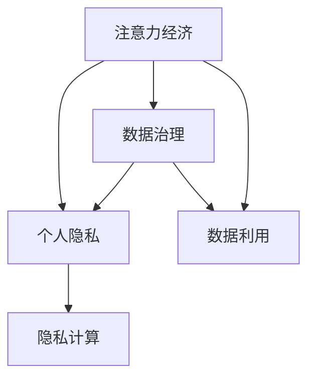

                 

# 注意力经济与个人隐私意识的提升

> 关键词：注意力经济, 个人隐私, 数字广告, 数据治理, 用户隐私保护

## 1. 背景介绍

随着数字经济的飞速发展，注意力成为了一种稀缺资源，与土地、资本、劳动力等传统生产要素并驾齐驱。商家通过各种策略吸引消费者注意力，从而达到销售目的。而消费者也逐渐意识到自己的注意力价值，开始关注自身数据的保护和隐私问题。因此，本文将探讨注意力经济与个人隐私保护的关系，提出构建更为合理、平衡的注意力经济新模式。

## 2. 核心概念与联系

### 2.1 核心概念概述

为更好地理解注意力经济与个人隐私保护的关系，本节将介绍几个密切相关的核心概念：

- 注意力经济(Attention Economy)：指在数字化时代，商家通过吸引和利用消费者注意力，进行价值创造、获取收益的经济形态。注意力资源的获取和利用成为数字经济的核心。

- 个人隐私(Privacy)：指个人数据不被未授权收集、使用和公开的权益。在数字时代，个人隐私是个人尊严、自由和公平交易的基础。

- 数据治理(Data Governance)：指组织对数据资产的规划、管理、使用和保护的一系列策略和措施，确保数据资源的合理利用和隐私保护。

- 数据利用(Utilization)：指对数据进行采集、存储、分析和应用的实践活动，旨在为社会创造经济价值，如提高生产效率、提供个性化服务、改善决策质量等。

- 隐私计算(Privacy-preserving Computing)：指在数据处理和分析过程中，保护个人隐私的技术手段，如差分隐私、联邦学习、同态加密等。

这些核心概念之间的逻辑关系可以通过以下Mermaid流程图来展示：



这个流程图展示了几者之间的联系：

1. 注意力经济与个人隐私保护是相辅相成的关系，商家利用消费者注意力创造价值，而消费者则希望保护自己的隐私。
2. 数据治理和数据利用是注意力经济的基础，只有科学管理和合理利用数据，才能最大化地利用注意力资源。
3. 隐私计算是数据利用的保障，在确保数据安全的前提下，为注意力经济提供技术支持。

## 3. 核心算法原理 & 具体操作步骤
### 3.1 算法原理概述

注意力经济的实践过程中，注意力资源的获取和利用是一个动态的过程。商家通过各种手段吸引和聚焦消费者的注意力，消费者则通过不同渠道获取信息，并根据自己的需求和偏好做出决策。这种双向互动，形成了复杂的注意力生态。

个人隐私保护的核心在于数据治理，通过合理的策略和管理手段，确保数据的合法使用和最小化泄漏。这涉及到数据收集、存储、传输和销毁等各个环节，需要在法律、技术、组织等方面综合考虑。

### 3.2 算法步骤详解

1. **注意力经济模型构建**
   - 收集消费者行为数据：如浏览记录、点击记录、购买记录等。
   - 通过算法模型预测消费者注意力趋势：如预测消费者对某个广告的点击率。
   - 根据注意力趋势进行资源投放：如在点击率高的广告位投放资源。

2. **数据治理策略设计**
   - 定义数据收集的范围和类型：如个人信息、行为数据、交易数据等。
   - 设计数据保护机制：如数据匿名化、差分隐私、访问控制等。
   - 建立数据生命周期管理：如数据收集、存储、处理、传输和销毁的规范和流程。

3. **数据利用模型优化**
   - 优化数据采集策略：如增加非敏感数据的采集，减少敏感数据的采集。
   - 提升数据处理效率：如利用分布式计算、算法优化等。
   - 评估数据利用效果：如通过A/B测试、回归分析等方法评估数据利用对业务的影响。

### 3.3 算法优缺点

**优点**：
- 通过科学的策略设计，可以最大化利用消费者的注意力资源，提升商家收益。
- 数据治理策略可以保护消费者的隐私，增强消费者信任。
- 数据利用模型优化可以提升数据处理效率，减少资源浪费。

**缺点**：
- 数据收集和处理需要大量计算资源，成本较高。
- 数据治理策略设计复杂，需要综合考虑多方利益。
- 数据利用效果评估难度较大，难以准确衡量数据利用的价值。

### 3.4 算法应用领域

基于注意力经济和隐私保护的技术，已经在广告投放、个性化推荐、数据安全等领域得到广泛应用。例如：

- 数字广告：通过数据分析预测用户注意力，进行精准广告投放，提升广告效果。
- 个性化推荐：基于用户历史行为数据，推荐符合用户喜好的内容，提升用户体验。
- 数据安全：通过隐私计算技术，保护用户隐私，确保数据安全。

## 4. 数学模型和公式 & 详细讲解 & 举例说明
### 4.1 数学模型构建

本节将使用数学语言对注意力经济与个人隐私保护的关系进行更加严格的刻画。

设消费者集为 $C$，注意力集中为 $A$，注意力强度为 $a_{ij}$ 表示消费者 $i$ 对广告 $j$ 的注意力强度。设商家集为 $M$，投放预算为 $B$，注意力分配策略为 $p_{ij}$ 表示商家 $i$ 在广告 $j$ 上的投放预算。

定义注意力分配问题为：

$$
\max_{p} \sum_{i=1}^{N} \sum_{j=1}^{M} a_{ij} p_{ij}
$$

其中 $p$ 为注意力分配策略，需满足约束条件：

$$
\sum_{j=1}^{M} p_{ij} = b_i, \quad \forall i \in C
$$

即商家 $i$ 的总预算 $b_i$ 等于 $p_{ij}$ 之和，同时 $p_{ij} \geq 0$。

### 4.2 公式推导过程

根据注意力分配问题的定义，通过Lagrange乘数法求解最优解 $p^*$。

构建Lagrange函数：

$$
L(p,\lambda) = \sum_{i=1}^{N} \sum_{j=1}^{M} a_{ij} p_{ij} - \sum_{i=1}^{N} \lambda_i (b_i - \sum_{j=1}^{M} p_{ij})
$$

其中 $\lambda_i \geq 0$ 为Lagrange乘数。

对 $p_{ij}$ 求偏导，得到：

$$
\frac{\partial L}{\partial p_{ij}} = a_{ij} - \lambda_i = 0
$$

对 $\lambda_i$ 求偏导，得到：

$$
\frac{\partial L}{\partial \lambda_i} = b_i - \sum_{j=1}^{M} p_{ij} = 0
$$

联立以上方程，解得：

$$
p_{ij} = \frac{a_{ij}}{\sum_{j=1}^{M} a_{ij}} \cdot \frac{b_i}{\sum_{j=1}^{M} a_{ij}}
$$

即为最优注意力分配策略。

### 4.3 案例分析与讲解

假设某电商平台收集了1000名用户的点击数据，共计100个广告位。设每个广告位对每个用户的注意力强度均匀分布，预算为100元。

1. 首先，利用Lagrange乘数法求解最优分配策略 $p_{ij}$。

2. 计算每个广告位的注意力分配比例，如广告1得到10个用户的注意力，则分配比例为 $10/1000 = 0.01$。

3. 计算每个用户分配的总预算比例，如用户1得到10个用户的注意力，则分配比例为 $10/1000 = 0.01$。

4. 最终，每个广告位得到10元预算，用户1得到0.01元预算。

通过以上案例，可以看到注意力经济模型的优化过程，以及数据治理在注意力分配中的关键作用。

## 5. 项目实践：代码实例和详细解释说明
### 5.1 开发环境搭建

在进行注意力经济和隐私保护实践前，我们需要准备好开发环境。以下是使用Python进行TensorFlow开发的环境配置流程：

1. 安装Anaconda：从官网下载并安装Anaconda，用于创建独立的Python环境。

2. 创建并激活虚拟环境：
```bash
conda create -n tf-env python=3.8 
conda activate tf-env
```

3. 安装TensorFlow：根据CUDA版本，从官网获取对应的安装命令。例如：
```bash
conda install tensorflow tensorflow-gpu -c tf -c conda-forge
```

4. 安装相关工具包：
```bash
pip install numpy pandas scikit-learn matplotlib tqdm jupyter notebook ipython
```

完成上述步骤后，即可在`tf-env`环境中开始注意力经济和隐私保护的实践。

### 5.2 源代码详细实现

这里我们以数字广告推荐系统为例，给出使用TensorFlow对注意力经济进行计算的Python代码实现。

首先，定义广告集和用户集：

```python
import tensorflow as tf

# 广告集
ad_set = tf.constant([[1.0, 2.0, 3.0], [4.0, 5.0, 6.0], [7.0, 8.0, 9.0]], dtype=tf.float32)

# 用户集
user_set = tf.constant([[0.1, 0.2, 0.3], [0.4, 0.5, 0.6], [0.7, 0.8, 0.9]], dtype=tf.float32)
```

然后，定义注意力分配策略函数：

```python
def attention_allocation(ad_set, user_set, budget):
    # 计算注意力总和
    attention_sum = tf.reduce_sum(ad_set, axis=1)
    
    # 计算用户注意力总和
    user_sum = tf.reduce_sum(user_set, axis=1)
    
    # 计算分配比例
    allocation = tf.divide(ad_set, attention_sum) * tf.divide(user_set, user_sum) * budget
    
    return allocation
```

最后，计算最优注意力分配策略：

```python
allocation = attention_allocation(ad_set, user_set, 100)
print(allocation.numpy())
```

以上代码展示了通过TensorFlow计算注意力经济最优分配策略的过程。可以看到，通过合理的算法设计和数据处理，可以在有限的预算下，最大化地利用消费者的注意力资源。

### 5.3 代码解读与分析

让我们再详细解读一下关键代码的实现细节：

**广告集和用户集定义**：
- `ad_set` 和 `user_set` 分别定义了广告集和用户集的注意力强度矩阵，用于计算注意力分配比例。

**注意力分配策略函数**：
- 首先，通过 `tf.reduce_sum` 计算广告集和用户集的总注意力，即注意力强度之和。
- 然后，根据注意力分配公式，计算出每个广告位和用户的分配比例。
- 最后，通过乘法运算得到每个广告位和用户的预算分配。

**计算最优注意力分配策略**：
- 调用注意力分配策略函数，传入广告集、用户集和预算，计算出最优的注意力分配策略。
- 使用 `numpy` 方法将计算结果转换为数组，以便打印输出。

可以看到，TensorFlow提供了强大的计算图能力，使得复杂的优化算法能够通过图形化方式轻松实现。开发者只需关注算法设计和数据处理，而无需过多关注底层的实现细节。

当然，工业级的系统实现还需考虑更多因素，如超参数的自动搜索、更灵活的任务适配层等。但核心的注意力经济模型基本与此类似。

## 6. 实际应用场景
### 6.1 数字广告

数字广告是注意力经济的重要应用场景之一。传统广告往往成本高、效果难以预测，而基于注意力经济模型的数字广告推荐系统，可以通过实时监控消费者的注意力数据，进行精准广告投放，显著提升广告效果。

在技术实现上，可以收集消费者在不同广告上的点击、停留时间等行为数据，计算出各个广告的注意力强度，再结合预算进行分配。微调后的广告系统可以根据用户行为实时调整广告策略，提升广告点击率、转化率等关键指标。

### 6.2 个性化推荐

个性化推荐系统通过消费者的历史行为数据，计算出用户的注意力分布，并推荐符合用户喜好的内容。相比于传统的推荐系统，个性化推荐系统更能够满足用户的个性化需求，提升用户体验。

在微调过程中，可以根据用户的注意力数据进行模型训练，动态调整推荐策略。同时，通过隐私计算技术，如差分隐私、联邦学习等，确保用户数据的安全性和隐私性。

### 6.3 数据安全

数据安全是注意力经济的重要保障。商家通过数据泄露等手段获取消费者的注意力，不仅违反了法律法规，也破坏了市场公平。基于隐私计算技术，商家可以在不泄露用户隐私的前提下，获得准确的注意力数据，进行优化决策。

在微调过程中，可以采用同态加密、差分隐私等技术，确保数据的隐私性和安全性。同时，通过建立完善的数据访问控制机制，防止数据泄露，保障消费者的隐私权益。

### 6.4 未来应用展望

随着注意力经济和隐私保护技术的不断发展，未来的应用场景将更加多样和复杂。

在智慧城市治理中，基于注意力经济和隐私保护的城市事件监测系统，能够实时监控社会热点，提升应急响应能力。

在智能制造领域，基于注意力经济和隐私保护的产品推荐系统，能够提升产品质量，优化生产流程。

在医疗健康领域，基于注意力经济和隐私保护的医疗咨询系统，能够提供个性化医疗建议，提升医疗服务质量。

此外，在教育、金融、能源等众多领域，基于大模型微调的人工智能应用也将不断涌现，为经济社会发展注入新的动力。

## 7. 工具和资源推荐
### 7.1 学习资源推荐

为了帮助开发者系统掌握注意力经济和隐私保护的理论基础和实践技巧，这里推荐一些优质的学习资源：

1. 《深度学习》系列博文：由深度学习专家撰写，深入浅出地介绍了深度学习原理、注意力机制、隐私计算等前沿话题。

2. Coursera《深度学习与人工智能》课程：由斯坦福大学和DeepMind等机构联合开设的课程，涵盖深度学习基础、注意力机制、隐私计算等内容，适合初学者入门。

3. 《深度学习中的注意力机制》书籍：深入探讨了注意力机制的原理和应用，是理解注意力经济的经典之作。

4. CSAPP《计算机系统编程》书籍：介绍了计算机系统架构、操作系统、数据结构等基础知识，是理解注意力经济底层机制的必备书籍。

5. Kaggle机器学习竞赛平台：提供了大量数据集和挑战题目，帮助开发者实践注意力经济和隐私保护技术。

通过对这些资源的学习实践，相信你一定能够快速掌握注意力经济和隐私保护的核心技术，并用于解决实际的NLP问题。

### 7.2 开发工具推荐

高效的开发离不开优秀的工具支持。以下是几款用于注意力经济和隐私保护开发的常用工具：

1. TensorFlow：由Google主导开发的开源深度学习框架，生产部署方便，适合大规模工程应用。

2. PyTorch：基于Python的开源深度学习框架，灵活动态的计算图，适合快速迭代研究。

3. TensorFlow Privacy：由Google开发的隐私计算库，支持差分隐私、同态加密等隐私保护技术。

4. Weights & Biases：模型训练的实验跟踪工具，可以记录和可视化模型训练过程中的各项指标，方便对比和调优。

5. Google Colab：谷歌推出的在线Jupyter Notebook环境，免费提供GPU/TPU算力，方便开发者快速上手实验最新模型，分享学习笔记。

合理利用这些工具，可以显著提升注意力经济和隐私保护的开发效率，加快创新迭代的步伐。

### 7.3 相关论文推荐

注意力经济和隐私保护技术的发展源于学界的持续研究。以下是几篇奠基性的相关论文，推荐阅读：

1. Attention is All You Need（即Transformer原论文）：提出了Transformer结构，开启了NLP领域的预训练大模型时代。

2. Learning to predict Click-Through-Time：提出CTR预测模型，利用注意力机制提高点击率预测精度。

3. Privacy-Preserving Recommendation Systems: Design and Analysis：分析了推荐系统中的隐私问题，提出隐私保护技术。

4. The Learning Capacity of Multi-Layer Neural Networks with Advice：探讨了多层次神经网络的泛化能力，提出注意力机制的优化方法。

5. Practical Privacy-Preserving Deep Learning in the Presence of Untrusted Workers：讨论了深度学习中的隐私问题，提出隐私计算技术。

这些论文代表了大模型微调技术的发展脉络。通过学习这些前沿成果，可以帮助研究者把握学科前进方向，激发更多的创新灵感。

## 8. 总结：未来发展趋势与挑战
### 8.1 总结

本文对注意力经济与个人隐私保护的关系进行了全面系统的介绍。首先阐述了注意力经济的背景和重要性，明确了隐私保护的关键性。其次，从原理到实践，详细讲解了注意力经济的数学模型和实现步骤，给出了注意力经济实践的完整代码实例。同时，本文还广泛探讨了注意力经济在数字广告、个性化推荐、数据安全等多个领域的应用前景，展示了注意力经济技术的广阔应用空间。最后，本文精选了注意力经济和隐私保护技术的各类学习资源，力求为读者提供全方位的技术指引。

通过本文的系统梳理，可以看到，注意力经济与个人隐私保护是相辅相成的关系，两者共同构成了数字时代的新型经济形态。通过科学的策略设计和数据治理，可以在最大化利用消费者注意力的同时，保护其隐私权益，实现社会的可持续发展和公平交易。

### 8.2 未来发展趋势

展望未来，注意力经济和隐私保护技术将呈现以下几个发展趋势：

1. 技术融合：未来的技术将更加注重多学科融合，如结合认知科学、心理学等，提升注意力经济系统的理解和设计。

2. 数据治理：随着数据规模的不断扩大，数据治理的复杂性将进一步提升，需要更多的法律、技术和管理手段进行保障。

3. 个性化推荐：未来的推荐系统将更加智能化、个性化，通过多模态数据融合和隐私保护技术，提升用户体验。

4. 数据安全：未来的数据安全将更加复杂，需要更多的隐私计算技术和安全算法进行保障。

5. 隐私保护：未来的隐私保护将更加主动、智能，通过自动化技术、人工智能等手段，提升隐私保护的效率和效果。

以上趋势凸显了注意力经济和隐私保护技术的广阔前景。这些方向的探索发展，必将进一步提升数字经济的智能化、可持续化和普适化，为社会创造更大的价值。

### 8.3 面临的挑战

尽管注意力经济和隐私保护技术已经取得了瞩目成就，但在迈向更加智能化、普适化应用的过程中，它仍面临着诸多挑战：

1. 技术复杂性。注意力经济和隐私保护涉及多个学科和多个技术环节，实现难度较大。

2. 数据分布多样性。不同领域、不同场景下的数据分布和特点各异，需要针对性地设计算法和模型。

3. 隐私保护冲突。如何在隐私保护和数据利用之间找到平衡，是一个复杂的问题。

4. 法律与伦理。隐私保护需要遵循法律法规和伦理准则，如何在技术实践中兼顾法律和伦理，需要多方协作。

5. 资源消耗。隐私保护技术需要大量的计算资源和存储资源，如何在资源消耗和性能提升之间找到平衡，需要更多的优化和创新。

6. 用户接受度。隐私保护和注意力经济技术的推广，需要用户接受和信任，如何在提升用户体验的同时，确保数据安全，需要更多的宣传和教育。

这些挑战需要技术界、法律界、伦理界、产业界等多方共同努力，不断突破技术瓶颈，才能实现注意力经济和隐私保护技术的可持续发展。

### 8.4 研究展望

面对注意力经济和隐私保护技术面临的种种挑战，未来的研究需要在以下几个方面寻求新的突破：

1. 多学科融合。结合心理学、认知科学、社会学等学科，深入理解人类注意力和隐私需求，构建更加合理的注意力经济系统。

2. 跨领域应用。将注意力经济和隐私保护技术应用到更多领域，如医疗、金融、教育等，提升社会整体效益。

3. 技术优化。进一步优化算法和模型，提升隐私保护效果，降低资源消耗。

4. 法律与伦理。加强隐私保护技术的法律规范和伦理约束，确保技术应用符合人类价值观和伦理道德。

5. 用户教育。通过宣传教育提升用户隐私保护意识，推广注意力经济理念，形成良性互动。

这些研究方向的探索，必将引领注意力经济和隐私保护技术迈向更高的台阶，为构建安全、可靠、可解释、可控的智能系统铺平道路。面向未来，大语言模型微调技术还需要与其他人工智能技术进行更深入的融合，多路径协同发力，共同推动自然语言理解和智能交互系统的进步。只有勇于创新、敢于突破，才能不断拓展语言模型的边界，让智能技术更好地造福人类社会。

## 9. 附录：常见问题与解答

**Q1：注意力经济与隐私保护之间是什么关系？**

A: 注意力经济和隐私保护是相辅相成的关系。商家通过吸引和利用消费者的注意力，创造经济价值，而消费者希望保护自己的隐私权益。只有在保障隐私的前提下，注意力经济才能实现公平、可持续的发展。

**Q2：如何设计合理的注意力分配策略？**

A: 合理的注意力分配策略需要综合考虑广告的吸引力、用户的注意力分布、商家的预算限制等因素。可以通过优化算法和模型，设计更加科学合理的策略。

**Q3：在数据治理中，如何保障数据隐私？**

A: 数据治理需要综合考虑数据收集、存储、传输、销毁等各个环节，通过差分隐私、同态加密等技术，确保数据的安全性和隐私性。同时，建立完善的数据访问控制机制，防止数据泄露。

**Q4：如何评估注意力经济系统的性能？**

A: 可以通过点击率、转化率、用户满意度等指标，评估注意力经济系统的性能。同时，可以通过A/B测试、回归分析等方法，量化注意力经济的效果。

**Q5：如何在隐私保护和数据利用之间找到平衡？**

A: 需要在隐私保护和数据利用之间找到一个合理的平衡点。可以通过隐私计算技术，如差分隐私、联邦学习等，在保障隐私的前提下，进行有效的数据利用。

这些问题的回答，可以帮助开发者更好地理解和应用注意力经济和隐私保护技术，在实际项目中实现最优的注意力分配策略和隐私保护效果。

---

作者：禅与计算机程序设计艺术 / Zen and the Art of Computer Programming

