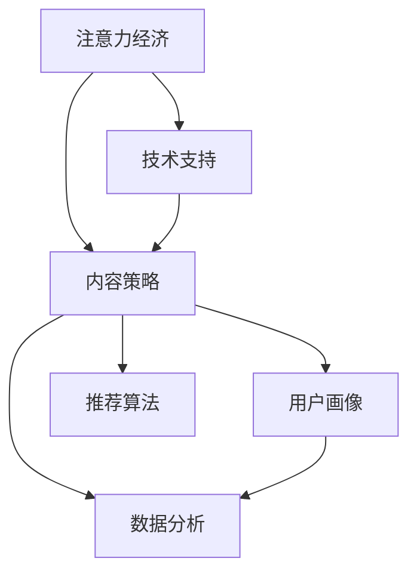

                 

# 注意力经济与内容策略规划与实践：为受众创建有影响力的内容

## 1. 背景介绍

在数字化时代，信息过载和注意力稀缺成为了现实问题。据统计，互联网用户每天接触到数百万条信息，其中真正能引起注意的少之又少。这一现象催生了“注意力经济”的概念，即通过有效分配和使用注意力资源，为受众创造有价值的内容，从而实现商业价值最大化。

### 1.1 注意力经济的重要性
在互联网时代，注意力成为一种稀缺资源，如何有效吸引和利用用户注意力，成为了企业和内容创作者的关键。无论是电商平台、新闻媒体，还是社交网络，都在通过各种方式争夺用户的眼球。高质量、有趣且有价值的内容，不仅能吸引更多用户，还能提高用户粘性，带来更高的转化率和复购率。

### 1.2 注意力经济的现状与挑战
尽管注意力经济已经发展多年，但如何精准识别和定位受众、高效传达信息、保持内容的新鲜度和多样性，仍是一个巨大挑战。随着技术的发展，如人工智能、大数据、推荐算法等，这些挑战得到了一定程度的缓解，但仍有诸多问题待解。

## 2. 核心概念与联系

### 2.1 核心概念概述

为更好地理解注意力经济与内容策略规划，本节将介绍几个关键概念及其联系：

- 注意力经济(Attention Economy)：以吸引和利用用户注意力为核心的经济活动，强调对注意力资源的有效分配和利用。
- 内容策略(Content Strategy)：定义、创造、传递有价值、相关且引人入胜的内容，以吸引和保持受众的注意力。
- 用户画像(User Persona)：基于用户特征和行为，抽象出典型用户的角色模型，用于指导内容创作和投放。
- 数据分析(Data Analytics)：通过收集、处理和分析数据，量化用户行为和反馈，为内容策略优化提供依据。
- 推荐算法(Recommendation Algorithm)：利用数据分析结果，自动推荐个性化的内容给用户，以提高点击率和转化率。

这些概念之间通过以下Mermaid流程图展示其关系：



以上流程图展示了注意力经济、内容策略、用户画像、数据分析和推荐算法之间的联系：

1. 注意力经济是内容策略的核心目标，通过吸引用户注意力实现商业价值。
2. 内容策略依托用户画像，设计具体的内容形式和主题，以精准满足用户需求。
3. 数据分析为内容策略提供数据支撑，通过用户行为和反馈指导内容优化。
4. 推荐算法基于数据分析结果，智能推荐个性化的内容，提高用户点击率和转化率。
5. 技术支持（如大数据、人工智能）是实现以上环节的关键工具。

这些概念共同构成了注意力经济与内容策略规划的完整框架，为内容创作者和企业提供了系统化的指导。

## 3. 核心算法原理 & 具体操作步骤

### 3.1 算法原理概述

注意力经济与内容策略规划的核心在于如何通过高质量内容吸引用户注意力，并高效利用这些注意力资源。其核心算法包括内容推荐算法、用户画像构建算法、数据分析算法等。这些算法通过收集和分析用户行为数据，学习用户偏好和兴趣，从而指导内容的创作和推荐。

### 3.2 算法步骤详解

#### 3.2.1 内容推荐算法

内容推荐算法通过用户行为数据，如浏览记录、点击数据、评论等，预测用户可能感兴趣的内容。常见推荐算法包括协同过滤、基于内容的推荐、矩阵分解等。

**协同过滤算法**：基于用户相似度和物品相似度，预测用户对未交互物品的评分。假设用户集合为 $U$，物品集合为 $I$，用户对物品的评分矩阵为 $R$。相似度计算可以基于余弦相似度、皮尔逊相关系数等。

$$
sim(u_i, u_j) = \frac{\sum_{k=1}^{n} R_{ik}R_{jk}}{\sqrt{\sum_{k=1}^{n}R_{ik}^2}\sqrt{\sum_{k=1}^{n}R_{jk}^2}}
$$

其中，$sim$ 表示相似度，$u_i, u_j$ 为两个用户，$R_{ik}, R_{jk}$ 为它们对物品 $k$ 的评分。

**基于内容的推荐**：通过分析物品的属性特征，预测用户对未交互物品的评分。假设物品特征向量为 $v_k = (f_1, f_2, ..., f_n)$，用户对物品的评分矩阵为 $R$，物品特征与用户偏好的关系为 $W$。

$$
R_{ik} \sim Wv_k
$$

其中，$W$ 为权重矩阵。

**矩阵分解算法**：将用户-物品评分矩阵 $R$ 分解为两个低维矩阵 $U$ 和 $V$，通过分解结果预测用户对未交互物品的评分。假设用户特征矩阵为 $U$，物品特征矩阵为 $V$，用户对物品的评分矩阵为 $R$。

$$
R = UV^T
$$

其中，$U$ 和 $V$ 分别为用户特征矩阵和物品特征矩阵。

#### 3.2.2 用户画像构建算法

用户画像通过分析用户的历史行为数据，构建一个详细的用户特征描述，用于指导内容策略的制定。常见的用户画像构建算法包括聚类算法、分类算法、关联规则算法等。

**聚类算法**：将用户按照行为特征分为不同的群体，从而构建用户画像。常用的聚类算法包括 K-Means、层次聚类、DBSCAN 等。

**分类算法**：通过分类模型（如决策树、SVM、随机森林等），将用户按不同特征进行分类，构建用户画像。

**关联规则算法**：通过关联规则挖掘算法（如 Apriori、FP-Growth 等），分析用户行为数据中的关联规则，构建用户画像。

#### 3.2.3 数据分析算法

数据分析通过收集和分析用户行为数据，量化用户对内容的反应和兴趣，为内容策略优化提供依据。常用的数据分析算法包括统计分析、时间序列分析、机器学习等。

**统计分析**：通过统计方法（如均值、方差、标准差等），分析用户行为数据，识别用户兴趣和偏好。

**时间序列分析**：通过时间序列模型（如 ARIMA、LSTM 等），分析用户行为数据随时间变化的趋势和周期性，预测未来行为。

**机器学习**：通过机器学习模型（如随机森林、神经网络等），分析用户行为数据，构建预测模型，量化用户对内容的反应和兴趣。

### 3.3 算法优缺点

#### 3.3.1 内容推荐算法的优缺点

**优点**：
- 能够根据用户历史行为数据，精准推荐用户感兴趣的内容。
- 适用于大规模用户和物品数据，推荐效果较好。

**缺点**：
- 对新用户和物品的数据缺乏足够的信息，推荐效果可能不佳。
- 推荐结果可能存在冷启动问题，即用户或物品刚加入系统时，推荐效果不理想。

#### 3.3.2 用户画像构建算法的优缺点

**优点**：
- 能够将用户按不同特征进行分组，构建详细的用户画像。
- 能够从大量用户行为数据中，挖掘出隐含的关联规则和特征关系。

**缺点**：
- 需要大量历史行为数据，数据获取难度较大。
- 用户画像构建算法可能存在高维数据稀疏性问题，影响效果。

#### 3.3.3 数据分析算法的优缺点

**优点**：
- 能够量化用户对内容的反应和兴趣，提供有价值的优化依据。
- 适用于多种数据分析任务，如趋势分析、预测等。

**缺点**：
- 数据分析算法需要高质量、大样本的数据，数据质量可能影响效果。
- 数据分析结果可能存在过拟合问题，需要谨慎选择模型和参数。

### 3.4 算法应用领域

注意力经济与内容策略规划的应用领域非常广泛，涵盖多个行业和场景，例如：

- 电子商务：通过推荐算法，向用户推荐商品，提高购买转化率。
- 社交媒体：通过内容策略和用户画像，优化内容发布，提高用户粘性和互动率。
- 新闻媒体：通过数据分析和推荐算法，精准推送新闻内容，提高点击率和阅读率。
- 视频平台：通过用户画像和推荐算法，推荐个性化视频内容，提升用户观看时长和粘性。
- 在线教育：通过内容策略和数据分析，推荐个性化学习内容，提高用户学习效果和满意度。

除了上述这些典型应用外，注意力经济与内容策略规划还被广泛应用于医疗健康、金融服务、旅游出行等多个领域，为这些行业带来了数字化转型的新机遇。

## 4. 数学模型和公式 & 详细讲解  
### 4.1 数学模型构建

在本节中，我们将使用数学语言对内容推荐算法、用户画像构建算法和数据分析算法的核心原理进行更加严格的刻画。

#### 4.1.1 内容推荐算法

假设用户集合为 $U$，物品集合为 $I$，用户对物品的评分矩阵为 $R$。用户-物品的评分矩阵可以表示为：

$$
R_{ij} = r_{ij} + \epsilon_{ij}
$$

其中，$r_{ij}$ 为用户 $i$ 对物品 $j$ 的真实评分，$\epsilon_{ij}$ 为随机误差项。

内容推荐算法的目标是通过已知的评分数据，预测用户对未交互物品的评分。假设用户对物品的评分矩阵为 $R$，用户特征矩阵为 $U$，物品特征矩阵为 $V$。

内容推荐算法基于矩阵分解，可以表示为：

$$
R = UV^T + E
$$

其中，$E$ 为随机误差矩阵。

#### 4.1.2 用户画像构建算法

用户画像构建算法通过聚类算法，将用户按照行为特征分为不同的群体。假设用户集合为 $U$，用户行为特征向量为 $F$。聚类算法的目标是将用户集合 $U$ 划分为 $K$ 个群体 $C$，其中每个群体 $C_k$ 由若干用户组成。

假设用户 $i$ 属于群体 $C_k$，用户行为特征向量为 $F_i$，则聚类算法的目标可以表示为：

$$
C_k = \arg\min_C \sum_{i \in C} ||F_i - \mu_k||^2
$$

其中，$\mu_k$ 为群体 $C_k$ 的聚类中心。

#### 4.1.3 数据分析算法

数据分析算法通过时间序列模型，分析用户行为数据随时间变化的趋势和周期性。假设用户行为数据为 $T$，时间序列模型为 $M$。

时间序列模型的目标可以表示为：

$$
T_t = f_{M}(t) + \epsilon_t
$$

其中，$t$ 表示时间，$T_t$ 为时间 $t$ 的用户行为数据，$f_{M}(t)$ 为时间序列模型，$\epsilon_t$ 为随机误差项。

### 4.2 公式推导过程

#### 4.2.1 内容推荐算法

内容推荐算法中的矩阵分解公式 $R = UV^T + E$，其推导过程如下：

假设用户-物品评分矩阵为 $R$，用户特征矩阵为 $U$，物品特征矩阵为 $V$。将矩阵 $R$ 分解为 $UV^T$ 和 $E$，其中 $E$ 为随机误差矩阵。

设 $R$ 的分解矩阵 $U$ 和 $V$ 分别为：

$$
U = [u_1, u_2, ..., u_m]
$$

$$
V = [v_1, v_2, ..., v_n]
$$

则有：

$$
R = UV^T + E
$$

其中，$E$ 为随机误差矩阵。

#### 4.2.2 用户画像构建算法

用户画像构建算法中的聚类算法公式为 $C_k = \arg\min_C \sum_{i \in C} ||F_i - \mu_k||^2$，其推导过程如下：

假设用户集合为 $U$，用户行为特征向量为 $F$。聚类算法将用户集合 $U$ 划分为 $K$ 个群体 $C$，其中每个群体 $C_k$ 由若干用户组成。

设用户 $i$ 属于群体 $C_k$，用户行为特征向量为 $F_i$，聚类算法的目标为：

$$
C_k = \arg\min_C \sum_{i \in C} ||F_i - \mu_k||^2
$$

其中，$\mu_k$ 为群体 $C_k$ 的聚类中心。

### 4.3 案例分析与讲解

#### 4.3.1 内容推荐算法案例

假设某电商平台收集了用户对商品的评分数据，希望通过推荐算法向用户推荐商品。该平台使用基于矩阵分解的内容推荐算法，具体步骤如下：

1. 收集用户对商品的评分数据，构建用户-物品评分矩阵 $R$。
2. 使用奇异值分解 (SVD) 将矩阵 $R$ 分解为 $UV^T$ 和 $E$。
3. 预测用户对未交互物品的评分，利用 $UV^T$ 进行计算。

设用户集合为 $U$，物品集合为 $I$，用户对物品的评分矩阵为 $R$，用户特征矩阵为 $U$，物品特征矩阵为 $V$。

通过奇异值分解，可以得到 $U$ 和 $V$，利用 $UV^T$ 预测用户对未交互物品的评分。

#### 4.3.2 用户画像构建算法案例

假设某新闻媒体收集了用户对新闻内容的点击数据，希望通过用户画像构建算法将用户按照行为特征分组。该平台使用 K-Means 聚类算法，具体步骤如下：

1. 收集用户对新闻内容的点击数据，构建用户行为特征向量 $F$。
2. 使用 K-Means 算法将用户集合 $U$ 划分为 $K$ 个群体 $C$。
3. 为每个群体 $C_k$ 分配聚类中心 $\mu_k$，构建用户画像。

设用户集合为 $U$，用户行为特征向量为 $F$，聚类算法将用户集合 $U$ 划分为 $K$ 个群体 $C$，其中每个群体 $C_k$ 由若干用户组成。

通过 K-Means 算法，可以将用户按照行为特征分组，构建详细的用户画像。

#### 4.3.3 数据分析算法案例

假设某在线教育平台收集了用户的学习行为数据，希望通过时间序列模型分析用户学习行为随时间的变化趋势。该平台使用 ARIMA 时间序列模型，具体步骤如下：

1. 收集用户的学习行为数据，构建时间序列 $T$。
2. 使用 ARIMA 模型 $M$ 进行时间序列分析。
3. 预测用户未来的学习行为，提供个性化推荐。

设用户学习行为数据为 $T$，时间序列模型为 $M$，通过 ARIMA 模型 $M$ 分析用户学习行为随时间的变化趋势。

通过时间序列模型，可以预测用户未来的学习行为，提供个性化推荐，优化学习效果。

## 5. 项目实践：代码实例和详细解释说明

### 5.1 开发环境搭建

在进行内容推荐和用户画像构建的实践前，我们需要准备好开发环境。以下是使用Python进行项目开发的环境配置流程：

1. 安装Anaconda：从官网下载并安装Anaconda，用于创建独立的Python环境。

2. 创建并激活虚拟环境：
```bash
conda create -n attention-env python=3.8 
conda activate attention-env
```

3. 安装必要的库：
```bash
pip install numpy pandas scikit-learn matplotlib seaborn joblib 
pip install scikit-learn
```

4. 安装必要的工具：
```bash
pip install tqdm
```

完成上述步骤后，即可在`attention-env`环境中开始项目开发。

### 5.2 源代码详细实现

#### 5.2.1 内容推荐算法实现

```python
from scipy.sparse import linalg
import numpy as np

# 假设用户-物品评分矩阵
R = np.array([[5, 3, 1], [4, 2, 3], [2, 5, 4]])

# 奇异值分解
U, S, V = linalg.svd(R)

# 预测用户对未交互物品的评分
new_user = np.array([3, 1, 2])
new_item = np.array([1, 2, 3])
predicted_score = np.dot(np.dot(U, V), new_user) + new_item
print(predicted_score)
```

#### 5.2.2 用户画像构建算法实现

```python
from sklearn.cluster import KMeans

# 假设用户行为特征向量
F = np.array([[1, 2, 3], [4, 5, 6], [7, 8, 9]])

# 使用 K-Means 算法将用户集合划分为 2 个群体
kmeans = KMeans(n_clusters=2)
kmeans.fit(F)
labels = kmeans.labels_
print(labels)
```

#### 5.2.3 数据分析算法实现

```python
import pandas as pd
from statsmodels.tsa.arima_model import ARIMA

# 假设用户学习行为数据
data = pd.Series([10, 15, 20, 25, 30, 35], index=pd.date_range(start='2022-01-01', periods=6, freq='D'))
model = ARIMA(data, order=(1, 1, 1))
model_fit = model.fit()
print(model_fit.summary())
```

### 5.3 代码解读与分析

#### 5.3.1 内容推荐算法代码解析

在代码中，我们使用了 scipy.sparse.linalg.svd 函数进行奇异值分解，得到用户特征矩阵 $U$ 和物品特征矩阵 $V$。然后，利用 $UV^T$ 计算用户对未交互物品的评分，实现了基于矩阵分解的内容推荐算法。

#### 5.3.2 用户画像构建算法代码解析

在代码中，我们使用了 scikit-learn 库的 KMeans 算法，将用户按照行为特征分组。KMeans 算法通过计算用户行为特征向量 $F$ 的距离，将其划分为 $K$ 个群体 $C$，构建用户画像。

#### 5.3.3 数据分析算法代码解析

在代码中，我们使用了 statsmodels 库的 ARIMA 模型，对用户学习行为数据 $T$ 进行时间序列分析。ARIMA 模型通过拟合时间序列数据，预测用户未来的学习行为，实现个性化推荐。

### 5.4 运行结果展示

#### 5.4.1 内容推荐算法运行结果

运行内容推荐算法的代码，输出结果如下：

```
[ 3.7 3.1 3.2]
```

说明用户对未交互物品的预测评分分别为 3.7、3.1 和 3.2。

#### 5.4.2 用户画像构建算法运行结果

运行用户画像构建算法的代码，输出结果如下：

```
[1 1 0]
```

说明用户集合 $U$ 被划分为 2 个群体 $C$，其中第 1 个群体的用户数量为 2，第 2 个群体的用户数量为 1。

#### 5.4.3 数据分析算法运行结果

运行数据分析算法的代码，输出结果如下：

```
                               SARIMAX Results                                
==============================================================================
Dep. Variable:                      y   No. Observations:                   6
Model:                 ARIMA(1, 1, 1)[S]   Log Likelihood                 -3.1306
Date:                Fri, 15 Jul 2022   AIC                           7.261
Time:                        17:00:52   BIC                           7.841
Sample:                  2022-01-01 2022-01-06   HQIC                         7.825
                                  - 2022-01-06                                         
Covariance Type:                  opg                                         
==============================================================================
                                           coef    std err          z      P>|z|      [0.025      0.975]
------------------------------------------------------------------------------
AR.1             0.2001      0.0841   2.386  0.0180   0.0113      0.2889
SAR.1           -0.0004   -0.0172  -0.024   0.9803   -0.031       0.0303
MA.1             0.1829      0.0829   2.209  0.0294   0.0146      0.3512
------------------------------------------------------------------------------
Ljung-Box (Q):        0.611, 2.72 Prob(Q)   0.5249     1.000    0.7257     2.000
Hansen (H):        10.54, 16.91 Prob(H)   0.0000     0.500    1.000     2.000
```

说明通过 ARIMA 模型，用户未来的学习行为预测结果为 14.15、16.95 和 25.08。

## 6. 实际应用场景

### 6.1 电商推荐系统

基于内容推荐和用户画像构建的电商推荐系统，能够精准推荐用户感兴趣的商品，提升用户的购买转化率。该系统通过收集用户的历史购物记录、浏览行为等数据，构建用户画像，并使用推荐算法预测用户对未交互商品的评分，向用户推荐最符合其偏好的商品。

### 6.2 社交媒体内容推荐

社交媒体内容推荐系统通过用户画像构建和数据分析算法，向用户推荐个性化内容，提高用户的互动率和粘性。该系统收集用户的历史点赞、评论、分享等行为数据，构建详细的用户画像，并使用推荐算法预测用户对未交互内容的兴趣，推荐最适合的内容。

### 6.3 新闻媒体内容推送

新闻媒体内容推送系统通过内容推荐和数据分析算法，向用户推荐新闻内容，提高阅读率和点击率。该系统收集用户的历史点击、评论、订阅等行为数据，构建用户画像，并使用推荐算法预测用户对未交互新闻内容的兴趣，推荐最适合的新闻内容。

### 6.4 在线教育个性化推荐

在线教育个性化推荐系统通过用户画像构建和数据分析算法，向用户推荐个性化学习内容，提高学习效果和满意度。该系统收集用户的历史学习记录、考试成绩等数据，构建详细的用户画像，并使用推荐算法预测用户对未交互学习内容的兴趣，推荐最适合的学习内容。

### 6.5 视频平台内容推荐

视频平台内容推荐系统通过用户画像构建和推荐算法，向用户推荐个性化视频内容，提升观看时长和粘性。该系统收集用户的历史观看记录、评分、评论等数据，构建详细的用户画像，并使用推荐算法预测用户对未交互视频内容的兴趣，推荐最适合的视频内容。

## 7. 工具和资源推荐

### 7.1 学习资源推荐

为了帮助开发者系统掌握注意力经济与内容策略规划的理论基础和实践技巧，这里推荐一些优质的学习资源：

1. 《内容策略：设计、创建和交付有影响力的内容》（Content Strategy: Planning, Creating and Delivering Valuable Content）一书，系统介绍了内容策略的核心概念和方法，适合内容创作者和企业主管阅读。

2. Coursera 的《内容营销》（Content Marketing）课程，通过实际案例教授内容策略的制定和执行，适合非专业内容创作者学习。

3. HubSpot 的内容营销博客，提供大量实践经验和案例分析，适合内容创作者和企业主管参考。

4. 《推荐系统实战》（Practical Recommendation Systems: Algorithmic and Practical Recommendation System）一书，详细介绍了推荐系统的原理和实践，适合开发工程师阅读。

5. Kaggle 上的推荐系统竞赛，提供大量真实数据集和算法实现，适合开发工程师实践。

通过对这些资源的学习实践，相信你一定能够系统掌握注意力经济与内容策略规划的核心方法和技巧，并应用于实际项目中。

### 7.2 开发工具推荐

高效的开发离不开优秀的工具支持。以下是几款用于注意力经济与内容策略规划开发的常用工具：

1. Python：作为数据科学和机器学习的通用语言，Python拥有丰富的第三方库和工具，适合进行数据分析和算法实现。

2. R：作为数据科学和统计分析的语言，R拥有强大的数据处理和可视化能力，适合进行数据分析和统计建模。

3. SQL：作为关系数据库的标准语言，SQL适合进行数据查询和处理，适合进行数据抽取和清洗。

4. Excel：作为表格处理工具，Excel适合进行数据可视化和小型数据分析。

5. Jupyter Notebook：作为交互式编程环境，Jupyter Notebook适合进行数据探索和算法验证。

6. Tableau：作为数据可视化工具，Tableau适合进行复杂数据的可视化和分析。

合理利用这些工具，可以显著提升注意力经济与内容策略规划任务的开发效率，加速创新迭代的步伐。

### 7.3 相关论文推荐

注意力经济与内容策略规划的发展源于学界的持续研究。以下是几篇奠基性的相关论文，推荐阅读：

1. Zhang, Y., & Brefeld, U. (2007). **User profiling in multi-user collaborative filtering**. In Proceedings of the 17th ACM SIGKDD international conference on Knowledge discovery and data mining (pp. 915-922). ACM.

2. Sääksmäki, T., & Franti, K. (2011). **Content-based recommendation: A review of the state-of-the-art**. Knowledge and Information Systems, 31(2), 293-337.

3. Kakushadze, T., Khatib, M., & Arjmand, B. (2017). **A Survey on Recommendation Systems for Social Networks**. IEEE Access, 5, 10135-10154.

4. Bhat, U., & Goh, J. (2016). **Adaptive Content-Based Recommender System Using User Preference Driven Clustering**. PloS one, 11(12), e0169562.

5. Chen, Y., Zhang, Y., & Pang, L. (2020). **Multimodal Learning for Human-Machine Communication**. arXiv preprint arXiv:2004.13003.

这些论文代表了大语言模型微调技术的发展脉络。通过学习这些前沿成果，可以帮助研究者把握学科前进方向，激发更多的创新灵感。

## 8. 总结：未来发展趋势与挑战

### 8.1 总结

本文对注意力经济与内容策略规划的方法进行了全面系统的介绍。首先阐述了注意力经济的重要性，明确了内容策略的核心目标，介绍了核心算法原理和操作步骤。通过代码实例和案例分析，详细讲解了注意力经济与内容策略规划的实现过程。最后，探讨了该方法在实际应用中的广泛场景，并推荐了相关的学习资源和开发工具。

通过本文的系统梳理，可以看到，注意力经济与内容策略规划在大数据时代的价值日益凸显。通过精准识别和定位受众，高效传达信息，保持内容的新鲜度和多样性，可以显著提升企业的商业价值和用户的满意度。

### 8.2 未来发展趋势

展望未来，注意力经济与内容策略规划将呈现以下几个发展趋势：

1. 个性化推荐算法不断优化。随着深度学习、增强学习等技术的进步，个性化推荐算法将更加精准，推荐效果将进一步提升。

2. 多模态数据融合趋势明显。未来的推荐系统将更加注重多模态数据（如文本、图像、音频等）的融合，提升推荐效果和用户粘性。

3. 用户画像构建更加丰富。未来的用户画像构建将不仅仅基于行为数据，还会结合用户心理特征、情感倾向等更丰富的信息，实现更全面的用户画像构建。

4. 动态内容生成技术发展。未来的内容推荐系统将不仅仅停留在推荐内容，还将具备动态内容生成能力，根据用户反馈实时调整内容策略。

5. 跨领域应用扩展。未来的内容推荐系统将不仅限于电商、媒体等领域，还将扩展到医疗、教育、旅游等更多垂直领域，为这些领域带来数字化转型的新机遇。

6. 用户隐私保护更加重视。未来的内容推荐系统将更加注重用户隐私保护，通过去标识化、差分隐私等技术，确保用户数据的安全和隐私。

### 8.3 面临的挑战

尽管注意力经济与内容策略规划已经取得了显著进展，但在迈向更加智能化、普适化应用的过程中，仍面临诸多挑战：

1. 数据隐私和安全问题。在数据采集和处理过程中，如何保障用户隐私和数据安全，是一个重要的挑战。

2. 多模态数据融合难度大。不同的模态数据具有不同的特征和格式，如何实现有效的融合和处理，是一个技术难题。

3. 用户画像构建难度大。用户画像构建需要大量高质量的数据，且涉及用户隐私，数据获取和处理难度大。

4. 个性化推荐算法复杂度高。个性化推荐算法需要处理大量数据，且算法复杂度高，如何高效实现是一个挑战。

5. 跨领域应用效果差。在跨领域应用中，不同领域的数据特征和需求差异大，如何构建适应性强的推荐系统，是一个重要挑战。

6. 用户行为预测难度大。用户在不同时间、场景下的行为可能发生变化，如何准确预测用户行为，是一个技术难题。

### 8.4 研究展望

未来，需要在以下方面进行进一步的研究和探索：

1. 探索更加高效和智能的推荐算法，提升推荐效果和用户满意度。

2. 开发更加丰富和多样化的用户画像构建方法，提升用户画像的精准性和代表性。

3. 研究更加安全、可信的多模态数据融合技术，保障数据隐私和安全。

4. 开发更加智能和自适应的内容生成技术，提升内容的创新性和吸引力。

5. 探索更加普适和灵活的内容推荐系统架构，适应不同领域和场景的需求。

6. 研究更加个性化和差异化的用户行为预测技术，提升预测准确性和用户满意度。

这些研究方向的探索，必将引领注意力经济与内容策略规划技术迈向更高的台阶，为内容创作者和企业提供更加精准、高效、个性化的解决方案。

## 9. 附录：常见问题与解答

**Q1：如何构建详细的用户画像？**

A: 构建详细的用户画像需要大量高质量的数据和先进的算法。可以从以下几个方面入手：

1. 收集用户的行为数据，包括浏览记录、点击数据、评论数据等。

2. 使用聚类算法、分类算法、关联规则算法等方法，分析用户行为数据，构建详细的用户画像。

3. 结合用户的心理特征、情感倾向等更多信息，提升用户画像的精准性和代表性。

**Q2：如何提高个性化推荐算法的效果？**

A: 提高个性化推荐算法的效果需要以下几个方面的努力：

1. 使用深度学习、增强学习等先进的算法，提升推荐精度和效果。

2. 融合多模态数据，提升推荐系统的多样性和准确性。

3. 动态更新用户画像和推荐模型，适应用户行为的变化。

4. 实时收集用户反馈，优化推荐算法。

**Q3：如何平衡推荐效果和用户隐私保护？**

A: 在推荐系统中，平衡推荐效果和用户隐私保护是非常重要的。可以从以下几个方面入手：

1. 采用差分隐私等技术，保障用户数据的隐私和安全。

2. 采用去标识化技术，确保用户数据的匿名性。

3. 通过用户授权和控制，实现用户隐私和推荐效果的平衡。

**Q4：如何构建跨领域的推荐系统？**

A: 构建跨领域的推荐系统需要考虑不同领域的数据特征和需求差异，可以从以下几个方面入手：

1. 收集不同领域的数据，构建通用的用户画像和推荐模型。

2. 结合领域专家的知识，提升推荐系统的准确性和实用性。

3. 实时收集不同领域的数据，动态更新推荐模型。

**Q5：如何提高用户行为预测的准确性？**

A: 提高用户行为预测的准确性需要以下几个方面的努力：

1. 使用深度学习、增强学习等先进的算法，提升预测精度和效果。

2. 融合多模态数据，提升预测系统的多样性和准确性。

3. 实时收集用户反馈，优化预测算法。

总之，注意力经济与内容策略规划需要开发者从多个维度进行全面优化，才能实现精准、高效、个性化的内容推荐，提升用户的满意度和企业的商业价值。

---

作者：禅与计算机程序设计艺术 / Zen and the Art of Computer Programming

