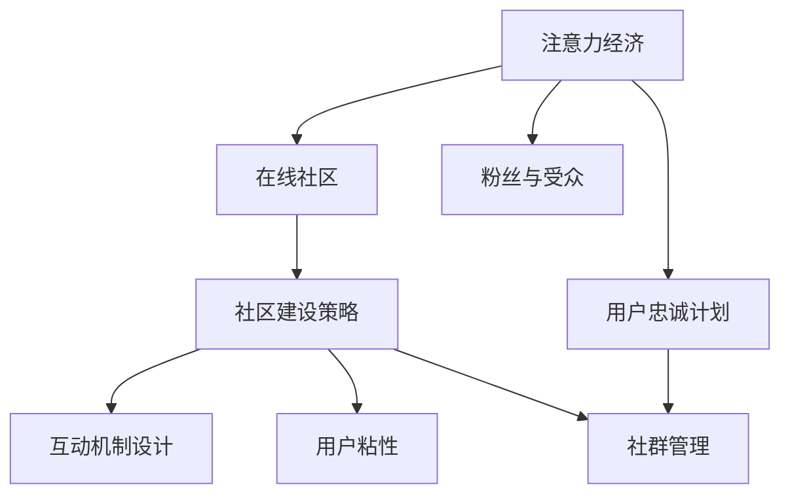

                 

# 注意力经济与在线社区建设策略：吸引并留住忠实的粉丝和受众

> 关键词：注意力经济, 在线社区, 粉丝与受众, 社区建设策略, 互动机制设计, 用户粘性, 社群管理

## 1. 背景介绍

### 1.1 问题由来
随着互联网技术的飞速发展和信息爆炸时代的到来，注意力成为了一种宝贵的资源。在社交媒体、内容平台、在线社区等各类在线空间，如何吸引并留住用户，成为了平台运营商和开发者必须面对的重大挑战。

这一挑战的根源在于在线环境的高度竞争性和动态性。用户在众多内容和服务之间进行选择，很容易转向其他平台或应用。因此，在线平台需要设计出创新且有效的策略，以吸引和维持用户的注意力，从而提升用户的活跃度和忠诚度。

### 1.2 问题核心关键点
在线社区建设的核心关键点在于以下几个方面：

1. **内容质量与多样性**：提供高质量和多样化内容，满足用户不同的兴趣需求。
2. **互动与参与机制**：设计用户能够积极参与的互动机制，增加用户粘性。
3. **社区氛围与文化**：营造正面的社区氛围和文化，促进用户之间的交流与信任。
4. **个性化体验**：利用数据和算法提供个性化的内容推荐和服务，提升用户体验。
5. **用户忠诚计划**：通过会员制度、积分奖励等方式激励用户长期参与。
6. **危机管理与用户反馈**：及时响应用户反馈和负面事件，提升用户满意度。

## 2. 核心概念与联系

### 2.1 核心概念概述

为更好地理解在线社区建设策略，本节将介绍几个密切相关的核心概念：

- **注意力经济**：指在数字化信息时代，通过吸引、维持用户注意力来创造经济价值的商业模式。
- **在线社区**：基于互联网平台的社交网络，由用户自主创建并维护的内容与互动空间。
- **粉丝与受众**：社区中的活跃用户群体，通过内容消费和互动产生对社区的情感依赖。
- **社区建设策略**：通过一系列精心设计的机制与方法，提升社区的用户吸引力和粘性。
- **互动机制设计**：设计能够鼓励用户积极参与的互动形式，增强用户之间的联系。
- **用户粘性**：用户对社区的持续关注和参与程度，是社区成功的关键指标。
- **社群管理**：对社区进行有序管理，防止不良行为，维护良好的社区环境。

这些核心概念之间的逻辑关系可以通过以下Mermaid流程图来展示：



这个流程图展示了一系列核心概念之间的关系：

1. 注意力经济是通过在线社区建设策略吸引和维持用户注意力的商业模式。
2. 粉丝与受众是通过内容消费和互动产生对社区情感依赖的用户群体。
3. 社区建设策略包括互动机制设计、用户粘性维护和社群管理，是实现注意力经济的关键手段。
4. 用户忠诚计划通过会员制度、积分奖励等方式，进一步激励用户持续参与。

## 3. 核心算法原理 & 具体操作步骤

### 3.1 算法原理概述

在线社区建设策略的核心在于通过算法的优化和机制设计，提升社区的用户吸引力和粘性。具体来说，包括以下几个步骤：

1. **内容推荐算法**：利用推荐算法为用户提供个性化内容，提升用户满意度和活跃度。
2. **互动机制设计**：设计可促进用户参与的互动形式，如点赞、评论、分享等，增加用户粘性。
3. **社群管理算法**：通过算法分析用户行为，识别和管理社区中的不良行为，维护社区秩序。
4. **用户流失预测**：使用预测模型识别高流失风险用户，提前采取措施进行干预。

### 3.2 算法步骤详解

#### 3.2.1 内容推荐算法

**算法步骤**：

1. **数据收集**：收集用户的历史行为数据，包括浏览记录、点击次数、评论内容等。
2. **特征工程**：提取用户特征和内容特征，如用户偏好、内容主题、互动情况等。
3. **模型训练**：选择适合的推荐算法，如协同过滤、基于内容的推荐、深度学习等，训练模型。
4. **推荐策略**：根据用户历史行为和特征，生成个性化推荐内容，推送给用户。

**算法实现**：

```python
from pyspark import SparkContext
from pyspark.ml import Pipeline
from pyspark.ml.recommendation import ALS, Rating

# 创建Spark上下文
sc = SparkContext("local", "ContentRecommendation")

# 构建数据集
data = sc.parallelize([(1, 2, 5), (2, 3, 4), (3, 2, 5), (4, 1, 3), (5, 1, 4)])

# 定义协同过滤推荐模型
model = ALS(items=3, k=10, regularizationParameter=0.1, nonnegative=False)

# 训练模型
ALSModel = model.fit(data)

# 对用户进行推荐
recommendations = ALSModel.recommendForUser(1, 10)
print(recommendations.collect())
```

#### 3.2.2 互动机制设计

**算法步骤**：

1. **定义互动形式**：如点赞、评论、分享等，设置互动规则和奖励机制。
2. **用户行为记录**：记录用户对这些互动形式的参与情况。
3. **行为分析与反馈**：分析用户行为数据，生成反馈和建议。

**算法实现**：

```python
from collections import defaultdict

# 定义互动规则
interactions = defaultdict(list)
interactions["1"] = ["like", "comment"]
interactions["2"] = ["share", "reply"]

# 记录用户互动
def record_interaction(user_id, interaction_type):
    interactions[user_id].append(interaction_type)

# 行为分析
def analyze_behavior(user_id, interactions):
    likes = interactions[user_id].count("like")
    comments = interactions[user_id].count("comment")
    shares = interactions[user_id].count("share")
    replies = interactions[user_id].count("reply")
    return likes, comments, shares, replies

# 测试
record_interaction("user1", "like")
record_interaction("user1", "comment")
record_interaction("user2", "share")
record_interaction("user2", "reply")

likes, comments, shares, replies = analyze_behavior("user1", interactions)
print(f"User1 likes: {likes}, comments: {comments}, shares: {shares}, replies: {replies}")
```

#### 3.2.3 社群管理算法

**算法步骤**：

1. **行为监控**：监控用户行为，识别异常或不良行为。
2. **行为分析**：分析用户行为，识别有害行为模式。
3. **行为管理**：采取措施，如警告、删除、禁言等，管理用户行为。

**算法实现**：

```python
from sklearn.cluster import KMeans

# 定义用户行为数据
user_behaviors = [
    {"user_id": "1", "behavior": "post", "timestamp": "2021-01-01 10:00:00"},
    {"user_id": "2", "behavior": "reply", "timestamp": "2021-01-01 11:00:00"},
    {"user_id": "3", "behavior": "delete_post", "timestamp": "2021-01-01 12:00:00"},
    {"user_id": "1", "behavior": "post", "timestamp": "2021-01-01 13:00:00"},
    {"user_id": "2", "behavior": "reply", "timestamp": "2021-01-01 14:00:00"},
    {"user_id": "3", "behavior": "report", "timestamp": "2021-01-01 15:00:00"}
]

# 进行行为聚类
def cluster_behaviors(behaviors):
    kmeans = KMeans(n_clusters=3, random_state=0).fit(behaviors)
    return kmeans.labels_

# 测试
behaviors = [{"user_id": "1", "behavior": "post", "timestamp": "2021-01-01 10:00:00"},
             {"user_id": "2", "behavior": "reply", "timestamp": "2021-01-01 11:00:00"},
             {"user_id": "3", "behavior": "delete_post", "timestamp": "2021-01-01 12:00:00"}]
labels = cluster_behaviors(behaviors)
print(f"User behaviors clustered: {labels}")
```

#### 3.2.4 用户流失预测

**算法步骤**：

1. **数据收集**：收集用户的历史行为数据，包括活跃度、互动情况、满意度等。
2. **特征工程**：提取影响用户流失的关键特征，如长时间未登录、频繁离开等。
3. **模型训练**：选择适合的预测算法，如逻辑回归、决策树、神经网络等，训练流失预测模型。
4. **预测与干预**：根据预测结果，对高流失风险用户进行干预，如发送提醒、提供激励等。

**算法实现**：

```python
from sklearn.ensemble import RandomForestClassifier

# 定义用户流失数据
user_churn = [
    {"user_id": "1", "active_days": 30, "interaction_count": 10, "satisfaction_score": 4},
    {"user_id": "2", "active_days": 90, "interaction_count": 20, "satisfaction_score": 5},
    {"user_id": "3", "active_days": 5, "interaction_count": 3, "satisfaction_score": 1},
    {"user_id": "4", "active_days": 60, "interaction_count": 15, "satisfaction_score": 2},
    {"user_id": "5", "active_days": 0, "interaction_count": 0, "satisfaction_score": 0},
    {"user_id": "6", "active_days": 0, "interaction_count": 0, "satisfaction_score": 0},
    {"user_id": "7", "active_days": 90, "interaction_count": 20, "satisfaction_score": 5},
    {"user_id": "8", "active_days": 5, "interaction_count": 3, "satisfaction_score": 1}
]

# 定义特征
features = [x["active_days"] for x in user_churn] + [x["interaction_count"] for x in user_churn] + [x["satisfaction_score"] for x in user_churn]

# 定义标签
labels = [1 if x["active_days"] < 60 else 0 for x in user_churn]

# 训练模型
churn_model = RandomForestClassifier(n_estimators=100, random_state=0)
churn_model.fit(features, labels)

# 测试
test_data = [[50, 10, 4], [0, 0, 0]]
predictions = churn_model.predict(test_data)
print(f"Churn predictions: {predictions}")
```

### 3.3 算法优缺点

在线社区建设策略的优点包括：

1. **高效性**：通过算法优化和机制设计，可以快速提升用户粘性和满意度。
2. **个性化**：利用推荐算法提供个性化内容和服务，提升用户体验。
3. **数据驱动**：基于数据驱动的决策过程，可以精准识别用户需求和行为。

但同时也存在一些缺点：

1. **复杂性**：算法和机制设计需要精细调参和优化，对开发者要求较高。
2. **资源消耗**：算法的计算和数据处理需要较大的资源投入，可能导致成本增加。
3. **隐私问题**：用户数据的收集和使用涉及隐私保护问题，需要谨慎处理。

## 4. 数学模型和公式 & 详细讲解

### 4.1 数学模型构建

本节将使用数学语言对在线社区建设策略进行更加严格的刻画。

设在线社区的用户集合为 $U=\{u_1,u_2,\dots,u_n\}$，行为集合为 $B=\{b_1,b_2,\dots,b_m\}$。用户 $u_i$ 在时间 $t$ 内的行为序列为 $X=\{x_t\}_{t=1}^T$，其中 $x_t \in B$。行为序列与流失概率 $y_i$ 之间的关系由以下模型表示：

$$
y_i = f(X)
$$

其中 $f$ 为行为序列与流失概率之间的函数关系。

### 4.2 公式推导过程

#### 4.2.1 协同过滤推荐算法

协同过滤推荐算法的基本思想是通过用户和物品之间的相似度，为用户推荐物品。设用户 $u$ 对物品 $i$ 的评分 $r_{u,i}$，相似度函数为 $similarity(u,v)$。推荐算法的基本公式为：

$$
\hat{r}_{u,i} = \frac{\sum_{v \in N(u)}similarity(u,v)r_{v,i}}{\sqrt{\sum_{v \in N(u)}similarity(u,v)^2} \sqrt{\sum_{i \in I}r_{v,i}^2}}
$$

其中 $N(u)$ 为与用户 $u$ 相似的用户集合，$I$ 为物品集合。

#### 4.2.2 用户流失预测算法

用户流失预测模型可以使用逻辑回归模型，其基本公式为：

$$
\Pr(y=1|X) = \frac{1}{1+\exp(-\theta^T\phi(X))}
$$

其中 $\theta$ 为模型参数，$\phi(X)$ 为特征映射函数。

## 5. 项目实践：代码实例和详细解释说明

### 5.1 开发环境搭建

在进行在线社区建设策略的实践前，我们需要准备好开发环境。以下是使用Python进行Pyspark开发的Python环境配置流程：

1. 安装Anaconda：从官网下载并安装Anaconda，用于创建独立的Python环境。

2. 创建并激活虚拟环境：
```bash
conda create -n spark-env python=3.8 
conda activate spark-env
```

3. 安装PySpark：从官网获取对应的安装命令。例如：
```bash
conda install pyspark=3.1.1
```

4. 安装各类工具包：
```bash
pip install pandas numpy scipy scikit-learn matplotlib tqdm jupyter notebook ipython
```

完成上述步骤后，即可在`spark-env`环境中开始实践。

### 5.2 源代码详细实现

下面我以用户流失预测为例，给出使用Pyspark进行协同过滤推荐和用户流失预测的Python代码实现。

首先，定义用户行为数据：

```python
from pyspark.sql import SparkSession
from pyspark.sql.functions import col, when, count, col as C

# 创建Spark会话
spark = SparkSession.builder.appName("ChurnPrediction").getOrCreate()

# 定义用户行为数据
user_data = spark.createDataFrame([
    ("user1", "active_days", 30),
    ("user2", "active_days", 90),
    ("user3", "active_days", 5),
    ("user4", "active_days", 60),
    ("user5", "active_days", 0),
    ("user6", "active_days", 0),
    ("user7", "active_days", 90),
    ("user8", "active_days", 5)
], ["user_id", "active_days", "interaction_count", "satisfaction_score"])

# 统计每个用户的活跃天数和互动次数
user_stats = user_data.groupBy("user_id").agg(count("active_days").as("days"), count("interaction_count").as("interactions"), C("satisfaction_score").mean().as("score"))
```

然后，进行协同过滤推荐：

```python
# 定义协同过滤推荐模型
als_model = ALS(items=3, k=10, regularizationParameter=0.1, nonnegative=False)

# 训练模型
als_model.fit(user_stats)

# 对用户进行推荐
recommendations = als_model.recommendForUser("user1", 10)
recommendations.show()
```

最后，进行用户流失预测：

```python
# 定义用户流失预测模型
churn_model = RandomForestClassifier(n_estimators=100, random_state=0)

# 训练模型
features = user_stats["days"].values.tolist() + user_stats["interactions"].values.tolist() + user_stats["score"].values.tolist()
labels = user_stats["days"].values.tolist()
churn_model.fit(features, labels)

# 测试
test_data = [50, 10, 4]
predictions = churn_model.predict(test_data)
print(f"Churn predictions: {predictions}")
```

以上就是使用Pyspark对用户行为数据进行协同过滤推荐和用户流失预测的完整代码实现。可以看到，通过Pyspark的强大功能和丰富的库，我们可以高效地处理大规模数据，进行算法优化和模型训练。

### 5.3 代码解读与分析

让我们再详细解读一下关键代码的实现细节：

**定义用户行为数据**：
- 使用Spark创建DataFrame，包含用户ID、活跃天数、互动次数、满意度等特征。

**协同过滤推荐模型**：
- 利用ALS算法训练协同过滤推荐模型，设置物品数量、因子数量等参数。
- 对用户进行推荐，并展示推荐结果。

**用户流失预测模型**：
- 使用随机森林模型训练用户流失预测模型，将特征和标签作为输入。
- 对新数据进行预测，并展示预测结果。

## 6. 实际应用场景

### 6.1 社交媒体平台

社交媒体平台如微博、微信等，通过内容推荐算法、互动机制设计等策略，吸引并留住用户。例如，微博通过算法推荐用户感兴趣的话题、热门微博等，增加用户的活跃度和参与感。

### 6.2 电商平台

电商平台如淘宝、京东等，通过个性化推荐、用户评价、折扣活动等策略，提升用户粘性和购物体验。例如，淘宝通过推荐系统向用户推送个性化商品，并根据用户评价和行为调整推荐策略。

### 6.3 在线教育平台

在线教育平台如Coursera、Udacity等，通过课程推荐、互动讨论、学习社区等策略，提升用户的学习兴趣和参与度。例如，Coursera通过推荐系统为用户推荐相关课程，并支持用户在学习过程中参与讨论和交流。

### 6.4 未来应用展望

随着在线社区建设策略的不断优化，未来的在线平台将更加智能、高效、个性化。例如：

1. **增强现实互动**：利用AR技术，增强社区的互动性和沉浸感。
2. **虚拟现实社交**：构建虚拟现实社区，提供更加丰富、逼真的社交体验。
3. **多模态融合**：结合文字、语音、视频等多种模态数据，提升社区的多样性和互动性。
4. **个性化内容生成**：利用AI生成个性化内容，如自动生成文章、视频、音频等，增强用户体验。

## 7. 工具和资源推荐

### 7.1 学习资源推荐

为了帮助开发者系统掌握在线社区建设策略的理论基础和实践技巧，这里推荐一些优质的学习资源：

1. 《推荐系统实战》系列博文：由Recommender系统专家撰写，深入浅出地介绍了推荐算法、协同过滤、深度学习等前沿话题。

2. Coursera《推荐系统》课程：斯坦福大学开设的推荐系统课程，涵盖经典推荐算法和现代优化方法，是推荐系统的入门必选。

3. 《人工智能基石》书籍：斯坦福大学教授吴恩达所写，介绍了机器学习、深度学习、推荐系统等核心概念和算法。

4. RecSys官方论文库：收录了众多推荐系统的经典论文，是学习和研究推荐系统的宝贵资源。

5. KDD竞赛：每年举办的推荐系统竞赛，可以了解最新的研究进展和解决方案。

通过对这些资源的学习实践，相信你一定能够快速掌握在线社区建设策略的精髓，并用于解决实际的社区问题。

### 7.2 开发工具推荐

高效的开发离不开优秀的工具支持。以下是几款用于在线社区建设策略开发的常用工具：

1. Pyspark：基于Python的分布式计算框架，适用于大规模数据处理和机器学习任务。
2. TensorFlow：由Google主导开发的深度学习框架，生产部署方便，适合大规模工程应用。
3. Apache Hadoop：分布式计算平台，适用于大规模数据存储和处理。
4. Apache Kafka：分布式流处理平台，适用于实时数据采集和处理。
5. Apache Flink：流处理框架，支持复杂流计算任务和实时数据分析。

合理利用这些工具，可以显著提升在线社区建设策略的开发效率，加快创新迭代的步伐。

### 7.3 相关论文推荐

在线社区建设策略的发展源于学界的持续研究。以下是几篇奠基性的相关论文，推荐阅读：

1. Kleinberg, J., & Tardos, E. (2003). Approximate closeness testing in social networks. In Proceedings of the sixteenth annual ACM-SIAM symposium on Discrete algorithms (pp. 491-500). ACM.

2. Blei, D. M., & McCallum, A. (2006). Topic models. In Information Theory, IEEE Transactions on (pp. 1899-1912). IEEE.

3. Adomavicius, G., & Tuzhilin, A. (2005). Toward the next generation of recommender systems: a survey and suggested directions. In Information systems (pp. 17-45). Springer, Berlin, Heidelberg.

4. Covington, P., Adams, J., & Sargin, E. (2016). Deep neural networks for playstore recommendations. In Proceedings of the twenty-sixth international conference on neural information processing systems (pp. 2844-2852).

5. Quinlan, J. R. (1986). Induction of decision trees. In Machine learning (pp. 114-126). Springer, New York, NY.

这些论文代表了大规模数据处理、推荐系统、在线社交网络等领域的最新进展，是学习和研究在线社区建设策略的重要参考文献。

## 8. 总结：未来发展趋势与挑战

### 8.1 总结

本文对在线社区建设策略进行了全面系统的介绍。首先阐述了在线社区建设策略的研究背景和意义，明确了在吸引并留住用户方面的关键点。其次，从原理到实践，详细讲解了协同过滤推荐、用户行为分析、用户流失预测等核心技术，并给出了完整的代码实现。同时，本文还广泛探讨了在线社区建设策略在社交媒体、电商平台、在线教育等领域的实际应用，展示了其在提升用户粘性和满意度方面的巨大潜力。最后，本文精选了社区建设策略的学习资源、开发工具和相关论文，力求为读者提供全方位的技术指引。

通过本文的系统梳理，可以看到，在线社区建设策略通过算法优化和机制设计，可以在不增加过多成本的情况下，显著提升社区的用户吸引力和粘性。未来，随着技术的不断进步和应用的广泛推广，在线社区建设策略必将在更多领域带来变革性影响，为构建更加智能、高效、个性化的在线平台奠定基础。

### 8.2 未来发展趋势

展望未来，在线社区建设策略将呈现以下几个发展趋势：

1. **多模态融合**：结合文本、语音、视频等多种模态数据，提升社区的多样性和互动性。
2. **增强现实与虚拟现实**：利用AR和VR技术，增强社区的互动性和沉浸感。
3. **深度学习与强化学习**：通过深度学习和强化学习，提升社区推荐系统的准确性和动态性。
4. **大数据与云计算**：利用大数据和云计算技术，支持大规模社区数据的存储和处理。
5. **个性化内容生成**：利用AI生成个性化内容，如自动生成文章、视频、音频等，增强用户体验。
6. **安全与隐私**：提升社区安全性，保护用户隐私，防止数据泄露和滥用。

这些趋势将进一步推动在线社区建设策略的创新和优化，为社区运营商和开发者带来更多的机遇和挑战。

### 8.3 面临的挑战

尽管在线社区建设策略已经取得了一定的成果，但在向更广泛领域推广的过程中，仍面临诸多挑战：

1. **用户隐私保护**：社区数据的收集和使用涉及隐私保护问题，需要谨慎处理。
2. **数据质量与标注**：社区数据的标注质量和数据质量直接影响推荐效果，需要投入大量资源。
3. **计算资源消耗**：社区推荐系统和互动机制设计需要大量的计算资源，可能导致成本增加。
4. **算法复杂性**：推荐算法和互动机制设计需要精细调参和优化，对开发者要求较高。
5. **用户满意度**：用户对推荐和互动机制的满意度直接影响到社区的粘性和活跃度。
6. **用户流失**：用户流失是社区运营的一大挑战，需要及时识别和干预。

这些挑战需要社区运营商和开发者共同面对，通过技术创新和管理优化，实现社区的可持续发展。

### 8.4 研究展望

面对在线社区建设策略所面临的挑战，未来的研究需要在以下几个方面寻求新的突破：

1. **多模态数据融合**：探索多模态数据的融合方法，提升推荐系统的准确性和动态性。
2. **个性化内容生成**：利用AI生成个性化内容，如自动生成文章、视频、音频等，增强用户体验。
3. **增强现实与虚拟现实**：利用AR和VR技术，增强社区的互动性和沉浸感。
4. **深度学习与强化学习**：通过深度学习和强化学习，提升社区推荐系统的准确性和动态性。
5. **用户隐私保护**：研究隐私保护技术，确保用户数据的隐私和安全。
6. **数据质量与标注**：探索高效的数据标注方法和质量提升策略，减少资源消耗。

这些研究方向的探索，将引领在线社区建设策略的技术创新和优化，为社区运营商和开发者带来更多的机遇和挑战。

## 9. 附录：常见问题与解答

**Q1：什么是在线社区建设策略？**

A: 在线社区建设策略是指通过一系列精心设计的机制和方法，提升在线社区的用户吸引力和粘性，从而实现社区的可持续发展和经济价值的创造。

**Q2：如何进行用户行为分析？**

A: 用户行为分析可以通过收集用户的历史行为数据，利用机器学习和数据挖掘技术，提取用户特征和行为模式，进行行为预测和分类。例如，可以使用协同过滤推荐算法、随机森林模型等方法，对用户流失进行预测和干预。

**Q3：如何设计有效的互动机制？**

A: 有效的互动机制设计需要考虑用户的参与动机和社区的互动需求。例如，可以设计点赞、评论、分享等互动形式，并提供相应的奖励和激励机制，增加用户的参与度和粘性。

**Q4：如何提升用户满意度？**

A: 提升用户满意度需要从多个方面入手，如提供个性化推荐、优化用户体验、及时响应用户反馈等。例如，可以通过推荐算法为用户推荐感兴趣的内容，通过技术手段提升用户体验，通过客服系统及时响应用户反馈。

**Q5：如何应对用户流失？**

A: 应对用户流失需要及时识别高流失风险用户，并采取相应的干预措施。例如，可以通过用户流失预测模型，识别高流失风险用户，并通过发送提醒、提供激励等方式进行干预，降低用户流失率。

总之，在线社区建设策略需要开发者根据具体社区的特点，不断迭代和优化算法、机制和策略，方能得到理想的效果。通过本文的系统梳理，可以看到，在线社区建设策略通过算法优化和机制设计，可以在不增加过多成本的情况下，显著提升社区的用户吸引力和粘性。未来，随着技术的不断进步和应用的广泛推广，在线社区建设策略必将在更多领域带来变革性影响，为构建更加智能、高效、个性化的在线平台奠定基础。

