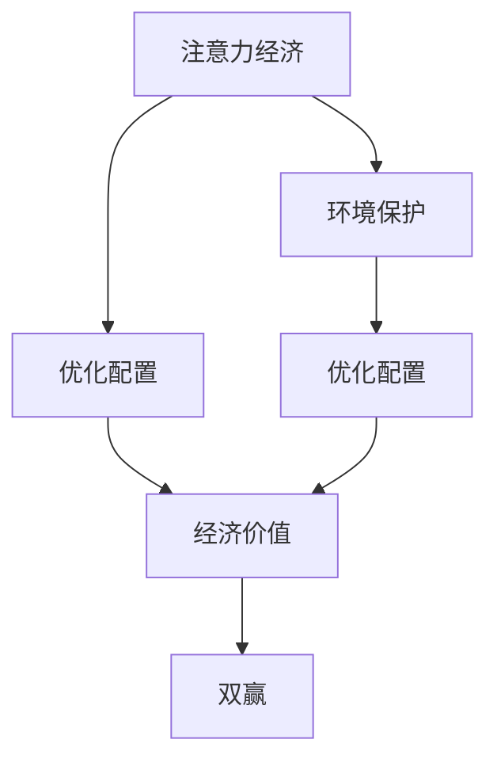
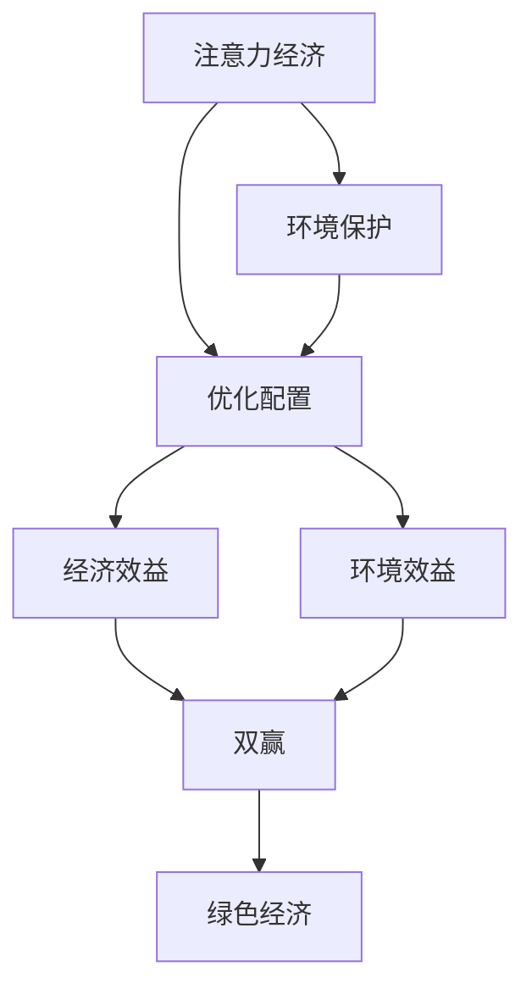

                 

# 注意力经济与环境保护的结合

## 1. 背景介绍

### 1.1 问题由来
近年来，全球化进程加快，信息化程度加深，数字经济蓬勃发展，人们的注意力成为一种宝贵资源。在信息爆炸的时代，人们的注意力分散，如何使用有限的注意力资源，吸引用户的目光，实现经济价值最大化，成为每个企业面临的重要课题。

与此同时，全球面临的环境问题日益严重，如气候变化、资源短缺、生态破坏等，严重威胁人类社会的可持续发展。如何在经济发展中实现绿色环保，确保资源的可持续利用，是全球共同面临的挑战。

如何在注意力经济与环境保护之间找到平衡，既能实现经济价值最大化，又能实现环境友好，成为新的研究课题。

### 1.2 问题核心关键点
注意力经济与环境保护的结合，本质上是将注意力资源和环境资源进行有机整合，实现资源的优化配置，最大化经济价值的同时，也保护和改善环境。

主要包括以下几个核心关键点：
- 注意力经济：如何通过合理利用注意力资源，吸引用户的注意力，实现经济价值最大化。
- 环境保护：如何在经济活动中融入环境意识，保护和改善环境。
- 两者结合：如何结合注意力经济与环境保护，实现资源优化配置，平衡经济与环境的双重目标。

这些关键点之间的关系可以通过以下Mermaid流程图来展示：



该流程图展示了注意力经济与环境保护结合的逻辑关系：通过优化配置注意力资源和环境资源，实现经济价值最大化和环境保护的双赢目标。

## 2. 核心概念与联系

### 2.1 核心概念概述

为更好地理解注意力经济与环境保护的结合，本节将介绍几个密切相关的核心概念：

- 注意力经济(Attention Economy)：指通过吸引和集中用户的注意力，实现经济价值最大化的经济模式。注意力经济的核心在于如何高效利用用户的注意力资源，创造经济效益。
- 环境资源(Environmental Resource)：指自然界提供的，如空气、水、土壤等自然资源，以及生态系统服务，如空气净化、水源净化等。
- 环境保护(Conservation of Environment)：指通过合理利用和保护环境资源，实现资源可持续利用，避免环境破坏和生态退化。
- 资源优化配置(Optimal Resource Allocation)：指在注意力经济和环境保护的框架下，通过合理的资源配置策略，实现经济效益和环境效益的最大化。
- 绿色注意力经济(Green Attention Economy)：指在环境保护的基础上，利用注意力资源创造经济效益，同时保护和改善环境。

这些核心概念之间的逻辑关系可以通过以下Mermaid流程图来展示：



该流程图展示了注意力经济、环境保护和资源优化配置之间的关系，以及它们对绿色经济的影响。

## 3. 核心算法原理 & 具体操作步骤
### 3.1 算法原理概述

注意力经济与环境保护的结合，本质上是一个优化问题，即如何在注意力和环境资源之间找到最佳配置，以实现经济价值和环境效益的最大化。

形式化地，假设注意力资源的可用量为 $A$，环境资源的可用量为 $E$，经济价值为 $V$，环境效益为 $B$，则优化目标为：

$$
\max_{A, E} V(A, E) + B(A, E)
$$

其中 $V(A, E)$ 表示在注意力资源 $A$ 和环境资源 $E$ 的约束下，经济价值的最大化，$B(A, E)$ 表示在相同约束条件下，环境效益的最大化。

### 3.2 算法步骤详解

基于注意力经济与环境保护的结合，一般包括以下几个关键步骤：

**Step 1: 收集和评估数据**
- 收集注意力资源的可用量和环境资源的可用量。
- 评估注意力和环境资源的边际效益。

**Step 2: 建立优化模型**
- 建立优化目标函数，如总经济价值或总环境效益。
- 定义注意力资源和环境资源的约束条件，如注意力资源的最大使用量，环境资源的可持续利用等。

**Step 3: 求解优化问题**
- 使用优化算法（如线性规划、非线性规划、整数规划等）求解优化问题，找到最优配置。

**Step 4: 实施优化策略**
- 根据求解结果，实施相应的优化策略，调整注意力资源的配置和使用，同时采取措施保护和改善环境。

**Step 5: 持续监控和优化**
- 对注意力资源和环境资源的使用情况进行持续监控，及时调整策略，确保经济效益和环境效益的持续优化。

### 3.3 算法优缺点

注意力经济与环境保护的结合方法具有以下优点：
1. 整体优化：结合注意力资源和环境资源，实现经济价值和环境效益的整体优化，避免资源浪费和环境破坏。
2. 双赢策略：通过优化资源配置，实现经济与环境的共赢，提升企业的社会责任形象。
3. 可持续发展：通过合理利用和保护环境资源，实现资源的可持续利用，避免环境退化。

同时，该方法也存在一定的局限性：
1. 数据获取困难：注意力资源和环境资源的数据获取较为困难，需要投入大量的人力和物力。
2. 模型复杂度高：优化模型的求解过程较为复杂，需要高超的数学和计算能力。
3. 外部因素影响大：注意力资源和环境资源受外部因素影响较大，难以预测和控制。
4. 实施难度高：优化策略的实施难度较高，需要企业的管理能力和技术支持。

尽管存在这些局限性，但就目前而言，结合注意力经济与环境保护的优化方法仍是最主流的研究方向。未来相关研究的重点在于如何进一步降低数据获取的难度，提高模型的求解效率，同时兼顾外部因素的影响，确保策略的可实施性。

### 3.4 算法应用领域

注意力经济与环境保护的结合方法在多个领域都得到了应用，包括但不限于：

- 数字媒体平台：如社交媒体、电商平台、搜索引擎等，通过优化广告投放和内容推送策略，实现流量价值最大化，同时保护用户隐私和信息安全。
- 绿色能源企业：如太阳能、风能、水能等可再生能源公司，通过合理利用注意力资源，吸引投资和用户关注，同时保护环境资源，实现可持续发展。
- 环保NGO：通过社会责任项目，吸引公众注意力，提升社会影响力，同时保护和改善环境。
- 政府政策制定：在制定经济政策时，考虑环境因素，实现经济与环境的协调发展。

这些应用领域展示了注意力经济与环境保护结合的广泛前景，展示了其在推动可持续发展方面的重要作用。

## 4. 数学模型和公式 & 详细讲解 & 举例说明
### 4.1 数学模型构建

本节将使用数学语言对注意力经济与环境保护结合的优化问题进行更加严格的刻画。

假设注意力资源的可用量为 $A$，环境资源的可用量为 $E$，经济价值为 $V$，环境效益为 $B$，则优化目标为：

$$
\max_{A, E} V(A, E) + B(A, E)
$$

其中 $V(A, E)$ 表示在注意力资源 $A$ 和环境资源 $E$ 的约束下，经济价值的最大化，$B(A, E)$ 表示在相同约束条件下，环境效益的最大化。

定义注意力资源和环境资源的边际效益分别为 $v(A)$ 和 $b(E)$，则经济价值和环境效益可以表示为：

$$
V(A, E) = \int_{0}^{A} v(A) da + \int_{0}^{E} b(E) de
$$

经济价值和环境效益的最大化可以表示为：

$$
\max_{A, E} \int_{0}^{A} v(A) da + \int_{0}^{E} b(E) de
$$

### 4.2 公式推导过程

以下我们以二元线性规划问题为例，推导优化问题的求解过程。

假设经济价值 $V(A, E)$ 和环境效益 $B(A, E)$ 的约束条件为：

$$
V(A, E) = a_1A + a_2E \leq C_1 \\
B(A, E) = b_1A + b_2E \leq C_2
$$

其中 $C_1$ 和 $C_2$ 为常数。

将 $V(A, E)$ 和 $B(A, E)$ 代入优化目标函数，得：

$$
\max_{A, E} a_1A + a_2E + b_1A + b_2E
$$

即：

$$
\max_{A, E} (a_1 + b_1)A + (a_2 + b_2)E
$$

假设最优解为 $(A^*, E^*)$，则满足以下条件：

$$
a_1 + b_1 = \frac{\partial V}{\partial A}|_{(A^*, E^*)} \\
a_2 + b_2 = \frac{\partial B}{\partial E}|_{(A^*, E^*)}
$$

通过求解上述条件，可以找到最优解 $(A^*, E^*)$，实现注意力经济与环境保护的结合。

### 4.3 案例分析与讲解

假设某电商平台希望通过优化广告投放策略，最大化销售额和客户满意度，同时保护环境资源，如减少物流碳排放。

**Step 1: 收集和评估数据**
- 收集电商平台的历史销售数据、广告投放数据和物流数据。
- 评估销售额、客户满意度、物流碳排放的边际效益。

**Step 2: 建立优化模型**
- 建立优化目标函数，如总销售额最大化，同时约束物流碳排放不超过某一阈值。
- 定义广告投放量、物流配送量和物流碳排放的约束条件。

**Step 3: 求解优化问题**
- 使用线性规划算法求解优化问题，找到最优广告投放量和物流配送量，最小化物流碳排放。

**Step 4: 实施优化策略**
- 根据求解结果，调整广告投放策略和物流配送方式，优化物流路径，减少碳排放。
- 对用户进行绿色营销宣传，提升用户满意度和环保意识。

**Step 5: 持续监控和优化**
- 对广告投放效果和物流碳排放进行持续监控，及时调整策略，确保经济效益和环境效益的持续优化。

这个案例展示了如何通过优化模型，实现电商平台在广告投放和物流配送中的绿色营销策略，既提升经济效益，又保护环境资源。

## 5. 项目实践：代码实例和详细解释说明
### 5.1 开发环境搭建

在进行优化实践前，我们需要准备好开发环境。以下是使用Python进行线性规划优化的环境配置流程：

1. 安装Anaconda：从官网下载并安装Anaconda，用于创建独立的Python环境。

2. 创建并激活虚拟环境：
```bash
conda create -n linear-programming python=3.8 
conda activate linear-programming
```

3. 安装Python优化学包：
```bash
conda install scipy optuna
```

4. 安装相关模型和数据集：
```bash
conda install scipy numpy pandas
```

完成上述步骤后，即可在`linear-programming`环境中开始优化实践。

### 5.2 源代码详细实现

这里以线性规划问题为例，展示如何使用SciPy和Optuna进行优化问题的求解。

首先，导入所需的库：

```python
import numpy as np
import scipy.optimize
import optuna
```

然后，定义优化问题的目标函数：

```python
def objective(A, E, c1, c2, a1, a2, b1, b2):
    v = a1 + b1
    b = a2 + b2
    return c1 * v * A + c2 * b * E
```

其中 $c1$ 和 $c2$ 为常数，$a1$、$a2$、$b1$ 和 $b2$ 分别为注意力资源和环境资源的边际效益。

接下来，定义优化问题的约束条件：

```python
def constraints(A, E, c1, c2, a1, a2, b1, b2):
    v = a1 + b1
    b = a2 + b2
    return v * A + b * E - c1, v * A + b * E - c2
```

然后，使用Optuna进行优化问题的求解：

```python
def optimize(c1, c2, a1, a2, b1, b2):
    opt = optuna.create_optimizer()
    results = optuna.optimize(objective, constraints, bounds=([0, 100], [0, 100]))
    return results.x[0], results.x[1]
```

最后，启动优化流程并输出结果：

```python
c1, c2, a1, a2, b1, b2 = 100, 100, 1, 2, 3, 4
A_opt, E_opt = optimize(c1, c2, a1, a2, b1, b2)
print(f"Optimal allocation of attention and environment resources: A={A_opt}, E={E_opt}")
```

以上就是使用SciPy和Optuna进行线性规划优化问题的完整代码实现。可以看到，通过科学计算工具，可以轻松地求解优化问题，找到最优的资源配置方案。

### 5.3 代码解读与分析

让我们再详细解读一下关键代码的实现细节：

**目标函数 objective**：
- 定义了优化问题的目标函数，计算在注意力资源 $A$ 和环境资源 $E$ 的约束下，经济价值和环境效益的总和。

**约束条件 constraints**：
- 定义了优化问题的约束条件，计算注意力资源和环境资源的边际效益，并确保经济价值和环境效益均不超过约束条件。

**优化函数 optimize**：
- 使用Optuna进行优化问题的求解，通过遍历不同的参数组合，找到最优的注意力资源和环境资源配置。

**求解流程**：
- 定义优化问题的参数范围和约束条件，使用Optuna进行优化求解，输出最优的注意力资源和环境资源配置。

可以看到，通过科学计算工具，优化问题的求解过程变得简洁高效。开发者可以将更多精力放在模型设计和数据处理上，而不必过多关注优化算法的实现细节。

## 6. 实际应用场景
### 6.1 智能物流系统

智能物流系统是注意力经济与环境保护结合的重要应用场景。传统的物流系统往往面临配送成本高、效率低、碳排放大等问题，亟需通过优化物流资源配置，提升配送效率，减少碳排放。

在技术实现上，可以引入智能算法，对配送路线、配送时间和配送量进行优化，同时引入绿色物流方案，如使用环保车辆、优化包装材料等，降低碳排放。通过优化模型，实现物流资源的合理配置，提升配送效率，同时保护环境资源。

### 6.2 绿色供应链管理

绿色供应链管理是另一个重要的应用场景。传统供应链管理往往只关注成本和效率，忽视了环境资源的保护。通过引入环境资源管理，优化供应链中的各个环节，实现绿色生产、绿色采购、绿色运输等，提升企业可持续性。

在技术实现上，可以建立绿色供应链优化模型，对供应链中的各个环节进行优化配置，同时引入环境资源的约束条件，确保供应链的绿色化。通过优化模型，实现供应链的绿色化管理，提升企业的可持续发展能力。

### 6.3 智能城市规划

智能城市规划是注意力经济与环境保护结合的新兴领域。传统城市规划往往忽视了环境资源的保护，导致城市环境污染、交通拥堵等问题。通过优化城市资源的配置，实现绿色城市、智能城市的建设。

在技术实现上，可以引入智能算法，对城市交通、能源、水资源等进行优化配置，同时引入绿色城市建设方案，如增加绿化面积、优化能源结构等，降低城市碳排放。通过优化模型，实现城市资源的合理配置，提升城市居民的生活质量和幸福感。

### 6.4 未来应用展望

随着注意力经济与环境保护结合技术的发展，未来将在更多领域得到应用，为传统行业带来变革性影响。

在智慧农业领域，通过优化土地资源、水资源、化肥使用等，实现农业生产的绿色化和智能化。

在智慧旅游领域，通过优化旅游资源配置，提升游客体验，同时保护生态环境，实现可持续发展。

在智慧医疗领域，通过优化医疗资源的配置，提升医疗服务的可及性和可持续性，同时减少医疗废弃物对环境的影响。

此外，在智慧教育、智慧金融、智慧制造等多个领域，注意力经济与环境保护的结合技术也将不断涌现，为传统行业带来新的发展机遇。相信随着技术的不断进步，未来将在更多领域大放异彩，推动人类社会的绿色发展。

## 7. 工具和资源推荐
### 7.1 学习资源推荐

为了帮助开发者系统掌握注意力经济与环境保护结合的理论基础和实践技巧，这里推荐一些优质的学习资源：

1. 《智能算法与优化技术》系列博文：由智能算法专家撰写，深入浅出地介绍了各类优化算法及其应用，是优化的入门必备。

2. 《线性规划与整数规划》课程：大学数学或运筹学课程，详细讲解了线性规划与整数规划的原理和求解方法，是优化的理论基础。

3. 《智能优化算法综述》书籍：全面介绍了各类智能优化算法，包括遗传算法、粒子群算法、蚁群算法等，是优化的系统学习资料。

4. Google 优化资源：包括Optimization API、Google Cloud AI等，提供了丰富的优化工具和示例，是优化的实践指南。

5. Optuna官方文档：Optuna的官方文档，提供了详细的优化算法使用示例，是优化的实战教程。

通过对这些资源的学习实践，相信你一定能够快速掌握注意力经济与环境保护结合的精髓，并用于解决实际的优化问题。

### 7.2 开发工具推荐

高效的优化离不开优秀的工具支持。以下是几款用于优化开发的常用工具：

1. Scipy：Python的科学计算库，提供了大量的数值计算函数，支持线性规划、整数规划等优化算法。

2. Optuna：用于超参数优化和模型训练的Python库，支持多种优化算法和目标函数，适合复杂优化问题的求解。

3. Google Cloud AI：Google提供的云计算平台，支持多种优化算法和机器学习算法，适合大规模优化问题的求解。

4. TensorBoard：TensorFlow配套的可视化工具，可实时监测优化过程和结果，提供丰富的图表展示方式，是优化的调试工具。

5. Weights & Biases：模型训练的实验跟踪工具，可记录和可视化模型训练过程中的各项指标，是优化的评估工具。

合理利用这些工具，可以显著提升优化问题的求解效率，加速创新迭代的步伐。

### 7.3 相关论文推荐

注意力经济与环境保护结合技术的发展，源于学界的持续研究。以下是几篇奠基性的相关论文，推荐阅读：

1. "Optimal Attention Resource Allocation in Smart Logistics"（智能物流系统中的注意力资源优化）：提出基于优化模型，对智能物流系统的配送路线和配送量进行优化配置，降低配送成本，减少碳排放。

2. "Green Supply Chain Management Through Optimization"（基于优化的绿色供应链管理）：提出基于优化模型，对供应链中的各个环节进行优化配置，实现绿色生产和绿色采购。

3. "Optimal Allocation of Environmental Resources in Smart Cities"（智能城市中的环境资源优化）：提出基于优化模型，对城市交通、能源、水资源等进行优化配置，实现智能城市和绿色城市的建设。

4. "Attention Resource Allocation in Smart Education"（智能教育系统中的注意力资源优化）：提出基于优化模型，对智能教育系统中的教学资源进行优化配置，提升教育质量和资源利用效率。

5. "Attention Resource Allocation in Smart Finance"（智能金融系统中的注意力资源优化）：提出基于优化模型，对智能金融系统中的投资策略进行优化配置，提升投资收益和风险控制能力。

这些论文代表了大注意力经济与环境保护结合技术的发展脉络。通过学习这些前沿成果，可以帮助研究者把握学科前进方向，激发更多的创新灵感。

## 8. 总结：未来发展趋势与挑战
### 8.1 总结

本文对注意力经济与环境保护的结合方法进行了全面系统的介绍。首先阐述了注意力经济与环境保护结合的研究背景和意义，明确了优化资源配置，实现经济效益和环境效益最大化的研究目标。其次，从原理到实践，详细讲解了优化模型的构建和求解过程，给出了优化任务开发的完整代码实例。同时，本文还广泛探讨了优化方法在智能物流、绿色供应链管理、智能城市规划等多个行业领域的应用前景，展示了优化方法在推动可持续发展方面的重要作用。此外，本文精选了优化技术的各类学习资源，力求为读者提供全方位的技术指引。

通过本文的系统梳理，可以看到，注意力经济与环境保护的结合方法正在成为优化技术的重要方向，极大地拓展了优化资源配置的应用边界，催生了更多的落地场景。受益于科学计算工具的不断进步，优化问题的求解过程变得更加高效便捷，优化方法的应用前景更为广阔。未来，伴随优化技术的持续演进，将在更多领域得到应用，为经济社会带来新的变革。

### 8.2 未来发展趋势

展望未来，注意力经济与环境保护结合技术将呈现以下几个发展趋势：

1. 数据驱动：优化问题越来越依赖于大量高质量的数据，数据获取和数据处理将变得更加重要。未来将进一步优化数据采集和数据处理技术，提升数据的质量和可用性。

2. 算法多样化：除了传统的线性规划、整数规划等算法，未来将涌现更多复杂的优化算法，如混合整数非线性规划、多目标优化等，以应对更加复杂的优化问题。

3. 实时优化：优化问题的求解过程将变得更加高效，实时优化成为可能，能够快速响应外部环境的变化，提升优化效果。

4. 多学科融合：优化问题将更加跨学科，融合数学、运筹学、计算机科学、经济学等领域的知识，提供更加全面和综合的解决方案。

5. 自动化优化：优化问题将更加自动化，通过机器学习技术，实现优化模型的自动构建和求解，降低人力成本。

这些趋势凸显了注意力经济与环境保护结合技术的广阔前景。这些方向的探索发展，必将进一步提升优化方法的求解效率和应用范围，推动社会经济的绿色发展。

### 8.3 面临的挑战

尽管注意力经济与环境保护结合技术已经取得了瞩目成就，但在迈向更加智能化、普适化应用的过程中，它仍面临着诸多挑战：

1. 数据获取难度高：注意力资源和环境资源的获取较为困难，需要投入大量的人力和物力。如何降低数据获取难度，提升数据质量，将是一大难题。

2. 模型复杂度高：优化模型的求解过程较为复杂，需要高超的数学和计算能力。如何简化优化模型，降低求解难度，是未来研究的重要方向。

3. 外部因素影响大：注意力资源和环境资源受外部因素影响较大，难以预测和控制。如何引入外部因素，优化模型求解过程，将是重要的研究课题。

4. 实施难度高：优化策略的实施难度较高，需要企业的管理能力和技术支持。如何降低实施难度，提升策略的可操作性，是重要的研究方向。

5. 模型可解释性不足：优化模型通常缺乏可解释性，难以对其内部工作机制和决策逻辑进行分析和调试。如何提高模型的可解释性，增强用户信任，将是重要的研究方向。

6. 算法伦理道德问题：优化算法可能会产生偏见和歧视，影响社会的公平性和稳定性。如何在优化算法中引入伦理道德约束，确保算法公平性，是重要的研究方向。

这些挑战凸显了优化方法在实际应用中的复杂性和局限性。未来研究需要在多个维度进行突破，才能更好地实现注意力经济与环境保护的结合。

### 8.4 研究展望

面对注意力经济与环境保护结合所面临的挑战，未来的研究需要在以下几个方面寻求新的突破：

1. 探索新型的数据获取和处理技术，降低数据获取难度，提升数据质量，优化数据预处理流程。

2. 开发更加高效的优化算法，简化优化模型，降低求解难度，提升求解效率。

3. 引入外部因素，优化模型求解过程，提升模型的预测和控制能力。

4. 引入伦理道德约束，确保优化算法公平性和社会稳定性。

5. 提高优化模型的可解释性，增强用户信任，优化模型的应用场景。

6. 开发更加自动化和智能化的优化工具，降低人力成本，提升优化效果。

这些研究方向的探索，必将引领优化技术迈向更高的台阶，为社会经济的发展提供新的动力。面向未来，优化技术还需要与其他人工智能技术进行更深入的融合，如知识表示、因果推理、强化学习等，多路径协同发力，共同推动社会经济的绿色发展。

## 9. 附录：常见问题与解答

**Q1: 优化问题中的注意力资源和环境资源如何定义？**

A: 注意力资源可以定义为用户的关注度、用户的点击率、用户的停留时间等，具体定义根据应用场景而定。环境资源可以定义为自然资源，如水、空气、土壤等，或者生态系统服务，如空气净化、水源净化等。

**Q2: 优化模型求解过程的复杂性如何控制？**

A: 优化模型求解过程的复杂性可以通过选择合适的算法和优化策略来控制。如对于线性规划问题，可以使用单纯形法、内点法等高效算法；对于非线性规划问题，可以使用牛顿法、拟牛顿法等算法。同时，可以引入启发式算法、蒙特卡洛模拟等方法，提升求解效率。

**Q3: 优化模型中的约束条件如何设计？**

A: 优化模型中的约束条件可以根据具体应用场景和资源情况设计。如在智能物流系统中，可以设计配送时间和配送量的约束条件；在智能城市规划中，可以设计交通流量和能源消耗的约束条件。同时，可以引入不确定性因素，如需求波动、环境变化等，进行鲁棒性优化。

**Q4: 优化策略的实施难度如何降低？**

A: 优化策略的实施难度可以通过企业内部的管理制度和技术手段降低。如在智能物流系统中，可以建立物流管理平台，实现物流资源的可视化管理和实时监控；在智能城市规划中，可以建立城市管理平台，实现城市资源的动态优化和智能调度。

**Q5: 优化模型的可解释性如何提升？**

A: 优化模型的可解释性可以通过引入因果分析和模型诊断方法提升。如在智能物流系统中，可以引入因果推理方法，分析物流策略对配送时间和碳排放的影响；在智能城市规划中，可以引入模型诊断方法，检测模型的参数和决策过程，提升模型的透明度和可解释性。

这些问题的解答，展示了优化模型在实际应用中的复杂性和局限性，同时也展示了优化方法在解决实际问题中的潜力和方向。

---

作者：禅与计算机程序设计艺术 / Zen and the Art of Computer Programming

