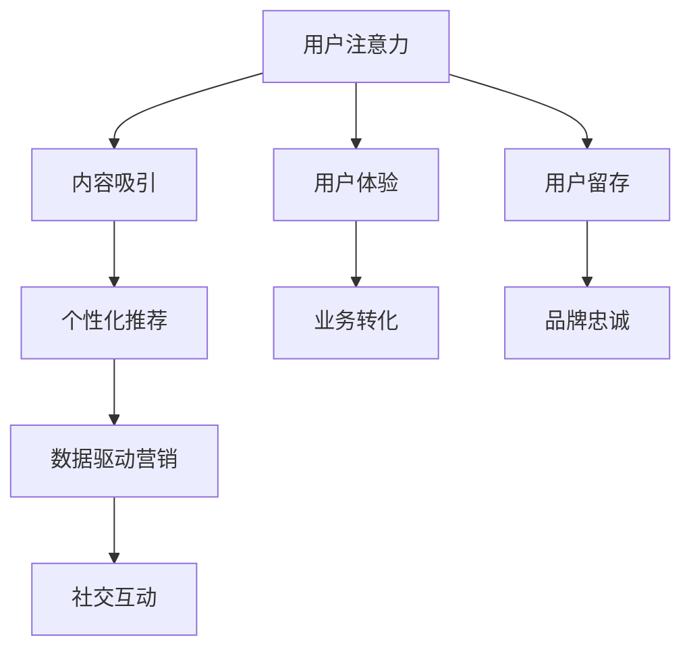

                 

# 注意力经济与社交媒体营销策略与实践：在不牺牲用户体验的情况下吸引受众

## 1. 背景介绍

### 1.1 问题由来

在数字化时代，注意力成为最稀缺的资源。社交媒体的兴起，极大地改变了人们获取信息和娱乐的方式。企业纷纷涌入社交平台，试图通过各种形式的内容和营销手段，吸引用户的关注，并转化为实际购买行为。然而，海量的信息和嘈杂的环境，使得用户越来越难以集中注意力。如何在不牺牲用户体验的前提下，高效吸引受众，成为了社交媒体营销的核心挑战。

注意力经济，是指通过获取和利用注意力来创造价值的一种经济活动。它强调了注意力资源的价值，以及如何通过设计有吸引力的内容和策略，获取用户的关注和参与。在社交媒体平台上，注意力经济的实践更加复杂和多样。企业不仅需要创建吸引人的内容，还需要考虑如何利用数据和算法，实现精准营销，提升用户互动和转化率。

### 1.2 问题核心关键点

社交媒体营销的核心在于如何吸引和保持用户的注意力。用户注意力被吸引并保持的越多，参与度就越高，从而带来更高的品牌价值和业务转化。然而，过度依赖广告和强制推荐，会削弱用户的使用体验，反而导致流失。因此，如何在不牺牲用户体验的前提下，有效吸引受众，成为了社交媒体营销的关键问题。

### 1.3 问题研究意义

研究社交媒体营销中的注意力获取和保持策略，对于提升企业品牌的在线影响力，优化用户体验，以及实现商业价值的最大化，具有重要的现实意义。

- **品牌影响力提升**：通过设计有吸引力的内容和互动机制，品牌能够在社交媒体上建立强大的用户基础，增强品牌认知度和忠诚度。
- **用户体验优化**：通过精准的推荐和个性化服务，让用户在使用社交媒体时感到愉悦和满意，增加使用频率和粘性。
- **业务转化提升**：通过引导用户关注和参与，实现从内容消费到购买转化的自然过渡，提升业务的ROI。

## 2. 核心概念与联系

### 2.1 核心概念概述

社交媒体营销涉及多个核心概念，包括但不限于：

- **用户注意力**：用户在社交媒体上所花费的时间和精力，反映了其对内容的兴趣和参与度。
- **内容吸引**：通过创意、互动性、趣味性等因素，吸引用户关注和参与。
- **个性化推荐**：根据用户的历史行为和偏好，推荐其可能感兴趣的内容，提升用户体验和满意度。
- **数据驱动营销**：利用数据分析和机器学习技术，优化营销策略和决策过程。
- **社交互动**：鼓励用户生成内容、评论、分享等行为，增强社区的活跃度和粘性。

这些概念之间的关系可以通过以下Mermaid流程图来展示：



这个流程图展示了用户注意力与社交媒体营销其他要素之间的关系：

1. 用户注意力是社交媒体营销的基础，通过内容吸引、个性化推荐、社交互动等方式提升。
2. 用户体验是用户留存和品牌忠诚的关键，需要结合内容吸引和个性化推荐。
3. 数据驱动营销是优化策略和决策的重要手段，通过数据分析提升内容和推荐的精准性。
4. 社交互动增强了社区活跃度，促进用户留存和品牌忠诚。
5. 最终目标是提升业务转化，实现商业价值的最大化。

## 3. 核心算法原理 & 具体操作步骤
### 3.1 算法原理概述

社交媒体营销中的注意力获取和保持，可以通过一系列算法和技术手段来实现。这些算法和技术包括但不限于：

- **内容生成和推荐算法**：基于用户兴趣和历史行为，生成和推荐个性化的内容。
- **社交网络算法**：分析用户行为和社交关系，推荐可能感兴趣的用户和内容。
- **情感分析算法**：分析用户评论和反馈，了解用户情绪和偏好。
- **动态定价策略**：根据市场需求和用户行为，动态调整广告和内容的定价。

这些算法的核心原理是利用机器学习和数据分析技术，从海量的数据中提取有价值的信息，辅助决策和优化。

### 3.2 算法步骤详解

以下将详细介绍几个关键算法的详细步骤：

#### 3.2.1 内容生成和推荐算法

**步骤1：用户行为分析**
- 收集用户的历史行为数据，包括浏览、点赞、评论、分享等。
- 分析用户的行为模式和偏好，识别出用户的兴趣主题和偏好内容类型。

**步骤2：内容生成**
- 根据用户兴趣，生成个性化的内容。内容形式可以包括图文、视频、直播等。
- 确保内容创意新颖、互动性强，能够吸引用户的注意力。

**步骤3：内容推荐**
- 将生成的内容推荐给用户，优先推荐与用户兴趣高度相关的内容。
- 使用协同过滤、基于内容的推荐等技术，实现更精准的推荐。

**步骤4：反馈收集和迭代**
- 收集用户对推荐内容的反馈，如点击率、互动率等指标。
- 根据反馈数据调整推荐策略，优化内容和推荐算法。

#### 3.2.2 社交网络算法

**步骤1：用户关系网络构建**
- 分析用户之间的互动关系，构建社交网络图。
- 使用图神经网络等技术，挖掘用户关系的潜在价值。

**步骤2：用户社区发现**
- 识别出具有共同兴趣的用户群体，形成社区。
- 为社区内的用户提供专属内容和互动机会。

**步骤3：内容传播扩散**
- 利用社交网络传播机制，扩散内容至社区内外的用户。
- 使用感染扩散模型等算法，优化内容传播路径和效果。

#### 3.2.3 情感分析算法

**步骤1：情感词汇库构建**
- 构建情感词汇库，包含各类积极、消极和中性的情感词汇。
- 使用自然语言处理技术，识别出文本中的情感词汇。

**步骤2：情感强度计算**
- 根据情感词汇库，计算文本的情感强度。
- 结合上下文信息，进一步调整情感强度的计算。

**步骤3：情感倾向分析**
- 分析用户评论和反馈的情感倾向，了解用户对品牌、产品或内容的情感态度。
- 根据情感倾向，优化营销策略和内容生成。

#### 3.2.4 动态定价策略

**步骤1：市场数据收集**
- 收集市场中的供需数据，包括价格、销售量等。
- 分析市场变化趋势，预测未来市场需求。

**步骤2：用户行为分析**
- 分析用户的购买行为和支付意愿，识别出高价值用户和潜在用户。
- 使用机器学习模型，预测用户对不同价格的反应。

**步骤3：定价策略优化**
- 根据市场需求和用户反应，动态调整广告和内容的定价。
- 优化定价策略，提升广告投放效果和用户体验。

### 3.3 算法优缺点

社交媒体营销中的注意力获取和保持算法，具有以下优点：

- **高效性**：通过数据分析和机器学习，可以快速识别用户兴趣和行为模式，实现精准营销。
- **个性化**：根据用户的历史行为和偏好，生成和推荐个性化内容，提升用户体验和满意度。
- **动态性**：能够实时调整策略，根据市场变化和用户反馈，优化推荐和定价策略。

同时，这些算法也存在一定的局限性：

- **数据依赖**：算法的准确性和效果依赖于高质量的数据，数据质量和量级不足会影响效果。
- **算法复杂性**：涉及复杂的机器学习和数据分析技术，实现和维护成本较高。
- **隐私问题**：收集和使用用户数据，可能引发隐私保护和数据安全问题。
- **算法偏见**：算法可能会由于训练数据的偏差，产生不公平的推荐和定价决策。

### 3.4 算法应用领域

社交媒体营销中的注意力获取和保持算法，广泛应用于多个领域，包括但不限于：

- **品牌推广**：通过精准推荐和互动机制，提升品牌认知度和忠诚度。
- **产品营销**：利用个性化推荐和动态定价策略，优化产品销售和转化率。
- **内容创作**：根据用户兴趣和反馈，优化内容生成和发布策略，提高内容点击率和互动率。
- **用户服务**：通过实时数据分析，优化客户服务和互动体验，提升用户满意度和粘性。

## 4. 数学模型和公式 & 详细讲解 & 举例说明

### 4.1 数学模型构建

社交媒体营销中的注意力获取和保持算法，可以通过以下数学模型进行描述：

设用户数量为 $N$，内容数量为 $M$，用户对内容的兴趣评分矩阵为 $R_{N\times M}$，其中 $R_{i,j}$ 表示用户 $i$ 对内容 $j$ 的兴趣评分。内容生成和推荐算法的目标是最小化兴趣评分差异，即：

$$
\min_{\theta} \sum_{i,j} ||R_{i,j} - f(\theta, i,j)||^2
$$

其中 $f(\theta, i,j)$ 为内容生成和推荐算法模型的预测函数，$\theta$ 为模型参数。

### 4.2 公式推导过程

以内容生成和推荐算法为例，其核心公式为：

$$
\hat{R}_{i,j} = \alpha R_{i,j} + (1-\alpha) f(\theta, i,j)
$$

其中 $\alpha$ 为兴趣评分权重，$f(\theta, i,j)$ 为推荐算法模型的预测函数。通过调整 $\alpha$ 和优化 $f(\theta, i,j)$，可以实现个性化的内容推荐。

具体推导过程如下：

1. **用户行为分析**
   - 设用户 $i$ 的历史行为向量为 $h_i = (h_{i,1}, h_{i,2}, ..., h_{i,M})$，其中 $h_{i,m}$ 表示用户 $i$ 对内容 $m$ 的兴趣评分。
   - 设内容的特征向量为 $c_j = (c_{j,1}, c_{j,2}, ..., c_{j,K})$，其中 $c_{j,k}$ 表示内容 $j$ 的第 $k$ 个特征。

2. **内容生成**
   - 设内容生成算法模型为 $g(\theta, h_i, c_j)$，输出内容 $j$ 对用户 $i$ 的兴趣评分 $\hat{h}_{i,j}$。
   - 模型参数 $\theta$ 通过优化最大化用户评分 $\hat{R}_{i,j}$ 和真实评分的差异最小化，即：

$$
\max_{\theta} \sum_{i,j} h_{i,j} \log(\hat{h}_{i,j}) + (1-h_{i,j}) \log(1-\hat{h}_{i,j})
$$

3. **内容推荐**
   - 设推荐算法模型为 $f(\theta, i,j)$，输出内容 $j$ 对用户 $i$ 的兴趣评分 $\hat{R}_{i,j}$。
   - 模型参数 $\theta$ 通过优化最大化用户评分 $\hat{R}_{i,j}$ 和真实评分的差异最小化，即：

$$
\min_{\theta} \sum_{i,j} ||R_{i,j} - \hat{R}_{i,j}||^2
$$

4. **反馈收集和迭代**
   - 收集用户对推荐内容的反馈数据 $D = \{(x_i, y_i)\}_{i=1}^N$，其中 $x_i$ 表示用户 $i$ 的特征向量，$y_i$ 表示用户 $i$ 的评分。
   - 根据反馈数据更新模型参数 $\theta$，优化内容生成和推荐算法，即：

$$
\theta \leftarrow \theta - \eta \nabla_{\theta}\mathcal{L}(\theta)
$$

其中 $\eta$ 为学习率，$\mathcal{L}$ 为损失函数。

### 4.3 案例分析与讲解

以电商平台的个性化推荐系统为例，分析如何利用注意力获取和保持算法优化用户体验和转化率。

1. **用户行为分析**
   - 电商平台收集用户的浏览历史、购买历史、搜索关键词等数据，构建用户行为向量 $h_i$。
   - 平台使用协同过滤、基于内容的推荐等技术，构建内容的特征向量 $c_j$。

2. **内容生成**
   - 电商平台利用用户行为向量 $h_i$ 和内容特征向量 $c_j$，生成个性化推荐内容。
   - 内容形式可以包括商品详情、用户评价、优惠券等，确保内容创意新颖、互动性强。

3. **内容推荐**
   - 电商平台根据用户行为向量 $h_i$ 和内容特征向量 $c_j$，推荐个性化的商品。
   - 使用协同过滤、矩阵分解等技术，实现更精准的推荐。

4. **反馈收集和迭代**
   - 电商平台收集用户对推荐内容的反馈数据，如点击率、购买率等。
   - 根据反馈数据调整推荐策略，优化推荐算法，提高用户体验和转化率。

## 5. 项目实践：代码实例和详细解释说明
### 5.1 开发环境搭建

在进行项目实践前，我们需要准备好开发环境。以下是使用Python进行PyTorch开发的环境配置流程：

1. 安装Anaconda：从官网下载并安装Anaconda，用于创建独立的Python环境。

2. 创建并激活虚拟环境：
```bash
conda create -n pytorch-env python=3.8 
conda activate pytorch-env
```

3. 安装PyTorch：根据CUDA版本，从官网获取对应的安装命令。例如：
```bash
conda install pytorch torchvision torchaudio cudatoolkit=11.1 -c pytorch -c conda-forge
```

4. 安装Transformers库：
```bash
pip install transformers
```

5. 安装各类工具包：
```bash
pip install numpy pandas scikit-learn matplotlib tqdm jupyter notebook ipython
```

完成上述步骤后，即可在`pytorch-env`环境中开始项目实践。

### 5.2 源代码详细实现

以下是一个简单的电商个性化推荐系统的代码实现：

```python
import torch
from torch import nn, optim
from torch.utils.data import DataLoader
from torch.nn import functional as F

# 用户行为向量和内容特征向量的定义
user_vector = torch.tensor([[0.2, 0.3, 0.1, 0.4]])
item_vector = torch.tensor([[0.1, 0.4, 0.3, 0.2]])

# 定义推荐模型
class RecommendationModel(nn.Module):
    def __init__(self):
        super(RecommendationModel, self).__init__()
        self.linear = nn.Linear(4, 1)
    
    def forward(self, user, item):
        return self.linear(torch.mm(user, item))

# 定义损失函数
def loss_fn(pred, target):
    return nn.BCELoss()(pred, target)

# 训练推荐模型
model = RecommendationModel()
optimizer = optim.Adam(model.parameters(), lr=0.01)
loss_fn = loss_fn

# 假设用户行为和内容特征都经过预处理，存储在Tensor中
user_vector = torch.tensor([[0.2, 0.3, 0.1, 0.4]])
item_vector = torch.tensor([[0.1, 0.4, 0.3, 0.2]])

# 训练数据
train_data = [(user_vector, item_vector)]

# 训练过程
for epoch in range(100):
    optimizer.zero_grad()
    pred = model(user_vector, item_vector)
    loss = loss_fn(pred, target)
    loss.backward()
    optimizer.step()
    
    if epoch % 10 == 0:
        print(f'Epoch {epoch+1}, loss: {loss.item()}')
```

### 5.3 代码解读与分析

让我们再详细解读一下关键代码的实现细节：

1. **用户行为向量和内容特征向量的定义**
   - 用户行为向量 $h_i$ 和内容特征向量 $c_j$ 的构建，是推荐算法的基础。在实际应用中，这些向量通常通过分析用户的历史行为数据和内容特征信息来生成。

2. **推荐模型的定义**
   - 推荐模型基于线性回归，利用用户行为向量 $h_i$ 和内容特征向量 $c_j$，预测用户对内容的兴趣评分 $\hat{R}_{i,j}$。在实际应用中，模型可以是神经网络、协同过滤等形式，根据具体场景和需求进行设计。

3. **损失函数的定义**
   - 推荐系统的损失函数通常使用二元交叉熵损失函数，用于衡量模型预测结果与真实评分之间的差异。损失函数的设计和优化是推荐算法的重要组成部分。

4. **训练过程**
   - 通过定义推荐模型、损失函数和优化器，开始模型的训练过程。训练过程中，模型前向传播计算预测结果，反向传播计算梯度，并使用优化器更新模型参数。

## 6. 实际应用场景
### 6.1 电商平台

在电商平台中，个性化推荐系统是提升用户体验和转化率的重要手段。通过分析用户行为和偏好，生成和推荐个性化的商品，电商平台的点击率和购买率将显著提升。例如，阿里巴巴、京东等电商巨头，已经在大规模应用推荐系统，显著提升了用户满意度和销售转化率。

### 6.2 社交媒体

社交媒体平台，如微信、微博等，也广泛应用个性化推荐算法。通过分析用户的行为和互动关系，推荐可能感兴趣的内容和用户，增强社区的活跃度和粘性。例如，抖音、快手等短视频平台，利用个性化推荐算法，极大地提升了用户观看时间和互动率。

### 6.3 新闻媒体

新闻媒体平台，如今日头条、网易新闻等，也广泛应用个性化推荐算法。通过分析用户的阅读习惯和兴趣，推荐个性化的新闻内容，提高用户粘性和阅读时长。例如，今日头条的推荐算法，已经实现了亿级的日活跃用户，成为新闻阅读的重要平台。

### 6.4 未来应用展望

未来，随着数据规模的不断扩大和技术的持续进步，社交媒体营销中的注意力获取和保持算法将进一步优化和普及。以下是几个可能的发展方向：

1. **多模态推荐**：结合文本、图像、视频等多种信息，进行更精准的推荐。例如，结合用户点赞的图片和视频内容，推荐相关文章或商品。
2. **动态定价**：根据市场变化和用户行为，动态调整广告和内容的定价，提升广告投放效果和用户体验。例如，根据用户点击率，动态调整广告出价。
3. **用户画像**：通过深度学习和多模态数据融合，构建更全面、准确的用户画像，提升推荐精准度。例如，结合用户画像和行为数据，生成更个性化的内容。
4. **实时推荐**：利用实时数据分析和机器学习，实现更快速的推荐更新。例如，结合用户实时行为数据，动态调整推荐内容。

这些发展方向将进一步提升社交媒体营销的效率和效果，帮助企业在竞争激烈的市场中取得优势。

## 7. 工具和资源推荐
### 7.1 学习资源推荐

为了帮助开发者系统掌握社交媒体营销中的注意力获取和保持策略，这里推荐一些优质的学习资源：

1. 《社交媒体营销实战》系列博文：由社交媒体营销专家撰写，深入浅出地介绍了社交媒体营销的各个方面，包括注意力获取、内容推荐、用户互动等。

2. CS353《社会网络和推荐系统》课程：斯坦福大学开设的推荐系统明星课程，有Lecture视频和配套作业，带你入门推荐算法的基本概念和经典模型。

3. 《社交媒体营销》书籍：全面介绍了社交媒体营销的理论和实践，涵盖注意力获取、内容创作、用户互动等多个环节。

4. Kaggle推荐系统竞赛：Kaggle平台上众多的推荐系统竞赛，可以让你在实践中掌握推荐算法和优化技巧。

5. AI Challenger推荐系统竞赛：AI Challenger平台上的推荐系统竞赛，涵盖了多场景下的推荐应用，是实践和学习的优秀平台。

通过对这些资源的学习实践，相信你一定能够快速掌握社交媒体营销中的注意力获取和保持策略，并用于解决实际的推荐问题。

### 7.2 开发工具推荐

高效的开发离不开优秀的工具支持。以下是几款用于社交媒体营销开发常用的工具：

1. PyTorch：基于Python的开源深度学习框架，灵活动态的计算图，适合快速迭代研究。大部分推荐算法都有PyTorch版本的实现。

2. TensorFlow：由Google主导开发的开源深度学习框架，生产部署方便，适合大规模工程应用。同样有丰富的推荐算法资源。

3. Scikit-learn：Python机器学习库，提供了丰富的数据分析和机器学习工具，方便进行特征工程和模型优化。

4. Weights & Biases：模型训练的实验跟踪工具，可以记录和可视化模型训练过程中的各项指标，方便对比和调优。与主流深度学习框架无缝集成。

5. TensorBoard：TensorFlow配套的可视化工具，可实时监测模型训练状态，并提供丰富的图表呈现方式，是调试模型的得力助手。

6. Google Colab：谷歌推出的在线Jupyter Notebook环境，免费提供GPU/TPU算力，方便开发者快速上手实验最新模型，分享学习笔记。

合理利用这些工具，可以显著提升社交媒体营销中注意力获取和保持算法的开发效率，加快创新迭代的步伐。

### 7.3 相关论文推荐

社交媒体营销中的注意力获取和保持算法，涉及多个前沿研究方向，以下是几篇奠基性的相关论文，推荐阅读：

1. "A Comprehensive Exploration on Recommendation System"（推荐系统综述）：总结了推荐系统的基本概念、算法和应用，是入门推荐算法的优秀教材。

2. "Collaborative Filtering in Recommendation Systems"（协同过滤推荐系统）：详细介绍了协同过滤算法的原理和实现，是推荐算法的重要基础。

3. "The Network Structure of Recommendations"（推荐系统的网络结构）：探讨了推荐系统中用户行为网络和物品特征网络的结构和性质，对理解推荐算法具有重要意义。

4. "A Survey on Multi-View Recommendation Learning"（多视角推荐学习综述）：总结了多视角推荐学习的基本方法和应用，是理解多模态推荐的重要参考。

5. "User Modeling in Recommendation Systems"（推荐系统中的用户建模）：详细介绍了用户建模的方法和技巧，是优化推荐算法的重要方向。

这些论文代表了大数据和深度学习在推荐系统中的应用方向，是深入理解社交媒体营销中注意力获取和保持算法的优秀参考资料。

## 8. 总结：未来发展趋势与挑战

### 8.1 总结

本文对社交媒体营销中的注意力获取和保持策略进行了全面系统的介绍。首先阐述了注意力经济的概念和社交媒体营销的挑战，明确了注意力获取和保持策略的重要性和现实意义。其次，从原理到实践，详细讲解了内容生成和推荐算法、社交网络算法、情感分析算法、动态定价策略等多个关键算法的详细步骤和实现方法。同时，本文还广泛探讨了这些算法在电商平台、社交媒体、新闻媒体等多个领域的应用前景，展示了其广泛的应用价值。

通过本文的系统梳理，可以看到，社交媒体营销中的注意力获取和保持策略，正在成为企业数字化转型中不可或缺的重要组成部分。这些策略通过精准的内容推荐和互动机制，有效提升了用户体验和业务转化，具有重要的现实意义。

### 8.2 未来发展趋势

展望未来，社交媒体营销中的注意力获取和保持策略将呈现以下几个发展趋势：

1. **多模态融合**：结合文本、图像、视频等多种信息，进行更精准的推荐。多模态融合将显著提升推荐算法的表现。
2. **动态定价**：根据市场变化和用户行为，动态调整广告和内容的定价，提升广告投放效果和用户体验。动态定价将带来新的商业机会。
3. **用户画像**：通过深度学习和多模态数据融合，构建更全面、准确的用户画像，提升推荐精准度。用户画像将成为推荐算法的重要基础。
4. **实时推荐**：利用实时数据分析和机器学习，实现更快速的推荐更新。实时推荐将带来更高的用户粘性和满意度。
5. **隐私保护**：随着用户数据隐私保护的日益严格，推荐算法需要更加注重数据隐私和安全，防止数据泄露和滥用。

以上趋势凸显了社交媒体营销中的注意力获取和保持策略的广阔前景。这些方向的探索发展，将进一步提升推荐算法的精度和效果，为数字经济的繁荣提供新的动力。

### 8.3 面临的挑战

尽管社交媒体营销中的注意力获取和保持策略已经取得了显著成效，但在迈向更加智能化、普适化应用的过程中，它仍面临着诸多挑战：

1. **数据隐私和安全**：收集和使用用户数据，可能引发隐私保护和数据安全问题。如何在保护隐私的前提下，提升推荐算法的准确性，是一个重要课题。
2. **算法复杂性**：涉及复杂的机器学习和数据分析技术，实现和维护成本较高。如何在保持算法效果的同时，降低复杂度，提高可解释性，是未来的重要方向。
3. **算法偏见**：算法可能会由于训练数据的偏差，产生不公平的推荐和定价决策。如何在设计算法时消除偏见，是推荐算法的核心挑战。
4. **资源消耗**：大规模推荐系统需要消耗大量的计算资源，如何优化算法和系统架构，降低资源消耗，提高性能和可扩展性，是未来的重要研究方向。
5. **用户体验**：过度依赖推荐算法，可能导致用户被“算法茧房”，对推荐结果产生依赖。如何在提升用户体验的同时，实现个性化推荐，是未来的重要挑战。

### 8.4 研究展望

面向未来，社交媒体营销中的注意力获取和保持策略，需要在以下几个方面寻求新的突破：

1. **无监督学习和半监督学习**：探索无监督和半监督学习方法，摆脱对大规模标注数据的依赖，利用自监督学习、主动学习等无监督和半监督范式，最大限度利用非结构化数据，实现更加灵活高效的推荐。
2. **参数高效推荐**：开发更加参数高效的推荐方法，在固定大部分预训练参数的情况下，只更新极少量的任务相关参数。同时优化推荐模型的计算图，减少前向传播和反向传播的资源消耗，实现更加轻量级、实时性的部署。
3. **因果推断和博弈论**：引入因果推断和博弈论思想，增强推荐模型的决策能力和鲁棒性。通过因果分析和博弈论工具，提高推荐算法的公平性和稳定性。
4. **知识图谱和专家系统**：将符号化的知识图谱、逻辑规则等专家知识，与神经网络模型进行巧妙融合，引导推荐过程学习更准确、合理的推荐结果。同时加强不同模态数据的整合，实现视觉、语音等多模态信息与文本信息的协同建模。

这些研究方向将引领社交媒体营销中注意力获取和保持策略的进一步优化，为构建安全、可靠、可解释、可控的智能系统铺平道路。面向未来，社交媒体营销需要与其他人工智能技术进行更深入的融合，如知识表示、因果推理、强化学习等，多路径协同发力，共同推动自然语言理解和智能交互系统的进步。只有勇于创新、敢于突破，才能不断拓展推荐算法的边界，让智能技术更好地造福人类社会。

## 9. 附录：常见问题与解答

**Q1：如何设计高效的推荐算法？**

A: 设计高效的推荐算法，需要综合考虑多个因素，包括数据质量、算法复杂度、系统性能等。以下是一些关键点：

1. **数据质量**：推荐算法的效果高度依赖于数据质量。确保数据的准确性、完整性和一致性，是推荐算法的基础。
2. **算法复杂度**：推荐算法的复杂度需要根据数据量和资源条件进行权衡。复杂度低、易解释的算法通常更容易维护和优化。
3. **系统性能**：推荐系统需要具备高并发、低延迟的特点。合理设计算法和系统架构，优化性能和可扩展性，是实现高效推荐的关键。

**Q2：推荐算法如何应对冷启动问题？**

A: 冷启动问题是指新用户或新商品在初始阶段缺乏足够的历史数据，难以进行有效的推荐。以下是一些应对策略：

1. **内容推荐**：利用用户行为和内容特征，进行初始推荐。通过不断优化推荐算法，提升用户互动和行为数据，逐步缓解冷启动问题。
2. **协同过滤**：利用用户的历史行为数据和相似用户的行为数据，进行推荐。协同过滤算法在冷启动问题上表现较好。
3. **深度学习**：利用深度学习模型，从用户的历史行为数据中提取更深层次的特征，提升推荐效果。

**Q3：推荐算法如何平衡个性化和多样性？**

A: 个性化和多样性是推荐算法的重要平衡点。个性化推荐能够提升用户体验，但可能导致信息茧房；多样性推荐能够缓解信息茧房，但可能无法满足用户个性化需求。以下是一些平衡策略：

1. **多目标优化**：通过多目标优化算法，同时考虑个性化和多样性。例如，利用排序算法，在保证个性化推荐的同时，加入多样性约束。
2. **用户画像**：构建更全面、准确的用户画像，提升推荐精准度。通过用户画像，优化推荐算法，平衡个性化和多样性。
3. **算法组合**：结合多个推荐算法，实现个性化和多样性的综合优化。例如，结合协同过滤和深度学习，提升推荐效果。

**Q4：推荐算法如何应对动态变化的市场环境？**

A: 动态变化的市场环境对推荐算法提出了更高的要求。以下是一些应对策略：

1. **实时数据分析**：利用实时数据分析和机器学习，实现更快速的推荐更新。例如，结合用户实时行为数据，动态调整推荐内容。
2. **动态定价**：根据市场变化和用户行为，动态调整广告和内容的定价。例如，根据用户点击率，动态调整广告出价。
3. **多模型融合**：结合多个推荐模型，提升推荐算法的鲁棒性和稳定性。例如，结合基于内容的推荐和基于协同过滤的推荐，提升推荐效果。

**Q5：推荐算法如何应对恶意行为？**

A: 推荐算法在实际应用中，可能面临恶意行为的风险。以下是一些应对策略：

1. **行为监控**：通过监控用户行为和推荐结果，及时发现和防范恶意行为。例如，检测异常点击行为，防止恶意点击。
2. **数据过滤**：利用数据过滤技术，过滤掉恶意数据和恶意推荐内容。例如，利用过滤算法，剔除虚假点击和点击欺诈。
3. **算法优化**：优化推荐算法，增强其鲁棒性和安全性。例如，加入对抗训练，提升模型的鲁棒性。

通过以上分析和解答，相信你对社交媒体营销中的注意力获取和保持策略有了更深入的了解。在实际应用中，合理设计和优化推荐算法，将能够有效提升用户体验和业务转化，实现社交媒体营销的商业价值最大化。

---

作者：禅与计算机程序设计艺术 / Zen and the Art of Computer Programming

