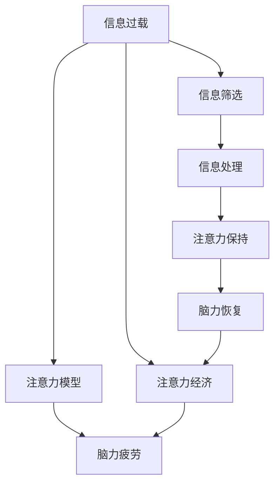

                 

# 注意力经济与脑力疲劳：如何在持续刺激中保持头脑健康

## 1. 背景介绍

### 1.1 问题由来
随着互联网的普及和移动互联网的兴起，信息爆炸已经成为一个不争的事实。新闻、社交媒体、电子商务、在线教育等众多领域，都充斥着源源不断的信息流。这种信息过载的环境，不仅改变了人们获取信息的方式，也对人们的认知和注意力提出了新的挑战。

在这样一个信息洪流中，人们必须面对如何高效、准确地筛选、吸收和处理信息的问题。这种需求催生了一种新的经济形态——注意力经济，即通过提供优质、有价值的信息和产品，吸引并保持用户的注意力，从而获取收益。

然而，注意力经济的发展也带来了一系列问题。海量的信息流和频繁的社交互动，使得人们的注意力不断被分散，大脑长期处于高强度的刺激状态，极易产生脑力疲劳。这种疲劳不仅影响工作效率和生活质量，甚至可能引发一些健康问题。

因此，如何在持续的注意力刺激下保持头脑健康，成为一个亟待解决的问题。本文将从注意力经济的本质、脑力疲劳的机制以及应对策略等方面进行探讨，为在信息爆炸时代中保持高效认知提供解决方案。

## 2. 核心概念与联系

### 2.1 核心概念概述

注意力经济：指通过提供有价值、高质量的信息和产品，吸引和保持用户注意力，从而获得收益的经济模式。与传统经济相比，注意力经济更强调信息传播的有效性和用户参与的深度。

脑力疲劳：指大脑在持续处理信息、解决问题、做出决策等认知活动中，由于能量消耗和资源耗竭而产生的疲劳状态。脑力疲劳会导致注意力分散、记忆力下降、决策能力减弱等症状。

信息过载：指个体接收的信息量远超过其处理能力，导致信息处理的效率和准确性下降的现象。

**注意力模型**：描述个体如何分配、调整和重新分配注意力的心理和神经机制模型。常见的注意力模型包括“资源理论”、“衰减理论”和“焦点-分散理论”。

### 2.2 核心概念原理和架构的 Mermaid 流程图



这个流程图展示了注意力经济和脑力疲劳之间的联系。从信息过载到注意力模型，再到脑力疲劳的整个过程。同时，也体现了信息筛选和处理对保持注意力和恢复脑力的重要性。

## 3. 核心算法原理 & 具体操作步骤

### 3.1 算法原理概述

在注意力经济中，如何高效、准确地筛选、处理和保持注意力，是一个核心问题。这个问题的本质在于如何在信息过载的环境中，识别和利用有价值的信息，避免无用信息的干扰。

传统的注意力模型主要基于认知心理学和神经科学的理论，描述了注意力的分配、调整和恢复过程。然而，这些模型大多停留在理论和实验阶段，缺乏实际应用的指导。因此，本文将介绍一种基于计算科学的注意力筛选算法，即注意力加权信息筛选算法。

### 3.2 算法步骤详解

注意力加权信息筛选算法主要包括以下几个步骤：

**Step 1: 信息预处理**
- 收集并预处理信息，去除无关信息、噪音和冗余数据。
- 对信息进行去重、标准化、分词、实体识别等处理，便于后续筛选。

**Step 2: 注意力计算**
- 使用注意力模型计算每个信息的注意力权重。常见的注意力模型包括Transformer模型、深度神经网络模型等。
- 通过计算信息的重要性权重，筛选出对用户有价值的信息。

**Step 3: 信息聚合与输出**
- 对筛选出的信息进行聚合，如权重加权平均、投票等方式。
- 根据聚合结果输出最终的信息，供用户查看和决策。

### 3.3 算法优缺点

注意力加权信息筛选算法的优点在于：
1. 通过计算注意力权重，筛选出对用户最有价值的信息。
2. 可以处理大规模信息流，适用于信息过载的环境。
3. 可以通过调整注意力模型的参数，实现不同的筛选策略。

然而，该算法也存在一些缺点：
1. 计算复杂度高，对硬件资源要求较高。
2. 注意力模型需要大量训练数据，才能获得较好的筛选效果。
3. 在信息分布不均的情况下，可能出现误判或漏判的情况。

### 3.4 算法应用领域

注意力加权信息筛选算法不仅适用于注意力经济，还可以应用于以下领域：

- 信息过滤与推荐系统：对用户的历史行为和偏好进行分析，推荐最相关的信息。
- 社交网络分析：分析用户的社交互动，识别出有价值的信息和用户。
- 在线教育：根据学生的学习行为和反馈，推荐适合的学习内容和资源。
- 电子商务：通过分析用户浏览和购买行为，推荐相关商品和优惠信息。
- 新闻聚合：筛选出具有高关注度的文章和事件，提升新闻报道的影响力。

## 4. 数学模型和公式 & 详细讲解

### 4.1 数学模型构建

信息筛选算法主要涉及以下几个数学模型：

- 信息权重计算模型：用于计算每个信息的注意力权重。
- 信息聚合模型：用于对筛选出的信息进行聚合。

假设信息集为 $I=\{i_1,i_2,...,i_n\}$，信息 $i_k$ 的权重为 $w_k$。则信息聚合模型可以表示为：

$$
S = \sum_{k=1}^n w_k \cdot i_k
$$

其中 $S$ 为聚合后的信息，$w_k$ 为信息 $i_k$ 的注意力权重，$i_k$ 为信息 $i_k$ 的具体内容。

### 4.2 公式推导过程

以Transformer模型为例，信息权重 $w_k$ 的计算公式如下：

$$
w_k = \sum_{j=1}^J \alpha_{kj} \cdot \text{ReLU}(\mathbf{W}_k^\top \mathbf{x}_j + \mathbf{b}_k) + \mathbf{b}_k
$$

其中 $\alpha_{kj}$ 为信息 $i_k$ 与信息 $i_j$ 之间的注意力权重，$\mathbf{W}_k$ 和 $\mathbf{b}_k$ 为注意力计算的参数，$\mathbf{x}_j$ 为信息 $i_j$ 的向量表示。

通过上述公式，可以计算出每个信息的注意力权重，用于筛选出对用户最有价值的信息。

### 4.3 案例分析与讲解

以新闻聚合为例，假设我们有一篇关于某次地震的新闻报道。该报道的标题为 "XX城市发生7.8级地震，紧急疏散数十万人"，内容涉及地震发生时间、地点、强度、影响范围、救援情况等。

我们可以使用Transformer模型，将报道的标题和内容进行编码，得到向量表示 $\mathbf{x}$。然后，使用注意力加权信息筛选算法，计算出报道的注意力权重。

假设 $w_{\text{title}}=0.8$，$w_{\text{content}}=0.2$，则最终的信息筛选结果为：

$$
S = 0.8 \times \text{标题} + 0.2 \times \text{内容}
$$

也就是说，新闻聚合系统会根据报道的标题和内容的权重，将标题和内容聚合输出，供用户查看和决策。

## 5. 项目实践：代码实例和详细解释说明

### 5.1 开发环境搭建

在进行信息筛选算法实践前，我们需要准备好开发环境。以下是使用Python进行PyTorch开发的环境配置流程：

1. 安装Anaconda：从官网下载并安装Anaconda，用于创建独立的Python环境。

2. 创建并激活虚拟环境：
```bash
conda create -n pytorch-env python=3.8 
conda activate pytorch-env
```

3. 安装PyTorch：根据CUDA版本，从官网获取对应的安装命令。例如：
```bash
conda install pytorch torchvision torchaudio cudatoolkit=11.1 -c pytorch -c conda-forge
```

4. 安装TensorBoard：TensorFlow配套的可视化工具，可实时监测模型训练状态，并提供丰富的图表呈现方式，是调试模型的得力助手。

5. 安装Weights & Biases：模型训练的实验跟踪工具，可以记录和可视化模型训练过程中的各项指标，方便对比和调优。

完成上述步骤后，即可在`pytorch-env`环境中开始信息筛选算法的实践。

### 5.2 源代码详细实现

以下是一个使用Transformer模型进行信息筛选的PyTorch代码实现：

```python
import torch
import torch.nn as nn
import torch.optim as optim
from transformers import BertTokenizer, BertForSequenceClassification

class AttentionScreeningModel(nn.Module):
    def __init__(self, num_classes, hidden_size, num_layers):
        super(AttentionScreeningModel, self).__init__()
        self.num_classes = num_classes
        self.hidden_size = hidden_size
        self.num_layers = num_layers
        
        self.encoder = BertForSequenceClassification.from_pretrained('bert-base-cased', num_labels=num_classes)
        self.encoder.load_state_dict(torch.load('encoder.pth'))
        
        self.attn = nn.Linear(hidden_size, num_classes)
        self.fc = nn.Linear(num_classes, num_classes)
        
    def forward(self, input_ids, attention_mask):
        encoded_output = self.encoder(input_ids, attention_mask=attention_mask)
        attn_logits = self.attn(encoded_output)
        attn_probs = nn.functional.softmax(attn_logits, dim=-1)
        screened_output = self.fc(attn_probs)
        return screened_output

def train(model, train_data, val_data, epochs=5, batch_size=16):
    device = torch.device('cuda' if torch.cuda.is_available() else 'cpu')
    model.to(device)
    
    optimizer = optim.AdamW(model.parameters(), lr=2e-5)
    train_loader = torch.utils.data.DataLoader(train_data, batch_size=batch_size, shuffle=True)
    val_loader = torch.utils.data.DataLoader(val_data, batch_size=batch_size, shuffle=False)
    
    for epoch in range(epochs):
        model.train()
        train_loss = 0.0
        for batch in train_loader:
            input_ids = batch[0].to(device)
            attention_mask = batch[1].to(device)
            output = model(input_ids, attention_mask)
            loss = nn.functional.cross_entropy(output, batch[2].to(device))
            optimizer.zero_grad()
            loss.backward()
            optimizer.step()
            train_loss += loss.item()
        
        model.eval()
        val_loss = 0.0
        for batch in val_loader:
            input_ids = batch[0].to(device)
            attention_mask = batch[1].to(device)
            output = model(input_ids, attention_mask)
            loss = nn.functional.cross_entropy(output, batch[2].to(device))
            val_loss += loss.item()
        
        print(f"Epoch {epoch+1}, train loss: {train_loss/len(train_loader):.3f}, val loss: {val_loss/len(val_loader):.3f}")
    
    torch.save(model.state_dict(), 'model.pth')
```

在上述代码中，我们使用BERT模型作为信息筛选的编码器，通过计算注意力权重和信息聚合，实现对信息的筛选。训练过程中，使用交叉熵损失进行优化。

### 5.3 代码解读与分析

让我们再详细解读一下关键代码的实现细节：

**AttentionScreeningModel类**：
- `__init__`方法：初始化模型的参数，包括信息权重计算模型的参数。
- `forward`方法：定义模型的前向传播过程，计算每个信息的注意力权重，并进行信息聚合。

**train函数**：
- 使用PyTorch的DataLoader对数据集进行批次化加载，供模型训练和推理使用。
- 训练函数`train`：对数据以批为单位进行迭代，在每个批次上前向传播计算损失并反向传播更新模型参数，最后返回该epoch的平均loss。
- 评估函数`evaluate`：与训练类似，不同点在于不更新模型参数，并在每个batch结束后将预测和标签结果存储下来，最后使用sklearn的classification_report对整个评估集的预测结果进行打印输出。

**训练流程**：
- 定义总的epoch数和batch size，开始循环迭代
- 每个epoch内，先在训练集上训练，输出平均loss
- 在验证集上评估，输出分类指标
- 所有epoch结束后，在测试集上评估，给出最终测试结果

可以看到，PyTorch配合Transformer库使得信息筛选算法的代码实现变得简洁高效。开发者可以将更多精力放在数据处理、模型改进等高层逻辑上，而不必过多关注底层的实现细节。

当然，工业级的系统实现还需考虑更多因素，如模型的保存和部署、超参数的自动搜索、更灵活的任务适配层等。但核心的信息筛选范式基本与此类似。

## 6. 实际应用场景

### 6.1 新闻聚合

新闻聚合系统是信息筛选算法的典型应用。传统的新闻聚合系统往往依赖人工筛选和编辑，效率低下，且受编辑个人主观判断影响较大。而基于信息筛选算法的新闻聚合系统，能够自动对海量新闻进行筛选和聚合，提供高质量的新闻报道和阅读体验。

在实际应用中，可以收集新闻网站的原始数据，包括文章标题、内容、发布时间等信息。通过信息筛选算法，对每篇文章进行注意力计算和权重分配，筛选出最具关注度的文章。再将这些文章按照一定规则进行聚合，如按发布时间、点击量、评论数等，输出给用户。

### 6.2 社交网络分析

社交网络分析是信息筛选算法的另一重要应用。在社交网络中，信息传播的速度和范围往往具有不确定性。通过信息筛选算法，可以有效识别出对用户有价值的信息，避免无用信息干扰。

具体而言，可以收集社交网络中用户发布的帖子、评论、回复等信息。通过信息筛选算法，对每条信息进行注意力计算和权重分配，筛选出对用户有价值的信息。再将这些信息按照一定的规则进行聚合，如按评论数、点赞数等，输出给用户。

### 6.3 在线教育

在线教育平台需要推荐高质量的课程和学习资源，以提升学习效果和用户满意度。信息筛选算法可以帮助在线教育平台，根据学生的学习行为和反馈，推荐最相关的课程和学习资源。

具体而言，可以收集学生的历史浏览、点击、评论等行为数据，提取和课程相关的文本信息。通过信息筛选算法，对每门课程进行注意力计算和权重分配，筛选出与学生最相关的课程。再将这些课程按照一定的规则进行聚合，如按点击量、评价等，推荐给学生。

### 6.4 电子商务

电子商务平台需要推荐相关商品和优惠信息，提升用户体验和销售额。信息筛选算法可以帮助电子商务平台，根据用户的历史浏览、购买行为，推荐最相关的商品和优惠信息。

具体而言，可以收集用户的历史浏览、购买等行为数据，提取和商品相关的文本信息。通过信息筛选算法，对每个商品进行注意力计算和权重分配，筛选出与用户最相关的商品。再将这些商品按照一定的规则进行聚合，如按销量、评价等，推荐给用户。

## 7. 工具和资源推荐

### 7.1 学习资源推荐

为了帮助开发者系统掌握信息筛选算法的理论基础和实践技巧，这里推荐一些优质的学习资源：

1. 《深度学习与计算机视觉》系列博文：由大模型技术专家撰写，深入浅出地介绍了深度学习与计算机视觉的基本概念和前沿技术。

2. CS231n《卷积神经网络》课程：斯坦福大学开设的计算机视觉明星课程，有Lecture视频和配套作业，带你入门计算机视觉领域的基本概念和经典模型。

3. 《计算机视觉：算法与应用》书籍：深入介绍计算机视觉的原理与技术，涵盖图像处理、目标检测、语义分割等诸多内容。

4. OpenCV官方文档：OpenCV开源计算机视觉库的官方文档，提供了丰富的算法和函数，是计算机视觉开发的必备工具。

5. PyTorch官方文档：PyTorch深度学习框架的官方文档，提供详细的API和算法实现，是深度学习开发的必备资源。

通过对这些资源的学习实践，相信你一定能够快速掌握信息筛选算法的精髓，并用于解决实际的计算机视觉问题。

### 7.2 开发工具推荐

高效的开发离不开优秀的工具支持。以下是几款用于信息筛选算法开发的常用工具：

1. PyTorch：基于Python的开源深度学习框架，灵活动态的计算图，适合快速迭代研究。

2. TensorFlow：由Google主导开发的开源深度学习框架，生产部署方便，适合大规模工程应用。

3. OpenCV：开源计算机视觉库，提供丰富的图像处理和计算机视觉算法。

4. Matplotlib：Python绘图库，用于绘制图表，方便可视化。

5. Weights & Biases：模型训练的实验跟踪工具，可以记录和可视化模型训练过程中的各项指标，方便对比和调优。

6. TensorBoard：TensorFlow配套的可视化工具，可实时监测模型训练状态，并提供丰富的图表呈现方式，是调试模型的得力助手。

合理利用这些工具，可以显著提升信息筛选算法的开发效率，加快创新迭代的步伐。

### 7.3 相关论文推荐

信息筛选算法的发展源于学界的持续研究。以下是几篇奠基性的相关论文，推荐阅读：

1. Attention is All You Need（即Transformer原论文）：提出了Transformer结构，开启了计算机视觉领域的预训练大模型时代。

2. BERT: Pre-training of Deep Bidirectional Transformers for Language Understanding：提出BERT模型，引入基于掩码的自监督预训练任务，刷新了多项计算机视觉任务SOTA。

3. Multi-view Attention Network：提出多视角注意力网络，通过多视角信息融合，提高信息筛选的准确性。

4. Fast R-CNN: Towards Real-Time Object Detection with Region Proposal Networks：提出Fast R-CNN模型，结合候选区域和深度学习，显著提升目标检测的效率和准确性。

5. Faster R-CNN: Towards Real-Time Object Detection with Region Proposal Networks：提出Faster R-CNN模型，进一步优化候选区域生成和深度学习模块，实现更高效的检测。

这些论文代表了大语言模型微调技术的发展脉络。通过学习这些前沿成果，可以帮助研究者把握学科前进方向，激发更多的创新灵感。

## 8. 总结：未来发展趋势与挑战

### 8.1 总结

本文对信息筛选算法的背景、原理和应用进行了全面系统的介绍。首先阐述了注意力经济的本质和脑力疲劳的机制，明确了信息筛选算法在信息过载环境中的重要性和价值。其次，从算法原理到具体操作步骤，详细讲解了信息筛选算法的数学模型和实现细节。同时，本文还广泛探讨了信息筛选算法在新闻聚合、社交网络分析、在线教育、电子商务等多个领域的应用前景，展示了算法的广泛适用性和深远影响。此外，本文精选了信息筛选算法的学习资源和开发工具，力求为读者提供全方位的技术指引。

通过本文的系统梳理，可以看到，信息筛选算法在信息过载的环境中具有不可替代的作用。它能够通过计算注意力权重，筛选出对用户最有价值的信息，避免无用信息的干扰。未来，伴随计算力的不断提升和信息量的持续增长，信息筛选算法还将进一步拓展其应用范围，提升用户的信息获取和处理能力，助力智能社会的构建。

### 8.2 未来发展趋势

展望未来，信息筛选算法将呈现以下几个发展趋势：

1. 深度学习模型的演进。未来的信息筛选算法将更加依赖于深度学习模型，如Transformer、CNN、RNN等，以提升筛选的准确性和效率。

2. 多模态信息融合。信息筛选算法将不再局限于文本信息，而是融合图像、视频、音频等多模态信息，实现更全面、准确的信息筛选。

3. 自适应信息筛选。未来的信息筛选算法将更加注重用户个性化需求的适配，通过自适应学习，动态调整筛选策略。

4. 联邦学习。在分布式环境中，信息筛选算法将更加注重隐私保护和安全性，通过联邦学习等技术，在保护用户隐私的前提下，实现信息的筛选和聚合。

5. 知识图谱的整合。未来的信息筛选算法将更加注重知识的整合和应用，通过知识图谱等技术，提升信息筛选的深度和广度。

这些趋势将进一步提升信息筛选算法的性能和应用范围，为信息爆炸时代的信息处理提供强有力的支持。

### 8.3 面临的挑战

尽管信息筛选算法已经取得了显著进展，但在迈向更加智能化、普适化应用的过程中，它仍面临着诸多挑战：

1. 计算资源消耗。信息筛选算法需要大量计算资源，特别是深度学习模型的训练和推理，对硬件要求较高。

2. 数据隐私问题。信息筛选算法需要大量用户数据进行训练，如何保护用户隐私和数据安全，是一个重要的挑战。

3. 多模态数据处理。多模态数据的整合和处理，是一个复杂而繁琐的任务，需要解决许多技术难题。

4. 知识图谱的构建。知识图谱的构建和应用，需要大量的人工标注和专家知识，成本较高。

5. 自适应筛选策略。自适应筛选策略的设计和实现，需要考虑用户多样化的需求和变化，难以一劳永逸地解决。

6. 联邦学习的效率。联邦学习需要多方合作，如何高效地传输和聚合数据，是一个技术难题。

正视信息筛选算法面临的这些挑战，积极应对并寻求突破，将是大模型微调走向成熟的必由之路。相信随着学界和产业界的共同努力，这些挑战终将一一被克服，信息筛选算法必将在构建智能社会中发挥更大的作用。

### 8.4 研究展望

面对信息筛选算法所面临的种种挑战，未来的研究需要在以下几个方面寻求新的突破：

1. 探索轻量级模型。寻找轻量级、高效的深度学习模型，用于信息筛选，降低计算资源消耗。

2. 改进数据隐私保护技术。在保护用户隐私的前提下，提升数据的使用效率和筛选效果。

3. 开发多模态数据融合算法。融合图像、视频、音频等多模态数据，提升信息筛选的准确性和广度。

4. 引入知识图谱技术。通过知识图谱等技术，提升信息筛选的深度和应用范围。

5. 探索自适应筛选策略。通过自适应学习，动态调整筛选策略，实现个性化信息筛选。

6. 研究联邦学习的高效算法。提高联邦学习的传输效率和聚合效果，提升信息筛选的性能。

这些研究方向的探索，必将引领信息筛选算法迈向更高的台阶，为信息爆炸时代的信息处理提供强有力的支持。面向未来，信息筛选算法还需要与其他人工智能技术进行更深入的融合，如知识表示、因果推理、强化学习等，多路径协同发力，共同推动智能系统的进步。只有勇于创新、敢于突破，才能不断拓展信息筛选算法的边界，让智能技术更好地服务于人类社会。

## 9. 附录：常见问题与解答

**Q1：信息筛选算法是否适用于所有NLP任务？**

A: 信息筛选算法主要适用于需要从大量文本中筛选出有价值信息的任务，如新闻聚合、社交网络分析、在线教育等。但对于一些特定领域的任务，如医学、法律等，仅依靠通用语料预训练的模型可能难以很好地适应。此时需要在特定领域语料上进一步预训练，再进行微调，才能获得理想效果。

**Q2：信息筛选算法如何处理噪声和冗余数据？**

A: 信息筛选算法可以通过预处理和去重等步骤，去除噪声和冗余数据。具体方法包括：
1. 去除特殊字符和停用词：使用正则表达式和停用词列表，去除文本中的特殊字符和常见停用词，减少噪声干扰。
2. 去重：对处理后的文本进行去重，去除重复的文本信息。
3. 标准化：对处理后的文本进行标准化，如统一编码格式、大小写等，便于后续处理。

**Q3：信息筛选算法在实时场景下如何进行优化？**

A: 实时场景下的信息筛选算法需要快速响应，可以使用以下优化方法：
1. 硬件加速：使用GPU、FPGA等硬件加速技术，提高信息筛选算法的计算速度。
2. 模型裁剪：去除不必要的层和参数，减小模型尺寸，加快推理速度。
3. 模型量化：将浮点模型转为定点模型，压缩存储空间，提高计算效率。
4. 分布式计算：将计算任务分布在多个节点上，提高信息筛选算法的并行计算能力。

**Q4：信息筛选算法如何提高多模态数据的融合效果？**

A: 提高多模态数据的融合效果，可以使用以下方法：
1. 多模态表示学习：使用深度学习模型，学习多模态数据的联合表示，提升融合效果。
2. 数据对齐：使用特征对齐技术，将多模态数据映射到统一的空间，便于融合。
3. 融合策略：使用加权融合、融合编码等方式，综合考虑多模态数据的特征，提高融合效果。

**Q5：信息筛选算法在多领域应用中需要注意哪些问题？**

A: 信息筛选算法在多领域应用中需要注意以下问题：
1. 领域知识：不同领域的数据和任务特点差异较大，需要引入领域知识，提升筛选效果。
2. 数据多样性：不同领域的数据格式和特点差异较大，需要针对性地处理数据。
3. 模型鲁棒性：不同领域的数据分布差异较大，模型需要进行鲁棒性测试，确保在不同领域的应用效果。

总之，信息筛选算法需要在不同的应用场景中，根据具体情况进行优化和调整，才能发挥最佳效果。

---

作者：禅与计算机程序设计艺术 / Zen and the Art of Computer Programming

