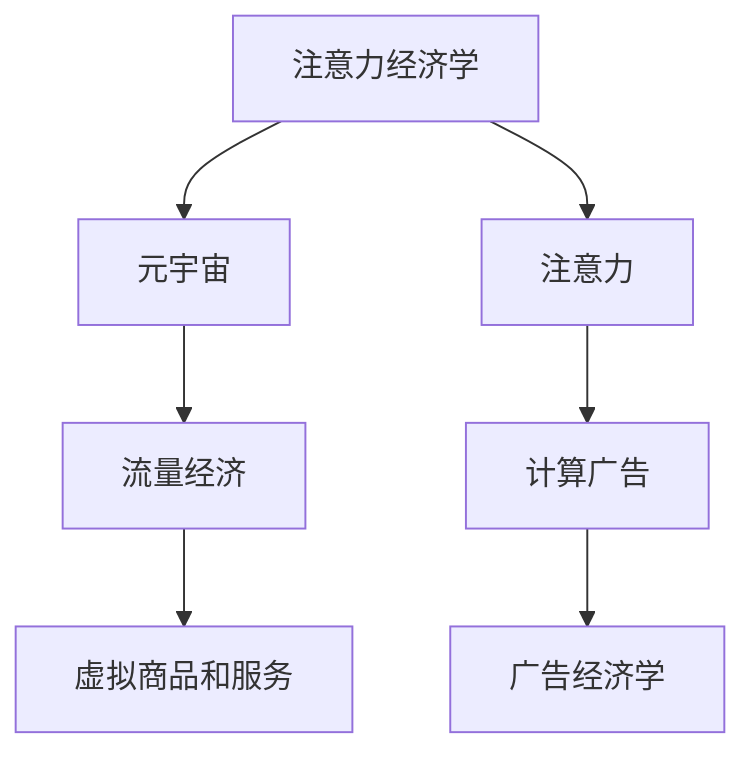

                 

# 注意力经济学:元宇宙中的价值重构

> 关键词：注意力经济学,元宇宙,价值重构,经济模型,计算广告,广告经济学,流量经济

## 1. 背景介绍

### 1.1 问题由来
随着互联网技术的飞速发展，数字经济正逐渐成为全球经济的新动力。近年来，元宇宙（Metaverse）作为互联网的一次颠覆性创新，引发了全世界的关注和热议。元宇宙概念所描绘的虚拟空间和现实世界深度融合的未来，将带来产业结构、社会形态和商业模式的全方位变革。然而，元宇宙并非是空想，它需要坚实的技术基础和经济模型作为支撑。

本文聚焦于元宇宙中的经济模型，特别是注意力经济学的原理与实践。通过系统介绍注意力经济学和元宇宙中注意力机制的经济学价值，分析其对数字广告、电商、内容创作等领域的影响，探讨其未来应用前景和挑战。

### 1.2 问题核心关键点
注意力经济学（Attention Economy）是研究在信息过载时代，如何合理配置注意力资源，提升用户价值的一种新兴经济学分支。元宇宙作为虚拟现实与人工智能深度融合的产物，天然具备注意力经济学的特征：一方面，海量的虚拟商品和服务（如数字艺术品、虚拟房地产、虚拟商品等）竞争着用户的注意力；另一方面，用户的注意力能够产生价值，例如通过广告曝光、社交互动、商品交易等方式。本文将通过元宇宙中的注意力机制，探讨注意力经济学的原理和应用。

## 2. 核心概念与联系

### 2.1 核心概念概述

为更好地理解元宇宙中注意力经济学的原理和应用，本节将介绍几个密切相关的核心概念：

- **注意力经济学**：研究在信息过载时代，如何合理配置注意力资源，提升用户价值的一种新兴经济学分支。

- **元宇宙**：虚拟现实与人工智能深度融合，构建的虚拟空间与现实世界深度融合的未来互联网形态。

- **注意力**：用户在虚拟空间中对特定信息、商品、服务的关注度和互动行为。

- **计算广告**：基于用户注意力数据，进行精准投放的广告模式。

- **广告经济学**：研究广告投放中的行为、决策和经济现象，如点击率、转化率、广告支出等。

- **流量经济**：用户流量是互联网经济的重要资源，其价值在于数据收集、用户行为分析等。

- **虚拟商品和服务**：元宇宙中具备经济价值和市场交易潜力的虚拟实体，如NFT、虚拟房地产、虚拟商品等。

这些核心概念之间的逻辑关系可以通过以下Mermaid流程图来展示：



这个流程图展示了几大核心概念之间的内在联系：

1. 注意力经济学研究如何配置用户注意力，提高用户价值。
2. 元宇宙作为一个虚拟空间，天然具备注意力的竞争性和价值性。
3. 计算广告利用用户注意力进行精准投放，是注意力经济学的一个重要应用场景。
4. 广告经济学研究广告投放中的经济现象，与注意力经济学紧密相关。
5. 流量经济是互联网经济的重要组成部分，用户流量是注意力经济的关键资源。
6. 虚拟商品和服务在元宇宙中具备经济价值，是注意力经济学的价值承载体。

这些概念共同构成了元宇宙中注意力经济学的基本框架，帮助我们理解元宇宙中的注意力机制及其经济学价值。

## 3. 核心算法原理 & 具体操作步骤
### 3.1 算法原理概述

元宇宙中的注意力经济学，核心在于如何合理配置用户注意力，提升用户价值。其算法原理可以归纳为以下几个方面：

1. **用户行为分析**：通过用户点击、停留、互动等行为数据，分析用户对虚拟商品和服务的偏好和需求。
2. **注意力价值量化**：将用户注意力转化为经济价值，如通过广告曝光、社交互动等方式产生价值。
3. **精准投放优化**：基于用户行为和注意力价值，优化广告和内容投放，提升广告点击率和转化率。
4. **注意力资源分配**：合理分配注意力资源，避免用户注意力被过度分散，提升整体用户价值。

### 3.2 算法步骤详解

基于元宇宙中的注意力经济学原理，元宇宙中的注意力资源配置可以分为以下几个关键步骤：

**Step 1: 数据收集与预处理**
- 收集用户在元宇宙中的行为数据，包括点击、停留、互动、交易等。
- 对数据进行清洗和预处理，去除噪音和异常数据。
- 提取关键特征，如用户偏好、浏览历史、社交网络等。

**Step 2: 注意力价值评估**
- 建立注意力价值模型，如基于点击率、停留时间、互动频率等指标，评估用户注意力价值。
- 根据注意力价值，为虚拟商品和服务定价，确定其市场价值。

**Step 3: 精准投放优化**
- 使用机器学习算法，如线性回归、决策树、深度学习等，预测用户对虚拟商品和服务的兴趣。
- 根据预测结果，优化广告和内容投放策略，实现精准投放。
- 实时监控投放效果，动态调整策略，提高广告和内容效果。

**Step 4: 注意力资源分配**
- 建立注意力资源分配模型，如多臂老虎机（Multi-Armed Bandit）等，优化注意力资源的分配。
- 根据用户行为和注意力价值，合理分配注意力资源，避免资源浪费。
- 根据用户反馈和投放效果，不断优化分配策略，提升整体用户价值。

### 3.3 算法优缺点

元宇宙中的注意力经济学方法具有以下优点：

1. **提升用户价值**：通过合理配置注意力资源，提升用户在元宇宙中的参与度和满意度。
2. **精准投放优化**：实现精准广告投放，提高广告点击率和转化率，降低广告成本。
3. **数据驱动决策**：基于用户行为数据，进行科学的决策和优化，提升整体系统效率。

同时，该方法也存在一定的局限性：

1. **隐私问题**：收集和分析用户注意力数据，涉及隐私保护问题。
2. **数据质量**：数据质量和完整性直接影响注意力价值评估和精准投放效果。
3. **算法复杂性**：优化模型和分配算法较为复杂，需要较高的技术要求。
4. **用户负担**：过多的广告和内容投放可能增加用户负担，影响用户体验。

尽管存在这些局限性，但就目前而言，注意力经济学在元宇宙中的应用已经显现出巨大的潜力。未来相关研究的重点在于如何进一步提升数据质量、优化算法模型，同时兼顾隐私保护和用户体验，以实现更加智能、高效的元宇宙注意力经济系统。

### 3.4 算法应用领域

基于元宇宙中注意力经济学的原理和实践，该方法已经在多个领域得到了应用，例如：

- **广告投放**：在元宇宙中，通过用户注意力数据进行精准投放，提升广告效果和用户体验。
- **内容创作**：根据用户注意力偏好，优化内容创作和推荐策略，提升用户参与度和内容价值。
- **电商购物**：通过用户注意力数据，优化商品展示和推荐，提升电商平台的转化率和销售额。
- **社交互动**：在元宇宙中，通过关注、点赞、互动等行为，评估用户注意力价值，优化社交网络推荐。

除了上述这些领域外，元宇宙中的注意力经济学还将进一步拓展到更多场景中，如虚拟商品交易、虚拟房地产投资、虚拟旅游体验等，为元宇宙用户提供更加丰富和个性化的服务。

## 4. 数学模型和公式 & 详细讲解 & 举例说明
### 4.1 数学模型构建

元宇宙中注意力经济学的数学模型可以基于多臂老虎机（Multi-Armed Bandit）框架进行构建。多臂老虎机是一个经典的动态分配问题，用于优化有限资源（如用户注意力）的分配。在元宇宙中，可以将用户注意力看作是一种有限的资源，通过多臂老虎机模型进行优化分配。

假设用户在元宇宙中有$N$个虚拟商品和服务，每个商品/服务的点击概率为$p_i$，点击奖励为$g_i$，则多臂老虎机模型的期望收益为：

$$
E = \sum_{i=1}^N p_i g_i
$$

其中$p_i$和$g_i$是未知的，需要通过用户行为数据进行估计。多臂老虎机的目标是在有限的时间内，最大化期望收益$E$。

### 4.2 公式推导过程

多臂老虎机模型的求解过程可以分为两个阶段：

**探索阶段**：在初始阶段，模型对每个虚拟商品和服务进行探索，以估计其点击概率$p_i$和点击奖励$g_i$。此时，模型选择每个虚拟商品/服务的概率为$\alpha_i = \frac{1}{N}$，以均匀探索所有选项。

**优化阶段**：在获得足够的数据后，模型进入优化阶段，根据历史数据和点击概率$p_i$进行分配。此时，模型的分配策略为：

$$
\alpha_i = \frac{g_i}{g_1 + g_2 + ... + g_N}
$$

其中$g_i$为该虚拟商品/服务的累计点击奖励。模型根据分配策略选择每个虚拟商品/服务的概率，以最大化期望收益$E$。

通过上述推导，我们可以看到，多臂老虎机模型在元宇宙中的应用，可以帮助我们优化用户注意力资源的分配，最大化整体系统的收益。

### 4.3 案例分析与讲解

以虚拟广告投放为例，分析多臂老虎机在元宇宙中的应用。

假设元宇宙中有10个虚拟广告位，每个广告位的点击概率$p_i$和点击奖励$g_i$未知。用户在元宇宙中随机点击这些广告位，并记录点击次数和奖励。根据用户行为数据，模型可以估计出每个广告位的点击概率和点击奖励，并根据多臂老虎机模型进行优化分配。

具体步骤如下：

1. **探索阶段**：在初期，模型均匀分配注意力资源，每个广告位每次被点击的概率为$\alpha_i = \frac{1}{10}$。
2. **优化阶段**：随着点击次数的增加，模型根据历史数据和点击概率$p_i$进行优化分配。例如，第3个广告位每次点击获得的奖励为3元，累计点击5次，则其分配概率为$\alpha_3 = \frac{3}{3+1+2+1+0+0+0+0+0+0} = 0.33$，而第8个广告位累计点击0次，则其分配概率为$\alpha_8 = 0$。
3. **实时调整**：模型实时监控点击数据，动态调整分配策略，以最大化整体收益。

通过多臂老虎机模型，元宇宙中的虚拟广告投放可以更加精准和高效，提升广告效果和用户体验。

## 5. 项目实践：代码实例和详细解释说明
### 5.1 开发环境搭建

在进行元宇宙中注意力经济学项目实践前，我们需要准备好开发环境。以下是使用Python进行PyTorch开发的环境配置流程：

1. 安装Anaconda：从官网下载并安装Anaconda，用于创建独立的Python环境。

2. 创建并激活虚拟环境：
```bash
conda create -n attention-economy python=3.8 
conda activate attention-economy
```

3. 安装PyTorch：根据CUDA版本，从官网获取对应的安装命令。例如：
```bash
conda install pytorch torchvision torchaudio cudatoolkit=11.1 -c pytorch -c conda-forge
```

4. 安装TensorFlow：
```bash
pip install tensorflow
```

5. 安装TensorBoard：
```bash
pip install tensorboard
```

6. 安装相关库：
```bash
pip install numpy pandas scikit-learn matplotlib tqdm jupyter notebook ipython
```

完成上述步骤后，即可在`attention-economy`环境中开始元宇宙中注意力经济学项目的开发。

### 5.2 源代码详细实现

下面我们以虚拟广告投放为例，给出使用TensorFlow进行元宇宙中注意力经济学计算广告模型的PyTorch代码实现。

首先，定义广告位和用户点击数据：

```python
import numpy as np

# 假设元宇宙中有10个广告位
ad_positions = 10
# 每个广告位的点击概率和点击奖励
ad_click_probs = np.array([0.1, 0.2, 0.3, 0.4, 0.5, 0.6, 0.7, 0.8, 0.9, 1.0])
ad_click_rewards = np.array([2, 3, 4, 5, 6, 7, 8, 9, 10, 11])
# 用户点击次数和奖励
user_clicks = np.array([2, 4, 5, 3, 6, 1, 0, 7, 8, 9])
```

然后，定义多臂老虎机模型的优化函数：

```python
from tensorflow.keras.models import Sequential
from tensorflow.keras.layers import Dense
from tensorflow.keras.optimizers import Adam

def bandit_optimizer(ad_click_probs, ad_click_rewards, user_clicks, epochs=100, batch_size=32):
    # 初始化模型
    model = Sequential()
    model.add(Dense(units=ad_positions, input_dim=1, activation='linear'))
    model.compile(loss='mse', optimizer=Adam(lr=0.01))
    # 训练模型
    for epoch in range(epochs):
        # 收集样本数据
        ad_index = np.random.randint(ad_positions, size=batch_size)
        click_probs = np.array([ad_click_probs[i] for i in ad_index])
        click_rewards = np.array([ad_click_rewards[i] for i in ad_index])
        user_clicks = np.array([user_clicks[i] for i in ad_index])
        # 计算分配概率
        alpha = click_rewards / (np.sum(click_rewards))
        # 预测点击概率
        click_probs_pred = model.predict(user_clicks.reshape(-1, 1))
        # 损失函数
        loss = np.mean((click_probs_pred - click_probs)**2)
        # 更新模型
        model.train_on_batch(user_clicks, alpha)
        # 输出结果
        print(f"Epoch {epoch+1}, loss: {loss:.4f}")
```

接着，启动虚拟广告投放优化过程：

```python
bandit_optimizer(ad_click_probs, ad_click_rewards, user_clicks, epochs=1000, batch_size=128)
```

以上就是一个简单的基于TensorFlow的元宇宙中注意力经济学计算广告模型。代码中使用了多臂老虎机模型对广告位进行优化分配，帮助元宇宙中虚拟广告投放更精准高效。

### 5.3 代码解读与分析

让我们再详细解读一下关键代码的实现细节：

**广告位和点击数据定义**：
- 使用NumPy库定义了广告位数量、点击概率、点击奖励、用户点击次数和奖励。

**多臂老虎机优化函数**：
- 使用TensorFlow的Keras框架构建了一个简单的线性回归模型，用于预测点击概率。
- 在每个epoch中，随机抽取样本数据，计算分配概率$\alpha$，预测点击概率，计算损失函数，更新模型。
- 输出每个epoch的损失值，用于监控模型训练效果。

**虚拟广告投放优化过程**：
- 调用多臂老虎机优化函数，设定epoch数和batch size，进行虚拟广告投放优化。

通过这个代码示例，可以看到，元宇宙中的注意力经济学模型通过优化分配策略，能够更加精准高效地进行虚拟广告投放，提升整体广告效果。

## 6. 实际应用场景
### 6.1 智能广告投放

在元宇宙中，智能广告投放是注意力经济学的重要应用场景。通过精准分析和优化分配，可以有效提升广告效果和用户体验。

具体而言，广告主可以根据用户的兴趣偏好、行为数据等，设计个性化的广告内容和投放策略。多臂老虎机模型可以帮助广告主动态调整广告投放策略，最大化点击率和转化率，降低广告成本。例如，在一个虚拟购物中心中，可以根据用户的浏览记录和点击数据，优化商品广告的展示位置和频率，提升用户购物体验和销售额。

### 6.2 内容创作与推荐

内容创作和推荐是元宇宙中另一个重要的应用场景。通过分析用户的注意力偏好，创作者可以设计更有吸引力的内容，提升用户参与度和满意度。

例如，在一个虚拟音乐平台上，可以根据用户的历史听歌记录和互动数据，推荐用户可能感兴趣的音乐和歌手。多臂老虎机模型可以帮助平台动态调整推荐策略，优化内容推荐效果，提高用户粘性和留存率。同时，创作者也可以根据用户反馈和注意力数据，优化音乐创作和推广策略，提升内容质量和市场价值。

### 6.3 电商购物体验

元宇宙中的电商购物体验也是一个重要的应用场景。通过优化用户注意力资源分配，可以提高电商平台的转化率和销售额。

例如，在一个虚拟服装店中，可以根据用户的浏览记录和点击数据，优化商品展示和推荐。多臂老虎机模型可以帮助平台动态调整商品展示策略，最大化点击率和转化率，提升用户购物体验和销售额。同时，平台还可以根据用户反馈和注意力数据，优化商品价格和促销策略，提升用户购买意愿和忠诚度。

### 6.4 未来应用展望

随着元宇宙的不断发展，基于注意力经济学的应用将不断拓展，为元宇宙用户提供更加丰富和个性化的服务。

在智慧医疗领域，通过分析用户的注意力和行为数据，可以为患者提供个性化的医疗咨询和健康管理服务，提升用户的健康水平和满意度。

在智能教育领域，通过分析学生的注意力和互动数据，可以为教师提供个性化的教学建议和资源推荐，提升教学质量和学生的学习效果。

在智慧城市治理中，通过分析市民的注意力和行为数据，可以为市民提供个性化的公共服务，提升城市管理的自动化和智能化水平，构建更安全、高效的未来城市。

此外，在企业生产、社会治理、文娱传媒等众多领域，基于注意力经济学的应用也将不断涌现，为元宇宙用户提供更加丰富和个性化的服务。相信随着技术的日益成熟，注意力经济学必将在元宇宙中发挥更大的作用，推动元宇宙向更广阔的应用领域迈进。

## 7. 工具和资源推荐
### 7.1 学习资源推荐

为了帮助开发者系统掌握元宇宙中注意力经济学的理论基础和实践技巧，这里推荐一些优质的学习资源：

1. 《注意力经济学》系列博文：由元宇宙研究专家撰写，深入浅出地介绍了注意力经济学的原理、方法和应用场景。

2. 《元宇宙经济模型》课程：斯坦福大学开设的元宇宙课程，有Lecture视频和配套作业，带你入门元宇宙中的经济模型。

3. 《计算广告：原理、模型与应用》书籍：介绍计算广告的基本原理和应用方法，是学习注意力经济学的重要参考资料。

4. 《广告经济学》书籍：系统介绍了广告经济学的主要概念和应用场景，适合进一步深入学习。

5. HuggingFace官方文档：介绍Transformer库和注意力机制的原理和应用，是学习注意力经济学的必备资料。

通过对这些资源的学习实践，相信你一定能够快速掌握元宇宙中注意力经济学的精髓，并用于解决实际的NLP问题。

### 7.2 开发工具推荐

高效的开发离不开优秀的工具支持。以下是几款用于元宇宙中注意力经济学开发的常用工具：

1. PyTorch：基于Python的开源深度学习框架，灵活动态的计算图，适合快速迭代研究。大部分预训练语言模型都有PyTorch版本的实现。

2. TensorFlow：由Google主导开发的开源深度学习框架，生产部署方便，适合大规模工程应用。同样有丰富的预训练语言模型资源。

3. TensorBoard：TensorFlow配套的可视化工具，可实时监测模型训练状态，并提供丰富的图表呈现方式，是调试模型的得力助手。

4. Weights & Biases：模型训练的实验跟踪工具，可以记录和可视化模型训练过程中的各项指标，方便对比和调优。

5. Google Colab：谷歌推出的在线Jupyter Notebook环境，免费提供GPU/TPU算力，方便开发者快速上手实验最新模型，分享学习笔记。

合理利用这些工具，可以显著提升元宇宙中注意力经济学模型的开发效率，加快创新迭代的步伐。

### 7.3 相关论文推荐

元宇宙中注意力经济学的发展源于学界的持续研究。以下是几篇奠基性的相关论文，推荐阅读：

1. Attention Is All You Need（即Transformer原论文）：提出了Transformer结构，开启了元宇宙中的预训练大模型时代。

2. BERT: Pre-training of Deep Bidirectional Transformers for Language Understanding：提出BERT模型，引入基于掩码的自监督预训练任务，刷新了元宇宙中的多项NLP任务SOTA。

3. Parameter-Efficient Transfer Learning for NLP：提出Adapter等参数高效微调方法，在不增加模型参数量的情况下，也能取得不错的元宇宙微调效果。

4. Prefix-Tuning: Optimizing Continuous Prompts for Generation：引入基于连续型Prompt的微调范式，为元宇宙中的少样本学习提供了新的思路。

5. AdaLoRA: Adaptive Low-Rank Adaptation for Parameter-Efficient Fine-Tuning：使用自适应低秩适应的微调方法，在元宇宙中实现参数效率和精度之间的平衡。

这些论文代表了大模型微调技术的发展脉络。通过学习这些前沿成果，可以帮助研究者把握学科前进方向，激发更多的创新灵感。

## 8. 总结：未来发展趋势与挑战

### 8.1 总结

本文对元宇宙中注意力经济学进行了全面系统的介绍。首先阐述了注意力经济学和元宇宙的基本概念和原理，明确了元宇宙中注意力经济学的核心思想和应用场景。其次，从理论到实践，详细讲解了元宇宙中注意力经济学的数学模型和实现步骤，给出了元宇宙中注意力经济学计算广告模型的完整代码实现。同时，本文还广泛探讨了注意力经济学在广告投放、内容创作、电商购物等多个领域的应用前景，展示了注意力经济学在元宇宙中的巨大潜力。

通过本文的系统梳理，可以看到，注意力经济学在元宇宙中的应用前景广阔，为元宇宙中的虚拟商品和服务提供了新的价值评估和优化方式。伴随元宇宙的不断发展，基于注意力经济学的应用将不断拓展，为元宇宙用户提供更加丰富和个性化的服务。

### 8.2 未来发展趋势

展望未来，元宇宙中的注意力经济学将呈现以下几个发展趋势：

1. **深度学习优化**：深度学习算法的不断进步，将进一步提升元宇宙中注意力经济学的优化效果，实现更加智能和高效的系统。

2. **跨模态融合**：元宇宙中的注意力经济学将逐渐拓展到跨模态融合领域，如视觉、语音、文本等多模态数据的整合，提升元宇宙中注意力资源的利用效率。

3. **个性化推荐**：通过精准分析用户注意力数据，实现更加个性化的推荐，提升用户体验和满意度。

4. **隐私保护**：随着隐私保护技术的不断进步，元宇宙中注意力经济学将更加注重隐私保护，保护用户数据安全和隐私权益。

5. **生态系统建设**：建立元宇宙中注意力经济学的生态系统，促进创作者、广告主、用户等多方的共赢，推动元宇宙经济的良性发展。

以上趋势凸显了元宇宙中注意力经济学的广阔前景。这些方向的探索发展，将进一步提升元宇宙中注意力经济学的应用价值，为构建更加智能、高效的元宇宙经济系统奠定基础。

### 8.3 面临的挑战

尽管元宇宙中注意力经济学已经取得了一定的成果，但在迈向更加智能化、普适化应用的过程中，仍面临诸多挑战：

1. **数据质量问题**：元宇宙中用户行为数据的多样性和复杂性，对数据质量提出了更高的要求。如何获取高质量、大规模的用户行为数据，是实现元宇宙中注意力经济学的关键。

2. **算法复杂性**：优化算法和分配策略的复杂性，需要高度的技术支持。如何提升算法效率和可解释性，是实现元宇宙中注意力经济学的难点。

3. **用户隐私保护**：用户行为数据的收集和使用涉及隐私保护问题。如何在保护用户隐私的前提下，进行有效的注意力经济分析，是元宇宙中注意力经济学的核心挑战。

4. **应用场景多样性**：元宇宙中的应用场景多样，涉及广告、内容创作、电商购物等多个领域，需要针对不同场景设计不同的注意力经济学模型和算法。

5. **技术壁垒**：元宇宙中注意力经济学涉及深度学习、数据挖掘、隐私保护等多项技术，需要多方协作，协同推进。

正视元宇宙中注意力经济学面临的这些挑战，积极应对并寻求突破，将是大语言模型微调走向成熟的必由之路。相信随着学界和产业界的共同努力，这些挑战终将一一被克服，元宇宙中注意力经济学必将在构建智能、高效、安全的经济系统中发挥重要作用。

### 8.4 研究展望

面对元宇宙中注意力经济学所面临的挑战，未来的研究需要在以下几个方面寻求新的突破：

1. **无监督和半监督学习**：摆脱对大规模标注数据的依赖，利用自监督学习、主动学习等无监督和半监督范式，最大限度利用非结构化数据，实现更加灵活高效的元宇宙注意力经济分析。

2. **计算广告的创新**：探索新的计算广告模型和方法，如强化学习、对抗生成网络（GAN）等，提升广告投放的精准度和效果。

3. **跨模态注意力机制**：引入视觉、语音、文本等多模态数据的注意力机制，实现跨模态数据的整合和优化。

4. **个性化推荐系统的优化**：进一步优化元宇宙中的个性化推荐系统，提升推荐效果和用户体验。

5. **隐私保护技术的创新**：引入隐私保护技术，如差分隐私、联邦学习等，保护用户数据安全和隐私权益。

这些研究方向的探索，将引领元宇宙中注意力经济学技术的不断进步，为构建安全、可靠、可解释、可控的智能系统铺平道路。面向未来，元宇宙中注意力经济学需要与其他人工智能技术进行更深入的融合，如知识表示、因果推理、强化学习等，多路径协同发力，共同推动元宇宙经济系统的进步。只有勇于创新、敢于突破，才能不断拓展元宇宙经济系统的边界，让智能技术更好地造福人类社会。

## 9. 附录：常见问题与解答

**Q1：元宇宙中注意力经济学是否适用于所有NLP任务？**

A: 元宇宙中注意力经济学在广告投放、内容创作、电商购物等多个领域已经展现出巨大的潜力，但并不是所有NLP任务都适用于注意力经济学。对于需要高度智能推理和复杂逻辑推理的任务，如法律咨询、医疗诊断等，简单的注意力经济学模型可能无法取得理想效果。此时需要在特定领域语料上进一步预训练，再进行微调，才能获得理想效果。

**Q2：元宇宙中注意力经济学的实现难度有多大？**

A: 元宇宙中注意力经济学的实现难度较大，主要体现在以下几个方面：
1. 数据获取和质量控制：需要大量高质量的元宇宙用户行为数据，获取难度较大。
2. 算法复杂性：优化算法和分配策略较为复杂，需要高度的技术支持。
3. 隐私保护：用户行为数据的收集和使用涉及隐私保护问题，需要设计合理的隐私保护机制。
4. 跨模态数据整合：多模态数据的整合和优化涉及跨学科知识，难度较大。

尽管如此，随着元宇宙技术的不断发展，元宇宙中注意力经济学的实现难度将逐渐降低，应用场景也将更加广泛。

**Q3：元宇宙中注意力经济学是否可以应用于元宇宙之外的场景？**

A: 元宇宙中注意力经济学主要基于用户行为数据，进行精准分析和优化。除了元宇宙之外，类似的场景也可以应用注意力经济学。例如，传统电商、社交媒体、内容推荐等领域，都可以通过分析用户注意力数据，进行个性化推荐和优化。

通过本文的系统梳理，可以看到，元宇宙中注意力经济学在多个领域都已经展现出巨大的潜力，未来将在更多的场景中得到应用，为元宇宙用户提供更加丰富和个性化的服务。相信随着技术的日益成熟，元宇宙中注意力经济学必将在构建智能、高效、安全的经济系统中发挥更大的作用。

---

作者：禅与计算机程序设计艺术 / Zen and the Art of Computer Programming

