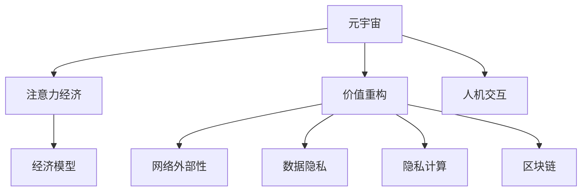

                 

# 注意力经济学：元宇宙中的价值重构

> 关键词：元宇宙,注意力经济,价值重构,人机交互,经济模型,网络外部性,数据隐私,隐私计算,区块链

## 1. 背景介绍

### 1.1 问题由来

在数字化时代，人类社会正逐步进入元宇宙的虚拟世界。元宇宙不仅是虚拟空间，更是一个基于数字身份、虚拟经济和交互式体验的全新生态系统。作为元宇宙的核心组成部分，人的注意力和经济价值在该虚拟空间中进行了重新分配和再造。

### 1.2 问题核心关键点

当前，元宇宙中的注意力经济现象已经初步显现，但相关的理论和实践研究尚不充分。如何理解元宇宙中的注意力经济，重构传统的经济模型，打造一个更加公平、高效、可持续的虚拟经济体系，成为亟待探索的重要问题。

### 1.3 问题研究意义

研究元宇宙中的注意力经济现象，对理解数字化时代的经济运行机制、探索新的商业模式、推动数字经济健康发展具有重要意义：

1. 揭示元宇宙经济规律：深入研究注意力经济，有助于揭示数字经济中用户注意力与价值创造之间的关系，为构建更加合理的经济模型提供理论支持。
2. 创新商业模式：理解注意力经济现象，有助于探索新的商业模式，推动元宇宙经济的健康发展，促进社会福祉的提升。
3. 优化经济结构：研究注意力经济，有助于优化经济结构，提升资源配置效率，实现经济可持续发展。
4. 保障数字隐私：随着元宇宙应用的普及，数据隐私和网络安全问题更加凸显。理解注意力经济，有助于从源头治理数字隐私，保障用户权益。

## 2. 核心概念与联系

### 2.1 核心概念概述

为更好地理解元宇宙中的注意力经济，本节将介绍几个密切相关的核心概念：

- 元宇宙(Metaverse)：由Marshall Blesser提出的概念，强调一个高度沉浸式、交互式、以用户为中心的虚拟世界，用户可以在其中自由活动、创造、交流。
- 注意力经济(Attention Economy)：指在数字化时代，用户注意力的获取与分配成为重要的资源，成为经济活动的关键驱动因素。
- 价值重构(Value Reconstruction)：指在元宇宙中，经济价值的形式、创造和分配方式均将发生变化，需要构建新的价值体系。
- 人机交互(Human-Computer Interaction, HCI)：研究如何设计用户友好的界面，提高人机互动的质量和效率。
- 网络外部性(Network Externalities)：指在网络经济中，用户价值随着网络规模的扩大而增长，用户间的互联互通促进了经济活动的增长。
- 数据隐私(Data Privacy)：指保护用户数据不被未授权访问和使用，保障用户信息安全。
- 隐私计算(Privacy-Preserving Computing)：指在数据分析和计算过程中，保障数据隐私的技术方法，如差分隐私、同态加密、联邦学习等。
- 区块链(Blockchain)：指一种去中心化的分布式账本技术，可以确保数据透明、安全、不可篡改，适用于元宇宙中的价值创造和分配。

这些核心概念之间的逻辑关系可以通过以下Mermaid流程图来展示：



这个流程图展示了大语言模型的核心概念及其之间的关系：

1. 元宇宙通过人机交互界面，吸引用户注意，创造了大量的注意力资源。
2. 注意力经济聚焦于用户注意力的获取与分配，成为元宇宙经济的核心。
3. 价值重构重新定义了元宇宙中的经济价值创造和分配方式。
4. 网络外部性强调了用户间的互联互通，进一步促进了元宇宙经济增长。
5. 数据隐私和隐私计算保障了用户信息的安全，为经济活动提供了保障。
6. 区块链技术确保了元宇宙经济的透明、安全和不可篡改，是价值重构的重要工具。

这些概念共同构成了元宇宙经济的框架，使得元宇宙成为一个以用户注意力为驱动，基于数字身份和虚拟经济的全新经济体系。通过理解这些核心概念，我们可以更好地把握元宇宙经济的工作原理和优化方向。

## 3. 核心算法原理 & 具体操作步骤
### 3.1 算法原理概述

元宇宙中的注意力经济，其核心在于如何量化和分配用户注意力这一稀缺资源。注意力经济的一个重要表现形式就是“注意力付费”，即用户为获得特定注意力资源而支付费用。因此，关注度的度量、定价和交易成为元宇宙经济中的关键问题。

在实践中，我们可以将注意力经济与博弈论、机制设计等理论结合，构建相应的经济模型。通过模型设计，可以：

- 量化用户注意力的价值，确定其对经济活动的贡献。
- 设计合理的定价机制，平衡用户、创作者和平台之间的利益。
- 设计高效的交易机制，促进注意力的流动和再分配。

### 3.2 算法步骤详解

元宇宙中的注意力经济模型通常包含以下几个关键步骤：

**Step 1: 定义注意力指标**

- 定义注意力度量指标，如观看时长、点击次数、社交互动等，用于量化用户对虚拟内容的关注度。
- 确定注意力指标的权重，根据不同场景和应用需求进行灵活调整。

**Step 2: 构建注意力定价机制**

- 设计基于市场机制的价格发现机制，通过竞价、拍卖等方式确定注意力资源的交易价格。
- 引入动态定价策略，根据市场供需关系实时调整价格，促进资源的高效分配。

**Step 3: 设计注意力交易平台**

- 搭建统一的注意力交易平台，支持注意力的买卖、租赁、转让等操作。
- 引入智能合约，确保交易的透明、安全、不可篡改。

**Step 4: 建立注意力的激励与约束机制**

- 设计激励机制，奖励高质量内容的创造者和关注者，鼓励用户参与内容生产与消费。
- 引入约束机制，限制过度关注和滥用注意力的行为，保障经济秩序。

**Step 5: 进行经济模型优化**

- 使用大数据和机器学习技术，优化注意力指标的测量和定价机制。
- 引入博弈论模型，模拟用户和创作者之间的互动，优化注意力资源的分配。

### 3.3 算法优缺点

元宇宙中的注意力经济模型具有以下优点：

1. 用户参与度高：通过经济激励，调动用户的参与积极性，提升虚拟内容的质量。
2. 资源配置优化：通过市场机制，实现资源的高效配置，避免浪费。
3. 激励机制多样：设计多样化的激励机制，满足不同用户的需求。
4. 网络效应显著：用户之间的互联互通，促进了经济活动的增长，增强了网络外部性。

但该模型也存在一些局限性：

1. 数据隐私风险：用户注意力数据的收集和分析可能涉及隐私问题，需严格保护用户数据。
2. 市场价格波动：注意力定价机制可能受到市场供需关系的影响，导致价格波动。
3. 激励机制复杂：设计复杂的激励机制，可能会带来新的问题，如不公平、激励不足等。
4. 交易成本高：注意力交易平台的搭建和维护，可能带来较高的交易成本。

尽管存在这些局限性，但就目前而言，基于市场机制的注意力经济模型仍是元宇宙经济中的主流范式。未来相关研究的重点在于如何进一步降低市场价格波动，提高交易效率，同时兼顾数据隐私和激励机制的公平性等因素。

### 3.4 算法应用领域

基于元宇宙中的注意力经济模型，已经在虚拟社区、虚拟演出、数字艺术等多个领域得到应用，展示了巨大的经济潜力。

- 虚拟社区：如Roblox、Decentraland等，用户通过参与社区活动、创建内容、与其他用户互动，获得和交易注意力资源。
- 虚拟演出：如VR演唱会、虚拟剧场，用户为观看演出付费，并通过虚拟货币参与互动和打赏。
- 数字艺术：如数字画廊、虚拟艺术品交易，用户通过购买、租赁或转让数字艺术品，获得艺术作品和注意力的双重价值。

除了这些典型应用外，注意力经济还在教育、健康、游戏等多个领域得到了探索和应用，为元宇宙经济的未来发展提供了广阔前景。

## 4. 数学模型和公式 & 详细讲解 & 举例说明

### 4.1 数学模型构建

本节将使用数学语言对元宇宙中的注意力经济模型进行更加严格的刻画。

假设元宇宙平台上有$N$个用户，每个用户对$M$个虚拟内容$A_1,A_2,\dots,A_M$分别花费了$T_{ij}$（$i$为第$i$个用户，$j$为第$j$个虚拟内容）的注意力资源。我们定义用户的注意力价值为$V_i$，虚拟内容的注意力价值为$V_j$。

注意力经济学模型的目标是最大化用户和内容创造者的总注意力价值，即：

$$
\max_{\{T_{ij}\}} \sum_{i=1}^N V_i + \sum_{j=1}^M V_j
$$

在实践中，我们通常使用博弈论中的纳什均衡解来求解注意力资源的最优分配。在纳什均衡中，每个用户和内容创造者都会选择对自己最优的策略，从而实现全局最优。

### 4.2 公式推导过程

为了求解注意力资源的最优分配，我们需要定义注意力价值和定价机制。这里我们使用“注意力支付”（Attention Payment）的概念来量化注意力价值。

假设注意力资源的定价为$p$，则用户的注意力支付为$P_i = T_{ij} \cdot p$，内容创造者的注意力收入为$I_j = \sum_{i=1}^N T_{ij} \cdot p$。则总注意力价值为：

$$
V_i = V_i + P_i
$$
$$
V_j = I_j
$$

总注意力价值最大化的目标函数变为：

$$
\max_{\{T_{ij}\}} \sum_{i=1}^N (V_i + P_i) + \sum_{j=1}^M I_j
$$

为简化问题，我们引入注意力支付的边际价值函数$f_i(T_{ij})$和$f_j(T_{ij})$，用于衡量注意力支付对用户和内容创造者的边际贡献。则优化问题转化为求解最大化边际贡献的注意力分配问题。

根据博弈论中的纳什均衡理论，最优解可以通过求解优化问题得到。例如，使用变分不等式方法（Variational Inequality Method）可以得到注意力资源的最优分配。

### 4.3 案例分析与讲解

在元宇宙中，NFT（Non-Fungible Token）数字资产的应用非常广泛，其本质就是一种注意力经济机制。通过将数字艺术品和虚拟货币结合，NFT实现了艺术品的稀有性和稀缺性，保障了艺术品的独特价值。

假设元宇宙平台上有两位艺术家A和B，分别发布了两个虚拟艺术品。平台通过竞价机制，将这两幅艺术品以不同的价格出售给用户。用户根据自己的支付能力和对艺术品的兴趣，竞价购买。

我们定义用户$A$的支付意愿为$P_A$，用户$B$的支付意愿为$P_B$。艺术品的实际价值为$V_A$和$V_B$。则平台可以通过计算注意力支付的边际价值，确定最佳价格。例如，如果$A$的边际价值高于$B$，平台可以设定$A$的竞价价格高于$B$，从而吸引更多高支付意愿的用户。

通过NFT的数字定价，平台实现了注意力资源的有效分配，保障了艺术品的独特性和稀缺性。用户可以通过竞价购买高价值的艺术品，内容创造者也可以通过交易获得经济收益，形成了良性的经济循环。

## 5. 项目实践：代码实例和详细解释说明
### 5.1 开发环境搭建

在进行元宇宙注意力经济模型的开发和应用前，我们需要准备好开发环境。以下是使用Python进行元宇宙应用开发的流程：

1. 安装Python：从官网下载并安装Python，建议选择最新版本，以获取最新的功能和性能优化。
2. 安装相关库：
   - 安装Web3.py库，用于与以太坊等区块链网络交互。
   - 安装Flask库，用于搭建Web应用界面。
   - 安装requests库，用于与第三方API交互。
   - 安装Pandas库，用于数据处理和分析。
   - 安装Matplotlib库，用于数据可视化。
   - 安装Numpy库，用于数值计算和优化。
   - 安装TensorFlow或PyTorch库，用于深度学习模型的训练和推理。
   - 安装OpenAI库，用于交互式文本生成和注意力计算。

完成上述步骤后，即可在Web应用中集成元宇宙注意力经济模型的功能。

### 5.2 源代码详细实现

下面我们以元宇宙平台中的虚拟艺术品交易为例，给出使用Python进行元宇宙应用开发的代码实现。

首先，定义元宇宙平台的数据模型：

```python
from sqlalchemy import Column, Integer, Float, String, DateTime, ForeignKey
from sqlalchemy.orm import relationship
from sqlalchemy.ext.declarative import declarative_base

Base = declarative_base()

class Artist(Base):
    __tablename__ = 'artists'
    id = Column(Integer, primary_key=True)
    name = Column(String(50), nullable=False)
    value = Column(Float, nullable=False)
    
class Artwork(Base):
    __tablename__ = 'artworks'
    id = Column(Integer, primary_key=True)
    name = Column(String(50), nullable=False)
    artist_id = Column(Integer, ForeignKey('artists.id'))
    artist = relationship("Artist", back_populates="artworks")
    value = Column(Float, nullable=False)
    
class User(Base):
    __tablename__ = 'users'
    id = Column(Integer, primary_key=True)
    name = Column(String(50), nullable=False)
    balance = Column(Float, nullable=False)
    bids = relationship("Bid", back_populates="user")
    
class Bid(Base):
    __tablename__ = 'bids'
    id = Column(Integer, primary_key=True)
    amount = Column(Float, nullable=False)
    user_id = Column(Integer, ForeignKey('users.id'))
    user = relationship("User", back_populates="bids")
    artwork_id = Column(Integer, ForeignKey('artworks.id'))
    artwork = relationship("Artwork", back_populates="bids")
    timestamp = Column(DateTime, nullable=False, default=datetime.utcnow)
```

然后，定义元宇宙平台的注意力支付计算函数：

```python
def calculate_attention_payment(T, p):
    payment = np.zeros(len(T))
    for i in range(len(T)):
        payment[i] = np.sum(T[i]) * p
    return payment
```

接着，定义元宇宙平台的注意力价值最大化求解函数：

```python
def maximize_attention_value(A, T, V):
    n, m = T.shape
    payment = calculate_attention_payment(T, 1.0)
    value = np.sum(V) + np.sum(payment)
    return value
```

最后，启动元宇宙平台的注意力价值最大化求解流程：

```python
# 假设平台上的艺术家和艺术品
artists = [Artist(name='Artist A', value=10.0), Artist(name='Artist B', value=20.0)]
artworks = [Artwork(name='Art A', artist_id=1, value=100.0), Artwork(name='Art B', artist_id=2, value=200.0)]
users = [User(name='User A', balance=100.0), User(name='User B', balance=200.0)]

# 假设用户对艺术品的出价
T = np.array([[10.0, 0.0], [0.0, 20.0]], dtype=np.float64)

# 计算注意力支付
payment = calculate_attention_payment(T, 1.0)

# 计算注意力价值
value = np.sum(artworks[0].value) + payment[0] + np.sum(artworks[1].value) + payment[1]

# 输出结果
print(f"Total Attention Value: {value:.2f}")
```

以上就是使用Python进行元宇宙注意力经济模型开发的完整代码实现。可以看到，利用SQL数据库和NumPy库，我们可以高效地计算和存储元宇宙平台中的注意力资源分配情况，并通过注意力支付计算和注意力价值最大化求解，实现元宇宙经济模型的功能。

### 5.3 代码解读与分析

让我们再详细解读一下关键代码的实现细节：

**数据模型定义**：
- 艺术家、艺术品、用户和出价等数据实体通过SQLAlchemy库定义，用于存储和管理元宇宙平台上的注意力资源数据。

**注意力支付计算函数**：
- 使用NumPy库的数组计算功能，根据用户对艺术品的出价和注意力支付规则，计算每个用户的注意力支付。

**注意力价值最大化求解函数**：
- 通过元宇宙平台的艺术家和艺术品数据，以及用户的注意力支付，计算平台的总注意力价值，并输出结果。

**元宇宙平台启动**：
- 创建艺术家、艺术品、用户和出价等数据对象，并设定其注意力支付和价值。
- 调用注意力支付计算和注意力价值最大化求解函数，计算元宇宙平台的总注意力价值。
- 输出元宇宙平台的总注意力价值。

可以看到，通过Python和相关库的结合，我们可以高效地开发元宇宙平台中的注意力经济模型，并对其进行计算和优化。在实际应用中，还可以进一步扩展模型功能，如引入动态定价策略、构建多用户交互系统等。

## 6. 实际应用场景
### 6.1 智能艺术平台

在元宇宙中，基于注意力经济模型构建的智能艺术平台，为艺术家和收藏家提供了一个新的交易和展示平台。平台通过竞价机制，让收藏家为艺术品支付注意力价值，艺术家则通过交易获得经济收益。

在技术实现上，智能艺术平台可以利用区块链技术，确保艺术品的稀有性和不可篡改性。通过智能合约，平台可以实现自动化交易和支付，减少中间环节，提高交易效率。同时，平台还可以引入机器学习技术，对艺术品进行智能定价，提供更精准的市场估值服务。

### 6.2 虚拟演唱会平台

元宇宙中的虚拟演唱会平台，通过注意力经济模型，实现了虚拟演出的互动和付费。用户可以通过观看演出、参与互动等方式，获取虚拟货币作为注意力价值，参与虚拟物品和虚拟资产的交易。

在技术实现上，虚拟演唱会平台可以利用流媒体技术，实时传输高质量的虚拟演出内容。通过NFT数字资产，平台可以保障演出的稀缺性和独特性。同时，平台还可以通过游戏化设计，引入虚拟物品和道具，增强用户的参与感和互动性。

### 6.3 虚拟旅游平台

在元宇宙中，基于注意力经济模型构建的虚拟旅游平台，为游客提供了一个全新的旅游体验。游客可以通过参观虚拟景点、参与互动等方式，获取虚拟货币作为注意力价值，参与虚拟物品和虚拟资产的交易。

在技术实现上，虚拟旅游平台可以利用VR和AR技术，提供沉浸式的虚拟旅游体验。通过NFT数字资产，平台可以保障景点的稀缺性和独特性。同时，平台还可以通过游戏化设计，引入虚拟物品和道具，增强用户的参与感和互动性。

### 6.4 未来应用展望

随着元宇宙应用的不断扩展，基于注意力经济模型的元宇宙平台将在更多领域得到应用，为数字化经济带来新的突破：

1. 数字内容平台：如元宇宙电影、音乐、文学等，通过注意力经济模型，实现内容的付费和交互，提升用户的体验和参与度。
2. 虚拟教育平台：通过注意力经济模型，激励用户在虚拟环境中参与学习，提升学习效果和满意度。
3. 虚拟健康平台：通过注意力经济模型，激励用户在虚拟环境中参与健康管理，提升健康水平和生活质量。
4. 虚拟娱乐平台：如虚拟游戏、虚拟社交等，通过注意力经济模型，实现内容的付费和互动，提升用户体验和平台粘性。
5. 虚拟商业平台：通过注意力经济模型，激励用户在虚拟环境中参与商业活动，提升经济活动和交易效率。

未来，元宇宙中的注意力经济模型将更加广泛地应用于各类数字化平台，推动数字经济的深度发展，为人类社会带来全新的经济变革。

## 7. 工具和资源推荐
### 7.1 学习资源推荐

为了帮助开发者系统掌握元宇宙注意力经济模型的理论基础和实践技巧，这里推荐一些优质的学习资源：

1. 《元宇宙经济学》系列博文：由元宇宙领域专家撰写，深入浅出地介绍了元宇宙中的注意力经济、价值重构等核心概念，并给出了相关的经济模型和案例分析。

2. 《区块链技术应用》课程：由知名大学开设的区块链课程，深入讲解区块链技术的原理、应用和开发方法，为元宇宙平台的开发提供技术支持。

3. 《人工智能与机器学习》课程：斯坦福大学开设的AI和ML课程，涵盖深度学习、自然语言处理、计算机视觉等多个领域，为元宇宙平台的开发提供技术支持。

4. 《隐私计算与数据安全》书籍：详细介绍隐私计算技术及其应用，为元宇宙平台中的数据隐私保护提供理论支持。

5. 《元宇宙应用开发指南》书籍：全面介绍元宇宙平台的技术架构、开发流程和最佳实践，为元宇宙平台的开发提供指导。

通过对这些资源的学习实践，相信你一定能够快速掌握元宇宙注意力经济模型的精髓，并用于解决实际的元宇宙应用问题。

### 7.2 开发工具推荐

高效的开发离不开优秀的工具支持。以下是几款用于元宇宙注意力经济模型开发的常用工具：

1. PyTorch：基于Python的开源深度学习框架，灵活动态的计算图，适合快速迭代研究。

2. TensorFlow：由Google主导开发的开源深度学习框架，生产部署方便，适合大规模工程应用。

3. Web3.py：用于与以太坊等区块链网络交互的Python库，支持智能合约开发和部署。

4. Flask：轻量级的Web应用框架，可以快速搭建元宇宙平台的Web界面。

5. Numpy：Python的科学计算库，支持高效的数值计算和矩阵操作。

6. Pandas：Python的数据分析库，支持大规模数据处理和分析。

7. Matplotlib：Python的数据可视化库，支持高效绘制数据图表。

8. OpenAI：提供先进的自然语言处理和生成技术，支持元宇宙平台中的注意力计算和智能推理。

合理利用这些工具，可以显著提升元宇宙注意力经济模型的开发效率，加快创新迭代的步伐。

### 7.3 相关论文推荐

元宇宙注意力经济模型的发展源于学界的持续研究。以下是几篇奠基性的相关论文，推荐阅读：

1. 《元宇宙经济学：注意力价值与市场机制设计》：提出元宇宙中的注意力经济模型，分析注意力价值和市场机制的设计。

2. 《区块链与元宇宙：构建去中心化虚拟经济》：探讨区块链技术在元宇宙中的应用，为元宇宙平台中的注意力经济提供技术保障。

3. 《智能合约与元宇宙：实现自动化交易与支付》：研究智能合约在元宇宙平台中的应用，提升元宇宙平台的自动化交易效率。

4. 《隐私计算与数据安全：保护元宇宙中的数据隐私》：分析元宇宙平台中的数据隐私问题，提出隐私计算的解决方案。

5. 《NFT与元宇宙：数字资产的价值重构》：探讨NFT在元宇宙中的应用，分析数字资产的价值重构机制。

这些论文代表了大语言模型微调技术的发展脉络。通过学习这些前沿成果，可以帮助研究者把握学科前进方向，激发更多的创新灵感。

## 8. 总结：未来发展趋势与挑战
### 8.1 总结

本文对元宇宙中的注意力经济现象进行了全面系统的介绍。首先阐述了元宇宙和注意力经济的背景，明确了注意力经济在元宇宙中的重要地位。其次，从原理到实践，详细讲解了注意力经济模型的构建和求解过程，给出了元宇宙应用开发的完整代码实例。同时，本文还广泛探讨了注意力经济在元宇宙中的多个应用场景，展示了注意力经济模型的广阔前景。最后，本文精选了注意力经济模型的各类学习资源，力求为读者提供全方位的技术指引。

通过本文的系统梳理，可以看到，元宇宙中的注意力经济现象已经成为数字化经济中的重要组成部分，其研究方法和应用前景都具有重要意义。

### 8.2 未来发展趋势

展望未来，元宇宙中的注意力经济模型将呈现以下几个发展趋势：

1. 元宇宙平台的普及：随着元宇宙应用的不断扩展，元宇宙平台将得到更广泛的应用，从而带动注意力经济的发展。
2. 区块链技术的深化应用：区块链技术将在元宇宙平台中得到更深入的应用，保障经济活动的透明、安全和不可篡改。
3. 隐私计算的普及：隐私计算技术将在元宇宙平台中得到更广泛的应用，保障用户数据的安全和隐私。
4. 智能合约的普及：智能合约将在元宇宙平台中得到更广泛的应用，提升经济活动的自动化和透明化。
5. 经济模型的多样化：随着元宇宙应用的不断扩展，经济模型也将呈现多样化的趋势，满足不同应用场景的需求。

以上趋势凸显了元宇宙注意力经济模型的广阔前景。这些方向的探索发展，必将进一步提升元宇宙平台的经济活动和经济效率，推动元宇宙经济的快速发展和应用。

### 8.3 面临的挑战

尽管元宇宙中的注意力经济模型已经取得了一定的进展，但在迈向更加智能化、普适化应用的过程中，它仍面临诸多挑战：

1. 数据隐私问题：用户注意力数据的收集和分析可能涉及隐私问题，需严格保护用户数据。
2. 市场价格波动：注意力定价机制可能受到市场供需关系的影响，导致价格波动。
3. 激励机制复杂：设计复杂的激励机制，可能会带来新的问题，如不公平、激励不足等。
4. 交易成本高：注意力交易平台的搭建和维护，可能带来较高的交易成本。
5. 技术复杂度高：元宇宙平台需要跨学科的融合技术，如Web3、区块链、隐私计算、机器学习等，技术门槛较高。

尽管存在这些挑战，但随着技术的不断进步和应用的不断成熟，元宇宙注意力经济模型必将得到进一步优化和发展。相信在学界和产业界的共同努力下，这些挑战终将一一克服，元宇宙注意力经济模型必将在构建安全、可靠、可解释、可控的智能系统铺平道路。

### 8.4 研究展望

未来在元宇宙注意力经济模型的研究中，可以从以下几个方向寻求新的突破：

1. 探索更加高效、公平的定价机制：设计更加灵活、动态的注意力定价机制，降低市场价格波动，提高激励机制的公平性。

2. 引入AI和ML技术：利用AI和ML技术，优化注意力资源的分配和定价，提升元宇宙平台的经济效率和用户体验。

3. 引入博弈论和机制设计理论：引入博弈论和机制设计理论，优化元宇宙平台中的注意力经济模型，提升平台的稳定性和可持续性。

4. 探索多用户互动模型：设计多用户互动模型，增强元宇宙平台的参与感和互动性，提升用户粘性和平台活跃度。

5. 引入区块链和智能合约技术：利用区块链和智能合约技术，保障元宇宙平台中的经济活动透明、安全和不可篡改，提升平台的信任度和稳定性。

6. 引入隐私计算技术：利用隐私计算技术，保障用户数据的隐私和安全，提升平台的用户信任度和参与度。

这些研究方向将推动元宇宙注意力经济模型的不断优化和完善，为构建更加公平、高效、可持续的元宇宙经济体系提供强有力的理论支持和实践指导。

## 9. 附录：常见问题与解答

**Q1：元宇宙中的注意力经济是如何运作的？**

A: 在元宇宙中，注意力经济通过计算用户的注意力支付（即用户为获得特定注意力资源而支付的费用）来运作。平台通过竞价、拍卖等方式确定注意力资源的交易价格，用户和内容创造者通过交易获取注意力支付和经济收益。注意力经济模型通过优化注意力资源的分配和定价，实现用户和内容创造者的总注意力价值最大化。

**Q2：元宇宙平台的注意力经济模型面临哪些挑战？**

A: 元宇宙平台的注意力经济模型面临以下挑战：

1. 数据隐私问题：用户注意力数据的收集和分析可能涉及隐私问题，需严格保护用户数据。
2. 市场价格波动：注意力定价机制可能受到市场供需关系的影响，导致价格波动。
3. 激励机制复杂：设计复杂的激励机制，可能会带来新的问题，如不公平、激励不足等。
4. 交易成本高：注意力交易平台的搭建和维护，可能带来较高的交易成本。
5. 技术复杂度高：元宇宙平台需要跨学科的融合技术，如Web3、区块链、隐私计算、机器学习等，技术门槛较高。

尽管存在这些挑战，但通过持续的技术创新和优化，元宇宙平台中的注意力经济模型将不断完善，推动元宇宙经济的快速发展。

**Q3：如何设计元宇宙平台的注意力经济模型？**

A: 设计元宇宙平台的注意力经济模型通常包含以下几个步骤：

1. 定义注意力指标：如观看时长、点击次数、社交互动等，用于量化用户对虚拟内容的关注度。
2. 设计注意力定价机制：通过竞价、拍卖等方式确定注意力资源的交易价格。
3. 引入动态定价策略：根据市场供需关系实时调整价格，促进资源的高效分配。
4. 设计注意力交易平台：搭建统一的注意力交易平台，支持注意力的买卖、租赁、转让等操作。
5. 建立注意力的激励与约束机制：设计激励机制，奖励高质量内容的创造者和关注者，限制过度关注和滥用注意力的行为。

通过以上步骤，可以构建一个公平、高效、可持续的元宇宙平台，实现注意力资源的有效分配和经济价值的最大化。

---

作者：禅与计算机程序设计艺术 / Zen and the Art of Computer Programming

