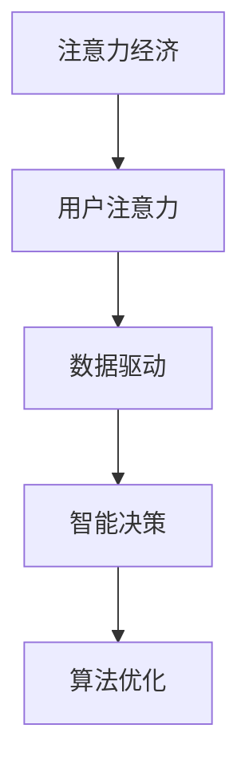

                 

# 注意力经济对企业创新管理的影响

> 关键词：注意力经济,创新管理,用户注意力,数据驱动,智能决策,算法优化

## 1. 背景介绍

### 1.1 问题由来
随着信息技术的迅猛发展，数字经济逐渐成为现代企业运营的重要支柱。特别是在互联网时代，注意力作为一种稀缺资源，对于企业的品牌推广、产品营销、用户获取等环节，都具有极其重要的价值。然而，在注意力资源日益分散的背景下，企业如何高效利用和分配用户注意力，成为亟需解决的重要问题。

### 1.2 问题核心关键点
当前，企业普遍面临着用户注意力争夺激烈、营销成本高企、信息过载等问题。如何从海量数据中识别用户注意力，进行精准的营销和资源配置，成为企业创新管理的重要方向。

在实际应用中，企业需要依据用户的行为数据，理解用户关注点，有针对性地推送信息、推荐产品、优化服务，从而提升用户满意度和市场竞争力。然而，现有的营销策略和方法往往无法精准捕捉用户注意力，导致信息噪音增加、营销效果下降。

## 2. 核心概念与联系

### 2.1 核心概念概述

为更好地理解注意力经济对企业创新管理的影响，本节将介绍几个关键概念：

- **注意力经济(Attention Economy)**：指在信息社会中，人们的时间和注意力成为稀缺资源，其分配和使用将决定市场和经济活动。注意力经济的核心在于如何有效收集、分析和利用用户注意力，提升营销效果。

- **用户注意力(User Attention)**：指用户在接触到信息、产品或服务时，所投入的时间和注意力。用户注意力的强弱直接影响用户的决策和行为，是企业营销的核心指标。

- **数据驱动(Data-Driven)**：指基于数据的分析、决策和优化过程，通过算法和大数据分析，揭示用户行为规律，优化决策效果。

- **智能决策(Intelligent Decision Making)**：指利用先进算法和模型，自动化决策过程，提升决策效率和精准度。智能决策的核心在于模型的设计和优化。

- **算法优化(Algorithm Optimization)**：指通过算法改进和模型优化，提升决策效率和效果。在注意力经济中，算法优化旨在通过优化算法，提高对用户注意力的识别和利用效率。

这些概念之间的逻辑关系可以通过以下Mermaid流程图来展示：



这个流程图展示了大语言模型的核心概念及其之间的关系：

1. 注意力经济通过数据驱动和智能决策，利用算法优化提升对用户注意力的识别和利用效率。
2. 数据驱动依赖于用户注意力，通过用户行为数据进行分析。
3. 智能决策基于数据驱动，通过优化算法实现自动化决策。
4. 算法优化直接影响智能决策的效果，是提升决策效率和效果的关键。

## 3. 核心算法原理 & 具体操作步骤
### 3.1 算法原理概述

注意力经济对企业创新管理的影响，主要体现在通过数据驱动和智能决策，优化企业资源配置和营销策略，提升用户体验和市场竞争力。在这一过程中，算法优化起到了关键作用。

算法优化主要通过以下步骤实现：

1. **数据收集**：收集用户的行为数据、关注点、兴趣爱好等信息，构建用户画像。
2. **数据清洗**：处理噪声数据，筛选出对用户注意力有贡献的信息。
3. **模型训练**：基于用户数据，训练识别用户注意力的模型。
4. **实时分析**：对实时数据进行监控和分析，及时调整决策策略。
5. **优化反馈**：根据模型预测和实际效果，进行迭代优化。

### 3.2 算法步骤详解

以下以推荐系统为例，详细讲解基于用户注意力的智能决策过程。

**Step 1: 数据收集**

- 收集用户的历史行为数据，包括浏览记录、点击次数、购买记录等。
- 收集用户的关注点数据，如用户在内容平台上停留时间、浏览偏好等。
- 收集用户的兴趣爱好数据，如用户订阅的频道、搜索关键词等。

**Step 2: 数据清洗**

- 对收集到的数据进行去重、去噪处理，确保数据质量。
- 处理缺失值和异常值，消除数据偏差。

**Step 3: 模型训练**

- 选择适合推荐系统的算法模型，如协同过滤、基于内容的推荐、深度学习等。
- 将用户数据和物品数据输入模型，进行训练。
- 利用交叉验证等方法，优化模型参数。

**Step 4: 实时分析**

- 实时监控用户行为数据，分析用户的注意力集中点和行为趋势。
- 根据分析结果，调整推荐算法参数，优化推荐内容。
- 实时评估推荐效果，调整推荐策略。

**Step 5: 优化反馈**

- 根据用户反馈和行为数据，优化推荐模型。
- 引入反馈循环机制，不断迭代优化模型参数。
- 定期更新模型，确保推荐效果持续提升。

### 3.3 算法优缺点

基于用户注意力的算法优化，具有以下优点：
1. 精准高效：通过深度学习模型和算法优化，能够精准识别用户注意力，提高决策效率。
2. 可解释性强：基于模型的推荐过程具有可解释性，便于理解和管理。
3. 动态调整：能够实时监控用户行为，动态调整推荐策略，提升用户满意度。
4. 个性化推荐：能够根据用户历史行为和实时数据，进行个性化推荐，提升用户体验。

同时，该方法也存在一定的局限性：
1. 数据依赖度高：需要大量的用户行为数据，数据质量直接影响推荐效果。
2. 算法复杂度高：深度学习模型训练复杂，需要高性能计算资源。
3. 隐私问题：用户行为数据的收集和使用，涉及用户隐私保护问题。
4. 算法黑盒：深度学习模型具有黑盒性质，难以解释模型的内部决策逻辑。

尽管存在这些局限性，但基于用户注意力的算法优化在推荐系统中已取得了广泛应用，并不断演化出新的优化策略和方法。未来相关研究仍需关注数据隐私保护和算法可解释性等问题。

### 3.4 算法应用领域

基于用户注意力的算法优化，已经在多个领域得到了应用，例如：

- 电子商务：通过用户行为数据进行个性化推荐，提升用户体验和销售额。
- 在线视频：根据用户观看记录和停留时间，推荐相关内容，提高用户黏性。
- 社交网络：推荐用户可能感兴趣的内容，扩大用户覆盖面和互动率。
- 广告投放：精准识别用户注意力，优化广告投放策略，提升广告效果。
- 搜索引擎：推荐相关搜索结果，提升用户搜索体验和搜索引擎排名。

除了以上这些经典应用外，基于用户注意力的算法优化还被创新性地应用到更多场景中，如金融推荐、健康医疗、教育培训等，为传统行业数字化转型升级提供新的技术路径。

## 4. 数学模型和公式 & 详细讲解  
### 4.1 数学模型构建

本节将使用数学语言对基于用户注意力的智能推荐系统进行更加严格的刻画。

记用户行为数据为 $X=\{x_i\}_{i=1}^N$，其中 $x_i$ 为第 $i$ 个用户的行为记录。假设物品数据为 $Y=\{y_j\}_{j=1}^M$，其中 $y_j$ 为第 $j$ 个物品的属性特征。定义用户对物品的评分矩阵为 $R=\{r_{ij}\}_{i=1}^N, j=1}^M$，其中 $r_{ij}$ 表示用户 $i$ 对物品 $j$ 的评分。

定义用户注意力的预测模型为 $P_\theta(x_i, y_j)$，其中 $\theta$ 为模型参数。模型预测用户对物品 $j$ 的注意力概率 $p_j$，根据模型预测和实际评分进行损失函数定义：

$$
\mathcal{L}(\theta) = \frac{1}{N} \sum_{i=1}^N \sum_{j=1}^M (r_{ij} \log p_j + (1-r_{ij})\log(1-p_j))
$$

其中，$L(\theta)$ 为损失函数，$p_j$ 为模型预测的概率。

### 4.2 公式推导过程

以下我们以协同过滤算法为例，推导推荐系统的损失函数及其梯度的计算公式。

协同过滤算法基于用户历史评分数据，通过矩阵分解得到用户对物品的兴趣表示 $u_i$ 和物品的兴趣表示 $v_j$，并通过余弦相似度计算用户对物品的兴趣分数：

$$
\hat{r}_{ij} = \hat{u}_i^\top \hat{v}_j
$$

其中 $\hat{u}_i$ 和 $\hat{v}_j$ 分别为用户 $i$ 和物品 $j$ 的兴趣表示。

将用户行为数据 $X$ 和物品数据 $Y$ 代入模型，得到预测注意力概率 $p_j$：

$$
p_j = \sigma(\hat{u}_i^\top \hat{v}_j)
$$

其中 $\sigma$ 为 sigmoid 函数。

将预测注意力概率 $p_j$ 和实际评分 $r_{ij}$ 代入损失函数：

$$
\mathcal{L}(\theta) = \frac{1}{N} \sum_{i=1}^N \sum_{j=1}^M (r_{ij} \log p_j + (1-r_{ij})\log(1-p_j))
$$

根据损失函数的梯度计算公式，求得模型参数 $\theta$ 的梯度：

$$
\frac{\partial \mathcal{L}(\theta)}{\partial \theta} = -\frac{1}{N} \sum_{i=1}^N \sum_{j=1}^M (r_{ij} - p_j) \nabla_{\theta} p_j
$$

其中 $\nabla_{\theta} p_j$ 为 $\hat{u}_i^\top \hat{v}_j$ 对 $\theta$ 的梯度。

将余弦相似度代入 $\hat{u}_i^\top \hat{v}_j$ 中，求得 $\nabla_{\theta} p_j$：

$$
\nabla_{\theta} p_j = \nabla_{\theta} (\hat{u}_i^\top \hat{v}_j) = \frac{\partial \hat{u}_i}{\partial \theta} \hat{v}_j + \hat{u}_i \frac{\partial \hat{v}_j}{\partial \theta}
$$

将余弦相似度公式代入，求得 $\nabla_{\theta} p_j$：

$$
\nabla_{\theta} p_j = \frac{\partial (\hat{u}_i^\top \hat{v}_j)}{\partial \theta} = \frac{\partial (\sum_{k=1}^d u_{ik}v_{jk})}{\partial \theta} = \sum_{k=1}^d \frac{\partial u_{ik}}{\partial \theta}v_{jk} + u_{ik} \frac{\partial v_{jk}}{\partial \theta}
$$

将上述公式代入梯度计算公式，求得模型参数 $\theta$ 的梯度：

$$
\frac{\partial \mathcal{L}(\theta)}{\partial \theta} = -\frac{1}{N} \sum_{i=1}^N \sum_{j=1}^M (r_{ij} - p_j) (\sum_{k=1}^d \frac{\partial u_{ik}}{\partial \theta}v_{jk} + u_{ik} \frac{\partial v_{jk}}{\partial \theta})
$$

通过反向传播算法和梯度下降等优化算法，微调过程不断更新模型参数 $\theta$，最小化损失函数 $\mathcal{L}$，使得模型预测概率逼近真实评分，从而提升推荐效果。

## 5. 项目实践：代码实例和详细解释说明
### 5.1 开发环境搭建

在进行推荐系统开发前，我们需要准备好开发环境。以下是使用Python进行TensorFlow开发的环境配置流程：

1. 安装Anaconda：从官网下载并安装Anaconda，用于创建独立的Python环境。

2. 创建并激活虚拟环境：
```bash
conda create -n recommendation-env python=3.8 
conda activate recommendation-env
```

3. 安装TensorFlow：根据CUDA版本，从官网获取对应的安装命令。例如：
```bash
conda install tensorflow -c pytorch -c conda-forge
```

4. 安装TensorFlow推荐库：
```bash
pip install tensorflow-recommendations
```

5. 安装各类工具包：
```bash
pip install numpy pandas scikit-learn matplotlib tqdm jupyter notebook ipython
```

完成上述步骤后，即可在`recommendation-env`环境中开始推荐系统开发。

### 5.2 源代码详细实现

这里我们以协同过滤算法为例，给出使用TensorFlow实现推荐系统的完整代码实现。

首先，定义推荐模型的超参数：

```python
import tensorflow as tf

train_epochs = 10
batch_size = 512
learning_rate = 0.001
latent_dim = 64
hidden_dim = 64
```

然后，定义协同过滤算法的推荐模型：

```python
class CollaborativeFilteringModel(tf.keras.Model):
    def __init__(self, latent_dim, hidden_dim):
        super(CollaborativeFilteringModel, self).__init__()
        self.latent_dim = latent_dim
        self.hidden_dim = hidden_dim
        
        self.user_factors = tf.keras.layers.Dense(latent_dim, activation='relu')
        self.item_factors = tf.keras.layers.Dense(latent_dim, activation='relu')
        self.intermediate_layer = tf.keras.layers.Dense(hidden_dim, activation='relu')
        self.output_layer = tf.keras.layers.Dense(1, activation='sigmoid')

    def call(self, user_factors, item_factors):
        user_embedding = self.user_factors(user_factors)
        item_embedding = self.item_factors(item_factors)
        intermediate_output = tf.concat([user_embedding, item_embedding], axis=1)
        intermediate_output = self.intermediate_layer(intermediate_output)
        output = self.output_layer(intermediate_output)
        return output
```

接着，定义推荐系统的损失函数和优化器：

```python
def compute_loss(model, user_factors, item_factors, rating):
    predictions = model(user_factors, item_factors)
    loss = tf.reduce_mean(tf.square(predictions - rating))
    return loss

optimizer = tf.keras.optimizers.Adam(learning_rate=learning_rate)
```

最后，训练和测试推荐系统：

```python
# 假设已准备好用户行为数据和物品特征数据
user_factors_train = # 用户行为数据
user_factors_test = # 用户行为数据
item_factors = # 物品特征数据
rating = # 用户评分数据

def train_model(model, user_factors_train, item_factors, rating, epochs, batch_size):
    train_dataset = tf.data.Dataset.from_tensor_slices((user_factors_train, item_factors, rating)).batch(batch_size)
    for epoch in range(epochs):
        for (user_factors, item_factors, rating) in train_dataset:
            with tf.GradientTape() as tape:
                loss = compute_loss(model, user_factors, item_factors, rating)
            grads = tape.gradient(loss, model.trainable_variables)
            optimizer.apply_gradients(zip(grads, model.trainable_variables))
    return model

model = CollaborativeFilteringModel(latent_dim, hidden_dim)
trained_model = train_model(model, user_factors_train, item_factors, rating, train_epochs, batch_size)

# 在测试集上评估推荐效果
def evaluate_model(model, user_factors_test, item_factors, rating):
    test_dataset = tf.data.Dataset.from_tensor_slices((user_factors_test, item_factors, rating)).batch(batch_size)
    predictions = []
    for (user_factors, item_factors, rating) in test_dataset:
        predictions.append(model(user_factors, item_factors))
    predictions = tf.concat(predictions, axis=0)
    return predictions

predictions = evaluate_model(trained_model, user_factors_test, item_factors, rating)
```

以上就是使用TensorFlow对协同过滤推荐系统进行训练的完整代码实现。可以看到，借助TensorFlow推荐库，可以方便地实现协同过滤算法的推荐系统，进一步优化和改进。

### 5.3 代码解读与分析

让我们再详细解读一下关键代码的实现细节：

**CollaborativeFilteringModel类**：
- `__init__`方法：初始化模型参数，定义用户兴趣表示和物品兴趣表示的维度。
- `call`方法：对输入的user_factors和item_factors进行编码和组合，输出推荐概率。

**compute_loss函数**：
- 对用户行为数据和物品特征数据进行编码，并计算推荐概率。
- 定义损失函数为预测评分与实际评分的平方误差。

**train_model函数**：
- 将训练数据集输入模型，进行前向传播计算损失。
- 利用梯度下降算法更新模型参数。

**evaluate_model函数**：
- 对测试数据集进行推理预测，返回预测评分。

**训练流程**：
- 定义超参数，包括训练轮数、批大小、学习率等。
- 初始化协同过滤模型。
- 对训练数据集进行批处理，输入模型进行前向传播和损失计算。
- 反向传播更新模型参数。
- 在测试集上评估模型预测评分。

可以看出，TensorFlow推荐库提供了丰富的推荐算法和工具，使得推荐系统开发更加便捷高效。开发者可以根据具体需求，选择适合的推荐算法，并进行超参数调优和模型优化。

## 6. 实际应用场景
### 6.1 电商平台推荐系统

基于用户注意力的推荐系统在电商平台中的应用广泛。电商平台需要根据用户历史行为数据，为用户推荐可能感兴趣的商品，提升用户购物体验和转化率。

在实际应用中，电商平台可以收集用户浏览、点击、购买等行为数据，以及商品的属性、评价、评论等信息，构建用户画像和商品画像。基于协同过滤、深度学习等推荐算法，对用户行为数据和物品数据进行训练和预测，从而生成个性化推荐结果。

此外，电商平台还可以通过实时监控用户行为数据，动态调整推荐策略，提升推荐效果。例如，根据用户浏览行为，推荐相关商品；根据用户点击行为，调整推荐位置和方式；根据用户购买行为，推荐相似商品等。

### 6.2 视频平台推荐系统

视频平台推荐系统利用用户观看行为数据，为用户推荐相关视频内容，提高用户粘性和平台活跃度。视频平台推荐系统可以结合多种推荐算法，如协同过滤、内容推荐、基于关联规则的推荐等，为用户提供精准的推荐内容。

在实际应用中，视频平台可以收集用户观看记录、停留时间、点赞、评论等行为数据，以及视频标题、标签、时长等信息，构建用户画像和视频画像。基于协同过滤、深度学习等推荐算法，对用户行为数据和物品数据进行训练和预测，从而生成个性化推荐结果。

此外，视频平台还可以通过实时监控用户行为数据，动态调整推荐策略，提升推荐效果。例如，根据用户观看行为，推荐相关视频；根据用户点赞行为，调整推荐位置和方式；根据用户评论行为，推荐相似视频等。

### 6.3 社交网络推荐系统

社交网络推荐系统利用用户互动数据，为用户推荐可能感兴趣的内容，扩大用户覆盖面和互动率。社交网络推荐系统可以结合多种推荐算法，如基于相似度的推荐、基于社区的推荐、基于关联规则的推荐等，为用户提供精准的推荐内容。

在实际应用中，社交网络可以收集用户点赞、评论、分享等互动数据，以及内容发布者的信息、标签、热度等信息，构建用户画像和内容画像。基于协同过滤、深度学习等推荐算法，对用户行为数据和物品数据进行训练和预测，从而生成个性化推荐结果。

此外，社交网络还可以通过实时监控用户行为数据，动态调整推荐策略，提升推荐效果。例如，根据用户点赞行为，推荐相关内容；根据用户评论行为，调整推荐位置和方式；根据用户分享行为，推荐相似内容等。

## 7. 工具和资源推荐
### 7.1 学习资源推荐

为了帮助开发者系统掌握注意力经济和推荐系统的理论基础和实践技巧，这里推荐一些优质的学习资源：

1. 《推荐系统实践》书籍：该书详细介绍了推荐系统的基本概念、算法原理、实际应用等，是推荐系统入门的经典读物。

2. 《深度学习与推荐系统》课程：由斯坦福大学开设的在线课程，涵盖推荐系统的基本原理和多种算法，适合初学者和进阶学习。

3. TensorFlow推荐库官方文档：TensorFlow推荐库提供了丰富的推荐算法和工具，详细介绍了推荐系统的实现方法和应用场景。

4. PyTorch推荐库官方文档：PyTorch推荐库也提供了丰富的推荐算法和工具，详细介绍了推荐系统的实现方法和应用场景。

5. 《推荐系统：基于深度学习》书籍：该书深入介绍了基于深度学习的推荐系统，包括协同过滤、深度学习等推荐算法。

通过这些学习资源，相信你一定能够系统掌握推荐系统的原理和实现方法，并应用到实际工作中。

### 7.2 开发工具推荐

高效的开发离不开优秀的工具支持。以下是几款用于推荐系统开发的常用工具：

1. TensorFlow：由Google主导开发的开源深度学习框架，生产部署方便，适合大规模工程应用。推荐系统开发离不开TensorFlow等深度学习框架的支持。

2. PyTorch：基于Python的开源深度学习框架，灵活动态，适合快速迭代研究。推荐系统开发也需要借助PyTorch等深度学习框架的支持。

3. TensorFlow推荐库：HuggingFace开发的推荐系统库，集成了多种推荐算法，提供了丰富的推荐算法和工具，是推荐系统开发的利器。

4. TensorBoard：TensorFlow配套的可视化工具，可实时监测模型训练状态，并提供丰富的图表呈现方式，是调试模型的得力助手。

5. Weights & Biases：模型训练的实验跟踪工具，可以记录和可视化模型训练过程中的各项指标，方便对比和调优。与主流深度学习框架无缝集成。

6. Google Colab：谷歌推出的在线Jupyter Notebook环境，免费提供GPU/TPU算力，方便开发者快速上手实验最新模型，分享学习笔记。

合理利用这些工具，可以显著提升推荐系统的开发效率，加快创新迭代的步伐。

### 7.3 相关论文推荐

推荐系统的发展离不开学界的持续研究。以下是几篇奠基性的相关论文，推荐阅读：

1. BPR: Bayesian Personalized Ranking from Casual Impressions：提出基于隐式反馈的推荐算法BPR，引入隐式反馈模型，优化推荐效果。

2. Matrix Factorization Techniques for Recommender Systems：介绍矩阵分解技术，将用户评分矩阵分解为用户和物品的兴趣表示，提升推荐效果。

3. Deep Ranking Networks：提出深度学习推荐算法，利用神经网络模型优化推荐效果。

4. Attention-Based Recommender Systems：利用注意力机制，提升推荐模型对用户注意力的理解能力，提升推荐效果。

5. Neural Collaborative Filtering：基于深度学习的协同过滤推荐算法，利用神经网络模型优化推荐效果。

这些论文代表了大语言模型微调技术的发展脉络。通过学习这些前沿成果，可以帮助研究者把握学科前进方向，激发更多的创新灵感。

## 8. 总结：未来发展趋势与挑战
### 8.1 总结

本文对基于用户注意力的推荐系统进行了全面系统的介绍。首先阐述了注意力经济和推荐系统的发展背景和意义，明确了推荐系统在提高用户满意度、优化资源配置等方面的重要作用。其次，从原理到实践，详细讲解了推荐系统的数学模型和算法优化过程，给出了推荐系统的完整代码实例。同时，本文还广泛探讨了推荐系统在电商、视频、社交等多个领域的应用前景，展示了推荐系统带来的广泛影响。此外，本文精选了推荐系统的各类学习资源，力求为读者提供全方位的技术指引。

通过本文的系统梳理，可以看到，基于用户注意力的推荐系统通过数据驱动和智能决策，显著提升了资源配置和营销策略的精准度，带来了巨大的商业价值。未来，伴随深度学习技术和大数据应用的不断深入，推荐系统必将在更多领域得到应用，为数字经济的发展注入新的动力。

### 8.2 未来发展趋势

展望未来，推荐系统的发展趋势主要体现在以下几个方面：

1. 深度学习推荐系统：深度学习算法，如深度协同过滤、深度神经网络等，在推荐系统中的应用将更加广泛，提升推荐效果和系统性能。

2. 多模态推荐系统：将视觉、语音、文本等多种模态信息进行融合，提升推荐系统的智能性和鲁棒性。

3. 实时推荐系统：通过实时监控用户行为数据，动态调整推荐策略，提升推荐效果和用户体验。

4. 跨域推荐系统：将不同领域、不同平台的数据进行融合，提升推荐系统的覆盖范围和效果。

5. 个性化推荐：通过精准的用户画像和内容画像，实现更加个性化的推荐，提升用户满意度和市场竞争力。

6. 推荐系统的公平性和透明性：注重推荐系统的公平性和透明性，确保推荐结果符合用户期望和社会价值观。

以上趋势凸显了推荐系统的广阔前景。这些方向的探索发展，必将进一步提升推荐系统的性能和应用范围，为数字经济的发展带来新的动力。

### 8.3 面临的挑战

尽管推荐系统已经取得了显著的进展，但在迈向更加智能化、普适化应用的过程中，仍面临诸多挑战：

1. 数据隐私和安全问题：用户行为数据的收集和使用，涉及用户隐私保护和数据安全问题，需要严格遵守法律法规和道德规范。

2. 推荐系统的公平性问题：推荐系统的算法设计和决策过程，可能导致不公平的推荐结果，需要加强监管和调整。

3. 推荐系统的透明性问题：推荐系统的决策过程复杂，难以解释模型的内部机制和逻辑，需要提高系统的透明性和可解释性。

4. 推荐系统的鲁棒性问题：推荐系统对数据噪声和异常值的敏感，需要提高系统的鲁棒性和健壮性。

5. 推荐系统的可扩展性问题：推荐系统需要处理海量数据，对算力和存储资源提出高要求，需要优化算法和资源配置。

6. 推荐系统的可优化性问题：推荐系统的性能和效果需要不断优化，如何提高算法的可优化性和可调优性，仍需深入研究。

这些挑战需要在未来的研究中逐步解决，以实现推荐系统的可持续发展。相信随着学界和产业界的共同努力，推荐系统必将在未来更加智能化、普适化，更好地服务于数字经济的发展。

### 8.4 研究展望

面对推荐系统面临的诸多挑战，未来的研究需要在以下几个方面寻求新的突破：

1. 引入先验知识：将符号化的先验知识，如知识图谱、逻辑规则等，与推荐系统进行巧妙融合，提升推荐效果。

2. 开发更加高效的推荐算法：进一步优化推荐算法，提高推荐系统的可扩展性和可优化性。

3. 提高推荐系统的透明性：引入可解释性技术，提高推荐系统的透明性和可解释性。

4. 优化推荐系统的公平性：设计公平性算法，确保推荐结果符合用户期望和社会价值观。

5. 提高推荐系统的鲁棒性：引入鲁棒性技术，提高推荐系统的鲁棒性和健壮性。

6. 开发多模态推荐系统：将视觉、语音、文本等多种模态信息进行融合，提升推荐系统的智能性和鲁棒性。

这些研究方向将引领推荐系统的不断进步，提升推荐系统的性能和应用范围，为数字经济的发展注入新的活力。

## 9. 附录：常见问题与解答

**Q1：推荐系统如何处理稀疏数据？**

A: 推荐系统通常需要处理大量的用户行为数据，但由于用户行为数据存在稀疏性，推荐系统通常使用稀疏矩阵分解等技术，将稀疏数据转化为稠密表示，便于进行推荐算法计算。此外，还可以使用填充技术，对缺失数据进行填补，提高推荐效果。

**Q2：推荐系统的核心是什么？**

A: 推荐系统的核心在于通过对用户行为数据的分析，学习用户兴趣和物品特征，从而生成个性化推荐结果。具体而言，推荐系统的核心包括：
1. 用户画像：通过用户行为数据，构建用户兴趣模型，理解用户偏好。
2. 物品画像：通过物品属性和用户互动数据，构建物品特征模型，理解物品属性。
3. 推荐算法：通过用户画像和物品画像，选择合适的推荐算法，生成推荐结果。

**Q3：推荐系统在电商、视频、社交等多个领域的应用前景如何？**

A: 推荐系统在电商、视频、社交等多个领域都有广泛的应用前景：
1. 电商：利用用户行为数据，为用户推荐可能感兴趣的商品，提升用户购物体验和转化率。
2. 视频：利用用户观看行为数据，为用户推荐相关视频内容，提高用户粘性和平台活跃度。
3. 社交：利用用户互动数据，为用户推荐可能感兴趣的内容，扩大用户覆盖面和互动率。
4. 新闻：利用用户阅读行为数据，为用户推荐相关新闻文章，提高用户阅读体验和平台点击率。
5. 金融：利用用户交易数据，为用户推荐相关金融产品，提高用户投资回报率和平台收益。

综上所述，推荐系统具有广泛的应用前景，可应用于多个领域，提升用户满意度和市场竞争力。

**Q4：推荐系统的评价指标有哪些？**

A: 推荐系统的评价指标主要包括以下几类：
1. 准确率：评估推荐结果与实际行为的一致性，通常使用准确率、召回率、F1-score等指标。
2. 多样性：评估推荐结果的多样性，通常使用信息熵、基尼系数等指标。
3. 新颖性：评估推荐结果的新颖性，通常使用新颖度指标。
4. 满意度：评估用户对推荐结果的满意度，通常使用满意度评分指标。

综上所述，推荐系统的评价指标需要根据具体应用场景进行选择，并结合业务需求进行综合评估。

---

作者：禅与计算机程序设计艺术 / Zen and the Art of Computer Programming

