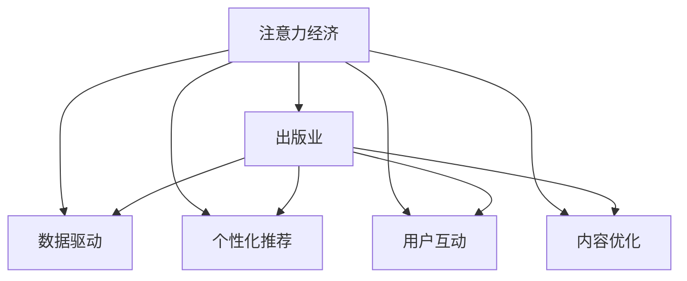
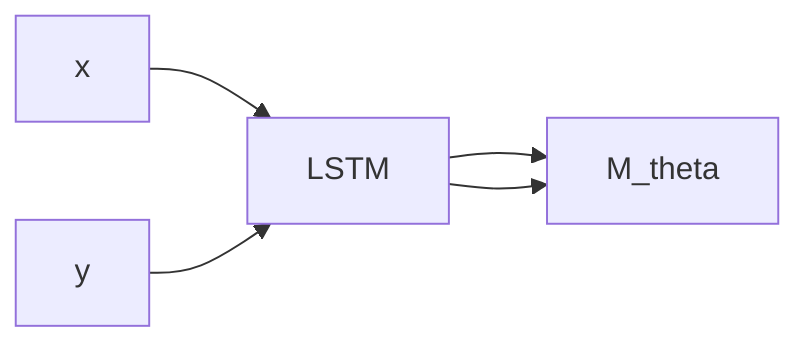

                 

# 注意力经济对传统出版业的转型要求

> 关键词：注意力经济, 出版业, 转型, 数据驱动, 个性化推荐, 内容优化, 用户互动

## 1. 背景介绍

在数字时代，信息爆炸、用户注意力稀缺已成定局。出版业作为内容产业，面临着前所未有的挑战。传统的线性出版模式，难以适应用户的个性化需求和阅读习惯的快速变化。传统出版商需要重新审视自身业务模式，探索如何在注意力经济中生存和繁荣。

### 1.1 问题由来

传统的出版模式基于图书的线性内容生产与发行，出版商与用户之间存在较大的信息不对称。在数字时代，内容触达用户的方式更加多元，出版商需要借助技术手段，重新定义内容与用户的关系，提升用户的注意力和参与度。

### 1.2 问题核心关键点

1. **注意力获取与维持**：如何在信息泛滥的环境下，吸引并维持用户的注意力，提升内容的可见性和影响力。
2. **个性化推荐**：通过分析用户行为数据，提供个性化、精准的内容推荐，提升用户体验。
3. **用户互动**：通过互动功能，提升用户参与度，促进内容消费和价值转化。
4. **数据驱动决策**：利用大数据分析用户行为，指导内容创作和业务策略调整。
5. **内容优化**：根据用户反馈和数据分析，持续优化内容质量，提升用户满意度。

## 2. 核心概念与联系

### 2.1 核心概念概述

为更好地理解注意力经济对出版业转型的要求，本节将介绍几个关键概念：

- **注意力经济（Attention Economy）**：指在信息过载的社会背景下，争夺用户注意力成为一种重要资源。在注意力经济中，出版商需要精心设计和传播内容，以获取并保持用户的关注。
- **出版业（Publishing Industry）**：传统印刷和电子出版物的生产和分发产业。
- **数据驱动（Data-Driven）**：通过收集和分析用户数据，指导内容创作和业务决策的策略。
- **个性化推荐（Personalized Recommendation）**：利用机器学习和数据分析技术，为特定用户推荐最符合其兴趣的内容。
- **用户互动（User Interaction）**：通过线上平台提供的互动功能，如评论、点赞、分享等，增强用户参与感。
- **内容优化（Content Optimization）**：持续改进内容，提升其吸引力和可读性。

这些概念之间的逻辑关系可以通过以下Mermaid流程图来展示：



这个流程图展示了大语言模型微调的各个核心概念及其之间的关系：

1. 注意力经济中，出版商需要运用数据驱动、个性化推荐、用户互动和内容优化等手段，争夺和保持用户的注意力。
2. 数据驱动为出版商提供了决策支持，帮助其理解用户需求，指导内容创作。
3. 个性化推荐提升了用户满意度，增强了内容消费。
4. 用户互动增加了用户参与度，促进了价值转化。
5. 内容优化提升了内容质量，吸引了更多用户。

这些概念共同构成了出版业在注意力经济中生存和发展的关键要素。

## 3. 核心算法原理 & 具体操作步骤

### 3.1 算法原理概述

注意力经济下，出版业的核心目标是通过优质内容和互动功能，争夺并维持用户的注意力，最终实现内容变现。出版商可以利用数据驱动的策略，分析和指导内容创作和优化，同时应用个性化推荐和互动功能，提升用户粘性和价值转化。

### 3.2 算法步骤详解

基于上述目标，出版业的数据驱动转型可以概括为以下几个关键步骤：

**Step 1: 数据采集与预处理**
- 采集用户行为数据，包括阅读时长、点击率、评论内容等。
- 对数据进行清洗和归一化，生成可供分析的特征向量。

**Step 2: 数据分析与建模**
- 使用统计分析和机器学习算法，如聚类、关联规则等，挖掘用户兴趣和行为模式。
- 使用深度学习模型，如LSTM、GRU等，建立用户兴趣预测模型。

**Step 3: 内容推荐系统开发**
- 根据用户兴趣模型，设计推荐算法，如协同过滤、基于内容的推荐、混合推荐等。
- 利用模型评估指标，如精度、召回率、F1-score等，评估推荐系统的性能。

**Step 4: 用户互动功能开发**
- 开发互动功能，如评论、点赞、分享、问答等。
- 引入情感分析技术，监测互动内容的质量和情绪，及时处理负面反馈。

**Step 5: 内容优化与反馈循环**
- 根据互动数据和用户反馈，持续优化内容，调整创作方向。
- 建立反馈循环机制，不断迭代内容生产和推荐策略，提升用户满意度和参与度。

### 3.3 算法优缺点

数据驱动转型具有以下优点：
1. 提升用户满意度：通过个性化推荐和互动功能，提升用户体验。
2. 优化内容创作：利用数据分析指导内容创作和优化，提升内容质量。
3. 精准营销：通过数据驱动，实现精准营销和用户定位。

同时，该方法也存在一定的局限性：
1. 数据隐私问题：采集用户数据需要处理隐私保护，确保数据合法合规。
2. 算法偏见：推荐系统可能存在算法偏见，需要优化模型和算法，避免歧视性内容。
3. 技术复杂性：开发和维护数据驱动系统需要较高技术门槛，可能涉及多学科知识。
4. 成本投入：数据驱动转型的初期投入较大，需考虑ROI（投资回报率）问题。

尽管存在这些局限性，但数据驱动转型仍是大语言模型微调在出版业应用的重要方向。出版商需平衡技术投入和用户收益，不断迭代优化，才能在注意力经济中占据有利地位。

### 3.4 算法应用领域

数据驱动的出版业转型主要应用于以下几个领域：

- **在线图书平台**：如亚马逊Kindle、当当网等，通过个性化推荐和互动功能，提升用户粘性和消费转化。
- **新闻网站**：如BBC、CNN等，利用数据分析指导内容创作，提升文章阅读量和用户参与度。
- **学术出版**：如Springer、Nature等，通过数据驱动的出版策略，提升研究成果的影响力和传播效果。
- **在线教育**：如Coursera、Udacity等，利用用户行为数据，提供个性化课程推荐，增强学习体验。
- **社交媒体平台**：如微博、微信等，通过互动功能，吸引用户关注，提升内容曝光和传播。

这些领域中，数据驱动转型通过提升用户满意度和参与度，实现了出版业的数字化和智能化转型。未来，随着大数据和人工智能技术的进一步发展，数据驱动的出版业将更加深入人心，成为行业标准。

## 4. 数学模型和公式 & 详细讲解 & 举例说明

### 4.1 数学模型构建

在本节中，我们将以一个简单的用户兴趣预测模型为例，介绍数据驱动转型的数学模型构建。

假设用户的历史行为数据为 $D=\{(x_i, y_i)\}_{i=1}^N$，其中 $x_i$ 为特征向量，$y_i$ 为标签（用户是否对内容感兴趣）。建立二分类模型，预测用户对新内容的兴趣 $y^*$。

定义模型 $M_{\theta}$，其中 $\theta$ 为模型参数，使用二分类交叉熵损失函数 $\ell$，最小化模型误差。模型损失函数为：

$$
\mathcal{L}(\theta) = -\frac{1}{N}\sum_{i=1}^N y_i \log \hat{y}_i + (1-y_i) \log (1-\hat{y}_i)
$$

其中 $\hat{y}_i = M_{\theta}(x_i)$ 为模型预测的概率。

### 4.2 公式推导过程

以LSTM模型为例，其结构如图1所示。假设 $x$ 为输入特征， $y$ 为输出标签， $M_{\theta}$ 为LSTM模型， $\theta$ 为模型参数。



LSTM的输出 $\hat{y}$ 可以表示为：

$$
\hat{y} = \sigma(W_h \cdot \text{LSTM}(x) + b_h)
$$

其中 $W_h$ 和 $b_h$ 为线性层和偏置项。

损失函数 $\ell$ 为：

$$
\ell = -(y \log \hat{y} + (1-y) \log (1-\hat{y}))
$$

使用梯度下降等优化算法，最小化损失函数 $\mathcal{L}$：

$$
\theta \leftarrow \theta - \eta \nabla_{\theta}\mathcal{L}(\theta)
$$

其中 $\eta$ 为学习率， $\nabla_{\theta}\mathcal{L}(\theta)$ 为损失函数对模型参数的梯度。

### 4.3 案例分析与讲解

以亚马逊Kindle为例，分析其如何通过数据驱动的个性化推荐系统提升用户满意度和购买转化率。

Kindle使用协同过滤算法和基于内容的推荐系统，对用户的阅读历史和购买行为进行分析，推荐符合其兴趣的内容。通过实时数据监控，调整推荐算法和内容策略，提升用户参与度和消费转化率。

此外，Kindle还引入情感分析技术，监测用户对内容的评价和反馈，及时处理负面情感，优化内容质量。通过这些措施，Kindle能够精准锁定用户需求，提升用户体验和忠诚度，实现持续增长。

## 5. 项目实践：代码实例和详细解释说明

### 5.1 开发环境搭建

在进行数据驱动的出版业转型时，需要准备好开发环境。以下是使用Python进行LSTM模型的环境配置流程：

1. 安装Anaconda：从官网下载并安装Anaconda，用于创建独立的Python环境。

2. 创建并激活虚拟环境：
```bash
conda create -n lstm-env python=3.8 
conda activate lstm-env
```

3. 安装必要的Python包：
```bash
pip install pandas numpy scikit-learn tensorflow keras 
```

4. 安装LSTM模型相关库：
```bash
pip install h5py
```

5. 安装TensorBoard：用于可视化模型训练过程和结果。
```bash
pip install tensorboard
```

完成上述步骤后，即可在`lstm-env`环境中开始开发。

### 5.2 源代码详细实现

下面是一个使用LSTM模型进行用户兴趣预测的代码示例：

```python
import pandas as pd
import numpy as np
from sklearn.model_selection import train_test_split
from tensorflow.keras.models import Sequential
from tensorflow.keras.layers import LSTM, Dense
from tensorflow.keras.optimizers import Adam
from sklearn.metrics import roc_auc_score

# 数据预处理
data = pd.read_csv('user_data.csv')
X = data[['feature1', 'feature2', 'feature3']].to_numpy()
y = data['label'].to_numpy()

# 数据划分
X_train, X_test, y_train, y_test = train_test_split(X, y, test_size=0.2, random_state=42)

# 模型构建
model = Sequential()
model.add(LSTM(128, input_shape=(X_train.shape[1], X_train.shape[2])))
model.add(Dense(1, activation='sigmoid'))

# 模型编译
model.compile(optimizer=Adam(lr=0.001), loss='binary_crossentropy', metrics=['accuracy', roc_auc_score])

# 模型训练
model.fit(X_train, y_train, validation_data=(X_test, y_test), epochs=10, batch_size=32)

# 模型评估
y_pred = model.predict(X_test)
roc_auc = roc_auc_score(y_test, y_pred)
print(f'ROC-AUC score: {roc_auc:.4f}')
```

上述代码实现了使用LSTM模型进行用户兴趣预测，并评估模型的性能。可以看到，Python的TensorFlow库提供了便捷的API，使得构建和训练LSTM模型变得简单易行。

### 5.3 代码解读与分析

让我们再详细解读一下关键代码的实现细节：

**数据预处理**：
- 使用Pandas读取用户行为数据，提取特征和标签。
- 对特征数据进行标准化和归一化处理。
- 将特征数据划分为训练集和测试集，进行交叉验证。

**模型构建**：
- 使用Sequential模型构建LSTM模型，设置128个隐藏单元。
- 使用Dense层进行二分类预测，激活函数为sigmoid。

**模型编译**：
- 使用Adam优化器，设置学习率为0.001。
- 定义损失函数为二分类交叉熵，评估指标包括准确率和ROC-AUC。

**模型训练**：
- 使用fit方法训练模型，设置10个epoch，batch size为32。
- 在训练过程中，使用测试集进行验证，及时调整模型参数。

**模型评估**：
- 使用预测结果和真实标签计算ROC-AUC值，评估模型性能。

**代码实例总结**：
- 利用TensorFlow库的API，简化了LSTM模型的构建和训练流程。
- 代码简洁高效，易于扩展和复用。

## 6. 实际应用场景

### 6.1 在线图书平台

在线图书平台如亚马逊Kindle，通过数据驱动的个性化推荐系统，大大提升了用户满意度。Kindle分析用户的历史阅读和购买行为，推荐用户可能感兴趣的新书，增加了用户的粘性和消费转化率。

### 6.2 新闻网站

新闻网站如BBC、CNN等，通过数据驱动的内容创作和传播策略，提升了文章阅读量和用户参与度。利用数据分析工具，监测用户对新闻内容的反馈，调整内容策略，提高内容质量和传播效果。

### 6.3 学术出版

学术出版平台如Springer、Nature等，通过数据驱动的出版策略，提升了研究成果的影响力和传播效果。利用数据分析工具，预测热点研究领域和热门文章，引导学术资源的配置和分配。

### 6.4 在线教育

在线教育平台如Coursera、Udacity等，通过数据驱动的用户行为分析，提供个性化课程推荐，增强学习体验。利用情感分析技术，监测用户对课程的评价和反馈，优化课程内容和教学策略。

### 6.5 社交媒体平台

社交媒体平台如微博、微信等，通过数据驱动的用户互动功能，吸引用户关注，提升内容曝光和传播。利用情感分析技术，监测用户对内容的评价和反馈，及时处理负面情感，优化内容质量。

## 7. 工具和资源推荐

### 7.1 学习资源推荐

为帮助开发者系统掌握数据驱动的出版业转型技术，这里推荐一些优质的学习资源：

1. 《深度学习》书籍：Ian Goodfellow等人所著，全面介绍了深度学习的理论和实践，是入门和进阶必读书籍。
2. 《机器学习实战》书籍：Peter Harrington所著，以Python实现机器学习算法为核心内容，适合动手实践。
3. Coursera《机器学习》课程：Andrew Ng等名师主讲的经典课程，涵盖了机器学习的核心概念和算法。
4. Udacity《深度学习基础》课程：提供从浅层神经网络到深度学习的系统学习路径，适合初学者和进阶者。
5. Kaggle数据竞赛平台：提供大量数据集和竞赛项目，适合实践和挑战。

通过对这些资源的学习实践，相信你一定能够快速掌握数据驱动的出版业转型技术的精髓，并用于解决实际的出版问题。

### 7.2 开发工具推荐

高效的开发离不开优秀的工具支持。以下是几款用于数据驱动的出版业转型的常用工具：

1. Jupyter Notebook：提供交互式编程环境，适合数据分析和机器学习任务。
2. TensorFlow：由Google主导开发的开源深度学习框架，生产部署方便，适合大规模工程应用。
3. Scikit-learn：Python的机器学习库，提供了多种经典算法的实现。
4. Pandas：Python的数据处理库，提供了便捷的数据处理和分析功能。
5. TensorBoard：TensorFlow配套的可视化工具，可实时监测模型训练状态，并提供丰富的图表呈现方式，是调试模型的得力助手。

合理利用这些工具，可以显著提升数据驱动的出版业转型的开发效率，加快创新迭代的步伐。

### 7.3 相关论文推荐

数据驱动的出版业转型研究源于学界的持续研究。以下是几篇奠基性的相关论文，推荐阅读：

1. 《注意力机制在深度学习中的应用》（Attention Mechanism in Deep Learning）：介绍了注意力机制的基本原理和应用，奠定了深度学习模型设计的基础。
2. 《深度学习在自然语言处理中的应用》（Deep Learning in Natural Language Processing）：展示了深度学习在NLP中的广泛应用，包括文本分类、情感分析、机器翻译等任务。
3. 《数据驱动的内容推荐系统》（Data-Driven Content Recommendation System）：探讨了推荐系统的理论和实践，分析了用户行为数据的处理和分析方法。
4. 《用户互动在内容创作中的作用》（User Interaction in Content Creation）：讨论了用户互动对内容质量和传播效果的影响，提出了互动特征的提取和分析方法。
5. 《出版业的数据驱动转型》（Data-Driven Transformation in Publishing Industry）：分析了数据驱动在出版业中的应用，探讨了出版商如何利用数据驱动提升业务表现。

这些论文代表了大语言模型微调技术的发展脉络。通过学习这些前沿成果，可以帮助研究者把握学科前进方向，激发更多的创新灵感。

## 8. 总结：未来发展趋势与挑战

### 8.1 总结

本文对数据驱动的出版业转型进行了全面系统的介绍。首先阐述了注意力经济对出版业转型的要求，明确了数据驱动在争夺用户注意力和提升用户体验中的重要作用。其次，从原理到实践，详细讲解了数据驱动转型的数学原理和关键步骤，给出了数据驱动转型任务开发的完整代码实例。同时，本文还广泛探讨了数据驱动转型在多个行业领域的应用前景，展示了数据驱动转型的巨大潜力。最后，本文精选了数据驱动转型的各类学习资源，力求为读者提供全方位的技术指引。

通过本文的系统梳理，可以看到，数据驱动的出版业转型是大语言模型微调在出版业应用的重要方向。出版商需不断利用数据驱动的方法，优化内容创作和业务策略，提升用户满意度和忠诚度，才能在注意力经济中占据有利地位。

### 8.2 未来发展趋势

展望未来，数据驱动的出版业转型将呈现以下几个发展趋势：

1. **个性化推荐系统的优化**：随着推荐算法和深度学习技术的进步，个性化推荐系统将更加精准和高效，提升用户满意度和转化率。
2. **用户互动功能的增强**：通过引入更多互动功能和社交网络，增强用户参与度和内容传播效果。
3. **数据驱动的出版策略**：利用大数据分析，指导内容创作和出版策略，实现资源的最优配置和利用。
4. **多模态数据的整合**：将图像、视频、语音等多模态数据与文本数据整合，提升内容的丰富度和吸引力。
5. **智能内容生产**：利用生成对抗网络(GAN)等技术，自动生成高质量内容，提高内容生产和编辑的效率。
6. **隐私保护和数据安全**：随着用户数据隐私保护的重视，数据驱动的出版业需引入隐私保护技术和数据安全机制，保障用户数据安全。

以上趋势凸显了数据驱动的出版业转型的广阔前景。这些方向的探索发展，必将进一步提升出版业的智能化和数字化水平，满足用户日益增长的需求。

### 8.3 面临的挑战

尽管数据驱动的出版业转型具有广阔前景，但在迈向更加智能化、普适化应用的过程中，它仍面临着诸多挑战：

1. **数据隐私问题**：采集用户数据需要处理隐私保护，确保数据合法合规。
2. **算法偏见**：推荐系统可能存在算法偏见，需要优化模型和算法，避免歧视性内容。
3. **技术复杂性**：开发和维护数据驱动系统需要较高技术门槛，可能涉及多学科知识。
4. **成本投入**：数据驱动转型的初期投入较大，需考虑ROI（投资回报率）问题。
5. **用户接受度**：用户对数据驱动转型的接受度和信任度需要不断提升，以实现更广泛的推广和应用。

尽管存在这些挑战，数据驱动的出版业转型仍是大语言模型微调在出版业应用的重要方向。出版商需平衡技术投入和用户收益，不断迭代优化，才能在注意力经济中占据有利地位。

### 8.4 研究展望

未来的研究需要在以下几个方面寻求新的突破：

1. **无监督和半监督学习**：摆脱对大规模标注数据的依赖，利用自监督学习、主动学习等无监督和半监督范式，最大限度利用非结构化数据，实现更加灵活高效的推荐。
2. **多模态数据的整合**：将图像、视频、语音等多模态数据与文本数据整合，提升内容的丰富度和吸引力。
3. **智能内容生产**：利用生成对抗网络(GAN)等技术，自动生成高质量内容，提高内容生产和编辑的效率。
4. **隐私保护和数据安全**：引入隐私保护技术和数据安全机制，保障用户数据安全。
5. **模型可解释性和透明度**：提升模型的可解释性和透明度，确保用户理解和信任数据驱动的出版业转型。

这些研究方向将进一步推动数据驱动的出版业转型技术的发展，为出版商提供更加智能、高效、安全的内容创作和业务决策支持。

## 9. 附录：常见问题与解答

**Q1：数据驱动的出版业转型需要哪些技术支持？**

A: 数据驱动的出版业转型需要以下技术支持：

1. 数据采集和处理技术：包括数据清洗、特征提取、数据存储等。
2. 数据分析和建模技术：包括统计分析、机器学习、深度学习等。
3. 个性化推荐技术：包括协同过滤、基于内容的推荐、混合推荐等。
4. 用户互动技术：包括评论、点赞、分享、问答等。
5. 模型训练和优化技术：包括梯度下降、Adam优化器、LSTM网络等。
6. 可视化技术：包括TensorBoard、matplotlib等。

这些技术支持共同构成了数据驱动的出版业转型的核心技术栈，帮助出版商实现精准的内容推荐和用户互动，提升用户满意度和忠诚度。

**Q2：数据驱动的出版业转型有哪些应用案例？**

A: 数据驱动的出版业转型在多个领域中都有应用案例，包括：

1. 在线图书平台：如亚马逊Kindle，通过个性化推荐系统，提升用户粘性和购买转化率。
2. 新闻网站：如BBC、CNN等，利用数据分析指导内容创作，提升文章阅读量和用户参与度。
3. 学术出版：如Springer、Nature等，通过数据驱动的出版策略，提升研究成果的影响力和传播效果。
4. 在线教育：如Coursera、Udacity等，通过数据驱动的用户行为分析，提供个性化课程推荐，增强学习体验。
5. 社交媒体平台：如微博、微信等，通过数据驱动的用户互动功能，吸引用户关注，提升内容曝光和传播。

这些案例展示了数据驱动的出版业转型的广泛应用和巨大潜力，推动了出版业向智能化、数字化方向发展。

**Q3：数据驱动的出版业转型有哪些局限性？**

A: 数据驱动的出版业转型也存在一些局限性：

1. 数据隐私问题：采集用户数据需要处理隐私保护，确保数据合法合规。
2. 算法偏见：推荐系统可能存在算法偏见，需要优化模型和算法，避免歧视性内容。
3. 技术复杂性：开发和维护数据驱动系统需要较高技术门槛，可能涉及多学科知识。
4. 成本投入：数据驱动转型的初期投入较大，需考虑ROI（投资回报率）问题。
5. 用户接受度：用户对数据驱动转型的接受度和信任度需要不断提升，以实现更广泛的推广和应用。

尽管存在这些挑战，数据驱动的出版业转型仍是大语言模型微调在出版业应用的重要方向。出版商需平衡技术投入和用户收益，不断迭代优化，才能在注意力经济中占据有利地位。

**Q4：数据驱动的出版业转型需要哪些资源投入？**

A: 数据驱动的出版业转型需要以下资源投入：

1. 数据采集和处理：需要投入人力和技术资源，采集和处理用户行为数据。
2. 数据分析和建模：需要投入人力和技术资源，开发和优化数据驱动模型。
3. 个性化推荐系统开发：需要投入技术资源，实现推荐算法和系统功能。
4. 用户互动功能开发：需要投入技术资源，实现评论、点赞、分享等互动功能。
5. 模型训练和优化：需要投入技术资源，进行模型训练和参数调优。
6. 可视化工具应用：需要投入技术资源，使用可视化工具监测模型训练和性能评估。

这些资源投入共同构成了数据驱动的出版业转型的基础设施，帮助出版商实现精准的内容推荐和用户互动，提升用户满意度和忠诚度。

**Q5：数据驱动的出版业转型有哪些前景？**

A: 数据驱动的出版业转型具有广阔的前景：

1. 个性化推荐系统优化：随着推荐算法和深度学习技术的进步，个性化推荐系统将更加精准和高效，提升用户满意度和转化率。
2. 用户互动功能增强：通过引入更多互动功能和社交网络，增强用户参与度和内容传播效果。
3. 数据驱动的出版策略：利用大数据分析，指导内容创作和出版策略，实现资源的最优配置和利用。
4. 多模态数据的整合：将图像、视频、语音等多模态数据与文本数据整合，提升内容的丰富度和吸引力。
5. 智能内容生产：利用生成对抗网络(GAN)等技术，自动生成高质量内容，提高内容生产和编辑的效率。
6. 隐私保护和数据安全：引入隐私保护技术和数据安全机制，保障用户数据安全。

这些前景展示了数据驱动的出版业转型的广阔前景，推动了出版业向智能化、数字化方向发展。

---

作者：禅与计算机程序设计艺术 / Zen and the Art of Computer Programming

