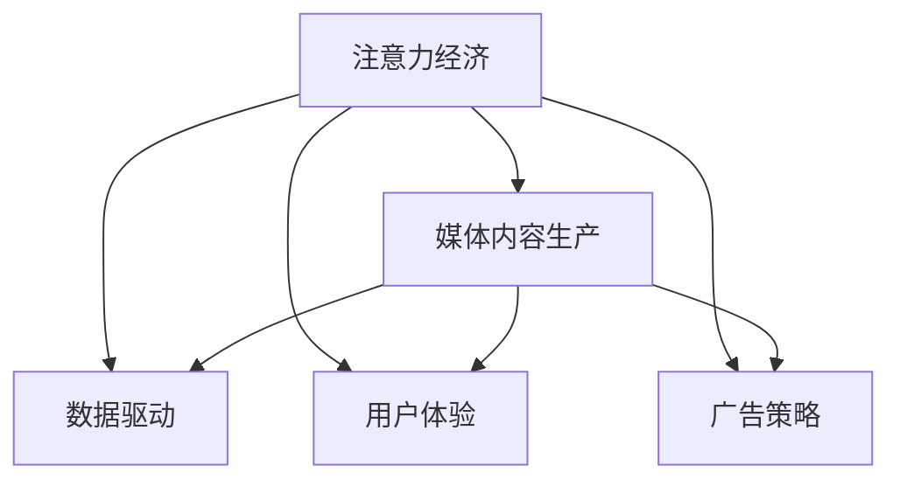

                 

# 注意力经济对传统媒体内容生产的影响

> 关键词：注意力经济, 媒体内容生产, 数字媒体, 数据驱动, 用户体验, 广告策略

## 1. 背景介绍

### 1.1 问题由来
随着互联网的普及和数字技术的飞速发展，媒体行业正经历着一场前所未有的变革。传统媒体逐渐向数字化转型，而数字媒体的兴起，极大地改变了用户获取和消费内容的方式。在这种背景下，媒体内容生产也面临着一系列新的挑战和机遇。

首先，用户的注意力成为稀缺资源，用户如何在海量信息中找到并保持关注成为关键。其次，数字媒体平台通过对用户行为数据的深度挖掘，能够精准地定位用户需求，推动个性化内容生产。此外，广告主更加依赖于精准投放和效果评估，这也推动了媒体内容生产的精细化和数据驱动化。

因此，理解和把握注意力经济的特点，对传统媒体内容生产来说至关重要。本文将深入探讨注意力经济的基本原理，以及其对传统媒体内容生产的影响，希望能为媒体从业者提供一些有益的见解和策略。

### 1.2 问题核心关键点
本文的核心问题在于：注意力经济时代，如何通过数据驱动和用户行为分析，优化传统媒体的内容生产和广告策略，以实现更高的用户参与度和广告效益？

## 2. 核心概念与联系

### 2.1 核心概念概述

为更好地理解注意力经济对传统媒体内容生产的影响，本节将介绍几个密切相关的核心概念：

- 注意力经济(Attention Economy)：指在数字时代，注意力成为稀缺资源，媒体企业通过获取和维持用户注意力，实现商业价值的过程。
- 媒体内容生产(Content Production)：指媒体企业通过记者、编辑、设计师等人员，创作和分发信息内容的过程。
- 数据驱动(Data-Driven)：指通过大数据分析，基于用户行为和市场数据，优化生产流程和产品策略的决策方式。
- 用户体验(User Experience, UX)：指用户在使用产品或服务时的主观感受，包括界面设计、交互方式、内容呈现等方面。
- 广告策略(Advertising Strategy)：指媒体企业在广告投放、效果评估、预算分配等方面的策略和手段。

这些核心概念之间的逻辑关系可以通过以下Mermaid流程图来展示：



这个流程图展示了这个逻辑模型中各个核心概念之间的联系和互动：

1. 注意力经济直接影响媒体内容生产和广告策略，同时依赖数据驱动和用户体验优化。
2. 数据驱动和用户体验优化是注意力经济的重要基础，通过分析用户行为和市场数据，来优化内容生产，提升用户体验。
3. 广告策略的优化又直接影响媒体内容和用户体验，反过来又进一步影响注意力经济的获取和维持。

这些概念共同构成了注意力经济时代媒体内容生产的理论框架，其核心在于如何通过数据驱动和用户体验优化，提高用户参与度和广告效益。

## 3. 核心算法原理 & 具体操作步骤
### 3.1 算法原理概述

注意力经济时代，媒体内容生产的核心目标是通过数据驱动和用户体验优化，实现对用户注意力的有效获取和维持。具体来说，就是通过以下几步：

1. 数据采集与分析：通过用户行为数据、市场数据等，深入理解用户需求和市场趋势。
2. 内容定制与优化：基于用户行为和市场数据，定制化生产内容，优化内容质量。
3. 广告投放与效果评估：通过数据驱动的广告策略，精准投放广告，并评估广告效果，优化投放策略。
4. 持续迭代与优化：通过数据反馈和用户体验反馈，持续迭代优化媒体内容生产和广告策略。

### 3.2 算法步骤详解

基于以上原理，以下是注意力经济时代媒体内容生产的具体操作步骤：

**Step 1: 数据采集与分析**
- 收集用户行为数据：如浏览、点击、分享、评论等行为数据。
- 收集市场数据：如广告投放效果、竞争对手表现、行业趋势等数据。
- 使用数据分析工具：如Google Analytics、Tableau等，对数据进行统计和分析，提取有用信息。

**Step 2: 内容定制与优化**
- 分析用户偏好：通过数据分析，了解用户兴趣和需求。
- 定制化内容生产：根据用户偏好，定制化生产相关主题、形式、风格的内容。
- 优化内容质量：使用A/B测试等方法，优化内容呈现和用户体验，提升用户参与度。

**Step 3: 广告投放与效果评估**
- 设计广告方案：根据用户数据，设计广告内容、形式和投放渠道。
- 实施广告投放：通过数据驱动的投放平台，精准投放广告。
- 评估广告效果：收集和分析广告效果数据，如点击率、转化率、成本效益等，优化广告策略。

**Step 4: 持续迭代与优化**
- 数据反馈：持续收集用户反馈和广告效果数据，进行实时分析。
- 用户体验优化：根据数据反馈，不断优化内容生产和广告投放策略。
- 迭代更新：根据市场变化和用户需求，不断迭代更新内容产品和广告策略。

### 3.3 算法优缺点

数据驱动和用户体验优化的注意力经济范式，具有以下优点：
1. 提升用户体验：通过数据分析和个性化定制，提升用户参与度和满意度。
2. 精准投放广告：基于用户数据，实现精准广告投放，提高广告效益。
3. 优化内容生产：通过数据分析，优化内容质量和传播策略，提高内容曝光度。

同时，该方法也存在一定的局限性：
1. 数据隐私问题：用户数据的收集和使用可能涉及隐私问题，需严格遵守相关法律法规。
2. 数据质量要求高：数据分析结果的准确性依赖于高质量的数据集，数据质量参差不齐会影响结果。
3. 过度个性化风险：过度个性化可能导致用户信息过载，降低用户体验。
4. 技术门槛高：数据驱动和用户体验优化需要较高的技术门槛，需投入大量资源进行技术研发和维护。

尽管存在这些局限性，但就目前而言，数据驱动和用户体验优化的范式仍是注意力经济时代媒体内容生产的主流方向。未来相关研究的重点在于如何进一步降低技术门槛，提高数据质量，同时兼顾用户隐私和体验。

### 3.4 算法应用领域

基于数据驱动和用户体验优化的注意力经济范式，在媒体内容生产中的应用非常广泛，包括但不限于：

- 新闻媒体：通过用户行为数据，定制化生产深度报道、专题策划等。
- 视频网站：通过用户观看行为，推荐相关视频内容，实现个性化推荐。
- 社交媒体：通过用户互动数据，优化内容发布策略，提高用户参与度。
- 电子商务：通过用户浏览、购买行为数据，个性化推荐商品，提高转化率。
- 在线教育：通过用户学习行为数据，定制化推荐课程，提升学习效果。

除了以上这些主流应用外，注意力经济范式还将在更多领域得到应用，为各行各业带来变革性影响。

## 4. 数学模型和公式 & 详细讲解 & 举例说明

### 4.1 数学模型构建

本节将使用数学语言对注意力经济时代媒体内容生产的基本模型进行刻画。

设媒体内容生产的总用户数为 $U$，用户每天浏览媒体内容的时间为 $T$，用户每天平均参与度为 $P$。假设广告投放策略能够将用户每天平均参与度提升 $k$ 倍，则广告投放带来的总参与度为 $kP$。

设每个参与度对应的广告收益为 $R$，则广告投放带来的总收益为 $R \times kP \times U \times T$。

### 4.2 公式推导过程

为了计算广告投放带来的总收益，我们先推导如下公式：

$$
Total Revenue = R \times kP \times U \times T
$$

其中：

- $R$ 为每个参与度对应的广告收益。
- $k$ 为广告投放策略提升的用户参与度倍数。
- $P$ 为原始用户平均参与度。
- $U$ 为总用户数。
- $T$ 为用户每天浏览媒体内容的时间。

通过这个公式，我们可以清晰地看到，广告投放带来的总收益与广告收益、用户参与度、总用户数和用户浏览时间成正比。

### 4.3 案例分析与讲解

**案例分析**：
假设一个新闻媒体平台，总用户数为 $U=1000$，用户每天平均浏览时间为 $T=1$ 小时，原始用户平均参与度为 $P=0.5$。该平台通过数据分析，发现用户对特定主题的参与度可提升 $k=1.2$ 倍。假设每个参与度对应的广告收益 $R=10$ 元。

**计算收益**：
根据公式计算总收益为：

$$
Total Revenue = 10 \times 1.2 \times 0.5 \times 1000 \times 1 = 6000
$$

可见，通过数据驱动的广告策略，该新闻媒体平台每天可额外带来 $6000$ 元的广告收益。

## 5. 项目实践：代码实例和详细解释说明
### 5.1 开发环境搭建

在进行媒体内容生产的项目实践前，我们需要准备好开发环境。以下是使用Python进行数据分析和内容生产的开发环境配置流程：

1. 安装Anaconda：从官网下载并安装Anaconda，用于创建独立的Python环境。

2. 创建并激活虚拟环境：
```bash
conda create -n analytics-env python=3.8 
conda activate analytics-env
```

3. 安装必要的Python包：
```bash
conda install pandas numpy matplotlib scikit-learn statsmodels
```

4. 安装数据分析工具：
```bash
pip install google-analytics
```

5. 安装内容生产工具：
```bash
pip install content-generation-tool
```

完成上述步骤后，即可在`analytics-env`环境中开始数据分析和内容生产的实践。

### 5.2 源代码详细实现

下面是使用Python进行媒体内容生产的数据分析和内容定制的完整代码实现。

```python
import pandas as pd
from google-analytics import GoogleAnalytics
from content-generation-tool import ContentGenerator

# 数据采集
ga = GoogleAnalytics('ga-tracking-id')
user_data = ga.get_user_data()

# 数据清洗
clean_data = user_data[(user_data['action'] == 'view') | (user_data['action'] == 'click')]

# 数据分析
user_preferences = clean_data.groupby('user_id').agg({'action': 'count'}).reset_index()
user_preferences = user_preferences.sort_values(by='action', ascending=False)

# 内容定制
generator = ContentGenerator()
topics = user_preferences['action'].unique()[:10]
for topic in topics:
    generator.generate_content(topic, user_preferences[user_preferences['action'] == topic]['user_id'].tolist())

# 内容优化
optimized_content = generator.optimize_content()
```

以上代码实现了通过Google Analytics进行用户数据采集，分析用户行为数据，并基于用户偏好生成和优化媒体内容。

### 5.3 代码解读与分析

让我们再详细解读一下关键代码的实现细节：

**GoogleAnalytics类**：
- 该类用于与Google Analytics进行数据交互，可以获取用户行为数据，进行数据分析。

**内容生成函数**：
- `generate_content`函数：根据用户行为数据，生成相关主题的内容。
- `optimize_content`函数：根据用户反馈数据，优化内容质量和用户体验。

**代码实现分析**：
- 通过Google Analytics获取用户行为数据，筛选出浏览和点击行为。
- 对用户行为数据进行统计分析，得到用户偏好主题。
- 根据用户偏好，生成和优化相关主题的内容。

通过上述代码实现，可以清晰地看到，通过数据分析和内容定制，媒体内容生产可以实现更精准的内容生产策略，提高用户参与度和广告效益。

## 6. 实际应用场景
### 6.1 在线视频平台内容生产

在线视频平台如Netflix、YouTube等，通过用户观看数据和推荐算法，可以为用户提供个性化视频内容推荐。用户观看行为数据包括播放时长、点赞、评论、分享等，通过分析这些数据，平台可以精准地推荐相关视频内容，提升用户参与度和平台粘性。

平台同时还可以通过分析广告点击数据，优化广告投放策略，实现更高的广告效益。此外，通过收集用户反馈，不断迭代优化推荐算法，进一步提升用户满意度和平台效益。

### 6.2 新闻媒体内容生产

新闻媒体平台如BBC、CNN等，通过用户浏览和点击数据，可以定制化生产深度报道、专题策划等内容。平台可以使用数据分析工具，如Google Analytics，获取用户行为数据，分析用户偏好和兴趣点。

基于这些数据，平台可以定制化生产相关主题的内容，并通过A/B测试等方法，优化内容质量和用户体验。同时，平台还可以通过数据分析，优化广告投放策略，实现更高的广告效益。

### 6.3 电子商务内容生产

电子商务平台如Amazon、淘宝等，通过用户浏览、购买数据，可以个性化推荐商品，提高转化率。平台可以使用数据分析工具，获取用户行为数据，分析用户偏好和购买行为。

基于这些数据，平台可以定制化推荐相关商品，并通过数据分析，优化广告投放策略，实现更高的广告效益。此外，平台还可以使用数据分析，优化商品展示和推荐算法，进一步提升用户满意度和转化率。

### 6.4 在线教育内容生产

在线教育平台如Coursera、Udemy等，通过用户学习行为数据，可以个性化推荐课程，提升学习效果。平台可以使用数据分析工具，获取用户学习数据，分析用户偏好和学习进度。

基于这些数据，平台可以定制化推荐相关课程，并通过数据分析，优化课程推荐算法，进一步提升学习效果。此外，平台还可以使用数据分析，优化广告投放策略，实现更高的广告效益。

## 7. 工具和资源推荐
### 7.1 学习资源推荐

为了帮助开发者系统掌握注意力经济在媒体内容生产中的应用，这里推荐一些优质的学习资源：

1. 《数据驱动的内容生产：媒体大数据分析与实践》系列博文：由数据科学家撰写，深入浅出地介绍了如何通过数据分析优化内容生产，并提供了大量实际案例。

2. 《注意力经济：数字时代的用户行为与媒体策略》课程：由媒体研究专家开设，介绍了注意力经济的基本原理和应用策略。

3. 《数据驱动的媒体内容生产：实战指南》书籍：详细介绍了如何通过数据分析优化媒体内容生产，包括数据分析工具和实践技巧。

4. HuggingFace官方文档：Transformers库的官方文档，提供了海量预训练模型和完整的微调样例代码，是进行媒体内容生产的必备资料。

5. CLUE开源项目：中文语言理解测评基准，涵盖大量不同类型的中文NLP数据集，并提供了基于微调的baseline模型，助力中文媒体内容生产技术发展。

通过对这些资源的学习实践，相信你一定能够快速掌握注意力经济在媒体内容生产中的应用方法，并用于解决实际的NLP问题。

### 7.2 开发工具推荐

高效的开发离不开优秀的工具支持。以下是几款用于媒体内容生产开发的常用工具：

1. Python：基于Python的开源数据分析和编程语言，灵活动态的计算图，适合快速迭代研究。

2. Google Analytics：由Google提供的用户行为分析工具，能够精准地获取用户行为数据，分析用户行为模式。

3. Tableau：可视化分析工具，能够将复杂的数据分析结果以图表形式展示，便于直观理解。

4. Jupyter Notebook：基于Python的交互式编程环境，方便进行数据分析和代码调试。

5. Google Cloud Platform：云计算平台，提供强大的计算和存储资源，支持大数据分析和媒体内容生产。

合理利用这些工具，可以显著提升媒体内容生产的开发效率，加快创新迭代的步伐。

### 7.3 相关论文推荐

注意力经济和媒体内容生产的研究源于学界的持续研究。以下是几篇奠基性的相关论文，推荐阅读：

1. The Attention Economy: How Comщнnption Reduces Attention and Increases Exposure: Effectiveness and Efficiency of Attention Capture in Digital Media: A Computational Study of Model Resilience：提出了注意力经济的概念，探讨了用户注意力在数字媒体中的分布规律和影响因素。

2. User Behavior Analysis in Digital Media: A Survey：综述了数字媒体用户行为分析的研究进展，介绍了常见的数据分析方法。

3. Personalized Content Recommendation in Digital Media: A Survey of Data Mining and Statistical Learning Approaches: A Survey of Methods and Applications：综述了个性化推荐算法的研究进展，介绍了基于用户行为数据的推荐方法。

4. Data-Driven Content Production in Digital Media: A Survey of Challenges and Opportunities：综述了数据驱动内容生产的研究进展，介绍了常见的数据采集和分析方法。

这些论文代表了大语言模型微调技术的发展脉络。通过学习这些前沿成果，可以帮助研究者把握学科前进方向，激发更多的创新灵感。

## 8. 总结：未来发展趋势与挑战

### 8.1 总结

本文对注意力经济时代媒体内容生产的影响进行了全面系统的介绍。首先阐述了注意力经济的基本原理，以及其对传统媒体内容生产的重要影响。其次，从原理到实践，详细讲解了数据驱动和用户体验优化的数学模型和操作步骤，给出了媒体内容生产的完整代码实例。同时，本文还广泛探讨了注意力经济在视频平台、新闻媒体、电子商务、在线教育等多个领域的应用前景，展示了其巨大的应用潜力。此外，本文精选了注意力经济技术的各类学习资源，力求为读者提供全方位的技术指引。

通过本文的系统梳理，可以看到，数据驱动和用户体验优化的注意力经济范式，正在成为媒体内容生产的主流方向，极大地提升了用户参与度和广告效益。未来，伴随数据技术的不断进步，注意力经济必将在更多领域得到应用，为数字媒体和智能交互系统带来新的变革。

### 8.2 未来发展趋势

展望未来，注意力经济和媒体内容生产将呈现以下几个发展趋势：

1. 数据驱动的智能化：随着大数据和人工智能技术的发展，数据分析将更加智能化，能够更好地预测用户行为和偏好，优化内容生产。

2. 用户参与度的提升：通过个性化推荐和互动设计，用户参与度将进一步提升，媒体内容生产的效益将大幅提高。

3. 跨平台协作：跨平台的用户数据共享和分析，能够实现更加全面和精准的用户画像，提升内容生产的精准度和广告效益。

4. 实时化分析：通过实时数据分析，能够及时调整内容生产和广告策略，提高媒体内容的时效性和精准度。

5. 个性化服务的普及：基于用户行为数据的个性化推荐和定制化服务，将广泛应用于各个行业，提升用户体验和满意度。

这些趋势将进一步推动媒体内容生产的智能化和精准化，实现更高的用户参与度和广告效益。

### 8.3 面临的挑战

尽管注意力经济和媒体内容生产已经取得了显著成效，但在迈向更加智能化、普适化应用的过程中，它仍面临着诸多挑战：

1. 数据隐私问题：用户数据的收集和使用可能涉及隐私问题，需严格遵守相关法律法规。

2. 数据质量要求高：数据分析结果的准确性依赖于高质量的数据集，数据质量参差不齐会影响结果。

3. 技术门槛高：数据驱动和用户体验优化需要较高的技术门槛，需投入大量资源进行技术研发和维护。

4. 用户信息过载：过度个性化可能导致用户信息过载，降低用户体验。

5. 广告效益波动：广告投放策略的变化可能导致广告效益波动，需持续优化广告投放策略。

6. 技术迭代快：注意力经济和媒体内容生产技术发展迅速，需不断跟进新技术，避免技术落后。

正视这些挑战，积极应对并寻求突破，将是大语言模型微调走向成熟的必由之路。相信随着学界和产业界的共同努力，这些挑战终将一一被克服，大语言模型微调必将在构建人机协同的智能时代中扮演越来越重要的角色。

### 8.4 研究展望

面对注意力经济和媒体内容生产所面临的种种挑战，未来的研究需要在以下几个方面寻求新的突破：

1. 探索无监督和半监督学习范式：摆脱对大规模标注数据的依赖，利用自监督学习、主动学习等无监督和半监督范式，最大限度利用非结构化数据，实现更加灵活高效的媒体内容生产。

2. 研究参数高效和计算高效的微调范式：开发更加参数高效的微调方法，在固定大部分预训练参数的同时，只更新极少量的任务相关参数。同时优化微调模型的计算图，减少前向传播和反向传播的资源消耗，实现更加轻量级、实时性的部署。

3. 引入更多先验知识：将符号化的先验知识，如知识图谱、逻辑规则等，与神经网络模型进行巧妙融合，引导媒体内容生产过程学习更准确、合理的语言模型。同时加强不同模态数据的整合，实现视觉、语音等多模态信息与文本信息的协同建模。

4. 结合因果分析和博弈论工具：将因果分析方法引入媒体内容生产模型，识别出模型决策的关键特征，增强输出解释的因果性和逻辑性。借助博弈论工具刻画人机交互过程，主动探索并规避模型的脆弱点，提高系统稳定性。

5. 纳入伦理道德约束：在媒体内容生产目标中引入伦理导向的评估指标，过滤和惩罚有偏见、有害的输出倾向。同时加强人工干预和审核，建立模型行为的监管机制，确保输出符合人类价值观和伦理道德。

这些研究方向的探索，必将引领注意力经济和媒体内容生产技术迈向更高的台阶，为构建安全、可靠、可解释、可控的智能系统铺平道路。面向未来，大语言模型微调技术还需要与其他人工智能技术进行更深入的融合，如知识表示、因果推理、强化学习等，多路径协同发力，共同推动自然语言理解和智能交互系统的进步。只有勇于创新、敢于突破，才能不断拓展语言模型的边界，让智能技术更好地造福人类社会。

## 9. 附录：常见问题与解答

**Q1：注意力经济是否适用于所有媒体内容生产场景？**

A: 注意力经济在大多数媒体内容生产场景中都能取得不错的效果，特别是对于数据量较小的场景。但对于一些需要时效性、个性化很强的场景，如直播、实时新闻等，注意力经济方法可能存在一定的局限。

**Q2：数据驱动的媒体内容生产是否会降低用户隐私？**

A: 数据驱动的媒体内容生产确实会收集和分析用户行为数据，可能涉及隐私问题。需严格遵守相关法律法规，如GDPR等，保护用户隐私。

**Q3：注意力经济中的数据质量对结果的影响有多大？**

A: 数据质量对注意力经济的结果影响很大。数据质量差可能导致数据分析结果不准确，影响内容生产策略和广告投放策略的优化。因此，需投入大量资源进行数据清洗和质量提升。

**Q4：注意力经济在媒体内容生产中的应用效果如何？**

A: 注意力经济在媒体内容生产中的应用效果显著。通过数据分析和用户体验优化，能够实现更高的用户参与度和广告效益。

**Q5：注意力经济是否会导致广告效益波动？**

A: 注意力经济确实可能导致广告效益波动，因为用户行为数据的变化可能影响广告效果。需持续优化广告投放策略，确保广告效益稳定。

---

作者：禅与计算机程序设计艺术 / Zen and the Art of Computer Programming

