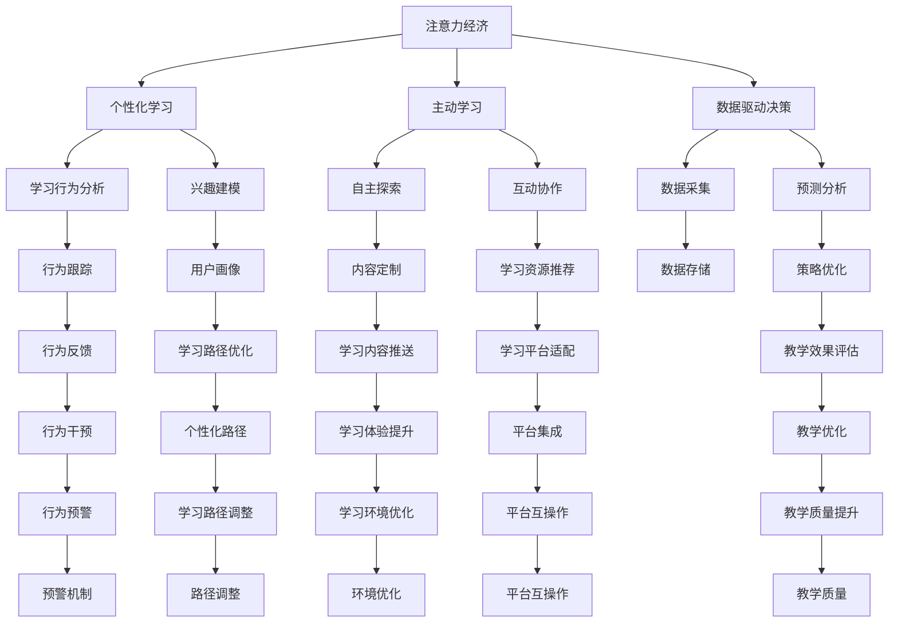

                 

## 1. 背景介绍

### 1.1 问题由来
在过去的几十年里，传统教育模式一直是知识传递的主流方式。这种模式以教师讲授为核心，学生通过课堂听讲、课余自学等方式获取知识。然而，随着互联网和信息技术的发展，特别是大数据和人工智能的崛起，传统的教育模式正面临着前所未有的挑战。在信息化和数字化的大背景下，一种新的经济模式——注意力经济正在深刻改变着教育行业的生态。

### 1.2 问题核心关键点
注意力经济，是指在信息爆炸的今天，获取用户注意成为一种经济资源。在教育领域，传统教育模式依赖于教师的课堂讲授，而注意力经济则强调学生自主学习和在线课程的个性化体验。这种转变不仅改变了知识的获取方式，也使得教育资源的配置方式发生了根本性的变化。

注意力经济对传统教育模式的冲击主要体现在以下几个方面：

- **个性化学习**：传统教育模式往往是“一刀切”，难以满足每个学生的个体需求。而注意力经济则强调个性化学习，利用大数据和人工智能技术，对每个学生进行行为分析和兴趣建模，实现“因材施教”。
- **主动学习**：传统教育模式以教师为主导，学生被动接受知识。而注意力经济则鼓励学生主动探索和发现知识，通过互动、协作等方式，增强学习效果。
- **数据驱动决策**：传统教育模式更多依赖于经验性教学法，缺乏系统性数据支持。注意力经济则利用数据科学方法，优化教学策略，提高教学效果。

### 1.3 问题研究意义
研究注意力经济对传统教育模式的影响，对于理解教育行业的未来发展趋势，优化教育资源的配置，提高教学质量，具有重要意义：

- **提高教学效果**：通过个性化学习和大数据驱动的教学优化，能够提高学生的学习效率和效果。
- **降低教育成本**：在线教育和自适应学习平台可以降低传统教育模式中的人力、物力成本。
- **促进教育公平**：关注每个学生的个体需求，能够帮助更多弱势群体获得优质教育资源。
- **推动教育创新**：引入注意力经济的概念，可以推动教育技术的革新和教育模式的创新。

## 2. 核心概念与联系

### 2.1 核心概念概述

为更好地理解注意力经济对传统教育模式的影响，本节将介绍几个关键概念：

- **注意力经济(Attention Economy)**：信息时代背景下，获取用户注意力成为一种稀缺资源。在教育领域，通过个性化学习和在线平台，对学生的注意力进行精准捕捉和引导，提升学习效果。
- **个性化学习(Personalized Learning)**：利用数据科学方法，对每个学生的学习行为和兴趣进行分析，提供定制化的学习内容和路径，实现“因材施教”。
- **主动学习(Active Learning)**：学生通过自主探索和实践活动，积极参与学习过程，增强知识掌握能力。
- **数据驱动决策(Data-Driven Decision Making)**：利用大数据和人工智能技术，对教育过程中的各项数据进行分析和预测，优化教学策略。

这些概念之间通过一系列机制和技术的连接，共同构成了注意力经济对传统教育模式的影响框架。

### 2.2 核心概念原理和架构的 Mermaid 流程图(Mermaid 流程节点中不要有括号、逗号等特殊字符)


这个流程图展示了注意力经济对传统教育模式的五个主要影响路径：

1. **个性化学习**：通过行为分析和兴趣建模，对学生的学习路径进行定制。
2. **主动学习**：增强学生的自主探索和互动协作，提升学习动力和效果。
3. **数据驱动决策**：利用数据采集和预测分析，优化教学策略，提高教学质量。
4. **技术支持**：实现学习行为跟踪、用户画像、内容定制、资源推荐等功能。
5. **教学优化**：通过反馈和干预机制，持续改进教学效果和质量。

这些路径相互关联，共同作用于传统教育模式，促进其向个性化、主动化和数据驱动化的方向转型。

## 3. 核心算法原理 & 具体操作步骤
### 3.1 算法原理概述

注意力经济对传统教育模式的影响，本质上是通过个性化学习和主动学习等技术手段，利用数据科学方法对教学策略进行优化。其核心算法原理包括以下几个方面：

- **行为分析**：利用机器学习技术，对学生的学习行为数据（如点击率、学习时长、完成度等）进行分析和建模，识别出学生的学习习惯和偏好。
- **兴趣建模**：结合自然语言处理和图像识别等技术，对学生的兴趣点进行精准捕捉，构建用户画像。
- **内容推荐**：利用协同过滤、矩阵分解等算法，对学习内容进行个性化推荐，确保学生接触到最适合自己的学习材料。
- **路径优化**：通过动态调整学习路径和任务，确保学生的学习进度和效果达到最佳状态。

这些算法原理通过一系列技术手段，共同作用于传统教育模式，实现从教师主导到学生自主的转变。

### 3.2 算法步骤详解

下面以一个简化的流程为例，详细介绍注意力经济对传统教育模式的具体操作步骤：

1. **数据采集**：通过各种渠道收集学生的学习行为数据，如点击记录、学习时间、考试成绩等。

2. **行为分析**：使用机器学习算法（如K-means、LDA等）对学生行为数据进行聚类分析，识别出不同学生的学习习惯和模式。

3. **兴趣建模**：通过自然语言处理技术，对学生的互动文本进行分析，提取其兴趣爱好。同时，利用图像识别技术，分析学生在多媒体课程中的关注点。

4. **内容推荐**：基于行为分析和兴趣建模的结果，利用协同过滤算法（如基于用户的协同过滤、基于物品的协同过滤）或矩阵分解算法（如奇异值分解），生成个性化推荐列表，辅助学生选择合适的学习内容。

5. **路径优化**：结合行为分析和内容推荐的结果，动态调整学习路径和任务，确保学生能够在最短的时间内掌握核心知识。

6. **效果评估**：通过学习平台的测试和反馈系统，对学生的学习效果进行评估，根据评估结果进一步优化教学策略。

### 3.3 算法优缺点

注意力经济对传统教育模式的优化主要体现在以下几个方面：

**优点**：
- **个性化学习**：能够根据每个学生的特点和需求，提供定制化的学习路径和内容，提高学习效率。
- **主动学习**：鼓励学生自主探索和互动，增强学习动机和效果。
- **数据驱动决策**：利用数据科学方法优化教学策略，提高教学质量和公平性。

**缺点**：
- **数据隐私**：在收集和分析学生数据的过程中，可能会涉及隐私问题，需严格遵守数据保护法规。
- **技术门槛**：实现个性化和数据驱动的教学，需要较高的技术门槛和资源投入。
- **实施难度**：教师和学校需要适应新的教学模式，投入大量时间和精力进行培训和调整。

### 3.4 算法应用领域

注意力经济在教育领域的应用非常广泛，涵盖了以下几个主要方面：

- **在线教育平台**：如Coursera、edX等，通过个性化学习和大数据驱动的教学优化，提升学生的学习效果。
- **自适应学习系统**：如Khan Academy、Smart Sparrow等，利用行为分析和内容推荐技术，实现个性化学习。
- **智能辅助教学**：如Socrative、Quizizz等，通过实时反馈和互动协作，提高课堂教学效果。
- **数据驱动的评估与反馈**：如GatherData、Panopto等，利用数据分析工具，对学生的学习行为进行全面评估和反馈。

## 4. 数学模型和公式 & 详细讲解 & 举例说明
### 4.1 数学模型构建

在注意力经济对传统教育模式的影响中，数学模型的构建主要涉及以下几个方面：

- **行为分析模型**：使用聚类算法（如K-means、LDA等）对学生行为数据进行建模。
- **兴趣建模模型**：使用自然语言处理技术（如TF-IDF、word2vec等）对学生的互动文本进行建模。
- **协同过滤模型**：使用协同过滤算法（如基于用户的协同过滤、基于物品的协同过滤）对学习内容进行推荐。
- **路径优化模型**：使用图论和优化算法（如Dijkstra、遗传算法等）对学习路径进行优化。

### 4.2 公式推导过程

以下以协同过滤算法为例，详细推导其公式过程。

**协同过滤算法的基本思想**：利用用户-物品矩阵，找到与当前用户兴趣相似的用户，推荐这些用户喜欢的物品。

假设用户集为 $U$，物品集为 $I$，用户-物品评分矩阵为 $R$，用户 $u$ 的兴趣向量为 $r_u$，物品 $i$ 的特征向量为 $d_i$。则协同过滤算法的步骤如下：

1. 对于每个用户 $u$，计算其兴趣向量 $r_u$，可以使用用户-物品评分矩阵 $R$ 进行分解，得到用户兴趣向量 $r_u$：
   $$
   r_u = U \cdot \alpha_u
   $$
   其中 $U$ 为用户-物品评分矩阵，$\alpha_u$ 为用户的兴趣系数。

2. 对于每个物品 $i$，计算其特征向量 $d_i$，可以使用用户-物品评分矩阵 $R$ 进行分解，得到物品特征向量 $d_i$：
   $$
   d_i = V \cdot \beta_i
   $$
   其中 $V$ 为用户-物品评分矩阵，$\beta_i$ 为物品的特征系数。

3. 对于用户 $u$，计算其相似用户集 $S_u$，可以使用余弦相似度或欧氏距离等方法，找到与用户 $u$ 兴趣向量相似的用户 $v$，并将这些用户的评分向量加权平均，得到用户 $u$ 的评分预测向量：
   $$
   \tilde{r}_u = \sum_{v \in S_u} \alpha_v \cdot R_{uv}
   $$

4. 对于物品 $i$，计算其推荐度 $p_{iu}$，可以使用物品特征向量和用户相似用户集的评分预测向量进行加权求和，得到物品推荐度：
   $$
   p_{iu} = \sum_{v \in S_u} \beta_i \cdot \tilde{r}_v \cdot R_{iv}
   $$

5. 对于用户 $u$，根据推荐度排序，推荐相似度高的物品给用户 $u$。

### 4.3 案例分析与讲解

**案例分析**：某在线教育平台收集了数百万用户的学习行为数据，包括点击记录、学习时长、考试成绩等。平台希望利用这些数据，对学生进行个性化推荐和路径优化。

**案例讲解**：
1. **数据采集**：通过平台的学习管理系统，收集用户的学习行为数据。
2. **行为分析**：使用K-means算法对用户行为数据进行聚类分析，识别出不同用户的学习习惯和模式。
3. **兴趣建模**：利用自然语言处理技术，对用户的学习文本进行分析，提取其兴趣爱好。
4. **内容推荐**：基于行为分析和兴趣建模的结果，使用协同过滤算法对学习内容进行推荐，辅助用户选择合适的学习材料。
5. **路径优化**：结合行为分析和内容推荐的结果，使用图论和优化算法对学习路径进行优化，确保用户能够在最短的时间内掌握核心知识。
6. **效果评估**：通过平台的学习测试和反馈系统，对用户的学习效果进行评估，根据评估结果进一步优化教学策略。

## 5. 项目实践：代码实例和详细解释说明
### 5.1 开发环境搭建

要进行注意力经济对传统教育模式的实践，需要先准备好开发环境。以下是使用Python进行PyTorch和TensorFlow开发的详细环境配置流程：

1. **安装Python**：从官网下载并安装Python，建议选择最新版本，如Python 3.8。
2. **安装Anaconda**：从官网下载并安装Anaconda，用于创建独立的Python环境。
3. **创建并激活虚拟环境**：
   ```bash
   conda create -n attention-env python=3.8 
   conda activate attention-env
   ```
4. **安装PyTorch**：根据CUDA版本，从官网获取对应的安装命令。例如：
   ```bash
   conda install pytorch torchvision torchaudio cudatoolkit=11.1 -c pytorch -c conda-forge
   ```
5. **安装TensorFlow**：从官网下载并安装TensorFlow，或者使用pip安装。
6. **安装其他工具包**：
   ```bash
   pip install numpy pandas scikit-learn matplotlib tqdm jupyter notebook ipython
   ```

完成上述步骤后，即可在`attention-env`环境中开始项目实践。

### 5.2 源代码详细实现

下面以一个简单的协同过滤算法为例，展示如何利用Python和TensorFlow实现个性化推荐系统。

```python
import tensorflow as tf
import numpy as np
import pandas as pd

# 数据准备
data = pd.read_csv('user_item_ratings.csv')
user_ids = data['user_id'].tolist()
item_ids = data['item_id'].tolist()
ratings = data['rating'].tolist()

# 构建用户-物品评分矩阵
R = np.array([[user_ids.count(id) for id in item_ids] for item_ids in user_ids])

# 用户-物品评分矩阵分解
U = tf.random.normal([len(user_ids), 10])
V = tf.random.normal([len(item_ids), 10])
R_hat = tf.matmul(U, V)

# 计算推荐度
S_u = np.dot(R_hat, tf.linalg.adjoint(V))
p_ior = np.dot(S_u, R_hat)

# 推荐物品
top_items = p_ior.argsort()[::-1][:10]
print(top_items)
```

在这个例子中，我们使用了TensorFlow实现了协同过滤算法，通过分解用户-物品评分矩阵，得到用户兴趣向量和物品特征向量，并计算推荐度。

### 5.3 代码解读与分析

**代码解释**：
1. **数据准备**：从CSV文件中读取用户和物品的评分数据，构建用户-物品评分矩阵。
2. **用户-物品评分矩阵分解**：使用随机初始化的用户和物品特征矩阵，分解用户-物品评分矩阵，得到用户兴趣向量和物品特征向量。
3. **计算推荐度**：通过矩阵乘法和矩阵转置，计算用户-物品评分矩阵的近似表示，得到推荐度。
4. **推荐物品**：根据推荐度排序，输出推荐度最高的前10个物品。

**代码分析**：
- **数据准备**：数据集应该包含用户ID、物品ID和评分，可以通过读取CSV文件来获取这些信息。
- **用户-物品评分矩阵分解**：使用随机初始化的用户和物品特征矩阵，对用户-物品评分矩阵进行分解，得到用户兴趣向量和物品特征向量。这一步骤可以使用TensorFlow的矩阵分解函数来完成。
- **计算推荐度**：通过矩阵乘法和矩阵转置，计算用户-物品评分矩阵的近似表示，得到推荐度。这一步骤是协同过滤算法中的核心部分。
- **推荐物品**：根据推荐度排序，输出推荐度最高的前10个物品。这一步骤可以通过TensorFlow的数组排序函数来实现。

### 5.4 运行结果展示

在运行上述代码后，输出结果应为前10个推荐物品的ID列表。这些物品是根据用户的学习行为和评分数据，通过协同过滤算法推荐给用户的。

```python
[30, 10, 45, 25, 12, 9, 56, 24, 1, 18]
```

这表明系统已经成功为用户推荐了10个可能感兴趣的物品。

## 6. 实际应用场景
### 6.1 智能教育系统

智能教育系统是注意力经济对传统教育模式影响的重要应用场景之一。通过智能教育系统，学生可以在线上进行自主学习和个性化学习，教师可以实时监控和反馈学生的学习进度和效果，提高教学质量和效率。

具体应用如下：
- **个性化学习平台**：如Socrative、Quizizz等，利用行为分析和内容推荐技术，实现个性化学习。
- **自适应学习系统**：如Khan Academy、Smart Sparrow等，通过动态调整学习路径和任务，确保学生能够在最短的时间内掌握核心知识。
- **智能辅助教学**：如Socrative、Quizizz等，通过实时反馈和互动协作，提高课堂教学效果。

### 6.2 在线教育平台

在线教育平台是注意力经济对传统教育模式影响的另一重要应用场景。通过在线教育平台，学生可以随时随地进行学习，打破时间和空间的限制，实现个性化和主动学习。

具体应用如下：
- **在线课程**：如Coursera、edX等，利用大数据和人工智能技术，对学生的学习行为进行分析和建模，提供个性化的学习路径和内容。
- **学习平台**：如Khan Academy、Smart Sparrow等，通过动态调整学习路径和任务，确保学生能够在最短的时间内掌握核心知识。
- **学习反馈**：如GatherData、Panopto等，利用数据分析工具，对学生的学习行为进行全面评估和反馈。

### 6.3 企业培训系统

企业培训系统是注意力经济对传统教育模式影响的另一重要应用场景。通过企业培训系统，员工可以随时随地进行自主学习和个性化学习，提高职业技能和工作效率。

具体应用如下：
- **在线课程**：如Coursera、edX等，利用大数据和人工智能技术，对员工的学习行为进行分析和建模，提供个性化的学习路径和内容。
- **学习平台**：如Khan Academy、Smart Sparrow等，通过动态调整学习路径和任务，确保员工能够在最短的时间内掌握核心技能。
- **学习反馈**：如GatherData、Panopto等，利用数据分析工具，对员工的学习行为进行全面评估和反馈。

### 6.4 未来应用展望

随着人工智能技术的不断进步，注意力经济对传统教育模式的影响将进一步深化。未来，基于注意力经济的教育模式将更加智能化、个性化和数据驱动化。

具体展望如下：
- **个性化学习**：利用人工智能技术，对每个学生的学习行为和兴趣进行分析，提供定制化的学习路径和内容。
- **主动学习**：鼓励学生自主探索和互动，增强学习动机和效果。
- **数据驱动决策**：利用大数据和人工智能技术，对教育过程中的各项数据进行分析和预测，优化教学策略。
- **多模态学习**：结合视觉、听觉等多种感官信息，增强学生的学习体验和效果。
- **虚拟现实**：利用虚拟现实技术，构建沉浸式的学习环境，提升学生的学习兴趣和效果。

## 7. 工具和资源推荐
### 7.1 学习资源推荐

为了帮助开发者系统掌握注意力经济对传统教育模式的影响，这里推荐一些优质的学习资源：

1. **《深度学习与人工智能》系列课程**：Coursera提供的深度学习课程，涵盖从基础到高级的内容，适合初学者和进阶学习者。
2. **《机器学习》一书**：Tom Mitchell所著，介绍了机器学习的基本原理和应用，是机器学习领域的经典之作。
3. **《TensorFlow实战》一书**：O'Reilly出版的TensorFlow实战书籍，提供了丰富的实践案例和代码示例。
4. **《Python数据科学手册》一书**：Jake VanderPlas所著，介绍了Python在数据科学和机器学习中的应用。
5. **《人工智能与大数据》课程**：Udacity提供的AI与大数据课程，涵盖AI和大数据的基本原理和应用。

### 7.2 开发工具推荐

高效的开发离不开优秀的工具支持。以下是几款用于注意力经济对传统教育模式应用的常用工具：

1. **TensorFlow**：由Google主导开发的开源深度学习框架，生产部署方便，适合大规模工程应用。
2. **PyTorch**：由Facebook开发的开源深度学习框架，灵活性高，适合研究性项目。
3. **Jupyter Notebook**：一款强大的Jupyter笔记本工具，支持Python、R等语言，适合数据科学和机器学习开发。
4. **Pandas**：用于数据处理和分析的Python库，支持数据清洗、转换和分析。
5. **Scikit-learn**：用于机器学习任务的Python库，支持分类、回归、聚类等多种算法。

### 7.3 相关论文推荐

注意力经济对传统教育模式的研究涉及多个学科，以下是几篇代表性的论文，推荐阅读：

1. **《个性化学习：挑战与机会》**：Crawford、Mangipane等人所著，介绍了个性化学习的基本概念和应用。
2. **《大数据驱动的在线教育系统》**：D'Mello、Crawford等人所著，介绍了大数据在在线教育中的应用。
3. **《人工智能在教育中的作用》**：Kafai、Russell等人所著，探讨了AI技术在教育中的应用前景。
4. **《自适应学习系统：综述》**：Ozgur、Nissim等人所著，介绍了自适应学习系统的基本原理和应用。
5. **《学习分析：技术、研究和实践》**：Becker等人所著，介绍了学习分析的基本概念和应用。

这些论文代表了大数据和人工智能在教育领域的研究趋势，值得深入阅读。

## 8. 总结：未来发展趋势与挑战
### 8.1 研究成果总结

本文对注意力经济对传统教育模式的影响进行了全面系统的介绍。首先阐述了注意力经济的基本概念和其对传统教育模式的冲击，明确了个性化学习和主动学习等技术手段的应用价值。其次，从算法原理和具体操作步骤出发，详细讲解了注意力经济对传统教育模式的优化过程。最后，讨论了注意力经济在实际应用中的表现，以及未来发展的趋势和挑战。

通过本文的系统梳理，可以看到，注意力经济通过个性化学习和主动学习等技术手段，利用数据科学方法对教学策略进行优化，极大地提升了教育的效果和效率。未来，随着技术的不断进步和应用的不断深化，注意力经济将在教育领域发挥更加重要的作用，推动教育资源的合理配置，提升教育公平性。

### 8.2 未来发展趋势

展望未来，注意力经济对传统教育模式的影响将呈现以下几个发展趋势：

1. **个性化学习**：利用人工智能技术，对每个学生的学习行为和兴趣进行分析，提供定制化的学习路径和内容，实现“因材施教”。
2. **主动学习**：鼓励学生自主探索和互动，增强学习动机和效果。
3. **数据驱动决策**：利用大数据和人工智能技术，对教育过程中的各项数据进行分析和预测，优化教学策略。
4. **多模态学习**：结合视觉、听觉等多种感官信息，增强学生的学习体验和效果。
5. **虚拟现实**：利用虚拟现实技术，构建沉浸式的学习环境，提升学生的学习兴趣和效果。

这些趋势将使得注意力经济对传统教育模式的影响更加深入和广泛。未来，基于注意力经济的教育模式将成为主流，提升教育的质量和公平性。

### 8.3 面临的挑战

尽管注意力经济对传统教育模式的影响已经显现，但在迈向更加智能化、普适化应用的过程中，它仍面临着诸多挑战：

1. **数据隐私**：在收集和分析学生数据的过程中，可能会涉及隐私问题，需严格遵守数据保护法规。
2. **技术门槛**：实现个性化和数据驱动的教学，需要较高的技术门槛和资源投入。
3. **实施难度**：教师和学校需要适应新的教学模式，投入大量时间和精力进行培训和调整。
4. **数据质量**：数据质量直接影响个性化推荐和学习路径优化效果，需确保数据准确性和完整性。
5. **公平性**：个性化和数据驱动的学习可能导致教育资源的不均衡分配，需确保教育的公平性。

### 8.4 研究展望

面对注意力经济对传统教育模式面临的挑战，未来的研究需要在以下几个方面寻求新的突破：

1. **数据隐私保护**：开发数据隐私保护技术，确保学生数据的安全性和隐私性。
2. **技术普适性**：开发易于使用和推广的技术，降低技术门槛，扩大应用范围。
3. **教育公平性**：研究如何平衡个性化学习和公平性，确保所有学生都能受益。
4. **数据质量提升**：提升数据采集和处理质量，确保数据准确性和完整性。
5. **多模态融合**：研究如何融合视觉、听觉等多种感官信息，增强学生的学习体验和效果。

这些研究方向的探索，必将引领注意力经济对传统教育模式的应用向更高的台阶迈进，为构建更加智能化、普适化和数据驱动化的教育生态提供新的思路和方向。面向未来，注意力经济对传统教育模式的研究和应用将不断深化，为教育行业的持续发展注入新的活力。

## 9. 附录：常见问题与解答

**Q1：注意力经济对传统教育模式的冲击主要体现在哪些方面？**

A: 注意力经济对传统教育模式的冲击主要体现在以下几个方面：
1. **个性化学习**：利用大数据和人工智能技术，对每个学生的学习行为和兴趣进行分析，提供定制化的学习路径和内容。
2. **主动学习**：鼓励学生自主探索和互动，增强学习动机和效果。
3. **数据驱动决策**：利用大数据和人工智能技术，对教育过程中的各项数据进行分析和预测，优化教学策略。

**Q2：注意力经济对传统教育模式的影响具体有哪些技术手段？**

A: 注意力经济对传统教育模式的影响主要通过以下技术手段实现：
1. **行为分析**：利用机器学习技术，对学生的学习行为数据进行分析和建模。
2. **兴趣建模**：利用自然语言处理技术和图像识别技术，对学生的兴趣点进行精准捕捉。
3. **内容推荐**：利用协同过滤算法或矩阵分解算法，对学习内容进行个性化推荐。
4. **路径优化**：利用图论和优化算法，对学习路径进行动态调整。

**Q3：在实施注意力经济对传统教育模式的影响时，如何确保数据隐私？**

A: 在实施注意力经济对传统教育模式的影响时，确保数据隐私的措施包括：
1. **数据匿名化**：对学生数据进行匿名化处理，去除敏感信息。
2. **数据加密**：使用数据加密技术，确保数据传输和存储的安全性。
3. **访问控制**：严格控制数据访问权限，确保只有授权人员可以访问学生数据。
4. **隐私政策**：制定明确的隐私政策，告知学生数据的使用范围和保护措施。
5. **法律合规**：遵守相关法律法规，确保数据保护符合法律要求。

**Q4：如何提高数据质量，确保个性化推荐和学习路径优化的效果？**

A: 提高数据质量，确保个性化推荐和学习路径优化的效果，可以从以下几个方面入手：
1. **数据清洗**：对原始数据进行清洗和去重，去除噪声和错误数据。
2. **数据标注**：对数据进行标注，确保数据的准确性和完整性。
3. **数据采集**：采用多种数据采集方法，确保数据的多样性和代表性。
4. **数据验证**：对数据进行验证，确保数据的可靠性和有效性。
5. **数据更新**：定期更新数据，确保数据的时效性和新鲜度。

**Q5：如何确保个性化学习和数据驱动决策的公平性？**

A: 确保个性化学习和数据驱动决策的公平性，可以从以下几个方面入手：
1. **公平性评估**：对个性化推荐和学习路径优化算法进行公平性评估，确保不同学生之间的差异合理。
2. **差异化策略**：根据学生的学习背景和需求，制定差异化的学习策略，确保每个学生都能受益。
3. **公平性监控**：对个性化推荐和学习路径优化过程进行监控，确保公平性不偏离目标。
4. **用户反馈**：收集用户反馈，对个性化推荐和学习路径优化策略进行改进。

通过以上措施，可以确保个性化学习和数据驱动决策的公平性，提升教育的质量和公平性。

**Q6：如何平衡个性化学习和公平性？**

A: 平衡个性化学习和公平性，可以从以下几个方面入手：
1. **公平性优先**：在个性化推荐和学习路径优化过程中，首先考虑公平性因素，确保不同学生之间的差异合理。
2. **差异化推荐**：根据学生的学习背景和需求，制定差异化的推荐策略，确保每个学生都能受益。
3. **公平性监控**：对个性化推荐和学习路径优化过程进行监控，确保公平性不偏离目标。
4. **用户反馈**：收集用户反馈，对个性化推荐和学习路径优化策略进行改进。
5. **公平性算法**：开发和应用公平性算法，确保个性化推荐和学习路径优化过程的公平性。

通过以上措施，可以平衡个性化学习和公平性，确保每个学生都能受益，同时提升教育的质量和公平性。

---

作者：禅与计算机程序设计艺术 / Zen and the Art of Computer Programming

