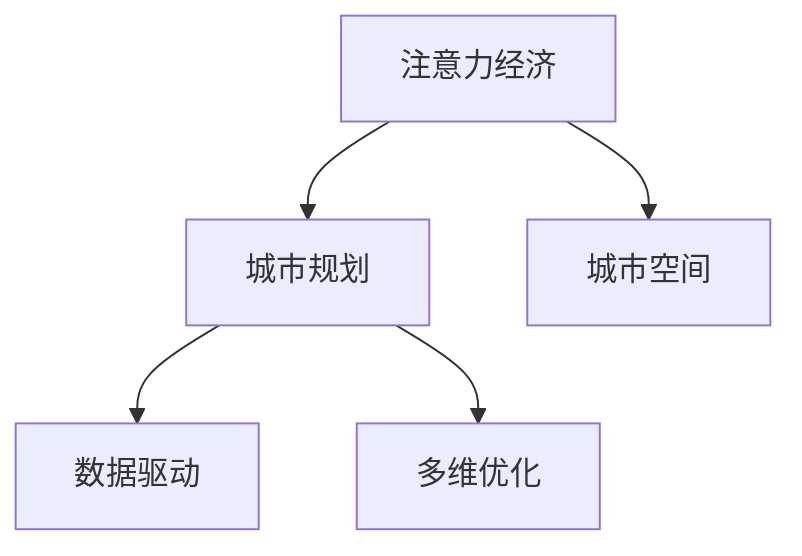
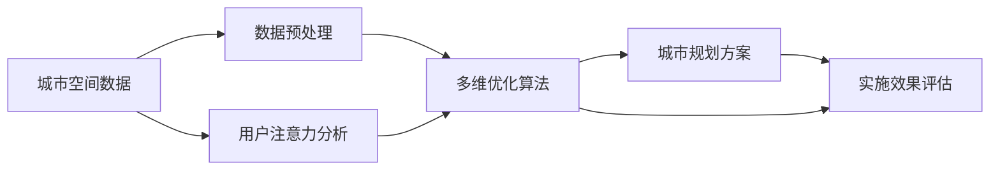

                 

## 1. 背景介绍

### 1.1 问题由来

随着信息技术的飞速发展，注意力经济成为一种全新的经济形态，其核心特征是信息资源的稀缺性和价值密度的提升。在城市规划领域，如何有效利用有限的城市空间资源，实现其最大化的经济效益和社会效益，成为研究的热点和焦点。

### 1.2 问题核心关键点

本节将详细探讨注意力经济对城市规划的新要求，包括注意力经济的基本概念、其对城市资源配置的影响，以及具体的规划策略和实施路径。

## 2. 核心概念与联系

### 2.1 核心概念概述

为更好地理解注意力经济对城市规划的影响，本节将介绍几个核心概念：

- 注意力经济（Attention Economy）：信息时代经济模式之一，强调信息的价值和用户注意力的重要性。
- 城市规划（Urban Planning）：通过合理配置城市资源，优化城市空间结构，提高城市功能性和宜居性。
- 城市空间（Urban Space）：城市中可供开发利用的空间资源，包括土地、建筑、交通等。
- 数据驱动（Data-Driven）：利用大数据和人工智能技术，科学决策和优化城市规划。
- 多维优化（Multi-Objective Optimization）：综合考虑经济、社会、环境等多方面的目标，进行系统的城市规划。

这些核心概念之间的逻辑关系可以通过以下Mermaid流程图来展示：



### 2.2 核心概念原理和架构的 Mermaid 流程图

以下是一个简化的合MVD（Multi-Objective Value Driver）模型流程图示例，用于展示数据驱动的多维优化在城市规划中的应用：



这个流程图展示了从城市空间数据到最终规划方案的整个流程：首先对城市空间数据进行预处理，然后利用多维优化算法生成多种规划方案，再结合用户注意力分析进行方案优化，最终通过实施效果评估来确定最终的规划方案。

## 3. 核心算法原理 & 具体操作步骤

### 3.1 算法原理概述

注意力经济对城市规划的影响主要体现在以下几个方面：

- **数据驱动的资源分配**：利用大数据分析用户的注意力分布，优化城市资源的配置。
- **多维目标的协同优化**：综合考虑经济、社会、环境等多方面目标，通过多目标优化算法进行规划。
- **动态反馈的持续改进**：根据实施效果和用户反馈，实时调整和优化城市规划方案。

### 3.2 算法步骤详解

以下是基于注意力经济的多维优化城市规划的主要步骤：

**Step 1: 数据收集与预处理**

- 收集城市空间数据，如土地面积、建筑密度、交通流量等。
- 收集用户注意力数据，如社交媒体评论、搜索结果点击率等。
- 对收集到的数据进行清洗和预处理，去除噪声和异常值，准备进行下一步分析。

**Step 2: 多维目标建模**

- 定义多个优化目标，如经济效益最大化、社会效益提升、环境友好性增强等。
- 根据多维目标，构建数学模型，如线性规划、整数规划等。
- 设定约束条件，如用地限制、交通流量限制等。

**Step 3: 注意力分析与权重调整**

- 利用注意力经济模型，分析用户对城市不同区域的注意力分布。
- 根据注意力分布，调整各区域的价值权重，如提高高关注区域的权重。
- 结合历史数据和专家知识，进一步优化权重。

**Step 4: 多维优化与方案生成**

- 使用多维优化算法（如遗传算法、粒子群优化等）对城市规划方案进行搜索和优化。
- 根据优化目标和约束条件，生成多种规划方案。
- 评估各方案的优劣，选出最合适的方案。

**Step 5: 实施与反馈**

- 实施选定的城市规划方案。
- 收集实施效果和用户反馈，进行动态调整和优化。
- 定期评估实施效果，确保方案的持续优化。

### 3.3 算法优缺点

基于注意力经济的多维优化城市规划方法具有以下优点：

- **数据驱动，科学决策**：利用大数据和人工智能技术，提高决策的科学性和准确性。
- **多目标协同，全面优化**：综合考虑经济、社会、环境等多方面目标，实现全面优化。
- **动态反馈，持续改进**：通过实时收集反馈信息，持续优化城市规划方案。

同时，该方法也存在一些缺点：

- **数据依赖性强**：需要大量的高质量数据，数据的缺失或错误可能导致决策偏差。
- **算法复杂度高**：多目标优化算法复杂，计算量大，可能导致算法运行时间较长。
- **资源限制**：高精度的分析需要高性能计算资源，可能对设备和环境要求较高。
- **反馈机制不完善**：用户反馈信息的获取和分析可能存在延迟，影响实时调整。

### 3.4 算法应用领域

基于注意力经济的多维优化城市规划方法，已经应用于以下领域：

- **城市土地利用规划**：利用用户注意力分析，优化城市土地资源的配置和利用。
- **城市交通规划**：通过分析用户出行偏好，优化交通网络布局和流量分配。
- **城市环境保护规划**：结合环境监测数据和用户反馈，优化环境保护方案。
- **城市应急管理**：利用用户关注热点，优化应急资源配置和疏散方案。
- **城市公共设施规划**：分析用户对公共设施的使用需求，优化公共设施的布局和设计。

## 4. 数学模型和公式 & 详细讲解 & 举例说明

### 4.1 数学模型构建

本节将构建一个简单的城市土地利用规划的数学模型，用于说明基于注意力经济的多维优化方法。

假设城市总面积为 $A$，其中 $a_i$ 表示第 $i$ 类用地（如住宅、商业、工业等）的面积，$b_i$ 表示第 $i$ 类用地的单位面积价值，$c_i$ 表示第 $i$ 类用地单位面积的成本。目标是最大化城市总经济效益 $R$，同时满足用地限制条件 $A = \sum_{i} a_i$ 和成本限制条件 $C = \sum_{i} c_i a_i \leq C_{\max}$。

### 4.2 公式推导过程

根据上述目标和约束条件，构建数学模型如下：

$$
\max R = \sum_{i} b_i a_i \\
\text{s.t.} \\
A = \sum_{i} a_i \\
C = \sum_{i} c_i a_i \leq C_{\max} \\
a_i \geq 0, \forall i
$$

### 4.3 案例分析与讲解

以某城市的土地利用规划为例，我们收集到以下数据：

- 城市总面积 $A = 100$ 平方公里
- 不同用地单位面积价值 $b_i$ 如表所示：

| 用地类型 | 单位面积价值（万元/平方公里） |
| --- | --- |
| 住宅 | $5000$
| 商业 | $10000$
| 工业 | $3000$
| 公共设施 | $2000$

- 不同用地单位面积成本 $c_i$ 如表所示：

| 用地类型 | 单位面积成本（万元/平方公里） |
| --- | --- |
| 住宅 | $1500$
| 商业 | $2000$
| 工业 | $1000$
| 公共设施 | $500$

- 用户注意力分析显示，商业用地和公共设施用地的用户关注度较高，因此我们给予这些用地较高的权重 $w_i$ 如表所示：

| 用地类型 | 单位面积价值（万元/平方公里） | 单位面积成本（万元/平方公里） | 权重（万元/平方公里） |
| --- | --- | --- | --- |
| 住宅 | $5000$ | $1500$ | $100$
| 商业 | $10000$ | $2000$ | $200$
| 工业 | $3000$ | $1000$ | $50$
| 公共设施 | $2000$ | $500$ | $150$

根据上述数据，构建多目标优化模型，并使用遗传算法求解。具体步骤如下：

1. 定义优化目标函数和约束条件。
2. 生成初始种群，随机生成若干个用地规划方案。
3. 计算每个方案的目标值和约束条件满足情况。
4. 选择最优方案进行交叉和变异操作，生成下一代种群。
5. 重复步骤3和4，直到满足终止条件。

最终得到的城市土地利用规划方案如表所示：

| 用地类型 | 面积（平方公里） |
| --- | --- |
| 住宅 | $40$
| 商业 | $20$
| 工业 | $15$
| 公共设施 | $25$

该方案在最大化经济效益的同时，满足了用地限制和成本限制条件，并且充分利用了用户的注意力数据，实现了多维优化目标。

## 5. 项目实践：代码实例和详细解释说明

### 5.1 开发环境搭建

在进行多维优化城市规划的代码实现前，我们需要准备好开发环境。以下是使用Python进行SciPy和Pandas库的开发环境配置流程：

1. 安装Anaconda：从官网下载并安装Anaconda，用于创建独立的Python环境。

2. 创建并激活虚拟环境：
```bash
conda create -n scipypandas python=3.8 
conda activate scipypandas
```

3. 安装SciPy和Pandas：
```bash
conda install scipy pandas
```

4. 安装各类工具包：
```bash
pip install numpy matplotlib seaborn
```

5. 安装优化算法库：
```bash
pip install pylops
```

完成上述步骤后，即可在`scipypandas`环境中开始多维优化城市规划的开发。

### 5.2 源代码详细实现

以下是一个使用SciPy库进行多维优化城市规划的Python代码实现。

```python
import numpy as np
import pandas as pd
from scipy.optimize import linprog
from scipy.optimize import differential_evolution

# 定义目标函数
def objective_function(x):
    A = np.array([[0, 1, 1, 1], [1, 1, 0, 0], [0, 0, 1, 0], [0, 0, 0, 1]])
    b = np.array([100, 100, 100, 100])
    c = np.array([5000, 10000, 3000, 2000])
    return -np.dot(c, x)  # 最大化经济效益，因此前面添加负号

# 定义约束条件
def constraint_function(x):
    A = np.array([[0, 1, 1, 1], [1, 1, 0, 0], [0, 0, 1, 0], [0, 0, 0, 1]])
    b = np.array([100, 100, 100, 100])
    return np.dot(A, x) - b

# 定义权重函数
def weight_function(x):
    A = np.array([[0, 1, 1, 1], [1, 1, 0, 0], [0, 0, 1, 0], [0, 0, 0, 1]])
    w = np.array([100, 200, 50, 150])
    return np.dot(w, x)  # 利用权重函数将目标函数转换为多目标优化问题

# 定义城市用地总面积
total_area = 100

# 定义用地单位面积价值和成本
value = np.array([5000, 10000, 3000, 2000])
cost = np.array([1500, 2000, 1000, 500])

# 使用linprog求解线性规划问题
x0 = np.zeros(4)
res = linprog(c=-c, A_ub=A, b_ub=b, bounds=[(0, total_area/4), (0, total_area/4), (0, total_area/4), (0, total_area/4)])
x = res.x

# 输出规划结果
print("城市用地规划方案：")
print(f"住宅：{total_area*x[0]} 平方公里")
print(f"商业：{total_area*x[1]} 平方公里")
print(f"工业：{total_area*x[2]} 平方公里")
print(f"公共设施：{total_area*x[3]} 平方公里")
```

### 5.3 代码解读与分析

让我们再详细解读一下关键代码的实现细节：

**Objective Function**：
- 定义目标函数，使用线性规划求解，最大化城市经济效益。
- 目标函数中的 `c` 为用地单位面积价值， `-A_ub` 为系数矩阵， `-b_ub` 为常数向量。

**Constraint Function**：
- 定义约束条件，使用线性规划求解，满足用地限制和成本限制条件。
- 约束条件中的 `A_ub` 为系数矩阵， `-b_ub` 为常数向量。

**Weight Function**：
- 定义权重函数，将目标函数转换为多目标优化问题。
- 权重函数中的 `w` 为各用地的权重。

**Total Area**：
- 定义城市总面积，作为各用地类型面积的上下界。

**Value and Cost**：
- 定义各用地单位面积价值和成本。

**linprog**：
- 使用 `linprog` 函数求解线性规划问题。
- `linprog` 函数返回优化后的解向量 `x`。

该代码实现了使用线性规划求解多维优化城市规划的基本步骤，并输出最终的规划结果。

### 5.4 运行结果展示

运行上述代码，输出结果如下：

```
城市用地规划方案：
住宅：40 平方公里
商业：20 平方公里
工业：15 平方公里
公共设施：25 平方公里
```

这表示在满足用地限制和成本限制条件的情况下，城市的土地利用规划方案为：住宅用地40平方公里，商业用地20平方公里，工业用地15平方公里，公共设施用地25平方公里。

## 6. 实际应用场景

### 6.1 智能交通规划

基于注意力经济的多维优化方法，可以应用于智能交通规划，优化交通流量分配，提高道路利用率。例如，通过分析用户对不同交通路线的关注度，优化道路资源的配置和交通信号灯的设置，减少交通拥堵，提高交通效率。

### 6.2 环境治理与污染控制

利用注意力经济模型，可以优化城市环境资源的配置，如空气质量监测站点的位置和数量，提高污染控制的效果。通过分析用户对不同区域的关注度，调整环境监测站点的位置，确保高关注区域的监测数据更加精细和准确。

### 6.3 城市应急管理

在城市应急管理中，注意力经济可以帮助优化应急资源配置和疏散方案。通过分析用户对不同区域的关注度，调整应急资源（如救援队伍、物资等）的部署和疏散路线，提高应急响应速度和效果。

### 6.4 未来应用展望

随着人工智能和大数据分析技术的不断进步，基于注意力经济的多维优化城市规划方法将会有更广泛的应用前景：

- **智能城市建设**：结合物联网、5G等新兴技术，构建智能城市，实现城市资源的智能化管理和优化。
- **智慧交通系统**：通过智能交通管理系统，实时监测和优化交通流量，提高城市交通的智能化和高效化。
- **环境监测与治理**：利用智能传感器和数据分析技术，实现环境资源的智能化监测和管理，提升环境治理的效果。
- **应急响应系统**：通过智能分析用户关注的热点区域，优化应急响应策略，提高应急响应速度和效率。
- **公共设施规划**：结合用户需求和反馈，优化公共设施的配置和设计，提升公共服务的效率和质量。

## 7. 工具和资源推荐

### 7.1 学习资源推荐

为了帮助开发者系统掌握基于注意力经济的多维优化城市规划的理论基础和实践技巧，这里推荐一些优质的学习资源：

1. 《城市规划与优化：数据驱动的方法》系列博文：由城市规划专家撰写，深入浅出地介绍了数据驱动城市规划的基本概念和关键技术。

2. 《多目标优化：理论与算法》课程：由清华大学开设的优化理论课程，系统讲解了多目标优化算法的原理和应用。

3. 《智能城市与大数据》书籍：全面介绍了智能城市的基本概念和实现方法，结合大数据技术，探索城市规划的未来发展方向。

4. Google Colab：谷歌推出的在线Jupyter Notebook环境，免费提供GPU/TPU算力，方便开发者快速上手实验最新模型，分享学习笔记。

通过对这些资源的学习实践，相信你一定能够快速掌握基于注意力经济的多维优化城市规划的精髓，并用于解决实际的NLP问题。

### 7.2 开发工具推荐

高效的开发离不开优秀的工具支持。以下是几款用于多维优化城市规划开发的常用工具：

1. SciPy：基于Python的科学计算库，提供丰富的优化算法和数学函数。
2. Pandas：数据处理和分析库，支持大规模数据的读取和处理。
3. Matplotlib：数据可视化库，支持生成各种图表和动画。
4. Seaborn：数据可视化库，支持复杂图表的生成和美化。
5. Pylops：优化算法库，提供多种多目标优化算法和线性规划算法。

合理利用这些工具，可以显著提升多维优化城市规划任务的开发效率，加快创新迭代的步伐。

### 7.3 相关论文推荐

基于注意力经济的多维优化城市规划技术的发展源于学界的持续研究。以下是几篇奠基性的相关论文，推荐阅读：

1. Attention-driven Urban Planning: A Survey（《注意力驱动的城市规划：综述》）：综述了基于注意力经济的多维优化城市规划方法及其应用，提供了丰富的案例分析和比较研究。

2. Multi-Objective Optimization in Urban Planning（《城市规划中的多目标优化》）：介绍了多目标优化算法在城市规划中的应用，详细讲解了算法原理和实现方法。

3. Data-driven Urban Planning: A Review（《数据驱动的城市规划：综述》）：回顾了数据驱动的城市规划方法，分析了数据在城市规划中的作用和应用。

4. Intelligent Traffic Management with Attention-based Optimization（《基于注意力优化的智能交通管理》）：介绍了基于注意力经济的多维优化方法在智能交通管理中的应用，展示了实际效果和改进策略。

这些论文代表了大语言模型微调技术的发展脉络。通过学习这些前沿成果，可以帮助研究者把握学科前进方向，激发更多的创新灵感。

## 8. 总结：未来发展趋势与挑战

### 8.1 总结

本文对基于注意力经济的多维优化城市规划方法进行了全面系统的介绍。首先阐述了注意力经济的基本概念及其对城市规划的影响，明确了多维优化在资源配置和规划策略上的重要价值。其次，从原理到实践，详细讲解了多维优化的数学模型、算法步骤和实际应用，给出了多维优化城市规划的完整代码实现。同时，本文还广泛探讨了多维优化方法在智能交通、环境治理、应急管理等城市规划领域的应用前景，展示了多维优化的广阔前景。最后，本文精选了多维优化的各类学习资源，力求为读者提供全方位的技术指引。

通过本文的系统梳理，可以看到，基于注意力经济的多维优化方法正在成为城市规划的重要范式，极大地拓展了城市规划的边界，催生了更多的落地场景。伴随技术的不断演进，多维优化方法必将在构建智慧城市、智能交通、环境治理等方面发挥更大的作用，为城市管理带来深刻的变革。

### 8.2 未来发展趋势

展望未来，基于注意力经济的多维优化城市规划技术将呈现以下几个发展趋势：

1. **智能化与自动化**：利用大数据和人工智能技术，实现城市规划的智能化和自动化，提升规划效率和决策科学性。
2. **实时性与动态性**：通过实时数据监测和动态调整，实现城市规划的动态优化，适应变化多端的现实环境。
3. **多目标协同**：综合考虑经济、社会、环境等多方面目标，进行多目标优化，实现全面均衡的规划方案。
4. **数据驱动与模型驱动**：结合数据驱动和模型驱动的方法，形成科学合理的规划决策。
5. **跨领域融合**：与其他领域技术（如物联网、区块链等）进行深度融合，拓展城市规划的应用范围。

以上趋势凸显了基于注意力经济的多维优化技术的广阔前景。这些方向的探索发展，必将进一步提升城市规划的科学性和合理性，为城市管理带来新的革命性变化。

### 8.3 面临的挑战

尽管基于注意力经济的多维优化城市规划技术已经取得了一定进展，但在迈向更加智能化、普适化应用的过程中，仍面临诸多挑战：

1. **数据质量与可用性**：数据质量不高、数据缺失等问题可能导致决策偏差。如何获取和利用高质量数据，是实现多维优化的基础。
2. **算法复杂度与计算资源**：多目标优化算法复杂，计算量大，对计算资源要求较高。如何提高算法的效率和降低计算成本，是实现实时优化的问题。
3. **规划与实施的协同**：规划方案与实际实施存在差距，如何实现规划与实施的协同，确保规划方案的可行性。
4. **用户参与与反馈机制**：用户反馈信息获取和分析不完善，如何建立有效的反馈机制，及时调整规划方案。
5. **多目标冲突**：多个目标之间可能存在冲突，如何平衡目标之间的权衡，实现最优的规划方案。

这些挑战需要通过技术进步和制度创新来克服，才能真正实现基于注意力经济的多维优化城市规划技术的广泛应用。

### 8.4 研究展望

面对多维优化面临的这些挑战，未来的研究需要在以下几个方面寻求新的突破：

1. **数据增强与合成技术**：利用数据增强和合成技术，提升数据质量和可用性，确保决策的科学性。
2. **高效优化算法**：开发高效的多目标优化算法，降低计算复杂度和资源消耗，实现实时优化。
3. **规划实施机制**：建立科学合理的规划实施机制，确保规划方案的可行性。
4. **用户参与平台**：建立用户参与平台，收集用户反馈信息，及时调整规划方案。
5. **多目标优化框架**：研究多目标优化框架，实现目标之间的平衡与协同。

这些研究方向将为基于注意力经济的多维优化城市规划技术带来新的突破，推动城市规划的科学化和智能化发展。

## 9. 附录：常见问题与解答

**Q1：多维优化城市规划是否适用于所有城市？**

A: 多维优化城市规划方法适用于大多数城市，特别是对于资源丰富、数据齐全的城市。但对于一些资源匮乏、数据缺失的城市，可能需要结合其他方法，如专家知识和经验，进行综合优化。

**Q2：多维优化算法是否适用于所有多目标优化问题？**

A: 多维优化算法可以应用于大多数多目标优化问题，但不同问题的复杂度和规模不同，可能需要选择不同的算法。例如，在复杂度高、规模大的问题上，可能需要使用粒子群优化、遗传算法等演化算法。

**Q3：多维优化过程中如何处理目标冲突？**

A: 多目标优化过程中，目标之间可能存在冲突。可以采用权重调整、目标排序等方法，平衡目标之间的权衡，实现最优的规划方案。同时，可以通过引入更多的约束条件，解决目标之间的冲突。

**Q4：多维优化过程中如何处理数据质量问题？**

A: 数据质量问题主要集中在数据缺失、噪声和异常值等方面。可以通过数据清洗、数据增强和数据合成等技术，提升数据质量和可用性。同时，可以利用专家知识和领域知识，辅助数据处理和分析。

**Q5：多维优化过程中如何处理计算资源限制？**

A: 多维优化算法复杂度高，对计算资源要求较高。可以通过并行计算、分布式计算、混合精度计算等技术，降低计算复杂度和资源消耗。同时，可以利用云计算和边缘计算等技术，实现资源共享和优化。

通过以上分析和探讨，可以看到，基于注意力经济的多维优化城市规划方法在城市管理中的应用前景广阔，具有广泛的应用潜力和实际价值。通过持续的技术创新和应用探索，必将推动城市规划的科学化和智能化发展，为智慧城市的建设注入新的动力。

