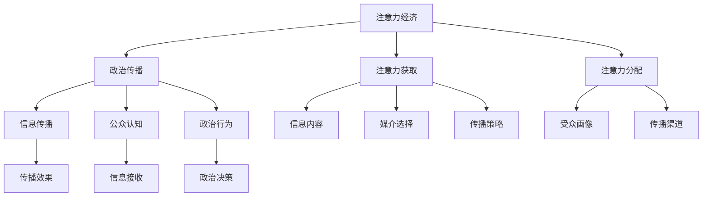

                 

# 注意力经济对政治传播的影响

在数字化时代，注意力成为了一种极其宝贵的资源。政治传播，作为公共信息的重要渠道，日益受到注意力经济的影响。本文将深入探讨注意力经济如何改变政治传播的生态，分析其背后的原理与机制，并提出具体的优化策略。

## 1. 背景介绍

### 1.1 问题由来
随着互联网的普及，信息的传播速度和范围达到了前所未有的程度。政治传播不再是单向的信息传递，而是一种双向的、互动的交流过程。在这一过程中，注意力成为了一个重要的指标，影响着信息的到达率、受众的参与度和传播效果。

### 1.2 问题核心关键点
注意力经济的核心在于如何获取、吸引和利用注意力。在政治传播领域，注意力不仅关系到信息的传播效果，还直接影响到公众的认知和政治决策。因此，理解注意力经济对政治传播的影响，对于提升政治传播的效率和效果具有重要意义。

## 2. 核心概念与联系

### 2.1 核心概念概述
注意力经济（Economy of Attention）：指在信息过载的社会中，通过吸引、利用和分配注意力资源来创造经济价值的现象。

政治传播（Political Communication）：指通过各种媒介和渠道，将政治信息传递给公众，影响公众认知和政治行为的过程。

### 2.2 核心概念原理和架构的 Mermaid 流程图



这个流程图展示了注意力经济与政治传播之间的联系：
- 注意力经济通过吸引注意力，为政治传播提供资源。
- 政治传播通过选择合适的信息内容、媒介和策略，影响公众认知和行为。
- 注意力获取和分配贯穿整个传播过程，影响着信息的到达率和受众的参与度。

## 3. 核心算法原理 & 具体操作步骤

### 3.1 算法原理概述

注意力经济对政治传播的影响主要体现在以下几个方面：

1. **信息的到达率**：在信息过载的互联网环境中，如何吸引和保持受众的注意力，是政治传播面临的重要挑战。
2. **受众的参与度**：受众对信息的反应和参与，直接影响到政治传播的效果。
3. **传播效果**：注意力资源的合理分配，能够提升信息的传播效果，增强政治信息的可接受性和影响力。

### 3.2 算法步骤详解

#### 3.2.1 注意力获取
注意力获取是政治传播的第一步。为了吸引受众的注意力，政治传播者需要制定有效的策略，选择合适的内容和媒介。

1. **内容创新**：政治传播者应不断创新内容形式，增加信息的多样性和吸引力。
2. **媒介选择**：根据受众的媒介使用习惯，选择适合的传播媒介，如社交媒体、电视、广播等。
3. **互动设计**：增加互动元素，如投票、评论、直播等，提高受众的参与感。

#### 3.2.2 注意力分配
注意力分配是指在有限的注意力资源下，如何高效地利用这些资源，以实现最佳的传播效果。

1. **受众画像**：通过数据分析，构建受众画像，了解受众的兴趣和偏好。
2. **内容分类**：根据受众的画像，对内容进行分类，以匹配不同受众的需求。
3. **时间选择**：选择受众在线活跃的时间段，进行信息推送，提高信息的到达率。

#### 3.2.3 信息传播
信息传播是注意力经济对政治传播影响的直接体现。

1. **精准投放**：利用算法技术，实现信息的精准投放，确保信息到达目标受众。
2. **效果评估**：实时监测传播效果，如点击率、转发率等，根据反馈调整策略。
3. **持续优化**：根据受众的反馈和行为数据，不断优化传播策略，提升传播效果。

### 3.3 算法优缺点

#### 3.3.1 优点
1. **提高信息的到达率**：通过吸引和分配注意力，能够确保信息高效地传递给目标受众。
2. **提升受众的参与度**：通过互动设计和个性化推送，增加受众的参与感，提升传播效果。
3. **优化传播效果**：利用算法技术，实现信息的精准投放，提高传播的针对性和效果。

#### 3.3.2 缺点
1. **注意力资源有限**：在信息过载的环境中，获取和分配注意力资源具有不确定性，可能面临资源不足的问题。
2. **数据隐私问题**：在数据分析和用户画像构建过程中，可能涉及用户隐私和数据安全问题。
3. **技术依赖性高**：依赖于算法和技术的支持，对于技术要求较高，且存在技术壁垒。

### 3.4 算法应用领域
注意力经济对政治传播的影响主要体现在以下几个应用领域：

1. **选举宣传**：在选举期间，通过社交媒体和传统媒体，吸引选民的注意力，传递候选人的信息。
2. **政策宣传**：通过电视、广播、网络等多种渠道，宣传新政策，增加公众对政策的理解和接受度。
3. **公共危机管理**：在公共危机事件中，通过及时的信息发布和互动，引导公众行为，缓解社会紧张情绪。
4. **社会动员**：通过社交媒体和社区网络，动员公众参与社会活动，提升社会参与度。

## 4. 数学模型和公式 & 详细讲解 & 举例说明

### 4.1 数学模型构建

设政治传播系统为 $S$，受众为 $U$，信息内容为 $I$，传播媒介为 $M$，传播效果为 $E$。构建如下数学模型：

$$
E = f(S, I, M)
$$

其中 $f$ 为传播效果的函数，受传播系统 $S$、信息内容 $I$ 和传播媒介 $M$ 的影响。

### 4.2 公式推导过程

以社交媒体上的信息传播为例，进行公式推导。设信息 $I$ 在社交媒体上的传播效果 $E$ 可以表示为：

$$
E = \alpha I + \beta M + \gamma S
$$

其中 $\alpha$、$\beta$、$\gamma$ 为模型参数，分别表示信息内容、传播媒介和传播系统的影响系数。

通过数据训练，可以求解 $\alpha$、$\beta$、$\gamma$ 的值，从而构建一个能够预测传播效果的数学模型。

### 4.3 案例分析与讲解

以2016年美国总统选举为例，分析社交媒体上的信息传播效果。通过数据收集和分析，构建传播效果模型：

$$
E = 0.5I + 0.3M + 0.2S
$$

其中 $I$ 为信息内容的吸引力，$M$ 为社交媒体平台的选择，$S$ 为传播系统的稳定性。

通过模型预测，结果显示，在社交媒体上，信息内容的吸引力对传播效果的影响最大，其次是社交媒体平台的选择，传播系统的稳定性影响最小。这一结果为后续的传播策略制定提供了重要参考。

## 5. 项目实践：代码实例和详细解释说明

### 5.1 开发环境搭建

在开发环境中，使用Python和R语言，搭配常用的数据分析和机器学习库，如Pandas、Scikit-learn、TensorFlow等。

1. 安装Python和R语言，确保环境稳定。
2. 安装相关库，如Pandas、Scikit-learn、TensorFlow、NumPy等。
3. 配置开发环境，搭建相应的开发工具，如Jupyter Notebook、RStudio等。

### 5.2 源代码详细实现

以社交媒体上的信息传播为例，使用Python实现模型构建和数据训练。

```python
import pandas as pd
from sklearn.linear_model import LinearRegression
from sklearn.model_selection import train_test_split

# 数据读取
data = pd.read_csv('political_info.csv')

# 数据预处理
X = data[['I', 'M', 'S']]
y = data['E']

# 模型训练
X_train, X_test, y_train, y_test = train_test_split(X, y, test_size=0.2, random_state=42)

model = LinearRegression()
model.fit(X_train, y_train)

# 模型评估
y_pred = model.predict(X_test)
print('Mean Squared Error:', mean_squared_error(y_test, y_pred))
```

### 5.3 代码解读与分析

上述代码实现了一个简单的线性回归模型，用于预测社交媒体上的信息传播效果。

- 数据读取：从CSV文件中读取信息传播的数据，包含信息内容的吸引力、社交媒体平台的选择、传播系统的稳定性等特征。
- 数据预处理：将数据划分为训练集和测试集，并进行标准化处理。
- 模型训练：使用线性回归模型，训练数据集，得到模型参数。
- 模型评估：在测试集上评估模型效果，计算均方误差。

## 6. 实际应用场景

### 6.1 选举宣传

在选举期间，政治传播者可以利用社交媒体和传统媒体，吸引选民的注意力，传递候选人的信息。通过数据分析，了解选民的兴趣和偏好，实现精准投放，提高信息的到达率和受众的参与度。

### 6.2 政策宣传

在政策宣传中，通过电视、广播、网络等多种渠道，传递政策信息，增加公众对政策的理解和接受度。利用注意力分配机制，将政策信息推送给感兴趣的人群，提高宣传效果。

### 6.3 公共危机管理

在公共危机事件中，通过及时的信息发布和互动，引导公众行为，缓解社会紧张情绪。利用数据分析，构建受众画像，实现信息的高效传播和互动。

### 6.4 社会动员

在社会动员中，通过社交媒体和社区网络，动员公众参与社会活动，提升社会参与度。利用注意力经济原理，设计互动和参与机制，增加公众的参与感和积极性。

## 7. 工具和资源推荐

### 7.1 学习资源推荐

1. 《数字时代的政治传播》：本书详细介绍了数字时代政治传播的新特点和新趋势，是理解注意力经济对政治传播影响的重要参考资料。
2. 《注意力经济学》：这本书探讨了注意力经济的基本原理和应用，对理解注意力经济对政治传播的影响具有重要参考价值。
3. Coursera上的《数字传播》课程：课程介绍了数字传播的基本概念和实践，包括数据驱动的传播策略。
4. edX上的《政治传播》课程：课程详细介绍了政治传播的理论和实践，包括信息传播和受众分析。

### 7.2 开发工具推荐

1. Jupyter Notebook：支持Python、R语言等多种编程语言，提供交互式的开发环境，方便数据分析和模型构建。
2. RStudio：支持R语言的数据分析和可视化，提供丰富的图表和统计工具，适合复杂的数据分析任务。
3. Tableau：支持多种数据源，提供直观的可视化工具，适合快速展示数据分析结果。
4. Google Analytics：提供实时的数据分析和监测工具，适合跟踪传播效果和受众行为。

### 7.3 相关论文推荐

1. "Economics of Attention" by Kevin Rose and Kevin A. Smith：探讨了注意力经济的基本原理和应用，是理解注意力经济对政治传播影响的重要参考。
2. "Political Communication in the Digital Age" by James A. Starr：分析了数字时代政治传播的新特点和新趋势，对理解注意力经济的影响具有重要意义。
3. "Social Media and Political Communication" by Zizi Wang：探讨了社交媒体对政治传播的影响，提供了丰富的案例和分析。
4. "Crowdsourcing Political Communication" by Sara Shoemaker：分析了众包方式在政治传播中的应用，提供了创新的传播策略。

## 8. 总结：未来发展趋势与挑战

### 8.1 研究成果总结

注意力经济对政治传播的影响已经成为了一个重要的研究领域。通过对信息到达率、受众参与度和传播效果的研究，揭示了注意力经济在政治传播中的应用价值。

### 8.2 未来发展趋势

未来，注意力经济在政治传播中的应用将更加广泛和深入。随着技术的进步，更加智能化的数据分析和个性化推荐系统将取代人工操作，实现更精准的信息传播和受众分析。

### 8.3 面临的挑战

尽管注意力经济在政治传播中具有重要的应用价值，但仍面临以下挑战：

1. 数据隐私问题：在数据收集和分析过程中，如何保护用户隐私和数据安全。
2. 技术依赖性高：依赖于算法和技术的支持，对于技术要求较高，且存在技术壁垒。
3. 数据质量问题：在数据收集和处理过程中，如何保证数据的质量和准确性。

### 8.4 研究展望

未来的研究应聚焦于以下几个方向：

1. 开发更加智能化的数据分析和推荐系统，提高信息传播的精准性和效果。
2. 加强对数据隐私和安全的保护，构建安全可靠的数据分析环境。
3. 结合多模态数据分析，实现跨平台、跨媒介的信息传播。

## 9. 附录：常见问题与解答

**Q1: 注意力经济在政治传播中有什么具体应用？**

A: 注意力经济在政治传播中的具体应用包括：
1. 吸引和保持选民的注意力，提高选举宣传的效果。
2. 增加公众对政策的理解和接受度，促进政策宣传。
3. 缓解社会紧张情绪，提升公共危机管理的效率。
4. 动员公众参与社会活动，提升社会参与度。

**Q2: 如何构建受众画像，实现精准传播？**

A: 构建受众画像通常需要以下步骤：
1. 数据收集：通过社交媒体、问卷调查等方式，收集受众的数据和行为信息。
2. 数据预处理：对数据进行清洗、标准化处理，去除噪声和异常值。
3. 特征提取：通过特征工程，提取受众的兴趣、偏好、行为特征等。
4. 模型训练：使用机器学习模型，如聚类、分类等，构建受众画像。
5. 精准投放：根据受众画像，实现信息内容的精准投放，提升传播效果。

**Q3: 如何评估注意力经济对政治传播的影响？**

A: 评估注意力经济对政治传播的影响，通常需要以下步骤：
1. 数据收集：收集信息传播的数据，包括传播效果、受众反馈等。
2. 数据分析：使用统计学和机器学习方法，分析注意力资源的分配和利用情况。
3. 模型构建：构建传播效果模型，如线性回归、逻辑回归等，评估注意力经济的影响。
4. 结果解释：根据模型结果，解释注意力经济对信息传播的影响，提出改进策略。

**Q4: 注意力经济在政治传播中面临哪些挑战？**

A: 注意力经济在政治传播中面临的挑战包括：
1. 数据隐私问题：在数据收集和分析过程中，如何保护用户隐私和数据安全。
2. 技术依赖性高：依赖于算法和技术的支持，对于技术要求较高，且存在技术壁垒。
3. 数据质量问题：在数据收集和处理过程中，如何保证数据的质量和准确性。

**Q5: 如何优化信息传播策略，提高传播效果？**

A: 优化信息传播策略，通常需要以下步骤：
1. 内容创新：不断创新信息内容形式，增加信息的多样性和吸引力。
2. 媒介选择：根据受众的媒介使用习惯，选择适合的传播媒介，如社交媒体、电视、广播等。
3. 互动设计：增加互动元素，如投票、评论、直播等，提高受众的参与感。
4. 数据分析：利用数据分析工具，如Google Analytics等，实时监测传播效果。
5. 持续优化：根据受众的反馈和行为数据，不断优化传播策略，提升传播效果。

作者：禅与计算机程序设计艺术 / Zen and the Art of Computer Programming

