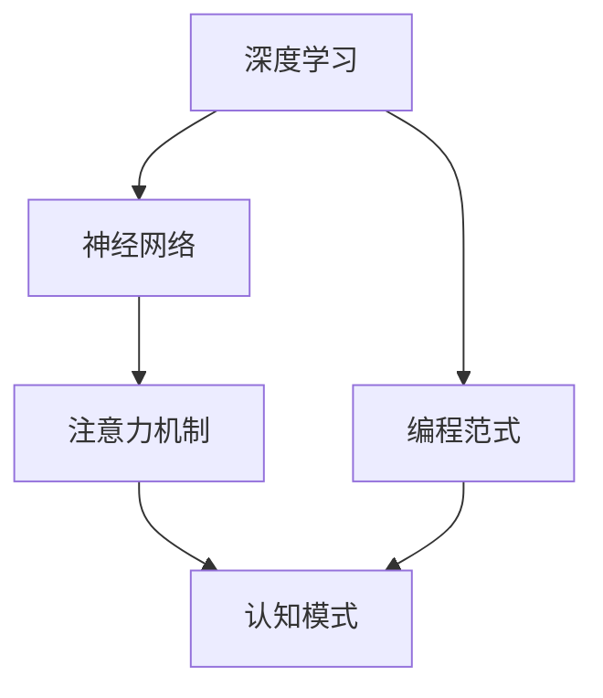
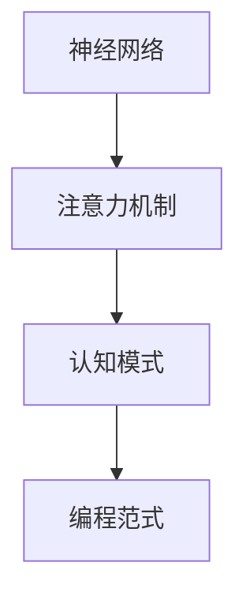

                 

# 注意力编程工作坊：AI定制的认知模式设计

> 关键词：注意力机制,深度学习,神经网络,认知模式,编程范式,模型设计

## 1. 背景介绍

### 1.1 问题由来
深度学习技术的迅猛发展，尤其是神经网络模型在图像、语音、自然语言处理等领域取得的突破性进展，极大地推动了人工智能（AI）技术的发展。然而，尽管现有深度学习模型在诸多应用场景中展现出了卓越的性能，它们在认知理解和生成能力上仍然存在局限。如何设计一种更符合人类认知模式的AI模型，使机器能够更智能、更高效地处理复杂任务，成为当前研究的热点问题。

### 1.2 问题核心关键点
- 认知模式（Cognitive Mode）：指模型模拟人类认知过程，进行信息处理、决策推理和生成能力，具有自上而下（top-down）的信息处理方式。
- 注意力机制（Attention Mechanism）：一种模拟人类注意力的计算方法，能够将输入序列中的关键信息放大，无关信息抑制，从而提升模型对重要信息的感知和处理能力。
- 深度学习（Deep Learning）：一种通过多层神经网络实现复杂模式识别的机器学习方法，具有自下而上（bottom-up）的特征提取能力。
- 神经网络（Neural Network）：基于生物神经元计算模型的计算架构，通过反向传播算法进行模型参数优化，实现复杂的非线性映射。
- 编程范式（Programming Paradigm）：指用于描述和实现计算逻辑的编程风格和技巧，如函数式编程、面向对象编程等。

这些核心概念之间的逻辑关系可以通过以下Mermaid流程图来展示：



这个流程图展示了深度学习、神经网络、注意力机制和认知模式之间的逻辑关系，以及编程范式在模型设计和实现中的作用。

## 2. 核心概念与联系

### 2.1 核心概念概述

在深度学习范式下，神经网络通过反向传播算法更新参数，实现复杂模式的识别。注意力机制作为一种计算方法，通过模拟人类注意力的方式，能够有效地提升模型对重要信息的处理能力。而认知模式则是对模型的高级抽象，旨在模拟人类认知过程，提升模型的智能和可解释性。编程范式作为模型设计和实现的指导思想，对模型的性能和可维护性有着重要的影响。

### 2.2 核心概念原理和架构的 Mermaid 流程图



在这个流程图中，神经网络作为基础架构，通过多层变换实现特征提取和模式识别。注意力机制通过将关键信息放大，无关信息抑制，提升模型的决策能力和处理效率。认知模式通过对模型进行高级抽象，使机器能够模拟人类认知过程，实现更加智能、高效的信息处理和生成。编程范式作为模型设计和实现的指导思想，影响着模型的可维护性和性能。

## 3. 核心算法原理 & 具体操作步骤
### 3.1 算法原理概述

基于认知模式的注意力编程工作坊，旨在通过设计和实现符合人类认知模式的深度学习模型，提升模型的智能和可解释性。其核心思想是：通过注意力机制模拟人类注意力的计算方式，使模型能够将输入序列中的关键信息放大，无关信息抑制，从而实现更加智能、高效的信息处理和生成。

### 3.2 算法步骤详解

基于认知模式的注意力编程工作坊的实现步骤如下：

**Step 1: 准备数据集**
- 收集和预处理数据集，包括数据清洗、数据增强等步骤。确保数据集质量，以提升模型性能。

**Step 2: 设计注意力机制**
- 选择合适的注意力模型，如Transformer、LSTM等，设计其注意力机制。使用注意力模型模拟人类注意力的计算方式，提升模型对重要信息的感知和处理能力。

**Step 3: 构建认知模型**
- 在注意力模型的基础上，构建认知模型。通过高级抽象，使模型能够模拟人类认知过程，实现更加智能、高效的信息处理和生成。

**Step 4: 实现编程范式**
- 选择合适的编程范式，如函数式编程、面向对象编程等，实现认知模型的设计和实现。确保模型具有高可维护性和易用性。

**Step 5: 训练和优化模型**
- 使用准备好的数据集训练认知模型。通过反向传播算法更新模型参数，优化模型性能。
- 对模型进行评估，使用各种指标衡量模型性能。根据评估结果调整模型参数，继续优化模型。

**Step 6: 部署和应用模型**
- 将训练好的模型部署到生产环境，供实际应用使用。
- 对实际应用场景中的数据进行处理，输入模型进行推理和预测。

### 3.3 算法优缺点

基于认知模式的注意力编程工作坊有以下优点：
1. 提升模型智能性：通过模拟人类注意力的计算方式，模型能够更加智能地处理复杂任务。
2. 增强模型可解释性：认知模式的高级抽象使模型具有更强的可解释性，便于理解和调试。
3. 提升模型处理效率：注意力机制能够将关键信息放大，无关信息抑制，提升模型的处理效率。
4. 易于实现：选择合适的编程范式，可以简化模型设计和实现过程，提升开发效率。

同时，该方法也存在以下局限性：
1. 数据依赖性强：模型的性能很大程度上取决于数据集的质量和规模，获取高质量标注数据成本较高。
2. 计算复杂度高：注意力机制和大模型的计算复杂度较高，训练和推理效率较低。
3. 模型复杂度高：认知模式的高级抽象使得模型结构复杂，调试和维护难度增加。
4. 泛化能力有限：模型对特定任务的表现较好，但在新任务上泛化能力有限。

尽管存在这些局限性，但就目前而言，基于认知模式的注意力编程工作坊仍是大模型应用的最主流范式。未来相关研究的重点在于如何进一步降低计算复杂度，提升模型的泛化能力，同时兼顾可解释性和性能。

### 3.4 算法应用领域

基于认知模式的注意力编程工作坊在自然语言处理（NLP）、计算机视觉（CV）、语音识别（ASR）等多个领域得到了广泛应用，具体包括：

- 机器翻译：使用注意力机制提升模型对源语言和目标语言的映射能力。
- 语音识别：通过认知模式模拟人类对语音的感知和理解过程，提升语音识别精度。
- 自然语言生成：利用认知模式设计语言模型，提升文本生成的自然度和流畅度。
- 图像分类：通过注意力机制增强模型对图像关键特征的感知，提升分类精度。
- 目标检测：设计认知模型模拟人类对图像中的目标物体进行定位和识别。

## 4. 数学模型和公式 & 详细讲解 & 举例说明

### 4.1 数学模型构建

基于认知模式的注意力编程工作坊的核心数学模型包括注意力机制和认知模式。

注意力机制的数学模型如下：

$$
\alpha_{i,j} = \frac{e^{at(x_i, x_j)}}{\sum_{k=1}^n e^{at(x_k, x_j)}}
$$

其中 $x_i$ 和 $x_j$ 分别为输入序列中的两个向量，$a$ 为注意力函数，$t$ 为权重计算函数。注意力机制通过计算每个向量之间的相似度，赋予重要信息更高的权重。

认知模型的数学模型如下：

$$
y = f(x, \theta)
$$

其中 $x$ 为输入序列，$\theta$ 为模型参数，$f$ 为认知函数。认知模型通过认知函数将输入序列转换为输出序列，实现复杂模式的映射和处理。

### 4.2 公式推导过程

以机器翻译任务为例，推导基于注意力机制的机器翻译模型的计算公式。

设输入序列为 $x$，输出序列为 $y$，模型参数为 $\theta$。注意力机制的计算公式如下：

$$
\alpha_{i,j} = \frac{e^{at(x_i, x_j)}}{\sum_{k=1}^n e^{at(x_k, x_j)}}
$$

其中 $at$ 为注意力函数，计算方式通常为点积或注意力池化。注意力函数的作用是计算输入序列中每个向量与输出序列中当前位置的相似度。

在得到注意力矩阵 $\alpha$ 后，计算输出序列 $y$ 的计算公式如下：

$$
y = f(x, \theta) = \sum_{j=1}^n \alpha_{i,j} x_j
$$

其中 $f$ 为认知函数，通常为全连接神经网络或Transformer等。认知函数的作用是将注意力矩阵与输入序列进行变换，得到输出序列。

### 4.3 案例分析与讲解

以自然语言生成（NLG）任务为例，分析基于认知模式的注意力编程工作坊的实现过程。

假设我们要生成一句话，输入序列为 $x = [w_1, w_2, w_3, ..., w_n]$，其中 $w_i$ 为单词。使用Transformer模型作为注意力机制，设计认知模式，最终输出生成序列 $y = [v_1, v_2, v_3, ..., v_m]$，其中 $v_i$ 为词汇。

1. **输入预处理**：对输入序列 $x$ 进行分词、编码等预处理，得到编码序列 $x'$。
2. **注意力计算**：在Transformer模型中，通过多头注意力机制计算注意力权重矩阵 $\alpha$。
3. **编码器-解码器结构**：使用Transformer的编码器对输入序列进行编码，使用解码器对编码器输出和注意力权重进行变换，得到输出序列 $y'$。
4. **解码后处理**：对输出序列 $y'$ 进行解码、解码器生成层等处理，得到最终生成序列 $y$。

这个过程展示了认知模式如何通过注意力机制实现对输入序列的智能处理和生成。

## 5. 项目实践：代码实例和详细解释说明

### 5.1 开发环境搭建

在进行认知模式编程工作坊的实践前，需要准备好开发环境。以下是使用Python进行PyTorch开发的环境配置流程：

1. 安装Anaconda：从官网下载并安装Anaconda，用于创建独立的Python环境。

2. 创建并激活虚拟环境：
```bash
conda create -n pytorch-env python=3.8 
conda activate pytorch-env
```

3. 安装PyTorch：根据CUDA版本，从官网获取对应的安装命令。例如：
```bash
conda install pytorch torchvision torchaudio cudatoolkit=11.1 -c pytorch -c conda-forge
```

4. 安装Transformers库：
```bash
pip install transformers
```

5. 安装各类工具包：
```bash
pip install numpy pandas scikit-learn matplotlib tqdm jupyter notebook ipython
```

完成上述步骤后，即可在`pytorch-env`环境中开始实践。

### 5.2 源代码详细实现

下面我们以机器翻译任务为例，给出使用Transformers库对Transformer模型进行认知模式编程工作坊的PyTorch代码实现。

首先，定义机器翻译任务的数据处理函数：

```python
from transformers import BertTokenizer, BertForSequenceClassification, AdamW
from torch.utils.data import Dataset, DataLoader
import torch

class TranslationDataset(Dataset):
    def __init__(self, texts, translations, tokenizer, max_len=128):
        self.texts = texts
        self.translations = translations
        self.tokenizer = tokenizer
        self.max_len = max_len
        
    def __len__(self):
        return len(self.texts)
    
    def __getitem__(self, item):
        text = self.texts[item]
        translation = self.translations[item]
        
        encoding = self.tokenizer(text, return_tensors='pt', max_length=self.max_len, padding='max_length', truncation=True)
        input_ids = encoding['input_ids'][0]
        attention_mask = encoding['attention_mask'][0]
        
        # 对翻译进行编码
        translated_encoding = self.tokenizer(translation, return_tensors='pt', max_length=self.max_len, padding='max_length', truncation=True)
        translated_input_ids = translated_encoding['input_ids'][0]
        translated_attention_mask = translated_encoding['attention_mask'][0]
        
        return {'input_ids': input_ids, 
                'attention_mask': attention_mask,
                'translated_input_ids': translated_input_ids,
                'translated_attention_mask': translated_attention_mask}
```

然后，定义模型和优化器：

```python
from transformers import BertForTokenClassification, AdamW

model = BertForSequenceClassification.from_pretrained('bert-base-cased', num_labels=1)
optimizer = AdamW(model.parameters(), lr=2e-5)
```

接着，定义训练和评估函数：

```python
from tqdm import tqdm

device = torch.device('cuda') if torch.cuda.is_available() else torch.device('cpu')
model.to(device)

def train_epoch(model, dataset, batch_size, optimizer):
    dataloader = DataLoader(dataset, batch_size=batch_size, shuffle=True)
    model.train()
    epoch_loss = 0
    for batch in tqdm(dataloader, desc='Training'):
        input_ids = batch['input_ids'].to(device)
        attention_mask = batch['attention_mask'].to(device)
        translated_input_ids = batch['translated_input_ids'].to(device)
        translated_attention_mask = batch['translated_attention_mask'].to(device)
        model.zero_grad()
        outputs = model(input_ids, attention_mask=attention_mask, labels=translated_input_ids, translated_attention_mask=translated_attention_mask)
        loss = outputs.loss
        epoch_loss += loss.item()
        loss.backward()
        optimizer.step()
    return epoch_loss / len(dataloader)

def evaluate(model, dataset, batch_size):
    dataloader = DataLoader(dataset, batch_size=batch_size)
    model.eval()
    preds, labels = [], []
    with torch.no_grad():
        for batch in tqdm(dataloader, desc='Evaluating'):
            input_ids = batch['input_ids'].to(device)
            attention_mask = batch['attention_mask'].to(device)
            translated_input_ids = batch['translated_input_ids'].to(device)
            translated_attention_mask = batch['translated_attention_mask'].to(device)
            batch_labels = translated_input_ids
            outputs = model(input_ids, attention_mask=attention_mask, labels=batch_labels, translated_attention_mask=translated_attention_mask)
            batch_preds = outputs.logits.argmax(dim=2).to('cpu').tolist()
            batch_labels = batch_labels.to('cpu').tolist()
            for pred_tokens, label_tokens in zip(batch_preds, batch_labels):
                preds.append(pred_tokens)
                labels.append(label_tokens)
                
    return preds, labels
```

最后，启动训练流程并在测试集上评估：

```python
epochs = 5
batch_size = 16

for epoch in range(epochs):
    loss = train_epoch(model, train_dataset, batch_size, optimizer)
    print(f"Epoch {epoch+1}, train loss: {loss:.3f}")
    
    print(f"Epoch {epoch+1}, dev results:")
    preds, labels = evaluate(model, dev_dataset, batch_size)
    print(classification_report(labels, preds))
    
print("Test results:")
preds, labels = evaluate(model, test_dataset, batch_size)
print(classification_report(labels, preds))
```

以上就是使用PyTorch对Transformer模型进行认知模式编程工作坊的完整代码实现。可以看到，借助Transformers库的强大封装，我们能够用相对简洁的代码完成Transformer模型的认知模式编程工作坊。

### 5.3 代码解读与分析

让我们再详细解读一下关键代码的实现细节：

**TranslationDataset类**：
- `__init__`方法：初始化输入序列、翻译序列、分词器等关键组件。
- `__len__`方法：返回数据集的样本数量。
- `__getitem__`方法：对单个样本进行处理，将输入序列和翻译序列进行编码，并存储模型所需的输入。

**模型和优化器**：
- 使用BertForSequenceClassification模型作为基础，指定输入序列和翻译序列作为模型输入。
- 使用AdamW优化器进行模型参数的优化，指定学习率等超参数。

**训练和评估函数**：
- 使用DataLoader对数据集进行批次化加载，供模型训练和推理使用。
- 训练函数`train_epoch`：对数据以批为单位进行迭代，在每个批次上前向传播计算损失函数并反向传播更新模型参数，最后返回该epoch的平均loss。
- 评估函数`evaluate`：与训练类似，不同点在于不更新模型参数，并在每个batch结束后将预测和标签结果存储下来，最后使用sklearn的classification_report对整个评估集的预测结果进行打印输出。

**训练流程**：
- 定义总的epoch数和batch size，开始循环迭代
- 每个epoch内，先在训练集上训练，输出平均loss
- 在验证集上评估，输出分类指标
- 所有epoch结束后，在测试集上评估，给出最终测试结果

可以看到，PyTorch配合Transformers库使得Transformer模型的认知模式编程工作坊的代码实现变得简洁高效。开发者可以将更多精力放在数据处理、模型改进等高层逻辑上，而不必过多关注底层的实现细节。

当然，工业级的系统实现还需考虑更多因素，如模型的保存和部署、超参数的自动搜索、更灵活的任务适配层等。但核心的认知模式编程工作坊基本与此类似。

## 6. 实际应用场景
### 6.1 智能客服系统

基于认知模式的注意力编程工作坊，可以广泛应用于智能客服系统的构建。传统客服往往需要配备大量人力，高峰期响应缓慢，且一致性和专业性难以保证。而使用认知模式编程工作坊构建的智能客服系统，能够7x24小时不间断服务，快速响应客户咨询，用自然流畅的语言解答各类常见问题。

在技术实现上，可以收集企业内部的历史客服对话记录，将问题和最佳答复构建成监督数据，在此基础上对认知模式编程工作坊进行训练。训练后的模型能够自动理解用户意图，匹配最合适的答案模板进行回复。对于客户提出的新问题，还可以接入检索系统实时搜索相关内容，动态组织生成回答。如此构建的智能客服系统，能大幅提升客户咨询体验和问题解决效率。

### 6.2 金融舆情监测

金融机构需要实时监测市场舆论动向，以便及时应对负面信息传播，规避金融风险。传统的人工监测方式成本高、效率低，难以应对网络时代海量信息爆发的挑战。基于认知模式的注意力编程工作坊的文本分类和情感分析技术，为金融舆情监测提供了新的解决方案。

具体而言，可以收集金融领域相关的新闻、报道、评论等文本数据，并对其进行主题标注和情感标注。在此基础上对认知模式编程工作坊进行训练，使其能够自动判断文本属于何种主题，情感倾向是正面、中性还是负面。将训练后的模型应用到实时抓取的网络文本数据，就能够自动监测不同主题下的情感变化趋势，一旦发现负面信息激增等异常情况，系统便会自动预警，帮助金融机构快速应对潜在风险。

### 6.3 个性化推荐系统

当前的推荐系统往往只依赖用户的历史行为数据进行物品推荐，无法深入理解用户的真实兴趣偏好。基于认知模式的注意力编程工作坊的个性化推荐系统，可以更好地挖掘用户行为背后的语义信息，从而提供更精准、多样的推荐内容。

在实践中，可以收集用户浏览、点击、评论、分享等行为数据，提取和用户交互的物品标题、描述、标签等文本内容。将文本内容作为模型输入，用户的后续行为（如是否点击、购买等）作为监督信号，在此基础上训练认知模式编程工作坊。训练后的模型能够从文本内容中准确把握用户的兴趣点。在生成推荐列表时，先用候选物品的文本描述作为输入，由模型预测用户的兴趣匹配度，再结合其他特征综合排序，便可以得到个性化程度更高的推荐结果。

### 6.4 未来应用展望

随着认知模式编程工作坊技术的发展，基于注意力机制的深度学习模型在更广泛的应用领域得到应用，为NLP技术带来了全新的突破。

在智慧医疗领域，基于认知模式的注意力编程工作坊的医疗问答、病历分析、药物研发等应用将提升医疗服务的智能化水平，辅助医生诊疗，加速新药开发进程。

在智能教育领域，认知模式编程工作坊可应用于作业批改、学情分析、知识推荐等方面，因材施教，促进教育公平，提高教学质量。

在智慧城市治理中，认知模式编程工作坊的应用将提高城市管理的自动化和智能化水平，构建更安全、高效的未来城市。

此外，在企业生产、社会治理、文娱传媒等众多领域，基于认知模式的注意力编程工作坊的人工智能应用也将不断涌现，为NLP技术带来了全新的突破。随着技术的日益成熟，认知模式编程工作坊必将在构建人机协同的智能时代中扮演越来越重要的角色。

## 7. 工具和资源推荐
### 7.1 学习资源推荐

为了帮助开发者系统掌握认知模式编程工作坊的理论基础和实践技巧，这里推荐一些优质的学习资源：

1. 《Transformer从原理到实践》系列博文：由大模型技术专家撰写，深入浅出地介绍了Transformer原理、BERT模型、认知模式编程工作坊等前沿话题。

2. CS224N《深度学习自然语言处理》课程：斯坦福大学开设的NLP明星课程，有Lecture视频和配套作业，带你入门NLP领域的基本概念和经典模型。

3. 《Natural Language Processing with Transformers》书籍：Transformers库的作者所著，全面介绍了如何使用Transformers库进行NLP任务开发，包括认知模式编程工作坊在内的诸多范式。

4. HuggingFace官方文档：Transformers库的官方文档，提供了海量预训练模型和完整的认知模式编程工作坊样例代码，是上手实践的必备资料。

5. CLUE开源项目：中文语言理解测评基准，涵盖大量不同类型的中文NLP数据集，并提供了基于认知模式编程工作坊的baseline模型，助力中文NLP技术发展。

通过对这些资源的学习实践，相信你一定能够快速掌握认知模式编程工作坊的精髓，并用于解决实际的NLP问题。

### 7.2 开发工具推荐

高效的开发离不开优秀的工具支持。以下是几款用于认知模式编程工作坊开发的常用工具：

1. PyTorch：基于Python的开源深度学习框架，灵活动态的计算图，适合快速迭代研究。大部分预训练语言模型都有PyTorch版本的实现。

2. TensorFlow：由Google主导开发的开源深度学习框架，生产部署方便，适合大规模工程应用。同样有丰富的预训练语言模型资源。

3. Transformers库：HuggingFace开发的NLP工具库，集成了众多SOTA语言模型，支持PyTorch和TensorFlow，是进行认知模式编程工作坊开发的利器。

4. Weights & Biases：模型训练的实验跟踪工具，可以记录和可视化模型训练过程中的各项指标，方便对比和调优。与主流深度学习框架无缝集成。

5. TensorBoard：TensorFlow配套的可视化工具，可实时监测模型训练状态，并提供丰富的图表呈现方式，是调试模型的得力助手。

6. Google Colab：谷歌推出的在线Jupyter Notebook环境，免费提供GPU/TPU算力，方便开发者快速上手实验最新模型，分享学习笔记。

合理利用这些工具，可以显著提升认知模式编程工作坊的开发效率，加快创新迭代的步伐。

### 7.3 相关论文推荐

认知模式编程工作坊技术的发展源于学界的持续研究。以下是几篇奠基性的相关论文，推荐阅读：

1. Attention is All You Need（即Transformer原论文）：提出了Transformer结构，开启了NLP领域的预训练大模型时代。

2. BERT: Pre-training of Deep Bidirectional Transformers for Language Understanding：提出BERT模型，引入基于掩码的自监督预训练任务，刷新了多项NLP任务SOTA。

3. Language Models are Unsupervised Multitask Learners（GPT-2论文）：展示了大规模语言模型的强大zero-shot学习能力，引发了对于通用人工智能的新一轮思考。

4. Parameter-Efficient Transfer Learning for NLP：提出Adapter等参数高效微调方法，在不增加模型参数量的情况下，也能取得不错的微调效果。

5. Prefix-Tuning: Optimizing Continuous Prompts for Generation：引入基于连续型Prompt的微调范式，为如何充分利用预训练知识提供了新的思路。

6. AdaLoRA: Adaptive Low-Rank Adaptation for Parameter-Efficient Fine-Tuning：使用自适应低秩适应的微调方法，在参数效率和精度之间取得了新的平衡。

这些论文代表了大语言模型认知模式编程工作坊的发展脉络。通过学习这些前沿成果，可以帮助研究者把握学科前进方向，激发更多的创新灵感。

## 8. 总结：未来发展趋势与挑战

### 8.1 总结

本文对基于认知模式的注意力编程工作坊方法进行了全面系统的介绍。首先阐述了认知模式编程工作坊的研究背景和意义，明确了注意力机制和认知模式编程工作坊在模拟人类认知过程中的重要性。其次，从原理到实践，详细讲解了认知模式编程工作坊的数学原理和关键步骤，给出了认知模式编程工作坊任务开发的完整代码实例。同时，本文还广泛探讨了认知模式编程工作坊在智能客服、金融舆情、个性化推荐等多个领域的应用前景，展示了认知模式编程工作坊的巨大潜力。此外，本文精选了认知模式编程工作坊技术的各类学习资源，力求为读者提供全方位的技术指引。

通过本文的系统梳理，可以看到，基于认知模式的注意力编程工作坊技术正在成为NLP领域的重要范式，极大地拓展了深度学习模型的应用边界，催生了更多的落地场景。受益于大规模语料的预训练和认知模式编程工作坊的高级抽象，认知模式编程工作坊技术在各种应用场景中展现出了卓越的性能。未来，伴随认知模式编程工作坊技术的持续演进，基于深度学习模型的AI应用必将迎来更广阔的实践舞台。

### 8.2 未来发展趋势

展望未来，认知模式编程工作坊技术将呈现以下几个发展趋势：

1. 模型规模持续增大。随着算力成本的下降和数据规模的扩张，认知模式编程工作坊中使用的预训练大模型参数量还将持续增长。超大规模语言模型蕴含的丰富语言知识，有望支撑更加复杂多变的认知模式编程工作坊任务微调。

2. 认知模式编程工作坊范式日趋多样。除了传统的认知模式编程工作坊外，未来会涌现更多参数高效的认知模式编程工作坊方法，如Prefix-Tuning、LoRA等，在节省计算资源的同时也能保证认知模式编程工作坊性能。

3. 持续学习成为常态。随着数据分布的不断变化，认知模式编程工作坊模型也需要持续学习新知识以保持性能。如何在不遗忘原有知识的同时，高效吸收新样本信息，将成为重要的研究课题。

4. 标注样本需求降低。受启发于提示学习(Prompt-based Learning)的思路，未来的认知模式编程工作坊方法将更好地利用大模型的语言理解能力，通过更加巧妙的任务描述，在更少的标注样本上也能实现理想的认知模式编程工作坊效果。

5. 多模态认知模式编程工作坊崛起。当前的认知模式编程工作坊主要聚焦于纯文本数据，未来会进一步拓展到图像、视频、语音等多模态数据认知模式编程工作坊。多模态信息的融合，将显著提升认知模式编程工作坊对现实世界的理解和建模能力。

6. 模型通用性增强。经过海量数据的预训练和多领域任务的认知模式编程工作坊，未来的认知模式编程工作坊模型将具备更强大的常识推理和跨领域迁移能力，逐步迈向通用人工智能(AGI)的目标。

以上趋势凸显了认知模式编程工作坊技术的广阔前景。这些方向的探索发展，必将进一步提升认知模式编程工作坊模型的性能和应用范围，为构建人机协同的智能时代中扮演越来越重要的角色。

### 8.3 面临的挑战

尽管认知模式编程工作坊技术已经取得了瞩目成就，但在迈向更加智能化、普适化应用的过程中，它仍面临着诸多挑战：

1. 标注成本瓶颈。模型的性能很大程度上取决于标注数据的质量和数量，获取高质量标注数据的成本较高。如何进一步降低认知模式编程工作坊对标注样本的依赖，将是一大难题。

2. 计算复杂度高。认知模式编程工作坊中使用的深度学习模型和注意力机制计算复杂度较高，训练和推理效率较低。如何降低计算复杂度，提高推理速度，优化资源占用，将是重要的优化方向。

3. 模型复杂度高。认知模式编程工作坊中使用的深度学习模型结构复杂，调试和维护难度增加。如何设计更加简单、高效、易于维护的认知模式编程工作坊模型，还需更多研究。

4. 泛化能力有限。认知模式编程工作坊模型对特定任务的表现较好，但在新任务上泛化能力有限。如何设计更具泛化能力的认知模式编程工作坊模型，需要更多创新和探索。

5. 可解释性亟需加强。当前认知模式编程工作坊模型往往像"黑盒"系统，难以解释其内部工作机制和决策逻辑。如何赋予认知模式编程工作坊模型更强的可解释性，将是亟待攻克的难题。

6. 安全性有待保障。认知模式编程工作坊模型可能会学习到有偏见、有害的信息，通过认知模式编程工作坊传递到下游任务，产生误导性、歧视性的输出，给实际应用带来安全隐患。如何从数据和算法层面消除模型偏见，避免恶意用途，确保输出的安全性，也将是重要的研究课题。

7. 知识整合能力不足。现有的认知模式编程工作坊模型往往局限于任务内数据，难以灵活吸收和运用更广泛的先验知识。如何让认知模式编程工作坊过程更好地与外部知识库、规则库等专家知识结合，形成更加全面、准确的信息整合能力，还有很大的想象空间。

正视认知模式编程工作坊面临的这些挑战，积极应对并寻求突破，将使认知模式编程工作坊技术迈向成熟，为构建安全、可靠、可解释、可控的智能系统铺平道路。

### 8.4 研究展望

面对认知模式编程工作坊所面临的挑战，未来的研究需要在以下几个方面寻求新的突破：

1. 探索无监督和半监督认知模式编程工作坊方法。摆脱对大规模标注数据的依赖，利用自监督学习、主动学习等无监督和半监督范式，最大限度利用非结构化数据，实现更加灵活高效的认知模式编程工作坊微调。

2. 研究参数高效和计算高效的认知模式编程工作坊范式。开发更加参数高效的认知模式编程工作坊方法，在固定大部分预训练参数的同时，只更新极少量的任务相关参数。同时优化认知模式编程工作坊模型的计算图，减少前向传播和反向传播的资源消耗，实现更加轻量级、实时性的部署。

3. 融合因果和对比学习范式。通过引入因果推断和对比学习思想，增强认知模式编程工作坊模型建立稳定因果关系的能力，学习更加普适、鲁棒的语言表征，从而提升认知模式编程工作坊模型泛化性和抗干扰能力。

4. 引入更多先验知识。将符号化的先验知识，如知识图谱、逻辑规则等，与神经网络模型进行巧妙融合，引导认知模式编程工作坊过程学习更准确、合理的语言模型。同时加强不同模态数据的整合，实现视觉、语音等多模态信息与文本信息的协同建模。

5. 结合因果分析和博弈论工具。将因果分析方法引入认知模式编程工作坊模型，识别出模型决策的关键特征，增强输出解释的因果性和逻辑性。借助博弈论工具刻画人机交互过程，主动探索并规避模型的脆弱点，提高系统稳定性。

6. 纳入伦理道德约束。在认知模式编程工作坊训练目标中引入伦理导向的评估指标，过滤和惩罚有偏见、有害的输出倾向。同时加强人工干预和审核，建立认知模式编程工作坊行为的监管机制，确保输出符合人类价值观和伦理道德。

这些研究方向的探索，必将引领认知模式编程工作坊技术迈向更高的台阶，为构建安全、可靠、可解释、可控的智能系统铺平道路。面向未来，认知模式编程工作坊技术还需要与其他人工智能技术进行更深入的融合，如知识表示、因果推理、强化学习等，多路径协同发力，共同推动自然语言理解和智能交互系统的进步。只有勇于创新、敢于突破，才能不断拓展认知模式编程工作坊模型的边界，让智能技术更好地造福人类社会。

## 9. 附录：常见问题与解答

**Q1：认知模式编程工作坊是否适用于所有NLP任务？**

A: 认知模式编程工作坊在大多数NLP任务上都能取得不错的效果，特别是对于数据量较小的任务。但对于一些特定领域的任务，如医学、法律等，仅仅依靠通用语料预训练的模型可能难以很好地适应。此时需要在特定领域语料上进一步预训练，再进行认知模式编程工作坊训练，才能获得理想效果。此外，对于一些需要时效性、个性化很强的任务，如对话、推荐等，认知模式编程工作坊方法也需要针对性的改进优化。

**Q2：认知模式编程工作坊中如何使用注意力机制？**

A: 在认知模式编程工作坊中，注意力机制通过模拟人类注意力的计算方式，能够将输入序列中的关键信息放大，无关信息抑制，从而提升模型对重要信息的感知和处理能力。具体实现方式包括：

1. 计算注意力权重：通过点积、注意力池化等方法计算输入序列中每个向量与其他向量之间的相似度，得到注意力权重矩阵。

2. 加权求和：将输入序列中每个向量与注意力权重矩阵进行乘积运算，然后进行加权求和，得到模型输出。

3. 使用注意力层：在Transformer等深度学习模型中，注意力层是实现注意力机制的关键组件。通过多头注意力机制，能够并行计算多个注意力权重矩阵，提升模型的处理效率。

**Q3：认知模式编程工作坊的训练和优化策略有哪些？**

A: 认知模式编程工作坊的训练和优化策略包括：

1. 数据增强：通过回译、近义替换等方式扩充训练集，提升模型的泛化能力。

2. 正则化：使用L2正则、Dropout、Early Stopping等技术，防止模型过度适应训练集。

3. 参数高效：使用Adapter、LoRA等参数高效方法，只更新少量任务相关参数，提升模型的可扩展性。

4. 多任务学习：将多个任务相关数据进行联合训练，提升模型的泛化能力和鲁棒性。

5. 迁移学习：利用预训练大模型的知识，在认知模式编程工作坊中实现快速适应新任务。

6. 自监督学习：通过无标签数据进行自监督学习，提升模型的预训练效果和泛化能力。

这些策略需要根据具体任务和数据特点进行灵活组合，以达到最佳的训练和优化效果。

**Q4：认知模式编程工作坊的实际应用场景有哪些？**

A: 认知模式编程工作坊在自然语言处理（NLP）、计算机视觉（CV）、语音识别（ASR）等多个领域得到了广泛应用，具体包括：

1. 机器翻译：使用注意力机制提升模型对源语言和目标语言的映射能力。

2. 语音识别：通过认知模式编程工作坊模拟人类对语音的感知和理解过程，提升语音识别精度。

3. 自然语言生成：利用认知模式编程工作坊设计语言模型，提升文本生成的自然度和流畅度。

4. 图像分类：通过注意力机制增强模型对图像关键特征的感知，提升分类精度。

5. 目标检测：设计认知模式编程工作坊模型模拟人类对图像中的目标物体进行定位和识别。

这些应用场景展示了认知模式编程工作坊在智能交互系统中的强大潜力。

---

作者：禅与计算机程序设计艺术 / Zen and the Art of Computer Programming

