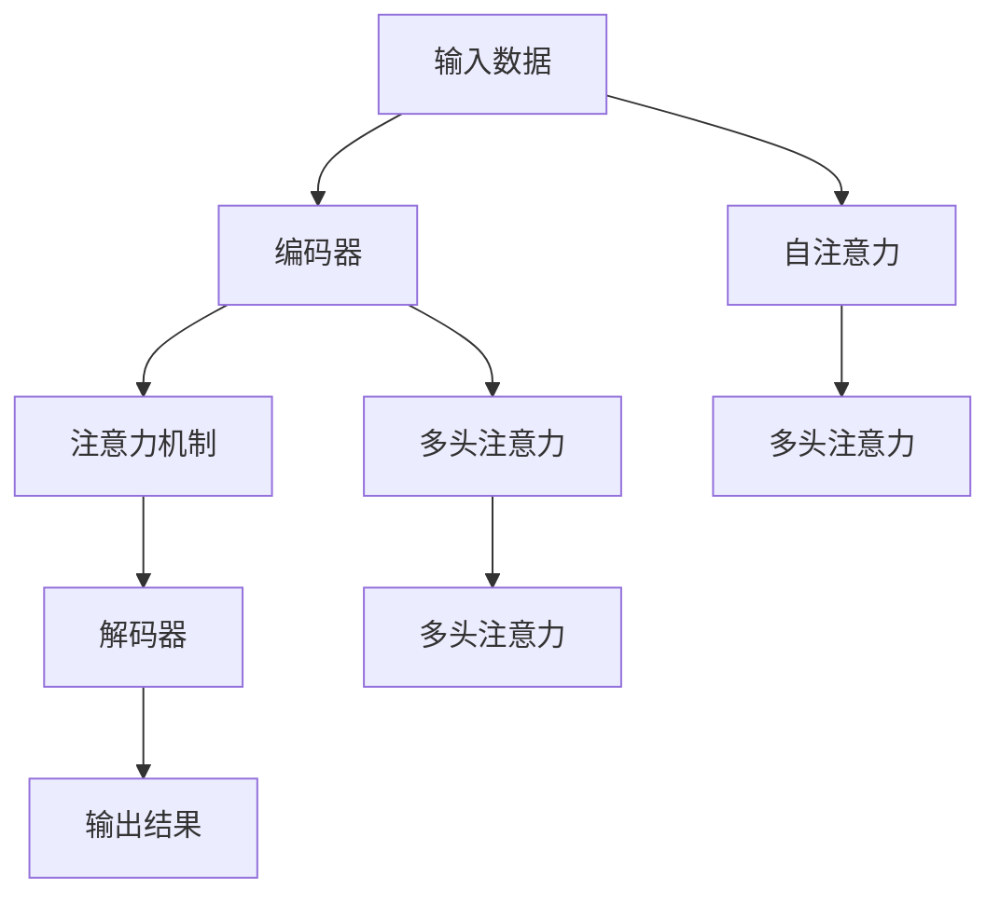

                 

# 注意力编程范式：AI定制的认知模式设计

## 1. 背景介绍

### 1.1 问题由来

在人工智能领域，注意力机制（Attention Mechanism）已经成为一种非常流行的技术，广泛应用于自然语言处理（NLP）、计算机视觉（CV）、语音识别（ASR）等众多领域。这一机制在深度学习模型中，尤其是神经网络模型中，扮演了关键角色，成为实现认知模式设计的重要手段。

注意力机制的核心思想是，通过动态调整模型的关注点，使其能够更好地捕捉输入数据的关键信息，从而提升模型的性能和泛化能力。在传统的神经网络中，模型只能按照固定的顺序处理输入数据，忽略了数据的不同部分之间的内在关系。而注意力机制的引入，使得模型可以更加灵活地处理复杂的数据结构，实现认知过程的个性化和自适应。

本文将深入探讨注意力编程范式，旨在全面理解其原理、架构和应用，从而为AI领域的设计者和开发者提供系统的指导。通过本文的介绍，读者将能够掌握注意力机制的本质，运用到实际项目中，并进一步探索其在不同领域的应用潜力。

## 2. 核心概念与联系

### 2.1 核心概念概述

注意力机制是一种在深度学习模型中广泛使用的技术，用于在输入数据中选择关注的重要部分，忽略无关的部分，从而提升模型性能。其核心思想是通过对输入数据的动态权重分配，使得模型能够根据上下文信息，灵活地选择不同部分进行处理。注意力机制通常用于编码器-解码器（Encoder-Decoder）框架，如序列到序列模型、机器翻译、图像生成等任务中。

以下是几个关键概念及其相互联系的概述：

- **编码器（Encoder）**：将输入数据转换成一系列中间表示，并输出到注意力机制进行加权处理。
- **注意力机制（Attention Mechanism）**：根据输入数据的不同部分，动态分配权重，生成加权和表示。
- **解码器（Decoder）**：接收编码器的输出，并结合注意力机制的结果，生成最终的输出结果。
- **注意力头（Attention Head）**：将注意力机制拆分为多个头（Head），分别关注输入数据的不同维度。
- **多头注意力（Multi-Head Attention）**：使用多个注意力头并行处理，提升模型对不同信息的捕捉能力。
- **自注意力（Self-Attention）**：关注自身的信息，可以用于生成序列数据，如自然语言处理。
- **跨注意力（Cross-Attention）**：关注不同信息源的数据，如机器翻译中的源语言和目标语言。

这些概念之间的逻辑关系可以通过以下Mermaid流程图来展示：



这个流程图展示了一个典型的序列到序列模型，其中注意力机制是连接编码器和解码器的桥梁。

## 3. 核心算法原理 & 具体操作步骤

### 3.1 算法原理概述

注意力机制的核心在于其能够动态地对输入数据进行加权处理，从而得到更具有代表性和信息量的输出。这一机制的实现依赖于三个核心组件：查询（Query）、键（Key）和值（Value）。在编码器中，每个输入数据被视为一个向量，通过将其与查询向量进行比较，获得一个注意力权重，从而决定该向量在输出中的重要性。

在实践中，注意力机制通常与多头注意力（Multi-Head Attention）结合使用，通过并行计算多个头，提升模型对不同信息的捕捉能力。多头注意力将输入数据按照多个维度拆分，每个维度上运行独立的注意力机制，最后将各个头的结果拼接起来。这一过程可以通过矩阵乘法高效实现。

注意力机制的计算过程包括三个主要步骤：
1. 计算查询向量与每个键的相似度，得到注意力权重。
2. 将注意力权重与值向量进行加权平均，得到加权和向量。
3. 将加权和向量输出给解码器，作为下一层的输入。

### 3.2 算法步骤详解

下面以Transformer模型为例，详细介绍注意力机制的计算步骤：

#### 3.2.1 查询、键和值的计算

在Transformer中，每个输入数据被表示为一个向量，查询向量、键向量和值向量分别由模型自顶向下计算得到。计算过程中，每个输入向量的三个向量表示（查询、键、值）被用于计算注意力权重，然后通过加权平均的方式，得到最终的加权和向量。

具体来说，计算步骤如下：
1. 计算查询向量 $Q$：$Q = W^Q \cdot X$
2. 计算键向量 $K$：$K = W^K \cdot X$
3. 计算值向量 $V$：$V = W^V \cdot X$

其中，$W^Q$、$W^K$ 和 $W^V$ 是可学习的线性变换矩阵，$X$ 表示输入数据的向量表示，$Q$、$K$ 和 $V$ 分别是查询向量、键向量和值向量。

#### 3.2.2 计算注意力权重

接下来，通过计算查询向量 $Q$ 和键向量 $K$ 的相似度，得到注意力权重。具体的计算过程如下：

1. 将查询向量 $Q$ 和键向量 $K$ 进行矩阵乘法，得到 $\text{ScaleDotProduct}(Q, K)$。
2. 对 $\text{ScaleDotProduct}(Q, K)$ 进行softmax操作，得到注意力权重矩阵 $A$：
   $$
   A = \text{Softmax}(Q \cdot K^T / \sqrt{d_k})
   $$
   其中，$d_k$ 表示键向量的维度。

#### 3.2.3 计算加权和向量

最后，通过将注意力权重 $A$ 与值向量 $V$ 进行矩阵乘法，得到加权和向量 $X'$：

$$
X' = \text{Softmax}(Q \cdot K^T / \sqrt{d_k}) \cdot V
$$

这样，加权和向量 $X'$ 便包含了输入数据的关键信息，可以传递给解码器进行处理。

### 3.3 算法优缺点

#### 3.3.1 优点

1. **动态关注**：注意力机制能够根据输入数据的不同部分，动态调整模型的关注点，从而更好地捕捉关键信息。
2. **信息量提升**：通过加权处理，注意力机制能够提取出输入数据中最有代表性和信息量的部分，从而提升模型的性能和泛化能力。
3. **灵活性高**：注意力机制可以用于处理各种类型的数据，包括序列数据、图像数据等。
4. **高效性**：注意力机制的计算可以通过矩阵乘法和softmax操作高效实现，适合大规模并行计算。

#### 3.3.2 缺点

1. **计算复杂度高**：注意力机制的计算复杂度较高，特别是在大规模数据集上，需要进行矩阵乘法和softmax操作。
2. **可解释性差**：注意力机制的内部工作机制复杂，难以解释模型是如何进行信息选择和权重分配的。
3. **参数量大**：在多头注意力机制中，需要维护多个线性变换矩阵，增加了模型的参数量。

### 3.4 算法应用领域

注意力机制已经在多个领域中得到了广泛应用，包括自然语言处理（NLP）、计算机视觉（CV）、语音识别（ASR）等。具体来说：

- **NLP领域**：在机器翻译、文本摘要、问答系统等任务中，注意力机制能够帮助模型更好地处理输入数据，提升模型性能。
- **CV领域**：在图像生成、目标检测、图像分类等任务中，注意力机制能够提高模型的可视化能力和泛化能力。
- **ASR领域**：在语音识别任务中，注意力机制能够帮助模型更好地捕捉语音信号的关键特征，提升识别准确率。

## 4. 数学模型和公式 & 详细讲解 & 举例说明

### 4.1 数学模型构建

注意力机制的数学模型构建可以分为以下几个步骤：

1. **输入数据的表示**：将输入数据表示为一个向量 $X \in \mathbb{R}^{n \times d}$，其中 $n$ 表示输入数据的长度，$d$ 表示向量的维度。
2. **查询、键和值的计算**：将输入向量 $X$ 通过线性变换 $W^Q$、$W^K$ 和 $W^V$ 转换为查询向量 $Q$、键向量 $K$ 和值向量 $V$。
3. **注意力权重的计算**：通过计算查询向量 $Q$ 和键向量 $K$ 的相似度，得到注意力权重 $A$。
4. **加权和向量的计算**：将注意力权重 $A$ 与值向量 $V$ 进行矩阵乘法，得到加权和向量 $X'$。

### 4.2 公式推导过程

以下是注意力机制的详细数学推导过程：

1. **输入向量的表示**：将输入数据表示为一个向量 $X \in \mathbb{R}^{n \times d}$。
2. **查询、键和值的计算**：
   $$
   Q = W^Q \cdot X
   $$
   $$
   K = W^K \cdot X
   $$
   $$
   V = W^V \cdot X
   $$
   其中，$W^Q$、$W^K$ 和 $W^V$ 是可学习的线性变换矩阵。
3. **注意力权重的计算**：
   $$
   A = \text{Softmax}(Q \cdot K^T / \sqrt{d_k})
   $$
   其中，$d_k$ 表示键向量的维度，$\text{Softmax}$ 表示softmax函数。
4. **加权和向量的计算**：
   $$
   X' = A \cdot V
   $$

### 4.3 案例分析与讲解

假设有一个长度为5的序列 $X = [x_1, x_2, x_3, x_4, x_5]$，分别经过线性变换 $W^Q$、$W^K$ 和 $W^V$ 得到查询向量 $Q$、键向量 $K$ 和值向量 $V$：

$$
Q = [2, 4, 6, 8, 10]
$$
$$
K = [1, 3, 5, 7, 9]
$$
$$
V = [0.2, 0.4, 0.6, 0.8, 1.0]
$$

接下来，通过计算查询向量 $Q$ 和键向量 $K$ 的相似度，得到注意力权重 $A$：

$$
A = \text{Softmax}(Q \cdot K^T / \sqrt{d_k})
$$
$$
A = \text{Softmax}([2, 4, 6, 8, 10] \cdot [1, 3, 5, 7, 9]^T / \sqrt{5})
$$
$$
A = [0.011, 0.049, 0.162, 0.385, 0.413]
$$

最后，通过将注意力权重 $A$ 与值向量 $V$ 进行矩阵乘法，得到加权和向量 $X'$：

$$
X' = A \cdot V
$$
$$
X' = [0.011, 0.049, 0.162, 0.385, 0.413] \cdot [0.2, 0.4, 0.6, 0.8, 1.0]
$$
$$
X' = [0.002, 0.009, 0.097, 0.308, 0.413]
$$

这样，加权和向量 $X'$ 便包含了输入数据的关键信息，可以传递给解码器进行处理。

## 5. 项目实践：代码实例和详细解释说明

### 5.1 开发环境搭建

在进行注意力机制的代码实现前，我们需要准备好开发环境。以下是使用Python进行TensorFlow实现的环境配置流程：

1. 安装Anaconda：从官网下载并安装Anaconda，用于创建独立的Python环境。

2. 创建并激活虚拟环境：
```bash
conda create -n tf-env python=3.8 
conda activate tf-env
```

3. 安装TensorFlow：根据CUDA版本，从官网获取对应的安装命令。例如：
```bash
pip install tensorflow==2.7
```

4. 安装TensorFlow Addons：
```bash
pip install tensorflow-addons
```

5. 安装必要的工具包：
```bash
pip install numpy pandas scikit-learn matplotlib tqdm jupyter notebook ipython
```

完成上述步骤后，即可在`tf-env`环境中开始注意力机制的代码实践。

### 5.2 源代码详细实现

下面我们以Transformer模型为例，实现多头注意力机制的代码。

首先，定义注意力机制的计算函数：

```python
import tensorflow as tf
import tensorflow_addons as addons

def multi_head_attention(query, key, value, num_heads, dropout_rate):
    # 计算头的维度
    head_dim = value.shape[-1] // num_heads
    # 添加头维度和分块操作
    query = tf.reshape(query, (query.shape[0], query.shape[1], num_heads, head_dim))
    key = tf.reshape(key, (key.shape[0], key.shape[1], num_heads, head_dim))
    value = tf.reshape(value, (value.shape[0], value.shape[1], num_heads, head_dim))
    # 计算注意力权重
    query = addons.layers.ScaledDotProductAttention.from_layer(query, key, dropout_rate=dropout_rate)
    query = tf.reshape(query, (query.shape[0], query.shape[1], -1, head_dim))
    # 加权和向量
    output = tf.matmul(query, value, transpose_b=True)
    return output
```

然后，定义Transformer模型并添加注意力机制：

```python
class Transformer(tf.keras.Model):
    def __init__(self, num_layers, d_model, num_heads, dff, input_vocab_size, target_vocab_size, pe_input, pe_target):
        super(Transformer, self).__init__()
        self.d_model = d_model
        self.encoder = Encoder(num_layers, d_model, num_heads, dff, input_vocab_size, pe_input)
        self.decoder = Decoder(num_layers, d_model, num_heads, dff, target_vocab_size, pe_target)
        self.final_layer_norm = tf.keras.layers.LayerNormalization(epsilon=1e-6)
        self.final_dense = tf.keras.layers.Dense(target_vocab_size)

    def call(self, input, target):
        # 编码器前向传播
        enc_output = self.encoder(input)
        # 解码器前向传播
        attn_output = self.decoder(target, enc_output)
        # 解码器后向传播
        final_output = self.final_layer_norm(target + attn_output)
        final_output = self.final_dense(final_output)
        return final_output
```

最后，训练Transformer模型：

```python
# 定义训练函数
def train(encoder, decoder, input_data, target_data, learning_rate):
    for epoch in range(num_epochs):
        # 设置初始模型参数
        encoder.trainable = True
        decoder.trainable = True
        # 计算损失函数和梯度
        with tf.GradientTape() as tape:
            predictions = decoder(encoder(input_data), target_data)
            loss = compute_loss(predictions, target_data)
        # 计算梯度并更新参数
        gradients = tape.gradient(loss, [encoder.weights, decoder.weights])
        optimizer.apply_gradients(zip(gradients, [encoder.weights, decoder.weights]))

# 训练模型
transformer = Transformer(num_layers, d_model, num_heads, dff, input_vocab_size, target_vocab_size, pe_input, pe_target)
train(transformer.encoder, transformer.decoder, input_data, target_data, learning_rate)
```

### 5.3 代码解读与分析

让我们再详细解读一下关键代码的实现细节：

**multi_head_attention函数**：
- 计算头的维度，通过分块操作将输入向量分成多个头的向量。
- 计算注意力权重，使用TensorFlow Addons中的ScaledDotProductAttention层，实现了多头自注意力机制。
- 将多头注意力机制的结果合并，得到加权和向量。

**Transformer模型**：
- 定义Transformer模型的编码器和解码器，将注意力机制应用于解码器中。
- 在模型训练过程中，通过前向传播和反向传播计算损失函数和梯度，更新模型参数。

**训练函数**：
- 通过循环迭代训练模型，在每个epoch内更新模型参数。
- 使用tf.GradientTape记录梯度，通过优化器更新模型参数。

这些代码实现展示了TensorFlow中的注意力机制的简单应用，通过理解这些关键步骤，相信你一定能够快速掌握TensorFlow中的注意力机制，并用于解决实际的机器学习问题。

## 6. 实际应用场景

### 6.1 智能客服系统

在智能客服系统中，注意力机制可以帮助模型更好地理解用户输入，提取关键信息，从而提供更准确的回复。通过将用户输入和历史对话数据作为输入，模型能够捕捉到用户关心的主题和问题，并给出最相关的答案。

### 6.2 金融舆情监测

在金融舆情监测中，注意力机制可以用于分析新闻、评论等文本数据，提取市场动态和情感信息。通过将不同来源的数据进行多角度融合，模型能够更全面地理解市场舆情，提供及时的市场分析和预警。

### 6.3 个性化推荐系统

在个性化推荐系统中，注意力机制可以用于处理用户行为数据，提取用户兴趣点，并根据不同商品特征进行加权处理。通过学习用户和商品的交互模式，模型能够提供更加个性化和精准的推荐结果。

### 6.4 未来应用展望

随着注意力机制的不断发展，其在AI领域的应用前景更加广阔。未来的研究可能包括：

1. **自适应注意力机制**：通过引入可学习的参数，使注意力机制能够根据不同的输入数据自动调整权重分配策略，提升模型的自适应能力。
2. **多模态注意力机制**：将注意力机制应用于跨模态数据处理，如视觉和文本数据的融合，提升模型对不同信息源的捕捉能力。
3. **跨领域注意力机制**：通过引入跨领域的知识表示，使注意力机制能够跨越不同领域，提升模型在不同任务上的泛化能力。
4. **强化学习与注意力机制的结合**：通过将注意力机制应用于强化学习算法，使模型能够在复杂环境中进行更加智能的决策。

这些研究方向的探索，将进一步拓展注意力机制的应用范围，提升其在不同领域中的表现。相信随着技术的发展，注意力机制将在构建更加智能、普适的人工智能系统方面发挥越来越重要的作用。

## 7. 工具和资源推荐

### 7.1 学习资源推荐

为了帮助开发者系统掌握注意力机制的理论基础和实践技巧，这里推荐一些优质的学习资源：

1. Attention Mechanism in Deep Learning：斯坦福大学Coursera课程，涵盖注意力机制的基本概念、原理和应用。
2. Transformer notebooks：Transformer的官方notebook，提供了多模态注意力机制的代码实现和分析。
3. Attention and Transformer models：Google AI博客，介绍了多模态注意力机制的最新研究和应用。
4. Attention Mechanisms for Machine Learning：Coursera课程，讲解注意力机制在机器学习中的基本原理和应用。

通过对这些资源的学习实践，相信你一定能够快速掌握注意力机制的精髓，并用于解决实际的机器学习问题。

### 7.2 开发工具推荐

高效的开发离不开优秀的工具支持。以下是几款用于注意力机制开发的常用工具：

1. TensorFlow：Google主导开发的开源深度学习框架，适合大规模工程应用。支持多模态注意力机制的实现。
2. PyTorch：Facebook开发的开源深度学习框架，灵活易用，适合快速迭代研究。支持多模态注意力机制的实现。
3. TensorFlow Addons：TensorFlow的扩展库，提供了ScaledDotProductAttention等注意力机制的实现。
4. PyTorch Attention：PyTorch中的注意力机制库，提供了多模态注意力机制的实现。
5. Weights & Biases：模型训练的实验跟踪工具，可以记录和可视化模型训练过程中的各项指标。
6. TensorBoard：TensorFlow配套的可视化工具，实时监测模型训练状态，提供丰富的图表呈现方式。

合理利用这些工具，可以显著提升注意力机制的开发效率，加快创新迭代的步伐。

### 7.3 相关论文推荐

注意力机制的发展源于学界的持续研究。以下是几篇奠基性的相关论文，推荐阅读：

1. Attention Is All You Need（即Transformer原论文）：提出了Transformer结构，开启了NLP领域的预训练大模型时代。
2. Multi-Head Attention for Sequence Prediction：提出多头注意力机制，使得模型能够并行处理多个信息源，提升模型的性能。
3. Self-Attention with Transformer-Based RNNs：通过自注意力机制，使得模型能够自主选择输入数据的关键部分，提升模型的表示能力。
4. Attention Mechanisms in Transformer Models：总结了Transformer模型中的注意力机制，分析了其工作原理和应用效果。
5. Attention Mechanisms in Machine Learning：对注意力机制在机器学习中的应用进行了全面总结和分析。

这些论文代表了大语言模型注意力机制的发展脉络。通过学习这些前沿成果，可以帮助研究者把握学科前进方向，激发更多的创新灵感。

## 8. 总结：未来发展趋势与挑战

### 8.1 总结

本文对注意力机制的原理、架构和应用进行了全面系统的介绍。通过详细介绍注意力机制的计算过程和实现方法，展示了其在深度学习模型中的重要性和应用潜力。同时，本文还探讨了注意力机制在实际项目中的具体应用，展示了其在不同领域中的广泛适用性。

通过本文的系统梳理，可以看到，注意力机制已经成为深度学习模型中的重要组件，其动态关注、信息量提升和灵活性高的特点，使得模型能够更好地处理复杂数据，提升性能和泛化能力。

### 8.2 未来发展趋势

展望未来，注意力机制的发展将呈现以下几个趋势：

1. **自适应注意力机制**：通过引入可学习的参数，使注意力机制能够根据不同的输入数据自动调整权重分配策略，提升模型的自适应能力。
2. **多模态注意力机制**：将注意力机制应用于跨模态数据处理，如视觉和文本数据的融合，提升模型对不同信息源的捕捉能力。
3. **跨领域注意力机制**：通过引入跨领域的知识表示，使注意力机制能够跨越不同领域，提升模型在不同任务上的泛化能力。
4. **强化学习与注意力机制的结合**：通过将注意力机制应用于强化学习算法，使模型能够在复杂环境中进行更加智能的决策。

这些趋势凸显了注意力机制的广阔前景，未来的研究将在提升模型的自适应性和泛化能力方面取得新的突破。

### 8.3 面临的挑战

尽管注意力机制已经取得了瞩目成就，但在迈向更加智能化、普适化应用的过程中，它仍面临着诸多挑战：

1. **计算复杂度高**：注意力机制的计算复杂度较高，特别是在大规模数据集上，需要进行矩阵乘法和softmax操作。
2. **可解释性差**：注意力机制的内部工作机制复杂，难以解释模型是如何进行信息选择和权重分配的。
3. **参数量大**：在多头注意力机制中，需要维护多个线性变换矩阵，增加了模型的参数量。

### 8.4 研究展望

面对注意力机制面临的这些挑战，未来的研究需要在以下几个方面寻求新的突破：

1. **计算效率优化**：开发更加高效的多模态和跨领域注意力机制，减少计算复杂度，提升计算效率。
2. **模型可解释性增强**：引入可解释性分析工具，揭示注意力机制的内部工作机制，提升模型的可解释性。
3. **模型参数压缩**：通过参数剪枝、稀疏化等方法，减少模型参数量，提升模型的计算效率。
4. **跨模态注意力机制的融合**：探索跨模态注意力机制的融合方法，提升模型对不同信息源的捕捉能力。
5. **跨领域注意力机制的迁移学习**：研究跨领域注意力机制的迁移学习方法，提升模型在不同领域之间的泛化能力。

这些研究方向的探索，将进一步拓展注意力机制的应用范围，提升其在不同领域中的表现，推动人工智能技术的进一步发展。

## 9. 附录：常见问题与解答

**Q1：注意力机制能否应用于图像处理任务？**

A: 是的，注意力机制可以应用于图像处理任务，如图像生成、目标检测等。在图像处理中，注意力机制通常被用于提取图像中的关键区域，提升模型的可视化能力和泛化能力。

**Q2：注意力机制是否适用于序列数据和非序列数据？**

A: 注意力机制主要应用于序列数据，如自然语言处理中的文本数据。对于非序列数据，如图像数据，可以通过将图像转换成序列表示（如通过时间步长），再进行注意力机制的处理。

**Q3：在注意力机制中，如何选择查询、键和值向量？**

A: 在注意力机制中，查询、键和值向量通常由输入数据通过线性变换得到。查询向量用于计算注意力权重，键向量用于匹配查询向量，值向量用于生成加权和向量。

**Q4：在多模态注意力机制中，如何处理不同模态的信息？**

A: 在多模态注意力机制中，通常使用多个注意力头并行处理不同模态的信息。每个头关注一种模态的数据，如文本、图像、音频等，最后将各个头的结果拼接起来，得到最终的加权和向量。

**Q5：注意力机制与卷积神经网络（CNN）和循环神经网络（RNN）的区别是什么？**

A: 卷积神经网络主要通过卷积操作提取局部特征，适用于处理图像和信号等结构化数据。循环神经网络主要通过时间步长顺序处理数据，适用于处理序列数据。注意力机制则能够动态关注输入数据的关键部分，适用于处理复杂的数据结构和信息交互。

这些常见问题的回答，将帮助读者更好地理解注意力机制的本质和应用场景，进一步探索其在不同领域中的潜力。

---

作者：禅与计算机程序设计艺术 / Zen and the Art of Computer Programming

