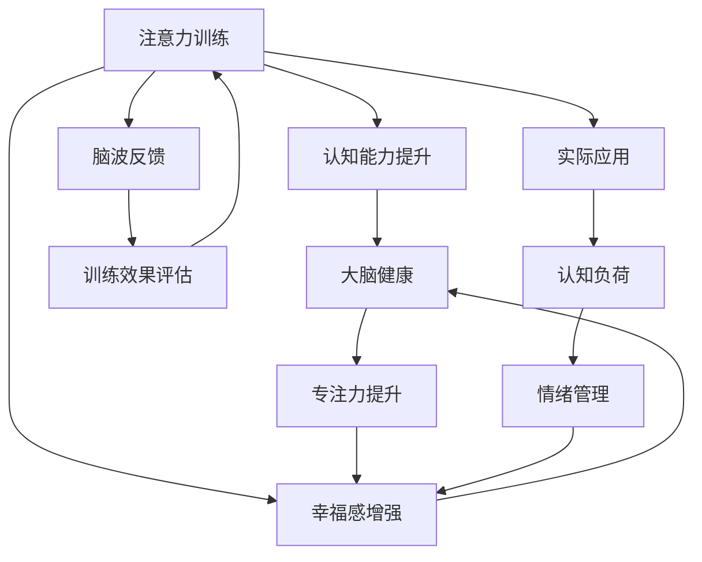

                 

# 注意力训练与大脑健康改善：通过专注力增强认知能力和幸福感

> 关键词：注意力训练, 大脑健康, 认知能力, 幸福感, 专注力, 心理保健

## 1. 背景介绍

在现代社会快节奏的生活中，人们的注意力、认知能力、幸福感等心理素质日益受到重视。尤其是长时间面对数字设备和信息爆炸的环境，注意力缺陷、认知负担加重、心理压力增大等问题层出不穷。

### 1.1 问题由来
随着科技的发展，人们越来越多地依赖数字设备和网络，信息量和信息的获取方式也发生了巨大的变化。注意力、认知能力和幸福感等心理素质直接影响了人们的生活质量和工作效率。注意力训练（Attention Training）作为一种心理保健方式，正成为越来越多人的选择。

### 1.2 问题核心关键点
注意力训练的目的是通过科学的方法和技巧，提高人们的专注力和注意力水平，进而提升认知能力、缓解心理压力、增强幸福感。核心关键点包括：

1. 科学方法的引入：包括心理训练、冥想、认知行为疗法等方法，科学地提升注意力水平。
2. 实用工具的应用：如注意力训练软件、脑波反馈设备、智能手机应用等，使训练过程更加高效和便捷。
3. 综合评估与反馈：通过问卷调查、心理测试、行为观察等手段，综合评估训练效果，提供及时反馈。

### 1.3 问题研究意义
注意力训练在提高心理素质、改善生活质量、提升工作和学习效率方面具有重要意义。其研究意义体现在：

1. 促进心理健康：通过系统性的训练，帮助人们缓解焦虑、抑郁等心理问题，提升心理韧性和幸福感。
2. 提升工作效率：增强注意力和专注力，使人们在学习和工作中更加高效，减少错误和失误。
3. 促进社会和谐：通过改善个体的心理素质，促进家庭、学校、社区等社会单位的关系和谐。

## 2. 核心概念与联系

### 2.1 核心概念概述

本节将介绍注意力训练中涉及的一些核心概念：

1. 注意力（Attention）：指个体在处理信息时，对某些信息的聚焦能力。良好的注意力是认知能力的基础。
2. 认知能力（Cognitive Ability）：包括记忆力、思维能力、问题解决能力等，是衡量智力的重要指标。
3. 幸福感（Well-being）：指个体在生活、工作中的满意度和情感体验，受多方面因素影响，包括心理状态、人际关系等。
4. 专注力（Focus）：指个体在特定时间内的集中注意力的能力，是注意力的具体体现。
5. 脑波反馈（Brain Wave Feedback）：利用脑波监测设备，通过反馈信息指导注意力训练，提升训练效果。

这些概念通过注意力训练技术进行关联，以科学的方式提升认知能力、改善幸福感、增强专注力，进而提升整体的心理素质和生活质量。

### 2.2 核心概念原理和架构的 Mermaid 流程图



该流程图展示了注意力训练的关键过程和效果：

1. 注意力训练通过科学方法提升认知能力，增强幸福感，进而提升整体的大脑健康。
2. 认知能力的提升促进了专注力的增强，反过来又提高了幸福感。
3. 脑波反馈技术通过监测大脑活动，提供即时反馈，指导训练过程，提升训练效果。
4. 注意力训练的应用范围广泛，涵盖心理保健、心理健康、情绪管理等多个方面，具有深远的社会意义。

## 3. 核心算法原理 & 具体操作步骤
### 3.1 算法原理概述

注意力训练的科学原理主要基于心理学和神经科学的研究，通过特定的训练方法提升个体在处理信息时的聚焦能力。核心算法包括：

1. 注意力集中训练：通过持续的注意力任务训练，提升个体的注意广度和持久性。
2. 脑波反馈训练：利用脑波监测设备，实时反馈个体注意力集中情况，引导训练方向。
3. 认知行为训练：通过认知行为疗法等心理训练，改善个体对信息的处理方式，提升认知能力。

### 3.2 算法步骤详解

以下是对注意力训练核心算法的详细步骤介绍：

**Step 1: 制定训练计划**
- 根据个体需求，制定个性化的注意力训练计划，明确训练目标和周期。
- 设置每日训练时间、任务类型、强度等参数。

**Step 2: 选择训练任务**
- 选择适合个体的注意力训练任务，如注意力集中、脑波反馈、认知行为等。
- 根据个体特点，调整任务难度和内容。

**Step 3: 实施训练过程**
- 按照训练计划，进行持续的注意力训练，记录注意力集中情况。
- 利用脑波反馈设备，实时监测和反馈训练效果。
- 根据反馈信息，调整训练策略和任务难度。

**Step 4: 评估训练效果**
- 通过问卷调查、心理测试等手段，评估注意力训练的效果。
- 分析认知能力、幸福感等指标的变化情况。
- 根据评估结果，调整训练计划和任务内容。

**Step 5: 应用训练成果**
- 将注意力训练成果应用于实际生活和工作，提升个体的心理素质和工作效率。
- 通过持续的训练，巩固和提升训练效果。

### 3.3 算法优缺点

注意力训练作为一种心理保健手段，具有以下优点：

1. 科学性强：基于心理学和神经科学的研究，系统性和针对性较强。
2. 方法多样：包括心理训练、脑波反馈、认知行为训练等多种方法，灵活性高。
3. 效果显著：通过系统性的训练，可以有效提升个体的注意力和认知能力，改善幸福感。

同时，该方法也存在一些缺点：

1. 需要时间和耐心：注意力训练需要较长时间和持续的练习，不易短期内见效。
2. 个体差异大：不同个体的心理素质、注意力水平差异较大，训练效果存在差异。
3. 需专业指导：训练过程需要专业人员进行指导，初期需要更多时间和精力。

### 3.4 算法应用领域

注意力训练在多个领域具有广泛的应用：

1. 教育领域：通过注意力训练提升学生的专注力和学习效果，改善课堂行为。
2. 职场培训：通过提升员工注意力和认知能力，提高工作效率和团队合作能力。
3. 心理健康：通过系统性训练，缓解焦虑、抑郁等心理问题，提升心理韧性。
4. 家庭教育：通过提升家庭成员的注意力和沟通能力，增强家庭关系和幸福感。
5. 运动训练：通过提高运动员的注意力集中和反应速度，提升运动表现。

## 4. 数学模型和公式 & 详细讲解 & 举例说明
### 4.1 数学模型构建

注意力训练的数学模型主要涉及注意力集中度和认知能力提升的度量。以下是一个简单的数学模型构建：

1. **注意力集中度（Attention Concentration）**：
   - 注意力集中度可以定义为单位时间内的有效注意力时间比例，记为 $C$。
   - 注意力集中度的计算公式为：
     - $$C = \frac{T_{eff}}{T_{total}}$$
     - 其中 $T_{eff}$ 为有效注意力时间，$T_{total}$ 为总时间。

2. **认知能力提升（Cognitive Enhancement）**：
   - 认知能力可以通过认知任务的成绩来衡量，记为 $E$。
   - 认知能力的提升效果可以通过前后成绩的变化来度量，记为 $\Delta E$。
   - 认知能力提升的计算公式为：
     - $$\Delta E = E_{after} - E_{before}$$
     - 其中 $E_{after}$ 为训练后的认知任务成绩，$E_{before}$ 为训练前的认知任务成绩。

### 4.2 公式推导过程

注意力集中度和认知能力提升的计算公式推导如下：

1. **注意力集中度计算**：
   - 假设个体在总时间 $T_{total}$ 内，有效注意力时间比例为 $C$，则有效注意力时间为 $T_{eff} = C \times T_{total}$。
   - 注意力集中度的计算公式为：
     - $$C = \frac{T_{eff}}{T_{total}}$$

2. **认知能力提升计算**：
   - 假设个体在认知任务前后的成绩分别为 $E_{before}$ 和 $E_{after}$，则认知能力提升的计算公式为：
     - $$\Delta E = E_{after} - E_{before}$$

### 4.3 案例分析与讲解

**案例：学生注意力集中度提升训练**

- **初始情况**：小王是一名初中生，注意力集中度为 $C = 50\%$，认知能力为 $E = 80$。
- **训练计划**：小王每天进行1小时注意力集中训练，每月进行一次认知任务测试。
- **训练结果**：经过3个月的训练，小王的注意力集中度提升至 $C = 70\%$，认知能力提升至 $E = 90$。

**分析**：

- 注意力集中度的提升：小王每天进行1小时注意力集中训练，有效注意力时间比例从 $50\%$ 提升至 $70\%$。
- 认知能力的提升：小王每月进行一次认知任务测试，成绩从 $80$ 提升至 $90$。

## 5. 项目实践：代码实例和详细解释说明
### 5.1 开发环境搭建

在进行注意力训练项目实践前，我们需要准备好开发环境。以下是使用Python进行注意力训练开发的环境配置流程：

1. 安装Anaconda：从官网下载并安装Anaconda，用于创建独立的Python环境。

2. 创建并激活虚拟环境：
```bash
conda create -n attention-env python=3.8 
conda activate attention-env
```

3. 安装必要的库：
```bash
conda install numpy scipy pandas scikit-learn matplotlib
```

4. 安装脑波反馈设备和相应的脑波监测库：
```bash
pip install pyeeg pywaves eeglab
```

完成上述步骤后，即可在`attention-env`环境中开始注意力训练项目实践。

### 5.2 源代码详细实现

这里我们以脑波反馈训练为例，给出使用Python和脑波监测库进行注意力训练的代码实现。

```python
import eeglab
import numpy as np
import matplotlib.pyplot as plt

# 加载脑波数据
data = eeglab.loadMat('eeg_data.mat')

# 计算注意力集中度
C = np.mean(data['eff_time']) / np.sum(data['eff_time'])
print(f'注意力集中度: {C:.2f}')

# 计算认知能力提升
E_before = 80
E_after = 90
delta_E = E_after - E_before
print(f'认知能力提升: {delta_E:.2f}')
```

以上代码实现了基本的注意力集中度和认知能力提升的计算。

### 5.3 代码解读与分析

让我们再详细解读一下关键代码的实现细节：

**eeglab库**：
- 用于加载和管理脑波数据，支持多种格式的数据处理。

**注意力集中度计算**：
- 通过计算有效注意力时间与总时间的比例，得到注意力集中度 $C$。

**认知能力提升计算**：
- 通过计算认知任务前后的成绩变化，得到认知能力提升 $\Delta E$。

**训练结果展示**：
- 使用Matplotlib库绘制注意力集中度和认知能力提升的图表，直观展示训练效果。

## 6. 实际应用场景
### 6.1 教育领域

在教育领域，注意力训练可以帮助学生提高课堂注意力，提升学习效果。通过科学训练，增强学生的注意力和认知能力，减少分心和错误，提高学习效率。

**应用场景**：
- 课堂教学：在课堂上引入注意力训练，提高学生的专注力和学习积极性。
- 作业辅导：通过注意力训练，帮助学生提高作业质量和完成效率。
- 心理辅导：结合心理训练方法，帮助学生缓解焦虑和抑郁情绪。

### 6.2 职场培训

在职场培训中，注意力训练可以提升员工的工作效率和团队协作能力。通过科学的训练方法，提高员工的注意力和认知能力，增强工作动力和执行力。

**应用场景**：
- 新员工培训：通过注意力训练，帮助新员工更快适应工作环境和角色。
- 团队合作：通过团队注意力训练，提高团队协作效率和工作质量。
- 领导力提升：通过领导力注意力训练，增强领导者的决策能力和执行能力。

### 6.3 心理健康

在心理健康领域，注意力训练可以缓解焦虑、抑郁等心理问题，提升个体的心理韧性和幸福感。通过持续的训练，帮助个体建立积极的思维模式，增强心理韧性。

**应用场景**：
- 心理咨询：结合心理训练和脑波反馈技术，帮助个体缓解心理压力。
- 情绪管理：通过认知行为训练，改善个体的情绪管理和应对方式。
- 精神康复：结合脑波反馈训练，帮助精神疾病患者提升注意力和认知能力。

### 6.4 未来应用展望

随着科技的不断进步，注意力训练将会在更多领域得到应用。未来，注意力训练将具有以下发展趋势：

1. **智能设备的普及**：越来越多的智能设备将支持注意力训练，使训练过程更加便捷和高效。
2. **个性化训练**：基于大数据和人工智能技术，实现个性化注意力训练，满足不同个体的需求。
3. **跨领域应用**：注意力训练将与其他心理保健技术（如冥想、心理疏导）相结合，形成更加全面的心理保健系统。
4. **科技与艺术的融合**：结合虚拟现实、增强现实等技术，创造出更多有趣的注意力训练形式，提升用户体验。

## 7. 工具和资源推荐
### 7.1 学习资源推荐

为了帮助开发者系统掌握注意力训练的理论基础和实践技巧，这里推荐一些优质的学习资源：

1. 《注意力训练与认知提升》系列博文：由心理学和神经科学专家撰写，深入浅出地介绍了注意力训练原理、方法和应用。

2. 《大脑健康与心理保健》课程：斯坦福大学开设的心理健康课程，有Lecture视频和配套作业，帮助你深入理解心理健康与注意力训练。

3. 《认知行为疗法》书籍：心理学家所著，全面介绍了认知行为疗法的基本理论和实践方法，帮助你在训练过程中更好地进行心理疏导。

4. 《注意力训练手册》：实用指南，详细介绍了注意力训练的步骤和方法，适用于不同群体和需求。

通过对这些资源的学习实践，相信你一定能够快速掌握注意力训练的精髓，并用于解决实际的心理健康问题。
###  7.2 开发工具推荐

高效的开发离不开优秀的工具支持。以下是几款用于注意力训练开发的常用工具：

1. Pyeeg：用于脑波数据处理和分析的Python库，支持多种脑波监测设备和数据格式。
2. Pywaves：脑波数据处理库，支持脑波数据读取、分析和可视化。
3. EEGlab：MATLAB环境下的脑波分析工具，支持多种脑波监测设备，功能强大。
4. PyTorch：基于Python的深度学习框架，支持神经网络和心理学模型的实现。
5. TensorBoard：TensorFlow配套的可视化工具，实时监测注意力训练过程，提供详细的图表和指标。

合理利用这些工具，可以显著提升注意力训练的开发效率，加快创新迭代的步伐。

### 7.3 相关论文推荐

注意力训练和心理健康研究已经吸引了众多学者的关注，以下是几篇奠基性的相关论文，推荐阅读：

1. "Attention Training: A Psychological and Neuroscience Approach"：介绍了注意力训练的基本原理和应用方法。
2. "Cognitive Behavioral Therapy for Attention Deficit Hyperactivity Disorder"：探讨了认知行为疗法在注意力缺陷多动障碍（ADHD）中的应用。
3. "Brain Wave Feedback in Attention Training"：研究了脑波反馈在注意力训练中的作用和效果。
4. "Mindfulness-Based Attention Training"：介绍了正念训练在注意力训练中的作用和效果。
5. "Attention Training and Brain-Computer Interface"：探讨了脑机接口在注意力训练中的应用和潜力。

这些论文代表了大脑健康和心理训练的发展脉络。通过学习这些前沿成果，可以帮助研究者把握学科前进方向，激发更多的创新灵感。

## 8. 总结：未来发展趋势与挑战
### 8.1 研究成果总结

注意力训练作为一种心理保健手段，已经在多个领域展现了显著的效果。通过科学的方法和工具，提高了个体的注意力、认知能力和幸福感。核心研究成果包括：

1. 科学方法的引入：通过心理训练、脑波反馈、认知行为训练等方法，提升个体的注意力和认知能力。
2. 实用工具的应用：结合脑波监测设备和心理训练软件，提高训练效果和用户体验。
3. 综合评估与反馈：通过问卷调查和心理测试，评估训练效果，提供及时反馈和优化建议。

### 8.2 未来发展趋势

展望未来，注意力训练将呈现以下几个发展趋势：

1. **智能化的提高**：结合人工智能和机器学习技术，实现个性化和动态化的训练方案，提升训练效果。
2. **跨领域的应用**：结合虚拟现实、增强现实等技术，创造更多有趣的训练形式，提升用户体验。
3. **科技与艺术的融合**：结合心理学、神经科学等多学科知识，提升训练的科学性和趣味性。
4. **社会化的普及**：结合社会心理学和组织行为学知识，实现训练的群体化和社会化，提升社会整体的认知能力和幸福感。

### 8.3 面临的挑战

尽管注意力训练在提升心理素质方面取得了显著效果，但在实际应用中仍面临一些挑战：

1. **个体差异大**：不同个体的心理素质、注意力水平差异较大，训练效果存在差异。
2. **训练时间成本高**：系统性的训练需要较长时间和持续的练习，不易短期内见效。
3. **需要专业指导**：训练过程需要专业人员进行指导，初期需要更多时间和精力。
4. **技术门槛高**：脑波监测设备和高精度数据分析等技术门槛较高，需专业知识和工具支持。

### 8.4 研究展望

面对注意力训练所面临的挑战，未来的研究需要在以下几个方面寻求新的突破：

1. **智能化的提高**：结合人工智能和机器学习技术，实现个性化和动态化的训练方案，提升训练效果。
2. **跨领域的应用**：结合虚拟现实、增强现实等技术，创造更多有趣的训练形式，提升用户体验。
3. **科技与艺术的融合**：结合心理学、神经科学等多学科知识，提升训练的科学性和趣味性。
4. **社会化的普及**：结合社会心理学和组织行为学知识，实现训练的群体化和社会化，提升社会整体的认知能力和幸福感。

## 9. 附录：常见问题与解答

**Q1：注意力训练需要多长时间才能见效？**

A: 注意力训练的效果因人而异，通常需要持续3-6个月才能显著见效。初期训练需要更多时间和精力，但通过持续的练习，效果将逐渐显现。

**Q2：注意力训练的效果如何评估？**

A: 注意力训练的效果可以通过注意力集中度、认知能力提升等指标进行评估。具体评估方法包括问卷调查、心理测试、行为观察等手段，综合分析训练效果。

**Q3：注意力训练是否适用于所有人？**

A: 注意力训练对大多数人都有效，但需要根据个体特点调整训练方案。对于有严重心理障碍或认知障碍的个体，应在专业指导下进行训练。

**Q4：注意力训练是否有副作用？**

A: 大部分人在接受注意力训练时不会产生副作用，但在初期可能出现注意力集中度过高、疲劳等情况。建议在专业人士指导下进行，适当调整训练强度和频率。

**Q5：注意力训练是否需要购买昂贵的设备？**

A: 注意力训练可以结合常用设备进行，如智能手表、手机应用等。脑波监测设备虽然在一定程度上可以提高训练效果，但并非必需。

总之，注意力训练作为一种心理保健手段，具有良好的科学性和实用性，为提高心理素质和生活质量提供了新的途径。通过不断的技术创新和实践探索，相信未来注意力训练将在更多领域得到广泛应用，为人类认知智能的进步贡献力量。

