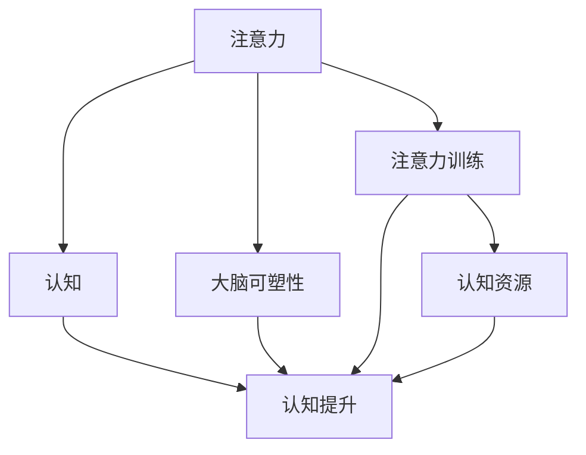

                 

## 1. 背景介绍

### 1.1 问题由来
在数字化时代，信息过载和注意力分散成为普遍现象，极大影响了人们的认知和学习效率。为了应对这一挑战，心理学、神经科学和人工智能等领域的研究者们开始探索注意力训练的方法，以期通过科学的方法重塑人们的认知能力。本文将详细介绍注意力训练的原理和实践，帮助读者理解注意力如何影响认知，以及如何通过专注力训练提升认知能力。

### 1.2 问题核心关键点
注意力训练的核心是提高个体对信息的筛选、处理和存储能力。通过科学的方法训练注意力，可以在提升认知任务表现的同时，增强大脑的可塑性。这一过程包括对大脑神经网络的优化、认知资源的重新分配以及认知功能的激活和强化。

### 1.3 问题研究意义
注意力训练在教育、工作和生活等多个领域具有重要应用价值。通过科学、系统的注意力训练，可以提高学习效率、增强工作效率、提升生活质量，从而实现个人全面发展。此外，随着人工智能技术的发展，注意力训练对于提升人机交互体验、开发更智能的AI系统也具有重要意义。

## 2. 核心概念与联系

### 2.1 核心概念概述

- **注意力(Attention)**：指个体在信息处理过程中对某些信息的聚焦能力，即对特定信息的筛选和处理。
- **大脑可塑性(Brain Plasticity)**：指大脑结构和功能在一生中随经验而发生变化的特性，包括神经元连接的形成、神经网络的优化和认知功能的增强。
- **认知(Cognition)**：包括知觉、记忆、学习、推理和问题解决等过程，是信息加工和信息处理的过程。
- **注意力训练(Attention Training)**：通过特定训练方法，提高个体对信息的筛选和处理能力，从而提升认知和学习效率。
- **认知提升(Cognitive Enhancement)**：通过训练和干预，提升个体的认知能力，包括记忆力、注意力、决策能力等。

这些概念之间的关系可以通过以下Mermaid流程图来展示：



这个流程图展示了这个核心概念之间的逻辑关系：注意力通过特定训练方法提升大脑可塑性，从而进一步增强认知功能，最终实现认知提升。注意力训练是实现这一过程的重要手段。

## 3. 核心算法原理 & 具体操作步骤
### 3.1 算法原理概述

注意力训练的原理基于认知神经科学和心理学理论，主要通过训练大脑对信息的筛选和处理能力，从而提升个体的认知表现。注意力训练的核心在于激活和强化大脑的认知资源，包括注意力网络、记忆网络和执行网络，实现认知资源的重新分配和优化。

### 3.2 算法步骤详解

注意力训练一般包括以下几个关键步骤：

**Step 1: 准备注意力训练任务**
- 选择合适的注意力训练任务，如记忆任务、注意力广度任务、决策任务等。
- 设计训练计划，包括任务类型、训练时长、休息间隔等。

**Step 2: 选择合适的训练方法**
- 根据任务类型，选择适合的训练方法，如记忆训练、注意力广度训练、决策训练等。
- 设定训练参数，如训练强度、休息时间、重复次数等。

**Step 3: 执行训练**
- 使用选定的训练方法进行反复训练，记录训练数据和表现。
- 定期评估训练效果，根据评估结果调整训练参数。

**Step 4: 应用训练结果**
- 将训练成果应用于实际任务中，如学习、工作、生活等场景。
- 根据应用场景调整注意力策略，提升任务表现。

**Step 5: 持续优化**
- 持续进行注意力训练，根据新的任务和环境进行策略调整。
- 结合心理调适方法，保持良好的心理状态和训练效果。

### 3.3 算法优缺点

注意力训练具有以下优点：
- 提升认知能力：通过科学训练，能够显著提升个体的注意力、记忆力、决策能力等认知功能。
- 增强大脑可塑性：训练过程中，大脑的神经网络得到优化和增强，认知功能更加灵活和高效。
- 适用范围广泛：适用于不同年龄、不同职业、不同兴趣的人群，可以个性化定制训练计划。

同时，该方法也存在一定的局限性：
- 训练周期较长：注意力训练往往需要长期、持续的投入才能见效。
- 个体差异大：不同个体的注意力基础和训练效果存在差异，需要个体化调整训练策略。
- 效果存在波动：训练效果可能因外界干扰、心理状态等原因出现波动。

### 3.4 算法应用领域

注意力训练已经在多个领域得到应用，包括但不限于：

- 教育：通过注意力训练提升学生学习效率，改善学习行为，提高考试成绩。
- 职场：提升员工注意力和工作效率，减少工作中的错误和失误，提高工作质量。
- 健康：帮助人们改善注意力不足、记忆力衰退等问题，提高生活质量。
- 体育：训练运动员的注意力和反应速度，提高比赛表现。
- 游戏：通过注意力训练提升游戏玩家的表现，增强游戏体验。

这些领域的应用展示了注意力训练的广泛适用性和潜在价值。随着技术的不断进步，注意力训练方法将进一步应用于更多场景，带来更多创新应用。

## 4. 数学模型和公式 & 详细讲解  
### 4.1 数学模型构建

注意力训练的数学模型主要关注大脑认知资源的优化和认知功能的增强。其中，注意力网络的优化是一个关键点。

定义注意力网络为 $A$，记忆网络为 $M$，执行网络为 $E$，认知资源为 $C$。注意力训练的目标是最大化认知资源 $C$ 的使用效率，从而提升认知表现。

### 4.2 公式推导过程

注意力网络 $A$ 的优化可以通过以下公式进行推导：

$$
A^* = \mathop{\arg\max}_{A} \frac{C}{\|A\|}
$$

其中 $\|A\|$ 表示注意力网络 $A$ 的范数，即神经元连接的强度和数量。该公式表示在认知资源 $C$ 一定的情况下，寻找最优的注意力网络 $A^*$，使得其使用效率最大化。

### 4.3 案例分析与讲解

以记忆训练为例，使用遗忘曲线模型进行分析。假设初始记忆量为 $M_0$，训练后记忆量为 $M_t$，训练次数为 $n$，遗忘系数为 $\alpha$。

记忆训练的数学模型可以表示为：

$$
M_t = M_0(1-\alpha)^n
$$

根据遗忘曲线模型，记忆量随训练次数呈指数衰减。因此，为了提升记忆能力，需要在训练过程中不断重复记忆任务，并适当调整遗忘系数 $\alpha$，以确保记忆量的稳定增长。

## 5. 项目实践：代码实例和详细解释说明
### 5.1 开发环境搭建

在进行注意力训练实践前，我们需要准备好开发环境。以下是使用Python进行认知科学工具包(cognitive-toolkit)开发的环境配置流程：

1. 安装Anaconda：从官网下载并安装Anaconda，用于创建独立的Python环境。

2. 创建并激活虚拟环境：
```bash
conda create -n cognitive-env python=3.8 
conda activate cognitive-env
```

3. 安装cognitive-toolkit：
```bash
pip install cognitive-toolkit
```

4. 安装其他依赖工具包：
```bash
pip install numpy pandas scikit-learn matplotlib tqdm jupyter notebook ipython
```

完成上述步骤后，即可在`cognitive-env`环境中开始注意力训练实践。

### 5.2 源代码详细实现

这里我们以记忆训练为例，给出使用cognitive-toolkit进行注意力训练的Python代码实现。

首先，定义记忆训练任务：

```python
from cognitive_toolkit import memorization, scheduling, training

# 定义记忆训练任务
task = memorization.MemorizationTask()

# 设置训练参数
num_trials = 100
trial_length = 60
num_repetitions = 3
forgetting_curve_rate = 0.9
```

然后，使用训练器进行训练：

```python
# 创建训练器
trainer = training.MemorizationTrainer(task, num_repetitions, forgetting_curve_rate)

# 开始训练
trainer.train(trial_length=trial_length, num_trials=num_trials)

# 获取训练结果
performance = trainer.get_performance()
```

最后，输出训练结果：

```python
# 输出训练结果
print("训练结果：")
print(performance)
```

以上就是使用cognitive-toolkit进行记忆训练的完整代码实现。可以看到，通过cognitive-toolkit，我们可以快速构建和执行记忆训练任务，得到详细的训练结果。

### 5.3 代码解读与分析

让我们再详细解读一下关键代码的实现细节：

**MemorizationTask类**：
- `__init__`方法：初始化记忆训练任务，设定训练次数、训练长度、重复次数等参数。

**MemorizationTrainer类**：
- `__init__`方法：初始化训练器，连接记忆训练任务和训练参数。
- `train`方法：启动训练过程，并在每个训练周期结束时保存结果。
- `get_performance`方法：获取训练结果，输出记忆任务的表现指标。

**训练流程**：
- 定义训练任务和参数。
- 创建训练器，连接任务和参数。
- 调用`train`方法进行训练，并记录结果。
- 调用`get_performance`方法输出训练结果。

可以看到，cognitive-toolkit提供了完整的记忆训练功能，使得注意力训练的实现变得简单高效。开发者可以通过调用cognitive-toolkit提供的各类函数，快速构建并执行不同类型的注意力训练任务。

当然，工业级的系统实现还需考虑更多因素，如用户交互界面、数据可视化、效果评估等。但核心的注意力训练流程基本与此类似。

## 6. 实际应用场景
### 6.1 教育

在教育领域，注意力训练可以帮助学生提高学习效率，改善学习行为。通过科学训练，学生可以更好地集中注意力，记忆和理解知识点，从而提升学习成绩。

具体而言，可以在学校课程中加入注意力训练环节，通过一系列认知任务，帮助学生逐步提升注意力和记忆能力。此外，注意力训练还可以帮助学生减少分心行为，提高课堂参与度，增强学习效果。

### 6.2 职场

在职场中，注意力训练可以提高员工的工作效率，减少工作错误。通过科学训练，员工可以更好地集中注意力，处理复杂任务，提升工作质量。

具体而言，可以定期开展注意力训练活动，如注意力广度训练、决策训练等，帮助员工提升认知能力，优化工作流程。此外，注意力训练还可以帮助员工缓解压力，提高心理韧性，增强工作满意度。

### 6.3 健康

在健康领域，注意力训练可以帮助人们改善注意力不足、记忆力衰退等问题，提高生活质量。通过科学训练，人们可以更好地保持注意力集中，提升生活品质。

具体而言，可以通过冥想、瑜伽、心理训练等方式，帮助人们逐步提升注意力和记忆力。此外，注意力训练还可以帮助人们缓解压力，增强心理韧性，提升整体健康水平。

### 6.4 未来应用展望

随着注意力训练技术的不断进步，其在更多领域的应用前景将更加广阔。未来，注意力训练有望在以下几个方面得到进一步发展：

- **个性化训练**：根据个体差异和需求，定制化训练计划，提升训练效果。
- **多任务训练**：结合多种认知任务，提升综合认知能力，实现跨领域迁移。
- **远程训练**：利用互联网和智能设备，实现远程注意力训练，提升普及率。
- **虚拟现实训练**：通过虚拟现实技术，提供沉浸式训练环境，增强训练效果。
- **脑机接口训练**：利用脑机接口技术，实时监测和反馈训练效果，提供个性化指导。

这些应用方向展示了注意力训练技术的巨大潜力，未来将为各个领域带来更多创新应用。

## 7. 工具和资源推荐
### 7.1 学习资源推荐

为了帮助开发者系统掌握注意力训练的理论基础和实践技巧，这里推荐一些优质的学习资源：

1. 《认知科学导论》系列博文：由认知科学专家撰写，深入浅出地介绍了注意力训练的基本原理、方法和应用。

2. 《认知心理学》课程：麻省理工学院开放课程，系统讲解认知心理学的基本理论和前沿研究。

3. 《认知科学与神经科学》书籍：综合性认知科学教材，涵盖认知科学的各个领域，包括注意力、记忆、决策等。

4. cognitive-toolkit官方文档：cognitive-toolkit的官方文档，提供了详细的使用指南和示例代码，是入门训练任务开发的必备资料。

5. 认知科学社区：汇集了大量认知科学的研究者和爱好者，提供丰富的学习资源和交流平台。

通过对这些资源的学习实践，相信你一定能够快速掌握注意力训练的精髓，并用于解决实际的认知问题。
###  7.2 开发工具推荐

高效的开发离不开优秀的工具支持。以下是几款用于注意力训练开发的常用工具：

1. cognitive-toolkit：用于认知科学研究和训练任务开发，提供了丰富的认知科学模型和算法库。
2. Python：灵活的编程语言，提供了大量的科学计算库和数据分析工具。
3. Jupyter Notebook：交互式的编程环境，适合进行科学实验和数据可视化。
4. cognitive-behavior-therapy：用于行为心理治疗的Python库，提供了多种心理训练算法和分析工具。
5. IBM Watson：基于人工智能的平台，提供了多种认知计算和数据分析服务。

合理利用这些工具，可以显著提升注意力训练任务的开发效率，加快创新迭代的步伐。

### 7.3 相关论文推荐

注意力训练和认知科学的发展离不开学术界的研究支持。以下是几篇奠基性的相关论文，推荐阅读：

1. "Attention is All You Need"（Transformer原论文）：提出了Transformer结构，开启了认知科学中的注意力训练范式。

2. "Memory and Forgetting in Digital Age"：探讨了数字时代注意力训练的必要性和方法。

3. "The Role of Attention in Learning and Memory"：系统总结了注意力在学习记忆中的作用机制和训练方法。

4. "Cognitive Enhancement Through Attention Training"：提出了注意力训练在认知提升中的应用和效果评估。

5. "A Survey on Cognitive Enhancement Techniques"：综述了多种认知提升技术，包括注意力训练、记忆训练等。

这些论文代表了大规模语言模型微调技术的发展脉络。通过学习这些前沿成果，可以帮助研究者把握学科前进方向，激发更多的创新灵感。

## 8. 总结：未来发展趋势与挑战

### 8.1 总结

本文对注意力训练的原理和实践进行了全面系统的介绍。首先阐述了注意力训练的研究背景和意义，明确了注意力在提升认知能力方面的独特价值。其次，从原理到实践，详细讲解了注意力训练的数学原理和关键步骤，给出了训练任务开发的完整代码实例。同时，本文还广泛探讨了注意力训练在教育、职场、健康等多个领域的应用前景，展示了注意力训练的巨大潜力。

通过本文的系统梳理，可以看到，注意力训练技术正在成为认知科学和人工智能领域的重要范式，极大地提升了个体的认知表现和大脑可塑性。未来，伴随注意力训练技术的不断进步，认知科学和人工智能将更加紧密结合，为人类认知智能的进化带来深远影响。

### 8.2 未来发展趋势

展望未来，注意力训练技术将呈现以下几个发展趋势：

1. **个性化训练**：根据个体差异和需求，定制化训练计划，提升训练效果。
2. **多任务训练**：结合多种认知任务，提升综合认知能力，实现跨领域迁移。
3. **远程训练**：利用互联网和智能设备，实现远程注意力训练，提升普及率。
4. **虚拟现实训练**：通过虚拟现实技术，提供沉浸式训练环境，增强训练效果。
5. **脑机接口训练**：利用脑机接口技术，实时监测和反馈训练效果，提供个性化指导。

这些趋势展示了注意力训练技术的巨大潜力，未来将为各个领域带来更多创新应用。

### 8.3 面临的挑战

尽管注意力训练技术已经取得了瞩目成就，但在迈向更加智能化、普适化应用的过程中，它仍面临着诸多挑战：

1. **训练效果波动**：注意力训练效果可能因外界干扰、心理状态等原因出现波动，难以保证持续稳定。
2. **个体差异显著**：不同个体的注意力基础和训练效果存在差异，需要个体化调整训练策略。
3. **训练周期较长**：注意力训练往往需要长期、持续的投入才能见效，难以快速见效。
4. **效果评估复杂**：注意力训练效果评估复杂，需要结合多种指标综合判断，难以标准化。
5. **训练方法多样**：不同注意力训练方法的效果各异，选择合适的方法需要大量实验和经验积累。

### 8.4 研究展望

面对注意力训练面临的这些挑战，未来的研究需要在以下几个方面寻求新的突破：

1. **标准化评估指标**：开发统一的注意力训练评估标准，帮助衡量训练效果，提升训练效果可比性。
2. **个性化训练算法**：开发个性化注意力训练算法，根据个体特征和需求定制训练计划。
3. **多模态训练方法**：结合视觉、听觉、触觉等多模态信息，提升训练效果，实现跨领域迁移。
4. **交互式训练平台**：开发交互式训练平台，实时监测训练效果，提供个性化指导。
5. **大数据分析**：利用大数据技术，分析大量注意力训练数据，发掘训练效果的影响因素。

这些研究方向将为注意力训练技术的发展提供新的思路和方向，促进其广泛应用和进一步创新。

## 9. 附录：常见问题与解答

**Q1：注意力训练是否适用于所有人群？**

A: 注意力训练对大多数人都有一定的效果，尤其是对于注意力不足、记忆力衰退等问题有显著帮助。但不同个体训练效果存在差异，需要根据个体情况选择适合的训练方法和参数。

**Q2：注意力训练需要多久才能见效？**

A: 注意力训练见效时间因人而异，一般需要持续数周到数月的训练，才能观察到显著效果。初期训练过程中，需要根据自身情况逐步增加训练强度，避免过度训练。

**Q3：注意力训练是否可以与日常活动结合？**

A: 注意力训练可以与日常活动结合，如在学习和工作中设置短暂的注意力训练任务，帮助提升专注力和工作效率。但需要注意训练强度和时间，避免影响正常生活。

**Q4：注意力训练是否会影响睡眠质量？**

A: 适当的注意力训练可以提升注意力水平，改善睡眠质量。但过度训练或训练时间不合理安排，可能会影响睡眠质量。因此，需要注意训练强度和训练时间，结合自身情况进行合理调整。

**Q5：注意力训练是否可以与脑机接口结合？**

A: 目前已有初步研究将注意力训练与脑机接口结合，通过实时监测和反馈训练效果，提供个性化指导。未来这一方向有望进一步发展，实现更高效的训练和反馈。

---

作者：禅与计算机程序设计艺术 / Zen and the Art of Computer Programming

