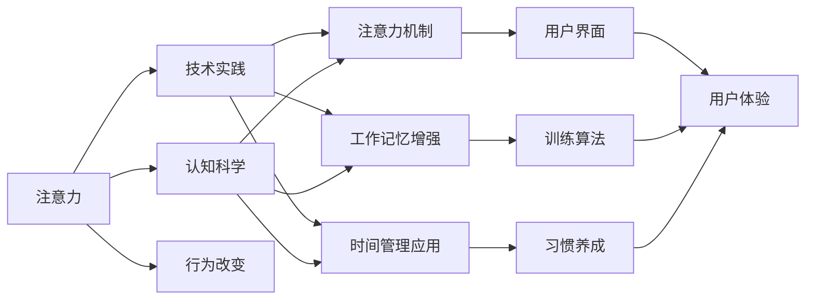

                 

# 注意力训练：提高专注力、提升生产力的方法

> 关键词：注意力,专注力,注意力机制,认知科学,生产力提升,技术实践

## 1. 背景介绍

### 1.1 问题由来

在当今信息爆炸的时代，如何有效地管理我们的注意力，提升个人和团队的生产力，成为每个人都需要面对的挑战。无论是学生、职场人士还是创业者，如果不能有效分配自己的注意力，都可能导致效率低下、工作倦怠甚至职业倦怠。因此，如何通过科学的方法来训练我们的注意力，提升专注力，从而提高生产力，成为近年来心理学、神经科学和人工智能交叉领域的研究热点。

### 1.2 问题核心关键点

注意力训练的核心在于如何通过科学的方法，系统性地提高个体或团队的注意力水平，从而在学习和工作中取得更好的效果。注意力训练主要涉及以下几个方面：

- **认知科学**：研究注意力是如何在大脑中形成和运作的，以及如何通过训练来提升注意力水平。
- **技术实践**：将注意力训练的理论应用于具体工具和算法，如注意力机制、工作记忆增强、时间管理应用等，帮助用户进行有效的注意力管理。
- **行为改变**：通过心理学和行为科学的方法，帮助用户建立良好的注意力习惯，形成持久的改进。

## 2. 核心概念与联系

### 2.1 核心概念概述

在介绍注意力训练的核心概念之前，需要先简要介绍一下与之密切相关的几个核心概念：

- **注意力**：指人在处理信息时对特定刺激的聚焦和选择。注意力集中时，信息处理效率高，反之则效率低。
- **专注力**：指个体在特定时间内对某一任务保持持续、稳定的注意力的能力。
- **工作记忆**：指个体在短时间内存储和处理信息的能力，是注意力和认知功能的关键组成部分。
- **认知负荷**：指在信息处理过程中，大脑所承受的负担，过高的认知负荷会导致注意力分散。

这些概念之间具有紧密的联系，通过科学的方法训练注意力，可以显著提升专注力和工作记忆能力，从而降低认知负荷，提高信息处理效率。

### 2.2 核心概念原理和架构的 Mermaid 流程图(Mermaid 流程节点中不要有括号、逗号等特殊字符)



这个流程图展示了注意力训练的基本架构：

1. 注意力训练的起点是**注意力**，通过**认知科学**和**技术实践**两方面进行深入研究和实现。
2. 技术实践包括使用**注意力机制**、增强**工作记忆**和优化**时间管理**等工具，以帮助用户提升注意力水平。
3. **认知科学**和**技术实践**的结合，通过用户界面（User Interface, UI）和习惯养成（Habit Formation）等环节，形成持续改进的闭环。

## 3. 核心算法原理 & 具体操作步骤

### 3.1 算法原理概述

注意力训练的核心算法通常基于认知心理学和神经科学的原理，旨在通过系统的训练，提升个体的注意力水平。其中，**注意力机制**是注意力训练的核心技术之一。注意力机制通过模拟人类大脑在处理信息时的选择和聚焦过程，帮助用户集中注意力，提升信息处理效率。

注意力机制的原理在于，通过调整神经网络的参数，使其在处理输入时，能够对特定特征或目标给予更高的权重，从而实现对信息的聚焦和选择。在NLP领域，注意力机制广泛应用于机器翻译、文本生成等任务，通过动态调整权重，实现对输入序列中不同位置的关注，从而提升模型的性能。

### 3.2 算法步骤详解

注意力训练的主要步骤包括：

**Step 1: 设定训练目标**

- 明确注意力训练的目的是提升注意力、专注力还是工作记忆。
- 设定具体的训练目标，如每天训练的时长、训练任务的类型等。

**Step 2: 选择合适的注意力训练工具**

- 选择适合当前任务需求的工具，如注意力训练游戏、注意力增强应用等。
- 根据个人偏好和习惯，选择不同类型的训练工具，如可视化界面、文字提示、声音指导等。

**Step 3: 进行注意力训练**

- 按照训练计划，每天进行一定时间的注意力训练。
- 在训练过程中，关注大脑的反馈，如疲劳、分心等，及时调整训练强度和方式。

**Step 4: 评估和优化**

- 定期评估注意力训练的效果，如通过注意力测试、认知负荷评估等方法。
- 根据评估结果，优化训练计划，调整训练强度和方式，以达到最佳效果。

### 3.3 算法优缺点

注意力训练的优势在于其系统性和科学性，通过定期的、有针对性的训练，能够显著提升个体的注意力水平。同时，由于其以认知科学为基础，能够帮助用户建立正确的注意力习惯，形成长期的改进。

然而，注意力训练也存在一些局限性：

- **时间和资源消耗**：注意力训练通常需要一定的时间和精力投入，对于忙碌的职场人士来说，可能难以长期坚持。
- **个性化不足**：标准的注意力训练工具可能无法完全适配个体的需求，需要根据个人情况进行个性化调整。
- **效果个体差异**：不同个体的注意力基础和训练效果存在差异，部分用户可能对训练效果不明显。

### 3.4 算法应用领域

注意力训练的应用领域非常广泛，涵盖了教育、职场、健康等多个领域。

**教育领域**：通过注意力训练工具，帮助学生提升课堂专注力，提高学习效果。

**职场领域**：通过注意力训练应用，帮助职场人士优化工作流程，提升工作效率，减少工作压力。

**健康领域**：通过注意力训练游戏，帮助注意力不足的用户改善认知功能，缓解焦虑、抑郁等心理健康问题。

此外，注意力训练还广泛应用于游戏、运动等领域，帮助用户提升反应速度、决策能力等。

## 4. 数学模型和公式 & 详细讲解 & 举例说明（备注：数学公式请使用latex格式，latex嵌入文中独立段落使用 $$，段落内使用 $)
### 4.1 数学模型构建

注意力训练的数学模型通常基于认知心理学和神经科学的理论，使用各种数学公式来描述注意力和认知负荷之间的关系。

### 4.2 公式推导过程

以认知负荷理论为基础，假设认知负荷$C$与注意力$A$之间的关系可以用公式$C = f(A)$来表示，其中$f$为某种函数关系。在注意力训练过程中，通过调整注意力$A$，可以改变认知负荷$C$。

假设训练目标是将认知负荷$C$从当前值$C_0$降低到目标值$C_{\text{target}}$，则训练过程可以用以下公式表示：

$$
A_{\text{train}} = f^{-1}(C_{\text{target}})
$$

其中$A_{\text{train}}$为训练过程中需要提升的注意力水平。

### 4.3 案例分析与讲解

以NLP领域的注意力机制为例，通过调整Transformer模型中的注意力权重，使其在处理不同长度的文本时，能够对重要部分给予更高的权重，从而实现对关键信息的聚焦。

假设输入序列为$X = [x_1, x_2, \dots, x_n]$，注意力机制的计算过程可以表示为：

$$
\alpha_k = \frac{e^{\mathbf{q}_k^\top \mathbf{K}_k}}{\sum_{i=1}^n e^{\mathbf{q}_k^\top \mathbf{K}_i}}
$$

其中$\alpha_k$表示对输入序列中第$k$个位置的注意力权重，$\mathbf{q}_k$和$\mathbf{K}_k$分别为查询向量和键向量，通过计算相似度得分，动态调整权重。

## 5. 项目实践：代码实例和详细解释说明

### 5.1 开发环境搭建

要进行注意力训练的代码实现，首先需要搭建开发环境。以下是使用Python进行PyTorch开发的环境配置流程：

1. 安装Anaconda：从官网下载并安装Anaconda，用于创建独立的Python环境。

2. 创建并激活虚拟环境：
```bash
conda create -n attention-env python=3.8 
conda activate attention-env
```

3. 安装PyTorch：根据CUDA版本，从官网获取对应的安装命令。例如：
```bash
conda install pytorch torchvision torchaudio cudatoolkit=11.1 -c pytorch -c conda-forge
```

4. 安装TensorBoard：用于可视化模型训练过程。
```bash
pip install tensorboard
```

5. 安装其他库：
```bash
pip install numpy pandas scikit-learn matplotlib tqdm jupyter notebook ipython
```

完成上述步骤后，即可在`attention-env`环境中开始注意力训练的代码实现。

### 5.2 源代码详细实现

我们以一个简单的注意力增强应用为例，给出使用PyTorch实现注意力训练的代码实现。

```python
import torch
import torch.nn as nn
import torch.optim as optim

# 定义注意力增强模型
class AttentionEnhancer(nn.Module):
    def __init__(self, input_size):
        super(AttentionEnhancer, self).__init__()
        self.attention = nn.Sequential(
            nn.Linear(input_size, 64),
            nn.ReLU(),
            nn.Linear(64, 1),
        )
    
    def forward(self, x):
        attention_scores = self.attention(x)
        attention_weights = nn.Softmax(dim=1)(attention_scores)
        weighted_x = (attention_weights * x).sum(dim=1)
        return weighted_x

# 训练模型
def train(model, train_loader, optimizer):
    model.train()
    for batch in train_loader:
        inputs, labels = batch
        optimizer.zero_grad()
        outputs = model(inputs)
        loss = nn.MSELoss()(outputs, labels)
        loss.backward()
        optimizer.step()

# 测试模型
def evaluate(model, test_loader):
    model.eval()
    total_loss = 0
    for batch in test_loader:
        inputs, labels = batch
        with torch.no_grad():
            outputs = model(inputs)
            total_loss += nn.MSELoss()(outputs, labels).item()
    return total_loss / len(test_loader)

# 训练和测试
model = AttentionEnhancer(input_size)
optimizer = optim.Adam(model.parameters(), lr=0.001)
train_loader = torch.utils.data.DataLoader(train_dataset, batch_size=32)
test_loader = torch.utils.data.DataLoader(test_dataset, batch_size=32)

for epoch in range(10):
    train(model, train_loader, optimizer)
    print("Epoch {}, Test Loss: {}".format(epoch+1, evaluate(model, test_loader)))
```

这个代码实现了一个简单的注意力增强模型，通过线性变换和Softmax函数计算注意力权重，对输入序列进行加权平均，从而实现对关键信息的聚焦。在训练过程中，使用均方误差损失函数进行优化，通过Adam优化器调整模型参数。

### 5.3 代码解读与分析

让我们再详细解读一下关键代码的实现细节：

**AttentionEnhancer类**：
- `__init__`方法：初始化注意力模块，包含线性变换和Softmax函数。
- `forward`方法：前向传播，计算注意力得分并应用权重，对输入进行加权平均。

**train和evaluate函数**：
- 使用PyTorch的DataLoader对数据集进行批次化加载，供模型训练和推理使用。
- 训练函数`train`：对数据以批为单位进行迭代，在每个批次上前向传播计算loss并反向传播更新模型参数。
- 评估函数`evaluate`：与训练类似，不同点在于不更新模型参数，并在每个batch结束后将预测和标签结果存储下来，最后使用均方误差损失函数对整个测试集的预测结果进行打印输出。

**训练流程**：
- 定义总的epoch数和batch size，开始循环迭代
- 每个epoch内，先在训练集上训练，输出测试集上的损失
- 重复上述过程直至所有epoch结束

可以看到，PyTorch配合TensorBoard使得注意力增强模型的代码实现变得简洁高效。开发者可以将更多精力放在注意力增强模型的设计和优化上，而不必过多关注底层的实现细节。

## 6. 实际应用场景

### 6.1 教育领域

在教育领域，注意力训练已经被广泛应用于帮助学生提升课堂专注力。传统的教育方式往往依赖于教师的课堂管理，但这种方法效率低、效果不稳定。通过注意力增强应用，可以实时监测学生的注意力状态，及时反馈和调整，从而提高课堂学习效果。

例如，在课堂中，通过佩戴注意力监测设备，实时采集学生的注意力数据，并传输到注意力增强应用中。应用根据学生的注意力状态，动态调整课堂内容和学习节奏，使学生能够更加专注地学习。

### 6.2 职场领域

在职场领域，注意力训练可以帮助员工提升工作效率，缓解工作压力。传统的工作方式往往依赖于个人的时间管理，但这种方法往往难以持久。通过注意力增强应用，可以实时监测员工的工作状态，提供科学的工作建议和调整策略。

例如，在办公室中，通过佩戴注意力监测设备，实时采集员工的工作数据，并传输到注意力增强应用中。应用根据员工的工作状态，动态调整工作任务和休息时间，使员工能够更加高效地完成工作。

### 6.3 健康领域

在健康领域，注意力训练可以帮助用户改善心理健康，缓解焦虑、抑郁等问题。传统的心理治疗方法往往依赖于专业心理咨询，但这种方法成本高、效率低。通过注意力增强应用，可以提供科学的心理训练方案，帮助用户自我调节。

例如，在家庭环境中，通过佩戴注意力监测设备，实时采集用户的心理数据，并传输到注意力增强应用中。应用根据用户的心理状态，提供个性化的心理训练方案，帮助用户改善心理健康。

## 7. 工具和资源推荐

### 7.1 学习资源推荐

为了帮助开发者系统掌握注意力训练的理论基础和实践技巧，这里推荐一些优质的学习资源：

1. 《注意力机制详解》系列博文：由深度学习专家撰写，深入浅出地介绍了注意力机制的基本原理和应用场景。

2. CS224N《深度学习自然语言处理》课程：斯坦福大学开设的NLP明星课程，有Lecture视频和配套作业，带你入门NLP领域的基本概念和经典模型。

3. 《深度学习》书籍：Ian Goodfellow等人所著，全面介绍了深度学习的基本理论和实践方法，是入门和进阶的必备教材。

4. Coursera《注意力机制》课程：斯坦福大学教授提供的课程，系统讲解了注意力机制在计算机视觉、自然语言处理等领域的理论基础和应用实践。

5. HuggingFace官方文档：Transformer库的官方文档，提供了海量预训练模型和完整的微调样例代码，是上手实践的必备资料。

通过对这些资源的学习实践，相信你一定能够快速掌握注意力训练的精髓，并用于解决实际的注意力管理问题。

### 7.2 开发工具推荐

高效的开发离不开优秀的工具支持。以下是几款用于注意力训练开发的常用工具：

1. PyTorch：基于Python的开源深度学习框架，灵活动态的计算图，适合快速迭代研究。大部分预训练注意力增强模型都有PyTorch版本的实现。

2. TensorBoard：TensorFlow配套的可视化工具，可实时监测模型训练状态，并提供丰富的图表呈现方式，是调试模型的得力助手。

3. TensorFlow：由Google主导开发的开源深度学习框架，生产部署方便，适合大规模工程应用。同样有丰富的预训练注意力增强模型资源。

4. Scikit-learn：Python中的机器学习库，提供了丰富的数据预处理和模型评估工具，适合注意力训练模型的研究和开发。

5. Weights & Biases：模型训练的实验跟踪工具，可以记录和可视化模型训练过程中的各项指标，方便对比和调优。与主流深度学习框架无缝集成。

合理利用这些工具，可以显著提升注意力增强模型的开发效率，加快创新迭代的步伐。

### 7.3 相关论文推荐

注意力增强技术的发展源于学界的持续研究。以下是几篇奠基性的相关论文，推荐阅读：

1. Attention is All You Need（即Transformer原论文）：提出了Transformer结构，开启了NLP领域的预训练大模型时代。

2. Transformer-XL: Attentions are all you need — and more：提出Transformer-XL模型，通过自注意力机制和位置编码，解决了长序列处理的困难。

3. Self-Attention in Neural Machine Translation：提出注意力机制在机器翻译中的应用，通过动态调整权重，实现对关键信息的聚焦。

4. Neural Machine Translation by Jointly Learning to Align and Translate：提出Attention-based Neural Machine Translation模型，通过注意力机制，提升了机器翻译的效果。

5. Attention is All You Need：Self-attention Mechanisms in Reinforcement Learning：提出注意力机制在强化学习中的应用，通过动态调整权重，实现了更加高效的决策过程。

这些论文代表了大注意力增强技术的发展脉络。通过学习这些前沿成果，可以帮助研究者把握学科前进方向，激发更多的创新灵感。

## 8. 总结：未来发展趋势与挑战

### 8.1 总结

本文对注意力训练的原理和实践进行了全面系统的介绍。首先阐述了注意力训练的背景和意义，明确了注意力训练在提升专注力、提升生产力方面的独特价值。其次，从原理到实践，详细讲解了注意力训练的数学模型和具体步骤，给出了注意力增强应用的代码实现。同时，本文还广泛探讨了注意力训练在教育、职场、健康等多个行业领域的应用前景，展示了注意力训练范式的巨大潜力。此外，本文精选了注意力增强技术的学习资源，力求为读者提供全方位的技术指引。

通过本文的系统梳理，可以看到，注意力训练在提升个体和团队的工作效率方面具有重要意义。训练注意力不仅能帮助个体更好地管理信息流，提升决策效率，还能缓解工作压力，增强心理韧性。未来，随着注意力训练的不断演进和优化，必将在更多领域发挥更大的作用，为个人和社会的进步带来新的动力。

### 8.2 未来发展趋势

展望未来，注意力训练技术将呈现以下几个发展趋势：

1. **技术融合**：随着深度学习、认知科学、神经科学等领域的不断融合，注意力训练技术将更加科学、系统。未来的注意力训练将结合更多的认知科学理论和实验结果，形成更加系统、全面、科学的训练方法。

2. **个性化训练**：标准的注意力训练方法可能无法完全适配个体的需求。未来的注意力训练将更加个性化，根据个体的心理特征、工作习惯等因素，制定个性化的训练方案。

3. **实时监测**：未来的注意力训练将更加注重实时监测和反馈。通过可穿戴设备和其他监测工具，实时采集用户的注意力和心理状态，动态调整训练强度和策略，形成闭环反馈系统。

4. **多模态融合**：未来的注意力训练将更加注重多模态数据的融合。通过结合视觉、听觉、触觉等多种信息通道，提升注意力训练的效果和应用范围。

5. **跨领域应用**：未来的注意力训练将拓展到更多领域，如游戏、运动、艺术等。通过科学的方法训练注意力，提升个体在这些领域的创造力和表现力。

以上趋势凸显了注意力训练技术的广阔前景。这些方向的探索发展，必将进一步提升个体和团队的工作效率，推动人工智能技术的广泛应用。

### 8.3 面临的挑战

尽管注意力训练技术已经取得了瞩目成就，但在迈向更加智能化、普适化应用的过程中，它仍面临着诸多挑战：

1. **个性化不足**：标准的注意力训练方法可能无法完全适配个体的需求。如何根据个体的心理特征、工作习惯等因素，制定个性化的训练方案，还需要进一步研究和优化。

2. **实时监测的挑战**：实时监测用户注意力和心理状态需要高精度、低延时的传感器和数据处理技术，如何确保数据的准确性和实时性，是未来需要解决的问题。

3. **数据隐私和安全**：实时监测用户数据涉及隐私和安全的风险，如何保护用户数据，避免数据滥用，是未来需要关注的问题。

4. **技术普及**：当前注意力训练技术尚未完全普及，如何降低技术门槛，推广到更多应用场景，是未来需要解决的问题。

5. **跨学科协作**：注意力训练技术需要多学科的交叉协作，如何协调心理学、神经科学、计算机科学等领域的合作，形成统一的研究框架，是未来需要解决的问题。

正视注意力训练面临的这些挑战，积极应对并寻求突破，将使注意力训练技术迈向更加成熟和广泛的应用。相信随着学界和产业界的共同努力，这些挑战终将一一被克服，注意力训练必将在构建高效、健康的智能系统中发挥更大的作用。

### 8.4 研究展望

未来的注意力训练技术需要在以下几个方面寻求新的突破：

1. **结合多学科知识**：结合认知科学、神经科学、心理学等领域的知识，形成更加系统、科学的训练方法。

2. **开发新算法和模型**：开发更加高效、通用的注意力增强算法和模型，提升注意力训练的效果和应用范围。

3. **个性化训练方案**：根据个体的心理特征、工作习惯等因素，制定个性化的训练方案，提升训练效果。

4. **跨模态融合**：结合视觉、听觉、触觉等多种信息通道，提升注意力训练的效果和应用范围。

5. **实时监测和反馈**：开发高精度、低延时的实时监测工具，形成闭环反馈系统，提升训练效果。

6. **跨学科协作**：协调心理学、神经科学、计算机科学等领域的合作，形成统一的研究框架。

这些研究方向将推动注意力训练技术向更深层次、更广领域的发展，为构建高效、健康的智能系统提供技术保障。面向未来，注意力训练技术还需要与其他人工智能技术进行更深入的融合，共同推动人工智能技术的进步和发展。只有勇于创新、敢于突破，才能不断拓展注意力训练的边界，让智能技术更好地造福人类社会。

## 9. 附录：常见问题与解答

**Q1：注意力训练是否适用于所有个体？**

A: 注意力训练适用于大多数个体，但在注意力基础较差的用户中，可能效果不明显。建议先进行注意力评估，根据评估结果选择合适的训练强度和方式。

**Q2：注意力训练需要多久才能见效？**

A: 注意力训练的效果因人而异，一般建议持续训练至少2-3个月。通过持续的训练和反馈，能够逐步改善个体的注意力水平。

**Q3：注意力训练是否需要佩戴设备？**

A: 标准的注意力训练方法通常需要佩戴设备进行实时监测和反馈。但对于家庭环境或办公环境，也可以通过简单的人工记录和自我评估来进行注意力训练。

**Q4：注意力训练的效果如何评估？**

A: 注意力训练的效果可以通过注意力评估测试、认知负荷评估、工作效率评估等方法进行评估。定期评估注意力训练的效果，根据评估结果进行优化。

**Q5：注意力训练是否会影响心理健康？**

A: 合理的注意力训练可以改善心理健康，缓解焦虑、抑郁等问题。但过度或不当的训练可能会对心理健康造成负面影响，建议在有专业指导的情况下进行训练。

通过本文的系统梳理，可以看到，注意力训练在提升个体和团队的工作效率方面具有重要意义。训练注意力不仅能帮助个体更好地管理信息流，提升决策效率，还能缓解工作压力，增强心理韧性。未来，随着注意力训练的不断演进和优化，必将在更多领域发挥更大的作用，为个人和社会的进步带来新的动力。

