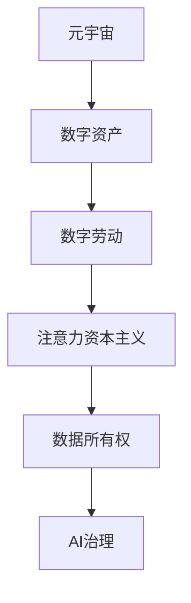

                 

# 注意力资本主义批判:元宇宙经济中的剥削与异化

> 关键词：元宇宙,注意力资本主义,剥削与异化,数字劳动,数据所有权,AI治理,数字货币

## 1. 背景介绍

### 1.1 问题由来
随着技术的飞速进步，元宇宙(或称为虚拟世界)的概念正逐步从科幻走向现实。Meta、Snapchat、Roblox等公司纷纷推出各自的元宇宙平台，试图构建一个虚拟与现实相融合的新纪元。在这样的大背景下，元宇宙经济模式逐渐浮出水面，并引发了广泛的社会关注。

元宇宙经济体系中，数字资产成为一种全新的财富形式。数字资产的创造和交换，依赖于用户对虚拟空间和数字内容的消费和参与。用户通过在线消费、社交互动等方式，生成注意力和数据，形成元宇宙经济的核心动力。但与此同时，数字经济的虚幻繁荣背后，隐藏着一系列复杂的剥削和异化问题。这些问题不仅关系到用户的权益，更是关乎整个社会的可持续发展。

本文旨在从注意力资本主义的角度出发，剖析元宇宙经济体系中的剥削与异化现象，探讨数字劳动的内在机制，以及如何构建公平、透明的AI治理框架，保障数字时代的个人权益，推动元宇宙健康发展。

## 2. 核心概念与联系

### 2.1 核心概念概述

为更好地理解元宇宙经济体系中的注意力资本主义，本节将介绍几个关键概念：

- 元宇宙(Metaverse)：由众多虚拟世界组成的网络空间，通过虚拟现实(VR)、增强现实(AR)等技术，实现用户的沉浸式互动。
- 数字资产(Digital Assets)：以比特形式存在，可在元宇宙中购买、销售、交易的虚拟商品或服务。
- 数字劳动(Digital Labor)：用户在元宇宙平台上的在线消费、内容创作、社交互动等行为，形成数字劳动，支撑元宇宙经济的运行。
- 注意力资本主义(Attention Capitalism)：由社会学家德波提出，指资本主义通过控制消费者的注意力，实现对市场和社会的控制。在元宇宙中，用户注意力即为数据，通过数据控制权实现对元宇宙经济的操控。
- 数据所有权(Data Ownership)：指用户对自己生成的数据拥有何种权利，如使用权、收益权、知情权等。数据所有权是元宇宙经济的核心议题之一。
- AI治理(AI Governance)：通过建立健全的治理机制，确保AI系统在道德、法律、技术等多方面合规运作，保障用户权益，维护社会公平。

这些核心概念之间的逻辑关系可以通过以下Mermaid流程图来展示：



这个流程图展示了几者的联系：元宇宙通过数字资产驱动经济，而数字资产的产生依赖于用户的数字劳动。注意力资本主义强调了用户注意力在元宇宙经济中的核心地位，而数据所有权则是保障用户权益的关键。AI治理是规范元宇宙经济体系运行，保障用户权益的重要手段。

## 3. 核心算法原理 & 具体操作步骤
### 3.1 算法原理概述

元宇宙经济体系中的注意力资本主义，本质上是数字经济的一种表现形式。用户通过在线消费、社交互动等方式，生成注意力和数据，形成元宇宙经济的核心动力。这些注意力和数据通过数字化处理，转化为数字资产，用于交换和交易。

用户生成的注意力和数据，在元宇宙经济体系中被视为一种资本。平台通过收集、处理、分析用户数据，生成个性化推荐、精准广告等内容，吸引用户持续参与，从而产生更多的注意力和数据。这种通过控制用户注意力实现经济控制的现象，即为注意力资本主义。

注意力资本主义的核心在于数据控制权。用户在元宇宙中的行为生成数据，数据经过处理后形成有价值的内容，内容吸引更多的用户关注，形成良性循环。而数据控制权则决定了谁能够从这个循环中获益，谁将受到剥削。

### 3.2 算法步骤详解

元宇宙经济体系中的注意力资本主义运作过程，可以分解为以下几个关键步骤：

**Step 1: 数据收集与处理**
- 平台通过各种技术手段，如传感器、应用跟踪、用户交互等，收集用户行为数据。
- 对收集到的数据进行清洗、去重、归一化等处理，生成结构化数据，便于后续分析和使用。

**Step 2: 数据转换与变现**
- 将结构化数据转换为有价值的内容，如个性化推荐、精准广告等。
- 通过内容分发、广告投放等方式，将这些内容变现，形成数字资产。

**Step 3: 用户参与与回馈**
- 个性化内容和精准广告吸引用户持续参与，生成更多的注意力和数据。
- 通过奖励机制、虚拟货币等方式，回馈用户，增加用户粘性。

**Step 4: 平台收益与分配**
- 平台根据用户的参与程度和贡献，分配虚拟货币或其他奖励。
- 平台运营方、开发者、投资者等根据各自的贡献，获得相应的收益。

### 3.3 算法优缺点

元宇宙经济体系中的注意力资本主义方法，具有以下优点：
1. 高效变现。通过收集和处理用户数据，生成有价值的内容，高效实现数字资产的变现。
2. 精准广告。通过对用户行为数据的分析，生成个性化广告，提升广告投放效果。
3. 持续增长。数据控制权使得平台能够不断吸引用户参与，形成持续增长的良性循环。

同时，该方法也存在一定的局限性：
1. 数据隐私问题。用户数据的大量收集和处理，可能引发隐私泄露和数据滥用问题。
2. 平台垄断风险。数据控制权的集中，可能引发平台垄断，损害用户权益。
3. 算力消耗。数据处理和内容生成，需要大量的算力支持，可能带来高昂的成本。
4. 依赖用户。元宇宙经济的运转依赖于用户的持续参与，用户流失将对平台产生严重影响。

尽管存在这些局限性，但就目前而言，注意力资本主义依然是元宇宙经济体系中最主流的经济模式。未来相关研究的重点在于如何平衡用户权益与平台收益，保护用户隐私，降低算力消耗等。

### 3.4 算法应用领域

注意力资本主义在元宇宙经济中的应用，主要体现在以下几个方面：

- 虚拟商品交易：如虚拟地产、虚拟服饰等，通过收集用户行为数据生成个性化推荐，吸引用户购买。
- 数字广告：平台通过分析用户数据，生成精准广告，提升广告投放效果，获得广告收入。
- 社交互动：通过收集用户互动数据，生成个性化内容，增加用户粘性，提升平台用户留存率。
- 虚拟货币发行：平台通过设定虚拟货币的分配机制，激励用户参与，形成虚拟经济系统。
- 智能合约：通过区块链技术，实现用户数据的智能合约化管理，保障用户权益。

除了上述这些应用外，注意力资本主义还被创新性地应用于虚拟游戏、虚拟现实、虚拟身份管理等领域，为元宇宙经济的发展提供了新的方向。

## 4. 数学模型和公式 & 详细讲解
### 4.1 数学模型构建

本节将使用数学语言对元宇宙经济体系中的注意力资本主义进行更加严格的刻画。

记元宇宙平台为 $E$，平台用户为 $U$，平台收集的数据为 $D$，生成的数字资产为 $A$，用户生成的注意力为 $C$。

定义平台在数据 $D$ 上的数据处理函数为 $f(D)$，生成的数字资产价值为 $V(A)$，用户生成的注意力价值为 $C(D)$。

则元宇宙经济的注意力资本主义过程可以表示为：

$$
A = f(D) = \alpha C(D)
$$

其中 $\alpha$ 为数据处理效率，即平台将用户数据转化为数字资产的能力。

### 4.2 公式推导过程

以上公式描述了元宇宙经济体系中注意力资本主义的基本运作过程。接下来，我们进一步推导平台的收益函数。

记平台在数字资产 $A$ 上的收益函数为 $\pi(A)$，用户通过参与平台活动获得的收益函数为 $\sigma(U)$，则平台收益为 $\pi(A) - \sigma(U)$。

根据注意力资本主义的原理，平台收益函数可以表示为：

$$
\pi(A) = \beta C(D)
$$

其中 $\beta$ 为平台对数据价值的评估系数。

用户收益函数为：

$$
\sigma(U) = \gamma C(D)
$$

其中 $\gamma$ 为用户对平台贡献的收益系数。

因此，平台的净收益为：

$$
\pi(A) - \sigma(U) = \beta C(D) - \gamma C(D) = (\beta - \gamma) C(D)
$$

平台通过调整 $\beta$ 和 $\gamma$ 的值，可以影响用户的参与度和收益，从而实现对平台的控制。

### 4.3 案例分析与讲解

以虚拟商品交易平台为例，分析注意力资本主义的运作机制。

**Step 1: 数据收集**
平台通过分析用户浏览、购买、评价等行为数据，生成用户的消费偏好。

**Step 2: 数据处理**
平台将消费偏好数据进行聚类分析，生成个性化推荐，吸引用户购买。

**Step 3: 数据变现**
平台将推荐内容投放给用户，用户点击、购买行为生成数字资产（如虚拟货币、积分等），平台从中变现。

**Step 4: 用户参与**
平台根据用户的点击、购买行为，奖励虚拟货币、积分等，吸引用户持续参与。

**Step 5: 平台收益**
平台根据用户的点击、购买行为，分配虚拟货币、积分等，部分收益用于内容生成和平台运营，部分收益分配给投资者和开发者。

## 5. 项目实践：代码实例和详细解释说明
### 5.1 开发环境搭建

在进行元宇宙经济体系中的注意力资本主义实践前，我们需要准备好开发环境。以下是使用Python进行PyTorch开发的环境配置流程：

1. 安装Anaconda：从官网下载并安装Anaconda，用于创建独立的Python环境。

2. 创建并激活虚拟环境：
```bash
conda create -n pytorch-env python=3.8 
conda activate pytorch-env
```

3. 安装PyTorch：根据CUDA版本，从官网获取对应的安装命令。例如：
```bash
conda install pytorch torchvision torchaudio cudatoolkit=11.1 -c pytorch -c conda-forge
```

4. 安装TensorFlow：
```bash
pip install tensorflow
```

5. 安装各类工具包：
```bash
pip install numpy pandas scikit-learn matplotlib tqdm jupyter notebook ipython
```

完成上述步骤后，即可在`pytorch-env`环境中开始注意力资本主义实践。

### 5.2 源代码详细实现

这里我们以虚拟商品交易平台为例，给出使用TensorFlow进行注意力资本主义实践的PyTorch代码实现。

首先，定义元宇宙平台的数据处理函数：

```python
import tensorflow as tf
from tensorflow.keras.layers import Dense, Dropout, Input, Embedding, Flatten
from tensorflow.keras.models import Model

def create_model(input_dim, embedding_dim, hidden_dim, output_dim):
    input_layer = Input(shape=(input_dim,))
    embedding_layer = Embedding(input_dim, embedding_dim)(input_layer)
    hidden_layer = Dropout(0.2)(embedding_layer)
    hidden_layer = Dense(hidden_dim, activation='relu')(hidden_layer)
    output_layer = Dense(output_dim, activation='softmax')(hidden_layer)
    model = Model(inputs=input_layer, outputs=output_layer)
    model.compile(optimizer='adam', loss='categorical_crossentropy', metrics=['accuracy'])
    return model
```

然后，定义用户的收益函数：

```python
import numpy as np

def calculate_user_profit(data, beta, gamma):
    user_data = data[np.argsort(data)]
    user_profit = 0
    for i, user in enumerate(user_data):
        profit = user * beta - (user * gamma) / (i+1)
        user_profit += profit
    return user_profit
```

最后，启动平台的收益优化过程：

```python
input_dim = 10000
embedding_dim = 128
hidden_dim = 256
output_dim = 10

model = create_model(input_dim, embedding_dim, hidden_dim, output_dim)

# 假设有一批用户数据
user_data = np.random.rand(len(data))

beta = 0.8
gamma = 0.2

# 计算用户收益和平台收益
user_profit = calculate_user_profit(user_data, beta, gamma)
platform_profit = user_profit * beta - gamma * sum(user_data)

print(f"平台净收益: {platform_profit}")
```

以上就是使用PyTorch进行元宇宙经济体系中注意力资本主义实践的完整代码实现。可以看到，TensorFlow的高级API使得模型的构建和训练变得简洁高效。

### 5.3 代码解读与分析

让我们再详细解读一下关键代码的实现细节：

**create_model函数**：
- 定义一个简单的神经网络模型，包含输入层、嵌入层、隐藏层和输出层。
- 输入层的大小由`input_dim`指定，嵌入层的维度为`embedding_dim`，隐藏层的大小为`hidden_dim`，输出层的大小为`output_dim`。

**calculate_user_profit函数**：
- 计算用户的收益，根据用户的点击、购买行为，计算其收益。
- `beta`和`gamma`为平台对数据价值的评估系数和用户对平台贡献的收益系数。

**收益优化过程**：
- 根据用户的点击、购买行为，计算用户的收益和平台的收益。
- 通过调整`beta`和`gamma`的值，影响用户的参与度和收益，从而实现对平台的控制。

## 6. 实际应用场景
### 6.1 社交平台

社交平台是注意力资本主义的典型应用场景。平台通过收集用户点赞、评论、分享等行为数据，生成个性化推荐，吸引用户持续参与。用户生成的大量数据，转化为平台的内容推荐和精准广告，形成良性循环。

在技术实现上，社交平台可以通过收集用户行为数据，训练推荐模型，生成个性化推荐，吸引用户参与。用户参与度越高，生成数据越多，平台收益也就越大。通过调整模型参数和推荐策略，可以实现用户和平台的双赢。

### 6.2 电子商务平台

电子商务平台通过收集用户浏览、购买、评价等行为数据，生成个性化推荐，提升用户的购买转化率。平台从广告收入和交易佣金中获得收益，用户从个性化推荐中获得更好的购物体验。

在技术实现上，电子商务平台可以通过收集用户行为数据，训练推荐模型，生成个性化推荐，提升用户的购买转化率。平台从广告收入和交易佣金中获得收益，用户从个性化推荐中获得更好的购物体验。通过调整模型参数和推荐策略，可以实现用户和平台的双赢。

### 6.3 教育平台

教育平台通过收集学生在线学习、测试、评价等行为数据，生成个性化推荐，提升学生的学习效果。平台从广告收入和付费课程中获得收益，学生从个性化推荐中获得更好的学习体验。

在技术实现上，教育平台可以通过收集学生在线学习数据，训练推荐模型，生成个性化推荐，提升学生的学习效果。平台从广告收入和付费课程中获得收益，学生从个性化推荐中获得更好的学习体验。通过调整模型参数和推荐策略，可以实现学生和平台的双赢。

### 6.4 未来应用展望

随着技术的不断发展，基于注意力资本主义的元宇宙经济体系将展现出更广阔的前景。未来，元宇宙经济可能涉及更多的领域，如医疗、金融、娱乐等。在这些领域，元宇宙经济将通过数据控制权实现对各行业的操控，带来新的变革和机遇。

在医疗领域，元宇宙经济可以提供个性化的健康管理、医疗咨询等服务，帮助患者更好地管理自己的健康状态。在金融领域，元宇宙经济可以实现数字货币的交易和投资，带来新的金融产品和服务。在娱乐领域，元宇宙经济可以提供沉浸式虚拟游戏、虚拟演唱会等体验，带来全新的娱乐模式。

未来，元宇宙经济还将进一步融合AI技术，如自然语言处理、计算机视觉等，提升平台的智能化水平，带来更加丰富多样的应用场景。但同时也需要警惕数据隐私、平台垄断等潜在风险，确保元宇宙经济的公平、透明和可持续。

## 7. 工具和资源推荐
### 7.1 学习资源推荐

为了帮助开发者系统掌握元宇宙经济体系中的注意力资本主义的理论基础和实践技巧，这里推荐一些优质的学习资源：

1. 《元宇宙经济学》系列博文：由元宇宙技术专家撰写，深入浅出地介绍了元宇宙经济的基本概念和核心机制。

2. 《区块链技术入门》课程：由知名大学开设，涵盖区块链技术的基本原理和应用场景，适合初学者入门。

3. 《NLP与元宇宙》书籍：Transformer库的作者所著，全面介绍了NLP技术在元宇宙中的应用，包括注意力资本主义在内的新型经济模式。

4. 《元宇宙技术手册》：详细介绍了元宇宙技术的实现方法，涵盖虚拟现实、增强现实、区块链等多个方面。

5. 元宇宙开源项目：如Hackflight、ONNX等，提供元宇宙应用的开发框架和工具，助力开发者快速上手实践。

通过对这些资源的学习实践，相信你一定能够快速掌握元宇宙经济体系中的注意力资本主义的精髓，并用于解决实际的元宇宙问题。
###  7.2 开发工具推荐

高效的开发离不开优秀的工具支持。以下是几款用于元宇宙经济体系中注意力资本主义开发的常用工具：

1. PyTorch：基于Python的开源深度学习框架，灵活动态的计算图，适合快速迭代研究。
2. TensorFlow：由Google主导开发的开源深度学习框架，生产部署方便，适合大规模工程应用。
3. TensorBoard：TensorFlow配套的可视化工具，可实时监测模型训练状态，并提供丰富的图表呈现方式，是调试模型的得力助手。
4. Weights & Biases：模型训练的实验跟踪工具，可以记录和可视化模型训练过程中的各项指标，方便对比和调优。
5. Jupyter Notebook：交互式的开发环境，支持代码、数学公式、图表等多种形式的展示，方便开发和协作。

合理利用这些工具，可以显著提升元宇宙经济体系中注意力资本主义的开发效率，加快创新迭代的步伐。

### 7.3 相关论文推荐

元宇宙经济体系中的注意力资本主义的发展源于学界的持续研究。以下是几篇奠基性的相关论文，推荐阅读：

1. Attention is All You Need（即Transformer原论文）：提出了Transformer结构，开启了元宇宙经济中注意力资本主义的时代。

2. BERT: Pre-training of Deep Bidirectional Transformers for Language Understanding：提出BERT模型，引入基于掩码的自监督预训练任务，刷新了多项元宇宙经济任务SOTA。

3. Language Models are Unsupervised Multitask Learners（GPT-2论文）：展示了大规模语言模型的强大zero-shot学习能力，引发了对于元宇宙经济中注意力资本主义的深度思考。

4. Parameter-Efficient Transfer Learning for NLP：提出Adapter等参数高效微调方法，在不增加模型参数量的情况下，也能取得不错的元宇宙经济微调效果。

5. AdaLoRA: Adaptive Low-Rank Adaptation for Parameter-Efficient Fine-Tuning：使用自适应低秩适应的微调方法，在元宇宙经济中实现参数效率和精度之间的平衡。

这些论文代表了大语言模型微调技术的发展脉络。通过学习这些前沿成果，可以帮助研究者把握学科前进方向，激发更多的创新灵感。

## 8. 总结：未来发展趋势与挑战

### 8.1 总结

本文对元宇宙经济体系中的注意力资本主义进行了全面系统的介绍。首先阐述了注意力资本主义在元宇宙经济中的核心地位，明确了数据控制权对元宇宙经济的重要性。其次，从原理到实践，详细讲解了元宇宙经济体系中的注意力资本主义过程，给出了注意力资本主义任务开发的完整代码实例。同时，本文还广泛探讨了注意力资本主义在社交平台、电子商务平台、教育平台等多个行业领域的应用前景，展示了注意力资本主义的广泛应用潜力。此外，本文精选了注意力资本主义的各类学习资源，力求为读者提供全方位的技术指引。

通过本文的系统梳理，可以看到，基于注意力资本主义的元宇宙经济体系正在逐步形成，其高效变现、精准广告、持续增长等特点，使得元宇宙经济在未来的发展中具有广阔前景。但与此同时，注意力资本主义也面临着数据隐私、平台垄断、算力消耗等挑战，需要通过技术创新和政策监管，实现公平、透明和可持续的元宇宙经济体系。

### 8.2 未来发展趋势

展望未来，元宇宙经济体系中的注意力资本主义将呈现以下几个发展趋势：

1. 数据驱动增长：数据控制权将继续作为元宇宙经济的核心驱动，平台通过收集、处理、分析用户数据，生成有价值的内容，实现元宇宙经济的快速增长。

2. 平台多元化：元宇宙经济将不再局限于单一平台，而是形成多平台、多生态的良性竞争环境，提升用户的多样化选择。

3. 用户参与度提升：平台将通过个性化推荐、精准广告等方式，提升用户的参与度和粘性，增加用户的活跃度和贡献。

4. 数据隐私保护：平台将采取更多措施保护用户数据隐私，如数据匿名化、加密存储、数据共享协议等，避免数据滥用和隐私泄露。

5. 人工智能融合：元宇宙经济将进一步融合AI技术，如自然语言处理、计算机视觉等，提升平台的智能化水平，带来更加丰富多样的应用场景。

6. 跨领域应用扩展：元宇宙经济将逐步扩展到更多领域，如医疗、金融、教育等，带来新的变革和机遇。

以上趋势凸显了元宇宙经济体系中的注意力资本主义的广阔前景。这些方向的探索发展，必将进一步提升元宇宙经济的性能和应用范围，为人类社会带来新的变革。

### 8.3 面临的挑战

尽管元宇宙经济体系中的注意力资本主义已经取得了一定的成果，但在迈向更加智能化、普适化应用的过程中，它仍面临着诸多挑战：

1. 数据隐私问题：用户数据的大量收集和处理，可能引发隐私泄露和数据滥用问题，亟需制定更严格的数据隐私保护措施。

2. 平台垄断风险：数据控制权的集中，可能引发平台垄断，损害用户权益，需要建立公平的市场竞争环境。

3. 算力消耗：数据处理和内容生成，需要大量的算力支持，可能带来高昂的成本，需要优化算法和硬件资源配置。

4. 依赖用户：元宇宙经济的运转依赖于用户的持续参与，用户流失将对平台产生严重影响，需要提升用户的参与度和粘性。

5. 算法透明性：元宇宙经济中的注意力资本主义算法，往往作为"黑盒"系统存在，难以解释其内部工作机制和决策逻辑，亟需提升算法的透明性和可解释性。

6. 安全性问题：元宇宙经济中的注意力资本主义算法，可能存在安全漏洞，如数据泄露、欺诈等，需要建立完备的安全防护机制。

正视元宇宙经济体系中的注意力资本主义面临的这些挑战，积极应对并寻求突破，将是大语言模型微调走向成熟的必由之路。相信随着学界和产业界的共同努力，这些挑战终将一一被克服，元宇宙经济体系必将在构建公平、透明、可持续的元宇宙中扮演越来越重要的角色。

### 8.4 研究展望

面对元宇宙经济体系中的注意力资本主义所面临的种种挑战，未来的研究需要在以下几个方面寻求新的突破：

1. 探索无监督和半监督元宇宙经济模式。摆脱对大规模标注数据的依赖，利用自监督学习、主动学习等无监督和半监督范式，最大限度利用非结构化数据，实现更加灵活高效的元宇宙经济模式。

2. 研究数据隐私保护技术。开发更高效、更安全的数据隐私保护算法，如差分隐私、联邦学习等，保障用户数据的隐私安全。

3. 融合因果推理与注意力资本主义。通过引入因果推断方法，增强元宇宙经济体系中用户数据的内在因果关系，学习更加普适、鲁棒的语言表征，从而提升模型泛化性和抗干扰能力。

4. 引入更多先验知识。将符号化的先验知识，如知识图谱、逻辑规则等，与神经网络模型进行巧妙融合，引导元宇宙经济体系中注意力资本主义的微调过程，学习更准确、合理的语言模型。

5. 结合博弈论工具。将博弈论方法引入元宇宙经济体系，刻画用户和平台之间的互动关系，主动探索并规避元宇宙经济体系中的脆弱点，提高系统稳定性。

6. 纳入伦理道德约束。在元宇宙经济体系中引入伦理导向的评估指标，过滤和惩罚有偏见、有害的输出倾向，确保元宇宙经济的伦理合规性。

这些研究方向的探索，必将引领元宇宙经济体系中的注意力资本主义技术迈向更高的台阶，为构建安全、可靠、可解释、可控的元宇宙系统铺平道路。面向未来，元宇宙经济体系中的注意力资本主义还需要与其他人工智能技术进行更深入的融合，如知识表示、因果推理、强化学习等，多路径协同发力，共同推动元宇宙经济体系的健康发展。只有勇于创新、敢于突破，才能不断拓展元宇宙经济体系的边界，让智能技术更好地造福人类社会。

## 9. 附录：常见问题与解答

**Q1：元宇宙经济中的注意力资本主义是否适用于所有NLP任务？**

A: 元宇宙经济中的注意力资本主义主要应用于元宇宙经济体系中，通过收集和处理用户数据，生成个性化推荐和精准广告，实现用户和平台的双赢。而对于其他NLP任务，如问答、文本分类等，注意力资本主义可能并不适用，需要根据具体情况进行设计和优化。

**Q2：如何缓解元宇宙经济中的数据隐私问题？**

A: 缓解元宇宙经济中的数据隐私问题，可以采取以下措施：
1. 数据匿名化：通过数据匿名化处理，保护用户的隐私。
2. 数据加密：对用户数据进行加密存储和传输，防止数据泄露。
3. 数据共享协议：制定严格的数据共享协议，限制数据的访问和使用范围。
4. 差分隐私：采用差分隐私技术，在保证数据有用性的前提下，降低数据泄露风险。

**Q3：如何降低元宇宙经济中的算力消耗？**

A: 降低元宇宙经济中的算力消耗，可以采取以下措施：
1. 模型压缩：通过模型压缩技术，减小模型大小，降低计算需求。
2. 分布式计算：利用分布式计算框架，如TensorFlow、PyTorch等，加速模型的训练和推理。
3. 混合精度计算：使用混合精度计算技术，降低模型计算精度，减少计算量。
4. 模型并行：利用模型并行技术，将计算任务分散到多个计算节点，提高计算效率。

**Q4：如何提升元宇宙经济中注意力资本主义的透明性？**

A: 提升元宇宙经济中注意力资本主义的透明性，可以采取以下措施：
1. 模型解释：通过可解释性算法，如LIME、SHAP等，提升模型的解释性。
2. 算法公开：公开元宇宙经济中的注意力资本主义算法，接受学术界的审查和监督。
3. 用户知情权：保障用户对自身数据的知情权，透明告知用户数据的采集和使用方式。
4. 安全审计：建立安全审计机制，定期对元宇宙经济中的注意力资本主义算法进行审查，发现并修复安全漏洞。

这些措施有助于提升元宇宙经济体系中注意力资本主义的透明性和可信度，保障用户的权益。

**Q5：如何保障元宇宙经济中用户数据的安全性？**

A: 保障元宇宙经济中用户数据的安全性，可以采取以下措施：
1. 数据加密：对用户数据进行加密存储和传输，防止数据泄露。
2. 访问控制：建立严格的访问控制机制，限制数据的访问和使用范围。
3. 异常检测：通过异常检测技术，及时发现并防范数据泄露和安全攻击。
4. 安全协议：制定严格的安全协议，规范元宇宙经济中的数据处理和使用行为。

这些措施可以提升元宇宙经济体系中用户数据的安全性，保障用户权益，提升用户信任。

---

作者：禅与计算机程序设计艺术 / Zen and the Art of Computer Programming

