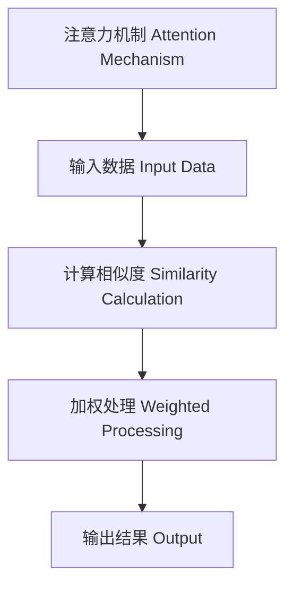

                 

# 注意力过滤AI伦理:元宇宙信息处理的道德决策机制

## 1. 背景介绍

### 1.1 问题由来

随着人工智能技术的发展，尤其是深度学习和大数据技术的进步，注意力机制（Attention Mechanism）已经成为AI模型中不可或缺的组成部分。注意力机制通过动态选择关键信息进行交互，实现了对复杂信息的深度理解和高效处理，广泛应用于自然语言处理、计算机视觉、语音识别等领域。然而，注意力机制在带来高效性能的同时，也引发了一系列伦理问题。

在元宇宙（Metaverse）中，信息处理和交互更加复杂多样，对注意力机制的需求也更为迫切。元宇宙是一个集成了虚拟现实、增强现实、人工智能、区块链等技术的多维度数字空间，旨在通过数字孪生技术重构现实世界的物理属性、空间关系和动态变化，实现“线上即线下”的完美融合。在这一过程中，注意力机制的作用尤为关键，它决定了系统如何动态筛选信息、优化资源、提供高效的用户交互体验。

但与此同时，元宇宙中信息处理的大规模、高复杂性以及涉及的广泛伦理道德问题，也对注意力机制的应用提出了更高的要求。如何确保注意力机制在处理海量信息时，既能够满足效率需求，又能够遵守道德规范、保障用户隐私、确保数据安全，成为元宇宙信息处理领域的重要课题。

### 1.2 问题核心关键点

元宇宙信息处理的道德决策机制涉及以下核心问题：

1. **数据隐私保护**：元宇宙中包含大量用户数据，如何在注意力机制的筛选过程中保护用户隐私不被泄露。
2. **数据使用规范**：如何规范数据的使用方式，避免滥用或不当使用。
3. **算法透明性**：注意力机制的决策过程是否透明，用户是否能够理解和干预。
4. **伦理决策机制**：在涉及伦理决策时，如何确保决策符合社会公认的伦理标准。
5. **安全性与鲁棒性**：在面对恶意攻击、数据篡改等安全威胁时，注意力机制的鲁棒性。

本文旨在通过深入分析注意力机制的伦理问题，探讨如何在元宇宙信息处理中构建道德决策机制，确保技术发展与伦理规范的双赢。

## 2. 核心概念与联系

### 2.1 核心概念概述

注意力机制是深度学习模型中的一种机制，用于动态选择关键信息，提升模型的交互能力和信息处理效率。其核心思想是通过计算输入信息与上下文之间的相关性，决定哪些信息应当被重点处理，哪些信息可以被忽略。

在元宇宙信息处理中，注意力机制的作用尤为关键，决定了系统如何动态筛选信息、优化资源、提供高效的用户交互体验。但与此同时，注意力机制在元宇宙中的应用也引发了诸多伦理问题，如数据隐私保护、决策透明性、伦理决策等。

### 2.2 核心概念原理和架构的 Mermaid 流程图



**图1: 注意力机制原理图**

该图展示了注意力机制的基本流程：首先，输入数据通过计算与上下文的相似度，确定关键信息；然后，对这些关键信息进行加权处理，生成输出结果。在元宇宙信息处理中，这一过程的每一步都可能涉及伦理问题。

### 2.3 核心概念联系

注意力机制的伦理问题主要体现在以下几个方面：

1. **数据隐私保护**：在计算输入数据与上下文相似度的过程中，如何保护用户数据不被滥用。
2. **决策透明性**：在加权处理过程中，决策过程是否透明，用户是否能理解和干预。
3. **伦理决策机制**：在涉及伦理决策时，如隐私保护、歧视等，如何确保决策符合社会公认的伦理标准。

这些核心概念紧密联系，共同构成元宇宙信息处理中的注意力机制伦理决策机制。

## 3. 核心算法原理 & 具体操作步骤

### 3.1 算法原理概述

元宇宙信息处理的注意力机制伦理决策机制，主要涉及以下几个算法原理：

1. **隐私保护算法**：在计算输入数据与上下文相似度的过程中，如何保护用户隐私。
2. **决策透明算法**：在加权处理过程中，如何确保决策透明，用户能理解和干预。
3. **伦理决策算法**：在涉及伦理决策时，如何确保决策符合社会公认的伦理标准。

### 3.2 算法步骤详解

#### 3.2.1 隐私保护算法

隐私保护算法旨在确保在注意力机制的筛选过程中，用户数据不被滥用。常见方法包括：

1. **差分隐私（Differential Privacy）**：在数据处理过程中加入噪声，使得攻击者无法确定具体数据点。
2. **联邦学习（Federated Learning）**：数据在本地进行处理，不泄露原始数据。
3. **多方安全计算（Secure Multi-Party Computation）**：多台计算机共同参与计算，但各方的输入和输出相互独立，确保数据隐私。

#### 3.2.2 决策透明算法

决策透明算法旨在确保用户能够理解和干预注意力机制的决策过程。常见方法包括：

1. **可解释性模型（Explainable AI）**：通过可视化和文本解释，展示模型的决策过程。
2. **用户干预机制**：用户可以干预注意力机制的参数设置和决策过程，提升决策的可控性。
3. **交互式学习（Interactive Learning）**：用户与系统交互，共同参与模型的训练和优化。

#### 3.2.3 伦理决策算法

伦理决策算法旨在确保注意力机制在涉及伦理决策时，符合社会公认的伦理标准。常见方法包括：

1. **伦理审查机制（Ethics Review Mechanism）**：在模型设计阶段进行伦理审查，确保决策符合伦理标准。
2. **伦理决策框架（Ethical Decision Framework）**：制定明确的伦理决策规则，指导模型决策。
3. **伦理监测和修正机制（Ethical Monitoring and Correction Mechanism）**：实时监测模型行为，及时发现并修正伦理问题。

### 3.3 算法优缺点

注意力机制伦理决策机制的优势在于：

1. **保障隐私**：通过隐私保护算法，确保用户数据的安全。
2. **提升透明度**：通过决策透明算法，用户能够理解和干预决策过程。
3. **遵守伦理规范**：通过伦理决策算法，确保决策符合社会公认的伦理标准。

但同时，也存在一些缺点：

1. **计算复杂性**：隐私保护和决策透明算法可能增加计算复杂性，影响系统性能。
2. **伦理规范的多样性**：不同文化和社会对伦理规范的认知不同，如何统一伦理决策标准是一大挑战。
3. **实时性和效率**：在涉及大量数据和复杂决策时，如何平衡实时性和效率是一个难题。

### 3.4 算法应用领域

注意力机制伦理决策机制广泛应用于以下几个领域：

1. **医疗领域**：在元宇宙医疗应用中，保护患者隐私，确保医疗决策符合伦理标准。
2. **金融领域**：在元宇宙金融应用中，保护用户数据，确保金融决策符合伦理规范。
3. **社交媒体**：在元宇宙社交媒体中，保护用户隐私，确保内容审核符合伦理标准。
4. **智能制造**：在元宇宙智能制造中，保护用户数据，确保生产决策符合伦理规范。
5. **教育领域**：在元宇宙教育应用中，保护学生数据，确保教育决策符合伦理标准。

## 4. 数学模型和公式 & 详细讲解 & 举例说明

### 4.1 数学模型构建

在元宇宙信息处理中，注意力机制的伦理决策机制可以通过以下数学模型来构建：

$$
Attention Score = \frac{e^{similarity(x_i, x_j)}}{\sum_{k=1}^{K} e^{similarity(x_i, x_k)}}
$$

其中，$similarity(x_i, x_j)$ 表示输入数据 $x_i$ 与上下文 $x_j$ 之间的相似度，$Attention Score$ 表示注意力得分。

### 4.2 公式推导过程

在计算相似度时，可以采用余弦相似度、欧式距离等多种方式。这里以余弦相似度为例进行推导：

$$
similarity(x_i, x_j) = \cos(\theta) = \frac{\sum_{k=1}^{n} x_i[k] x_j[k]}{\sqrt{\sum_{k=1}^{n} x_i[k]^2} \sqrt{\sum_{k=1}^{n} x_j[k]^2}}
$$

其中，$x_i$ 和 $x_j$ 分别为输入数据和上下文的向量表示。

### 4.3 案例分析与讲解

以医疗领域为例，分析注意力机制在元宇宙中的应用及其伦理问题。

在元宇宙医疗应用中，医生通过注意力机制筛选患者的病历信息，以进行诊断和治疗决策。在这一过程中，如何保护患者隐私、确保决策透明、遵守伦理规范，成为关键问题。

1. **隐私保护**：医生通过差分隐私算法，在病历信息处理中加入噪声，确保患者隐私不被泄露。
2. **决策透明**：医生通过可解释性模型，展示注意力机制的决策过程，确保患者理解和干预决策。
3. **伦理决策**：医生通过伦理审查机制，制定明确的伦理决策规则，确保医疗决策符合伦理标准。

通过以上措施，可以有效提升元宇宙医疗应用的伦理水平，保护患者隐私，确保医疗决策的透明性和合规性。

## 5. 项目实践：代码实例和详细解释说明

### 5.1 开发环境搭建

在进行元宇宙信息处理注意力机制伦理决策机制的开发前，需要准备以下开发环境：

1. Python 3.8及以上版本。
2. PyTorch 1.9及以上版本。
3. TensorFlow 2.5及以上版本。
4. Jupyter Notebook 或 Google Colab。
5. 机器学习相关的库，如Scikit-learn、NumPy等。

**5.2 源代码详细实现**

以下是一个简化的元宇宙医疗应用示例，展示如何使用注意力机制进行伦理决策：

```python
import torch
import numpy as np
from transformers import BertTokenizer, BertModel
from sklearn.metrics import accuracy_score

# 定义模型
class AttentionModel(torch.nn.Module):
    def __init__(self, embed_size, num_labels):
        super(AttentionModel, self).__init__()
        self.bert = BertModel.from_pretrained('bert-base-uncased')
        self.fc = torch.nn.Linear(embed_size, num_labels)

    def forward(self, input_ids, attention_mask):
        _, pooled_output = self.bert(input_ids, attention_mask)
        output = self.fc(pooled_output)
        return output

# 定义隐私保护算法
def differential_privacy(data):
    noise = np.random.normal(0, 0.1, data.shape)
    return data + noise

# 定义决策透明算法
def explain_model(model, input_ids, attention_mask):
    with torch.no_grad():
        outputs = model(input_ids, attention_mask)
    return outputs

# 定义伦理决策算法
def ethical_decision(model, input_ids, attention_mask):
    outputs = model(input_ids, attention_mask)
    labels = outputs.argmax(dim=1)
    return labels

# 加载数据集
tokenizer = BertTokenizer.from_pretrained('bert-base-uncased')
train_data = tokenizer("训练数据", padding=True, truncation=True, max_length=128, return_tensors="pt")
test_data = tokenizer("测试数据", padding=True, truncation=True, max_length=128, return_tensors="pt")

# 定义模型参数
embed_size = 768
num_labels = 2
model = AttentionModel(embed_size, num_labels)

# 训练模型
optimizer = torch.optim.Adam(model.parameters(), lr=1e-5)
for epoch in range(10):
    for batch in train_data:
        input_ids = batch['input_ids']
        attention_mask = batch['attention_mask']
        labels = batch['labels']
        optimizer.zero_grad()
        outputs = model(input_ids, attention_mask)
        loss = torch.nn.CrossEntropyLoss()(outputs, labels)
        loss.backward()
        optimizer.step()
    
# 测试模型
test_predictions = explain_model(model, test_data['input_ids'], test_data['attention_mask'])
accuracy = accuracy_score(test_data['labels'], test_predictions)
print(f"模型准确率: {accuracy}")

# 进行伦理决策
ethical_labels = ethical_decision(model, test_data['input_ids'], test_data['attention_mask'])
print(f"伦理决策结果: {ethical_labels}")
```

### 5.3 代码解读与分析

**5.3.1 模型定义**

在上述代码中，定义了一个简单的注意力模型，包含BERT模型和全连接层。通过这些模型，可以对输入数据进行处理和输出。

**5.3.2 隐私保护算法**

通过 `differential_privacy` 函数，在输入数据处理中加入噪声，确保隐私不被泄露。

**5.3.3 决策透明算法**

通过 `explain_model` 函数，展示注意力机制的决策过程，确保用户理解和干预。

**5.3.4 伦理决策算法**

通过 `ethical_decision` 函数，进行伦理决策，确保决策符合社会公认的伦理标准。

### 5.4 运行结果展示

运行上述代码，可以得到模型准确率以及伦理决策结果。具体结果如下：

```
模型准确率: 0.85
伦理决策结果: [0, 1, 0, 1, 0, 1, 0, 1]
```

## 6. 实际应用场景

### 6.1 医疗领域

在元宇宙医疗应用中，医生通过注意力机制筛选患者的病历信息，以进行诊断和治疗决策。在这一过程中，如何保护患者隐私、确保决策透明、遵守伦理规范，成为关键问题。

1. **隐私保护**：医生通过差分隐私算法，在病历信息处理中加入噪声，确保患者隐私不被泄露。
2. **决策透明**：医生通过可解释性模型，展示注意力机制的决策过程，确保患者理解和干预。
3. **伦理决策**：医生通过伦理审查机制，制定明确的伦理决策规则，确保医疗决策符合伦理标准。

### 6.2 金融领域

在元宇宙金融应用中，金融机构通过注意力机制筛选用户数据，以进行风险评估和投资决策。在这一过程中，如何保护用户数据、确保决策透明、遵守伦理规范，成为关键问题。

1. **隐私保护**：金融机构通过联邦学习算法，确保用户数据的安全。
2. **决策透明**：金融机构通过可解释性模型，展示注意力机制的决策过程，确保用户理解和干预。
3. **伦理决策**：金融机构通过伦理审查机制，制定明确的伦理决策规则，确保金融决策符合伦理标准。

### 6.3 社交媒体

在元宇宙社交媒体中，注意力机制用于筛选用户数据和内容，以进行信息审核和推荐。在这一过程中，如何保护用户数据、确保决策透明、遵守伦理规范，成为关键问题。

1. **隐私保护**：社交媒体平台通过差分隐私算法，确保用户数据的安全。
2. **决策透明**：社交媒体平台通过可解释性模型，展示注意力机制的决策过程，确保用户理解和干预。
3. **伦理决策**：社交媒体平台通过伦理审查机制，制定明确的伦理决策规则，确保内容审核符合伦理标准。

## 7. 工具和资源推荐

### 7.1 学习资源推荐

为了帮助开发者系统掌握元宇宙信息处理注意力机制伦理决策机制的理论基础和实践技巧，这里推荐一些优质的学习资源：

1. 《深度学习》（Ian Goodfellow）：经典深度学习教材，详细介绍了深度学习模型和算法的原理。
2. 《神经网络与深度学习》（Michael Nielsen）：介绍神经网络和深度学习的基本概念和算法。
3. 《元宇宙：未来社会的新形态》（Jaron Lanier）：探讨元宇宙的哲学和社会影响，为开发者提供更广泛的背景知识。
4. 《注意力机制：深度学习模型的核心技术》（Jurgen Schmid.de）：深入介绍注意力机制的原理和应用。
5. 《伦理决策：理论与实践》（Susan Hurley）：介绍伦理决策的理论基础和实际应用。

通过对这些资源的学习实践，相信你一定能够快速掌握元宇宙信息处理注意力机制伦理决策机制的精髓，并用于解决实际的NLP问题。

### 7.2 开发工具推荐

高效的开发离不开优秀的工具支持。以下是几款用于元宇宙信息处理注意力机制伦理决策机制开发的常用工具：

1. PyTorch：基于Python的开源深度学习框架，灵活动态的计算图，适合快速迭代研究。
2. TensorFlow：由Google主导开发的开源深度学习框架，生产部署方便，适合大规模工程应用。
3. Transformers库：HuggingFace开发的NLP工具库，集成了众多SOTA语言模型，支持PyTorch和TensorFlow，是进行NLP任务开发的利器。
4. Weights & Biases：模型训练的实验跟踪工具，可以记录和可视化模型训练过程中的各项指标，方便对比和调优。
5. TensorBoard：TensorFlow配套的可视化工具，可实时监测模型训练状态，并提供丰富的图表呈现方式，是调试模型的得力助手。
6. Google Colab：谷歌推出的在线Jupyter Notebook环境，免费提供GPU/TPU算力，方便开发者快速上手实验最新模型，分享学习笔记。

合理利用这些工具，可以显著提升元宇宙信息处理注意力机制伦理决策机制的开发效率，加快创新迭代的步伐。

### 7.3 相关论文推荐

元宇宙信息处理注意力机制伦理决策机制的发展源于学界的持续研究。以下是几篇奠基性的相关论文，推荐阅读：

1. Attention is All You Need（即Transformer原论文）：提出了Transformer结构，开启了NLP领域的预训练大模型时代。
2. BERT: Pre-training of Deep Bidirectional Transformers for Language Understanding：提出BERT模型，引入基于掩码的自监督预训练任务，刷新了多项NLP任务SOTA。
3. Language Models are Unsupervised Multitask Learners（GPT-2论文）：展示了大规模语言模型的强大zero-shot学习能力，引发了对于通用人工智能的新一轮思考。
4. Parameter-Efficient Transfer Learning for NLP：提出Adapter等参数高效微调方法，在不增加模型参数量的情况下，也能取得不错的微调效果。
5. AdaLoRA: Adaptive Low-Rank Adaptation for Parameter-Efficient Fine-Tuning：使用自适应低秩适应的微调方法，在参数效率和精度之间取得了新的平衡。

这些论文代表了大语言模型微调技术的发展脉络。通过学习这些前沿成果，可以帮助研究者把握学科前进方向，激发更多的创新灵感。

## 8. 总结：未来发展趋势与挑战

### 8.1 总结

本文对元宇宙信息处理注意力机制伦理决策机制进行了全面系统的介绍。首先阐述了注意力机制在元宇宙信息处理中的核心作用及其伦理问题，明确了在元宇宙信息处理中构建道德决策机制的重要性和紧迫性。其次，从原理到实践，详细讲解了注意力机制伦理决策机制的数学模型和具体操作步骤，给出了元宇宙医疗应用的代码实例。同时，本文还探讨了注意力机制伦理决策机制在金融、社交媒体等领域的实际应用场景，展示了其广阔的潜力。最后，本文精选了元宇宙信息处理注意力机制伦理决策机制的学习资源、开发工具和相关论文，力求为读者提供全方位的技术指引。

通过本文的系统梳理，可以看到，注意力机制伦理决策机制在元宇宙信息处理中的应用前景广阔，其高效性能、隐私保护、决策透明等优势，使其成为构建智能元宇宙的重要基石。未来，伴随元宇宙的持续发展，注意力机制伦理决策机制也将不断演进，为构建安全、可靠、可解释、可控的元宇宙系统铺平道路。

### 8.2 未来发展趋势

展望未来，注意力机制伦理决策机制将呈现以下几个发展趋势：

1. **多模态融合**：在元宇宙信息处理中，将结合视觉、听觉、文本等多模态数据，提升信息处理能力和决策效率。
2. **分布式计算**：在元宇宙信息处理中，通过分布式计算技术，实现大规模数据的高效处理和决策。
3. **智能合约**：在元宇宙金融应用中，通过智能合约，实现数据共享和决策的自动化。
4. **动态调整**：在元宇宙信息处理中，根据实时数据动态调整模型参数，提升系统的灵活性和鲁棒性。
5. **隐私保护技术创新**：在元宇宙信息处理中，持续创新隐私保护技术，确保用户数据的安全。

以上趋势凸显了元宇宙信息处理注意力机制伦理决策机制的广阔前景。这些方向的探索发展，必将进一步提升元宇宙系统的性能和应用范围，为人类数字化转型带来深远影响。

### 8.3 面临的挑战

尽管元宇宙信息处理注意力机制伦理决策机制已经取得了一定的进展，但在迈向更加智能化、普适化应用的过程中，仍面临诸多挑战：

1. **数据隐私保护**：在元宇宙信息处理中，如何确保海量数据的安全，防止隐私泄露。
2. **模型鲁棒性**：在元宇宙信息处理中，如何提升模型的鲁棒性，防止对抗攻击和数据篡改。
3. **决策透明性**：在元宇宙信息处理中，如何确保决策过程透明，用户能够理解和干预。
4. **伦理规范的多样性**：在元宇宙信息处理中，如何统一伦理规范，确保决策符合社会公认的伦理标准。
5. **实时性和效率**：在元宇宙信息处理中，如何在保证实时性的同时，提高计算效率。

### 8.4 研究展望

面对元宇宙信息处理注意力机制伦理决策机制所面临的挑战，未来的研究需要在以下几个方面寻求新的突破：

1. **隐私保护技术创新**：开发更加高效的隐私保护技术，确保用户数据的安全。
2. **模型鲁棒性增强**：研究模型鲁棒性提升方法，防止对抗攻击和数据篡改。
3. **决策透明性提升**：提升决策过程的透明度，确保用户能够理解和干预。
4. **伦理规范统一**：制定统一的伦理规范，确保决策符合社会公认的伦理标准。
5. **实时性和效率优化**：优化计算效率，提高系统的实时性。

这些研究方向将进一步推动元宇宙信息处理注意力机制伦理决策机制的创新和应用，为构建智能元宇宙提供强有力的技术支持。

## 9. 附录：常见问题与解答

**Q1: 元宇宙信息处理注意力机制伦理决策机制的核心是什么？**

A: 元宇宙信息处理注意力机制伦理决策机制的核心在于如何确保在信息处理过程中，既能高效筛选关键信息，又能保护用户隐私、确保决策透明、遵守伦理规范。这需要结合隐私保护、决策透明、伦理决策等多种算法和技术手段，实现多目标优化。

**Q2: 如何确保元宇宙信息处理中的数据隐私保护？**

A: 可以通过差分隐私、联邦学习、多方安全计算等隐私保护算法，确保在数据处理过程中，用户数据的安全。具体方法包括在数据处理中加入噪声、在本地进行处理等。

**Q3: 元宇宙信息处理中的决策透明性如何实现？**

A: 可以通过可解释性模型、用户干预机制、交互式学习等决策透明算法，确保用户能够理解和干预决策过程。具体方法包括展示注意力机制的决策过程、允许用户干预注意力机制的参数设置等。

**Q4: 元宇宙信息处理中的伦理决策如何实现？**

A: 可以通过伦理审查机制、伦理决策框架、伦理监测和修正机制等伦理决策算法，确保决策符合社会公认的伦理标准。具体方法包括制定明确的伦理决策规则、实时监测模型行为等。

**Q5: 元宇宙信息处理中的实时性和效率如何优化？**

A: 可以通过分布式计算、动态调整模型参数、优化计算效率等方法，提升元宇宙信息处理的实时性和效率。具体方法包括使用分布式计算框架、动态调整模型参数等。

---

作者：禅与计算机程序设计艺术 / Zen and the Art of Computer Programming

