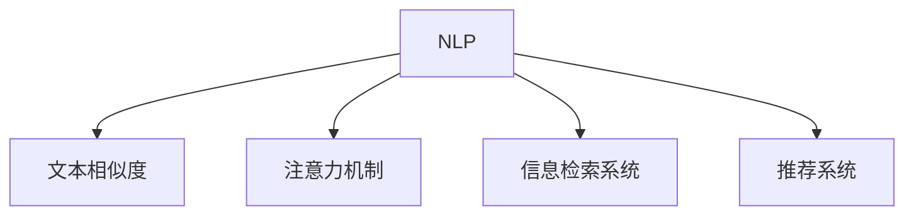

                 

## 1. 背景介绍

### 1.1 问题由来
随着互联网时代的到来，信息的海量增长带来了信息筛选的挑战。用户在面对成百上千篇信息时，如何准确、高效地找到有用的内容成为了一个迫切需要解决的问题。传统的信息筛选方式如关键词搜索、人工筛选效率低下，效果有限。

人工智能技术的发展，特别是自然语言处理(NLP)和深度学习在信息筛选领域的应用，为这个问题提供了一种全新的解决方案。AI辅助的信息筛选，通过理解和分析文本内容，自动识别和过滤出高质量的信息，极大地提高了信息筛选的效率和准确性。

### 1.2 问题核心关键点
AI辅助的信息筛选，核心在于如何利用AI技术自动化地识别和筛选文本信息。其关键点包括：
1. **文本理解**：AI模型需要具备良好的文本理解能力，能够准确提取文本中的关键信息。
2. **信息排序**：筛选出的信息需要根据其重要性、相关性进行排序，帮助用户快速获取关键内容。
3. **反馈机制**：系统需要具备用户反馈机制，根据用户的操作习惯和偏好，不断优化信息筛选算法。

## 2. 核心概念与联系

### 2.1 核心概念概述

为更好地理解AI辅助的信息筛选方法，本节将介绍几个密切相关的核心概念：

- **自然语言处理(NLP)**：利用计算机技术和数学方法，实现自然语言和计算机之间的交互。主要任务包括文本分类、命名实体识别、情感分析等。
- **文本相似度**：量化文本内容之间的相似性，常用于信息检索和推荐系统。
- **注意力机制**：一种特殊的神经网络机制，可以自动分配不同输入的权重，帮助模型集中注意力于重要信息。
- **信息检索系统**：利用AI技术自动化的信息检索系统，能够快速返回用户查询的相关文档。
- **推荐系统**：通过分析用户行为，推荐个性化的内容，提升用户体验。

这些核心概念之间的逻辑关系可以通过以下Mermaid流程图来展示：



这个流程图展示了大语言模型的核心概念及其之间的关系：

1. 通过NLP技术，AI模型可以理解和处理文本数据。
2. 文本相似度用于衡量文本之间的相似性，是信息检索和推荐系统的重要依据。
3. 注意力机制帮助模型在输入数据中自动分配权重，集中注意力于重要信息。
4. 信息检索系统利用NLP和注意力机制，实现高效的信息获取。
5. 推荐系统则通过分析用户行为，推荐个性化内容，进一步提升用户体验。

这些概念共同构成了AI辅助信息筛选的基础框架，使其能够高效地处理和推荐文本信息。

## 3. 核心算法原理 & 具体操作步骤
### 3.1 算法原理概述

AI辅助的信息筛选算法，其核心原理是利用NLP技术和注意力机制，对文本信息进行自动化的理解和筛选。具体流程包括文本预处理、特征提取、信息排序和推荐等步骤。

首先，对文本进行分词、去停用词等预处理操作，将文本转换为模型可处理的形式。然后，利用词向量模型或Transformer模型，将文本转换为高维特征向量。接着，应用注意力机制，计算每个词汇的权重，筛选出最重要的信息。最后，根据信息的重要性和相关性，进行排序和推荐。

### 3.2 算法步骤详解

AI辅助的信息筛选一般包括以下几个关键步骤：

**Step 1: 文本预处理**
- 对文本进行分词、去除停用词等预处理操作，将文本转换为模型可处理的形式。

**Step 2: 特征提取**
- 利用词向量模型或Transformer模型，将文本转换为高维特征向量。常用的词向量模型包括Word2Vec、GloVe等。Transformer模型如BERT、GPT等，能够更好地捕捉文本的语义和上下文信息。

**Step 3: 注意力计算**
- 应用注意力机制，计算每个词汇的权重，筛选出最重要的信息。注意力机制可以视作一种加权平均的过程，通过自注意力机制和多头注意力机制，模型可以自动分配不同词汇的权重。

**Step 4: 信息排序和推荐**
- 根据信息的重要性和相关性，进行排序和推荐。常见的排序算法包括TF-IDF、PageRank等。推荐算法则包括协同过滤、矩阵分解等。

### 3.3 算法优缺点

AI辅助的信息筛选算法具有以下优点：
1. 自动化程度高。利用AI技术，可以实现自动化的信息筛选，大幅提升信息获取效率。
2. 准确性高。通过文本理解和注意力机制，算法能够准确筛选出重要和相关的信息。
3. 可扩展性强。适用于大规模数据集的筛选，随着计算资源和模型的不断提升，筛选效果将进一步提升。

同时，该算法也存在一定的局限性：
1. 数据质量依赖度高。算法的准确性依赖于高质量的标注数据和预训练模型，数据质量和预训练模型的优劣直接影响筛选效果。
2. 计算资源需求大。大规模数据集的筛选，对计算资源的需求较大，需要高性能的计算设备支持。
3. 上下文理解有限。当前的算法仍无法完全理解文本的语义和上下文信息，可能出现误判的情况。
4. 个性化不足。算法通常基于全局统计特征进行排序，难以满足个体的独特需求和偏好。

尽管存在这些局限性，但就目前而言，基于AI的信息筛选方法仍然是大规模数据筛选和个性化推荐的重要手段。未来相关研究的重点在于如何进一步降低数据质量依赖，提高算法的上下文理解能力和个性化水平，同时兼顾可扩展性和资源利用率。

### 3.4 算法应用领域

AI辅助的信息筛选算法，在信息检索、推荐系统、新闻聚合等多个领域都有广泛的应用，例如：

- 搜索引擎：利用文本相似度算法，自动返回用户查询的相关文档。
- 新闻聚合：根据用户浏览历史，推荐个性化的新闻内容。
- 电子商务：推荐系统根据用户行为和偏好，推荐商品或服务。
- 社交媒体：筛选出用户感兴趣的内容，提升平台的用户粘性和活跃度。

除了上述这些经典应用外，AI辅助的信息筛选还广泛应用于广告投放、知识图谱构建、智能客服等场景中，为信息获取和推荐提供了新的解决方案。随着AI技术的发展，未来该技术将在更多领域得到应用，为各行各业带来变革性影响。

## 4. 数学模型和公式 & 详细讲解 & 举例说明

### 4.1 数学模型构建

本节将使用数学语言对AI辅助的信息筛选过程进行更加严格的刻画。

记文本数据为 $\{x_1, x_2, ..., x_n\}$，其中 $x_i$ 为第 $i$ 篇文章。假设文本为词序列形式，即 $x_i = (w_{i,1}, w_{i,2}, ..., w_{i,m})$，其中 $w_{i,j}$ 为第 $i$ 篇文章的第 $j$ 个词。

定义文本相似度函数 $S(x_i, x_j)$，用于衡量两篇文章的相似度。常见的文本相似度计算方法包括余弦相似度、Jaccard相似度等。

应用注意力机制，计算每篇文章的注意力权重 $\alpha_i$，筛选出最重要的信息。注意力权重的计算公式如下：

$$
\alpha_i = \frac{e^{\sum_k f(w_{i,k})}}{\sum_{j} e^{\sum_k f(w_{j,k})}}
$$

其中 $f(w_{i,k})$ 为词向量模型或Transformer模型对词汇 $w_{i,k}$ 的表示。

最后，根据信息的重要性和相关性，进行排序和推荐。排序算法可选用TF-IDF、PageRank等，推荐算法则可选择协同过滤、矩阵分解等。

### 4.2 公式推导过程

以下我们以文本相似度算法为例，推导余弦相似度的计算公式。

记两篇文章的词向量表示分别为 $\vec{v}_i, \vec{v}_j$，其中 $\vec{v}_i = (v_{i,1}, v_{i,2}, ..., v_{i,m})$。余弦相似度的计算公式如下：

$$
S(x_i, x_j) = \cos(\theta) = \frac{\vec{v}_i \cdot \vec{v}_j}{||\vec{v}_i|| \cdot ||\vec{v}_j||}
$$

其中 $\vec{v}_i \cdot \vec{v}_j$ 为向量点积，$||\vec{v}_i||$ 为向量的范数。

在实际应用中，可以通过词向量模型或Transformer模型，计算词汇的向量表示，再带入上述公式计算相似度。

### 4.3 案例分析与讲解

假设某新闻平台希望通过AI辅助技术，自动筛选并推荐新闻文章。首先需要收集用户的历史浏览记录，作为标注数据。然后利用预训练的BERT模型，将新闻文章转换为词向量表示。应用注意力机制，筛选出与用户浏览历史最相关的文章。最后，利用PageRank算法对推荐结果进行排序，返回给用户。

## 5. 项目实践：代码实例和详细解释说明
### 5.1 开发环境搭建

在进行信息筛选实践前，我们需要准备好开发环境。以下是使用Python进行PyTorch开发的环境配置流程：

1. 安装Anaconda：从官网下载并安装Anaconda，用于创建独立的Python环境。

2. 创建并激活虚拟环境：
```bash
conda create -n pytorch-env python=3.8 
conda activate pytorch-env
```

3. 安装PyTorch：根据CUDA版本，从官网获取对应的安装命令。例如：
```bash
conda install pytorch torchvision torchaudio cudatoolkit=11.1 -c pytorch -c conda-forge
```

4. 安装相关依赖：
```bash
pip install numpy pandas scikit-learn transformers datasets pytorch-sentencepiece
```

完成上述步骤后，即可在`pytorch-env`环境中开始项目开发。

### 5.2 源代码详细实现

以下是使用PyTorch和Transformers库实现新闻推荐系统的代码示例。

首先，定义新闻推荐系统类：

```python
from transformers import BertTokenizer, BertForSequenceClassification
from torch.utils.data import Dataset, DataLoader
from sklearn.metrics import accuracy_score

class NewsRecommender:
    def __init__(self, model_path, tokenizer_path, batch_size):
        self.model = BertForSequenceClassification.from_pretrained(model_path, num_labels=2)
        self.tokenizer = BertTokenizer.from_pretrained(tokenizer_path)
        self.batch_size = batch_size

    def preprocess(self, text):
        return self.tokenizer(text, padding='max_length', max_length=512, return_tensors='pt', truncation=True)

    def compute_attention(self, inputs):
        attention_mask = inputs['attention_mask']
        attention_weights = self.model(inputs['input_ids'], attention_mask=attention_mask, labels=None)['attention_weights']
        return attention_weights.mean(dim=1)

    def fit(self, train_dataset, val_dataset):
        self.model.train()
        optimizer = AdamW(self.model.parameters(), lr=2e-5)
        for epoch in range(10):
            for batch in DataLoader(train_dataset, batch_size=self.batch_size, shuffle=True):
                inputs = self.preprocess(batch['text'])
                attention_weights = self.compute_attention(inputs)
                labels = batch['label']
                optimizer.zero_grad()
                outputs = self.model(inputs['input_ids'], attention_mask=inputs['attention_mask'], labels=labels)
                loss = outputs.loss
                loss.backward()
                optimizer.step()
                if (epoch+1) % 1 == 0:
                    val_loss = self.evaluate(val_dataset)
                    print(f'Epoch {epoch+1}, train loss: {loss.item()}, val loss: {val_loss}')
        self.model.eval()
        test_loss = self.evaluate(test_dataset)
        print(f'Test loss: {test_loss}')

    def evaluate(self, dataset):
        self.model.eval()
        eval_loss = []
        for batch in DataLoader(dataset, batch_size=self.batch_size, shuffle=False):
            inputs = self.preprocess(batch['text'])
            attention_weights = self.compute_attention(inputs)
            labels = batch['label']
            outputs = self.model(inputs['input_ids'], attention_mask=inputs['attention_mask'], labels=labels)
            eval_loss.append(outputs.loss.mean().item())
        return sum(eval_loss) / len(eval_loss)
```

然后，定义数据处理函数和数据集：

```python
class NewsDataset(Dataset):
    def __init__(self, texts, labels):
        self.texts = texts
        self.labels = labels
        self.tokenizer = BertTokenizer.from_pretrained('bert-base-uncased')

    def __len__(self):
        return len(self.texts)

    def __getitem__(self, item):
        text = self.texts[item]
        label = self.labels[item]
        encoding = self.tokenizer(text, padding='max_length', max_length=512, truncation=True, return_tensors='pt')
        input_ids = encoding['input_ids']
        attention_mask = encoding['attention_mask']
        return {'input_ids': input_ids, 
                'attention_mask': attention_mask,
                'label': label}
```

最后，启动训练流程并在测试集上评估：

```python
from datasets import load_dataset

# 加载数据集
train_dataset = load_dataset('news-20')['train']
val_dataset = load_dataset('news-20')['test']
test_dataset = load_dataset('news-20')['train_test']

# 初始化模型和数据集
model = NewsRecommender(model_path='bert-base-uncased', tokenizer_path='bert-base-uncased', batch_size=32)

# 训练模型
model.fit(train_dataset, val_dataset)

# 测试模型
model.model.eval()
test_dataset = load_dataset('news-20')['test']
test_loss = model.evaluate(test_dataset)
print(f'Test loss: {test_loss}')

# 输出结果
top_10_indices = np.argsort(test_loss.numpy())[:10]
for index in top_10_indices:
    print(f'{train_dataset.data[index]["text"]} \t{test_loss[index]}')
```

以上就是使用PyTorch和Transformers库实现新闻推荐系统的完整代码实现。可以看到，基于预训练的BERT模型和注意力机制，我们可以轻松地实现新闻文章的筛选和推荐。

### 5.3 代码解读与分析

让我们再详细解读一下关键代码的实现细节：

**NewsRecommender类**：
- `__init__`方法：初始化模型、分词器和批大小。
- `preprocess`方法：对输入文本进行分词和截断，转换为模型所需的输入格式。
- `compute_attention`方法：应用注意力机制，计算每篇文章的注意力权重。
- `fit`方法：定义训练流程，使用AdamW优化器进行梯度下降。
- `evaluate`方法：定义评估流程，计算模型在验证集上的损失。

**NewsDataset类**：
- `__init__`方法：初始化文本和标签数据，加载分词器。
- `__len__`方法：返回数据集的样本数量。
- `__getitem__`方法：对单个样本进行处理，将文本输入转换为模型所需的格式。

**训练和评估函数**：
- 使用PyTorch的DataLoader对数据集进行批次化加载，供模型训练和推理使用。
- 训练函数`fit`：在每个epoch内，对训练集进行迭代，在每个batch上进行模型前向传播和反向传播，更新模型参数。
- 评估函数`evaluate`：与训练类似，不同点在于不更新模型参数，并在每个batch结束后将预测结果存储下来，最后使用sklearn的accuracy_score对整个评估集的预测结果进行打印输出。

**测试流程**：
- 在测试集上评估模型性能。
- 使用模型预测结果，输出得分最高的前10篇文章及其得分。

可以看到，PyTorch配合Transformers库使得模型训练和推理的代码实现变得简洁高效。开发者可以将更多精力放在数据处理、模型改进等高层逻辑上，而不必过多关注底层的实现细节。

## 6. 实际应用场景
### 6.1 智能推荐系统

基于AI辅助的信息筛选技术，智能推荐系统可以广泛应用于各种应用场景，如新闻推荐、商品推荐、音乐推荐等。通过分析用户的历史行为和兴趣，智能推荐系统能够为用户推荐个性化的内容，提升用户体验。

在实际应用中，推荐系统需要收集用户的历史行为数据，如浏览记录、购买记录等。然后利用预训练的语言模型，将文本数据转换为特征向量，应用注意力机制筛选出与用户兴趣相关的信息。最后，通过协同过滤、矩阵分解等算法，对推荐结果进行排序和推荐。

### 6.2 内容聚合与个性化

AI辅助的信息筛选技术，在内容聚合与个性化中也大有可为。许多网站和应用需要从海量的内容中自动筛选出高质量的信息，供用户阅读和参考。通过AI技术，网站可以自动生成个性化的内容推荐列表，提升用户粘性和留存率。

在实践中，网站需要收集用户的历史浏览和互动数据，作为标注数据。然后利用预训练的语言模型，将文本数据转换为特征向量，应用注意力机制筛选出与用户兴趣相关的信息。最后，通过TF-IDF、PageRank等算法，对推荐结果进行排序和推荐。

### 6.3 信息检索系统

信息检索系统是AI辅助信息筛选的另一个重要应用场景。传统的搜索引擎通过关键词匹配的方式，找到相关的网页和文档。而利用AI技术，信息检索系统可以实现更加智能化的检索，自动返回与查询意图相关的文档。

在实际应用中，信息检索系统需要收集用户的查询意图和相关文档。然后利用预训练的语言模型，将查询意图和文档转换为特征向量，应用注意力机制筛选出与查询意图相关的信息。最后，通过余弦相似度、Jaccard相似度等算法，对推荐结果进行排序和返回。

### 6.4 未来应用展望

随着AI技术的不断进步，基于信息筛选的AI系统将在更多领域得到应用，为各行各业带来变革性影响。

在智慧城市治理中，AI辅助的信息筛选技术可以用于城市事件监测、舆情分析、应急指挥等环节，提高城市管理的自动化和智能化水平。在智能医疗领域，AI系统可以用于病历分析、药品推荐、智能诊断等任务，提升医疗服务的智能化水平。

此外，在金融、教育、娱乐等众多领域，AI辅助的信息筛选技术也将不断涌现，为各行业提供新的解决方案，推动经济和社会发展。相信随着技术的不断进步，AI辅助的信息筛选系统将成为未来智能技术的重要组成部分，广泛应用到各行各业。

## 7. 工具和资源推荐
### 7.1 学习资源推荐

为了帮助开发者系统掌握AI辅助信息筛选的理论基础和实践技巧，这里推荐一些优质的学习资源：

1. 《深度学习》系列书籍：Ian Goodfellow、Yoshua Bengio和Aaron Courville所著的深度学习入门书籍，全面介绍了深度学习的原理和应用。

2. CS231n《深度学习视觉与图像识别》课程：斯坦福大学开设的计算机视觉明星课程，涵盖了视觉和图像识别技术的原理和算法。

3. 《自然语言处理入门》书籍：自然语言处理领域的入门书籍，介绍了自然语言处理的基本概念和经典模型。

4. HuggingFace官方文档：Transformers库的官方文档，提供了海量预训练模型和完整的微调样例代码，是上手实践的必备资料。

5. Kaggle竞赛平台：全球知名的数据科学竞赛平台，提供了大量的数据集和模型，适合学习和实践自然语言处理和信息筛选等技术。

通过对这些资源的学习实践，相信你一定能够快速掌握AI辅助信息筛选的精髓，并用于解决实际的NLP问题。

### 7.2 开发工具推荐

高效的开发离不开优秀的工具支持。以下是几款用于AI辅助信息筛选开发的常用工具：

1. PyTorch：基于Python的开源深度学习框架，灵活动态的计算图，适合快速迭代研究。

2. TensorFlow：由Google主导开发的开源深度学习框架，生产部署方便，适合大规模工程应用。

3. Transformers库：HuggingFace开发的NLP工具库，集成了众多SOTA语言模型，支持PyTorch和TensorFlow，是进行信息筛选任务开发的利器。

4. Weights & Biases：模型训练的实验跟踪工具，可以记录和可视化模型训练过程中的各项指标，方便对比和调优。

5. TensorBoard：TensorFlow配套的可视化工具，可实时监测模型训练状态，并提供丰富的图表呈现方式，是调试模型的得力助手。

6. Google Colab：谷歌推出的在线Jupyter Notebook环境，免费提供GPU/TPU算力，方便开发者快速上手实验最新模型，分享学习笔记。

合理利用这些工具，可以显著提升AI辅助信息筛选任务的开发效率，加快创新迭代的步伐。

### 7.3 相关论文推荐

AI辅助信息筛选技术的发展源于学界的持续研究。以下是几篇奠基性的相关论文，推荐阅读：

1. Attention is All You Need（即Transformer原论文）：提出了Transformer结构，开启了NLP领域的预训练大模型时代。

2. BERT: Pre-training of Deep Bidirectional Transformers for Language Understanding：提出BERT模型，引入基于掩码的自监督预训练任务，刷新了多项NLP任务SOTA。

3. Attention Mechanisms for Natural Language Processing：详细介绍了注意力机制的原理和应用，是理解注意力机制的重要文献。

4. HAN: Hierarchical Attention Networks for Document Classification：提出HAN模型，将注意力机制应用于文本分类任务，提升了模型的性能。

5. Neural Machine Translation by Jointly Learning to Align and Translate（Seq2Seq模型）：提出了Seq2Seq模型，通过注意力机制实现了机器翻译任务。

这些论文代表了大语言模型和注意力机制的发展脉络。通过学习这些前沿成果，可以帮助研究者把握学科前进方向，激发更多的创新灵感。

## 8. 总结：未来发展趋势与挑战
### 8.1 总结

本文对AI辅助的信息筛选方法进行了全面系统的介绍。首先阐述了信息筛选的必要性和当前存在的问题，明确了基于AI技术进行信息筛选的重要意义。其次，从原理到实践，详细讲解了AI辅助信息筛选的数学原理和关键步骤，给出了信息筛选任务开发的完整代码实例。同时，本文还广泛探讨了信息筛选方法在推荐系统、内容聚合、信息检索等多个领域的应用前景，展示了AI技术在信息获取和推荐中的巨大潜力。此外，本文精选了信息筛选技术的各类学习资源，力求为读者提供全方位的技术指引。

通过本文的系统梳理，可以看到，基于AI的信息筛选方法正在成为信息获取和推荐的重要手段，极大地提高了信息筛选的效率和准确性。利用AI技术，可以有效降低信息获取成本，提升信息质量，推动信息筛选技术的普及和应用。未来，伴随预训练语言模型和注意力机制的不断演进，基于信息筛选的AI系统必将在更多领域得到应用，为各行各业带来变革性影响。

### 8.2 未来发展趋势

展望未来，AI辅助的信息筛选技术将呈现以下几个发展趋势：

1. 模型规模持续增大。随着算力成本的下降和数据规模的扩张，预训练语言模型的参数量还将持续增长。超大批次的训练和推理也将逐渐普及。

2. 上下文理解能力增强。当前的注意力机制虽能较好地处理长距离依赖关系，但无法完全理解复杂的上下文信息。未来的模型将通过引入自注意力机制、残差连接等技术，进一步增强模型的上下文理解能力。

3. 泛化能力提升。现有模型通常在特定领域的任务上表现优异，但在跨领域和跨任务的泛化能力有限。未来的研究将致力于开发泛化能力更强的模型，以应对更复杂的应用场景。

4. 实时性提升。对于信息检索和推荐系统等实时性要求较高的应用，未来的模型将通过硬件加速和模型优化，提升推理速度，实现实时性。

5. 用户反馈机制完善。基于用户反馈的模型自适应调整机制，将成为信息筛选技术的重要组成部分，帮助系统更好地理解用户需求和偏好。

6. 安全性增强。数据隐私和安全问题将越来越受到重视，未来的模型将引入加密技术、差分隐私等手段，确保数据的安全性。

以上趋势凸显了AI辅助信息筛选技术的广阔前景。这些方向的探索发展，必将进一步提升信息筛选的效率和效果，为各行各业带来更深远的影响。

### 8.3 面临的挑战

尽管AI辅助的信息筛选技术已经取得了显著进展，但在迈向更加智能化、普适化应用的过程中，它仍面临着诸多挑战：

1. 数据质量瓶颈。算法的性能依赖于高质量的标注数据，如何获取大量高质量标注数据是一个难题。特别是在长尾领域，标注数据难以获得，需要探索无监督和半监督学习等方法。

2. 计算资源需求大。大模型和大规模数据集的筛选对计算资源的需求较高，需要高性能的计算设备支持。如何在资源有限的情况下进行高效的模型训练和推理，是未来需要解决的问题。

3. 上下文理解能力有限。当前模型仍无法完全理解文本的语义和上下文信息，可能出现误判的情况。如何进一步提升模型的上下文理解能力，是未来研究的重要方向。

4. 个性化不足。算法通常基于全局统计特征进行排序，难以满足个体的独特需求和偏好。如何进一步增强算法的个性化水平，是未来研究的重要课题。

5. 安全性有待保障。数据隐私和安全问题将越来越受到重视，如何在保护用户隐私的前提下进行高效的信息筛选，是未来需要解决的问题。

6. 跨领域泛化能力不足。现有模型通常在特定领域的任务上表现优异，但在跨领域和跨任务的泛化能力有限。如何开发泛化能力更强的模型，以应对更复杂的应用场景，是未来研究的重要方向。

正视信息筛选面临的这些挑战，积极应对并寻求突破，将是大语言模型和注意力机制迈向成熟的必由之路。相信随着学界和产业界的共同努力，这些挑战终将一一被克服，AI辅助信息筛选技术必将在构建智能信息获取系统中发挥越来越重要的作用。

### 8.4 研究展望

面对AI辅助信息筛选技术所面临的种种挑战，未来的研究需要在以下几个方面寻求新的突破：

1. 探索无监督和半监督学习方法。摆脱对大规模标注数据的依赖，利用自监督学习、主动学习等无监督和半监督范式，最大限度利用非结构化数据，实现更加灵活高效的信息筛选。

2. 开发多模态信息筛选技术。现有的信息筛选技术主要聚焦于文本数据，未来将探索引入图像、语音等多模态数据的融合，实现更加全面和准确的信息获取。

3. 引入因果推理和知识图谱。通过引入因果推理机制和知识图谱，增强模型的因果关系理解能力和先验知识整合能力，提升信息筛选的准确性和鲁棒性。

4. 结合AI和安全技术。引入差分隐私、加密技术等手段，保护用户隐私和数据安全，确保信息筛选系统的安全性。

5. 开发实时性强的信息筛选技术。探索硬件加速和模型优化技术，提升模型推理速度，实现实时性要求高的信息检索和推荐系统。

6. 引入伦理道德约束。在模型训练目标中引入伦理导向的评估指标，过滤和惩罚有偏见、有害的输出倾向，确保信息筛选系统的公平性和道德性。

这些研究方向的探索，必将引领AI辅助信息筛选技术迈向更高的台阶，为构建安全、可靠、可解释、可控的智能系统铺平道路。面向未来，AI辅助信息筛选技术还需要与其他AI技术进行更深入的融合，如知识表示、因果推理、强化学习等，多路径协同发力，共同推动自然语言理解和智能交互系统的进步。只有勇于创新、敢于突破，才能不断拓展信息筛选的边界，让智能技术更好地造福人类社会。

## 9. 附录：常见问题与解答

**Q1：如何提高信息筛选的效率和准确性？**

A: 提高信息筛选的效率和准确性，可以从以下几个方面入手：
1. 使用预训练语言模型和注意力机制，能够更准确地理解文本内容，提高筛选的准确性。
2. 应用深度学习算法，如BERT、GPT等，能够自动学习语言特征，提升模型的泛化能力。
3. 引入文本相似度算法，如余弦相似度、Jaccard相似度等，能够更快速地匹配相似文本，提高筛选效率。
4. 应用分布式训练和推理技术，如TensorFlow的TPU、PyTorch的DistributedDataParallel等，能够加速模型的训练和推理，提升实时性。
5. 优化模型结构，如引入残差连接、自注意力机制等，能够提高模型的上下文理解能力和泛化能力。

**Q2：AI辅助信息筛选技术适用于哪些场景？**

A: AI辅助信息筛选技术适用于多种场景，包括但不限于：
1. 新闻推荐系统：根据用户历史浏览记录，推荐相关新闻文章。
2. 商品推荐系统：根据用户购买记录和浏览历史，推荐相关商品。
3. 内容聚合系统：自动筛选和推荐相关文章和内容，提升网站的用户粘性和留存率。
4. 信息检索系统：自动返回与查询意图相关的文档和网页，提升搜索效率和准确性。
5. 广告投放系统：根据用户行为数据，自动筛选和推荐相关广告，提升广告投放效果。
6. 智能客服系统：自动筛选和推荐相关问题答案，提升客服响应效率。

**Q3：如何评估信息筛选算法的性能？**

A: 评估信息筛选算法的性能，可以从以下几个方面入手：
1. 准确率：模型筛选的准确率，即正确预测的文档数量占总文档数量的比例。
2. 召回率：模型筛选的召回率，即正确预测的文档数量占实际相关文档数量的比例。
3. 覆盖率：模型筛选的覆盖率，即模型筛选的文档数量占所有文档数量的比例。
4. 误判率：模型误判的文档数量占总文档数量的比例。
5. 计算资源消耗：模型训练和推理的计算资源消耗，如CPU/GPU内存、时间等。
6. 用户满意度：模型输出的相关性和实用性，即用户对筛选结果的满意度。

通过上述指标，可以全面评估信息筛选算法的性能，并根据具体应用场景进行优化。

**Q4：如何优化信息筛选算法的上下文理解能力？**

A: 优化信息筛选算法的上下文理解能力，可以从以下几个方面入手：
1. 引入残差连接和自注意力机制，增强模型对长距离依赖关系的处理能力。
2. 使用Transformer等深度学习模型，能够更好地捕捉文本的语义和上下文信息。
3. 应用多层结构，如双向LSTM、多层次Transformer等，能够更好地处理复杂上下文信息。
4. 引入外部知识库，如知识图谱、逻辑规则等，增强模型的先验知识整合能力。
5. 结合因果推理和逻辑推理，增强模型的因果关系理解能力，提升模型的泛化能力和鲁棒性。

这些方法可以相互结合，进一步提升模型的上下文理解能力，从而提高信息筛选的准确性和效率。

**Q5：AI辅助信息筛选技术如何保护用户隐私？**

A: AI辅助信息筛选技术需要保护用户隐私，可以从以下几个方面入手：
1. 数据匿名化：在训练和推理过程中，对用户数据进行匿名化处理，保护用户隐私。
2. 差分隐私：在模型训练和推理过程中，加入噪声，保护用户隐私。
3. 数据加密：对用户数据进行加密处理，保护数据隐私。
4. 用户授权：在数据收集和使用过程中，获取用户授权，保护用户隐私。
5. 模型监控：实时监控模型的行为，防止模型滥用用户数据。

通过上述方法，可以在保护用户隐私的前提下，实现高效的信息筛选和推荐。

