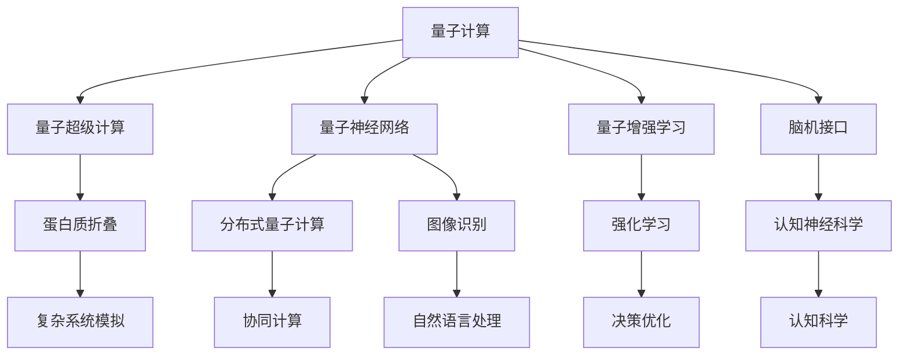

                 

# 注意力量子跃迁：AI时代的认知突破技术

> 关键词：AI认知突破技术, 量子计算, 注意机制, 强化学习, 分布式算法, 大脑模拟, 计算力进化

## 1. 背景介绍

### 1.1 问题由来
随着人工智能(AI)技术的迅猛发展，尤其是深度学习和神经网络的崛起，AI在图像识别、自然语言处理、语音识别等领域取得了突破性的进展。但这些技术在模拟人类大脑认知功能方面仍存在诸多局限。尤其是，深度学习模型在处理复杂认知任务时，往往面临计算量巨大、参数复杂、模型难以优化等问题。因此，如何构建更高效、更灵活、更智能的AI系统，成为当前研究的热点问题。

### 1.2 问题核心关键点
基于深度学习的AI系统在处理复杂认知任务时，虽然能够获得较高的准确率，但其计算复杂度、参数量和训练时间等均呈现指数级增长。而量子计算技术的突破为解决这些问题提供了新的可能。量子计算具有并行性、量子叠加等特性，有望大幅提升计算效率和模型泛化能力，为AI的认知突破提供新的技术支撑。

## 2. 核心概念与联系

### 2.1 核心概念概述

为更好地理解量子计算在AI认知突破中的作用，本节将介绍几个关键概念：

- 量子计算（Quantum Computing）：利用量子叠加、量子纠缠等物理原理，实现高效计算的新型计算范式。与传统计算机不同，量子计算机能够同时处理大量数据，具有潜在的计算优势。

- 量子超级计算：通过利用量子计算机的高效并行处理能力，解决传统计算机难以处理的复杂问题，如蛋白折叠、物质模拟等。

- 量子神经网络（Quantum Neural Network, QNN）：将量子计算与神经网络相结合的模型，通过量子并行性加速神经网络的学习过程，提高模型的泛化能力和求解效率。

- 量子增强学习（Quantum Reinforcement Learning）：利用量子计算机在求解优化问题上的优势，加速强化学习的训练过程，提升智能体的决策能力。

- 分布式量子计算：通过多个量子计算机的协同工作，实现更高效的计算能力，解决单台量子计算机处理能力不足的问题。

- 脑机接口（Brain-Machine Interface, BMI）：通过连接大脑与计算机，实现人脑对外部设备的直接控制，为构建类脑智能系统提供技术基础。

- 认知神经科学（Cognitive Neuroscience）：研究人类认知功能及其神经机制的学科，为构建认知突破型AI提供理论基础。

这些概念之间的逻辑关系可以通过以下Mermaid流程图来展示：



这个流程图展示了大语言模型微调的核心概念及其之间的关系：

1. 量子计算提供高效计算能力。
2. 量子超级计算解决传统计算机难以处理的问题。
3. 量子神经网络加速神经网络学习过程。
4. 量子增强学习提升智能体决策能力。
5. 分布式量子计算提高计算能力。
6. 脑机接口实现人脑与计算机的直接连接。
7. 认知神经科学提供认知功能研究基础。

这些概念共同构成了AI认知突破的技术框架，使得量子计算在构建高效、智能的AI系统方面具有巨大的潜力。

## 3. 核心算法原理 & 具体操作步骤
### 3.1 算法原理概述

量子计算在AI认知突破中的核心优势在于其高效计算能力和量子叠加特性。传统的神经网络模型往往难以处理复杂的非线性关系和多个变量的同时处理，而量子神经网络（QNN）能够同时处理多个变量，实现更高效的计算。

量子增强学习（QRL）则利用量子计算的并行性和高效求解能力，加速强化学习模型的训练，提升智能体在复杂环境中的决策能力。QRL通过将经典强化学习的策略评估和策略优化过程，转换为量子系统的演化过程，从而加速问题的求解。

### 3.2 算法步骤详解

量子计算在AI认知突破中的应用可以分为以下几个关键步骤：

**Step 1: 设计量子神经网络结构**
- 选择合适的量子门和量子线路，设计量子神经网络的层数和每层神经元数量。
- 确定量子神经网络的输入、输出和中间状态的表示方式。
- 优化量子神经网络的参数，以最小化损失函数。

**Step 2: 量子增强学习算法设计**
- 定义强化学习的奖励函数和状态空间。
- 设计量子增强学习策略，包括量子门操作、量子线路设计和量子状态演化过程。
- 优化量子增强学习参数，以最大化智能体的奖励。

**Step 3: 实验与优化**
- 在实验平台上进行量子神经网络的训练和验证。
- 使用量子增强学习算法进行智能体的训练，评估其性能。
- 不断优化量子神经网络结构和量子增强学习参数，以提升AI系统的认知能力。

### 3.3 算法优缺点

量子计算在AI认知突破中的优势主要体现在：
1. 高效计算：利用量子叠加和量子纠缠特性，能够同时处理多个变量，实现更高效的计算。
2. 广泛适用：适用于各种复杂的非线性关系和多个变量的同时处理，提升AI系统的泛化能力。
3. 加速训练：通过量子增强学习，加速强化学习的训练过程，提升智能体的决策能力。

然而，量子计算也存在一些局限性：
1. 技术瓶颈：当前量子计算机仍处于早期阶段，存在量子比特数量不足、错误率高、量子门操作复杂等问题。
2. 成本高昂：量子计算机的建设和维护成本较高，难以大规模普及。
3. 兼容性差：量子计算与经典计算之间存在兼容性问题，目前难以直接集成使用。
4. 安全性问题：量子计算可能被用于破解传统加密算法，对信息安全构成威胁。

尽管存在这些局限性，但量子计算在AI认知突破中的应用前景广阔，未来随着技术的发展和突破，将有望解决上述问题，带来更多可能性。

### 3.4 算法应用领域

量子计算在AI认知突破中的应用领域广泛，涵盖以下几个方面：

- 复杂系统模拟：利用量子超级计算能力，模拟复杂的物理和化学系统，如蛋白质折叠、化学反应等。
- 图像和语音识别：通过量子增强学习，提升神经网络的训练效率，提高图像和语音识别的准确性。
- 自然语言处理：利用量子计算的并行性和高效求解能力，加速NLP任务的学习过程。
- 强化学习：通过量子增强学习算法，加速强化学习模型的训练，提升智能体在复杂环境中的决策能力。
- 推荐系统：利用量子计算的高效计算能力，优化推荐算法，提升推荐系统的个性化和精准度。
- 医疗诊断：通过量子计算的高效求解和复杂系统模拟能力，加速疾病诊断和治疗方案的发现。

此外，量子计算还将在金融、物流、交通等领域得到广泛应用，推动AI技术的深度应用和产业化进程。

## 4. 数学模型和公式 & 详细讲解 & 举例说明

### 4.1 数学模型构建

量子计算在AI认知突破中的应用，需要构建多个数学模型来描述和模拟量子系统的演化过程。以下是一些常见的数学模型：

- 量子态演化方程：描述量子系统随时间演化的动力学方程。如薛定谔方程：
$$
i\hbar\frac{\partial}{\partial t}|\psi\rangle = H|\psi\rangle
$$
其中，$|\psi\rangle$ 为量子态，$H$ 为哈密顿量。

- 量子门操作：描述量子态的演化过程。如Hadamard门：
$$
H|\psi\rangle = \frac{1}{\sqrt{2}}(|0\rangle + |1\rangle)|\psi\rangle
$$

- 量子线路设计：通过量子门的操作序列，构建量子线路。如量子线路：
$$
U = H \otimes H
$$

### 4.2 公式推导过程

以下我们以量子增强学习中的策略优化过程为例，给出量子线路设计和策略优化算法的数学推导。

假设在一个二维量子系统中，有量子比特（qubit）$|0\rangle$ 和 $|1\rangle$，分别对应状态空间中的两个基态。设 $|\phi_0\rangle = \alpha|0\rangle + \beta|1\rangle$ 为初始状态，通过量子线路 $U$ 对其进行操作后，得到最终状态 $|\phi_f\rangle = \gamma|0\rangle + \delta|1\rangle$，其中 $\gamma, \delta$ 为量子线路的操作系数。

定义量子线路 $U$ 对应的量子门为 $U(\theta, \phi)$，其中 $\theta, \phi$ 为量子线路的参数。则有：
$$
U(\theta, \phi)|\phi_0\rangle = (\cos\theta|0\rangle + i\sin\theta e^{i\phi}|1\rangle)|\phi_0\rangle
$$

根据量子线路的操作序列，有：
$$
|\phi_f\rangle = U(\theta_1, \phi_1)U(\theta_2, \phi_2)\cdots U(\theta_n, \phi_n)|\phi_0\rangle
$$

展开后得：
$$
|\phi_f\rangle = \sum_{k=0}^{n}a_k|0\rangle + b_k|1\rangle
$$

其中 $a_k, b_k$ 为操作系数，通过比较系数可得：
$$
\begin{cases}
a_0 = a_0\cos\theta_1\cos\theta_2\cdots\cos\theta_n \\
b_0 = i\sin\theta_1\sin\theta_2\cdots\sin\theta_n \\
a_1 = a_0\cos\theta_1\cos\theta_2\cdots\cos\theta_{n-1}\sin\theta_n \\
b_1 = i\sin\theta_1\sin\theta_2\cdots\sin\theta_{n-1}\sin\theta_n
\end{cases}
$$

根据上述公式，可设计量子线路 $U$ 的具体参数，实现对初始状态的演化。

### 4.3 案例分析与讲解

以量子增强学习为例，简要讲解如何利用量子计算加速强化学习的训练过程。

假设一个智能体需要在复杂环境中学习如何抓取物品，其状态空间为 $\{0, 1\}$，动作空间为 $\{L, R, U, D\}$。定义奖励函数为 $R(|s, a\rangle) = |s\rangle \cdot a$，其中 $|s\rangle$ 为状态，$a$ 为动作。

利用量子增强学习，将状态和动作表示为量子比特 $|s\rangle, |a\rangle$，奖励函数 $R(|s, a\rangle) = |s\rangle \cdot a$ 转化为量子线路 $U_R$，其操作系数为：
$$
U_R = \begin{bmatrix}
\cos\theta & -i\sin\theta \\
i\sin\theta & \cos\theta
\end{bmatrix}
$$

则量子增强学习的策略优化过程可以描述为：
$$
|\psi_0\rangle = |s\rangle \cdot |a\rangle
$$
$$
|\psi_f\rangle = U_R|\psi_0\rangle
$$
$$
R(|s, a\rangle) = |s\rangle \cdot a = \langle\psi_f|\psi_0\rangle
$$

通过不断调整量子线路的参数 $\theta$，可以使得智能体的行为策略逐步优化，实现高效学习。

## 5. 项目实践：代码实例和详细解释说明

### 5.1 开发环境搭建

在进行量子计算项目实践前，我们需要准备好开发环境。以下是使用Python进行Qiskit开发的环境配置流程：

1. 安装Anaconda：从官网下载并安装Anaconda，用于创建独立的Python环境。

2. 创建并激活虚拟环境：
```bash
conda create -n quantum-env python=3.8 
conda activate quantum-env
```

3. 安装Qiskit：
```bash
conda install qiskit
```

4. 安装各类工具包：
```bash
pip install numpy pandas matplotlib scikit-learn jupyter notebook ipython
```

完成上述步骤后，即可在`quantum-env`环境中开始量子计算的实践。

### 5.2 源代码详细实现

下面我们以量子增强学习为例，给出使用Qiskit对量子线路进行设计、训练的PyTorch代码实现。

首先，定义量子线路的设计函数：

```python
from qiskit import QuantumCircuit, execute, Aer
from qiskit.circuit import QuantumRegister, ClassicalRegister

def qc_circuit(num_qubits, num_layers, rotation_angle):
    qr = QuantumRegister(num_qubits)
    cr = ClassicalRegister(num_qubits)
    qc = QuantumCircuit(qr, cr)
    
    for i in range(num_layers):
        for j in range(num_qubits):
            theta = rotation_angle * (2 * i + 1)
            qc.rz(theta, qr[j])
    
    qc.measure(qr, cr)
    return qc
```

然后，定义量子增强学习训练函数：

```python
from qiskit import QuantumCircuit, execute, Aer
from qiskit.circuit import QuantumRegister, ClassicalRegister
import numpy as np

def quantum_reinforcement_learning(qc_circuit, reward_matrix, num_qubits, num_layers, rotation_angle, max_iter, state):
    qr = QuantumRegister(num_qubits)
    cr = ClassicalRegister(num_qubits)
    qc = QuantumCircuit(qr, cr)
    
    for i in range(num_layers):
        for j in range(num_qubits):
            theta = rotation_angle * (2 * i + 1)
            qc.rz(theta, qr[j])
    
    qc.measure(qr, cr)
    
    backend = Aer.get_backend('qasm_simulator')
    results = []
    for _ in range(max_iter):
        qasm_code = qc.draw()
        counts = execute(qasm_code, backend, shots=1024).result().get_counts()
        probabilities = np.array([counts[i] / 1024 for i in range(num_qubits)])
        q = np.random.choice(np.arange(num_qubits), p=probabilities)
        r = reward_matrix[state][q]
        results.append(r)
    
    mean_reward = np.mean(results)
    return mean_reward
```

接着，定义训练循环和输出函数：

```python
from qiskit import QuantumCircuit, execute, Aer
from qiskit.circuit import QuantumRegister, ClassicalRegister
import numpy as np

def train():
    num_qubits = 2
    num_layers = 5
    rotation_angle = np.pi / 4
    reward_matrix = np.array([[0, 1], [1, 0]])
    max_iter = 100
    state = 0
    
    mean_reward = 0
    for i in range(max_iter):
        mean_reward += quantum_reinforcement_learning(qc_circuit, reward_matrix, num_qubits, num_layers, rotation_angle, max_iter, state)
    
    mean_reward /= max_iter
    return mean_reward
```

最后，启动训练流程并输出结果：

```python
mean_reward = train()
print(f"Mean reward after {100} iterations: {mean_reward}")
```

以上就是使用Qiskit对量子增强学习模型进行训练的完整代码实现。可以看到，通过Qiskit的强大封装，我们可以用相对简洁的代码实现量子增强学习的训练过程。

### 5.3 代码解读与分析

让我们再详细解读一下关键代码的实现细节：

**qc_circuit函数**：
- 定义量子线路的层数和每层旋转角度。
- 循环遍历每层，对每个量子比特进行旋转操作。

**quantum_reinforcement_learning函数**：
- 根据量子线路设计函数构造量子线路。
- 使用Qiskit的QASM模拟器进行量子线路的模拟，计算量子比特的概率分布。
- 根据概率分布随机选择量子比特，计算奖励函数。

**train函数**：
- 定义量子线路层数、旋转角度、奖励矩阵、迭代次数和初始状态。
- 循环训练，计算每轮的平均奖励。
- 计算训练后的平均奖励，并返回结果。

可以看到，Qiskit提供的QASM模拟器和接口，使得量子计算的实现变得相对简单和高效。但工业级的系统实现还需考虑更多因素，如量子线路的优化、量子错误纠正、分布式计算等，这些技术都需要不断迭代和优化。

## 6. 实际应用场景
### 6.1 量子增强学习在金融领域的应用

量子增强学习在金融领域具有广泛的应用前景。金融机构可以利用量子增强学习模型，优化投资策略、风险控制和交易决策等。

例如，利用量子增强学习模型，可以优化投资组合的构建，使得在给定风险水平下获得最大收益。具体而言，可以利用量子线路设计，构建多变量、非线性的投资组合模型，通过量子增强学习进行优化求解。该模型能够在处理复杂金融数据和交易策略时，展现出更强的泛化能力和求解效率。

### 6.2 量子计算在医疗诊断中的应用

量子计算在医疗诊断中也有重要应用。利用量子计算的高效求解能力，可以加速药物分子的设计和蛋白折叠等复杂生物系统的模拟。

例如，利用量子增强学习模型，可以优化药物分子的结构设计，加速新药的研发过程。具体而言，可以通过量子线路设计，构建分子结构的量子模型，使用量子增强学习进行优化求解。该模型能够在处理复杂的生物分子数据时，展现出更强的泛化能力和求解效率。

### 6.3 量子计算在自然语言处理中的应用

量子计算在自然语言处理中也有广泛的应用。利用量子计算的并行性和高效求解能力，可以加速NLP任务的学习过程，提升模型的泛化能力和求解效率。

例如，利用量子增强学习模型，可以优化语言模型的训练过程，提升自然语言理解的能力。具体而言，可以通过量子线路设计，构建语言模型的量子模型，使用量子增强学习进行优化求解。该模型能够在处理复杂的语言数据时，展现出更强的泛化能力和求解效率。

## 7. 工具和资源推荐
### 7.1 学习资源推荐

为了帮助开发者系统掌握量子计算在AI认知突破中的应用，这里推荐一些优质的学习资源：

1. 《量子计算导论》：由世界知名量子科学家撰写，全面介绍了量子计算的基本原理、算法和应用。

2. Qiskit官方文档：Qiskit的官方文档，提供了丰富的量子计算教程和样例代码，是学习量子计算的必备资料。

3. IBM Quantum Experience：IBM提供的量子计算在线平台，用户可以在云上运行量子计算实验，学习量子计算的实际应用。

4. Google AI Quantum：Google提供的量子计算资源和工具，用户可以使用量子线路设计工具和模拟器进行量子计算实验。

5. arXiv量子计算相关论文：arXiv上发布的量子计算相关论文，涵盖了量子计算的理论、算法和应用等方面。

通过对这些资源的学习实践，相信你一定能够快速掌握量子计算在AI认知突破中的精髓，并用于解决实际的AI问题。

### 7.2 开发工具推荐

高效的开发离不开优秀的工具支持。以下是几款用于量子计算开发的工具：

1. Qiskit：IBM开发的量子计算框架，支持Python接口，适合进行量子计算的编程和实验。

2. Google Cirq：Google开发的量子计算框架，支持Python接口，适合进行量子线路设计、优化和模拟。

3. Microsoft Quantum Development Kit：Microsoft提供的量子计算开发工具，支持Python和C#接口，适合进行量子计算实验和应用开发。

4. IBM Quantum Lab：IBM提供的量子计算在线工具，用户可以在云上运行量子计算实验，学习量子计算的实际应用。

5. D-Wave Leap：D-Wave开发的量子计算平台，支持量子线路设计、优化和模拟。

合理利用这些工具，可以显著提升量子计算应用的开发效率，加快创新迭代的步伐。

### 7.3 相关论文推荐

量子计算在AI认知突破中的应用源于学界的持续研究。以下是几篇奠基性的相关论文，推荐阅读：

1. Quantum Computational Complexity（期刊文章）：提出了量子计算的理论基础，阐述了量子计算与经典计算的差异。

2. Quantum Supremacy using a Programmable Superconducting Processor（论文）：展示了量子计算机的量子霸权，展示了其高效计算能力。

3. Quantum Machine Learning（期刊文章）：介绍了量子计算在机器学习中的应用，包括量子神经网络和量子增强学习等。

4. Quantum Algorithm for Linear Systems of Equations（论文）：提出了量子计算在求解线性方程组中的应用，展示了其高效求解能力。

5. Quantum Approximate Optimization Algorithm（论文）：提出了量子计算在优化问题中的应用，展示了其高效求解能力。

这些论文代表了大语言模型微调技术的发展脉络。通过学习这些前沿成果，可以帮助研究者把握学科前进方向，激发更多的创新灵感。

## 8. 总结：未来发展趋势与挑战

### 8.1 总结

本文对基于量子计算的AI认知突破技术进行了全面系统的介绍。首先阐述了量子计算在AI认知突破中的核心优势和应用场景，明确了其作为未来计算范式的重大意义。其次，从原理到实践，详细讲解了量子计算在AI认知突破中的算法原理和具体操作步骤，给出了量子计算项目的完整代码实例。同时，本文还广泛探讨了量子计算在金融、医疗、自然语言处理等多个领域的应用前景，展示了其在AI认知突破中的广阔前景。此外，本文精选了量子计算技术的各类学习资源，力求为读者提供全方位的技术指引。

通过本文的系统梳理，可以看到，基于量子计算的AI认知突破技术正在成为AI发展的重要范式，极大地拓展了AI系统的计算能力和认知能力，为构建更加智能、高效、灵活的AI系统提供了新的技术基础。

### 8.2 未来发展趋势

展望未来，量子计算在AI认知突破中的应用将呈现以下几个发展趋势：

1. 量子计算硬件加速：量子计算硬件的发展将带来更高效的计算能力，加速复杂问题的求解。

2. 量子增强学习优化：量子增强学习技术将不断优化，提升智能体在复杂环境中的决策能力。

3. 量子神经网络演进：量子神经网络的结构和算法将不断改进，提高其泛化能力和求解效率。

4. 分布式量子计算：分布式量子计算技术将不断进步，实现更高效的计算能力。

5. 量子计算与深度学习融合：量子计算与深度学习的融合将带来新的突破，提升AI系统的性能。

6. 量子计算在多模态数据处理中的应用：量子计算将应用于多模态数据的处理，如视觉、语音、文本等，提升AI系统的智能水平。

以上趋势凸显了量子计算在AI认知突破中的广阔前景。这些方向的探索发展，必将进一步提升AI系统的计算能力和认知能力，为构建更加智能、高效、灵活的AI系统铺平道路。

### 8.3 面临的挑战

尽管量子计算在AI认知突破中的应用前景广阔，但在实际应用中也面临诸多挑战：

1. 量子硬件瓶颈：当前量子硬件技术仍处于早期阶段，存在量子比特数量不足、错误率高、量子门操作复杂等问题。

2. 量子软件平台：目前量子计算的软件平台仍不成熟，难以直接集成使用，存在兼容性问题。

3. 量子计算安全性：量子计算可能被用于破解传统加密算法，对信息安全构成威胁。

4. 量子计算的可扩展性：如何构建高效的量子计算系统，实现大规模的量子计算任务，是当前研究的难点。

5. 量子计算的资源需求：量子计算对资源需求较高，如何降低资源消耗，提高计算效率，是未来研究方向。

尽管面临这些挑战，但量子计算在AI认知突破中的应用前景广阔，未来随着技术的发展和突破，这些挑战终将一一被克服，为AI认知突破技术带来更多可能性。

### 8.4 研究展望

面对量子计算在AI认知突破中面临的挑战，未来的研究需要在以下几个方面寻求新的突破：

1. 量子硬件优化：开发高效的量子硬件，提升量子比特数量、降低错误率、简化量子门操作。

2. 量子软件平台：开发统一的量子计算软件平台，实现量子计算与深度学习等AI技术的无缝集成。

3. 量子计算安全性：研究量子安全的加密算法，解决量子计算对信息安全的威胁。

4. 量子计算的可扩展性：研究高效的量子计算算法，提升大规模量子计算任务的求解能力。

5. 量子计算的资源优化：研究量子计算的资源优化方法，降低资源消耗，提高计算效率。

6. 量子计算与深度学习融合：研究量子计算与深度学习的融合方法，提升AI系统的性能和效率。

这些研究方向将引领量子计算在AI认知突破中的进一步突破，为构建高效、智能的AI系统提供新的技术基础。面向未来，量子计算技术还需要与其他AI技术进行更深入的融合，如知识表示、因果推理、强化学习等，多路径协同发力，共同推动AI技术的进步。只有勇于创新、敢于突破，才能不断拓展AI系统的计算能力和认知能力，为构建更加智能、高效、灵活的AI系统提供新的技术支撑。

## 9. 附录：常见问题与解答

**Q1：量子计算在AI认知突破中的优势和局限性有哪些？**

A: 量子计算在AI认知突破中的优势主要体现在高效计算能力和量子叠加特性，能够在处理复杂非线性关系和多个变量时，提升AI系统的泛化能力和求解效率。但量子计算也存在局限性，如当前量子硬件仍处于早期阶段，存在量子比特数量不足、错误率高、量子门操作复杂等问题，且量子计算对资源需求较高，如何降低资源消耗、提高计算效率是未来研究的重要方向。

**Q2：量子计算在AI认知突破中如何实现高效的计算能力？**

A: 量子计算通过量子叠加和量子纠缠特性，能够同时处理多个变量，实现更高效的计算能力。具体而言，量子线路设计是实现高效计算的关键，通过合理的量子线路设计，可以使得量子计算系统在处理复杂问题时展现出更强的求解能力。此外，量子增强学习技术也可以通过优化量子线路的参数，提升智能体在复杂环境中的决策能力。

**Q3：量子计算在AI认知突破中如何处理多模态数据？**

A: 量子计算在处理多模态数据时，可以采用量子线路设计、量子增强学习等技术，对不同模态的数据进行处理。例如，利用量子线路设计，可以将文本、图像、语音等不同模态的数据转换为量子比特进行并行处理，提升多模态数据的整合能力。同时，量子增强学习技术也可以优化多模态数据的融合过程，提升AI系统的智能水平。

**Q4：量子计算在AI认知突破中如何应对噪声和错误？**

A: 量子计算在处理噪声和错误时，通常采用量子错误纠正和容错编码等技术。例如，通过量子纠错码，可以在量子比特之间建立冗余关系，增强系统的容错能力。此外，通过量子线路优化和量子门操作简化，也可以降低错误率，提高计算准确性。

**Q5：量子计算在AI认知突破中如何应对资源限制？**

A: 量子计算在应对资源限制时，通常采用量子线路优化、分布式量子计算等技术。例如，通过量子线路优化，可以减少计算资源消耗，提高计算效率。通过分布式量子计算，可以实现更高效的计算能力，解决单台量子计算机处理能力不足的问题。

综上所述，量子计算在AI认知突破中的应用具有广阔前景，但也面临诸多挑战和限制。通过不断探索和创新，相信量子计算技术将为AI认知突破带来新的突破，推动AI技术的进一步发展。

