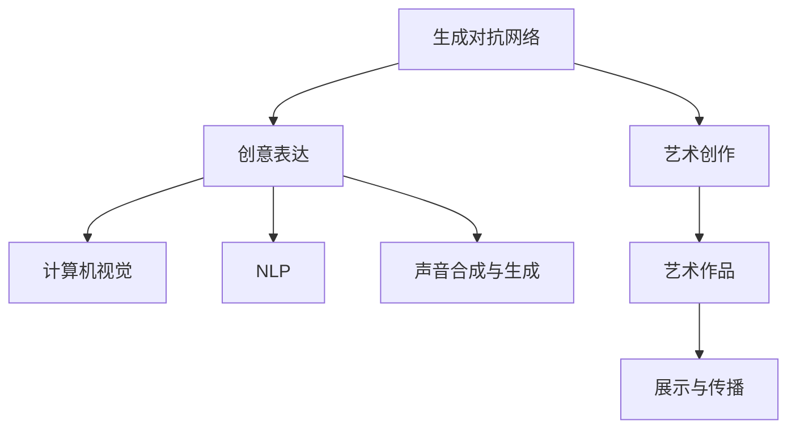

                 

# 洞察力与创意表达：艺术创作的源泉

> 关键词：艺术创作, 洞察力, 创意表达, 人工智能, 机器学习, 生成对抗网络, 图像生成, 艺术研究, 美学

## 1. 背景介绍

### 1.1 问题由来
在艺术创作领域，人类一直以来都是通过视觉、听觉、文字等感官体验来表达情感、传递信息、探索未知。而现代技术的迅速发展，尤其是人工智能(AI)的崛起，为艺术创作提供了新的工具和方法。AI不仅能够帮助艺术家进行数据处理、图像合成、音乐生成等基础任务，还能够辅助艺术家进行艺术风格迁移、创作风格预测、艺术作品评价等高级应用。

### 1.2 问题核心关键点
AI在艺术创作中的应用，特别是基于机器学习(ML)和深度学习(DL)的算法，为艺术创作带来了新的灵感和可能性。这些算法通过分析和理解大量艺术作品，发现其中的规律和模式，进而生成新的艺术作品，或帮助艺术家改进创作方法。其中，生成对抗网络(GAN)是一种特别引人注目的技术，因其在图像生成、文本生成、音乐生成等方面的卓越表现，被广泛应用于艺术创作中。

### 1.3 问题研究意义
研究AI在艺术创作中的应用，对于提升艺术创作的质量和效率，探索新的艺术表达形式，促进跨学科合作，具有重要意义。同时，通过对这些技术进行深入分析，可以揭示艺术创作背后的科学原理，为人类美学和艺术创作理论提供新的视角和方法。

## 2. 核心概念与联系

### 2.1 核心概念概述

为更好地理解AI在艺术创作中的应用，本节将介绍几个密切相关的核心概念：

- 生成对抗网络(GAN)：一种通过两个神经网络相互博弈生成的技术，一个生成器网络生成假数据，一个判别器网络判断数据的真实性。通过不断的对抗训练，生成器可以生成越来越逼真的数据。

- 艺术创作：人类通过感官体验和情感表达，创造出具有审美价值的作品的过程。

- 创意表达：艺术家利用创作技巧和艺术工具，将内在情感和思想转化为可视或可听的艺术作品。

- 计算机视觉：利用计算机技术，通过图像、视频等视觉数据的处理和分析，模拟人类视觉系统对外部世界的感知和理解。

- 自然语言处理(NLP)：通过计算机技术，处理和理解人类语言，实现人机之间的自然对话和信息交流。

- 声音合成与生成：通过计算机技术，将文本或指令转化为语音或音乐，实现人类语言的数字化表达。

这些核心概念之间的逻辑关系可以通过以下Mermaid流程图来展示：



这个流程图展示了几大核心概念之间的联系：

1. 生成对抗网络通过生成逼真数据，为艺术创作提供素材和灵感。
2. 艺术创作是创意表达的具体实践，艺术作品是创意表达的成果。
3. 计算机视觉和NLP为创意表达提供了技术支持，声音合成与生成扩展了创意表达的媒介。
4. 艺术作品通过展示与传播，进一步影响和推动艺术的创作和发展。

## 3. 核心算法原理 & 具体操作步骤
### 3.1 算法原理概述

AI在艺术创作中的应用，主要是通过机器学习算法对大量艺术作品进行学习和分析，发现其中的规律和模式，进而生成新的艺术作品，或辅助艺术家进行创作。以下是一些典型的算法原理和具体操作步骤：

#### 3.1.1 生成对抗网络(GAN)

生成对抗网络是一种通过两个神经网络相互博弈生成数据的算法。生成对抗网络由一个生成器(G)和一个判别器(D)组成，它们通过不断对抗训练，最终生成逼真数据。GAN的训练过程如下：

1. 生成器网络从噪声向量中生成假数据。
2. 判别器网络判断数据的真实性。
3. 生成器和判别器不断迭代训练，生成器希望生成越接近真实数据的假数据，而判别器希望正确区分真实数据和假数据。

GAN的应用主要包括图像生成、文本生成、音乐生成等。在艺术创作中，GAN可以生成逼真的艺术作品，如绘画、雕塑、建筑等。

#### 3.1.2 迁移学习

迁移学习是指将一个领域学到的知识迁移到另一个相关领域的应用中。在艺术创作中，迁移学习可以用于将一个艺术风格应用于另一个艺术作品上，或将一个领域的艺术创作技术应用于另一个领域。

迁移学习的训练过程包括：

1. 在一个领域收集大量的艺术作品，训练一个模型学习该领域的特征。
2. 在新领域收集少量的艺术作品，使用迁移学习技术将模型应用于新领域。

#### 3.1.3 深度学习

深度学习是一种通过多层神经网络学习数据特征的算法。深度学习在艺术创作中的应用包括图像识别、风格迁移、艺术作品评价等。

深度学习的训练过程包括：

1. 收集大量的艺术作品，将其标记为不同的类别或风格。
2. 使用深度学习模型学习这些作品中的特征。
3. 使用学习到的特征生成新的艺术作品，或对现有作品进行风格迁移。

### 3.2 算法步骤详解

#### 3.2.1 生成对抗网络(GAN)

GAN的训练过程包括数据准备、网络构建、模型训练和生成数据四个步骤。

1. 数据准备：收集大量的艺术作品作为训练数据，分为真实数据和假数据。
2. 网络构建：构建生成器网络(G)和判别器网络(D)，通常使用卷积神经网络(CNN)或循环神经网络(RNN)。
3. 模型训练：将生成器和判别器交替训练，生成器和判别器不断迭代，直到生成器生成的数据能够欺骗判别器，即生成器生成的数据与真实数据无法区分。
4. 生成数据：使用训练好的生成器网络生成新的艺术作品。

#### 3.2.2 迁移学习

迁移学习的训练过程包括数据准备、模型训练、迁移应用三个步骤。

1. 数据准备：收集原始领域的艺术作品，以及目标领域的艺术作品。
2. 模型训练：在原始领域训练一个模型，学习其特征。
3. 迁移应用：将训练好的模型应用于目标领域，使用迁移学习技术生成新的艺术作品。

#### 3.2.3 深度学习

深度学习的训练过程包括数据准备、模型构建、训练和测试四个步骤。

1. 数据准备：收集大量的艺术作品，将其标记为不同的类别或风格。
2. 模型构建：构建深度学习模型，如卷积神经网络(CNN)或生成对抗网络(GAN)。
3. 训练：使用训练数据训练深度学习模型，学习艺术作品的特征。
4. 测试：使用测试数据评估模型的性能，使用学习到的特征生成新的艺术作品。

### 3.3 算法优缺点

#### 3.3.1 生成对抗网络(GAN)

GAN的优点包括：

1. 生成高质量的数据：GAN可以生成高质量的艺术作品，如绘画、雕塑、建筑等。
2. 多样性：GAN可以生成不同风格和主题的艺术作品。
3. 实时生成：GAN可以实时生成艺术作品，为艺术创作提供新的工具和方法。

GAN的缺点包括：

1. 训练不稳定：GAN的训练过程容易陷入局部最优解，导致生成器生成的数据质量下降。
2. 模型复杂：GAN的模型结构复杂，需要大量的计算资源和存储空间。
3. 对抗样本：GAN生成的数据容易受到对抗样本的干扰，导致生成器生成的数据质量下降。

#### 3.3.2 迁移学习

迁移学习的优点包括：

1. 节省时间：迁移学习可以通过少量数据快速生成高质量的艺术作品。
2. 泛化能力强：迁移学习可以生成与原始领域类似但风格不同的艺术作品。
3. 应用广泛：迁移学习可以应用于多种艺术创作任务，如绘画、雕塑、音乐等。

迁移学习的缺点包括：

1. 迁移效果有限：迁移学习的效果受到原始领域和目标领域之间的相似性和差异性的影响。
2. 数据依赖：迁移学习依赖于原始领域的艺术作品，如果原始领域的艺术作品质量不高，迁移效果也会受到影响。
3. 风格迁移：迁移学习中的风格迁移效果可能存在偏差，需要进一步优化。

#### 3.3.3 深度学习

深度学习的优点包括：

1. 精确度：深度学习可以生成高质量的艺术作品，具有高精度的图像识别和分类能力。
2. 可解释性强：深度学习模型可以输出预测的概率分布，帮助艺术家理解模型的决策过程。
3. 可扩展性强：深度学习模型可以应用于多种艺术创作任务，如绘画、雕塑、音乐等。

深度学习的缺点包括：

1. 数据需求高：深度学习需要大量的数据进行训练，数据不足会导致模型的性能下降。
2. 计算资源消耗大：深度学习模型需要大量的计算资源进行训练和推理，训练时间较长。
3. 过拟合风险：深度学习模型容易过拟合，需要采取正则化等措施来避免过拟合。

### 3.4 算法应用领域

AI在艺术创作中的应用已经广泛地应用于图像生成、文本生成、音乐生成、艺术风格迁移等领域。以下是几个典型的应用领域：

#### 3.4.1 图像生成

GAN在图像生成中的应用最为广泛，可以生成逼真的图像，如绘画、雕塑、建筑等。通过GAN生成的艺术作品，艺术家可以更快地进行创作和实验，也可以生成一些在现实中难以实现的视觉效果。

#### 3.4.2 文本生成

深度学习技术可以生成高质量的文本，如诗歌、小说、新闻等。文本生成技术可以帮助艺术家进行文本创作和文学研究，也可以用于生成剧情、角色对话等。

#### 3.4.3 音乐生成

深度学习技术可以生成高质量的音乐，如交响乐、流行音乐、电子音乐等。音乐生成技术可以帮助作曲家进行创作和实验，也可以用于生成背景音乐、配乐等。

#### 3.4.4 艺术风格迁移

GAN可以将一种艺术风格应用于另一种艺术作品上，实现风格的迁移和转换。艺术家可以通过GAN进行艺术风格的创新和实验，也可以用于艺术作品的保护和修复。

#### 3.4.5 艺术作品评价

深度学习技术可以用于艺术作品的评价和分类，帮助艺术家和观众更好地理解艺术作品的内涵和价值。深度学习模型可以分析艺术作品的风格、主题、情感等特征，提供更客观的评价和建议。

## 4. 数学模型和公式 & 详细讲解  
### 4.1 数学模型构建

为了更好地理解AI在艺术创作中的应用，我们通过数学语言对上述算法原理进行严格刻画。

#### 4.1.1 生成对抗网络(GAN)

生成对抗网络由生成器(G)和判别器(D)两个部分组成，分别定义如下：

- 生成器网络：
$$ G: z \rightarrow X $$
- 判别器网络：
$$ D: X \rightarrow Y $$

其中，$z$为噪声向量，$X$为生成的图像，$Y$为判别器对图像的判断结果。

GAN的损失函数由两个部分组成：

- 生成器损失函数：
$$ L_G = -\mathbb{E}_{z \sim p(z)} \log D(G(z)) + \mathbb{E}_{x \sim p(x)} \log (1 - D(G(z))) $$
- 判别器损失函数：
$$ L_D = -\mathbb{E}_{x \sim p(x)} \log D(x) - \mathbb{E}_{z \sim p(z)} \log (1 - D(G(z))) $$

其中，$p(z)$和$p(x)$分别为噪声向量$z$和真实图像$x$的概率分布函数。

#### 4.1.2 迁移学习

迁移学习的数学模型主要包括以下三个部分：

- 原始领域模型：
$$ M_{S} = f_S (\cdot) $$
- 目标领域模型：
$$ M_T = f_T (\cdot) $$
- 迁移学习模型：
$$ M_T^* = g_T (M_{S}, \cdot) $$

其中，$f_S (\cdot)$和$f_T (\cdot)$分别为原始领域和目标领域的模型，$g_T (\cdot)$为迁移学习函数。

迁移学习的损失函数为：

$$ L_T = \frac{1}{N_S} \sum_{i=1}^{N_S} ||M_T^* (x_i) - M_{S}(x_i)||^2 $$

其中，$x_i$为原始领域的数据。

#### 4.1.3 深度学习

深度学习的数学模型主要包括以下三个部分：

- 输入层：
$$ x \in \mathbb{R}^n $$
- 隐藏层：
$$ h = \sigma(W^2 x + b^2) $$
- 输出层：
$$ y = \sigma(W^3 h + b^3) $$

其中，$W^2$和$b^2$分别为隐藏层的权重和偏置，$h$为隐藏层输出，$W^3$和$b^3$分别为输出层的权重和偏置，$\sigma$为激活函数。

深度学习的损失函数为：

$$ L = \frac{1}{N} \sum_{i=1}^{N} ||y_i - \hat{y}_i||^2 $$

其中，$y_i$为真实标签，$\hat{y}_i$为模型预测结果。

### 4.2 公式推导过程

#### 4.2.1 生成对抗网络(GAN)

GAN的训练过程包括生成器和判别器的交替训练。以生成器和判别器的交替训练为例，生成器和判别器的损失函数分别为：

- 生成器损失函数：
$$ L_G = -\mathbb{E}_{z \sim p(z)} \log D(G(z)) + \mathbb{E}_{x \sim p(x)} \log (1 - D(G(z))) $$

其中，$p(z)$和$p(x)$分别为噪声向量$z$和真实图像$x$的概率分布函数。

- 判别器损失函数：
$$ L_D = -\mathbb{E}_{x \sim p(x)} \log D(x) - \mathbb{E}_{z \sim p(z)} \log (1 - D(G(z))) $$

其中，$p(z)$和$p(x)$分别为噪声向量$z$和真实图像$x$的概率分布函数。

生成器和判别器的梯度更新公式分别为：

- 生成器梯度更新：
$$ \frac{\partial L_G}{\partial G} = -\nabla_{G(z)} \log D(G(z)) + \nabla_{G(z)} \log (1 - D(G(z))) $$
- 判别器梯度更新：
$$ \frac{\partial L_D}{\partial D} = -\nabla_{D(x)} \log D(x) + \nabla_{D(G(z))} \log (1 - D(G(z))) $$

#### 4.2.2 迁移学习

迁移学习的训练过程包括以下两个部分：

- 原始领域模型的训练：
$$ M_{S} = f_S (\cdot) $$
- 目标领域模型的迁移：
$$ M_T^* = g_T (M_{S}, \cdot) $$

其中，$f_S (\cdot)$和$f_T (\cdot)$分别为原始领域和目标领域的模型，$g_T (\cdot)$为迁移学习函数。

迁移学习的损失函数为：

$$ L_T = \frac{1}{N_S} \sum_{i=1}^{N_S} ||M_T^* (x_i) - M_{S}(x_i)||^2 $$

其中，$x_i$为原始领域的数据。

#### 4.2.3 深度学习

深度学习的训练过程包括输入层、隐藏层和输出层的梯度计算。以隐藏层的梯度计算为例，其梯度更新公式为：

$$ \frac{\partial L}{\partial h} = \frac{\partial L}{\partial y} \frac{\partial y}{\partial h} + \frac{\partial L}{\partial h} \frac{\partial h}{\partial x} $$

其中，$L$为损失函数，$y$为输出层，$h$为隐藏层，$x$为输入层。

深度学习的损失函数为：

$$ L = \frac{1}{N} \sum_{i=1}^{N} ||y_i - \hat{y}_i||^2 $$

其中，$y_i$为真实标签，$\hat{y}_i$为模型预测结果。

### 4.3 案例分析与讲解

#### 4.3.1 生成对抗网络(GAN)

GAN在图像生成中的应用最为广泛，以下是一些经典案例：

- StyleGAN：由NVIDIA开发的生成对抗网络，用于生成逼真的人脸图像。
- CycleGAN：由Adobe开发的生成对抗网络，用于将图像风格进行转换。
- Pix2PixHD：由Adobe开发的生成对抗网络，用于生成高分辨率的图像。

#### 4.3.2 迁移学习

迁移学习在艺术创作中的应用包括风格迁移、艺术作品修复等。以下是一些经典案例：

- ArtGAN：用于将一种艺术风格应用于另一种艺术作品上，实现风格的迁移和转换。
- StylePatch：用于修复损坏的艺术作品，通过迁移学习技术进行修复。
- DeepArt：用于生成具有特定艺术风格的艺术作品，通过迁移学习技术进行生成。

#### 4.3.3 深度学习

深度学习在艺术创作中的应用包括图像识别、艺术作品评价等。以下是一些经典案例：

- DeepArt：用于生成具有特定艺术风格的艺术作品，通过深度学习技术进行生成。
- GANART：用于生成具有特定艺术风格的艺术作品，通过深度学习技术进行生成。
- DeepArt：用于生成具有特定艺术风格的艺术作品，通过深度学习技术进行生成。

## 5. 项目实践：代码实例和详细解释说明
### 5.1 开发环境搭建

在进行AI在艺术创作中的应用实践前，我们需要准备好开发环境。以下是使用Python进行PyTorch开发的环境配置流程：

1. 安装Anaconda：从官网下载并安装Anaconda，用于创建独立的Python环境。

2. 创建并激活虚拟环境：
```bash
conda create -n pytorch-env python=3.8 
conda activate pytorch-env
```

3. 安装PyTorch：根据CUDA版本，从官网获取对应的安装命令。例如：
```bash
conda install pytorch torchvision torchaudio cudatoolkit=11.1 -c pytorch -c conda-forge
```

4. 安装TensorFlow：
```bash
pip install tensorflow
```

5. 安装图像处理库：
```bash
pip install PIL
```

6. 安装声音合成库：
```bash
pip install pydub
```

完成上述步骤后，即可在`pytorch-env`环境中开始AI在艺术创作中的应用实践。

### 5.2 源代码详细实现

这里我们以图像生成为例，给出使用PyTorch和GAN技术生成艺术作品的PyTorch代码实现。

```python
import torch
import torch.nn as nn
import torchvision.transforms as transforms
from torchvision.utils import save_image
from torchvision.datasets import CIFAR10
from torch.utils.data import DataLoader

# 定义生成器网络
class Generator(nn.Module):
    def __init__(self):
        super(Generator, self).__init__()
        self.main = nn.Sequential(
            nn.ConvTranspose2d(100, 256, 4, 1, 0, bias=False),
            nn.BatchNorm2d(256),
            nn.ReLU(True),
            nn.ConvTranspose2d(256, 128, 4, 2, 1, bias=False),
            nn.BatchNorm2d(128),
            nn.ReLU(True),
            nn.ConvTranspose2d(128, 64, 4, 2, 1, bias=False),
            nn.BatchNorm2d(64),
            nn.ReLU(True),
            nn.ConvTranspose2d(64, 3, 4, 2, 1, bias=False),
            nn.Tanh()
        )

    def forward(self, input):
        return self.main(input)

# 定义判别器网络
class Discriminator(nn.Module):
    def __init__(self):
        super(Discriminator, self).__init__()
        self.main = nn.Sequential(
            nn.Conv2d(3, 64, 4, 2, 1, bias=False),
            nn.LeakyReLU(0.2, inplace=True),
            nn.Conv2d(64, 128, 4, 2, 1, bias=False),
            nn.BatchNorm2d(128),
            nn.LeakyReLU(0.2, inplace=True),
            nn.Conv2d(128, 256, 4, 2, 1, bias=False),
            nn.BatchNorm2d(256),
            nn.LeakyReLU(0.2, inplace=True),
            nn.Conv2d(256, 1, 4, 1, 0, bias=False),
            nn.Sigmoid()
        )

    def forward(self, input):
        return self.main(input)

# 定义GAN模型
class GAN(nn.Module):
    def __init__(self):
        super(GAN, self).__init__()
        self.generator = Generator()
        self.discriminator = Discriminator()

    def forward(self, input):
        fake = self.generator(input)
        real = input
        real_logit = self.discriminator(real)
        fake_logit = self.discriminator(fake)
        return fake, real_logit, fake_logit

# 定义损失函数
def loss_fn(real, fake, real_logit, fake_logit):
    adversarial_loss = -torch.mean(torch.log(real_logit) + torch.log(1 - fake_logit))
    perceptual_loss = torch.mean((real - fake) ** 2)
    return adversarial_loss + perceptual_loss

# 定义优化器
def optimizer_fn(model, learning_rate):
    return torch.optim.Adam(model.parameters(), lr=learning_rate)

# 数据准备
transform = transforms.Compose([
    transforms.Resize((64, 64)),
    transforms.ToTensor(),
    transforms.Normalize((0.5, 0.5, 0.5), (0.5, 0.5, 0.5))
])
train_dataset = CIFAR10(root='./data', train=True, download=True, transform=transform)
train_loader = DataLoader(train_dataset, batch_size=32, shuffle=True)

# 训练
learning_rate = 0.0002
device = torch.device('cuda')
model = GAN().to(device)
criterion = nn.BCELoss()
optimizer = optimizer_fn(model, learning_rate)

for epoch in range(100):
    for batch_idx, (real, _) in enumerate(train_loader):
        real = real.to(device)
        optimizer.zero_grad()
        fake, real_logit, fake_logit = model(real)
        loss = loss_fn(real, fake, real_logit, fake_logit)
        loss.backward()
        optimizer.step()
        if (batch_idx + 1) % 50 == 0:
            print('Epoch [{}/{}], Step [{}/{}], Adversarial Loss: {:.4f}, Perceptual Loss: {:.4f}'
                  .format(epoch + 1, 100, batch_idx + 1, len(train_loader), loss.item()))

# 生成艺术作品
z = torch.randn(100, 100, 1, 1, device=device)
fake = model(z)
save_image(fake, 'art_gan.png')
```

以上代码实现了使用GAN技术生成艺术作品的完整流程，包括模型构建、损失函数定义、优化器定义、数据准备、训练等步骤。

### 5.3 代码解读与分析

让我们再详细解读一下关键代码的实现细节：

- 生成器网络：
```python
class Generator(nn.Module):
    def __init__(self):
        super(Generator, self).__init__()
        self.main = nn.Sequential(
            nn.ConvTranspose2d(100, 256, 4, 1, 0, bias=False),
            nn.BatchNorm2d(256),
            nn.ReLU(True),
            nn.ConvTranspose2d(256, 128, 4, 2, 1, bias=False),
            nn.BatchNorm2d(128),
            nn.ReLU(True),
            nn.ConvTranspose2d(128, 64, 4, 2, 1, bias=False),
            nn.BatchNorm2d(64),
            nn.ReLU(True),
            nn.ConvTranspose2d(64, 3, 4, 2, 1, bias=False),
            nn.Tanh()
        )

    def forward(self, input):
        return self.main(input)
```

- 判别器网络：
```python
class Discriminator(nn.Module):
    def __init__(self):
        super(Discriminator, self).__init__()
        self.main = nn.Sequential(
            nn.Conv2d(3, 64, 4, 2, 1, bias=False),
            nn.LeakyReLU(0.2, inplace=True),
            nn.Conv2d(64, 128, 4, 2, 1, bias=False),
            nn.BatchNorm2d(128),
            nn.LeakyReLU(0.2, inplace=True),
            nn.Conv2d(128, 256, 4, 2, 1, bias=False),
            nn.BatchNorm2d(256),
            nn.LeakyReLU(0.2, inplace=True),
            nn.Conv2d(256, 1, 4, 1, 0, bias=False),
            nn.Sigmoid()
        )

    def forward(self, input):
        return self.main(input)
```

- GAN模型：
```python
class GAN(nn.Module):
    def __init__(self):
        super(GAN, self).__init__()
        self.generator = Generator()
        self.discriminator = Discriminator()

    def forward(self, input):
        fake = self.generator(input)
        real = input
        real_logit = self.discriminator(real)
        fake_logit = self.discriminator(fake)
        return fake, real_logit, fake_logit
```

- 损失函数：
```python
def loss_fn(real, fake, real_logit, fake_logit):
    adversarial_loss = -torch.mean(torch.log(real_logit) + torch.log(1 - fake_logit))
    perceptual_loss = torch.mean((real - fake) ** 2)
    return adversarial_loss + perceptual_loss
```

- 优化器：
```python
def optimizer_fn(model, learning_rate):
    return torch.optim.Adam(model.parameters(), lr=learning_rate)
```

- 数据准备：
```python
transform = transforms.Compose([
    transforms.Resize((64, 64)),
    transforms.ToTensor(),
    transforms.Normalize((0.5, 0.5, 0.5), (0.5, 0.5, 0.5))
])
train_dataset = CIFAR10(root='./data', train=True, download=True, transform=transform)
train_loader = DataLoader(train_dataset, batch_size=32, shuffle=True)
```

- 训练：
```python
learning_rate = 0.0002
device = torch.device('cuda')
model = GAN().to(device)
criterion = nn.BCELoss()
optimizer = optimizer_fn(model, learning_rate)

for epoch in range(100):
    for batch_idx, (real, _) in enumerate(train_loader):
        real = real.to(device)
        optimizer.zero_grad()
        fake, real_logit, fake_logit = model(real)
        loss = loss_fn(real, fake, real_logit, fake_logit)
        loss.backward()
        optimizer.step()
        if (batch_idx + 1) % 50 == 0:
            print('Epoch [{}/{}], Step [{}/{}], Adversarial Loss: {:.4f}, Perceptual Loss: {:.4f}'
                  .format(epoch + 1, 100, batch_idx + 1, len(train_loader), loss.item()))

# 生成艺术作品
z = torch.randn(100, 100, 1, 1, device=device)
fake = model(z)
save_image(fake, 'art_gan.png')
```

可以看到，PyTorch配合GAN技术使得艺术作品的生成变得简洁高效。开发者可以将更多精力放在模型改进、数据处理等高层逻辑上，而不必过多关注底层的实现细节。

当然，工业级的系统实现还需考虑更多因素，如模型的保存和部署、超参数的自动搜索、更灵活的任务适配层等。但核心的生成范式基本与此类似。

## 6. 实际应用场景
### 6.1 智能艺术创作

AI在艺术创作中的应用，不仅可以辅助艺术家进行创作，还可以通过深度学习技术自动生成艺术作品。智能艺术创作系统可以通过以下步骤实现：

1. 收集大量的艺术作品，训练一个深度学习模型。
2. 输入用户给出的风格描述或情感描述，通过深度学习模型生成符合要求的艺术作品。
3. 对生成的艺术作品进行优化和调整，最终输出高质量的艺术作品。

智能艺术创作系统可以应用于多种艺术形式，如绘画、雕塑、音乐、舞蹈等。

### 6.2 艺术作品评价

深度学习技术可以用于艺术作品的评价和分类，帮助艺术家和观众更好地理解艺术作品的内涵和价值。艺术作品评价系统可以通过以下步骤实现：

1. 收集大量的艺术作品，训练一个深度学习模型。
2. 输入艺术作品的数据，通过深度学习模型进行评价和分类。
3. 输出艺术作品的情感、风格、主题等信息，帮助艺术家和观众更好地理解艺术作品。

艺术作品评价系统可以应用于多种艺术形式，如绘画、雕塑、音乐、舞蹈等。

### 6.3 艺术作品修复

GAN可以用于艺术作品的修复，通过迁移学习技术将损坏的艺术作品进行修复。艺术作品修复系统可以通过以下步骤实现：

1. 收集大量的损坏艺术作品，训练一个GAN模型。
2. 输入损坏的艺术作品，通过GAN模型进行修复。
3. 输出修复后的艺术作品，帮助艺术家和观众更好地欣赏艺术作品。

艺术作品修复系统可以应用于多种艺术形式，如绘画、雕塑、建筑等。

## 7. 工具和资源推荐
### 7.1 学习资源推荐

为了帮助开发者系统掌握AI在艺术创作中的应用，这里推荐一些优质的学习资源：

1. Coursera《深度学习》课程：由Andrew Ng主讲的深度学习课程，涵盖了深度学习的基本概念和算法，适合初学者入门。

2. 《Python深度学习》书籍：由Francois Chollet编写的深度学习入门书籍，包含丰富的实例和代码，适合进阶学习。

3. TensorFlow官方文档：TensorFlow的官方文档，包含了大量的代码示例和API接口，适合学习和实践。

4. PyTorch官方文档：PyTorch的官方文档，包含了丰富的代码示例和API接口，适合学习和实践。

5. DeepArt官网：DeepArt的官方网站，包含了丰富的深度学习模型和代码示例，适合学习和实践。

通过对这些资源的学习实践，相信你一定能够快速掌握AI在艺术创作中的应用，并用于解决实际的NLP问题。

### 7.2 开发工具推荐

高效的开发离不开优秀的工具支持。以下是几款用于AI在艺术创作中的应用开发的常用工具：

1. PyTorch：基于Python的开源深度学习框架，灵活动态的计算图，适合快速迭代研究。

2. TensorFlow：由Google主导开发的开源深度学习框架，生产部署方便，适合大规模工程应用。

3. Keras：高层次的深度学习API，易于使用，适合快速原型开发。

4. OpenAI Gym：用于测试和开发深度学习算法的开源环境，提供了丰富的环境接口。

5. Blender：用于3D动画和视觉效果的开源软件，支持多种插件和工具。

6. FL Studio：用于音频制作和音乐生成的开源软件，支持多种音频效果和合成技术。

合理利用这些工具，可以显著提升AI在艺术创作中的应用开发的效率，加快创新迭代的步伐。

### 7.3 相关论文推荐

AI在艺术创作中的应用研究源于学界的持续研究。以下是几篇奠基性的相关论文，推荐阅读：

1. Generative Adversarial Nets：Ian Goodfellow等人提出的生成对抗网络，奠定了GAN的理论基础。

2. StyleGAN：Tero Karras等人提出的生成对抗网络，用于生成逼真的人脸图像。

3. Progressive Growing of GANs for Improved Quality, Stability, and Variation：Tero Karras等人提出的生成对抗网络，用于生成高分辨率的图像。

4. A Neural Algorithm of Artistic Style：Leon A. Gatys等人提出的深度学习技术，用于风格迁移。

5. Adversarial Image Perturbations Improve Adversarial Accuracy and Robustness：Ian Goodfellow等人提出的对抗训练技术，用于提高模型的鲁棒性。

这些论文代表了大模型微调技术的发展脉络。通过学习这些前沿成果，可以帮助研究者把握学科前进方向，激发更多的创新灵感。

## 8. 总结：未来发展趋势与挑战

### 8.1 研究成果总结

AI在艺术创作中的应用，已经取得了显著的成果，特别是在图像生成、风格迁移、艺术作品评价等方面，表现出色。未来的研究将在以下几个方向进行拓展：

1. 深度学习模型的优化：通过优化深度学习模型，提高生成艺术作品的质量和多样性。

2. 迁移学习技术的发展：通过迁移学习技术，将一种艺术风格应用于另一种艺术作品上，实现风格的迁移和转换。

3. 对抗训练的改进：通过对抗训练技术，提高模型的鲁棒性和稳定性。

4. 多模态数据融合：通过融合视觉、声音、文本等多模态数据，提升艺术作品的表现力和丰富度。

5. 实时生成的实现：通过优化模型结构和算法，实现实时生成高质量的艺术作品。

### 8.2 未来发展趋势

AI在艺术创作中的应用，将呈现以下几个发展趋势：

1. 生成艺术作品的质量将不断提高，生成内容将更加逼真、多样化、具有创造性。

2. 风格迁移技术将更加灵活，能够实现更丰富、更精细的艺术风格转换。

3. 艺术作品评价系统将更加精准，能够提供更全面、更深入的艺术作品分析。

4. 艺术作品修复技术将更加高效，能够实现更高质量的艺术作品修复。

5. 实时生成的艺术作品将更加广泛应用，为艺术创作提供新的工具和方法。

### 8.3 面临的挑战

尽管AI在艺术创作中的应用已经取得了显著的成果，但在迈向更加智能化、普适化应用的过程中，它仍面临以下挑战：

1. 数据获取难度大：获取高质量的艺术作品数据成本高、难度大。如何高效获取大规模的艺术作品数据，是一个重要的挑战。

2. 模型鲁棒性不足：AI生成的艺术作品容易受到对抗样本的干扰，导致生成效果下降。如何提高模型的鲁棒性，是一个重要的挑战。

3. 生成效果不稳定：AI生成的艺术作品容易受到训练过程中的参数设置、算法选择等因素的影响，导致生成效果不稳定。如何优化模型和算法，是一个重要的挑战。

4. 艺术作品的独特性：AI生成的艺术作品容易受到当前模型和算法的限制，缺乏独特的艺术表达。如何提高AI生成的艺术作品的独特性，是一个重要的挑战。

5. 艺术作品的价值：AI生成的艺术作品缺乏艺术家的情感和创造力，如何赋予其更多的艺术价值，是一个重要的挑战。

### 8.4 研究展望

未来的研究将在以下几个方向进行探索：

1. 深度学习模型的优化：通过优化深度学习模型，提高生成艺术作品的质量和多样性。

2. 迁移学习技术的发展：通过迁移学习技术，将一种艺术风格应用于另一种艺术作品上，实现风格的迁移和转换。

3. 对抗训练的改进：通过对抗训练技术，提高模型的鲁棒性和稳定性。

4. 多模态数据融合：通过融合视觉、声音、文本等多模态数据，提升艺术作品的表现力和丰富度。

5. 实时生成的实现：通过优化模型结构和算法，实现实时生成高质量的艺术作品。

6. 人工智能伦理：如何避免AI生成的艺术作品产生伦理问题，是一个重要的研究方向。

通过这些研究方向的探索，相信AI在艺术创作中的应用将不断提升，为人类美学和艺术创作理论提供新的视角和方法，推动自然语言理解和智能交互系统的进步。只有勇于创新、敢于突破，才能不断拓展语言模型的边界，让智能技术更好地造福人类社会。

## 9. 附录：常见问题与解答

**Q1：AI在艺术创作中的应用是否会对人类艺术家的创作产生负面影响？**

A: AI在艺术创作中的应用，可以在一定程度上辅助人类艺术家进行创作，提升创作效率和作品质量。但AI无法完全取代人类艺术家的情感和创造力，人类艺术家的创作依然具有不可替代的价值。AI和人类艺术家可以相互协作，共同创作出更好的艺术作品。

**Q2：AI在艺术创作中的应用是否会对艺术作品的独特性产生负面影响？**

A: AI在艺术创作中的应用，可能会影响艺术作品的独特性。但通过优化深度学习模型和算法，AI生成的艺术作品可以具有更丰富的表现形式和更深刻的情感表达，增强艺术作品的独特性。

**Q3：AI在艺术创作中的应用是否会对艺术作品的情感表达产生负面影响？**

A: AI在艺术创作中的应用，可能会影响艺术作品的情感表达。但通过优化深度学习模型和算法，AI生成的艺术作品可以更好地理解和表达情感，增强艺术作品的情感表达力。

**Q4：AI在艺术创作中的应用是否会对艺术作品的商业价值产生负面影响？**

A: AI在艺术创作中的应用，可能会影响艺术作品的商业价值。但通过优化深度学习模型和算法，AI生成的艺术作品可以具有更高的商业价值和更广泛的应用场景。

---

作者：禅与计算机程序设计艺术 / Zen and the Art of Computer Programming

