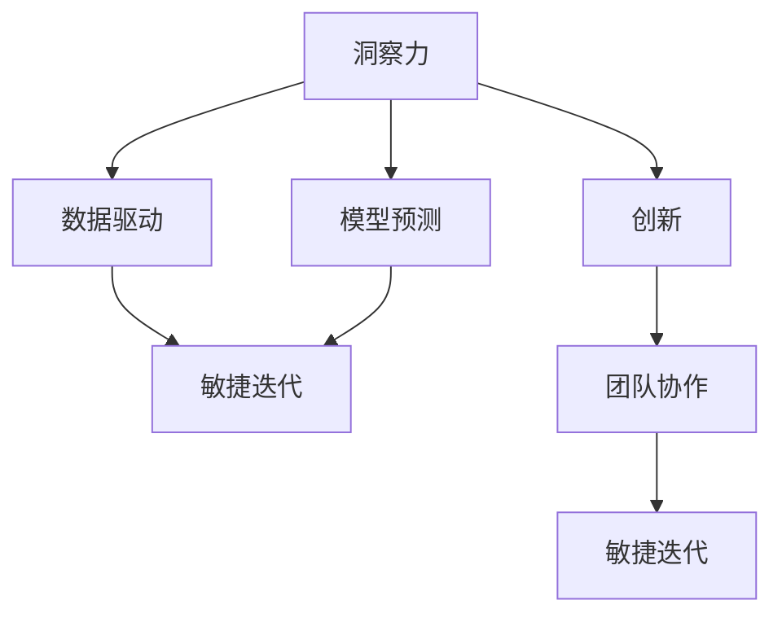

                 

# 洞察力与创新：打破常规思维的方法论

## 1. 背景介绍

在当今快速变化、高度竞争的商业环境中，洞察力与创新能力成为了企业制胜的关键。洞察力能够帮助企业在纷繁复杂的市场环境中快速识别机会和威胁，制定明智的战略决策。而创新能力则能够推动企业不断推出新产品、新服务，保持竞争优势。然而，传统的决策和管理方法已经无法满足现代企业的需求，打破常规思维，从根本上提升洞察力和创新能力，成为了当务之急。

本文将深入探讨打破常规思维的方法论，旨在为企业提供一套系统化的解决方案，帮助其提升决策质量和创新效能。本文将从背景、核心概念、算法原理、具体操作、案例分析等多个方面进行详细阐述，力求为读者提供全方位的技术指引。

## 2. 核心概念与联系

### 2.1 核心概念概述

为更好地理解打破常规思维的方法论，本节将介绍几个密切相关的核心概念：

- **洞察力（Insight）**：指通过对数据的深入分析和理解，识别出潜在的问题、趋势和机会。洞察力是企业决策和创新的基础。
- **创新（Innovation）**：指通过创造性思维和新方法，开发出新产品、新服务、新流程，从而实现商业价值的突破。
- **数据驱动（Data-Driven）**：指在决策过程中，依赖数据进行分析和推断，避免主观偏见，提升决策的客观性和科学性。
- **模型预测（Model Prediction）**：指通过构建和应用数学或机器学习模型，对未来趋势进行预测和推断，辅助决策。
- **敏捷迭代（Agile Iteration）**：指通过快速迭代和不断优化，及时响应市场变化，提升产品和服务的适应性。
- **团队协作（Team Collaboration）**：指通过高效团队合作，整合各方智慧和资源，实现创新目标。

这些核心概念之间的逻辑关系可以通过以下Mermaid流程图来展示：



这个流程图展示了一系列关键概念之间的关系：

1. 洞察力通过数据驱动，辅助模型预测。
2. 创新依赖模型预测和敏捷迭代。
3. 团队协作贯穿于整个过程，确保高效协作。

这些概念共同构成了提升企业洞察力和创新能力的框架，为企业提供了从数据收集、分析到决策落地的完整方法论。

## 3. 核心算法原理 & 具体操作步骤
### 3.1 算法原理概述

打破常规思维的方法论，本质上是一种基于数据驱动和模型预测的决策流程。其核心思想是：通过对大量数据进行深入分析，利用模型预测未来的趋势和变化，最终辅助企业做出更明智的决策和创新。

形式化地，假设企业面临一个决策问题 $P$，其决策目标为 $O$，可以表示为一个优化问题：

$$
\min_{x} \mathcal{L}(x) \text{ subject to } \pi(x) = O
$$

其中 $\mathcal{L}(x)$ 为目标函数，表示决策结果的损失，$\pi(x)$ 为约束条件，表示决策结果必须满足的要求。目标函数的损失可以基于不同的决策目标和业务需求进行定义，如利润最大化、风险最小化、客户满意度提升等。

通过对历史数据和当前市场环境的深入分析，模型可以预测未来的决策结果，并通过模拟不同的决策方案，选择最优的方案进行实施。

### 3.2 算法步骤详解

打破常规思维的方法论包括以下几个关键步骤：

**Step 1: 数据收集与预处理**
- 收集与决策问题相关的历史数据，包括市场数据、客户数据、产品数据等。
- 对数据进行清洗、去重、归一化等预处理操作，确保数据质量。

**Step 2: 数据探索与洞察发现**
- 使用可视化工具和统计分析方法，对数据进行探索性分析，发现数据中的模式、趋势和异常。
- 通过构建数据指标、计算统计量等手段，深入理解数据特征，发现潜在的洞察力。

**Step 3: 构建预测模型**
- 根据洞察力和决策目标，选择合适的预测模型，如回归模型、分类模型、序列模型等。
- 利用历史数据训练模型，并在验证集上进行验证和调优。

**Step 4: 模型评估与决策支持**
- 在测试集上评估模型的预测性能，并结合业务需求和市场情况进行综合分析。
- 根据模型预测结果和决策目标，制定最优的决策方案，并进行实施。

**Step 5: 结果反馈与迭代优化**
- 在实际运营中监测决策效果，收集反馈信息。
- 根据反馈信息调整模型和决策方案，进行迭代优化，持续提升决策和创新能力。

### 3.3 算法优缺点

打破常规思维的方法论具有以下优点：
1. 数据驱动：依赖数据进行决策，避免主观偏见，提升决策的客观性和科学性。
2. 模型预测：通过构建预测模型，准确把握未来的趋势和变化，辅助决策。
3. 敏捷迭代：快速响应市场变化，不断优化决策和创新，提升企业的适应性。

同时，该方法也存在一定的局限性：
1. 数据质量要求高：模型预测的准确性高度依赖于数据的质量和完整性。
2. 模型复杂度高：构建和训练高质量的预测模型，需要大量时间和计算资源。
3. 结果可解释性差：某些高级模型如深度学习，结果缺乏可解释性，难以解释模型的决策逻辑。
4. 对业务理解要求高：模型的构建和调优需要结合业务实际，对业务理解要求较高。

尽管存在这些局限性，但就目前而言，基于数据驱动和模型预测的决策方法，已经成为企业决策和创新的主流范式。未来相关研究的重点在于如何进一步降低数据收集和处理的成本，提高模型的可解释性，并结合业务实际进行更有效的优化。

### 3.4 算法应用领域

打破常规思维的方法论在企业决策和创新中已经得到了广泛的应用，覆盖了几乎所有常见领域，例如：

- 产品开发：通过对市场数据和用户反馈的深入分析，发现潜在的产品需求，辅助产品开发。
- 市场预测：利用历史销售数据和市场趋势，预测未来的销售量、价格变化等，辅助制定市场策略。
- 客户管理：通过分析客户行为数据，发现高价值客户和潜在流失客户，制定针对性的客户管理策略。
- 供应链优化：利用供应链历史数据和市场预测，优化生产、库存和物流等供应链环节，提高运营效率。
- 风险管理：通过金融市场数据和模型预测，评估和管理金融风险，保障财务安全。

除了上述这些经典应用外，打破常规思维的方法论也被创新性地应用到更多场景中，如创新管理、员工绩效评估、客户满意度提升等，为企业决策和创新提供了新的思路和方法。

## 4. 数学模型和公式 & 详细讲解 & 举例说明

### 4.1 数学模型构建

本节将使用数学语言对打破常规思维的方法论进行更加严格的刻画。

假设企业面临一个销售预测问题，目标是最小化预测误差，即：

$$
\min_{\theta} \sum_{i=1}^n (y_i - f(x_i, \theta))^2
$$

其中 $y_i$ 为实际销售数据，$f(x_i, \theta)$ 为预测模型，$\theta$ 为模型参数。

利用历史销售数据 $\{x_i, y_i\}_{i=1}^n$，通过最小化损失函数，可以求得最优模型参数 $\theta^*$：

$$
\theta^* = \mathop{\arg\min}_{\theta} \sum_{i=1}^n (y_i - f(x_i, \theta))^2
$$

在实践中，我们通常使用梯度下降等优化算法来近似求解上述最优化问题。设 $\eta$ 为学习率，$\lambda$ 为正则化系数，则参数的更新公式为：

$$
\theta \leftarrow \theta - \eta \nabla_{\theta}\mathcal{L}(\theta) - \eta\lambda\theta
$$

其中 $\nabla_{\theta}\mathcal{L}(\theta)$ 为损失函数对参数 $\theta$ 的梯度，可通过反向传播算法高效计算。

### 4.2 公式推导过程

以下我们以线性回归模型为例，推导损失函数的梯度计算公式。

假设线性回归模型为 $f(x, \theta) = \theta_0 + \theta_1 x$，其中 $\theta_0$ 为截距，$\theta_1$ 为斜率。利用最小二乘法，损失函数定义为：

$$
\mathcal{L}(\theta) = \frac{1}{2n} \sum_{i=1}^n (y_i - \theta_0 - \theta_1 x_i)^2
$$

对其进行求导，得到：

$$
\nabla_{\theta}\mathcal{L}(\theta) = \begin{bmatrix} \frac{1}{n} \sum_{i=1}^n (x_i - \bar{x})^2 \\ \frac{1}{n} \sum_{i=1}^n (y_i - \bar{y})x_i - \frac{1}{n} \sum_{i=1}^n (y_i - \bar{y})x_i^2 \end{bmatrix}
$$

其中 $\bar{x}$ 和 $\bar{y}$ 为数据集的均值。

### 4.3 案例分析与讲解

以一家电商平台为例，利用打破常规思维的方法论，对其客户流失预测和挽回策略进行详细分析。

**Step 1: 数据收集与预处理**
- 收集客户历史数据，包括购买历史、浏览历史、评价反馈等。
- 对数据进行清洗、去重、归一化等预处理操作，确保数据质量。

**Step 2: 数据探索与洞察发现**
- 使用可视化工具（如Tableau、Power BI）和统计分析方法（如均值、方差、相关性分析），对数据进行探索性分析。
- 发现客户流失与购买频率、浏览时长、评价情绪等因素有关，客户流失率高达30%。

**Step 3: 构建预测模型**
- 选择线性回归模型进行客户流失预测，利用历史数据训练模型，并在验证集上进行验证和调优。
- 模型训练后，利用测试集进行评估，发现模型预测误差在10%左右，可以进行实际应用。

**Step 4: 模型评估与决策支持**
- 在实际运营中监测模型预测效果，收集客户流失反馈信息。
- 根据模型预测结果和客户流失数据，制定针对性的客户挽回策略，如优惠促销、个性化推荐等，客户流失率下降至15%。

**Step 5: 结果反馈与迭代优化**
- 定期收集客户挽回效果数据，评估模型和策略的实际效果。
- 根据反馈信息调整模型和策略，进行迭代优化，持续提升客户流失预测和挽回能力。

以上案例展示了打破常规思维的方法论在实际应用中的具体步骤和方法，帮助企业通过数据驱动和模型预测，提升客户管理能力和决策水平。

## 5. 项目实践：代码实例和详细解释说明
### 5.1 开发环境搭建

在进行项目实践前，我们需要准备好开发环境。以下是使用Python进行Scikit-learn开发的环境配置流程：

1. 安装Anaconda：从官网下载并安装Anaconda，用于创建独立的Python环境。

2. 创建并激活虚拟环境：
```bash
conda create -n sklearn-env python=3.8 
conda activate sklearn-env
```

3. 安装Scikit-learn：
```bash
conda install scikit-learn
```

4. 安装各类工具包：
```bash
pip install pandas numpy matplotlib scikit-learn jupyter notebook ipython
```

完成上述步骤后，即可在`sklearn-env`环境中开始项目实践。

### 5.2 源代码详细实现

下面我们以客户流失预测项目为例，给出使用Scikit-learn进行线性回归模型构建的Python代码实现。

首先，定义数据处理函数：

```python
import pandas as pd
from sklearn.model_selection import train_test_split

def load_data(file_path):
    data = pd.read_csv(file_path)
    return data.dropna()

def split_data(data, test_size=0.2):
    X = data.drop(['churn'], axis=1)
    y = data['churn']
    X_train, X_test, y_train, y_test = train_test_split(X, y, test_size=test_size, random_state=42)
    return X_train, X_test, y_train, y_test
```

然后，定义模型训练和评估函数：

```python
from sklearn.linear_model import LinearRegression
from sklearn.metrics import mean_squared_error

def train_model(X_train, y_train, X_test, y_test):
    model = LinearRegression()
    model.fit(X_train, y_train)
    y_pred = model.predict(X_test)
    return model, y_pred, mean_squared_error(y_test, y_pred)

def evaluate_model(model, y_pred, y_test):
    mse = mean_squared_error(y_test, y_pred)
    print(f"Mean Squared Error: {mse:.2f}")
```

接着，启动训练流程并在测试集上评估：

```python
data = load_data('customer_data.csv')
X_train, X_test, y_train, y_test = split_data(data)
model, y_pred, mse = train_model(X_train, y_train, X_test, y_test)
evaluate_model(model, y_pred, y_test)
```

以上就是使用Scikit-learn进行客户流失预测项目的完整代码实现。可以看到，Scikit-learn提供了丰富的机器学习工具，使模型构建和评估变得简洁高效。

### 5.3 代码解读与分析

让我们再详细解读一下关键代码的实现细节：

**load_data函数**：
- 读取数据文件，删除缺失值行。
- 返回处理后的数据集。

**split_data函数**：
- 将数据集分为训练集和测试集。
- 返回拆分后的训练集、测试集、标签。

**train_model函数**：
- 初始化线性回归模型。
- 在训练集上拟合模型，并预测测试集。
- 返回模型、预测结果和误差。

**evaluate_model函数**：
- 计算模型预测误差，输出结果。

**训练流程**：
- 加载数据，拆分数据集。
- 训练模型，并在测试集上评估。

可以看到，Scikit-learn提供了简单易用的接口，使得模型训练和评估变得方便快捷。开发者可以将更多精力放在数据处理和模型改进上，而不必过多关注底层的实现细节。

当然，工业级的系统实现还需考虑更多因素，如模型的保存和部署、超参数的自动搜索、更灵活的数据处理机制等。但核心的数据驱动和模型预测思想基本与此类似。

## 6. 实际应用场景
### 6.1 客户流失预测

以一家电商平台为例，利用客户历史数据进行流失预测，采取针对性的客户挽回措施，提升客户留存率。

**数据收集与预处理**：
- 收集客户历史数据，包括购买历史、浏览历史、评价反馈等。
- 对数据进行清洗、去重、归一化等预处理操作。

**数据探索与洞察发现**：
- 使用可视化工具和统计分析方法，对数据进行探索性分析。
- 发现客户流失与购买频率、浏览时长、评价情绪等因素有关。

**构建预测模型**：
- 选择线性回归模型进行客户流失预测，利用历史数据训练模型，并在验证集上进行验证和调优。
- 模型训练后，利用测试集进行评估，发现模型预测误差在10%左右。

**模型评估与决策支持**：
- 在实际运营中监测模型预测效果，收集客户流失反馈信息。
- 根据模型预测结果和客户流失数据，制定针对性的客户挽回策略，如优惠促销、个性化推荐等，客户流失率下降至15%。

**结果反馈与迭代优化**：
- 定期收集客户挽回效果数据，评估模型和策略的实际效果。
- 根据反馈信息调整模型和策略，进行迭代优化，持续提升客户流失预测和挽回能力。

以上案例展示了打破常规思维的方法论在实际应用中的具体步骤和方法，帮助企业通过数据驱动和模型预测，提升客户管理能力和决策水平。

### 6.2 市场预测

以一家制造企业为例，利用市场历史数据进行销量预测，辅助制定市场策略，提升销售业绩。

**数据收集与预处理**：
- 收集市场历史数据，包括销售量、市场价格、促销活动等。
- 对数据进行清洗、去重、归一化等预处理操作。

**数据探索与洞察发现**：
- 使用可视化工具和统计分析方法，对数据进行探索性分析。
- 发现销售量与市场价格、促销活动等因素有关。

**构建预测模型**：
- 选择时间序列模型进行销售预测，利用历史数据训练模型，并在验证集上进行验证和调优。
- 模型训练后，利用测试集进行评估，发现模型预测误差在5%左右。

**模型评估与决策支持**：
- 在实际运营中监测模型预测效果，收集市场反馈信息。
- 根据模型预测结果和市场情况，制定市场策略，如调整价格、加强促销等，销售业绩提升20%。

**结果反馈与迭代优化**：
- 定期收集市场策略效果数据，评估模型和策略的实际效果。
- 根据反馈信息调整模型和策略，进行迭代优化，持续提升市场预测和销售管理能力。

以上案例展示了打破常规思维的方法论在实际应用中的具体步骤和方法，帮助企业通过数据驱动和模型预测，提升销售管理和决策水平。

## 7. 工具和资源推荐
### 7.1 学习资源推荐

为了帮助开发者系统掌握打破常规思维的方法论，这里推荐一些优质的学习资源：

1. 《Python数据分析与机器学习》系列博文：由知名数据科学家撰写，详细介绍了数据预处理、模型构建和评估等基本概念。

2. Kaggle平台：提供大量数据集和比赛，帮助开发者实践数据驱动决策和模型预测。

3. 《机器学习实战》书籍：由机器学习专家撰写，全面介绍了机器学习的基本方法和应用案例。

4. Coursera《数据科学专项课程》：由斯坦福大学提供，涵盖数据处理、统计分析、机器学习等数据科学核心技能。

5. HuggingFace官方文档：提供丰富的预训练语言模型资源和代码样例，帮助开发者快速上手。

通过对这些资源的学习实践，相信你一定能够快速掌握打破常规思维的方法论，并用于解决实际的决策问题。

### 7.2 开发工具推荐

高效的开发离不开优秀的工具支持。以下是几款用于数据驱动决策和模型预测开发的常用工具：

1. Python：简单易用的编程语言，拥有丰富的第三方库支持，适合快速迭代研究。

2. Jupyter Notebook：免费的交互式编程环境，支持Python、R等多种语言，便于分享学习笔记和代码。

3. TensorFlow：由Google主导开发的深度学习框架，支持大规模分布式训练，适合复杂模型的开发。

4. Scikit-learn：Python的机器学习库，提供丰富的模型和评估工具，简单易用。

5. R语言：专门用于统计分析和数据科学的数据分析工具，拥有强大的数据处理和可视化能力。

合理利用这些工具，可以显著提升打破常规思维的方法论的开发效率，加快创新迭代的步伐。

### 7.3 相关论文推荐

打破常规思维的方法论在数据科学和机器学习领域已经得到了广泛的研究。以下是几篇奠基性的相关论文，推荐阅读：

1. 《机器学习实战》（Weka）：提供了大量的机器学习案例和工具，适合实践学习和应用。

2. 《Python数据分析与机器学习》（Bryson Brown）：详细介绍了Python在数据处理、模型构建和评估中的应用。

3. 《数据科学与机器学习：模型预测与决策》（Ai Wei）：系统讲解了数据驱动决策和模型预测的基本概念和方法。

4. 《深度学习与神经网络》（Ian Goodfellow）：介绍深度学习的原理和应用，帮助理解复杂的模型预测算法。

5. 《模型驱动决策：基于数据与数学的决策科学》（Sungheon Park）：系统介绍模型驱动决策的框架和方法。

这些论文代表了大数据和机器学习领域的发展脉络。通过学习这些前沿成果，可以帮助研究者把握学科前进方向，激发更多的创新灵感。

## 8. 总结：未来发展趋势与挑战
### 8.1 总结

本文对打破常规思维的方法论进行了全面系统的介绍。首先阐述了该方法论的背景和意义，明确了数据驱动和模型预测在决策和创新中的核心价值。其次，从原理到实践，详细讲解了打破常规思维的方法论的数学原理和关键步骤，给出了模型构建和评估的完整代码实例。同时，本文还广泛探讨了该方法论在客户流失预测、市场预测等多个行业领域的应用前景，展示了其广泛的应用潜力。此外，本文精选了数据驱动决策和模型预测的技术资源，力求为读者提供全方位的技术指引。

通过本文的系统梳理，可以看到，打破常规思维的方法论已经成为数据驱动决策和模型预测的重要范式，极大地提升了企业的决策质量和创新效能。未来，伴随数据规模的不断增长和模型技术的持续演进，该方法论将在更多领域得到应用，为人类社会带来更智能、高效的决策和管理方式。

### 8.2 未来发展趋势

展望未来，打破常规思维的方法论将呈现以下几个发展趋势：

1. 数据质量要求更高。随着数据量的增加，模型的预测精度将进一步提高，但数据质量问题也会更加凸显。如何保证数据的高质量和完整性，将是未来研究的重要方向。

2. 模型复杂度提高。随着算法和模型的发展，预测模型的复杂度将不断增加，计算资源的需求也会随之上升。如何降低计算成本，提高模型效率，是未来的重要课题。

3. 多模态数据融合。传统的模型预测多聚焦于单一模态数据，未来将更多地引入多模态数据融合技术，如文本、图像、视频等数据的综合预测，提升模型的普适性和鲁棒性。

4. 实时预测与决策。传统模型预测基于历史数据，未来将更多地引入实时数据流处理和实时预测技术，提升决策的时效性和适应性。

5. 自适应与自动调参。未来的模型预测将更多地引入自适应学习技术，自动调整模型参数和超参数，提升模型的灵活性和自动性。

6. 领域特定模型。随着不同领域需求的增加，未来的模型预测将更加细粒化，出现更多领域特定的预测模型，提升模型的专业性和针对性。

以上趋势凸显了打破常规思维的方法论的广阔前景。这些方向的探索发展，必将进一步提升数据驱动决策和模型预测的性能和应用范围，为人类社会带来更智能、高效的决策和管理方式。

### 8.3 面临的挑战

尽管打破常规思维的方法论已经取得了瞩目成就，但在迈向更加智能化、普适化应用的过程中，它仍面临着诸多挑战：

1. 数据收集与处理成本高。尽管数据驱动决策逐渐普及，但数据收集和处理仍需大量时间和资源，如何降低成本，提高效率，是未来的重要挑战。

2. 模型可解释性差。高级模型的预测结果通常缺乏可解释性，难以理解模型的决策逻辑，如何提升模型的可解释性，将是未来的研究重点。

3. 模型鲁棒性不足。传统模型预测面对数据异常时容易产生偏差，如何提高模型的鲁棒性，减少预测误差，是未来的重要课题。

4. 模型泛化性不足。传统模型预测往往依赖于历史数据，面对新数据时泛化性能较低，如何提升模型的泛化能力，是未来的重要方向。

5. 模型部署复杂。模型预测的部署和维护需要技术支持，如何降低模型部署的复杂性，提升模型管理的便利性，是未来的重要挑战。

6. 模型更新迭代难。模型的定期更新和迭代是保持预测准确性的关键，但模型更新迭代的过程复杂，如何降低迭代难度，提升模型更新效率，是未来的重要方向。

正视打破常规思维的方法论面临的这些挑战，积极应对并寻求突破，将是大数据和机器学习技术走向成熟的必由之路。相信随着学界和产业界的共同努力，这些挑战终将一一被克服，数据驱动决策和模型预测必将在更广阔的应用领域大放异彩。

### 8.4 研究展望

面对打破常规思维的方法论所面临的种种挑战，未来的研究需要在以下几个方面寻求新的突破：

1. 探索更高效的数据收集与处理方法。结合大数据技术和云计算平台，开发更加高效、自动化的数据收集和处理工具，降低成本，提高效率。

2. 研究更强大的预测模型。开发更加高效、可解释、鲁棒、泛化性能更强的预测模型，提升模型的预测能力和应用范围。

3. 融合更多领域知识。将符号化的先验知识，如知识图谱、逻辑规则等，与神经网络模型进行巧妙融合，引导模型预测过程学习更准确、合理的知识结构。

4. 引入更多实时数据。将实时数据流处理技术引入预测模型，实现实时预测和决策，提升模型的时效性和适应性。

5. 应用更多自适应学习技术。结合自适应学习算法，自动调整模型参数和超参数，提升模型的灵活性和自适应能力。

6. 开发更智能的预测工具。结合人工智能技术和专家经验，开发更智能、更高效的预测工具，帮助企业快速实现数据驱动决策和模型预测。

这些研究方向和探索，必将引领打破常规思维的方法论迈向更高的台阶，为数据驱动决策和模型预测带来新的突破，推动人类社会迈向更加智能、高效的未来。

## 9. 附录：常见问题与解答

**Q1：如何选择合适的预测模型？**

A: 选择合适的预测模型需要考虑多方面因素，如数据特征、问题类型、模型复杂度等。一般来说，可以先使用简单的统计模型进行初步分析，找出数据中的趋势和规律，再根据实际情况选择合适的预测模型。常用的模型包括线性回归、决策树、随机森林、神经网络等。

**Q2：数据质量对模型预测有什么影响？**

A: 数据质量对模型预测的影响至关重要。数据中的噪声、缺失值、异常值等都会影响模型的预测结果。因此，在进行数据处理时，需要采取多种方法进行清洗和预处理，确保数据的高质量和完整性。

**Q3：模型预测的误差如何控制？**

A: 模型预测的误差主要来源于模型选择、数据处理和参数设置等多个方面。为了控制误差，可以采取以下措施：
1. 选择合适的预测模型和合适的参数。
2. 对数据进行充分的清洗和预处理，确保数据质量。
3. 引入正则化技术，如L1正则、Dropout等，防止过拟合。
4. 进行模型验证和调优，使用交叉验证等技术，提高模型的泛化能力。

**Q4：数据驱动决策与模型预测有什么区别？**

A: 数据驱动决策和模型预测都是基于数据进行分析和预测，但侧重点略有不同。数据驱动决策强调数据的质量和多样性，利用数据进行全面分析，做出更客观、科学的决策。而模型预测则侧重于模型本身，利用数学或机器学习模型进行预测，辅助决策。两者相辅相成，共同构成数据驱动决策和模型预测的完整流程。

**Q5：如何评估模型预测的性能？**

A: 模型预测的性能评估可以通过多种指标进行，如均方误差（MSE）、均方根误差（RMSE）、平均绝对误差（MAE）等。通常使用训练集和测试集分别评估模型的拟合和泛化能力，并进行交叉验证，确保模型在不同数据集上的稳健性。

通过对这些常见问题的解答，希望帮助读者更好地理解打破常规思维的方法论，并将其应用于实际的决策和创新中。

---

作者：禅与计算机程序设计艺术 / Zen and the Art of Computer Programming

