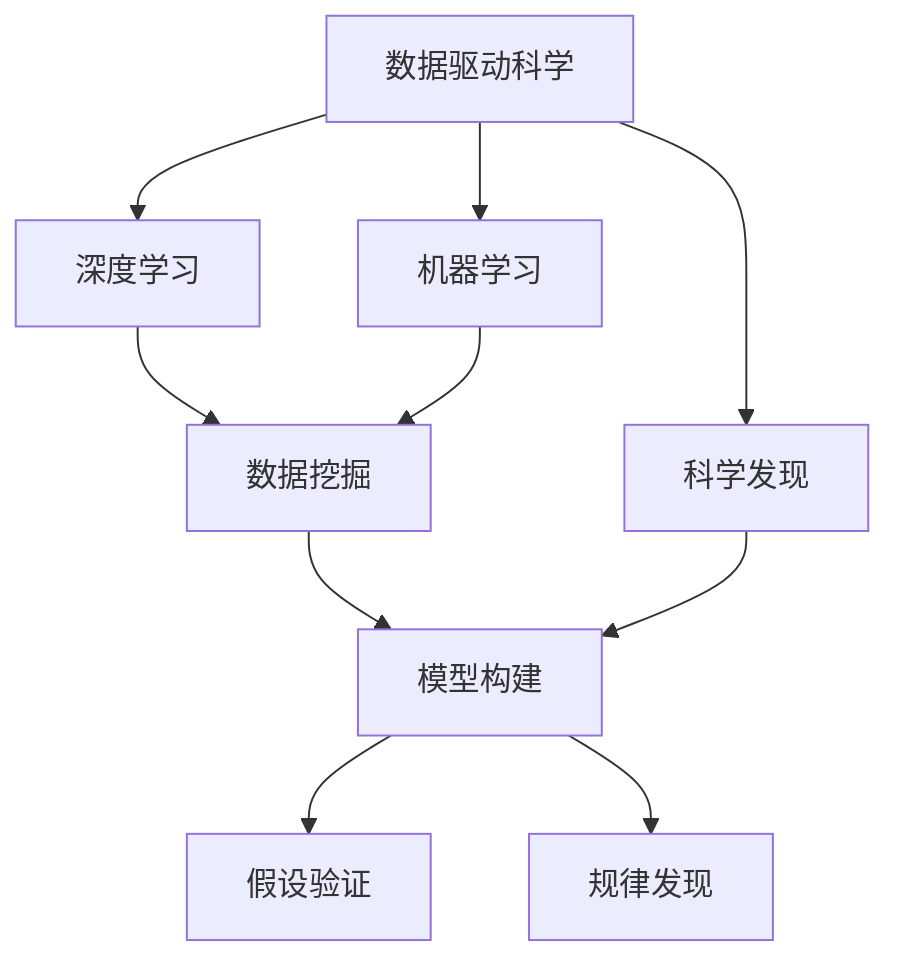

                 

# 洞察力与科学发现：突破性研究的源泉

> 关键词：科学发现, 研究方法, 科学史, 研究范式, 数据分析, 数据挖掘, 大数据, 人工智能

## 1. 背景介绍

在现代科学研究中，数据量的大幅度增长为科学发现带来了新的机遇和挑战。一方面，庞大的数据资源为科学家提供了更多的研究素材，增加了发现新知识的可能性；另一方面，数据的复杂性和多样性也要求科研人员具备更高的数据分析能力和洞察力，以从中挖掘出有价值的科学发现。随着人工智能和大数据技术的崛起，科学研究正在经历一场深刻的变革。

### 1.1 科学发现的重要性

科学发现是人类文明进步的动力源泉，是推动科技创新的重要推手。从医学、物理、化学，到生物、天文、地质，科学发现贯穿于人类探索世界每一个角落的每一个角落。科学发现不仅是理论知识的积累，更是解决实际问题、推动产业升级和社会进步的关键因素。

### 1.2 数据在科学发现中的角色

科学研究的每一个进步都离不开数据的支持。从早期的观测数据到近现代通过实验仪器获取的高精度数据，再到今天借助大数据技术获取的海量数据，数据在科学发现中的作用愈发重要。数据驱动的科学研究方法，正在成为科学研究的重要范式，为人类认识世界、改造世界提供了新的视角。

### 1.3 人工智能在科学发现中的作用

人工智能技术的崛起，尤其是机器学习、深度学习等算法的突破，使得数据处理和分析变得更加高效和精准。利用人工智能算法，可以从海量的数据中挖掘出隐藏的模式、关联和规律，为科学发现提供了新的工具和手段。同时，人工智能还能在一定程度上辅助科研人员进行假设验证和模型训练，加速科学研究的进程。

## 2. 核心概念与联系

### 2.1 核心概念概述

为更好地理解基于数据分析和人工智能的科学发现过程，本节将介绍几个关键概念：

- **数据驱动科学（Data-Driven Science）**：基于数据进行科学发现的方法论，强调数据在科研中的核心作用。通过数据来验证假设、构建模型、发现规律，进而推动科学知识的积累和创新。
- **机器学习（Machine Learning, ML）**：一种基于算法的数据分析方法，通过让机器从数据中学习模式和规律，用于预测、分类、聚类等任务。
- **深度学习（Deep Learning, DL）**：一种特殊的机器学习算法，利用多层神经网络对数据进行层次化的处理和抽象，适合处理复杂、高维度的数据集。
- **科学发现**：在科学研究中，通过数据分析和算法推导，得到新的知识或理论的过程。
- **数据挖掘（Data Mining）**：从大量数据中提取出有价值的模式、关联和规律的过程，是数据驱动科学的核心环节。

这些概念之间的逻辑关系可以通过以下Mermaid流程图来展示：



这个流程图展示了几大核心概念之间的联系：

1. 数据驱动科学通过数据来指导和推动科学发现。
2. 机器学习和深度学习提供了数据分析和模型训练的手段。
3. 数据挖掘是数据驱动科学的实现方法，用于提取数据中的有价值信息。
4. 模型构建和假设验证是科学发现的中间环节，通过模型和假设验证的结果，推动科学规律和知识的发现。

## 3. 核心算法原理 & 具体操作步骤

### 3.1 算法原理概述

基于数据分析和人工智能的科学发现，其核心在于通过数据驱动的方法，利用机器学习算法和深度学习模型，从大量数据中提取模式、关联和规律，进而推动科学知识的创新。

形式化地，假设我们拥有来自不同领域的数据集 $D=\{(x_i, y_i)\}_{i=1}^N$，其中 $x_i$ 表示输入特征向量，$y_i$ 表示标签。科学发现的过程可以表述为：

1. **数据预处理**：对原始数据进行清洗、归一化、特征工程等操作，准备输入模型。
2. **模型训练**：使用机器学习或深度学习算法，对数据集进行模型训练，学习数据中的规律和模式。
3. **模型评估与验证**：使用验证集对训练好的模型进行评估，确保模型具备泛化能力。
4. **科学发现**：根据训练好的模型，验证科研假设，发现新的科学规律或知识。

### 3.2 算法步骤详解

科学发现的详细步骤包括以下几个关键步骤：

**Step 1: 数据收集与预处理**

- 收集来自不同领域的数据集，涵盖科学实验、观测数据、模拟数据等。
- 对原始数据进行清洗，去除噪声、异常值，填补缺失值。
- 进行特征工程，提取有用特征，构建特征向量。

**Step 2: 模型选择与训练**

- 根据科研问题选择合适的机器学习或深度学习算法。
- 使用训练集对模型进行训练，调整模型参数，使得模型能够准确拟合数据。
- 使用验证集对训练好的模型进行评估，避免过拟合。

**Step 3: 模型评估与验证**

- 使用测试集对训练好的模型进行测试，评估模型泛化能力。
- 进行交叉验证，确保模型在不同数据子集上的稳定性和鲁棒性。
- 利用统计学工具，如置信区间、p值等，评估模型的显著性。

**Step 4: 科学发现**

- 根据训练好的模型，验证科研假设。
- 利用模型预测结果，探索新规律和知识。
- 根据模型预测结果，提出新的理论假设，进行下一步实验验证。

### 3.3 算法优缺点

基于数据分析和人工智能的科学发现方法，具有以下优点：

1. **数据驱动**：通过数据驱动的方法，减少了对先验知识的依赖，能够从数据中直接发现新的规律和知识。
2. **高效率**：机器学习和深度学习算法可以快速处理大量数据，加速科学发现的进程。
3. **自动化**：自动化数据分析和模型训练过程，减少了人工干预，提高了科研效率。

但该方法也存在一些局限性：

1. **数据质量依赖**：数据分析的效果很大程度上依赖于数据的质量和数量，获取高质量数据往往需要大量的时间和资源。
2. **模型复杂性**：复杂的数据结构和模型结构，增加了科研人员的学习和理解难度。
3. **解释性不足**：黑箱模型难以解释其内部工作机制，科研人员难以理解模型如何得出结论。
4. **领域知识需求**：对数据和模型的理解需要一定的领域知识，科研人员需要具备相应的专业背景。

尽管存在这些局限性，但总体而言，基于数据分析和人工智能的科学发现方法正在成为科学研究的趋势。未来相关研究将更加关注模型可解释性和鲁棒性，提升数据质量和分析精度，进一步推动科学研究的进步。

### 3.4 算法应用领域

基于数据分析和人工智能的科学发现方法，在多个领域得到了广泛应用，例如：

- 生物信息学：利用机器学习算法，从基因组数据中发现新的生物规律，推动基因工程和药物研发。
- 天文学：利用深度学习技术，分析天体物理数据，发现新的天体和物理现象。
- 地球科学：通过数据分析和机器学习，研究地球环境变化和自然灾害预测。
- 金融工程：利用大数据和机器学习，分析市场行为，预测股票价格，优化投资策略。
- 医学研究：利用数据分析和机器学习，研究疾病机理，提高诊断准确性，开发新药物。

除了上述这些领域外，基于数据分析和人工智能的科学发现方法也在更多学科中展现出其强大的应用潜力，为科学研究的各个角落注入了新的活力。

## 4. 数学模型和公式 & 详细讲解 & 举例说明

### 4.1 数学模型构建

本节将使用数学语言对基于数据分析和人工智能的科学发现过程进行更加严格的刻画。

记数据集为 $D=\{(x_i, y_i)\}_{i=1}^N$，其中 $x_i \in \mathbb{R}^d$ 为输入特征向量，$y_i \in \mathbb{R}$ 为标签。假设选择的模型为 $M_{\theta}$，其中 $\theta \in \mathbb{R}^p$ 为模型参数。

定义模型在数据样本 $(x,y)$ 上的损失函数为 $\ell(M_{\theta}(x),y)$，则在数据集 $D$ 上的经验风险为：

$$
\mathcal{L}(\theta) = \frac{1}{N} \sum_{i=1}^N \ell(M_{\theta}(x_i),y_i)
$$

其中 $\ell$ 为模型在输入 $x$ 上的预测与真实标签 $y$ 之间的差异。

### 4.2 公式推导过程

以下我们以回归任务为例，推导最小二乘法的数学公式。

假设模型 $M_{\theta}$ 在输入 $x$ 上的输出为 $\hat{y}=M_{\theta}(x)$，表示样本的预测值。真实标签 $y \in \mathbb{R}$。则回归损失函数定义为：

$$
\ell(M_{\theta}(x),y) = (y-\hat{y})^2
$$

将其代入经验风险公式，得：

$$
\mathcal{L}(\theta) = \frac{1}{N} \sum_{i=1}^N (y_i - M_{\theta}(x_i))^2
$$

最小二乘法的目标是最小化经验风险 $\mathcal{L}(\theta)$，即找到最优参数：

$$
\theta^* = \mathop{\arg\min}_{\theta} \mathcal{L}(\theta)
$$

对 $\mathcal{L}(\theta)$ 关于 $\theta$ 求导，得：

$$
\frac{\partial \mathcal{L}(\theta)}{\partial \theta_k} = \frac{2}{N} \sum_{i=1}^N (y_i - M_{\theta}(x_i)) x_{ik}
$$

根据梯度下降算法，更新模型参数 $\theta$：

$$
\theta \leftarrow \theta - \eta \nabla_{\theta}\mathcal{L}(\theta)
$$

其中 $\eta$ 为学习率，$\nabla_{\theta}\mathcal{L}(\theta)$ 为损失函数对参数 $\theta$ 的梯度。

在得到损失函数的梯度后，即可带入梯度下降算法，完成模型的迭代优化。重复上述过程直至收敛，最终得到适应数据集的最优模型参数 $\theta^*$。

### 4.3 案例分析与讲解

我们以气象数据预测为例，展示如何使用机器学习算法进行科学发现。

假设我们拥有多年的气象数据，包含每天的气温、湿度、风速等特征。我们的目标是预测明天的气温。

1. **数据预处理**：清洗数据，去除异常值和噪声，填充缺失值。
2. **特征工程**：提取有用特征，如平均气温、最高气温、最低气温等。
3. **模型选择与训练**：选择线性回归模型，使用训练集对模型进行训练，调整模型参数。
4. **模型评估与验证**：使用验证集对训练好的模型进行评估，确保模型具备泛化能力。
5. **科学发现**：根据训练好的模型，预测明天的气温，并分析其影响因素。

## 5. 项目实践：代码实例和详细解释说明

### 5.1 开发环境搭建

在进行数据分析和科学发现实践前，我们需要准备好开发环境。以下是使用Python进行Scikit-Learn开发的流程：

1. 安装Anaconda：从官网下载并安装Anaconda，用于创建独立的Python环境。

2. 创建并激活虚拟环境：
```bash
conda create -n data-env python=3.8 
conda activate data-env
```

3. 安装Scikit-Learn：使用pip安装Scikit-Learn，用于数据处理和模型训练。
```bash
pip install scikit-learn
```

4. 安装各类工具包：
```bash
pip install numpy pandas scikit-learn matplotlib tqdm jupyter notebook ipython
```

完成上述步骤后，即可在`data-env`环境中开始数据分析和科学发现实践。

### 5.2 源代码详细实现

下面我们以气象数据预测为例，给出使用Scikit-Learn进行线性回归分析的Python代码实现。

```python
import numpy as np
from sklearn.model_selection import train_test_split
from sklearn.linear_model import LinearRegression
from sklearn.metrics import mean_squared_error

# 加载气象数据
data = np.loadtxt('weather.csv', delimiter=',')
X = data[:, :-1]  # 特征
y = data[:, -1]    # 标签

# 划分训练集和测试集
X_train, X_test, y_train, y_test = train_test_split(X, y, test_size=0.2, random_state=42)

# 创建模型
model = LinearRegression()

# 训练模型
model.fit(X_train, y_train)

# 评估模型
y_pred = model.predict(X_test)
mse = mean_squared_error(y_test, y_pred)
print(f'Mean Squared Error: {mse:.2f}')

# 预测明天的气温
X_new = np.array([[25, 70, 10]], dtype=np.float64)  # 新输入
y_new_pred = model.predict(X_new)
print(f'Predicted Tomorrow's Temperature: {y_new_pred[0]}°C')
```

以上就是使用Scikit-Learn进行线性回归分析的完整代码实现。可以看到，利用Scikit-Learn，我们只需编写几行代码，即可实现数据的预处理、模型训练、评估和预测。

### 5.3 代码解读与分析

让我们再详细解读一下关键代码的实现细节：

**数据加载与预处理**：
- `np.loadtxt`函数用于加载CSV格式的数据文件。
- `X`和`y`分别表示特征和标签，即输入和输出变量。

**模型训练**：
- `train_test_split`函数用于将数据集划分为训练集和测试集。
- `LinearRegression`类表示线性回归模型，使用`fit`方法对训练集进行模型训练。

**模型评估**：
- `predict`方法用于模型预测，返回新数据集上的预测值。
- `mean_squared_error`函数用于计算预测值与真实值之间的均方误差。

**科学发现**：
- 使用训练好的模型，预测新数据集的输出。
- 分析预测结果，提出新的科学发现。

## 6. 实际应用场景

### 6.1 气象数据预测

气象数据预测是数据分析和科学发现的重要应用之一。利用历史气象数据，科学家可以预测未来天气变化，帮助农业、航空、交通等领域做出更好的决策。

在实践中，可以收集历史气象数据，提取有用的特征，如温度、湿度、风速、气压等，构建线性回归模型进行训练和预测。训练好的模型可以实时输入当前的气象条件，输出明天的气温预测，为相关行业提供科学决策依据。

### 6.2 金融市场分析

金融市场数据的分析也是数据分析和科学发现的重要方向。通过分析股票、期货等金融产品的价格数据，可以预测市场趋势，优化投资策略，减少投资风险。

具体而言，可以收集历史股价、交易量、新闻事件等数据，构建时间序列模型或回归模型进行训练和预测。训练好的模型可以实时输入当前的市场数据，输出未来的价格预测，为投资者提供决策参考。

### 6.3 医疗数据分析

医疗数据分析是科学发现的重要应用之一。通过分析患者的医疗记录和基因数据，可以发现疾病规律，提高诊断准确性，开发新药物。

在实践中，可以收集患者的医疗记录和基因数据，提取有用的特征，如年龄、性别、病史等，构建分类或回归模型进行训练和预测。训练好的模型可以实时输入新的医疗记录，输出疾病诊断或治疗建议，为医生提供决策支持。

### 6.4 未来应用展望

随着数据分析和人工智能技术的不断进步，基于数据分析和人工智能的科学发现方法将在更多领域得到应用，为各行各业带来变革性影响。

在智慧城市治理中，数据分析和机器学习可以用于交通流量预测、环境质量监测、公共安全预警等环节，提高城市管理的自动化和智能化水平，构建更安全、高效的未来城市。

在工业制造中，数据分析和机器学习可以用于设备故障预测、供应链优化、生产效率提升等方向，提高生产效率和产品质量，推动制造业的智能化升级。

在教育领域，数据分析和机器学习可以用于学生行为分析、学习效果评估、个性化推荐等方向，提高教育质量，促进教育公平。

此外，在商业、能源、农业等众多领域，数据分析和人工智能技术也将不断涌现，为各行业带来新的机会和挑战。相信随着技术的发展和应用场景的拓展，基于数据分析和人工智能的科学发现方法必将在更广阔的领域绽放异彩。

## 7. 工具和资源推荐

### 7.1 学习资源推荐

为了帮助开发者系统掌握数据分析和科学发现的技术基础和实践技巧，这里推荐一些优质的学习资源：

1. 《Python数据分析实战》系列博文：由知名数据科学家撰写，深入浅出地介绍了Python数据分析的基础知识和实战技巧。
2. Coursera《机器学习》课程：由斯坦福大学Andrew Ng教授主讲，系统介绍了机器学习和深度学习的基础理论和实践应用。
3. 《机器学习实战》书籍：Hands-On Machine Learning with Scikit-Learn、TensorFlow等工具的实战教程，适合入门学习。
4. Kaggle竞赛平台：全球最大的数据科学竞赛平台，通过参与各类数据科学竞赛，可以积累实战经验，提升数据分析能力。
5. 《数据挖掘与统计学习》书籍：详细介绍了数据挖掘和统计学习的基本原理和算法，是系统学习数据分析的必读书籍。

通过对这些资源的学习实践，相信你一定能够快速掌握数据分析和科学发现的方法，并用于解决实际的科研问题。

### 7.2 开发工具推荐

高效的数据分析需要优秀的工具支持。以下是几款用于数据分析和科学发现开发的常用工具：

1. Python：Python语言是数据科学领域的标准语言，拥有丰富的科学计算和数据分析库，如Scikit-Learn、Pandas、NumPy等。
2. R语言：R语言是专门用于数据分析和统计建模的语言，拥有强大的数据处理和可视化能力，适用于各种科研任务。
3. Jupyter Notebook：交互式数据科学工作环境，支持Python、R等语言，方便撰写和执行代码，适合科研和教学使用。
4. Tableau：数据可视化工具，支持从各种数据源中提取数据，生成交互式图表，方便数据分析和呈现。
5. KNIME：开源数据科学平台，提供拖放式的可视化界面，适合非编程用户进行数据处理和分析。

合理利用这些工具，可以显著提升数据分析和科学发现的效率，加速科研进展。

### 7.3 相关论文推荐

数据分析和科学发现领域的理论研究和实践应用正蓬勃发展，以下是几篇奠基性的相关论文，推荐阅读：

1. "Linear Regression: A Brief Overview"（线性回归概述）：介绍线性回归的基础原理和应用，是数据分析的经典入门读物。
2. "A Survey of Machine Learning Techniques for Anomaly Detection"（异常检测的机器学习技术综述）：综述了各种异常检测的机器学习方法，为数据分析提供了理论支持。
3. "Data Mining and Statistical Learning"（数据挖掘和统计学习）：全面介绍了数据挖掘和统计学习的基本原理和算法，是数据分析的权威教材。
4. "A Survey of Data Mining Algorithms"（数据挖掘算法综述）：综述了各种数据挖掘算法的原理和实现方法，为数据分析提供了丰富的工具。
5. "The Elements of Statistical Learning"（统计学习基础）：详细介绍了统计学习的基本原理和算法，是数据分析的高级教材。

这些论文代表了大数据分析和科学发现领域的发展脉络。通过学习这些前沿成果，可以帮助研究者把握学科前进方向，激发更多的创新灵感。

## 8. 总结：未来发展趋势与挑战

### 8.1 总结

本文对基于数据分析和人工智能的科学发现方法进行了全面系统的介绍。首先阐述了数据分析和科学发现的重要性，明确了科学发现的核心在于利用数据驱动的方法，通过机器学习算法和深度学习模型，从数据中提取模式、关联和规律，进而推动科学知识的创新。

通过本文的系统梳理，可以看到，数据分析和科学发现方法正在成为科学研究的趋势，正在推动各学科的快速进步。未来，伴随数据分析和人工智能技术的不断演进，这些方法的普适性和准确性将进一步提升，推动科学研究进入新的纪元。

### 8.2 未来发展趋势

展望未来，数据分析和科学发现方法将呈现以下几个发展趋势：

1. **自动化**：自动化数据分析和模型训练过程，减少人工干预，提高科研效率。
2. **多模态融合**：将不同模态的数据（如文本、图像、声音等）进行融合分析，提升数据的全面性和精度。
3. **实时分析**：利用大数据和流处理技术，实现实时数据分析和预测，满足动态变化的科研需求。
4. **深度学习**：深度学习技术将广泛应用于数据分析和科学发现，提升模型复杂度和预测精度。
5. **跨领域应用**：数据分析和科学发现方法将在更多领域得到应用，推动跨学科的协同创新。
6. **智能辅助**：人工智能技术将进一步融入数据分析和科学发现，提供更智能的决策支持和科研建议。

这些趋势凸显了数据分析和科学发现技术的广阔前景。未来，这些技术的不断进步，将进一步提升科研工作的自动化和智能化水平，推动科学研究进入全新的阶段。

### 8.3 面临的挑战

尽管数据分析和科学发现技术已经取得了显著进展，但在迈向更加智能化、普适化应用的过程中，仍然面临诸多挑战：

1. **数据质量问题**：数据的不完整性、不准确性和不一致性，将影响分析结果的准确性。
2. **模型复杂性**：复杂的数据结构和模型结构，增加了科研人员的学习和理解难度。
3. **计算资源需求**：大规模数据分析和深度学习模型的训练需要大量的计算资源。
4. **伦理和安全问题**：数据的隐私保护、模型的公平性和安全性，是未来科研需要重点关注的问题。
5. **跨学科合作**：数据分析和科学发现方法需要跨学科的协同合作，面临诸多交流和合作难题。

尽管存在这些挑战，但通过不断优化算法、提升计算能力、加强跨学科合作，未来这些问题将逐步得到解决。数据分析和科学发现技术的进一步发展，将为科学研究带来更多的突破和创新。

### 8.4 研究展望

面对数据分析和科学发现所面临的挑战，未来的研究需要在以下几个方面寻求新的突破：

1. **数据质量提升**：开发更多数据清洗和预处理工具，提升数据的质量和一致性。
2. **模型可解释性**：研究模型的可解释性和可解释性算法，提高科研人员对模型的理解和使用能力。
3. **计算资源优化**：开发高效的数据处理和模型训练算法，减少计算资源消耗。
4. **跨学科融合**：推动不同学科的交叉合作，形成更全面、系统的数据分析和科学发现方法。
5. **伦理和社会责任**：加强数据隐私保护和模型公平性研究，确保数据和模型的伦理和安全。

这些研究方向将进一步推动数据分析和科学发现技术的进步，为科学研究带来更多的突破和创新。未来，数据分析和科学发现技术必将成为科学研究的重要工具，为人类认知智能的进步贡献力量。

## 9. 附录：常见问题与解答

**Q1: 如何选择合适的数据分析方法？**

A: 选择合适的数据分析方法需要考虑数据的类型、规模、特征等多方面因素。一般来说，可以按照以下步骤进行选择：
1. 数据类型：判断数据是结构化数据、半结构化数据还是非结构化数据，选择适合的分析方法。
2. 数据规模：评估数据规模的大小，选择适合的大数据处理技术。
3. 数据特征：分析数据的特征，选择适合的统计分析和机器学习方法。
4. 分析目的：明确分析目的，选择合适的分析工具和技术。

**Q2: 如何评估数据分析的效果？**

A: 评估数据分析的效果通常通过以下几个指标来衡量：
1. 准确性：评估模型预测的准确度和精度。
2. 鲁棒性：评估模型在不同数据子集上的泛化能力和稳定性。
3. 可解释性：评估模型的可解释性和透明度，确保科研人员能够理解模型的工作机制。
4. 时效性：评估数据分析和模型训练的效率，确保能够快速响应科研需求。

**Q3: 数据分析中常见的数据预处理技术有哪些？**

A: 数据分析中常见的数据预处理技术包括：
1. 数据清洗：去除噪声、异常值和缺失值，保证数据质量。
2. 数据归一化：对数据进行归一化和标准化处理，确保数据的一致性。
3. 特征工程：提取有用的特征，构建特征向量，提升模型的准确度。
4. 降维技术：使用主成分分析、因子分析等方法，减少数据的维度和复杂度。
5. 数据可视化：使用散点图、柱状图、热力图等可视化技术，帮助科研人员理解数据结构和关系。

这些预处理技术能够提升数据分析的准确性和效率，为科学发现提供坚实的数据基础。

**Q4: 数据科学和人工智能有什么区别？**

A: 数据科学和人工智能是密切相关的领域，但各自侧重不同。数据科学主要关注数据的收集、处理、分析和解释，旨在从数据中提取有价值的信息；而人工智能则侧重于通过算法和模型，对数据进行智能处理和决策，旨在实现机器的自动化和智能化。数据科学是人工智能的基础，而人工智能则是数据科学的高级应用。

**Q5: 如何选择合适的机器学习算法？**

A: 选择合适的机器学习算法需要考虑数据类型、问题类型、模型复杂度等多方面因素。一般来说，可以按照以下步骤进行选择：
1. 数据类型：判断数据是分类数据、回归数据还是序列数据，选择适合的算法。
2. 问题类型：确定问题的类型，选择适合的数据分类、回归、聚类或预测算法。
3. 模型复杂度：评估模型的复杂度和可解释性，选择适合的算法。
4. 性能需求：根据模型的性能需求，选择适合的算法和参数。

通过对这些问题的深入理解和解答，相信你一定能够更好地掌握数据分析和科学发现的方法，推动科研工作的进步。

---

作者：禅与计算机程序设计艺术 / Zen and the Art of Computer Programming

