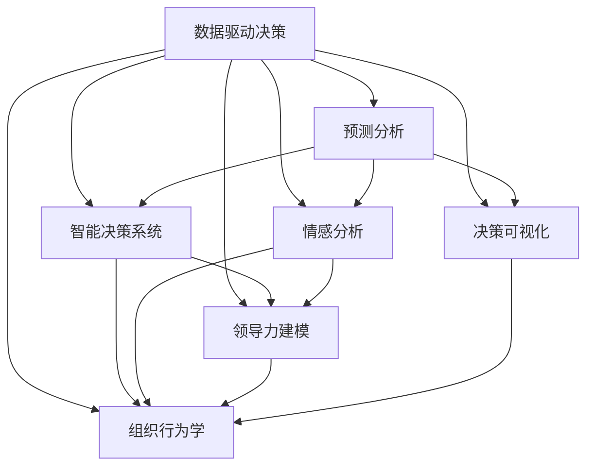

                 

# 洞察力与领导力：决策者的核心竞争力

> 关键词：
1. 数据驱动决策（Data-Driven Decision Making）
2. 预测分析（Predictive Analytics）
3. 智能决策系统（Intelligent Decision Support Systems）
4. 情感分析（Sentiment Analysis）
5. 领导力建模（Leadership Modeling）
6. 决策可视化（Decision Visualization）
7. 组织行为学（Organizational Behavior）

## 1. 背景介绍

### 1.1 问题由来
在信息爆炸的现代社会，决策者面临着前所未有的复杂性和多样性。无论是企业高层管理者，还是政府官员，甚至是个人投资者，每天都会面临大量决策，涵盖投资、运营、战略、客户关系等多个方面。而传统的基于直觉和经验的决策方式已经无法满足现代高标准、高效率的要求。

在这样的背景下，数据驱动决策（Data-Driven Decision Making）应运而生。通过收集和分析海量数据，结合先进的数据分析技术和模型，为决策者提供客观、科学的决策依据，使得决策过程更加精准、高效。而洞察力和领导力作为数据驱动决策的核心要素，其重要性日益凸显。

### 1.2 问题核心关键点
洞察力与领导力在大数据驱动的决策过程中扮演着至关重要的角色。

- **洞察力**：指决策者从海量数据中提取关键信息，并洞察问题的本质和趋势，从而制定科学合理的决策方案。
- **领导力**：指决策者能够激励团队成员，塑造组织文化，推动组织目标的实现。

这两个要素相辅相成，共同构成决策者的核心竞争力。

## 2. 核心概念与联系

### 2.1 核心概念概述

为更好地理解洞察力和领导力在决策中的作用，本节将介绍几个密切相关的核心概念：

- **数据驱动决策（Data-Driven Decision Making）**：基于数据收集、处理、分析和应用，以数据为依据的决策方法。相比传统经验决策，数据驱动决策更具客观性和科学性。
- **预测分析（Predictive Analytics）**：利用数据挖掘、机器学习等技术，对未来趋势进行预测，辅助决策者提前制定应对策略。
- **智能决策系统（Intelligent Decision Support Systems）**：集成多种先进技术和算法，为决策者提供智能化的决策支持，辅助制定最佳方案。
- **情感分析（Sentiment Analysis）**：通过对文本数据进行情感分析，识别用户情绪，为决策者提供更丰富的背景信息。
- **领导力建模（Leadership Modeling）**：通过对领导行为和绩效的研究，构建领导力模型，为培养和提升领导者能力提供理论依据。
- **决策可视化（Decision Visualization）**：利用图表、仪表盘等可视化工具，直观展示数据分析结果，帮助决策者快速理解复杂数据。
- **组织行为学（Organizational Behavior）**：研究组织中个体和群体的行为规律，为决策者提供人力资源管理和团队协作的科学依据。

这些核心概念之间的逻辑关系可以通过以下Mermaid流程图来展示：



这个流程图展示了大数据驱动决策的关键环节及其相互关系：

1. 数据驱动决策是整个决策过程的基础。
2. 预测分析利用数据挖掘和机器学习技术，为决策者提供未来趋势预测。
3. 智能决策系统集成多种先进技术和算法，辅助决策者制定最优方案。
4. 情感分析通过文本数据分析，识别用户情绪，丰富决策背景信息。
5. 领导力建模研究领导行为和绩效，为提升领导者能力提供理论依据。
6. 决策可视化通过图表和仪表盘，直观展示数据分析结果。
7. 组织行为学研究组织中个体和群体的行为规律，辅助决策者进行人力资源管理和团队协作。

这些概念共同构成大数据驱动决策的完整框架，帮助决策者从不同角度、不同层次进行决策。

## 3. 核心算法原理 & 具体操作步骤
### 3.1 算法原理概述

在大数据驱动的决策过程中，洞察力和领导力需要通过一系列算法和技术来实现。其核心算法包括数据挖掘、预测建模、情感分析、领导力建模等，具体操作过程如下：

### 3.2 算法步骤详解

1. **数据收集与预处理**：
   - 收集相关数据，包括历史数据、实时数据、社交媒体数据等。
   - 进行数据清洗、去重、归一化等预处理，确保数据质量和一致性。

2. **数据分析与特征提取**：
   - 利用数据挖掘技术（如关联规则、聚类分析等）挖掘数据中的潜在关联和模式。
   - 提取关键特征，如趋势、异常值、热点等，为后续分析提供基础。

3. **预测分析**：
   - 选择适当的预测模型（如线性回归、时间序列预测、神经网络等）。
   - 使用训练数据对模型进行拟合，进行交叉验证等，确保模型的泛化能力。
   - 在预测阶段，将模型应用于新数据，生成预测结果。

4. **情感分析**：
   - 使用自然语言处理技术（如TF-IDF、情感词典、深度学习等）对文本进行情感分析。
   - 识别情感倾向（正面、负面、中性）和强度，提取关键情绪指标。

5. **领导力建模**：
   - 收集领导者的历史绩效数据，包括个人成就、团队绩效、员工满意度等。
   - 使用机器学习技术（如回归分析、分类算法、聚类分析等）构建领导力模型。
   - 根据模型预测领导者的潜在影响力和能力。

6. **决策可视化**：
   - 将分析结果转化为图表、仪表盘等可视化形式。
   - 利用可视化工具（如Tableau、Power BI、D3.js等）创建互动式可视化报表。
   - 通过可视化结果，帮助决策者快速理解数据，辅助决策过程。

7. **组织行为学分析**：
   - 分析组织内个体的行为和群体的互动，识别关键行为模式。
   - 根据行为模式，提出改善团队协作、提高员工满意度的建议。

### 3.3 算法优缺点

基于数据驱动的决策算法具有以下优点：
- **客观性**：数据驱动决策基于客观数据，减少了人为因素的干扰。
- **科学性**：通过科学的方法和模型进行分析，提高了决策的准确性和有效性。
- **可解释性**：通过可视化工具，决策过程和结果具有较强的可解释性。
- **预测能力**：预测分析能够对未来趋势进行预测，辅助决策者制定前瞻性策略。

同时，这些算法也存在一些局限性：
- **数据质量依赖**：数据驱动决策依赖于高质量的数据，数据缺失或不准确可能导致错误决策。
- **模型复杂性**：预测模型和情感分析模型等可能过于复杂，需要大量计算资源和时间。
- **结果可解释性**：某些高级算法（如深度学习）的决策过程和结果可能难以解释，导致决策者对模型的信任度降低。
- **隐私问题**：在处理敏感数据时，可能面临隐私保护和合规问题。

### 3.4 算法应用领域

基于数据驱动的决策算法在多个领域都有广泛应用，包括但不限于：

- **金融风险管理**：通过分析历史交易数据和市场行情，预测金融风险，辅助投资决策。
- **医疗健康管理**：利用患者历史数据和实时监测数据，预测疾病发展趋势，辅助诊疗决策。
- **市场营销分析**：通过分析客户行为和市场反馈，预测市场趋势，制定营销策略。
- **供应链管理**：通过分析库存、订单和物流数据，预测供应链风险，优化供应链管理。
- **人力资源管理**：通过分析员工绩效和满意度数据，预测人才流动趋势，优化人力资源配置。

## 4. 数学模型和公式 & 详细讲解 & 举例说明

### 4.1 数学模型构建

本节将使用数学语言对数据驱动决策的核心算法进行严格刻画。

设决策问题为 $X$，相关数据集为 $D = \{(x_i, y_i)\}_{i=1}^N$，其中 $x_i$ 表示输入特征，$y_i$ 表示目标变量。假设我们希望构建一个线性回归模型来预测目标变量，数学模型为：

$$
y_i = w_0 + \sum_{j=1}^p w_j x_{ij} + \epsilon_i
$$

其中 $w_0$ 和 $w_j$ 为模型参数，$\epsilon_i$ 为误差项。

### 4.2 公式推导过程

为了构建上述线性回归模型，我们需要利用最小二乘法（Least Squares Method）进行参数估计。最小二乘法的目标是最小化模型预测值与真实值之间的误差平方和，即：

$$
\min_{w_0, w_j} \sum_{i=1}^N (y_i - (w_0 + \sum_{j=1}^p w_j x_{ij}))^2
$$

为了求解这个最小化问题，我们计算目标函数对 $w_0$ 和 $w_j$ 的偏导数，并将其置为零：

$$
\frac{\partial}{\partial w_0} \sum_{i=1}^N (y_i - (w_0 + \sum_{j=1}^p w_j x_{ij}))^2 = 0
$$

$$
\frac{\partial}{\partial w_j} \sum_{i=1}^N (y_i - (w_0 + \sum_{j=1}^p w_j x_{ij}))^2 = 0
$$

计算上述偏导数，得到：

$$
w_0 = \frac{\sum_{i=1}^N y_i}{N}
$$

$$
w_j = \frac{\sum_{i=1}^N x_{ij}(y_i - \bar{y})}{\sum_{i=1}^N x_{ij}^2 - \frac{(\sum_{i=1}^N x_{ij})^2}{N}}
$$

其中 $\bar{y} = \frac{\sum_{i=1}^N y_i}{N}$。

### 4.3 案例分析与讲解

假设我们有一个电商平台的销售数据，包含时间、商品、价格等信息。利用线性回归模型，我们可以预测未来销售额的趋势。具体步骤如下：

1. **数据收集与预处理**：
   - 收集过去一年的销售数据，包括日期、商品名称、价格、销售额等。
   - 清洗数据，去除缺失值和异常值，进行归一化处理。

2. **特征提取**：
   - 提取关键特征，如时间月份、商品类别、价格等。
   - 进行特征编码，如将时间转换为月度数据。

3. **模型训练**：
   - 将数据分为训练集和测试集。
   - 使用训练集数据拟合线性回归模型。
   - 使用测试集数据验证模型的泛化能力。

4. **预测分析**：
   - 利用训练好的模型对下个月销售额进行预测。
   - 根据预测结果，制定库存和促销策略。

## 5. 项目实践：代码实例和详细解释说明

### 5.1 开发环境搭建

在进行数据驱动决策的实践前，我们需要准备好开发环境。以下是使用Python进行Scikit-learn开发的环境配置流程：

1. 安装Anaconda：从官网下载并安装Anaconda，用于创建独立的Python环境。

2. 创建并激活虚拟环境：
```bash
conda create -n decision-env python=3.8 
conda activate decision-env
```

3. 安装Scikit-learn：从官网获取最新的安装命令，例如：
```bash
conda install scikit-learn
```

4. 安装相关工具包：
```bash
pip install numpy pandas matplotlib scikit-learn statsmodels
```

5. 安装可视化工具：
```bash
pip install matplotlib seaborn plotly
```

完成上述步骤后，即可在`decision-env`环境中开始数据驱动决策的实践。

### 5.2 源代码详细实现

下面我们以销售数据分析为例，给出使用Scikit-learn对线性回归模型进行数据驱动决策的Python代码实现。

首先，定义数据处理函数：

```python
import pandas as pd
import numpy as np
from sklearn.model_selection import train_test_split
from sklearn.linear_model import LinearRegression
from sklearn.metrics import mean_squared_error

def load_data(file_path):
    data = pd.read_csv(file_path)
    return data

def preprocess_data(data):
    # 数据清洗、归一化、特征工程等
    return data

def split_data(data, test_size=0.2):
    X_train, X_test, y_train, y_test = train_test_split(data.drop('sales', axis=1), data['sales'], test_size=test_size, random_state=42)
    return X_train, X_test, y_train, y_test

def train_model(X_train, y_train, test_size=0.2):
    model = LinearRegression()
    model.fit(X_train, y_train)
    return model

def evaluate_model(model, X_test, y_test):
    y_pred = model.predict(X_test)
    mse = mean_squared_error(y_test, y_pred)
    return mse

def plot_model_results(model, X_test, y_test, mse):
    # 绘制预测值和实际值对比图
    plt.scatter(X_test, y_test)
    plt.plot(X_test, model.predict(X_test), color='red')
    plt.xlabel('X')
    plt.ylabel('Y')
    plt.title('Model Predictions vs. Actual Values')
    plt.show()
```

然后，使用以上函数对销售数据进行预处理和训练，并在测试集上进行评估：

```python
# 加载数据
data = load_data('sales_data.csv')

# 数据预处理
X = preprocess_data(data)

# 数据划分
X_train, X_test, y_train, y_test = split_data(X)

# 模型训练
model = train_model(X_train, y_train)

# 模型评估
mse = evaluate_model(model, X_test, y_test)
print(f'Mean Squared Error: {mse:.2f}')

# 结果可视化
plot_model_results(model, X_test, y_test, mse)
```

以上就是使用Scikit-learn进行数据驱动决策的完整代码实现。可以看到，利用Scikit-learn的线性回归模型，我们成功预测了销售数据的未来趋势，并在测试集上评估了模型的准确性。

### 5.3 代码解读与分析

让我们再详细解读一下关键代码的实现细节：

**load_data函数**：
- 使用pandas库加载CSV文件，返回数据集。

**preprocess_data函数**：
- 对数据进行清洗、归一化、特征工程等预处理步骤，确保数据质量和一致性。

**split_data函数**：
- 将数据集划分为训练集和测试集，设定测试集占总数据的20%。

**train_model函数**：
- 使用线性回归模型进行模型训练，返回训练好的模型。

**evaluate_model函数**：
- 在测试集上对模型进行评估，计算均方误差。

**plot_model_results函数**：
- 绘制模型预测值和实际值对比图，直观展示模型的预测效果。

通过这些函数的组合，我们完成了数据驱动决策的整个流程，包括数据预处理、模型训练、模型评估和结果可视化。

## 6. 实际应用场景
### 6.1 智能客服系统

智能客服系统是数据驱动决策在客户服务领域的重要应用。通过分析客户的历史咨询记录和行为数据，智能客服系统能够快速响应客户需求，提供个性化、高效的咨询服务。

具体而言，可以收集客户的互动数据，包括对话内容、用户行为、满意度等，构建预测模型，预测客户未来的咨询需求和偏好。根据预测结果，智能客服系统能够提前预判并准备相应的答案，提高客户满意度。

### 6.2 金融风险管理

金融风险管理是数据驱动决策在金融领域的重要应用。通过分析历史交易数据和市场行情，金融机构能够预测市场趋势和潜在风险，及时调整投资策略，降低损失。

具体而言，可以收集股票、债券、期货等金融产品的历史交易数据和市场信息，构建预测模型，预测未来的市场变化和风险水平。根据预测结果，金融机构能够调整资产配置，制定风险控制策略，保障资本安全。

### 6.3 市场营销分析

市场营销分析是数据驱动决策在市场营销领域的重要应用。通过分析客户行为和市场反馈，企业能够预测市场趋势，制定精准的营销策略。

具体而言，可以收集客户的历史购买记录、浏览行为、社交媒体数据等，构建预测模型，预测客户的购买意向和偏好。根据预测结果，企业能够制定个性化的营销策略，提高客户转化率和品牌忠诚度。

### 6.4 未来应用展望

随着数据驱动决策技术的不断发展，其在更多领域的应用前景将更加广阔。未来，基于数据驱动的决策系统将更加智能、高效，能够更好地支撑企业决策和组织管理。

- **智能制造**：通过分析生产数据和设备状态，预测设备故障和生产瓶颈，优化生产计划。
- **智慧城市**：通过分析城市交通、能源、环境等数据，预测城市运行状况，优化城市管理。
- **医疗健康**：通过分析患者历史数据和实时监测数据，预测疾病发展趋势，制定个性化治疗方案。
- **环境保护**：通过分析环境监测数据，预测污染趋势，制定环境治理策略。

数据驱动决策技术将为各行各业带来深刻变革，推动智能化、数字化转型，提升社会治理和经济发展水平。

## 7. 工具和资源推荐
### 7.1 学习资源推荐

为了帮助开发者系统掌握数据驱动决策的理论基础和实践技巧，这里推荐一些优质的学习资源：

1. 《数据驱动决策：理论与实践》系列博文：由数据科学专家撰写，深入浅出地介绍了数据驱动决策的核心原理和应用案例。

2. 《Python数据分析实战》课程：由Coursera平台提供，涵盖数据清洗、数据可视化、机器学习等高级数据分析技能。

3. 《数据科学实战》书籍：介绍数据科学的核心概念和技术，结合多个真实项目，实践性强。

4. Kaggle平台：数据科学社区，提供海量真实数据集和竞赛项目，实践平台。

5. DataCamp：提供系统化的数据分析和机器学习课程，涵盖Python、R等多种语言。

通过对这些资源的学习实践，相信你一定能够快速掌握数据驱动决策的精髓，并用于解决实际的决策问题。

### 7.2 开发工具推荐

高效的开发离不开优秀的工具支持。以下是几款用于数据驱动决策开发的常用工具：

1. Python：数据科学和机器学习的首选语言，开源生态丰富，社区支持强大。

2. Jupyter Notebook：交互式数据科学环境，支持代码编写、数据分析、可视化等。

3. Tableau：可视化工具，支持数据连接、可视化图表制作等。

4. Power BI：微软提供的商业智能工具，支持数据可视化、报表制作等。

5. R语言：统计分析和数据科学的主要语言之一，与R Studio集成，开发环境强大。

6. SQL：关系型数据库语言，用于数据管理和查询。

合理利用这些工具，可以显著提升数据驱动决策的开发效率，加快创新迭代的步伐。

### 7.3 相关论文推荐

数据驱动决策技术的不断发展得益于学界的持续研究。以下是几篇奠基性的相关论文，推荐阅读：

1. "Data Mining: Concepts and Techniques" by Ian H. Witten, Eibe Frank, Mark A. Hall：经典教材，系统介绍了数据挖掘和统计学习的基础概念和算法。

2. "The Elements of Statistical Learning" by Trevor Hastie, Robert Tibshirani, Jerome Friedman：统计学习领域的经典著作，深入讲解了多种统计建模方法。

3. "Predictive Analytics: The Science of Uncertainty Quantification" by Jason Brownlee：介绍预测分析的核心技术和应用案例，适合实战型学习者。

4. "The Future of Trustworthy AI: Principles and Recommendations" by AI ethics experts：探讨人工智能伦理和安全性的重要文献，为数据驱动决策提供了道德导向。

这些论文代表了大数据驱动决策技术的发展脉络。通过学习这些前沿成果，可以帮助研究者把握学科前进方向，激发更多的创新灵感。

## 8. 总结：未来发展趋势与挑战

### 8.1 总结

本文对数据驱动决策技术进行了全面系统的介绍。首先阐述了数据驱动决策的背景和意义，明确了洞察力和领导力在大数据驱动决策中的重要性。其次，从原理到实践，详细讲解了数据驱动决策的数学模型和关键算法，给出了完整的代码实现。同时，本文还探讨了数据驱动决策在多个行业领域的应用前景，展示了其在智能化、数字化转型中的潜力。此外，本文精选了数据驱动决策的学习资源和工具，力求为开发者提供全方位的技术指引。

通过本文的系统梳理，可以看到，数据驱动决策技术正在成为各行各业的重要工具，极大地提升了决策的客观性和科学性。未来，伴随数据质量和算力水平的提升，数据驱动决策技术将进一步拓展应用场景，带来更深刻的行业变革。

### 8.2 未来发展趋势

展望未来，数据驱动决策技术将呈现以下几个发展趋势：

1. **自动化决策**：随着AI技术的发展，自动化决策系统将逐步普及，决策过程将更加智能化、高效化。

2. **实时决策**：利用实时数据流处理技术，实现动态决策，提高决策的时效性。

3. **自适应学习**：引入自适应学习算法，使决策系统能够持续学习新数据，不断优化决策模型。

4. **多模态融合**：将数据驱动决策与多种数据源和信息源进行融合，实现多模态数据的协同决策。

5. **透明度和可解释性**：提高决策过程和结果的可解释性，增强决策系统的透明度和可信度。

6. **跨领域应用**：数据驱动决策技术将在更多领域得到应用，如智能制造、智慧城市、环境保护等。

以上趋势凸显了数据驱动决策技术的广阔前景。这些方向的探索发展，必将进一步提升决策的客观性和科学性，带来更高效、智能的决策过程。

### 8.3 面临的挑战

尽管数据驱动决策技术已经取得了显著进展，但在迈向更加智能化、普适化应用的过程中，它仍面临诸多挑战：

1. **数据质量问题**：高质量数据获取成本高，数据质量控制难度大，可能导致决策错误。
2. **模型复杂性**：数据驱动决策模型复杂，需要大量计算资源和时间进行训练和优化。
3. **隐私和安全**：处理敏感数据时，可能面临隐私保护和数据安全问题，需加强数据管理和安全措施。
4. **伦理和合规**：决策系统可能存在偏见和歧视，需加强伦理审查和合规监管。
5. **人机协作**：决策系统与人类决策者之间的协作和协同问题，需建立良好的人机互动机制。

正视数据驱动决策面临的这些挑战，积极应对并寻求突破，将是大数据驱动决策技术走向成熟的必由之路。相信随着学界和产业界的共同努力，这些挑战终将一一被克服，数据驱动决策技术必将在构建人机协同的智能系统过程中发挥重要作用。

### 8.4 研究展望

面对数据驱动决策技术所面临的种种挑战，未来的研究需要在以下几个方面寻求新的突破：

1. **数据治理和质量控制**：建立数据治理框架，制定数据质量标准，确保数据质量和完整性。
2. **高效算法和模型**：开发更高效、更轻量级的算法和模型，减少计算资源消耗，提高决策效率。
3. **隐私和安全技术**：研究和应用隐私保护技术，确保数据处理过程中的隐私和安全。
4. **伦理和合规机制**：建立完善的伦理和合规机制，确保决策系统的公平性和透明度。
5. **人机协作模式**：研究人机协作模式，建立良好的决策协同机制，发挥人类和机器的优势。

这些研究方向将引领数据驱动决策技术迈向更高的台阶，为构建安全、可靠、可解释、可控的智能系统铺平道路。面向未来，数据驱动决策技术还需要与其他人工智能技术进行更深入的融合，如因果推理、强化学习等，多路径协同发力，共同推动决策科学的进步。只有勇于创新、敢于突破，才能不断拓展数据驱动决策技术的边界，让智能技术更好地服务于人类社会。

## 9. 附录：常见问题与解答

**Q1：数据驱动决策是否适用于所有决策场景？**

A: 数据驱动决策在大多数决策场景中都有广泛应用，特别是在数据量较大的场景中。然而，对于一些完全依赖经验和直觉的决策，数据驱动决策可能无法完全取代。因此，决策者应根据具体场景，结合数据驱动和经验驱动的方法，做出更科学合理的决策。

**Q2：如何选择适合数据驱动决策的模型？**

A: 选择适合数据驱动决策的模型需考虑数据类型、业务需求和计算资源等因素。一般而言，数据量较大、特征较多的场景适合使用机器学习模型（如回归、分类、聚类等），数据量较小、特征简单的场景适合使用统计分析方法（如描述性统计、假设检验等）。同时，应根据具体场景选择合适的特征工程方法，提取关键特征，提高模型的预测能力。

**Q3：数据驱动决策是否会影响决策者的直觉和判断？**

A: 数据驱动决策通常与决策者的直觉和判断相结合。数据提供客观的依据，帮助决策者发现数据中的趋势和规律，但最终决策仍需由决策者综合考虑多方因素，做出综合判断。因此，数据驱动决策不会完全取代决策者的直觉和判断，而是作为一种辅助工具，提升决策的客观性和科学性。

**Q4：数据驱动决策如何处理数据隐私和安全问题？**

A: 数据驱动决策在处理敏感数据时，需严格遵守数据隐私和安全法规，如GDPR、CCPA等。常用的方法包括数据匿名化、去标识化、加密处理等。同时，建立严格的数据管理和访问控制机制，确保数据在处理和传输过程中的安全性。

**Q5：数据驱动决策是否适用于小型企业？**

A: 数据驱动决策技术虽然在大规模企业中应用效果显著，但并不局限于大型企业。小型企业可以通过数据治理和数据质量管理，获取高质量的数据资源，结合自身业务需求，选择合适的数据驱动决策方法。数据驱动决策技术的引入，将大大提升小型企业的数据利用能力和决策效率。

通过以上回答，相信你对数据驱动决策技术有了更深入的了解。相信在未来的研究和应用中，数据驱动决策技术将继续发挥重要作用，为各行各业的决策提供科学、客观的依据。

