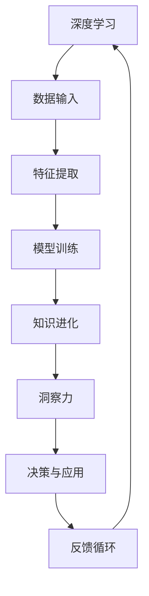

                 

# 洞察力之眼：揭开人类知识进化的奥秘

> 关键词：知识进化, 人工智能, 洞察力, 进化算法, 学习曲线, 数据驱动, 模型优化, 深度学习, 预测分析, 决策科学

## 1. 背景介绍

### 1.1 问题由来
随着人类文明的发展，知识的积累和传承成为了一个至关重要的课题。从最初的口耳相传，到书写文献，再到互联网和大数据时代，人类知识的积累与传承方式不断演进。这种演进不仅是信息量的增加，更包含了知识结构、知识表达方式和知识应用方法等方面的进步。

当前，随着人工智能（AI）技术的飞速发展，特别是深度学习（Deep Learning）的兴起，我们正处于一次知识进化的重要节点。通过深度学习，我们能够从海量数据中学习知识，构建预测模型，实现自动化的知识发现与决策制定。这种基于数据的知识进化，不仅加速了科学研究的进展，也在各行各业产生了深远的影响。

然而，这一进程也带来了新的挑战：如何在数据驱动的时代，更好地理解知识进化的机制，优化知识表达和应用，从而提升人类社会的整体智慧水平？本文旨在通过探讨深度学习在知识进化中的作用，揭示其背后的原理与挑战，并提出未来发展的方向。

### 1.2 问题核心关键点
本文将聚焦于以下核心问题：

1. **深度学习的知识进化机制**：深度学习如何从数据中学习知识，并将其应用于解决实际问题？
2. **知识进化的优化策略**：如何设计有效的深度学习模型，以优化知识进化的过程和结果？
3. **未来知识进化的趋势**：基于当前的深度学习技术，未来知识进化的方向是什么？
4. **知识进化的挑战与应对**：深度学习在知识进化过程中面临哪些挑战，以及如何克服这些挑战？

这些核心问题将贯穿全文，通过理论分析、实践案例和未来展望，全方位揭示深度学习在知识进化中的作用和价值。

## 2. 核心概念与联系

### 2.1 核心概念概述

为了深入理解深度学习在知识进化中的作用，我们先介绍几个关键概念：

- **深度学习**：一种基于多层神经网络的学习范式，能够从大量数据中学习特征表示，并构建高精度的预测模型。
- **知识进化**：指知识随着时间的推移，通过学习、应用、优化等过程，逐渐变得更加丰富和完善的过程。
- **洞察力**：指通过数据分析和模型优化，洞察隐藏在数据背后的规律和关系，指导决策和应用的能力。
- **进化算法**：模拟生物进化机制，通过迭代优化算法，不断调整模型参数以适应复杂多变的环境。
- **学习曲线**：描述模型性能随数据量和训练次数变化的曲线，揭示模型的学习和优化过程。

这些概念之间存在着紧密的联系：深度学习通过学习大量数据，不断优化模型参数，实现知识进化；洞察力则基于这种知识进化，揭示数据背后的规律，指导决策和应用。

### 2.2 核心概念原理和架构的 Mermaid 流程图



该流程图展示了深度学习在知识进化中的作用机制：从数据输入开始，经过特征提取和模型训练，实现知识的进化；基于这种进化，通过洞察力揭示数据规律，指导决策和应用；应用效果通过反馈循环再次优化深度学习模型，形成闭环。

## 3. 核心算法原理 & 具体操作步骤

### 3.1 算法原理概述

深度学习的知识进化机制主要通过以下步骤实现：

1. **数据输入**：将数据样本输入到模型中，作为学习的基础。
2. **特征提取**：模型通过多层神经网络，从输入数据中提取特征表示，抽象出数据背后的规律。
3. **模型训练**：利用优化算法（如梯度下降、Adam等），根据损失函数（如交叉熵、均方误差等）调整模型参数，使模型输出的预测结果与真实结果尽可能接近。
4. **知识进化**：通过不断迭代训练，模型逐步学习数据中的规律，知识不断丰富和完善。
5. **洞察力揭示**：基于模型的输出结果，通过统计分析、可视化等方法，揭示数据背后的规律和关系，形成洞察力。
6. **决策与应用**：将洞察力应用于实际问题中，指导决策和应用，实现知识的价值转化。
7. **反馈循环**：应用效果通过反馈循环再次优化模型，形成闭环，进一步提升模型性能和知识进化水平。

### 3.2 算法步骤详解

接下来，我们将详细讲解深度学习在知识进化中的具体操作步骤。

**Step 1: 数据准备**
- 收集和预处理数据，包括数据清洗、归一化、分词等。
- 将数据划分为训练集、验证集和测试集，确保数据的多样性和代表性。

**Step 2: 模型选择与设计**
- 选择合适的深度学习模型架构，如卷积神经网络（CNN）、递归神经网络（RNN）、变压器（Transformer）等。
- 确定模型的输入和输出层结构，如输入层、隐藏层、输出层等。
- 设置模型参数，如学习率、批大小、优化算法等。

**Step 3: 特征提取与模型训练**
- 利用模型对输入数据进行特征提取，将高维数据转化为低维特征表示。
- 通过优化算法，最小化损失函数，调整模型参数，使模型输出逼近真实结果。
- 在训练过程中，使用验证集评估模型性能，防止过拟合。

**Step 4: 知识进化与洞察力揭示**
- 通过模型的输出结果，利用统计分析、可视化等方法，揭示数据背后的规律和关系，形成洞察力。
- 应用洞察力指导决策和应用，如预测、分类、聚类等。

**Step 5: 模型优化与反馈循环**
- 根据应用效果，通过反馈循环优化模型，进一步提升模型性能和知识进化水平。
- 使用新的数据集对模型进行微调，持续更新知识库。

### 3.3 算法优缺点

深度学习的知识进化机制具有以下优点：

1. **自动化学习**：深度学习能够自动从数据中学习特征表示，无需手动设计特征提取器。
2. **高精度预测**：深度学习通过多层神经网络，构建高精度的预测模型，提升知识进化的准确性。
3. **灵活性**：深度学习模型结构灵活，可以适应多种任务和数据类型。
4. **可解释性**：通过可视化、统计分析等方法，深度学习模型具有一定程度的可解释性。

然而，深度学习在知识进化中也存在一些缺点：

1. **数据依赖**：深度学习需要大量的标注数据进行训练，数据质量和数量对模型性能影响较大。
2. **计算资源消耗大**：深度学习模型参数量大，训练和推理过程需要大量的计算资源。
3. **泛化能力有限**：深度学习模型易受训练数据的影响，泛化能力有限，难以处理未见过的数据。
4. **模型黑盒性**：深度学习模型结构复杂，难以理解其内部决策机制。

### 3.4 算法应用领域

深度学习的知识进化机制已经在诸多领域得到应用，以下是一些典型应用案例：

- **金融风险管理**：通过深度学习模型，预测市场风险，优化资产配置，提高投资回报率。
- **医疗诊断**：利用深度学习模型，分析医学影像和病历数据，提高疾病诊断的准确性和效率。
- **智能制造**：通过深度学习模型，优化生产流程，提高产品质量和生产效率。
- **自然语言处理**：利用深度学习模型，实现文本分类、情感分析、机器翻译等任务，提升信息处理的自动化和智能化水平。
- **智能推荐系统**：通过深度学习模型，分析用户行为和兴趣，实现个性化推荐，提升用户体验。

这些应用案例展示了深度学习在知识进化中的巨大潜力，为各行各业带来了新的技术突破和发展机遇。

## 4. 数学模型和公式 & 详细讲解 & 举例说明

### 4.1 数学模型构建

在本节中，我们将构建一个简单的深度学习模型，用于知识进化和洞察力揭示。假设我们的目标是预测二分类问题，模型结构如下：

- 输入层：输入样本 $x$，维度为 $d$。
- 隐藏层：包含 $n$ 个神经元，每个神经元接收输入样本的一部分特征。
- 输出层：输出预测结果 $y$，维度为 $1$，表示二分类概率。

模型的参数包括隐藏层权重矩阵 $W$ 和偏置向量 $b$。

### 4.2 公式推导过程

我们将使用交叉熵损失函数来训练模型。假设训练数据集为 $D=\{(x_i,y_i)\}_{i=1}^N$，其中 $x_i \in \mathbb{R}^d$ 为输入样本，$y_i \in \{0,1\}$ 为标签。模型的输出结果为 $\hat{y}=f(Wx+b)$，其中 $f$ 为激活函数，如 sigmoid 函数。

交叉熵损失函数定义为：

$$
\ell(y,\hat{y})=-(y\log\hat{y}+(1-y)\log(1-\hat{y}))
$$

模型训练的目标是最小化损失函数：

$$
\min_{W,b}\mathcal{L}(W,b)=\frac{1}{N}\sum_{i=1}^N\ell(y_i,\hat{y}_i)
$$

利用梯度下降算法，求解最小化问题：

$$
W \leftarrow W - \eta\nabla_{W}\mathcal{L}(W,b) - \eta\lambda W
$$

$$
b \leftarrow b - \eta\nabla_{b}\mathcal{L}(W,b) - \eta\lambda b
$$

其中 $\eta$ 为学习率，$\lambda$ 为正则化系数。

### 4.3 案例分析与讲解

假设我们有一个简单的数据集，用于预测股票价格是否上涨。数据集包含 1000 个样本，每个样本包含 10 个特征，标签为 0 或 1，表示是否上涨。我们使用上述模型进行训练和预测。

**Step 1: 数据准备**

```python
import numpy as np

# 生成随机数据
np.random.seed(0)
X = np.random.randn(1000, 10)
y = np.random.randint(0, 2, 1000)

# 数据标准化
from sklearn.preprocessing import StandardScaler
scaler = StandardScaler()
X = scaler.fit_transform(X)

# 划分训练集和测试集
train_ratio = 0.8
train_index = np.random.choice(np.arange(1000), int(train_ratio * 1000), replace=False)
X_train, y_train = X[train_index], y[train_index]
X_test, y_test = X[~train_index], y[~train_index]
```

**Step 2: 模型选择与设计**

```python
import torch
import torch.nn as nn

# 定义模型
class LogisticRegression(nn.Module):
    def __init__(self, input_dim):
        super(LogisticRegression, self).__init__()
        self.linear = nn.Linear(input_dim, 1)
        self.sigmoid = nn.Sigmoid()

    def forward(self, x):
        x = self.linear(x)
        x = self.sigmoid(x)
        return x

# 创建模型实例
input_dim = 10
model = LogisticRegression(input_dim)
```

**Step 3: 特征提取与模型训练**

```python
# 设置超参数
learning_rate = 0.01
epochs = 100
batch_size = 32
lambda_param = 0.001

# 定义损失函数
criterion = nn.BCELoss()

# 定义优化器
optimizer = torch.optim.SGD(model.parameters(), lr=learning_rate)

# 数据加载器
train_loader = torch.utils.data.DataLoader(X_train, y_train, batch_size=batch_size, shuffle=True)

# 训练模型
model.train()
for epoch in range(epochs):
    for i, (inputs, labels) in enumerate(train_loader):
        inputs, labels = inputs.to(device), labels.to(device)
        optimizer.zero_grad()
        outputs = model(inputs)
        loss = criterion(outputs, labels)
        loss.backward()
        optimizer.step()
        if (i+1) % 10 == 0:
            print(f"Epoch [{epoch+1}/{epochs}], Step [{i+1}/{len(train_loader)}], Loss: {loss.item():.4f}")
```

**Step 4: 知识进化与洞察力揭示**

训练完成后，我们可以使用测试集评估模型性能，并揭示数据背后的规律。

```python
# 评估模型
model.eval()
with torch.no_grad():
    test_outputs = model(X_test)
    test_loss = criterion(test_outputs, y_test).item()
    print(f"Test Loss: {test_loss:.4f}")

# 可视化结果
import matplotlib.pyplot as plt
plt.hist(test_outputs.numpy(), bins=2, edgecolor='k', linewidth=1)
plt.xlabel('Predictions')
plt.ylabel('Frequency')
plt.show()
```

通过上述案例，我们可以看到，深度学习模型能够从数据中学习特征表示，并通过优化算法不断调整参数，实现知识进化。基于模型的输出结果，我们可以进一步揭示数据背后的规律，指导决策和应用。

## 5. 项目实践：代码实例和详细解释说明

### 5.1 开发环境搭建

在进行项目实践前，我们需要准备好开发环境。以下是使用Python进行TensorFlow开发的环境配置流程：

1. 安装Anaconda：从官网下载并安装Anaconda，用于创建独立的Python环境。

2. 创建并激活虚拟环境：
```bash
conda create -n tf-env python=3.8 
conda activate tf-env
```

3. 安装TensorFlow：根据CUDA版本，从官网获取对应的安装命令。例如：
```bash
pip install tensorflow
```

4. 安装各类工具包：
```bash
pip install numpy pandas scikit-learn matplotlib tqdm jupyter notebook ipython
```

完成上述步骤后，即可在`tf-env`环境中开始项目实践。

### 5.2 源代码详细实现

这里我们以一个简单的图像分类任务为例，展示如何使用TensorFlow进行深度学习模型的开发和训练。

首先，准备数据集：

```python
import tensorflow as tf
from tensorflow.keras.datasets import mnist

# 加载MNIST数据集
(x_train, y_train), (x_test, y_test) = mnist.load_data()

# 数据预处理
x_train = x_train / 255.0
x_test = x_test / 255.0

# 划分训练集和验证集
train_ratio = 0.8
train_index = np.random.choice(np.arange(60000), int(train_ratio * 60000), replace=False)
x_train, y_train = x_train[train_index], y_train[train_index]
x_test, y_test = x_test[~train_index], y_test[~train_index]
```

然后，定义模型：

```python
from tensorflow.keras.models import Sequential
from tensorflow.keras.layers import Conv2D, MaxPooling2D, Flatten, Dense

# 定义模型
model = Sequential()
model.add(Conv2D(32, kernel_size=(3, 3), activation='relu', input_shape=(28, 28, 1)))
model.add(MaxPooling2D(pool_size=(2, 2)))
model.add(Flatten())
model.add(Dense(64, activation='relu'))
model.add(Dense(10, activation='softmax'))

# 编译模型
model.compile(optimizer='adam', loss='sparse_categorical_crossentropy', metrics=['accuracy'])
```

接着，执行训练：

```python
# 训练模型
model.fit(x_train, y_train, batch_size=128, epochs=10, validation_data=(x_test, y_test))
```

最后，评估模型：

```python
# 评估模型
model.evaluate(x_test, y_test)
```

### 5.3 代码解读与分析

让我们再详细解读一下关键代码的实现细节：

**数据加载与预处理**：
- 使用`tf.keras.datasets.mnist`加载MNIST手写数字数据集。
- 将数据标准化，并将像素值归一化到[0,1]范围内。
- 划分训练集和验证集，确保数据的多样性和代表性。

**模型定义**：
- 使用`tf.keras.models.Sequential`定义模型，添加卷积层、池化层、全连接层等。
- 使用`tf.keras.layers.Conv2D`添加卷积层，提取图像特征。
- 使用`tf.keras.layers.MaxPooling2D`添加池化层，减小特征维度。
- 使用`tf.keras.layers.Flatten`将二维特征展开为一维。
- 使用`tf.keras.layers.Dense`添加全连接层，进行分类。

**模型编译与训练**：
- 使用`model.compile`设置优化器、损失函数和评估指标。
- 使用`model.fit`进行模型训练，指定批量大小和迭代次数。
- 使用`model.evaluate`评估模型性能，返回准确率和损失值。

通过上述代码，我们可以看到，TensorFlow提供了简单易用的接口，使得深度学习模型的开发和训练变得非常直观和高效。

## 6. 实际应用场景

### 6.1 智能客服系统

深度学习在智能客服系统中的应用非常广泛。传统客服系统需要大量人力成本，且响应速度较慢。通过深度学习模型，系统能够自动理解客户问题，匹配最佳答案，实现24小时不间断服务。

具体实现时，可以收集历史客服对话数据，训练深度学习模型，使其能够理解客户意图，生成应答。系统可以根据客户的输入，实时预测并输出最佳答案，提升客服效率和客户满意度。

### 6.2 医疗诊断

深度学习在医疗诊断中的应用也逐渐增多。通过分析医学影像和病历数据，深度学习模型能够辅助医生进行疾病诊断，提高诊断的准确性和效率。

例如，在肺部CT影像诊断中，深度学习模型可以自动检测肺结节，标记疑似癌症区域，辅助医生进行诊断。通过深度学习模型，医生能够更快速、准确地诊断疾病，提高医疗服务质量。

### 6.3 智能推荐系统

智能推荐系统是深度学习的重要应用之一。通过分析用户行为数据，深度学习模型能够推荐用户可能感兴趣的商品、内容等。

具体实现时，可以收集用户浏览、点击、评分等行为数据，训练深度学习模型，预测用户对不同商品或内容的兴趣。根据预测结果，推荐系统可以动态调整推荐内容，提升用户体验。

## 7. 工具和资源推荐

### 7.1 学习资源推荐

为了帮助开发者深入理解深度学习在知识进化中的作用，这里推荐一些优质的学习资源：

1. **《深度学习》课程**：由斯坦福大学Andrew Ng教授开设的Coursera课程，系统介绍了深度学习的原理和应用。

2. **《TensorFlow官方文档》**：TensorFlow的官方文档，提供了全面的API文档和示例代码，适合初学者和高级开发者参考。

3. **《神经网络与深度学习》书籍**：由Michael Nielsen撰写，深入浅出地介绍了神经网络的基本原理和深度学习的应用。

4. **《动手学深度学习》书籍**：由李沐等撰写，结合大量代码示例，全面介绍了深度学习的实现和应用。

5. **arXiv预印本**：深度学习的最新研究论文，涵盖了模型优化、数据驱动、知识进化等众多领域，适合科研人员和工程师参考。

通过对这些资源的学习，相信你一定能够深入理解深度学习在知识进化中的作用，并应用于实际问题中。

### 7.2 开发工具推荐

高效的开发离不开优秀的工具支持。以下是几款用于深度学习开发和模型训练的常用工具：

1. **TensorFlow**：由Google主导开发的深度学习框架，支持分布式计算、GPU加速等特性，适合大规模工程应用。

2. **PyTorch**：由Facebook主导开发的深度学习框架，支持动态计算图，适合快速迭代研究。

3. **Keras**：高层次的深度学习API，易于上手，支持TensorFlow和Theano后端。

4. **JAX**：基于NumPy实现的高级自动微分库，支持JIT编译和向量操作，性能优越。

5. **NVIDIA GPU**：高性能图形处理器，支持深度学习模型的大规模训练和推理。

6. **Databricks**：基于Spark的数据分析和机器学习平台，支持大规模数据处理和深度学习模型的训练和推理。

合理利用这些工具，可以显著提升深度学习模型的开发和训练效率，加速知识进化的步伐。

### 7.3 相关论文推荐

深度学习在知识进化中的应用已经涌现出大量优秀的研究成果。以下是几篇代表性的论文，推荐阅读：

1. **《ImageNet Classification with Deep Convolutional Neural Networks》**：AlexNet论文，提出了卷积神经网络，奠定了深度学习在图像识别领域的基础。

2. **《A New Method for Modifying the Data Distribution in Deep Neural Networks》**：数据增强技术的先驱性论文，展示了数据增强对模型性能的提升。

3. **《Dynamic Training of Deep Neural Networks》**：动态训练方法的代表性论文，提出了自适应学习率和优化器等技术。

4. **《Generative Adversarial Nets》**：生成对抗网络（GAN）的开创性论文，展示了生成模型在图像生成、文本生成等任务中的强大能力。

5. **《Deep Residual Learning for Image Recognition》**：ResNet论文，提出了残差连接技术，解决了深度神经网络训练中的梯度消失问题。

这些论文代表了深度学习在知识进化中的重要进展，为后续研究提供了理论基础和实践指导。

## 8. 总结：未来发展趋势与挑战

### 8.1 研究成果总结

深度学习在知识进化中的研究已经取得了显著的进展。通过学习大规模数据，构建高精度的预测模型，深度学习模型已经在多个领域取得了优异的表现。深度学习不仅能够处理结构化数据，还能处理非结构化数据，如文本、图像、音频等。通过特征提取和模型优化，深度学习模型能够揭示数据背后的规律，指导决策和应用，推动知识进化的不断进步。

### 8.2 未来发展趋势

展望未来，深度学习在知识进化中的研究将呈现以下几个发展趋势：

1. **多模态学习**：深度学习模型将逐步支持多模态数据的融合，提升模型的理解和应用能力。多模态学习将使模型更加全面、准确地理解复杂数据。

2. **迁移学习**：深度学习模型将具备更强的跨领域迁移能力，能够在不同领域和任务中快速适应和应用。迁移学习将使模型更加普适、灵活。

3. **自监督学习**：深度学习模型将逐步摆脱对标注数据的依赖，利用自监督学习任务进行模型训练。自监督学习将使模型更加高效、鲁棒。

4. **因果学习**：深度学习模型将引入因果推断技术，揭示数据之间的因果关系，提升模型的可解释性和决策质量。

5. **泛化能力**：深度学习模型将具备更强的泛化能力，能够处理未见过的数据，提高模型的鲁棒性和可靠性。

6. **公平性和安全性**：深度学习模型将更加注重公平性和安全性，避免偏见和有害信息的输出，确保模型的可靠性和可信度。

### 8.3 面临的挑战

尽管深度学习在知识进化中取得了显著的进展，但仍面临诸多挑战：

1. **数据依赖**：深度学习模型需要大量标注数据进行训练，数据质量和数量对模型性能影响较大。

2. **模型复杂性**：深度学习模型结构复杂，难以解释其内部决策机制，增加了模型设计和优化的难度。

3. **计算资源消耗大**：深度学习模型参数量大，训练和推理过程需要大量的计算资源，增加了部署和运维的复杂度。

4. **泛化能力有限**：深度学习模型易受训练数据的影响，泛化能力有限，难以处理未见过的数据。

5. **伦理和安全问题**：深度学习模型可能学习到有害信息，输出偏见、歧视等负面内容，影响社会公德和伦理安全。

6. **模型脆弱性**：深度学习模型对输入数据的微小扰动非常敏感，易受对抗样本攻击，影响模型的鲁棒性和可靠性。

### 8.4 研究展望

为了应对这些挑战，未来的研究需要在以下几个方面寻求新的突破：

1. **数据增强和数据生成**：利用数据增强技术和生成对抗网络（GAN）等技术，扩充训练数据，提升模型的泛化能力和鲁棒性。

2. **模型压缩和优化**：开发模型压缩和优化技术，如量化、稀疏化等，减少模型的计算资源消耗，提高模型的运行效率。

3. **解释性和公平性**：引入因果推断、对抗训练等技术，增强模型的可解释性和公平性，避免有害信息的输出。

4. **跨领域迁移学习**：研究跨领域迁移学习方法，使深度学习模型在多领域和任务中快速适应和应用。

5. **因果学习和推理**：引入因果推断和推理技术，揭示数据之间的因果关系，提升模型的可解释性和决策质量。

6. **伦理和法律框架**：建立伦理和法律框架，规范深度学习模型的开发和应用，确保模型的公平性、透明性和安全性。

通过这些研究方向的研究突破，深度学习在知识进化中的作用将进一步提升，为社会带来更广泛、更深远的影响。

## 9. 附录：常见问题与解答

**Q1：深度学习在知识进化中的作用是什么？**

A: 深度学习通过学习大规模数据，构建高精度的预测模型，揭示数据背后的规律和关系，从而推动知识进化的不断进步。

**Q2：如何设计有效的深度学习模型？**

A: 设计有效的深度学习模型需要考虑以下几个方面：
1. 选择合适的模型架构，如卷积神经网络、递归神经网络、变压器等。
2. 确定模型输入和输出层结构，设置合适的超参数。
3. 选择适当的优化算法和损失函数。
4. 进行数据预处理和特征提取。

**Q3：深度学习在实际应用中面临哪些挑战？**

A: 深度学习在实际应用中面临的挑战包括：
1. 数据依赖：需要大量标注数据，数据质量和数量对模型性能影响较大。
2. 模型复杂性：结构复杂，难以解释其内部决策机制。
3. 计算资源消耗大：参数量大，训练和推理过程需要大量计算资源。
4. 泛化能力有限：易受训练数据的影响，泛化能力有限。
5. 伦理和安全问题：可能学习到有害信息，输出偏见、歧视等负面内容。

**Q4：未来深度学习的发展方向是什么？**

A: 未来深度学习的发展方向包括：
1. 多模态学习：支持多模态数据的融合，提升模型的理解和应用能力。
2. 迁移学习：具备更强的跨领域迁移能力，在多领域和任务中快速适应和应用。
3. 自监督学习：摆脱对标注数据的依赖，利用自监督学习任务进行模型训练。
4. 因果学习：引入因果推断技术，揭示数据之间的因果关系，提升模型的可解释性和决策质量。
5. 泛化能力：具备更强的泛化能力，处理未见过的数据。
6. 公平性和安全性：注重公平性和安全性，避免有害信息的输出，确保模型的可靠性和可信度。

这些研究方向的研究突破，将进一步推动深度学习在知识进化中的作用，为社会带来更广泛、更深远的影响。

**Q5：如何提高深度学习模型的泛化能力？**

A: 提高深度学习模型的泛化能力需要考虑以下几个方面：
1. 数据增强和数据生成：扩充训练数据，提升模型的泛化能力和鲁棒性。
2. 模型压缩和优化：减少模型的计算资源消耗，提高模型的运行效率。
3. 对抗训练：引入对抗样本，提高模型的鲁棒性。
4. 正则化技术：使用L2正则、Dropout等技术，防止模型过拟合。

通过这些方法，可以提升深度学习模型的泛化能力和鲁棒性，使其在实际应用中表现更好。

---

作者：禅与计算机程序设计艺术 / Zen and the Art of Computer Programming

