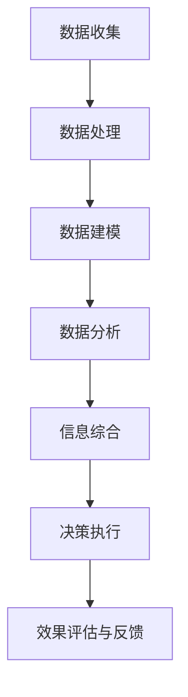

                 

# 洞察力的培养：观察、分析与综合能力

## 1. 背景介绍

### 1.1 问题由来
在当今信息爆炸、竞争激烈的时代，洞察力成为了各行各业成功的关键因素。无论是商业决策、科技研发还是社会管理，洞察力都是快速适应变化、获取竞争优势的重要工具。然而，如何在海量数据中提取关键信息，在复杂情境中做出明智决策，成为了一个难题。

洞察力不仅仅是直觉和经验的产物，而是通过系统化的观察、分析和综合能力培养出来的。本文将从原理和实践两个层面，深入探讨如何培养和提升洞察力。

### 1.2 问题核心关键点
培养洞察力的核心在于如何从数据和情境中获取关键信息，并将其综合为可执行的决策。具体而言，包括以下几个关键点：

- **数据收集**：获取准确、全面的数据是洞察力的基础。
- **数据处理**：清洗、整理和分析数据，提取有用信息。
- **信息综合**：将数据转化为可操作的洞察，并根据情境进行综合。
- **决策执行**：将洞察转化为行动，并评估其效果。

## 2. 核心概念与联系

### 2.1 核心概念概述

为更好地理解洞察力的培养过程，本节将介绍几个关键概念及其联系：

- **数据收集**：通过各种方法获取相关信息，如调查问卷、网络爬虫、传感器等。
- **数据处理**：对原始数据进行清洗、归一化、特征提取等操作，以便后续分析。
- **数据建模**：使用统计、机器学习等方法，构建数据模型，描述数据分布和关系。
- **数据分析**：通过可视化、假设检验、回归分析等方法，对数据模型进行解读，提取关键信息。
- **信息综合**：将分析结果综合为可操作的知识，如决策支持、预测、风险评估等。
- **决策执行**：根据洞察制定策略，并执行行动，同时对执行效果进行评估和反馈。

这些核心概念之间的逻辑关系可以通过以下Mermaid流程图来展示：



这个流程图展示了大洞察力的培养过程，每个步骤都有其重要作用，且相互依赖：

1. 数据收集是洞察力的基础，提供了分析的对象。
2. 数据处理保证了分析的准确性，提取有用信息。
3. 数据建模描述了数据的本质，为分析提供结构。
4. 数据分析揭示了数据背后的趋势和模式，提供了洞察的依据。
5. 信息综合将数据转化为可执行的知识，指导决策。
6. 决策执行将洞察转化为行动，检验和优化洞察的准确性。

### 2.2 核心算法原理

洞察力的培养过程中，算法原理和数学模型起着至关重要的作用。通过合理地设计和应用算法，可以从数据中提取出有价值的洞察，支持决策过程。

#### 2.2.1 算法原理概述

洞察力的培养过程中，常用的算法包括但不限于以下几种：

- **统计分析算法**：如均值、方差、相关性分析等，用于描述数据分布和关系。
- **机器学习算法**：如回归、分类、聚类等，用于预测和分类数据。
- **数据可视化算法**：如散点图、直方图、热图等，用于揭示数据背后的趋势和模式。
- **优化算法**：如梯度下降、遗传算法等，用于寻找最优的决策策略。

这些算法通常结合使用，以确保从数据中获取全面的洞察，并支持决策的执行。

#### 2.2.2 算法步骤详解

以机器学习算法为例，其步骤如下：

1. **数据准备**：收集、清洗和预处理数据。
2. **特征选择**：从原始数据中选择最相关的特征，构建特征集。
3. **模型训练**：使用训练数据集训练模型，得到模型参数。
4. **模型评估**：使用测试数据集评估模型性能，调整参数以优化模型。
5. **模型应用**：将模型应用于新数据，得到预测结果。

这些步骤通过迭代优化，逐步提高模型的准确性和泛化能力，为决策提供有力支持。

### 2.3 算法优缺点

- **优点**：
  - 数据驱动：通过算法处理数据，能够客观地提取洞察，减少人为偏差。
  - 灵活性高：可以根据问题特点选择不同的算法，进行灵活组合。
  - 可解释性：部分算法具有可解释性，便于理解和优化。

- **缺点**：
  - 数据依赖：算法的有效性依赖于数据的质量和数量。
  - 模型复杂：部分算法模型复杂，需要较多的计算资源和时间。
  - 过度拟合：模型过度拟合训练数据，可能无法泛化到新数据。

### 2.4 算法应用领域

洞察力的培养算法在多个领域都有广泛的应用，包括但不限于：

- **商业分析**：通过市场调研和销售数据，提取市场趋势和客户需求。
- **金融分析**：通过财务报表和市场数据，预测股票走势和投资回报。
- **医疗分析**：通过患者数据和临床实验，发现疾病模式和治疗效果。
- **环境监测**：通过传感器和卫星数据，评估环境变化和污染水平。

## 3. 核心算法原理 & 具体操作步骤

### 3.1 算法原理概述

洞察力的培养过程中，算法原理和数学模型起着至关重要的作用。通过合理地设计和应用算法，可以从数据中提取出有价值的洞察，支持决策过程。

#### 3.1.1 算法原理概述

洞察力的培养过程中，常用的算法包括但不限于以下几种：

- **统计分析算法**：如均值、方差、相关性分析等，用于描述数据分布和关系。
- **机器学习算法**：如回归、分类、聚类等，用于预测和分类数据。
- **数据可视化算法**：如散点图、直方图、热图等，用于揭示数据背后的趋势和模式。
- **优化算法**：如梯度下降、遗传算法等，用于寻找最优的决策策略。

这些算法通常结合使用，以确保从数据中获取全面的洞察，并支持决策的执行。

#### 3.1.2 算法步骤详解

以机器学习算法为例，其步骤如下：

1. **数据准备**：收集、清洗和预处理数据。
2. **特征选择**：从原始数据中选择最相关的特征，构建特征集。
3. **模型训练**：使用训练数据集训练模型，得到模型参数。
4. **模型评估**：使用测试数据集评估模型性能，调整参数以优化模型。
5. **模型应用**：将模型应用于新数据，得到预测结果。

这些步骤通过迭代优化，逐步提高模型的准确性和泛化能力，为决策提供有力支持。

### 3.2 算法步骤详解

#### 3.2.1 数据准备

数据准备是洞察力培养的基础步骤。通过系统化的数据收集和预处理，能够确保数据的完整性和准确性。

1. **数据收集**：
   - 使用调查问卷、网络爬虫、传感器等方法，获取相关信息。
   - 确保数据来源广泛且多样，覆盖不同的场景和情境。

2. **数据清洗**：
   - 处理缺失值、异常值和重复数据，保证数据的一致性。
   - 对数据进行归一化、标准化等预处理，确保数值尺度一致。

3. **特征提取**：
   - 从原始数据中选择最相关的特征，构建特征集。
   - 使用统计方法、特征工程等技术，优化特征集合。

#### 3.2.2 特征选择

特征选择是洞察力培养的关键步骤。通过合理的特征选择，可以从数据中提取出最相关的信息，减少噪声和冗余。

1. **特征工程**：
   - 使用降维算法、主成分分析（PCA）等方法，减少特征维度。
   - 对特征进行编码和归一化，确保数值尺度一致。

2. **特征选择算法**：
   - 使用方差选择、相关系数选择等方法，自动筛选重要特征。
   - 使用LASSO、Ridge等正则化方法，约束特征数量和权重。

#### 3.2.3 模型训练

模型训练是洞察力培养的核心步骤。通过训练模型，能够从数据中提取规律和趋势，得到可操作的洞察。

1. **模型选择**：
   - 根据问题特点选择最合适的模型，如线性回归、决策树、随机森林等。
   - 考虑模型的复杂度和可解释性，综合考虑算法性能和实际需求。

2. **模型训练**：
   - 使用训练数据集训练模型，优化模型参数。
   - 使用梯度下降、Adam等优化算法，最小化损失函数。

3. **交叉验证**：
   - 使用交叉验证方法，评估模型性能。
   - 避免过拟合，提高模型的泛化能力。

#### 3.2.4 模型评估

模型评估是洞察力培养的评估步骤。通过评估模型性能，能够判断模型是否适合解决实际问题。

1. **性能指标**：
   - 使用准确率、召回率、F1分数等指标，评估模型性能。
   - 考虑模型的预测效果、鲁棒性和泛化能力。

2. **模型调优**：
   - 根据评估结果调整模型参数，优化模型性能。
   - 使用网格搜索、随机搜索等方法，寻找最优参数组合。

#### 3.2.5 模型应用

模型应用是洞察力培养的执行步骤。通过模型应用，能够将洞察转化为实际行动，并评估其效果。

1. **预测**：
   - 使用训练好的模型，对新数据进行预测。
   - 使用模型得到的预测结果，支持决策和行动。

2. **效果评估**：
   - 对模型应用的实际效果进行评估。
   - 收集反馈信息，优化模型和决策策略。

### 3.3 算法优缺点

- **优点**：
  - 数据驱动：通过算法处理数据，能够客观地提取洞察，减少人为偏差。
  - 灵活性高：可以根据问题特点选择不同的算法，进行灵活组合。
  - 可解释性：部分算法具有可解释性，便于理解和优化。

- **缺点**：
  - 数据依赖：算法的有效性依赖于数据的质量和数量。
  - 模型复杂：部分算法模型复杂，需要较多的计算资源和时间。
  - 过度拟合：模型过度拟合训练数据，可能无法泛化到新数据。

### 3.4 算法应用领域

洞察力的培养算法在多个领域都有广泛的应用，包括但不限于：

- **商业分析**：通过市场调研和销售数据，提取市场趋势和客户需求。
- **金融分析**：通过财务报表和市场数据，预测股票走势和投资回报。
- **医疗分析**：通过患者数据和临床实验，发现疾病模式和治疗效果。
- **环境监测**：通过传感器和卫星数据，评估环境变化和污染水平。

## 4. 数学模型和公式 & 详细讲解  
### 4.1 数学模型构建

本节将使用数学语言对洞察力的培养过程进行更加严格的刻画。

记数据集为 $D=\{(x_i,y_i)\}_{i=1}^N, x_i \in \mathbb{R}^d, y_i \in \mathbb{R}$，其中 $x_i$ 为输入特征，$y_i$ 为输出标签。定义模型为 $f: \mathbb{R}^d \rightarrow \mathbb{R}$。

定义模型 $f$ 在数据集 $D$ 上的经验风险为：

$$
\mathcal{L}(f) = \frac{1}{N}\sum_{i=1}^N (y_i - f(x_i))^2
$$

其中 $(y_i - f(x_i))$ 为模型的预测误差。

### 4.2 公式推导过程

以线性回归模型为例，其公式推导如下：

1. **最小二乘法**：
   $$
   \min_{\theta} \frac{1}{N}\sum_{i=1}^N (y_i - \theta^T x_i)^2
   $$
   其中 $\theta$ 为模型参数，$x_i$ 为输入特征，$y_i$ 为输出标签。

2. **梯度下降法**：
   $$
   \theta \leftarrow \theta - \eta \nabla_{\theta}\mathcal{L}(\theta)
   $$
   其中 $\eta$ 为学习率，$\nabla_{\theta}\mathcal{L}(\theta)$ 为损失函数对模型参数的梯度。

### 4.3 案例分析与讲解

#### 4.3.1 商业分析案例

某电商平台通过数据收集、清洗和预处理，获取了用户的购买行为数据。通过对用户特征（如年龄、性别、消费金额等）和购买行为（如购买次数、购买频率、购买金额等）进行分析，构建了用户行为模型。使用线性回归模型进行预测，得到不同用户群体的购买行为规律。

#### 4.3.2 金融分析案例

某投资公司收集了历史股票数据，包括开盘价、收盘价、成交量等。通过对历史数据进行清洗、特征提取和模型训练，构建了股票价格预测模型。使用随机森林算法进行预测，得到股票的长期走势和短期波动规律。

## 5. 项目实践：代码实例和详细解释说明

### 5.1 开发环境搭建

在进行洞察力培养的实践前，我们需要准备好开发环境。以下是使用Python进行机器学习开发的环境配置流程：

1. 安装Anaconda：从官网下载并安装Anaconda，用于创建独立的Python环境。

2. 创建并激活虚拟环境：
```bash
conda create -n my_env python=3.8 
conda activate my_env
```

3. 安装必要的Python包：
```bash
pip install numpy pandas scikit-learn matplotlib
```

4. 安装机器学习框架：
```bash
pip install scikit-learn
```

完成上述步骤后，即可在`my_env`环境中开始项目实践。

### 5.2 源代码详细实现

下面我们以线性回归模型为例，给出使用Scikit-learn进行商业分析的Python代码实现。

首先，定义数据处理函数：

```python
import pandas as pd
from sklearn.model_selection import train_test_split

def load_data():
    df = pd.read_csv('data.csv')
    X = df.drop('target', axis=1)
    y = df['target']
    X_train, X_test, y_train, y_test = train_test_split(X, y, test_size=0.2, random_state=42)
    return X_train, X_test, y_train, y_test
```

然后，定义模型训练和评估函数：

```python
from sklearn.linear_model import LinearRegression
from sklearn.metrics import mean_squared_error

def train_model(X_train, y_train):
    model = LinearRegression()
    model.fit(X_train, y_train)
    return model

def evaluate_model(model, X_test, y_test):
    y_pred = model.predict(X_test)
    mse = mean_squared_error(y_test, y_pred)
    rmse = mse ** 0.5
    print(f"RMSE: {rmse:.3f}")
```

接着，启动训练流程并在测试集上评估：

```python
X_train, X_test, y_train, y_test = load_data()

model = train_model(X_train, y_train)
evaluate_model(model, X_test, y_test)
```

以上就是使用Scikit-learn进行线性回归模型训练和评估的完整代码实现。可以看到，通过Scikit-learn，我们可以用相对简洁的代码完成模型的训练和评估。

### 5.3 代码解读与分析

让我们再详细解读一下关键代码的实现细节：

**load_data函数**：
- 使用Pandas库加载数据集，选择特征和标签。
- 使用train_test_split函数将数据集划分为训练集和测试集。

**train_model函数**：
- 定义线性回归模型，使用训练数据集进行训练。
- 返回训练好的模型。

**evaluate_model函数**：
- 使用训练好的模型对测试集进行预测。
- 计算预测误差，并打印均方根误差（RMSE）。

**训练流程**：
- 调用load_data函数加载数据集。
- 调用train_model函数训练线性回归模型。
- 调用evaluate_model函数评估模型性能，并打印RMSE。

可以看到，Scikit-learn封装了大量的机器学习算法，极大地方便了数据科学家的工作。开发者只需要关注业务逻辑，而不必过多关注算法实现的细节。

当然，工业级的系统实现还需考虑更多因素，如模型的保存和部署、超参数的自动搜索、更灵活的模型组合等。但核心的培养范式基本与此类似。

## 6. 实际应用场景

### 6.1 商业决策支持

洞察力的培养在商业决策支持中具有重要应用。通过系统化的数据分析和模型训练，企业可以深入理解市场趋势和客户需求，做出更加明智的决策。

具体而言，企业可以收集市场调研数据、销售数据、客户反馈等，构建综合数据分析模型。通过线性回归、逻辑回归、决策树等算法，挖掘数据背后的规律和趋势，支持定价、促销、库存管理等决策。

### 6.2 金融风险管理

金融行业面临高风险和高波动性，洞察力的培养在金融风险管理中具有重要应用。通过系统化的数据建模和模型训练，金融机构可以评估和预测金融风险，优化投资组合。

具体而言，金融机构可以收集历史交易数据、市场数据、经济指标等，构建风险评估模型。通过回归分析、时间序列分析、蒙特卡洛模拟等算法，评估不同金融产品的风险水平，优化投资组合，实现风险控制和收益最大化。

### 6.3 医疗健康管理

医疗健康行业面临复杂多变的数据，洞察力的培养在医疗健康管理中具有重要应用。通过系统化的数据处理和模型训练，医疗机构可以提升诊疗效果和患者满意度。

具体而言，医疗机构可以收集患者病历、诊疗记录、实验室数据等，构建疾病预测和诊疗模型。通过回归分析、聚类分析、随机森林等算法，预测疾病风险，推荐治疗方案，提升诊疗效果和患者满意度。

### 6.4 环境监测预警

环境监测预警行业面临海量数据和高复杂性，洞察力的培养在环境监测预警中具有重要应用。通过系统化的数据处理和模型训练，环境监测机构可以预测环境变化和污染水平，提供预警和决策支持。

具体而言，环境监测机构可以收集传感器数据、卫星数据、气象数据等，构建环境监测模型。通过时间序列分析、空间分析、聚类分析等算法，预测环境变化趋势，提供预警和决策支持，保护环境生态。

## 7. 工具和资源推荐

### 7.1 学习资源推荐

为了帮助开发者系统掌握洞察力的培养原理和实践技巧，这里推荐一些优质的学习资源：

1. 《Python机器学习》书籍：作者Sebastian Raschka，全面介绍了机器学习基础和实践，适合初学者和进阶者。

2. 《深度学习》书籍：作者Ian Goodfellow，介绍了深度学习理论和实践，适合深入学习深度学习算法。

3. Coursera《机器学习》课程：斯坦福大学Andrew Ng教授主讲，涵盖了机器学习基础和高级算法。

4. Kaggle数据科学竞赛：提供海量真实数据和竞赛题目，锻炼数据处理和模型训练能力。

5. GitHub开源项目：GitHub上丰富的开源项目，提供了大量实际案例和代码实现。

通过对这些资源的学习实践，相信你一定能够快速掌握洞察力的培养方法，并用于解决实际的数据分析问题。

### 7.2 开发工具推荐

高效的开发离不开优秀的工具支持。以下是几款用于洞察力培养开发的常用工具：

1. Jupyter Notebook：轻量级的数据科学开发环境，支持Python、R等语言，适合编写和执行代码。

2. Pandas：Python数据处理库，提供高效的数据清洗、转换和分析功能。

3. Matplotlib：Python数据可视化库，支持绘制各种图表，帮助直观理解数据。

4. Scikit-learn：Python机器学习库，提供丰富的算法和模型，适合数据建模和训练。

5. TensorFlow：Google开发的深度学习框架，支持GPU加速，适合大规模模型训练。

6. PyTorch：Facebook开发的深度学习框架，适合动态图和模型训练，易于快速迭代。

合理利用这些工具，可以显著提升洞察力培养任务的开发效率，加快创新迭代的步伐。

### 7.3 相关论文推荐

洞察力培养的研究源于学界的持续研究。以下是几篇奠基性的相关论文，推荐阅读：

1. "An Introduction to Statistical Learning"：作者Gareth James等，全面介绍了统计学习基础和应用，适合数据科学入门。

2. "Deep Learning"：作者Ian Goodfellow等，介绍了深度学习理论和实践，适合深入学习深度学习算法。

3. "Pattern Recognition and Machine Learning"：作者Christopher Bishop，介绍了机器学习理论和应用，适合深入学习机器学习算法。

4. "The Elements of Statistical Learning"：作者Tibshirani等，介绍了统计学习理论和应用，适合深入学习统计学习算法。

5. "Data Science for Business"：作者John W. Foreman，介绍了数据科学在商业中的应用，适合数据科学在实际项目中的应用。

这些论文代表了大洞察力培养技术的发展脉络。通过学习这些前沿成果，可以帮助研究者把握学科前进方向，激发更多的创新灵感。

## 8. 总结：未来发展趋势与挑战

### 8.1 总结

本文对洞察力的培养过程进行了全面系统的介绍。首先阐述了洞察力的重要性，明确了培养洞察力的关键步骤。其次，从原理到实践，详细讲解了数据准备、特征选择、模型训练、模型评估和模型应用的整个流程，并给出了完整的代码实现。同时，本文还广泛探讨了洞察力在商业决策、金融风险管理、医疗健康管理、环境监测预警等多个领域的应用前景，展示了洞察力培养技术的广阔应用范围。

通过本文的系统梳理，可以看到，洞察力的培养技术正在成为数据科学的重要范式，极大地拓展了数据分析的应用边界，推动了各行业的数字化转型。未来，伴随数据科学和人工智能技术的不断发展，洞察力培养必将在更广泛的领域得到应用，为经济社会发展注入新的动力。

### 8.2 未来发展趋势

展望未来，洞察力的培养技术将呈现以下几个发展趋势：

1. 自动化程度提高：随着自动化机器学习（AutoML）技术的发展，洞察力的培养将更加自动化和智能化，减少人工干预和调参的工作量。

2. 多模态数据融合：未来洞察力的培养将更多地融合多模态数据，如文本、图像、声音等，实现更全面、准确的信息整合。

3. 实时化与动态化：随着实时数据流和大数据技术的发展，洞察力的培养将实现实时化和动态化，提供更加及时和准确的信息支持。

4. 可解释性与透明性：未来的洞察力培养将更加注重模型的可解释性和透明性，帮助用户理解模型的决策过程，减少对“黑盒”模型的依赖。

5. 跨领域应用拓展：洞察力的培养将更多地拓展到不同领域，如智能制造、智能农业、智能交通等，推动各行业的智能化发展。

以上趋势凸显了洞察力培养技术的广阔前景。这些方向的探索发展，必将进一步提升数据科学的价值，为各行各业带来新的机遇和挑战。

### 8.3 面临的挑战

尽管洞察力的培养技术已经取得了显著进展，但在迈向更加智能化、普适化应用的过程中，它仍面临着诸多挑战：

1. 数据质量问题：洞察力的培养依赖高质量的数据，但数据获取和清洗工作复杂且耗时。如何高效获取和清洗数据，提高数据质量，是一大难题。

2. 模型复杂性：洞察力的培养过程中，模型的复杂性可能增加，导致计算资源和时间成本增加。如何设计简洁高效的模型，优化资源消耗，是另一大挑战。

3. 可解释性问题：尽管模型自动化程度提高，但用户对模型的可解释性和透明性仍有一定需求。如何实现更可解释的模型，减少“黑盒”模型的不确定性，是一个重要研究方向。

4. 隐私与安全问题：洞察力的培养过程中，如何保护数据隐私和模型安全，避免数据泄露和恶意攻击，是另一大挑战。

5. 实时化要求：随着数据流量的增加，对实时处理和动态更新的需求也在增加。如何实现高效的实时处理和动态更新，是一大挑战。

6. 跨领域融合问题：未来的洞察力培养将更多地拓展到不同领域，如何实现跨领域的数据整合和知识融合，是一大挑战。

正视洞察力培养面临的这些挑战，积极应对并寻求突破，将是大数据分析和人工智能技术走向成熟的必由之路。相信随着学界和产业界的共同努力，这些挑战终将一一被克服，洞察力培养技术必将在构建智能社会中扮演越来越重要的角色。

### 8.4 研究展望

未来的洞察力培养技术需要在以下几个方面寻求新的突破：

1. 自动化技术：进一步提升自动化机器学习（AutoML）技术，减少人工干预和调参的工作量。

2. 多模态融合：设计更多融合多模态数据的模型，实现更全面、准确的信息整合。

3. 实时处理：开发高效实时处理和动态更新的算法，提高洞察力的实时性和动态性。

4. 可解释性研究：设计更多可解释性强的模型，减少“黑盒”模型的不确定性。

5. 隐私保护：开发隐私保护技术，确保数据隐私和模型安全。

6. 跨领域应用：拓展跨领域的数据整合和知识融合，实现跨领域的智能应用。

这些研究方向的探索，必将引领洞察力培养技术迈向更高的台阶，为构建智能社会提供更强大的数据支持和决策支撑。面向未来，洞察力培养技术还需要与其他人工智能技术进行更深入的融合，如知识表示、因果推理、强化学习等，多路径协同发力，共同推动数据分析和智能交互系统的进步。只有勇于创新、敢于突破，才能不断拓展数据分析的边界，让洞察力培养技术更好地造福人类社会。

## 9. 附录：常见问题与解答

**Q1：如何有效地收集和清洗数据？**

A: 数据收集和清洗是洞察力培养的基础，可以采用以下方法：

1. 数据采集：使用API接口、网络爬虫等方法，自动收集数据。

2. 数据清洗：处理缺失值、异常值和重复数据，使用正则表达式、数据标准化等方法，保证数据的一致性。

3. 数据清洗工具：使用Pandas、NumPy等库，提供高效的数据清洗功能。

**Q2：如何选择合适的特征？**

A: 特征选择是洞察力培养的关键步骤，可以采用以下方法：

1. 特征选择算法：使用方差选择、相关系数选择等方法，自动筛选重要特征。

2. 特征工程：使用降维算法、主成分分析（PCA）等方法，减少特征维度。

3. 特征重要性评估：使用随机森林、XGBoost等算法，评估特征重要性。

**Q3：模型训练时如何设置超参数？**

A: 模型训练时，超参数的选择对模型性能有重要影响。可以采用以下方法：

1. 网格搜索：在一定范围内设置多个超参数组合，使用交叉验证评估模型性能。

2. 随机搜索：在一定范围内随机设置超参数组合，使用交叉验证评估模型性能。

3. 自动调参工具：使用Scikit-learn的GridSearchCV、RandomizedSearchCV等工具，自动搜索最优超参数组合。

**Q4：模型评估时需要注意哪些指标？**

A: 模型评估时，需要注意以下指标：

1. 准确率、召回率、F1分数等传统指标。

2. ROC曲线、AUC等评估模型性能的指标。

3. 模型复杂度、泛化能力等评估模型质量的指标。

**Q5：如何处理多模态数据？**

A: 多模态数据处理是洞察力培养的重要方向，可以采用以下方法：

1. 数据融合：将不同模态的数据进行融合，使用特征向量或融合算法，构建多模态数据。

2. 多模态学习：使用多模态学习算法，如多模态深度学习、多模态聚类等，提高多模态数据的建模能力。

**Q6：如何实现实时化与动态化？**

A: 实现实时化与动态化需要以下方法：

1. 实时数据流处理：使用流处理框架，如Apache Kafka、Apache Flink等，处理实时数据。

2. 动态模型训练：使用在线学习算法，如在线梯度下降、增量学习等，实现动态模型训练。

3. 实时可视化：使用实时可视化工具，如Tableau、Grafana等，实时展示数据和模型结果。

---

作者：禅与计算机程序设计艺术 / Zen and the Art of Computer Programming

