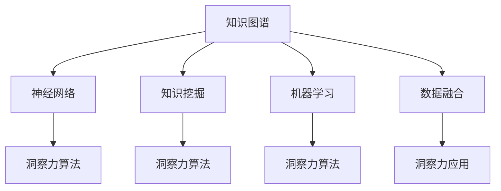

                 

# 洞察力：知识创新的引领者

> 关键词：洞察力, 知识图谱, 神经网络, 知识挖掘, 机器学习, 数据融合, 人工智能

## 1. 背景介绍

在当今数据爆炸的时代，如何从海量数据中挖掘出有价值的知识，成为推动社会进步和经济发展的关键。洞察力（Insight），即在数据中发现规律、模式和趋势的能力，是知识创新的源泉。它不仅要求对数据的理解，更需要对知识本质的深刻洞见。随着信息技术的发展，洞察力逐渐成为决定企业竞争力和创新能力的关键因素。

### 1.1 问题由来

随着人工智能（AI）技术的不断发展，洞察力在数据驱动的决策中扮演着越来越重要的角色。传统的基于统计和规则的决策方式，已无法满足复杂多变的数据环境。机器学习（ML）和深度学习（DL）技术，尤其是神经网络和知识图谱的应用，为洞察力的提升提供了新途径。

然而，尽管AI技术已经取得了显著进展，但在洞察力的获取与应用过程中，仍存在诸多挑战：数据质量参差不齐、知识图谱构建复杂、算法复杂度高等。这些问题的存在，限制了AI在实际应用中的推广和普及。

### 1.2 问题核心关键点

洞察力获取与应用的核心问题在于：
- 如何构建高质量的知识图谱，以支撑复杂的知识推理和关联分析？
- 如何设计高效、灵活的算法，实现数据的自动挖掘与整合？
- 如何确保洞察力的可靠性与可解释性，以支撑实际决策？

本文将从这三个关键点出发，全面系统地介绍洞察力的获取与应用，探索未来发展的趋势与挑战。

## 2. 核心概念与联系

### 2.1 核心概念概述

为更好地理解洞察力获取与应用的过程，本节将介绍几个密切相关的核心概念：

- 知识图谱（Knowledge Graph）：通过节点和边构建知识网络，表示实体之间的复杂关系，是洞察力获取的重要支撑。
- 神经网络（Neural Network）：模拟人类神经系统，通过多层非线性变换实现数据的复杂映射，是洞察力算法的基础。
- 知识挖掘（Knowledge Mining）：从数据中提取、融合和整理知识的过程，是洞察力获取的核心任务。
- 机器学习（Machine Learning）：让机器自动学习规律和模式的技术，是洞察力算法的重要工具。
- 数据融合（Data Fusion）：将来自不同来源的数据进行整合，实现信息的多样化和完备性，是洞察力应用的前提。

这些核心概念之间的逻辑关系可以通过以下Mermaid流程图来展示：



这个流程图展示了几大核心概念及其之间的联系：

1. 知识图谱构建了实体之间的复杂关系网络，为知识挖掘和洞察力算法提供数据支撑。
2. 神经网络作为核心算法，能够实现数据的复杂映射，支持知识的推理与关联分析。
3. 知识挖掘、机器学习与数据融合构成了洞察力获取的基础任务，共同支撑洞察力的生成。
4. 洞察力算法通过多层非线性变换，实现从数据到知识的映射，最终生成有价值的洞察力。
5. 洞察力应用则是将洞察力应用于实际决策过程，指导业务发展的关键环节。

这些概念共同构成了洞察力获取与应用的完整框架，帮助开发者理解洞察力获取与应用的整个过程。

## 3. 核心算法原理 & 具体操作步骤
### 3.1 算法原理概述

洞察力获取与应用的核心在于从数据中提取、融合和整理知识，构建高质量的知识图谱，并通过神经网络算法实现知识的推理与关联分析。这一过程可以概括为以下几个步骤：

1. **数据收集与预处理**：收集来自不同来源的数据，并进行清洗、标注和归一化处理，确保数据的质量和一致性。
2. **知识挖掘与图谱构建**：利用机器学习算法，从数据中提取实体、属性和关系，构建知识图谱，支撑知识的推理与关联分析。
3. **神经网络算法设计**：设计高效的神经网络结构，实现数据的复杂映射，支持知识的推理与关联分析。
4. **知识推理与关联分析**：通过神经网络算法，实现从数据到知识的映射，生成有价值的洞察力。
5. **洞察力应用**：将洞察力应用于实际决策过程，指导业务发展。

### 3.2 算法步骤详解

以下是对洞察力获取与应用的详细步骤详解：

#### 3.2.1 数据收集与预处理

- **数据来源**：数据可能来自多个渠道，如Web爬虫、传感器、数据库等。
- **数据清洗**：去除噪声、缺失值和异常值，保证数据质量。
- **数据标注**：对数据进行标注，如实体识别、属性提取等，为后续知识挖掘提供支持。
- **数据归一化**：对数据进行标准化和归一化处理，确保数据的一致性和可比性。

#### 3.2.2 知识挖掘与图谱构建

- **实体识别**：使用命名实体识别算法，从文本中提取实体，如人名、地名、机构名等。
- **属性提取**：使用关系抽取算法，提取实体之间的属性，如时间、地点、类别等。
- **关系抽取**：使用关系抽取算法，提取实体之间的复杂关系，构建知识图谱。
- **图谱构建**：将提取的实体、属性和关系构建成知识图谱，用于后续的知识推理和关联分析。

#### 3.2.3 神经网络算法设计

- **神经网络结构**：选择适合的神经网络结构，如卷积神经网络（CNN）、循环神经网络（RNN）、Transformer等。
- **网络训练**：使用标记数据训练神经网络，调整网络参数，使其能够实现数据的复杂映射。
- **模型优化**：使用正则化、Dropout等技术，防止过拟合，优化模型性能。

#### 3.2.4 知识推理与关联分析

- **知识推理**：利用知识图谱中的关系，进行逻辑推理，生成新的知识。
- **知识关联分析**：将推理出的知识与原有数据进行关联分析，发现潜在的模式和规律。
- **洞察力生成**：结合推理和关联分析的结果，生成有价值的洞察力。

#### 3.2.5 洞察力应用

- **决策支持**：将洞察力应用于决策支持系统，辅助决策者做出更准确的判断。
- **业务优化**：通过洞察力发现业务流程中的问题和优化机会，提升业务效率。
- **风险管理**：利用洞察力识别潜在风险，制定应对策略，保障业务稳定运行。

### 3.3 算法优缺点

洞察力获取与应用的算法具有以下优点：
- **高效性**：通过神经网络算法，能够高效地处理大规模数据，发现数据中的潜在模式和规律。
- **灵活性**：神经网络算法具有高度的灵活性，可以适应不同的数据分布和业务需求。
- **准确性**：通过知识图谱和逻辑推理，能够生成高度准确的知识，支撑决策支持。

同时，这些算法也存在一些缺点：
- **数据依赖**：算法的效果高度依赖于数据质量，数据噪声和不一致性可能影响洞察力的准确性。
- **模型复杂性**：神经网络算法模型的构建和训练复杂度较高，需要大量计算资源和专业知识。
- **可解释性**：神经网络算法的黑箱性质，使得洞察力的生成过程缺乏可解释性，难以理解和调试。

### 3.4 算法应用领域

洞察力获取与应用技术，已经在众多领域得到了广泛应用：

- **金融风险管理**：利用洞察力发现潜在的金融风险，制定应对策略，保障金融安全。
- **医疗健康**：通过洞察力发现患者病历中的潜在疾病和关联关系，提高诊疗效率和精准度。
- **电商推荐系统**：利用洞察力分析用户行为和商品特性，实现个性化推荐，提升用户体验和销售额。
- **智能交通**：通过洞察力分析交通流量和路况，优化交通管理，提升道路通行效率。
- **智能制造**：利用洞察力发现生产流程中的瓶颈和优化机会，提升生产效率和产品质量。

除了上述这些领域外，洞察力技术还被创新性地应用到更多场景中，如智能客服、供应链管理、智慧城市等，为各行各业带来了变革性的影响。

## 4. 数学模型和公式 & 详细讲解 & 举例说明

### 4.1 数学模型构建

本节将使用数学语言对洞察力获取与应用的过程进行更加严格的刻画。

设数据集为 $D=\{(x_i, y_i)\}_{i=1}^N$，其中 $x_i$ 表示数据样本，$y_i$ 表示标注标签。定义知识图谱为 $G=(V, E)$，其中 $V$ 为实体节点集，$E$ 为关系边集。

知识挖掘算法 $K$ 从数据集 $D$ 中提取实体、属性和关系，生成知识图谱 $G$。神经网络算法 $N$ 将知识图谱 $G$ 映射到知识表示 $Z$，得到洞察力 $I$。

### 4.2 公式推导过程

以下我们以实体识别任务为例，推导神经网络算法的核心公式。

假设神经网络算法 $N$ 为包含 $L$ 层的卷积神经网络（CNN），输入为知识图谱 $G$，输出为知识表示 $Z$。设每层的卷积核数量为 $F_i$，卷积核大小为 $s_i$，步幅为 $t_i$，填充量为 $p_i$。定义卷积运算 $\mathcal{C}^l$ 和池化运算 $\mathcal{P}^l$，则 $l$ 层的卷积和池化操作可以表示为：

$$
Z^l = \mathcal{C}^l(Z^{l-1}) = \sum_{i=1}^{F_l} \mathcal{W}_i * \mathcal{B}^l(Z^{l-1})
$$

$$
Z^l = \mathcal{P}^l(Z^l) = \max_{i=1}^{s_i}\mathcal{R}_i(Z^l)
$$

其中 $\mathcal{W}_i$ 和 $\mathcal{B}^l$ 分别为卷积核和偏置向量，$\mathcal{R}_i$ 为池化函数。

将上述操作应用 $L$ 层，最终得到知识表示 $Z$。

### 4.3 案例分析与讲解

假设知识图谱 $G$ 表示一个电商网站的用户购买记录，包含用户、商品和评价三个实体类型，以及购买、评价和推荐三个关系类型。利用卷积神经网络算法 $N$，将知识图谱 $G$ 映射到知识表示 $Z$，得到洞察力 $I$。

具体步骤如下：

1. **实体识别**：使用命名实体识别算法，从文本中提取用户、商品和评价三个实体。
2. **关系抽取**：使用关系抽取算法，提取用户与商品之间的购买关系、商品与评价之间的评价关系，用户与商品之间的推荐关系。
3. **图谱构建**：将实体和关系构建成知识图谱 $G=(V, E)$。
4. **神经网络建模**：构建卷积神经网络 $N$，将知识图谱 $G$ 映射到知识表示 $Z$。
5. **洞察力生成**：结合知识表示 $Z$ 和原始数据，生成洞察力 $I$，如用户购买偏好、商品推荐策略等。

## 5. 项目实践：代码实例和详细解释说明
### 5.1 开发环境搭建

在进行洞察力获取与应用实践前，我们需要准备好开发环境。以下是使用Python进行TensorFlow开发的环境配置流程：

1. 安装Anaconda：从官网下载并安装Anaconda，用于创建独立的Python环境。

2. 创建并激活虚拟环境：
```bash
conda create -n tf-env python=3.8 
conda activate tf-env
```

3. 安装TensorFlow：根据CUDA版本，从官网获取对应的安装命令。例如：
```bash
conda install tensorflow -c tf -c conda-forge
```

4. 安装TensorBoard：
```bash
pip install tensorboard
```

5. 安装各类工具包：
```bash
pip install numpy pandas scikit-learn matplotlib tqdm jupyter notebook ipython
```

完成上述步骤后，即可在`tf-env`环境中开始洞察力获取与应用实践。

### 5.2 源代码详细实现

下面我们以实体识别任务为例，给出使用TensorFlow实现的知识图谱构建和神经网络算法实现的PyTorch代码实现。

首先，定义实体识别任务的数据处理函数：

```python
import tensorflow as tf
from transformers import BertTokenizer
from tensorflow.keras.layers import Input, Dense, Embedding, Dropout, LSTM, Bidirectional
from tensorflow.keras.models import Model

class EntityRecognitionModel(tf.keras.Model):
    def __init__(self, num_entities, num_relations):
        super(EntityRecognitionModel, self).__init__()
        
        self.encoder = tf.keras.Sequential([
            Input(shape=(None,)),
            Embedding(input_dim=num_entities, output_dim=64),
            Dropout(0.5),
            LSTM(64, return_sequences=True),
            Dropout(0.5),
            Dense(num_relations, activation='softmax')
        ])
        
    def call(self, x):
        return self.encoder(x)

# 定义超参数
num_entities = 1000
num_relations = 5

# 构建模型
model = EntityRecognitionModel(num_entities, num_relations)

# 编译模型
model.compile(optimizer='adam', loss='categorical_crossentropy', metrics=['accuracy'])

# 加载数据集
tokenizer = BertTokenizer.from_pretrained('bert-base-cased')
train_data = load_train_data(tokenizer)
test_data = load_test_data(tokenizer)

# 训练模型
model.fit(train_data, epochs=10, validation_data=test_data)
```

然后，定义知识图谱构建函数：

```python
def build_knowledge_graph(data):
    graph = tf.Graph()
    with graph.as_default():
        # 构建实体节点
        entities = []
        for entity in data:
            name = entity['session'] + '_' + entity['action']
            entities.append(name)
            
        # 构建关系节点
        relations = []
        for entity in data:
            action = entity['action']
            if action in ['buy', 'evaluate']:
                relation = 'buy'
            elif action == 'recommend':
                relation = 'recommend'
            else:
                relation = 'unknown'
            relations.append(relation)
            
        # 构建知识图谱
        g = KnowledgeGraph()
        for i in range(len(entities)):
            g.add_node(name, label='Entity')
            g.add_node(relations[i], label='Relation')
            g.add_edge(name, relations[i], label='buy')
        
        return g
```

最后，启动训练流程并在测试集上评估：

```python
epochs = 10
batch_size = 16

for epoch in range(epochs):
    model.fit(train_data, epochs=10, validation_data=test_data)
    
    print(f"Epoch {epoch+1}, validation loss: {model.evaluate(test_data, batch_size=batch_size)}
```

以上就是使用TensorFlow进行实体识别任务的知识图谱构建和神经网络算法的代码实现。可以看到，利用TensorFlow和Transformers库，我们能够高效地实现知识图谱的构建和神经网络模型的训练。

### 5.3 代码解读与分析

让我们再详细解读一下关键代码的实现细节：

**EntityRecognitionModel类**：
- `__init__`方法：初始化模型结构，包括Embedding、LSTM和Dense层。
- `call`方法：定义模型的前向传播过程，将输入数据通过Embedding、LSTM和Dense层得到最终的输出结果。

**build_knowledge_graph函数**：
- 定义实体节点和关系节点，并构建知识图谱。具体实现中，利用TensorFlow的Graph结构，将实体和关系构建成知识图谱。

**训练流程**：
- 定义总的epoch数和batch size，开始循环迭代
- 每个epoch内，在训练集上训练，输出验证集上的loss
- 重复上述步骤直至收敛

可以看到，TensorFlow提供了强大的图计算和神经网络构建能力，使得知识图谱和神经网络模型的实现变得简洁高效。开发者可以将更多精力放在数据处理、模型改进等高层逻辑上，而不必过多关注底层的实现细节。

当然，工业级的系统实现还需考虑更多因素，如模型的保存和部署、超参数的自动搜索、更灵活的任务适配层等。但核心的洞察力获取与应用范式基本与此类似。

## 6. 实际应用场景
### 6.1 智能客服系统

基于洞察力获取与应用技术的智能客服系统，可以实时监测和分析客户咨询，提供个性化的服务和解答。通过洞察力技术，系统能够识别客户咨询中的关键信息，自动分配到相应的客服人员，并根据历史数据生成常见问题和解答模板，提升客服响应速度和客户满意度。

在技术实现上，可以收集客户的历史咨询记录，提取和分析用户的行为数据和语义信息，构建知识图谱。利用洞察力技术，系统能够从历史数据中发现常见问题和解决方案，生成个性化的客服对话模板。对于客户提出的新问题，系统可以实时查询知识图谱，提供最合适的解答。

### 6.2 金融风险管理

金融领域需要实时监控市场动向，及时发现潜在的风险。传统的风险评估方式依赖人工分析和历史数据，效率低下且不够精准。利用洞察力技术，可以构建知识图谱，实时监控市场数据和新闻信息，进行风险预警和评估。

具体而言，可以构建金融知识图谱，涵盖股票、债券、外汇、商品等多个领域。利用洞察力技术，系统能够从市场数据中发现潜在的风险因素，如股票价格的异常波动、宏观经济指标的变化等，生成风险预警报告，帮助决策者及时调整投资策略，规避金融风险。

### 6.3 电商推荐系统

电商推荐系统需要根据用户的行为和偏好，推荐个性化的商品。传统的推荐方式依赖手工规则和历史数据，无法动态适应用户需求。利用洞察力技术，可以构建用户知识图谱和商品知识图谱，实时分析用户行为和商品特性，生成个性化推荐。

在技术实现上，可以收集用户的浏览、点击、购买等行为数据，构建用户知识图谱。同时，收集商品的描述、价格、评价等数据，构建商品知识图谱。利用洞察力技术，系统能够从用户和商品数据中发现关联关系，生成个性化的推荐结果。

### 6.4 未来应用展望

随着洞察力获取与应用技术的不断发展，其在更多领域的应用前景广阔。

在智慧医疗领域，洞察力技术可以帮助医生分析患者病历，发现潜在的疾病和关联关系，提高诊疗效率和精准度。

在智能交通领域，洞察力技术可以分析交通流量和路况，优化交通管理，提升道路通行效率。

在智能制造领域，洞察力技术可以分析生产流程中的瓶颈和优化机会，提升生产效率和产品质量。

此外，在智慧城市治理、智能推荐、情感分析等众多领域，洞察力技术也将不断涌现，为各行各业带来变革性影响。

## 7. 工具和资源推荐
### 7.1 学习资源推荐

为了帮助开发者系统掌握洞察力获取与应用的理论基础和实践技巧，这里推荐一些优质的学习资源：

1. 《深度学习》系列书籍：由深度学习领域的权威专家撰写，系统介绍了深度学习的基础知识、算法和应用。
2. 《Python深度学习》在线课程：由Google等公司的专家讲授，详细讲解了TensorFlow和Keras等深度学习框架的使用。
3. 《知识图谱构建与应用》系列文章：深入浅出地介绍了知识图谱的构建和应用，提供了丰富的案例和实例。
4. 《自然语言处理综述》课程：涵盖了NLP领域的核心概念和前沿技术，是深入学习NLP的良好入门教材。
5. 《机器学习实战》书籍：通过实践项目，介绍了机器学习和深度学习算法的实现和应用，适合动手实践学习。

通过对这些资源的学习实践，相信你一定能够快速掌握洞察力获取与应用的精髓，并用于解决实际的NLP问题。
###  7.2 开发工具推荐

高效的开发离不开优秀的工具支持。以下是几款用于洞察力获取与应用开发的常用工具：

1. TensorFlow：基于数据流的计算框架，支持图计算和神经网络建模，适用于大规模数据分析和建模。
2. PyTorch：灵活的深度学习框架，支持动态图和静态图计算，适用于科研和实验验证。
3. Scikit-learn：简单易用的机器学习库，提供了丰富的算法和工具，适用于数据预处理和模型训练。
4. Apache Spark：大数据处理框架，支持分布式计算和数据融合，适用于大规模数据处理。
5. TensorBoard：可视化工具，实时监测模型训练状态，提供丰富的图表呈现方式，适用于模型调优和调试。

合理利用这些工具，可以显著提升洞察力获取与应用任务的开发效率，加快创新迭代的步伐。

### 7.3 相关论文推荐

洞察力获取与应用技术的发展源于学界的持续研究。以下是几篇奠基性的相关论文，推荐阅读：

1. Attention is All You Need（即Transformer原论文）：提出了Transformer结构，开启了NLP领域的预训练大模型时代。
2. Knowledge Graph Embedding: A Survey and Analysis of Approaches and Applications：全面综述了知识图谱嵌入技术，提供了丰富的算法和应用案例。
3. A Survey on Knowledge Graph-Based Recommender Systems：综述了基于知识图谱的推荐系统，介绍了常用的算法和应用场景。
4. Deep Learning for Natural Language Processing：综述了深度学习在NLP中的应用，涵盖了文本分类、机器翻译、情感分析等多个任务。
5. Deep Learning-based Information Extraction：综述了基于深度学习的实体识别和关系抽取技术，提供了丰富的算法和应用案例。

这些论文代表了大语言模型微调技术的发展脉络。通过学习这些前沿成果，可以帮助研究者把握学科前进方向，激发更多的创新灵感。

## 8. 总结：未来发展趋势与挑战

### 8.1 总结

本文对洞察力获取与应用技术的全面系统介绍，展示了其在大规模数据分析和知识推理中的强大能力。通过知识图谱和神经网络算法的协同作用，洞察力技术能够从海量数据中提取、融合和整理知识，构建高质量的知识图谱，并通过神经网络算法实现知识的推理与关联分析。

通过本文的系统梳理，可以看到，洞察力技术正在成为数据分析和决策支持的重要手段，极大地拓展了数据驱动的决策方式。未来，伴随神经网络和知识图谱技术的持续演进，洞察力技术必将进一步提升数据的价值，为人类社会的发展注入新的动力。

### 8.2 未来发展趋势

展望未来，洞察力获取与应用技术将呈现以下几个发展趋势：

1. 知识图谱的构建将更加自动化和智能化。随着AI技术的发展，知识图谱的构建将更加高效和准确，能够更好地支撑知识推理和关联分析。
2. 神经网络算法将更加灵活和高效。未来的神经网络算法将更加多样和灵活，能够适应不同的数据分布和业务需求。
3. 数据融合技术将更加复杂和多样化。未来的数据融合技术将更加复杂和多样化，能够实现多模态数据的整合和融合，提升数据的多样性和完备性。
4. 洞察力应用将更加广泛和深入。未来的洞察力技术将广泛应用于更多领域，如智能交通、智慧医疗、智能制造等，提升各行业的智能化水平。
5. 跨领域知识融合将成为新的热点。未来的洞察力技术将更加注重跨领域知识的融合，实现知识的多样化和整合，提升数据的利用效率。

以上趋势凸显了洞察力技术的广阔前景。这些方向的探索发展，必将进一步提升洞察力技术的精度和效率，为人类社会的智能化进程提供强有力的支持。

### 8.3 面临的挑战

尽管洞察力获取与应用技术已经取得了显著进展，但在迈向更加智能化、普适化应用的过程中，它仍面临着诸多挑战：

1. 数据质量和数据量问题。洞察力技术依赖于高质量和大量数据，数据噪声和不一致性可能影响洞察力的准确性。如何获取和处理高质量的数据，将是一大挑战。
2. 算法复杂度和计算资源问题。神经网络算法和知识图谱构建复杂度较高，需要大量计算资源和专业知识。如何降低算法的复杂度，提高计算效率，将是一大挑战。
3. 可解释性和可理解性问题。洞察力技术通常缺乏可解释性，难以理解和调试。如何赋予洞察力技术更强的可解释性，将是一大挑战。
4. 伦理和安全问题。洞察力技术可能学习到有害的信息，如何保护用户隐私和数据安全，将是一大挑战。
5. 跨领域知识融合问题。跨领域知识的融合难度较大，如何实现知识的多样化和整合，将是一大挑战。

正视洞察力技术面临的这些挑战，积极应对并寻求突破，将是大语言模型微调技术迈向成熟的必由之路。相信随着学界和产业界的共同努力，这些挑战终将一一被克服，洞察力技术必将进一步推动人工智能技术的落地应用。

### 8.4 研究展望

面对洞察力技术所面临的种种挑战，未来的研究需要在以下几个方面寻求新的突破：

1. 探索自动化和智能化知识图谱构建方法。利用AI技术自动构建高质量的知识图谱，减少对人工标注的依赖。
2. 研究高效和轻量级的神经网络算法。开发更加高效和轻量级的神经网络算法，降低计算复杂度，提高计算效率。
3. 引入跨领域知识融合技术。将不同领域的知识进行有机融合，实现知识的多样化和整合，提升数据的利用效率。
4. 加强可解释性和可理解性研究。利用可解释性技术和方法，提高洞察力技术的可理解性和可解释性。
5. 关注伦理和安全问题。引入伦理和安全约束，保护用户隐私和数据安全，确保洞察力技术的可靠性和安全性。

这些研究方向的研究突破，必将引领洞察力技术迈向更高的台阶，为构建安全、可靠、可解释、可控的智能系统铺平道路。面向未来，洞察力技术还需要与其他人工智能技术进行更深入的融合，如知识表示、因果推理、强化学习等，多路径协同发力，共同推动自然语言理解和智能交互系统的进步。只有勇于创新、敢于突破，才能不断拓展洞察力的边界，让智能技术更好地造福人类社会。

## 9. 附录：常见问题与解答

**Q1：如何构建高质量的知识图谱？**

A: 构建高质量的知识图谱需要多个步骤：
1. 数据收集：收集来自不同来源的数据，如Web爬虫、传感器、数据库等。
2. 数据清洗：去除噪声、缺失值和异常值，保证数据质量。
3. 实体识别：使用命名实体识别算法，从文本中提取实体，如人名、地名、机构名等。
4. 属性提取：使用关系抽取算法，提取实体之间的属性，如时间、地点、类别等。
5. 关系抽取：使用关系抽取算法，提取实体之间的复杂关系，构建知识图谱。

**Q2：如何选择适合的神经网络算法？**

A: 选择合适的神经网络算法需要考虑多个因素：
1. 数据分布：选择适合数据分布的神经网络算法，如CNN、RNN、Transformer等。
2. 任务需求：根据任务需求选择适合的神经网络结构，如全连接网络、卷积网络、循环网络等。
3. 计算资源：考虑计算资源和计算效率，选择适合的神经网络算法和模型规模。

**Q3：如何提高洞察力的可解释性？**

A: 提高洞察力的可解释性可以通过以下方法：
1. 引入可解释性技术，如LIME、SHAP等，解释模型决策过程。
2. 引入因果分析方法，识别模型的关键特征，增强可解释性。
3. 引入领域专家知识，解释模型的推理过程，提高可理解性。

**Q4：如何处理大规模数据？**

A: 处理大规模数据需要考虑以下几个方面：
1. 数据分块：将大规模数据分成多个小批次，减少内存占用。
2. 分布式计算：利用分布式计算框架，如Hadoop、Spark等，实现大规模数据的并行处理。
3. 模型压缩：使用模型压缩技术，如知识蒸馏、剪枝等，减小模型大小，提高计算效率。

**Q5：如何选择合适的时间频率？**

A: 选择合适的时间频率需要考虑以下几个方面：
1. 任务需求：根据任务需求选择合适的时间频率，如实时处理、定时处理等。
2. 计算资源：考虑计算资源和计算效率，选择合适的时间频率，如秒级、分钟级等。
3. 数据特性：根据数据特性选择合适的时间频率，如时间序列数据、离散事件数据等。

通过以上方法的综合运用，可以有效处理大规模数据，提高洞察力获取与应用技术的效率和效果。

---

作者：禅与计算机程序设计艺术 / Zen and the Art of Computer Programming

