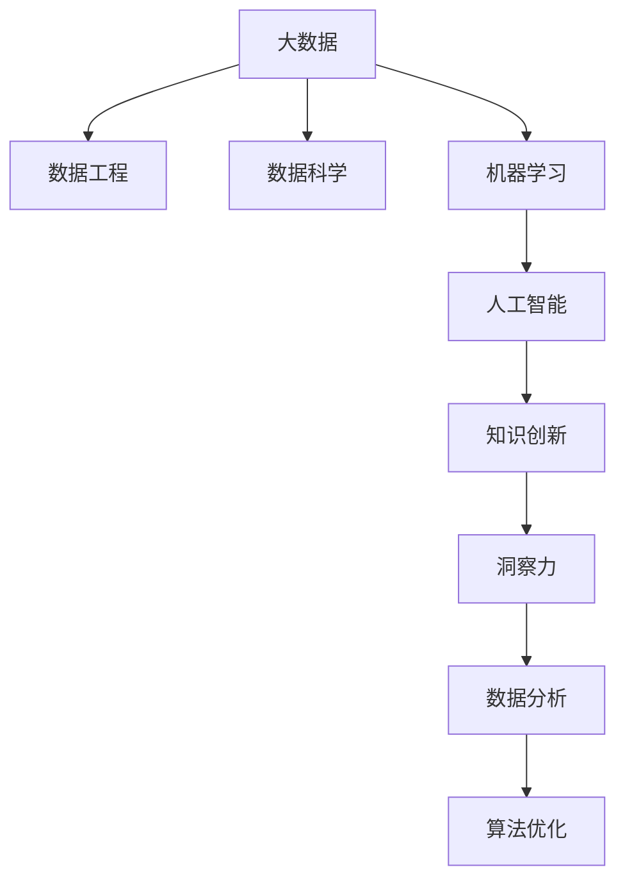

                 

# 洞察力：知识创新的驱动力量

> 关键词：洞察力, 知识创新, 大数据, 人工智能, 机器学习, 数据科学, 数据工程, 数据可视化

## 1. 背景介绍

### 1.1 问题由来
在信息爆炸的时代，知识的获取与更新变得前所未有的便捷，但知识的理解和应用仍然是一个巨大的挑战。数据量的大幅增长，带来了各种类型、多源异构的海量数据，如何从中提取出有价值的洞察力，转化为推动知识创新的动力，成为了当前信息时代面临的重要课题。

数据本身是无意义的，只有通过分析和理解，才能发现其背后的规律和关联，进而实现知识的创新。然而，传统的数据分析方法往往受限于数据规模和处理速度，无法有效应对大数据时代的需求。随着计算机技术和人工智能的发展，机器学习、深度学习等新兴技术为处理大数据、发现洞察力提供了新的可能。

## 2. 核心概念与联系

### 2.1 核心概念概述

为更好地理解洞察力在知识创新中的应用，本节将介绍几个密切相关的核心概念：

- 洞察力(Insight)：指通过数据分析和机器学习，从大量数据中提取出的关键信息、规律和关联。洞察力对于发现知识盲点、推动创新具有重要作用。

- 知识创新(Knowledge Innovation)：指通过深入分析和应用洞察力，发现新的知识、方法、模型和技术，进而推动领域知识和技术的进步和创新。

- 大数据(Big Data)：指数据量巨大、结构复杂、类型多样的数据集。大数据为发现洞察力提供了丰富的材料来源。

- 人工智能(Artificial Intelligence, AI)：通过模拟人类智能，使计算机具备感知、推理、决策等能力，从而实现自动化数据分析和知识发现。

- 机器学习(Machine Learning, ML)：使机器能够从数据中学习规律和模式，并自动改进算法，用于解决分类、回归、聚类等任务。

- 数据科学(Data Science)：结合统计学、计算方法、数据挖掘和可视化技术，分析和解释复杂数据集。

- 数据工程(Data Engineering)：构建数据仓库、数据管道等基础设施，实现数据的收集、存储、清洗、整合和分析。

- 数据可视化(Data Visualization)：通过图表、地图等形式，将数据转换为直观的图形化展示，帮助发现和理解数据的内在关系。

这些核心概念之间的逻辑关系可以通过以下Mermaid流程图来展示：



这个流程图展示了大数据在数据工程、数据科学、机器学习和人工智能中的应用，最终通过数据分析和算法优化，发现洞察力，推动知识创新。

## 3. 核心算法原理 & 具体操作步骤
### 3.1 算法原理概述

洞察力的发现是知识创新的核心驱动力，其背后原理基于数据分析和机器学习的关键算法。以下是几个核心的算法原理：

- 数据清洗与预处理：数据中的缺失值、异常值和重复值需要进行处理，以保证数据质量。

- 特征工程与选择：从原始数据中提取和选择有意义的特征，提升模型的泛化能力和性能。

- 机器学习算法：包括线性回归、逻辑回归、决策树、随机森林、支持向量机、神经网络等，用于发现数据中的模式和规律。

- 数据可视化：通过图表、热力图等形式，将数据关系直观展现，帮助人类从视觉上理解数据的特征和关系。

- 模型评估与调优：通过交叉验证、网格搜索等方法，评估模型性能并优化参数，提升模型的预测准确率和鲁棒性。

### 3.2 算法步骤详解

基于机器学习的洞察力发现过程，通常包括以下几个关键步骤：

**Step 1: 数据收集与预处理**
- 收集相关领域的数据，如用户行为、市场交易、社交媒体评论等。
- 对数据进行清洗和预处理，包括去除重复值、填补缺失值、处理异常值等。

**Step 2: 特征工程**
- 从原始数据中提取有意义的特征，如用户年龄、性别、地理位置等。
- 对特征进行转换和归一化，提升数据质量。
- 通过特征选择算法，如方差分析、主成分分析等，选择对目标变量影响较大的特征。

**Step 3: 模型训练**
- 选择合适的机器学习算法，如线性回归、随机森林等。
- 使用训练数据集对模型进行训练，调整超参数。
- 使用交叉验证评估模型性能，避免过拟合。

**Step 4: 模型评估与调优**
- 在测试数据集上评估模型性能，如均方误差、准确率、召回率等。
- 根据评估结果，调整模型参数，提升模型性能。
- 使用网格搜索、贝叶斯优化等方法，寻找最优超参数组合。

**Step 5: 数据可视化与洞察力发现**
- 使用数据可视化工具，将模型预测结果转换为直观的图形，如散点图、柱状图、热力图等。
- 从可视化结果中发现数据中的规律和关联，如用户行为趋势、市场价格波动等。
- 结合领域知识，解释和解读可视化结果，提取有价值的洞察力。

**Step 6: 知识创新与应用**
- 基于洞察力，提出新的知识、方法和模型。
- 通过实验验证和应用，验证知识创新的效果。
- 将知识创新应用于实际业务场景，推动业务创新和改进。

以上是基于机器学习的洞察力发现过程的一般流程。在实际应用中，还需要针对具体任务和数据特点，对各环节进行优化设计，以进一步提升模型性能和洞察力发现效果。

### 3.3 算法优缺点

基于机器学习的洞察力发现方法具有以下优点：
1. 自动化程度高。机器学习算法能够自动从数据中发现规律，减少了人工干预的复杂性和主观性。
2. 可解释性强。通过可视化手段，洞察力结果易于理解和解释，帮助领域专家从数据中提取有价值的信息。
3. 泛化能力强。机器学习模型能够学习到数据中的复杂模式，适用于多种类型和规模的数据。
4. 发现效率高。机器学习算法能够快速处理大规模数据集，发现隐藏的规律和关联。

同时，该方法也存在一些局限性：
1. 数据质量要求高。机器学习模型的性能很大程度上取决于数据的质量，数据缺失、异常值等问题会严重影响模型效果。
2. 特征工程复杂。选择和提取有意义的特征需要领域专家的知识和经验，耗时耗力。
3. 模型解释性不足。一些复杂的机器学习模型（如深度神经网络）难以解释其内部工作机制，结果易于产生误解。
4. 结果可能过拟合。复杂的机器学习模型容易在训练集上过拟合，泛化能力下降。
5. 算法依赖性高。不同算法对数据和任务的要求不同，选择不当的算法可能无法发现有效的洞察力。

尽管存在这些局限性，但就目前而言，基于机器学习的洞察力发现方法仍是大数据时代发现洞察力的主流手段。未来相关研究的重点在于如何进一步降低对数据的依赖，提高模型的可解释性和鲁棒性，同时兼顾效率和效果。

### 3.4 算法应用领域

基于机器学习的洞察力发现方法在多个领域得到了广泛应用，以下是几个典型应用：

- 市场营销：通过分析用户行为数据，发现用户购买偏好、兴趣点等，指导精准营销和广告投放。
- 金融风险管理：通过分析市场交易数据，发现价格波动、信用风险等，制定风险管理策略。
- 供应链优化：通过分析物流、库存数据，发现供应链瓶颈，优化物流和库存管理。
- 健康医疗：通过分析患者数据，发现疾病趋势、治疗效果等，提升医疗决策和诊疗效果。
- 自然语言处理：通过分析文本数据，发现语言模式和关联，提升文本分类、情感分析等任务效果。
- 推荐系统：通过分析用户行为和物品属性，发现推荐模型中的模式，提升推荐效果。

除了这些领域外，机器学习在众多场景中都有应用，为各行各业带来了新的价值和机遇。随着技术的发展和数据的积累，相信机器学习将在更多领域发挥更大的作用。

## 4. 数学模型和公式 & 详细讲解  
### 4.1 数学模型构建

本节将使用数学语言对基于机器学习的洞察力发现过程进行更加严格的刻画。

记原始数据集为 $D=\{(x_i, y_i)\}_{i=1}^N$，其中 $x_i$ 为输入特征，$y_i$ 为目标变量。假设选择的机器学习模型为 $f(x)$，目标是找到一个最优的模型参数 $\theta$，使得模型在测试集上的预测误差最小。

定义模型的经验风险为：

$$
\mathcal{L}(\theta) = \frac{1}{N} \sum_{i=1}^N \ell(f(x_i), y_i)
$$

其中 $\ell$ 为损失函数，衡量模型预测与真实值之间的差异。常见的损失函数包括均方误差、交叉熵等。

模型的目标是最小化经验风险，即找到最优参数：

$$
\theta^* = \mathop{\arg\min}_{\theta} \mathcal{L}(\theta)
$$

在实践中，我们通常使用基于梯度的优化算法（如随机梯度下降、Adam等）来近似求解上述最优化问题。设 $\eta$ 为学习率，则参数的更新公式为：

$$
\theta \leftarrow \theta - \eta \nabla_{\theta}\mathcal{L}(\theta)
$$

其中 $\nabla_{\theta}\mathcal{L}(\theta)$ 为损失函数对参数 $\theta$ 的梯度，可通过反向传播算法高效计算。

### 4.2 公式推导过程

以下我们以线性回归为例，推导均方误差损失函数的梯度计算公式。

假设模型 $f(x)$ 为线性回归模型，形式为 $f(x) = \theta_0 + \theta_1 x_1 + \theta_2 x_2$。定义模型在数据点 $(x_i, y_i)$ 上的预测误差为 $\hat{y}_i = f(x_i)$。均方误差损失函数为：

$$
\ell(y_i, \hat{y}_i) = \frac{1}{2}(y_i - \hat{y}_i)^2
$$

将其代入经验风险公式，得：

$$
\mathcal{L}(\theta) = \frac{1}{2N} \sum_{i=1}^N (y_i - \hat{y}_i)^2
$$

对 $\mathcal{L}(\theta)$ 求导，得：

$$
\nabla_{\theta}\mathcal{L}(\theta) = \frac{1}{N} \sum_{i=1}^N (-2)(y_i - \hat{y}_i)x_i
$$

根据梯度下降算法，参数 $\theta$ 的更新公式为：

$$
\theta \leftarrow \theta - \eta \nabla_{\theta}\mathcal{L}(\theta)
$$

通过以上推导，可以清晰地看到，线性回归模型的参数更新公式中，每个参数的梯度更新都与输入特征 $x_i$ 有关。这是基于梯度下降的机器学习算法的核心原理。

## 5. 项目实践：代码实例和详细解释说明
### 5.1 开发环境搭建

在进行洞察力发现实践前，我们需要准备好开发环境。以下是使用Python进行Scikit-learn开发的环境配置流程：

1. 安装Anaconda：从官网下载并安装Anaconda，用于创建独立的Python环境。

2. 创建并激活虚拟环境：
```bash
conda create -n sklearn-env python=3.8 
conda activate sklearn-env
```

3. 安装Scikit-learn：
```bash
conda install scikit-learn
```

4. 安装NumPy、Pandas、Matplotlib、Seaborn等必要库：
```bash
pip install numpy pandas matplotlib seaborn
```

5. 安装Jupyter Notebook：
```bash
pip install jupyter notebook
```

完成上述步骤后，即可在`sklearn-env`环境中开始洞察力发现实践。

### 5.2 源代码详细实现

下面我们以线性回归模型在金融风险管理中的应用为例，给出使用Scikit-learn进行洞察力发现的Python代码实现。

首先，定义数据处理函数：

```python
import pandas as pd
from sklearn.model_selection import train_test_split
from sklearn.linear_model import LinearRegression
from sklearn.metrics import mean_squared_error

# 加载数据
data = pd.read_csv('financial_data.csv')

# 数据预处理
data = data.dropna()
X = data[['feature1', 'feature2', 'feature3']]
y = data['target']

# 数据分割
X_train, X_test, y_train, y_test = train_test_split(X, y, test_size=0.2, random_state=42)
```

然后，定义模型和优化器：

```python
from sklearn.linear_model import LinearRegression

# 创建线性回归模型
model = LinearRegression()

# 训练模型
model.fit(X_train, y_train)
```

接着，定义评估函数：

```python
# 评估模型
y_pred = model.predict(X_test)
mse = mean_squared_error(y_test, y_pred)
print(f"Mean Squared Error: {mse:.2f}")
```

最后，启动训练流程：

```python
# 训练模型并评估
model.fit(X_train, y_train)
mse = mean_squared_error(y_test, model.predict(X_test))
print(f"Mean Squared Error: {mse:.2f}")
```

以上就是使用Scikit-learn进行线性回归模型训练和评估的完整代码实现。可以看到，Scikit-learn提供了一整套高效的数据处理和模型训练工具，大大简化了机器学习算法的实现过程。

### 5.3 代码解读与分析

让我们再详细解读一下关键代码的实现细节：

**数据处理函数**：
- `pd.read_csv('financial_data.csv')`：从文件中加载数据，返回一个Pandas DataFrame对象。
- `data = data.dropna()`：去除数据中的缺失值。
- `X = data[['feature1', 'feature2', 'feature3']]`：选择输入特征。
- `y = data['target']`：选择目标变量。

**模型训练函数**：
- `LinearRegression()`：创建线性回归模型。
- `model.fit(X_train, y_train)`：使用训练数据集训练模型。

**评估函数**：
- `mean_squared_error(y_test, y_pred)`：计算模型在测试集上的均方误差。
- `print(f"Mean Squared Error: {mse:.2f}")`：打印均方误差结果。

**训练流程**：
- `model.fit(X_train, y_train)`：使用训练数据集训练模型。
- `mse = mean_squared_error(y_test, model.predict(X_test))`：计算模型在测试集上的均方误差。
- `print(f"Mean Squared Error: {mse:.2f}")`：打印均方误差结果。

可以看到，Scikit-learn使得机器学习算法的实现变得非常简洁，开发者可以更加专注于数据处理和模型调优等高层逻辑，而不必过多关注底层的实现细节。

## 6. 实际应用场景
### 6.1 市场营销

基于机器学习的洞察力发现方法在市场营销领域的应用非常广泛。企业可以通过分析用户行为数据，发现用户购买偏好、兴趣点等，从而指导精准营销和广告投放。

在实践中，可以收集用户的历史购买记录、浏览记录、搜索记录等行为数据，利用机器学习模型发现用户的行为模式和趋势。例如，通过线性回归、决策树等算法，分析用户在不同产品、广告下的购买概率，预测用户未来的购买行为，从而制定个性化的营销策略。

### 6.2 金融风险管理

金融行业面临大量的风险管理问题，通过机器学习可以从历史数据中发现金融市场的规律和风险特征，辅助金融决策。

在金融风险管理中，可以收集市场交易数据、用户交易记录、信用评分等数据，通过机器学习模型分析市场价格波动、信用风险等关键指标，预测未来的风险变化。例如，使用随机森林、支持向量机等算法，分析历史交易数据，发现价格波动的规律和异常交易特征，预测未来的市场趋势和风险事件，帮助制定风险管理策略。

### 6.3 供应链优化

供应链管理涉及到物流、库存、订单等环节，通过机器学习可以发现供应链中的瓶颈和问题，优化物流和库存管理。

在供应链优化中，可以收集物流数据、订单数据、库存数据等，通过机器学习模型分析供应链中的瓶颈和问题。例如，使用聚类算法、回归模型等，分析订单的到货时间和需求变化，预测库存水平，优化物流安排和库存管理。

### 6.4 健康医疗

健康医疗领域数据复杂多样，通过机器学习可以从大量患者数据中发现疾病趋势、治疗效果等，提升医疗决策和诊疗效果。

在健康医疗中，可以收集患者的病历、诊断、治疗等信息，通过机器学习模型分析疾病的传播趋势和治疗方法的效果。例如，使用深度学习算法，分析患者的病情、治疗过程和预后效果，预测疾病的发展趋势，辅助医生制定诊疗方案。

### 6.5 自然语言处理

自然语言处理领域涉及文本分类、情感分析、机器翻译等任务，通过机器学习可以发现文本中的模式和关联，提升NLP任务的效果。

在自然语言处理中，可以收集大量的文本数据，通过机器学习模型分析文本中的情感、主题等特征。例如，使用卷积神经网络、循环神经网络等算法，分析文本的情感倾向和主题分布，提升文本分类、情感分析等任务的效果。

### 6.6 推荐系统

推荐系统是现代互联网应用的重要组成部分，通过机器学习可以发现用户行为和物品属性中的模式，提升推荐效果。

在推荐系统中，可以收集用户的历史浏览、购买、评分等数据，通过机器学习模型分析用户的行为模式和物品的属性特征。例如，使用协同过滤算法、矩阵分解等算法，分析用户的兴趣和物品的特征，推荐符合用户偏好的物品，提升推荐效果。

### 6.7 未来应用展望

随着机器学习和大数据技术的不断发展，基于洞察力发现的方法将在更多领域得到应用，为各行各业带来新的价值和机遇。

在智慧城市治理中，洞察力发现技术可以应用于城市事件监测、舆情分析、应急指挥等环节，提高城市管理的自动化和智能化水平，构建更安全、高效的未来城市。

在智能制造中，洞察力发现技术可以应用于生产流程优化、设备故障预测、质量控制等环节，提升制造效率和产品质量。

在智慧交通中，洞察力发现技术可以应用于交通流量预测、路线优化、车辆调度等环节，提高交通系统的效率和安全性。

除了这些领域外，洞察力发现技术将在众多场景中得到应用，为各行各业带来新的价值和机遇。相信随着技术的发展和数据的积累，洞察力发现技术将发挥更大的作用。

## 7. 工具和资源推荐
### 7.1 学习资源推荐

为了帮助开发者系统掌握洞察力发现的方法和技巧，这里推荐一些优质的学习资源：

1. 《Python数据科学手册》：详细介绍Python在数据科学中的应用，包括数据处理、机器学习、数据可视化等。

2. 《机器学习实战》：结合实际案例，讲解机器学习算法的应用，适合初学者入门。

3. Kaggle：全球最大的数据科学竞赛平台，提供大量的数据集和算法比赛，实战练兵的好地方。

4. Coursera、Udacity、edX等在线课程：提供丰富的机器学习、数据科学课程，涵盖从入门到高级的多个层次。

5. Scikit-learn官方文档：详细介绍了Scikit-learn库的使用方法和算法原理，是学习机器学习的重要参考资料。

通过对这些资源的学习实践，相信你一定能够快速掌握洞察力发现的精髓，并用于解决实际的业务问题。

### 7.2 开发工具推荐

高效的开发离不开优秀的工具支持。以下是几款用于洞察力发现开发的常用工具：

1. Jupyter Notebook：开源的交互式编程环境，适合数据处理和模型训练等任务的开发。

2. PyTorch：基于Python的深度学习框架，灵活动态的计算图，适合进行复杂模型的训练和推理。

3. TensorFlow：由Google主导开发的深度学习框架，支持分布式计算和大规模模型训练。

4. Scikit-learn：简单易用的机器学习库，提供丰富的机器学习算法和数据处理工具。

5. Weights & Biases：模型训练的实验跟踪工具，可以记录和可视化模型训练过程中的各项指标。

6. TensorBoard：TensorFlow配套的可视化工具，可实时监测模型训练状态，并提供丰富的图表呈现方式。

合理利用这些工具，可以显著提升洞察力发现的开发效率，加快创新迭代的步伐。

### 7.3 相关论文推荐

洞察力发现技术的发展源于学界的持续研究。以下是几篇奠基性的相关论文，推荐阅读：

1. 《Machine Learning Yearning》：Andrew Ng撰写的机器学习实践指南，深入浅出地介绍了机器学习的基本概念和实用技巧。

2. 《On the Shoulders of Giants: The Science of Programming》：Douglas Crockford的编程经典，涵盖了编程理论和实践的方方面面。

3. 《Deep Learning》：Ian Goodfellow等撰写的深度学习权威教材，全面介绍了深度学习的基本概念和前沿技术。

4. 《Pattern Recognition and Machine Learning》：Christopher Bishop撰写的模式识别和机器学习教材，理论基础深厚，内容全面系统。

5. 《Advances in Neural Information Processing Systems》：NeurIPS会议的历年论文集，涵盖深度学习和机器学习的最新研究成果。

这些论文代表了大数据和机器学习领域的研究进展，通过学习这些前沿成果，可以帮助研究者把握学科前进方向，激发更多的创新灵感。

## 8. 总结：未来发展趋势与挑战

### 8.1 总结

本文对基于机器学习的洞察力发现方法进行了全面系统的介绍。首先阐述了洞察力在知识创新中的重要作用，明确了洞察力发现对推动各领域知识进步的深远影响。其次，从原理到实践，详细讲解了机器学习算法的核心步骤，给出了洞察力发现任务开发的完整代码实例。同时，本文还广泛探讨了洞察力发现方法在市场营销、金融风险管理、供应链优化、健康医疗、自然语言处理、推荐系统等多个行业领域的应用前景，展示了洞察力发现范式的广阔前景。最后，本文精选了洞察力发现技术的各类学习资源，力求为读者提供全方位的技术指引。

通过本文的系统梳理，可以看到，基于机器学习的洞察力发现方法正在成为大数据时代发现洞察力的主流手段，极大地拓展了数据分析和知识发现的边界，推动了各行业的数字化转型升级。未来，伴随机器学习和大数据技术的进一步发展，基于洞察力发现的方法将在更多领域得到应用，为各行各业带来新的价值和机遇。

### 8.2 未来发展趋势

展望未来，洞察力发现技术将呈现以下几个发展趋势：

1. 自动化程度提升。未来机器学习算法将更加智能，能够自动处理更多类型的复杂数据，发现更深层次的洞察力。

2. 可解释性增强。未来机器学习模型将具备更强的可解释性，人类能够更容易理解和解释其内部工作机制和决策逻辑。

3. 跨模态融合。未来机器学习模型将能够同时处理多种模态的数据，如文本、图像、音频等，形成更加全面、准确的信息整合能力。

4. 知识图谱的融合。未来机器学习模型将能够更好地与知识图谱等外部知识库结合，提升知识发现和推理的效果。

5. 数据隐私保护。未来机器学习模型将更加注重数据隐私保护，确保数据使用过程中的合法合规和安全。

6. 联邦学习的发展。未来机器学习模型将更加注重联邦学习的应用，使得模型训练和知识发现可以在不共享原始数据的前提下进行，保障数据隐私和安全性。

以上趋势凸显了洞察力发现技术的广阔前景。这些方向的探索发展，必将进一步提升机器学习算法的性能和应用范围，为构建智能系统提供更强大的动力。

### 8.3 面临的挑战

尽管洞察力发现技术已经取得了显著进展，但在迈向更加智能化、普适化应用的过程中，仍面临诸多挑战：

1. 数据质量和数量问题。高质量、大数量的数据是洞察力发现的前提，然而实际应用中，数据的获取和处理往往存在挑战。如何提升数据质量、扩大数据规模，是未来研究的重要方向。

2. 模型复杂度与效率问题。复杂的机器学习模型往往需要大量计算资源，如何在保证性能的同时，优化模型结构和推理效率，是未来研究的重要课题。

3. 结果可解释性问题。机器学习模型的内部工作机制往往难以解释，如何提升模型的可解释性，使其易于理解和信任，是未来研究的重要方向。

4. 模型鲁棒性问题。机器学习模型在面对噪声和异常数据时，容易产生误判，如何提升模型的鲁棒性，保障其在实际应用中的稳定性，是未来研究的重要课题。

5. 数据隐私与安全问题。洞察力发现技术依赖于大量数据，如何保护数据隐私和安全，避免数据泄露和滥用，是未来研究的重要方向。

6. 数据偏差问题。机器学习模型容易受到数据偏差的影响，如何消除数据偏差，保证模型的公平性和公正性，是未来研究的重要方向。

这些挑战需要研究者从数据、算法、伦理等多个维度共同努力，才能不断推动洞察力发现技术的成熟和应用。

### 8.4 研究展望

面对洞察力发现技术面临的种种挑战，未来的研究需要在以下几个方面寻求新的突破：

1. 探索无监督和半监督学习范式。摆脱对大规模标注数据的依赖，利用自监督学习、主动学习等无监督和半监督范式，最大限度利用非结构化数据，实现更加灵活高效的洞察力发现。

2. 开发更加参数高效和计算高效的模型。开发更加参数高效的机器学习算法，在固定大部分模型参数的同时，只更新极少量的任务相关参数，提升模型的泛化能力和推理效率。

3. 引入因果推理与对比学习。通过引入因果推理和对比学习思想，增强洞察力发现模型的建立稳定因果关系的能力，学习更加普适、鲁棒的语言表征。

4. 融合外部知识库与知识图谱。将符号化的外部知识库与机器学习模型进行融合，引导洞察力发现过程学习更准确、合理的语言模型。同时加强不同模态数据的整合，实现视觉、语音等多模态信息与文本信息的协同建模。

5. 纳入伦理道德约束。在机器学习模型训练目标中引入伦理导向的评估指标，过滤和惩罚有偏见、有害的输出倾向，确保模型的公平性和公正性。

6. 结合人工智能的协同应用。将机器学习模型与符号推理、逻辑推理、自然语言生成等人工智能技术进行结合，提升洞察力发现的效果和应用范围。

这些研究方向将推动洞察力发现技术向更加智能化、普适化、可解释化的方向发展，为构建更安全、可靠、高效、智能的智能系统提供新的动力。

## 9. 附录：常见问题与解答

**Q1：洞察力发现技术是否适用于所有领域？**

A: 洞察力发现技术在多个领域都有广泛的应用，但对于一些特定领域，如艺术创作、自然探索等，机器学习模型的解释性和可理解性仍然存在挑战。未来需要在模型设计和优化方面进行更多探索，以提升其在这些领域的应用效果。

**Q2：如何选择适合的机器学习算法？**

A: 选择适合的机器学习算法需要考虑数据类型、任务类型和模型复杂度等多个因素。一般建议先从简单的算法开始尝试，如线性回归、逻辑回归等，逐步尝试更复杂的算法，如决策树、随机森林、深度神经网络等。可以通过实验对比不同算法的性能，选择最适合的模型。

**Q3：洞察力发现技术的可解释性如何？**

A: 当前机器学习模型的可解释性仍然存在挑战，尤其是在复杂的深度神经网络中，难以解释其内部工作机制。未来需要开发更加可解释的机器学习模型，如可解释的神经网络、透明模型等，提升模型的可理解性和可信度。

**Q4：洞察力发现技术在实际应用中需要注意哪些问题？**

A: 实际应用中，洞察力发现技术需要考虑数据质量、模型训练时间、模型推理效率等多个问题。为避免模型过拟合，需要采用数据增强、正则化等技术。为提升模型性能，需要优化模型结构和算法，采用分布式计算和模型压缩等技术。

**Q5：未来洞察力发现技术的发展方向是什么？**

A: 未来洞察力发现技术的发展方向包括自动化程度提升、可解释性增强、跨模态融合、知识图谱的融合、数据隐私保护、联邦学习等。这些方向将推动洞察力发现技术向更加智能化、普适化、可解释化的方向发展，为构建更安全、可靠、高效、智能的智能系统提供新的动力。

**Q6：如何处理数据偏差问题？**

A: 处理数据偏差问题需要从数据收集、数据处理、模型训练等多个环节入手。可以采用数据清洗、特征选择、模型公平性约束等方法，提升模型的公平性和公正性。同时，需要在数据收集环节注意样本多样性，避免数据偏差。

---

作者：禅与计算机程序设计艺术 / Zen and the Art of Computer Programming

