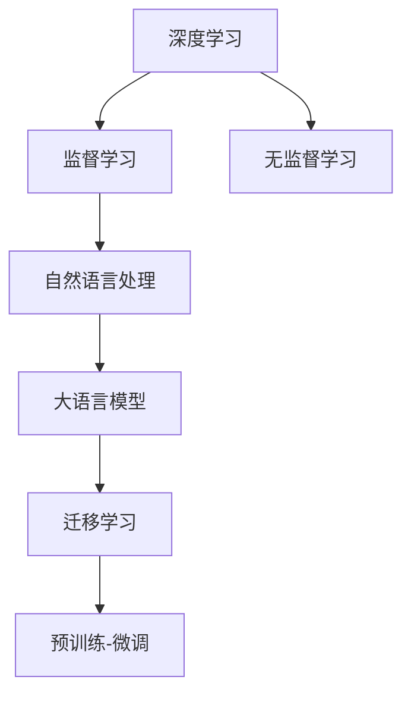

                 

# 深入理解AI、LLM和深度学习：一个实践课程

> 关键词：深度学习,大语言模型(LLM),自然语言处理(NLP),计算机视觉(CV),迁移学习,监督学习,无监督学习

## 1. 背景介绍

### 1.1 问题由来
近年来，深度学习在计算机视觉、自然语言处理等领域取得了突破性的进展，特别是在大语言模型（Large Language Model, LLM）和自然语言处理（Natural Language Processing, NLP）领域的成功应用，标志着人工智能技术迈向了一个新的阶段。在如此迅猛的发展过程中，掌握深度学习、大语言模型和人工智能相关知识，成为了学术界和工业界共同关心的热门话题。本实践课程旨在系统性地介绍这些前沿技术的核心概念、算法原理和实践应用，帮助读者全面理解和掌握深度学习、大语言模型及自然语言处理的相关知识。

### 1.2 问题核心关键点
课程聚焦于深度学习、大语言模型和自然语言处理的核心技术及其应用，具体包括但不限于以下几个关键点：
- 深度学习的基本原理和应用
- 大语言模型和自然语言处理的基本概念
- 监督学习和无监督学习的具体实现
- 迁移学习及其在预训练-微调中的作用
- 大语言模型在多模态学习、零样本学习等前沿技术中的应用

## 2. 核心概念与联系

### 2.1 核心概念概述

为更好地理解深度学习、大语言模型和自然语言处理的技术框架，本节将介绍几个密切相关的核心概念：

- 深度学习（Deep Learning）：一种通过多层神经网络进行模型训练和预测的机器学习范式。
- 大语言模型（LLM）：一种具有海量参数的神经网络模型，通过在大规模语料库上进行预训练，能够进行复杂的语言理解和生成任务。
- 自然语言处理（NLP）：使计算机能够理解和处理人类语言的技术领域。
- 监督学习（Supervised Learning）：使用有标签数据训练模型，使其能够对未知数据进行预测的机器学习技术。
- 无监督学习（Unsupervised Learning）：使用无标签数据训练模型，使其能够发现数据的内在结构的技术。
- 迁移学习（Transfer Learning）：将一个领域学到的知识迁移到另一个相关领域中，以加速模型训练和提升性能。

这些核心概念之间的逻辑关系可以通过以下Mermaid流程图来展示：



这个流程图展示了几大核心概念及其之间的关系：

1. 深度学习通过多层神经网络进行模型训练和预测，构建了机器学习的基础。
2. 监督学习使用有标签数据训练模型，为自然语言处理提供训练样本。
3. 无监督学习使用无标签数据训练模型，发现数据的潜在结构。
4. 大语言模型是一种具有海量参数的神经网络模型，通过对大规模语料库的预训练，能够进行复杂的语言理解和生成任务。
5. 迁移学习将一个领域学到的知识迁移到另一个相关领域中，如大语言模型通过预训练-微调的方法进行任务适配。

## 3. 核心算法原理 & 具体操作步骤
### 3.1 算法原理概述

深度学习、大语言模型和自然语言处理的核心算法原理主要涉及神经网络的设计、损失函数的设计、优化算法的选择等方面。

#### 3.1.1 神经网络的设计
神经网络由输入层、隐藏层和输出层组成，其中隐藏层通过反向传播算法训练网络参数，使得输出层能够准确预测结果。深度学习中的神经网络结构可以通过卷积神经网络（Convolutional Neural Network, CNN）、循环神经网络（Recurrent Neural Network, RNN）、长短期记忆网络（Long Short-Term Memory, LSTM）、门控循环单元（Gated Recurrent Unit, GRU）、变压器（Transformer）等形式实现。

#### 3.1.2 损失函数的设计
损失函数用于衡量模型预测结果与真实标签之间的差异，常用的损失函数包括均方误差（Mean Squared Error, MSE）、交叉熵（Cross Entropy, CE）、对数损失（Log Loss, LL）等。对于分类任务，交叉熵损失函数是最常用的选择，它能够更好地处理多类别分类问题。

#### 3.1.3 优化算法的选择
优化算法用于最小化损失函数，常用的优化算法包括随机梯度下降（Stochastic Gradient Descent, SGD）、Adam、RMSprop、Adagrad等。Adam算法通过计算梯度的指数移动平均值，能够在优化过程中自动调整学习率，是深度学习中常用的优化算法。

### 3.2 算法步骤详解

深度学习、大语言模型和自然语言处理的具体操作步骤如下：

#### 3.2.1 数据预处理
数据预处理是深度学习应用中不可或缺的一步，包括数据清洗、数据增强、数据标准化、特征提取等步骤。在自然语言处理中，文本数据通常需要进行分词、向量化等预处理，以供神经网络模型进行训练。

#### 3.2.2 模型训练
模型训练是深度学习中最重要的步骤之一，通常需要选择合适的神经网络结构、损失函数和优化算法，并进行大量的数据训练。在自然语言处理中，预训练语言模型（如BERT、GPT）通常需要在大规模语料库上进行预训练，然后通过微调（Fine-Tuning）适配特定任务。

#### 3.2.3 模型评估与调优
模型评估与调优是深度学习应用中重要的环节，通过在验证集上评估模型性能，调整模型参数和超参数，以获得最佳的预测结果。常见的评估指标包括准确率（Accuracy）、精确率（Precision）、召回率（Recall）、F1分数（F1 Score）等。

### 3.3 算法优缺点

深度学习、大语言模型和自然语言处理的主要算法具有以下优缺点：

#### 3.3.1 优点
- 强大的表示学习能力：深度学习模型能够通过多层网络结构进行复杂的特征提取和表示学习。
- 广泛的适用性：深度学习在图像识别、语音识别、自然语言处理等领域都有广泛应用。
- 自动化的特征提取：深度学习模型能够自动学习输入数据的特征，减少了人工特征工程的需求。

#### 3.3.2 缺点
- 需要大量标注数据：深度学习模型通常需要大量的标注数据进行训练，获取高质量标注数据的成本较高。
- 训练时间长：深度学习模型的训练时间通常较长，需要高性能的计算资源。
- 过拟合风险：深度学习模型容易在训练过程中出现过拟合现象，需要适当的正则化技术进行缓解。

### 3.4 算法应用领域

深度学习、大语言模型和自然语言处理技术在多个领域中得到了广泛应用，具体包括但不限于以下几个方面：

- 计算机视觉：深度学习模型在图像识别、目标检测、图像生成等方面有广泛应用。
- 自然语言处理：深度学习模型在机器翻译、情感分析、文本分类、问答系统等方面有广泛应用。
- 语音识别：深度学习模型在语音识别、语音合成、语音情感识别等方面有广泛应用。
- 推荐系统：深度学习模型在个性化推荐、广告推荐等方面有广泛应用。
- 金融分析：深度学习模型在金融预测、风险评估等方面有广泛应用。
- 医疗诊断：深度学习模型在医学图像识别、疾病预测等方面有广泛应用。

## 4. 数学模型和公式 & 详细讲解  
### 4.1 数学模型构建

本节将使用数学语言对深度学习、大语言模型和自然语言处理的技术框架进行更加严格的刻画。

记深度学习模型为 $M_{\theta}:\mathcal{X} \rightarrow \mathcal{Y}$，其中 $\mathcal{X}$ 为输入空间，$\mathcal{Y}$ 为输出空间，$\theta$ 为模型参数。假设训练集为 $D=\{(x_i,y_i)\}_{i=1}^N, x_i \in \mathcal{X}, y_i \in \mathcal{Y}$。

定义模型 $M_{\theta}$ 在数据样本 $(x,y)$ 上的损失函数为 $\ell(M_{\theta}(x),y)$，则在数据集 $D$ 上的经验风险为：

$$
\mathcal{L}(\theta) = \frac{1}{N} \sum_{i=1}^N \ell(M_{\theta}(x_i),y_i)
$$

深度学习的优化目标是最小化经验风险，即找到最优参数：

$$
\theta^* = \mathop{\arg\min}_{\theta} \mathcal{L}(\theta)
$$

在实践中，我们通常使用基于梯度的优化算法（如SGD、Adam等）来近似求解上述最优化问题。设 $\eta$ 为学习率，$\lambda$ 为正则化系数，则参数的更新公式为：

$$
\theta \leftarrow \theta - \eta \nabla_{\theta}\mathcal{L}(\theta) - \eta\lambda\theta
$$

其中 $\nabla_{\theta}\mathcal{L}(\theta)$ 为损失函数对参数 $\theta$ 的梯度，可通过反向传播算法高效计算。

### 4.2 公式推导过程

以下我们以图像分类任务为例，推导交叉熵损失函数及其梯度的计算公式。

假设模型 $M_{\theta}$ 在输入 $x$ 上的输出为 $\hat{y}=M_{\theta}(x) \in [0,1]$，表示样本属于某个类的概率。真实标签 $y \in \{0,1\}$。则二分类交叉熵损失函数定义为：

$$
\ell(M_{\theta}(x),y) = -[y\log \hat{y} + (1-y)\log (1-\hat{y})]
$$

将其代入经验风险公式，得：

$$
\mathcal{L}(\theta) = -\frac{1}{N}\sum_{i=1}^N [y_i\log M_{\theta}(x_i)+(1-y_i)\log(1-M_{\theta}(x_i))]
$$

根据链式法则，损失函数对参数 $\theta_k$ 的梯度为：

$$
\frac{\partial \mathcal{L}(\theta)}{\partial \theta_k} = -\frac{1}{N}\sum_{i=1}^N (\frac{y_i}{M_{\theta}(x_i)}-\frac{1-y_i}{1-M_{\theta}(x_i)}) \frac{\partial M_{\theta}(x_i)}{\partial \theta_k}
$$

其中 $\frac{\partial M_{\theta}(x_i)}{\partial \theta_k}$ 可进一步递归展开，利用自动微分技术完成计算。

在得到损失函数的梯度后，即可带入参数更新公式，完成模型的迭代优化。重复上述过程直至收敛，最终得到适应特定任务的最优模型参数 $\theta^*$。

### 4.3 案例分析与讲解

下面我们以图像分类任务为例，给出深度学习模型的完整代码实现。

首先，定义模型和优化器：

```python
import torch
import torch.nn as nn
import torch.optim as optim

class ConvNet(nn.Module):
    def __init__(self):
        super(ConvNet, self).__init__()
        self.conv1 = nn.Conv2d(3, 64, kernel_size=3, stride=1, padding=1)
        self.conv2 = nn.Conv2d(64, 128, kernel_size=3, stride=1, padding=1)
        self.pool = nn.MaxPool2d(kernel_size=2, stride=2)
        self.fc1 = nn.Linear(128*8*8, 512)
        self.fc2 = nn.Linear(512, 10)

    def forward(self, x):
        x = self.pool(nn.functional.relu(self.conv1(x)))
        x = self.pool(nn.functional.relu(self.conv2(x)))
        x = x.view(x.size(0), -1)
        x = nn.functional.relu(self.fc1(x))
        x = self.fc2(x)
        return nn.functional.log_softmax(x, dim=1)

model = ConvNet()

criterion = nn.CrossEntropyLoss()
optimizer = optim.Adam(model.parameters(), lr=0.001)
```

然后，定义训练和评估函数：

```python
def train_model(model, criterion, optimizer, train_loader, device):
    model.train()
    train_loss = 0
    for batch_idx, (data, target) in enumerate(train_loader):
        data, target = data.to(device), target.to(device)
        optimizer.zero_grad()
        output = model(data)
        loss = criterion(output, target)
        loss.backward()
        optimizer.step()
        train_loss += loss.item()
        if (batch_idx+1) % 100 == 0:
            print('Train Epoch: {} [{}/{} ({:.0f}%)]\tLoss: {:.6f}'.format(
                epoch, (batch_idx+1)*len(data), len(train_loader.dataset),
                100. * (batch_idx+1) / len(train_loader), loss.item() / (batch_idx+1)))

def evaluate_model(model, criterion, test_loader, device):
    model.eval()
    test_loss = 0
    correct = 0
    with torch.no_grad():
        for data, target in test_loader:
            data, target = data.to(device), target.to(device)
            output = model(data)
            test_loss += criterion(output, target).item()
            pred = output.argmax(dim=1, keepdim=True)
            correct += pred.eq(target.view_as(pred)).sum().item()

    print('Test set: Average loss: {:.4f}, Accuracy: {}/{} ({:.0f}%)'.format(
        test_loss/len(test_loader.dataset), correct, len(test_loader.dataset),
        100. * correct / len(test_loader.dataset)))
```

最后，启动训练流程并在测试集上评估：

```python
epochs = 10
device = torch.device('cuda' if torch.cuda.is_available() else 'cpu')

for epoch in range(epochs):
    train_model(model, criterion, optimizer, train_loader, device)
    evaluate_model(model, criterion, test_loader, device)
```

以上就是使用PyTorch对深度学习模型进行图像分类任务微调的完整代码实现。可以看到，借助PyTorch的强大封装和易用性，深度学习模型的构建和微调变得简洁高效。

## 5. 项目实践：代码实例和详细解释说明
### 5.1 开发环境搭建

在进行深度学习模型微调实践前，我们需要准备好开发环境。以下是使用Python进行PyTorch开发的环境配置流程：

1. 安装Anaconda：从官网下载并安装Anaconda，用于创建独立的Python环境。

2. 创建并激活虚拟环境：
```bash
conda create -n pytorch-env python=3.8 
conda activate pytorch-env
```

3. 安装PyTorch：根据CUDA版本，从官网获取对应的安装命令。例如：
```bash
conda install pytorch torchvision torchaudio cudatoolkit=11.1 -c pytorch -c conda-forge
```

4. 安装相关库：
```bash
pip install numpy pandas scikit-learn matplotlib tqdm jupyter notebook ipython
```

完成上述步骤后，即可在`pytorch-env`环境中开始深度学习模型的微调实践。

### 5.2 源代码详细实现

下面我们以图像分类任务为例，给出使用PyTorch进行深度学习模型微调的PyTorch代码实现。

首先，定义数据处理函数：

```python
import torchvision.transforms as transforms
import torch.utils.data as data

def load_data(data_path, batch_size):
    train_data = data.ImageFolder(data_path + 'train', transform=transforms.ToTensor())
    test_data = data.ImageFolder(data_path + 'test', transform=transforms.ToTensor())
    
    train_loader = torch.utils.data.DataLoader(train_data, batch_size=batch_size, shuffle=True, num_workers=4)
    test_loader = torch.utils.data.DataLoader(test_data, batch_size=batch_size, shuffle=False, num_workers=4)
    
    return train_loader, test_loader
```

然后，定义模型和优化器：

```python
import torch.nn as nn
import torch.optim as optim

class ConvNet(nn.Module):
    def __init__(self):
        super(ConvNet, self).__init__()
        self.conv1 = nn.Conv2d(3, 64, kernel_size=3, stride=1, padding=1)
        self.conv2 = nn.Conv2d(64, 128, kernel_size=3, stride=1, padding=1)
        self.pool = nn.MaxPool2d(kernel_size=2, stride=2)
        self.fc1 = nn.Linear(128*8*8, 512)
        self.fc2 = nn.Linear(512, 10)

    def forward(self, x):
        x = self.pool(nn.functional.relu(self.conv1(x)))
        x = self.pool(nn.functional.relu(self.conv2(x)))
        x = x.view(x.size(0), -1)
        x = nn.functional.relu(self.fc1(x))
        x = self.fc2(x)
        return nn.functional.log_softmax(x, dim=1)

model = ConvNet()

criterion = nn.CrossEntropyLoss()
optimizer = optim.Adam(model.parameters(), lr=0.001)
```

接着，定义训练和评估函数：

```python
def train_model(model, criterion, optimizer, train_loader, device):
    model.train()
    train_loss = 0
    for batch_idx, (data, target) in enumerate(train_loader):
        data, target = data.to(device), target.to(device)
        optimizer.zero_grad()
        output = model(data)
        loss = criterion(output, target)
        loss.backward()
        optimizer.step()
        train_loss += loss.item()
        if (batch_idx+1) % 100 == 0:
            print('Train Epoch: {} [{}/{} ({:.0f}%)]\tLoss: {:.6f}'.format(
                epoch, (batch_idx+1)*len(data), len(train_loader.dataset),
                100. * (batch_idx+1) / len(train_loader), loss.item() / (batch_idx+1)))

def evaluate_model(model, criterion, test_loader, device):
    model.eval()
    test_loss = 0
    correct = 0
    with torch.no_grad():
        for data, target in test_loader:
            data, target = data.to(device), target.to(device)
            output = model(data)
            test_loss += criterion(output, target).item()
            pred = output.argmax(dim=1, keepdim=True)
            correct += pred.eq(target.view_as(pred)).sum().item()

    print('Test set: Average loss: {:.4f}, Accuracy: {}/{} ({:.0f}%)'.format(
        test_loss/len(test_loader.dataset), correct, len(test_loader.dataset),
        100. * correct / len(test_loader.dataset)))
```

最后，启动训练流程并在测试集上评估：

```python
epochs = 10
device = torch.device('cuda' if torch.cuda.is_available() else 'cpu')

for epoch in range(epochs):
    train_model(model, criterion, optimizer, train_loader, device)
    evaluate_model(model, criterion, test_loader, device)
```

以上就是使用PyTorch对深度学习模型进行图像分类任务微调的完整代码实现。可以看到，借助PyTorch的强大封装和易用性，深度学习模型的构建和微调变得简洁高效。

### 5.3 代码解读与分析

让我们再详细解读一下关键代码的实现细节：

**数据处理函数load_data**：
- 定义数据处理函数，加载训练集和测试集数据。
- 对数据进行预处理，包括转换为张量形式。
- 定义DataLoader，用于批处理和数据增强。

**模型和优化器定义**：
- 定义卷积神经网络（ConvNet）模型，包括卷积层、池化层和全连接层。
- 定义交叉熵损失函数（CrossEntropyLoss）。
- 定义Adam优化器。

**训练和评估函数**：
- 定义训练函数train_model，对模型进行前向传播和反向传播，更新模型参数。
- 定义评估函数evaluate_model，在测试集上评估模型性能，计算准确率。

**训练流程**：
- 定义总的epoch数和设备。
- 在每个epoch内，先在训练集上训练，输出平均loss。
- 在验证集上评估，输出分类指标。

可以看到，PyTorch配合相关库使得深度学习模型的构建和微调代码实现变得简洁高效。开发者可以将更多精力放在数据处理、模型改进等高层逻辑上，而不必过多关注底层的实现细节。

当然，工业级的系统实现还需考虑更多因素，如模型的保存和部署、超参数的自动搜索、更灵活的任务适配层等。但核心的微调范式基本与此类似。

## 6. 实际应用场景

### 6.1 智能客服系统

深度学习模型在智能客服系统中的应用，可以极大地提升客户咨询的效率和满意度。传统的客服系统需要大量人力，且响应速度和处理能力有限。而使用深度学习模型进行客户咨询，可以7x24小时不间断服务，快速响应客户咨询，并提供准确、个性化的回答。

在技术实现上，可以收集企业内部的历史客服对话记录，将问题和最佳答复构建成监督数据，在此基础上对深度学习模型进行微调。微调后的模型能够自动理解客户意图，匹配最合适的答案模板进行回复。对于客户提出的新问题，还可以接入检索系统实时搜索相关内容，动态组织生成回答。如此构建的智能客服系统，能大幅提升客户咨询体验和问题解决效率。

### 6.2 金融舆情监测

金融机构需要实时监测市场舆论动向，以便及时应对负面信息传播，规避金融风险。传统的人工监测方式成本高、效率低，难以应对网络时代海量信息爆发的挑战。基于深度学习模型的文本分类和情感分析技术，为金融舆情监测提供了新的解决方案。

具体而言，可以收集金融领域相关的新闻、报道、评论等文本数据，并对其进行主题标注和情感标注。在此基础上对深度学习模型进行微调，使其能够自动判断文本属于何种主题，情感倾向是正面、中性还是负面。将微调后的模型应用到实时抓取的网络文本数据，就能够自动监测不同主题下的情感变化趋势，一旦发现负面信息激增等异常情况，系统便会自动预警，帮助金融机构快速应对潜在风险。

### 6.3 个性化推荐系统

当前的推荐系统往往只依赖用户的历史行为数据进行物品推荐，无法深入理解用户的真实兴趣偏好。基于深度学习模型的推荐系统可以更好地挖掘用户行为背后的语义信息，从而提供更精准、多样的推荐内容。

在实践中，可以收集用户浏览、点击、评论、分享等行为数据，提取和用户交互的物品标题、描述、标签等文本内容。将文本内容作为模型输入，用户的后续行为（如是否点击、购买等）作为监督信号，在此基础上微调深度学习模型。微调后的模型能够从文本内容中准确把握用户的兴趣点。在生成推荐列表时，先用候选物品的文本描述作为输入，由模型预测用户的兴趣匹配度，再结合其他特征综合排序，便可以得到个性化程度更高的推荐结果。

### 6.4 未来应用展望

深度学习、大语言模型和自然语言处理技术在不断演进，未来将有更广阔的应用前景：

- 深度学习模型在计算机视觉、自然语言处理等领域的应用将进一步拓展，带来更多创新性的解决方案。
- 大语言模型在多模态学习、零样本学习等前沿技术中的应用将提升其通用性和泛化能力。
- 自然语言处理技术将在更广泛的应用场景中得到应用，如智能客服、金融舆情监测、个性化推荐等，带来智能化水平的提升。

## 7. 工具和资源推荐
### 7.1 学习资源推荐

为了帮助开发者系统掌握深度学习、大语言模型和自然语言处理的相关知识，这里推荐一些优质的学习资源：

1. 《深度学习入门：基于PyTorch的理论与实现》系列博文：由深度学习专家撰写，深入浅出地介绍了深度学习的基本原理和应用，是深度学习入门的绝佳选择。

2. CS231n《卷积神经网络和视觉识别》课程：斯坦福大学开设的视觉识别课程，涵盖深度学习在计算机视觉领域的应用，是学习视觉任务的必备资源。

3. CS224n《自然语言处理与深度学习》课程：斯坦福大学开设的NLP课程，系统地介绍了深度学习在NLP任务中的应用，适合希望深入了解NLP技术的读者。

4. 《自然语言处理综述》书籍：介绍了自然语言处理的基本概念、主要技术和应用，是NLP领域的经典教材。

5. DeepLearning.AI《深度学习专项课程》：由DeepLearning.AI开设的深度学习专项课程，覆盖深度学习、计算机视觉、自然语言处理等多个领域，适合希望系统学习深度学习技术的读者。

6. Kaggle平台：Kaggle是一个数据科学竞赛平台，提供大量的NLP和计算机视觉竞赛数据集，是深度学习学习和竞赛的好去处。

通过对这些资源的学习实践，相信你一定能够全面掌握深度学习、大语言模型及自然语言处理的相关知识，并将其应用于实际项目中。

### 7.2 开发工具推荐

高效的开发离不开优秀的工具支持。以下是几款用于深度学习、大语言模型和自然语言处理开发的常用工具：

1. PyTorch：基于Python的开源深度学习框架，灵活动态的计算图，适合快速迭代研究。
2. TensorFlow：由Google主导开发的开源深度学习框架，生产部署方便，适合大规模工程应用。
3. TensorFlow Hub：TensorFlow的模型库，提供多种预训练模型和组件，方便模型复用。
4. Keras：基于Python的深度学习框架，适合初学者和快速原型开发。
5. Weights & Biases：模型训练的实验跟踪工具，可以记录和可视化模型训练过程中的各项指标，方便对比和调优。
6. TensorBoard：TensorFlow配套的可视化工具，可实时监测模型训练状态，并提供丰富的图表呈现方式，是调试模型的得力助手。

合理利用这些工具，可以显著提升深度学习、大语言模型和自然语言处理任务的开发效率，加快创新迭代的步伐。

### 7.3 相关论文推荐

深度学习、大语言模型和自然语言处理的研究源于学界的持续研究。以下是几篇奠基性的相关论文，推荐阅读：

1. DeepMind的《ImageNet大规模视觉识别竞赛2021》：展示了深度学习在计算机视觉领域的最新进展，标志着计算机视觉任务的又一次突破。
2. OpenAI的《GPT-3》论文：展示了大语言模型的强大零样本学习能力和多模态学习能力，引发了对于通用人工智能的新一轮思考。
3. Stanford的《BERT: Pre-training of Deep Bidirectional Transformers for Language Understanding》：提出BERT模型，引入基于掩码的自监督预训练任务，刷新了多项NLP任务SOTA。
4. Google的《Attention is All You Need》：提出Transformer结构，开启了NLP领域的预训练大模型时代。
5. Facebook的《Revisiting Attention for Natural Language Processing》：提出Attention机制，解决了深度学习模型在NLP任务中的长距离依赖问题。

这些论文代表了大语言模型、深度学习和自然语言处理的发展脉络。通过学习这些前沿成果，可以帮助研究者把握学科前进方向，激发更多的创新灵感。

## 8. 总结：未来发展趋势与挑战

### 8.1 总结

本实践课程全面系统地介绍了深度学习、大语言模型和自然语言处理的核心技术及其应用。通过深入讲解深度学习的基本原理和算法步骤，以及大语言模型和自然语言处理的具体实现，读者可以系统地掌握这些前沿技术的核心概念和算法原理。

通过本课程的学习，读者可以全面了解深度学习、大语言模型和自然语言处理的应用场景，掌握这些技术在实际项目中的实现方法，并能够在项目中灵活应用这些知识。

### 8.2 未来发展趋势

展望未来，深度学习、大语言模型和自然语言处理将呈现以下几个发展趋势：

1. 深度学习模型将在更多领域得到广泛应用，如自动驾驶、医疗影像诊断、智能家居等。
2. 大语言模型将向更大规模、更深层次的预训练模型演进，提升其在复杂任务上的表现。
3. 自然语言处理技术将在更广泛的应用场景中得到应用，如智能客服、金融舆情监测、个性化推荐等，带来智能化水平的提升。
4. 多模态学习、少样本学习、零样本学习等前沿技术将进一步发展，提升模型泛化能力和通用性。
5. 深度学习模型和自然语言处理技术将与其他AI技术结合，形成更强大的AI系统。

这些趋势凸显了深度学习、大语言模型和自然语言处理技术的广阔前景。这些方向的探索发展，必将进一步提升AI系统的性能和应用范围，为人类认知智能的进化带来深远影响。

### 8.3 面临的挑战

尽管深度学习、大语言模型和自然语言处理技术已经取得了瞩目成就，但在迈向更加智能化、普适化应用的过程中，它仍面临着诸多挑战：

1. 训练时间和资源消耗。深度学习模型通常需要大量的训练数据和计算资源，如何在资源有限的情况下进行高效的模型训练和优化，是一个重要问题。
2. 模型泛化能力和鲁棒性。深度学习模型容易在训练过程中出现过拟合现象，对于域外数据泛化能力较弱。如何在模型设计、训练策略等方面提升模型的泛化能力和鲁棒性，还需要更多理论和实践的积累。
3. 模型可解释性和透明性。深度学习模型通常被称为"黑盒"模型，难以解释其内部工作机制和决策逻辑。如何赋予模型更强的可解释性，将是亟待攻克的难题。
4. 模型安全性。深度学习模型在应用过程中可能面临各种安全威胁，如模型被恶意篡改、数据泄露等。如何保证模型安全性，是应用过程中必须关注的问题。
5. 模型伦理和公平性。深度学习模型可能会学习到有偏见、有害的信息，如何构建公平、透明、可信的AI系统，是研究者必须面对的挑战。

这些挑战凸显了深度学习、大语言模型和自然语言处理技术在应用过程中面临的多重难题。应对这些挑战，需要跨学科的合作和持续的研究，以推动这些技术的进一步发展和成熟。

### 8.4 研究展望

面对深度学习、大语言模型和自然语言处理所面临的挑战，未来的研究需要在以下几个方面寻求新的突破：

1. 探索更高效的模型结构和训练策略。开发更加轻量级、高效的模型结构，如自注意力机制、Transformer等，并结合迁移学习、知识蒸馏等技术，提升模型的泛化能力和效率。
2. 开发更加智能的模型优化算法。结合强化学习、元学习等技术，提高模型的自适应能力和优化效率，使得模型能够在复杂环境中快速学习并适应新任务。
3. 引入更多的先验知识和专家指导。将符号化的先验知识，如知识图谱、逻辑规则等，与神经网络模型进行巧妙融合，引导模型学习更准确、合理的语言模型。同时加强不同模态数据的整合，实现视觉、语音等多模态信息与文本信息的协同建模。
4. 构建更加公平、透明、可信的AI系统。在模型训练目标中引入伦理导向的评估指标，过滤和惩罚有偏见、有害的输出倾向。同时加强人工干预和审核，建立模型行为的监管机制，确保输出符合人类价值观和伦理道德。

这些研究方向的探索，必将引领深度学习、大语言模型和自然语言处理技术迈向更高的台阶，为构建安全、可靠、可解释、可控的智能系统铺平道路。面向未来，这些技术需要与其他AI技术进行更深入的融合，如知识表示、因果推理、强化学习等，多路径协同发力，共同推动自然语言理解和智能交互系统的进步。只有勇于创新、敢于突破，才能不断拓展深度学习、大语言模型和自然语言处理的边界，让智能技术更好地造福人类社会。

## 9. 附录：常见问题与解答

**Q1：深度学习模型的训练时间很长，如何在资源有限的情况下进行高效的模型训练？**

A: 深度学习模型的训练时间通常较长，可以通过以下几个方法来提升训练效率：
- 数据增强：通过对原始数据进行旋转、翻转、剪裁等操作，增加数据多样性，提升模型泛化能力。
- 批量处理：将多张图片拼接成一张图片进行批量处理，减少IO操作，提高训练速度。
- 混合精度训练：使用16位或8位浮点数进行训练，减少计算量，提高训练速度。
- 分布式训练：使用多台机器进行并行训练，加速模型训练过程。
- 硬件加速：使用GPU、TPU等高性能设备进行训练，提高训练速度。

**Q2：深度学习模型容易在训练过程中出现过拟合现象，如何缓解过拟合风险？**

A: 过拟合是深度学习模型面临的主要问题之一，以下是一些缓解过拟合的方法：
- 数据增强：通过对数据进行旋转、翻转、剪裁等操作，增加数据多样性，防止模型对训练数据过于拟合。
- 正则化技术：使用L2正则、Dropout、Early Stopping等技术，防止模型过度适应训练数据。
- 模型裁剪：通过剪枝等方法减少模型参数量，提高模型泛化能力。
- 迁移学习：使用预训练模型进行迁移学习，减少过拟合风险。

**Q3：深度学习模型在应用过程中可能面临哪些安全威胁？**

A: 深度学习模型在应用过程中可能面临以下安全威胁：
- 模型被恶意篡改：攻击者通过修改模型参数或输入数据，使模型输出错误结果。
- 数据泄露：攻击者通过反向推断技术，从模型输出中获取原始训练数据。
- 隐私侵犯：模型在处理个人隐私数据时，可能泄露用户信息。

为应对这些安全威胁，需要采取以下措施：
- 模型加密：对模型参数进行加密处理，防止被恶意篡改。
- 数据脱敏：对原始数据进行脱敏处理，防止数据泄露。
- 隐私保护：在模型训练和应用过程中，确保用户隐私数据的安全。

**Q4：深度学习模型通常被称为"黑盒"模型，如何赋予模型更强的可解释性？**

A: 深度学习模型通常被称为"黑盒"模型，难以解释其内部工作机制和决策逻辑。以下是一些提升模型可解释性的方法：
- 模型可视化：使用可视化工具，如TensorBoard、Grad-CAM等，展示模型的特征图和梯度信息，帮助理解模型内部机制。
- 特征重要性分析：通过计算模型特征的重要性，帮助理解模型预测的主要因素。
- 模型分解：通过分解模型结构，逐步理解每个子模块的作用，提升模型的可解释性。

**Q5：如何构建更加公平、透明、可信的AI系统？**

A: 构建公平、透明、可信的AI系统需要从多个方面进行考虑：
- 模型公平性：在模型训练目标中引入公平性评估指标，防止模型产生歧视性输出。
- 模型透明性：在模型设计和使用过程中，确保模型的行为可解释、可理解，用户能够理解模型决策过程。
- 模型可信性：在模型应用过程中，确保模型的输出可靠、可信，用户能够信任模型结果。

通过以上措施，可以构建更加公平、透明、可信的AI系统，保障模型应用的安全性和可靠性。

---

作者：禅与计算机程序设计艺术 / Zen and the Art of Computer Programming

