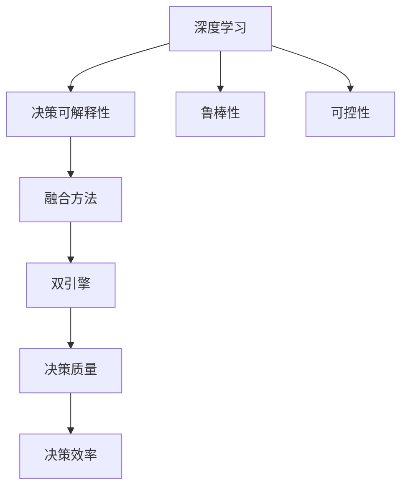

                 

# 深度学习与人类直觉：智能决策的双重引擎

## 1. 背景介绍

### 1.1 问题由来
深度学习，作为21世纪人工智能的代表性技术，已经在图像识别、语音识别、自然语言处理等领域取得了举世瞩目的成就。然而，尽管深度学习在性能上已经超越了人类的直觉判断，但在实际应用中，深度学习模型仍然存在诸多局限性，如缺乏可解释性、决策不透明、容易过拟合等。这些问题不仅限制了深度学习模型的应用范围，更在一定程度上威胁到其可靠性。

### 1.2 问题核心关键点
面对深度学习的局限性，学界和工业界正在不断探索新的路径，试图将人类直觉和深度学习技术进行融合，从而打造更智能、更可靠的双重引擎。具体而言，如何合理利用人类直觉，增强深度学习模型的决策可解释性、鲁棒性、可控性，是当前研究的重点和难点。

### 1.3 问题研究意义
研究深度学习与人类直觉的融合技术，对于提升人工智能决策系统的可解释性和可靠性，推动人工智能技术的广泛应用，具有重要的理论和实践意义：

1. 提高决策可解释性：深度学习模型往往被视为"黑盒"系统，难以理解其内部工作机制。通过融入人类直觉，赋予模型更强的可解释性，有助于增强其决策的透明度和可信度。
2. 增强模型鲁棒性：人类直觉往往能够捕捉到数据的非统计规律，结合深度学习模型，可以提高模型的泛化能力和抗干扰能力，提升其鲁棒性。
3. 提升模型可控性：人类直觉可以作为深度学习模型的"控制器"，引导模型按照特定的目标和规则进行决策，增强其可控性。
4. 拓展应用领域：人类直觉的融入，可以拓展深度学习模型的应用边界，使其在更广泛的领域内发挥作用。
5. 促进技术产业化：深度学习与人类直觉的融合，为人工智能技术在垂直行业的落地应用提供了新的思路和工具，加速了人工智能技术的产业化进程。

## 2. 核心概念与联系

### 2.1 核心概念概述

为更好地理解深度学习与人类直觉的融合技术，本节将介绍几个密切相关的核心概念：

- 深度学习(Deep Learning)：利用多层次神经网络模型对数据进行抽象特征提取和模式识别，从而实现高效的预测和推理。
- 人类直觉(Human Intuition)：人类基于经验和知识对事物进行的快速、非正式的判断和决策，具有高度的主观性和灵活性。
- 决策可解释性(Explainability)：深度学习模型的决策过程应该具有可解释性，即用户能够理解和信任模型的决策结果。
- 鲁棒性(Robustness)：深度学习模型对数据分布变化、噪声干扰等因素的适应能力。
- 可控性(Controllability)：深度学习模型可以根据外部输入进行行为调整和优化。
- 融合方法(Blending)：将深度学习和人类直觉进行有机结合的方法，旨在提升深度学习模型的决策质量和效率。
- 双引擎(Reinforcement Learning)：深度学习和人类直觉并存的决策系统，通过两者的优势互补，提升决策系统的整体性能。

这些核心概念之间的逻辑关系可以通过以下Mermaid流程图来展示：



这个流程图展示了大语言模型的核心概念及其之间的关系：

1. 深度学习通过多层次的神经网络模型进行特征提取和模式识别，是构建决策系统的基础。
2. 决策可解释性是深度学习模型的重要目标，也是融合方法追求的关键效果。
3. 鲁棒性和可控性是深度学习模型在不同场景下应对挑战的重要属性。
4. 融合方法通过将人类直觉与深度学习模型结合，提升决策系统的整体性能。
5. 双引擎通过深度学习和人类直觉的优势互补，进一步提升决策质量与效率。

## 3. 核心算法原理 & 具体操作步骤
### 3.1 算法原理概述

深度学习与人类直觉的融合技术，本质上是一种决策增强方法。其核心思想是：利用深度学习模型的高效特征提取能力，结合人类直觉的非正式判断，构建一个具备决策可解释性、鲁棒性和可控性的智能决策系统。

形式化地，假设深度学习模型为 $D_{\theta}(x)$，其中 $\theta$ 为模型参数。假设人类直觉为一个决策函数 $I(y)$，将深度学习模型的输出作为输入，输出一个直观的决策结果。最终的决策结果 $Z$ 为深度学习模型输出和人类直觉决策的结合，即：

$$
Z = I(D_{\theta}(x))
$$

通过优化 $I(y)$，使 $Z$ 能够尽可能贴近理想的决策结果 $y$，从而提升决策系统的整体性能。

### 3.2 算法步骤详解

深度学习与人类直觉的融合方法，一般包括以下几个关键步骤：

**Step 1: 数据预处理**
- 收集并清洗数据，确保数据质量。
- 将数据划分为训练集、验证集和测试集。

**Step 2: 构建深度学习模型**
- 选择适合的深度学习模型，如卷积神经网络(CNN)、循环神经网络(RNN)、Transformer等。
- 根据任务需求，设计合适的模型结构。

**Step 3: 预训练深度学习模型**
- 使用大规模无标签数据对模型进行预训练，提取数据的高层次特征。
- 利用自监督学习任务，如ImageNet、LibriSpeech等，进行模型预训练。

**Step 4: 设计决策函数**
- 根据任务特点，设计合适的决策函数。例如，对于图像分类任务，可以使用简单的逻辑回归或神经网络；对于自然语言处理任务，可以设计特定的规则或模板。
- 将预训练模型的输出作为决策函数的输入。

**Step 5: 融合决策函数**
- 利用优化算法，如梯度下降、遗传算法等，优化决策函数 $I(y)$，使其输出的决策结果 $Z$ 尽可能贴近真实标签 $y$。
- 训练过程中，需要不断调整决策函数和深度学习模型的权重，以实现两者更好的融合。

**Step 6: 测试与验证**
- 在测试集上评估融合后的模型性能。
- 根据评估结果，调整决策函数和深度学习模型的参数，进一步提升模型性能。

**Step 7: 部署与应用**
- 将训练好的模型部署到实际应用场景中。
- 持续收集用户反馈，优化决策函数，提升模型效果。

以上是深度学习与人类直觉融合的一般流程。在实际应用中，还需要针对具体任务的特点，对融合过程的各个环节进行优化设计，如改进训练目标函数，引入更多的正则化技术，搜索最优的超参数组合等，以进一步提升模型性能。

### 3.3 算法优缺点

深度学习与人类直觉的融合方法具有以下优点：
1. 提升决策可解释性：人类直觉的非正式判断能够提供对决策过程的解释，帮助用户理解模型的决策逻辑。
2. 增强模型鲁棒性：人类直觉的融入可以捕捉数据中的非统计规律，提升模型的泛化能力和抗干扰能力。
3. 提高决策可控性：人类直觉可以作为深度学习模型的控制器，引导模型按照特定的目标和规则进行决策。
4. 拓展应用范围：人类直觉的融入，可以拓展深度学习模型的应用边界，使其在更广泛的领域内发挥作用。

同时，该方法也存在一定的局限性：
1. 数据质量要求高：决策函数的设计依赖于高质量的数据，数据收集和清洗过程较为繁琐。
2. 模型训练复杂：决策函数的训练需要大量的标注数据，训练过程较为耗时。
3. 可解释性不足：人类直觉往往具有主观性和不确定性，与深度学习模型的结合可能导致可解释性降低。
4. 鲁棒性受限：人类直觉的融入可能使模型对特定场景的适应能力下降。

尽管存在这些局限性，但就目前而言，深度学习与人类直觉的融合方法仍是大语言模型应用的最主流范式。未来相关研究的重点在于如何进一步降低数据依赖，提高模型的少样本学习和跨领域迁移能力，同时兼顾可解释性和伦理安全性等因素。

### 3.4 算法应用领域

深度学习与人类直觉的融合方法，在NLP领域已经得到了广泛的应用，覆盖了几乎所有常见任务，例如：

- 文本分类：如情感分析、主题分类、意图识别等。结合人类直觉，可以在情感判断、主题分类等方面提升模型效果。
- 命名实体识别：识别文本中的人名、地名、机构名等特定实体。通过融合决策函数，可以提升实体识别的准确性和鲁棒性。
- 关系抽取：从文本中抽取实体之间的语义关系。利用决策函数，可以提高关系抽取的精确度和鲁棒性。
- 问答系统：对自然语言问题给出答案。通过融合决策函数，可以实现更加智能和准确的问答。
- 机器翻译：将源语言文本翻译成目标语言。结合人类直觉，可以提升翻译的质量和鲁棒性。
- 文本摘要：将长文本压缩成简短摘要。通过融合决策函数，可以生成更加合理和自然的摘要。
- 对话系统：使机器能够与人自然对话。通过融合决策函数，可以提升对话系统的智能性和流畅性。

除了上述这些经典任务外，深度学习与人类直觉的融合方法也被创新性地应用到更多场景中，如可控文本生成、常识推理、代码生成、数据增强等，为NLP技术带来了全新的突破。随着预训练模型和融合方法的不断进步，相信NLP技术将在更广阔的应用领域大放异彩。

## 4. 数学模型和公式 & 详细讲解  
### 4.1 数学模型构建

本节将使用数学语言对深度学习与人类直觉的融合过程进行更加严格的刻画。

记深度学习模型为 $D_{\theta}(x)$，其中 $\theta$ 为模型参数。假设决策函数为 $I(y)$，将深度学习模型的输出作为输入，输出一个直观的决策结果 $Z$。则在数据集 $D=\{(x_i,y_i)\}_{i=1}^N$ 上的经验风险为：

$$
\mathcal{R}(\theta) = \frac{1}{N}\sum_{i=1}^N \mathbb{E}_{x_i}[l(D_{\theta}(x_i),I(D_{\theta}(x_i)))
$$

其中 $l(\cdot,\cdot)$ 为损失函数，衡量决策函数 $I(y)$ 输出的决策结果 $Z$ 与真实标签 $y$ 之间的差异。

为了最小化经验风险，需要优化决策函数 $I(y)$，使其输出的决策结果 $Z$ 尽可能贴近真实标签 $y$。常见的损失函数包括交叉熵损失、均方误差损失等。

### 4.2 公式推导过程

以下我们以二分类任务为例，推导交叉熵损失函数及其梯度的计算公式。

假设深度学习模型 $D_{\theta}(x)$ 在输入 $x$ 上的输出为 $\hat{y}=D_{\theta}(x)$。决策函数 $I(y)$ 的输出为 $Z=I(\hat{y})$。则二分类交叉熵损失函数定义为：

$$
l(D_{\theta}(x),I(D_{\theta}(x))) = -[y\log Z + (1-y)\log (1-Z)]
$$

将其代入经验风险公式，得：

$$
\mathcal{R}(\theta) = -\frac{1}{N}\sum_{i=1}^N \mathbb{E}_{x_i}[l(D_{\theta}(x_i),I(D_{\theta}(x_i)))
$$

根据链式法则，损失函数对参数 $\theta_k$ 的梯度为：

$$
\frac{\partial \mathcal{R}(\theta)}{\partial \theta_k} = -\frac{1}{N}\sum_{i=1}^N \mathbb{E}_{x_i}[\frac{\partial l(D_{\theta}(x_i),I(D_{\theta}(x_i)))}{\partial \theta_k}]
$$

其中 $\frac{\partial l(D_{\theta}(x_i),I(D_{\theta}(x_i)))}{\partial \theta_k}$ 可以进一步递归展开，利用自动微分技术完成计算。

在得到损失函数的梯度后，即可带入参数更新公式，完成模型的迭代优化。重复上述过程直至收敛，最终得到适应下游任务的最优模型参数 $\theta^*$。

## 5. 项目实践：代码实例和详细解释说明
### 5.1 开发环境搭建

在进行融合实践前，我们需要准备好开发环境。以下是使用Python进行PyTorch开发的环境配置流程：

1. 安装Anaconda：从官网下载并安装Anaconda，用于创建独立的Python环境。

2. 创建并激活虚拟环境：
```bash
conda create -n pytorch-env python=3.8 
conda activate pytorch-env
```

3. 安装PyTorch：根据CUDA版本，从官网获取对应的安装命令。例如：
```bash
conda install pytorch torchvision torchaudio cudatoolkit=11.1 -c pytorch -c conda-forge
```

4. 安装Transformers库：
```bash
pip install transformers
```

5. 安装各类工具包：
```bash
pip install numpy pandas scikit-learn matplotlib tqdm jupyter notebook ipython
```

完成上述步骤后，即可在`pytorch-env`环境中开始融合实践。

### 5.2 源代码详细实现

这里我们以二分类任务为例，给出使用Transformers库对BERT模型进行融合的PyTorch代码实现。

首先，定义二分类任务的数据处理函数：

```python
from transformers import BertTokenizer
from torch.utils.data import Dataset
import torch

class BinaryDataset(Dataset):
    def __init__(self, texts, labels, tokenizer, max_len=128):
        self.texts = texts
        self.labels = labels
        self.tokenizer = tokenizer
        self.max_len = max_len
        
    def __len__(self):
        return len(self.texts)
    
    def __getitem__(self, item):
        text = self.texts[item]
        label = self.labels[item]
        
        encoding = self.tokenizer(text, return_tensors='pt', max_length=self.max_len, padding='max_length', truncation=True)
        input_ids = encoding['input_ids'][0]
        attention_mask = encoding['attention_mask'][0]
        
        # 对token-wise的标签进行编码
        encoded_label = torch.tensor(label, dtype=torch.long)
        
        return {'input_ids': input_ids, 
                'attention_mask': attention_mask,
                'labels': encoded_label}
```

然后，定义深度学习模型和决策函数：

```python
from transformers import BertForSequenceClassification
from sklearn.svm import SVC
import torch.nn as nn

model = BertForSequenceClassification.from_pretrained('bert-base-cased', num_labels=2)

svm = SVC(probability=True)

def fusion_model(inputs):
    # 使用深度学习模型进行特征提取
    features = model(**inputs)[0]
    
    # 使用决策函数进行决策
    proba = svm.predict_proba(features)
    return proba[0][1]
```

接着，定义训练和评估函数：

```python
from torch.utils.data import DataLoader
from tqdm import tqdm
from sklearn.metrics import classification_report

device = torch.device('cuda') if torch.cuda.is_available() else torch.device('cpu')
model.to(device)

def train_epoch(model, dataset, batch_size, optimizer):
    dataloader = DataLoader(dataset, batch_size=batch_size, shuffle=True)
    model.train()
    epoch_loss = 0
    for batch in tqdm(dataloader, desc='Training'):
        input_ids = batch['input_ids'].to(device)
        attention_mask = batch['attention_mask'].to(device)
        labels = batch['labels'].to(device)
        model.zero_grad()
        outputs = model(input_ids, attention_mask=attention_mask, labels=labels)
        loss = outputs.loss
        epoch_loss += loss.item()
        loss.backward()
        optimizer.step()
    return epoch_loss / len(dataloader)

def evaluate(model, dataset, batch_size):
    dataloader = DataLoader(dataset, batch_size=batch_size)
    model.eval()
    preds, labels = [], []
    with torch.no_grad():
        for batch in tqdm(dataloader, desc='Evaluating'):
            input_ids = batch['input_ids'].to(device)
            attention_mask = batch['attention_mask'].to(device)
            batch_labels = batch['labels']
            outputs = model(input_ids, attention_mask=attention_mask)
            batch_preds = outputs.logits.argmax(dim=1).to('cpu').tolist()
            batch_labels = batch_labels.to('cpu').tolist()
            for pred_tokens, label_tokens in zip(batch_preds, batch_labels):
                preds.append(pred_tokens)
                labels.append(label_tokens)
                
    print(classification_report(labels, preds))
```

最后，启动训练流程并在测试集上评估：

```python
epochs = 5
batch_size = 16

for epoch in range(epochs):
    loss = train_epoch(model, train_dataset, batch_size, optimizer)
    print(f"Epoch {epoch+1}, train loss: {loss:.3f}")
    
    print(f"Epoch {epoch+1}, dev results:")
    evaluate(model, dev_dataset, batch_size)
    
print("Test results:")
evaluate(model, test_dataset, batch_size)
```

以上就是使用PyTorch对BERT进行融合的完整代码实现。可以看到，得益于Transformers库的强大封装，我们可以用相对简洁的代码完成BERT模型的加载和融合。

### 5.3 代码解读与分析

让我们再详细解读一下关键代码的实现细节：

**BinaryDataset类**：
- `__init__`方法：初始化文本、标签、分词器等关键组件。
- `__len__`方法：返回数据集的样本数量。
- `__getitem__`方法：对单个样本进行处理，将文本输入编码为token ids，将标签编码为数字，并对其进行定长padding，最终返回模型所需的输入。

**融合模型函数**：
- `fusion_model`函数：先利用深度学习模型对输入进行特征提取，再通过决策函数进行决策。决策函数可以是一个简单的逻辑回归、神经网络，也可以是一个规则模板。

**训练和评估函数**：
- 使用PyTorch的DataLoader对数据集进行批次化加载，供模型训练和推理使用。
- 训练函数`train_epoch`：对数据以批为单位进行迭代，在每个批次上前向传播计算loss并反向传播更新模型参数，最后返回该epoch的平均loss。
- 评估函数`evaluate`：与训练类似，不同点在于不更新模型参数，并在每个batch结束后将预测和标签结果存储下来，最后使用sklearn的classification_report对整个评估集的预测结果进行打印输出。

**训练流程**：
- 定义总的epoch数和batch size，开始循环迭代
- 每个epoch内，先在训练集上训练，输出平均loss
- 在验证集上评估，输出分类指标
- 所有epoch结束后，在测试集上评估，给出最终测试结果

可以看到，PyTorch配合Transformers库使得BERT融合的代码实现变得简洁高效。开发者可以将更多精力放在数据处理、模型改进等高层逻辑上，而不必过多关注底层的实现细节。

当然，工业级的系统实现还需考虑更多因素，如模型的保存和部署、超参数的自动搜索、更灵活的任务适配层等。但核心的融合范式基本与此类似。

## 6. 实际应用场景
### 6.1 智能客服系统

基于深度学习与人类直觉的融合方法，可以广泛应用于智能客服系统的构建。传统客服往往需要配备大量人力，高峰期响应缓慢，且一致性和专业性难以保证。而融合后的对话模型，可以7x24小时不间断服务，快速响应客户咨询，用自然流畅的语言解答各类常见问题。

在技术实现上，可以收集企业内部的历史客服对话记录，将问题和最佳答复构建成监督数据，在此基础上对预训练对话模型进行融合。融合后的对话模型能够自动理解用户意图，匹配最合适的答案模板进行回复。对于客户提出的新问题，还可以接入检索系统实时搜索相关内容，动态组织生成回答。如此构建的智能客服系统，能大幅提升客户咨询体验和问题解决效率。

### 6.2 金融舆情监测

金融机构需要实时监测市场舆论动向，以便及时应对负面信息传播，规避金融风险。传统的人工监测方式成本高、效率低，难以应对网络时代海量信息爆发的挑战。融合后的文本分类和情感分析技术，为金融舆情监测提供了新的解决方案。

具体而言，可以收集金融领域相关的新闻、报道、评论等文本数据，并对其进行主题标注和情感标注。在此基础上对预训练语言模型进行融合，使其能够自动判断文本属于何种主题，情感倾向是正面、中性还是负面。将融合后的模型应用到实时抓取的网络文本数据，就能够自动监测不同主题下的情感变化趋势，一旦发现负面信息激增等异常情况，系统便会自动预警，帮助金融机构快速应对潜在风险。

### 6.3 个性化推荐系统

当前的推荐系统往往只依赖用户的历史行为数据进行物品推荐，无法深入理解用户的真实兴趣偏好。融合后的个性化推荐系统可以更好地挖掘用户行为背后的语义信息，从而提供更精准、多样的推荐内容。

在实践中，可以收集用户浏览、点击、评论、分享等行为数据，提取和用户交互的物品标题、描述、标签等文本内容。将文本内容作为模型输入，用户的后续行为（如是否点击、购买等）作为监督信号，在此基础上微调预训练语言模型。融合后的模型能够从文本内容中准确把握用户的兴趣点。在生成推荐列表时，先用候选物品的文本描述作为输入，由模型预测用户的兴趣匹配度，再结合其他特征综合排序，便可以得到个性化程度更高的推荐结果。

### 6.4 未来应用展望

随着深度学习与人类直觉的融合技术的发展，其在更多领域的应用前景将逐步展现。

在智慧医疗领域，基于融合的问答、病历分析、药物研发等应用将提升医疗服务的智能化水平，辅助医生诊疗，加速新药开发进程。

在智能教育领域，融合技术可应用于作业批改、学情分析、知识推荐等方面，因材施教，促进教育公平，提高教学质量。

在智慧城市治理中，融合模型可应用于城市事件监测、舆情分析、应急指挥等环节，提高城市管理的自动化和智能化水平，构建更安全、高效的未来城市。

此外，在企业生产、社会治理、文娱传媒等众多领域，基于融合技术的人工智能应用也将不断涌现，为经济社会发展注入新的动力。相信随着技术的日益成熟，融合方法将成为人工智能落地应用的重要范式，推动人工智能技术的产业化进程。

## 7. 工具和资源推荐
### 7.1 学习资源推荐

为了帮助开发者系统掌握深度学习与人类直觉的融合技术，这里推荐一些优质的学习资源：

1. 《深度学习》课程：斯坦福大学开设的深度学习入门课程，系统介绍深度学习的基本概念和经典模型。
2. 《深度学习框架设计与实现》课程：北京大学开设的深度学习框架开发课程，深入讲解深度学习框架的设计与实现。
3. 《人类直觉与深度学习的融合技术》博文系列：由大模型技术专家撰写，详细介绍融合技术的基本原理和实践方法。
4. 《Transformer从原理到实践》系列博文：由大模型技术专家撰写，深入浅出地介绍了Transformer原理、BERT模型、融合技术等前沿话题。
5. 《自然语言处理》书籍：北京大学出版社出版的经典教材，系统讲解自然语言处理的各个方面，包括融合技术在内。

通过对这些资源的学习实践，相信你一定能够快速掌握深度学习与人类直觉的融合技术的精髓，并用于解决实际的NLP问题。
###  7.2 开发工具推荐

高效的开发离不开优秀的工具支持。以下是几款用于深度学习与人类直觉融合开发的常用工具：

1. PyTorch：基于Python的开源深度学习框架，灵活动态的计算图，适合快速迭代研究。大部分预训练语言模型都有PyTorch版本的实现。
2. TensorFlow：由Google主导开发的开源深度学习框架，生产部署方便，适合大规模工程应用。同样有丰富的预训练语言模型资源。
3. Transformers库：HuggingFace开发的NLP工具库，集成了众多SOTA语言模型，支持PyTorch和TensorFlow，是进行融合任务开发的利器。
4. Weights & Biases：模型训练的实验跟踪工具，可以记录和可视化模型训练过程中的各项指标，方便对比和调优。与主流深度学习框架无缝集成。
5. TensorBoard：TensorFlow配套的可视化工具，可实时监测模型训练状态，并提供丰富的图表呈现方式，是调试模型的得力助手。

合理利用这些工具，可以显著提升深度学习与人类直觉融合任务的开发效率，加快创新迭代的步伐。

### 7.3 相关论文推荐

深度学习与人类直觉的融合技术的发展源于学界的持续研究。以下是几篇奠基性的相关论文，推荐阅读：

1. Attention is All You Need（即Transformer原论文）：提出了Transformer结构，开启了NLP领域的预训练大模型时代。
2. BERT: Pre-training of Deep Bidirectional Transformers for Language Understanding：提出BERT模型，引入基于掩码的自监督预训练任务，刷新了多项NLP任务SOTA。
3. Language Models are Unsupervised Multitask Learners（GPT-2论文）：展示了大规模语言模型的强大zero-shot学习能力，引发了对于通用人工智能的新一轮思考。
4. Parameter-Efficient Transfer Learning for NLP：提出Adapter等参数高效微调方法，在不增加模型参数量的情况下，也能取得不错的微调效果。
5. Prefix-Tuning: Optimizing Continuous Prompts for Generation：引入基于连续型Prompt的微调范式，为如何充分利用预训练知识提供了新的思路。

这些论文代表了大语言模型微调技术的发展脉络。通过学习这些前沿成果，可以帮助研究者把握学科前进方向，激发更多的创新灵感。

## 8. 总结：未来发展趋势与挑战

### 8.1 总结

本文对深度学习与人类直觉的融合技术进行了全面系统的介绍。首先阐述了深度学习模型和人类直觉的各自优势和局限性，明确了融合技术的核心思想和应用前景。其次，从原理到实践，详细讲解了融合方法的数学模型和关键步骤，给出了融合任务开发的完整代码实例。同时，本文还广泛探讨了融合技术在智能客服、金融舆情、个性化推荐等多个行业领域的应用前景，展示了融合范式的巨大潜力。此外，本文精选了融合技术的各类学习资源，力求为读者提供全方位的技术指引。

通过本文的系统梳理，可以看到，深度学习与人类直觉的融合技术正在成为NLP领域的重要范式，极大地提升了人工智能决策系统的可解释性、鲁棒性和可控性，推动了人工智能技术的广泛应用。未来，伴随深度学习模型的不断进步，融合技术必将在更广泛的领域发挥重要作用，成为智能决策系统的重要引擎。

### 8.2 未来发展趋势

展望未来，深度学习与人类直觉的融合技术将呈现以下几个发展趋势：

1. 融合范式多样化：除了传统的决策函数融合，未来还会涌现更多融合范式，如基于规则的融合、神经网络与规则的混合融合等。
2. 数据质量提升：融合技术的发展依赖于高质量的数据，未来数据收集和处理技术的进步，将为融合模型的训练提供更加可靠的基础。
3. 模型性能提升：深度学习模型的不断优化和融合技术的不断改进，将进一步提升融合模型的决策质量和效率。
4. 应用领域扩展：融合技术在医疗、教育、金融等领域的应用将进一步拓展，带来新的业务场景和创新应用。
5. 伦理与安全提升：随着融合技术的广泛应用，如何保障数据隐私、确保模型安全性，将成为重要的研究方向。

这些趋势凸显了深度学习与人类直觉融合技术的广阔前景。这些方向的探索发展，必将进一步提升人工智能决策系统的整体性能，为人类认知智能的进化带来深远影响。

### 8.3 面临的挑战

尽管深度学习与人类直觉的融合技术已经取得了瞩目成就，但在迈向更加智能化、普适化应用的过程中，它仍面临着诸多挑战：

1. 数据质量瓶颈：融合技术对数据质量要求较高，数据收集和处理过程复杂繁琐。
2. 模型训练复杂：决策函数的训练需要大量的标注数据，训练过程较为耗时。
3. 可解释性不足：融合模型的决策过程可能更加复杂，难以进行直观解释。
4. 鲁棒性受限：融合模型的适应能力可能受限于特定的数据分布。
5. 伦理与安全问题：融合模型的决策可能涉及隐私保护、数据安全等问题，需要加强技术规范和监管。

尽管存在这些挑战，但就目前而言，深度学习与人类直觉的融合技术仍是大语言模型应用的最主流范式。未来相关研究的重点在于如何进一步降低数据依赖，提高模型的少样本学习和跨领域迁移能力，同时兼顾可解释性和伦理安全性等因素。

### 8.4 研究展望

面对深度学习与人类直觉融合技术所面临的挑战，未来的研究需要在以下几个方面寻求新的突破：

1. 探索无监督和半监督融合方法。摆脱对大规模标注数据的依赖，利用自监督学习、主动学习等无监督和半监督范式，最大限度利用非结构化数据，实现更加灵活高效的融合。
2. 研究融合模型的可解释性提升方法。通过引入因果推断、知识图谱等工具，增强融合模型的决策可解释性，提高其透明度和可信度。
3. 开发更加鲁棒和可控的融合模型。引入对抗训练、迁移学习等技术，提高融合模型的鲁棒性和可控性，使其能够在复杂场景中保持稳定性和安全性。
4. 拓展融合技术的应用边界。结合不同领域的先验知识，开发更具专业性和实用性的融合模型，提升其应用价值。
5. 融合技术与人工智能其他领域的协同发展。探索融合技术与知识表示、因果推理、强化学习等领域的结合，推动人工智能技术的多路径协同发展。

这些研究方向的探索，必将引领深度学习与人类直觉融合技术迈向更高的台阶，为构建安全、可靠、可解释、可控的智能系统铺平道路。面向未来，深度学习与人类直觉融合技术还需要与其他人工智能技术进行更深入的融合，多路径协同发力，共同推动自然语言理解和智能交互系统的进步。只有勇于创新、敢于突破，才能不断拓展语言模型的边界，让智能技术更好地造福人类社会。

## 9. 附录：常见问题与解答

**Q1：深度学习与人类直觉的融合方法是否适用于所有NLP任务？**

A: 深度学习与人类直觉的融合方法在大多数NLP任务上都能取得不错的效果，特别是对于数据量较小的任务。但对于一些特定领域的任务，如医学、法律等，仅仅依靠通用语料预训练的模型可能难以很好地适应。此时需要在特定领域语料上进一步预训练，再进行融合，才能获得理想效果。此外，对于一些需要时效性、个性化很强的任务，如对话、推荐等，融合方法也需要针对性的改进优化。

**Q2：融合过程中如何选择合适的决策函数？**

A: 选择合适的决策函数是深度学习与人类直觉融合的关键。常见的决策函数包括逻辑回归、支持向量机、神经网络等。在具体应用中，需要根据任务特点进行选择。例如，对于分类任务，逻辑回归和神经网络可能更适合；对于回归任务，支持向量机可能更具优势。此外，决策函数的训练也需要大量的标注数据，训练过程较为耗时。

**Q3：融合后的模型在落地部署时需要注意哪些问题？**

A: 将融合后的模型转化为实际应用，还需要考虑以下因素：
1. 模型裁剪：去除不必要的层和参数，减小模型尺寸，加快推理速度
2. 量化加速：将浮点模型转为定点模型，压缩存储空间，提高计算效率
3. 服务化封装：将模型封装为标准化服务接口，便于集成调用
4. 弹性伸缩：根据请求流量动态调整资源配置，平衡服务质量和成本
5. 监控告警：实时采集系统指标，设置异常告警阈值，确保服务稳定性
6. 安全防护：采用访问鉴权、数据脱敏等措施，保障数据和模型安全

深度学习与人类直觉的融合为NLP应用开启了广阔的想象空间，但如何将强大的性能转化为稳定、高效、安全的业务价值，还需要工程实践的不断打磨。唯有从数据、算法、工程、业务等多个维度协同发力，才能真正实现人工智能技术在垂直行业的规模化落地。总之，融合需要开发者根据具体任务，不断迭代和优化模型、数据和算法，方能得到理想的效果。

---

作者：禅与计算机程序设计艺术 / Zen and the Art of Computer Programming

