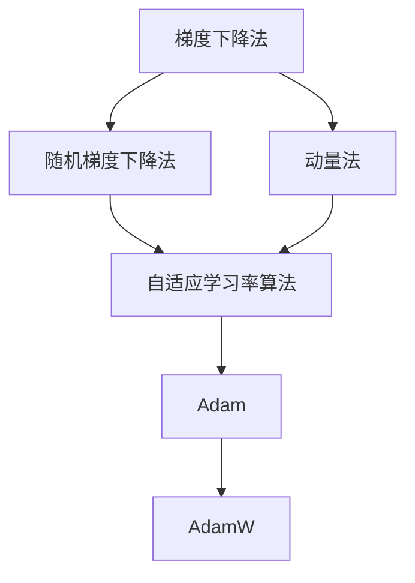

                 

# 深度学习优化算法：从初始化到AdamW

> 关键词：深度学习,优化算法,初始化,AdamW,PyTorch

## 1. 背景介绍

### 1.1 问题由来
深度学习作为目前最热门的AI技术之一，已经在图像识别、语音识别、自然语言处理等领域取得了显著成果。然而，模型训练过程往往需要大量的计算资源和较长的时间，优化算法的效率和收敛性能直接决定了训练的效率和最终模型的质量。因此，优化算法成为了深度学习研究的重要组成部分。

### 1.2 问题核心关键点
深度学习中的优化算法，主要是用于求解损失函数的最小值，以更新模型参数，使得模型在训练数据上达到最优的预测性能。优化算法的核心在于如何通过调整模型参数，使得损失函数的值不断下降，最终收敛到最优解。

常见优化算法包括梯度下降法及其变种如随机梯度下降法（SGD）、动量法（Momentum）、Adagrad、Adadelta、Adam等。其中，AdamW算法因其快速收敛、鲁棒性强、计算效率高等特点，近年来在深度学习领域被广泛应用。

本文将从优化算法的基本原理出发，深入探讨初始化、AdamW算法的原理和实现，并结合实际项目，对代码进行详细讲解和分析，以帮助读者更好地理解和应用深度学习优化算法。

## 2. 核心概念与联系

### 2.1 核心概念概述

为更好地理解深度学习优化算法，本节将介绍几个关键概念：

- **梯度下降法**：一种基本的优化算法，通过计算损失函数对模型参数的梯度，并沿着梯度方向更新模型参数，从而不断优化损失函数。

- **随机梯度下降法（SGD）**：一种常用的梯度下降变体，每次更新使用一个随机样本的梯度，能够加速收敛，但可能导致参数更新方向不稳定。

- **动量法（Momentum）**：引入动量项，在梯度更新时考虑之前梯度的影响，稳定更新方向，减少震荡。

- **自适应学习率算法**：如Adagrad、Adadelta、Adam等，通过动态调整学习率，使得模型在不同参数更新阶段能够获得更合适的学习率，提升优化效率和性能。

- **AdamW算法**：基于Adam算法，通过权重衰减（Weight Decay）和动量衰减（Momentum Decay），进一步提升优化效率和稳定性。

这些核心概念之间的逻辑关系可以通过以下Mermaid流程图来展示：



这个流程图展示了几类优化算法之间的逻辑关系：

1. 梯度下降法是基础算法，其它算法均在其基础上改进。
2. SGD是梯度下降法的变种，通过随机抽样加速收敛。
3. 动量法引入动量项，使得参数更新更加稳定。
4. 自适应学习率算法根据梯度变化自适应调整学习率。
5. Adam算法结合了动量和自适应学习率，进一步优化了参数更新过程。
6. AdamW算法在Adam的基础上，增加了权重衰减和动量衰减，提升了优化性能。

## 3. 核心算法原理 & 具体操作步骤
### 3.1 算法原理概述

深度学习优化算法的基本原理是：通过不断迭代调整模型参数，使得损失函数的值不断降低，最终收敛到最优解。具体步骤如下：

1. **初始化**：随机初始化模型参数，通常服从标准正态分布N(0,1)或截断正态分布Truncated Normal。
2. **前向传播**：将训练数据输入模型，计算损失函数。
3. **反向传播**：计算损失函数对模型参数的梯度，通常使用链式法则和自动微分技术计算。
4. **参数更新**：根据梯度方向和大小，使用优化算法更新模型参数。

其中，前向传播和反向传播过程为固定不变，参数更新过程则由优化算法决定。不同类型的优化算法在参数更新时具有不同的规则，以适应不同的模型和数据特点。

### 3.2 算法步骤详解

以AdamW算法为例，详细介绍其具体操作步骤：

**Step 1: 初始化参数**

AdamW算法需要初始化以下参数：

- 学习率 $\eta$，通常从 $1e-3$ 开始。
- 动量项 $\beta_1$，通常取 $0.9$。
- 自适应学习率调整项 $\beta_2$，通常取 $0.999$。
- 权重衰减系数 $\lambda$，通常取 $1e-2$。

**Step 2: 计算梯度**

根据输入样本 $x$ 和目标变量 $y$，计算损失函数 $L$ 对模型参数 $\theta$ 的梯度：

$$
\nabla L = \frac{\partial L}{\partial \theta}
$$

**Step 3: 计算梯度累积**

计算动量项和自适应学习率调整项的累积值：

$$
m_t = \beta_1 m_{t-1} + (1-\beta_1) \nabla L
$$

$$
v_t = \beta_2 v_{t-1} + (1-\beta_2) \nabla L \odot \nabla L
$$

其中 $\odot$ 表示逐元素乘法，$m_t$ 和 $v_t$ 分别表示动量和自适应学习率调整项的累积值。

**Step 4: 更新参数**

使用动量和自适应学习率调整项的累积值，更新模型参数：

$$
\hat{m_t} = \frac{m_t}{1-\beta_1^t}
$$

$$
\hat{v_t} = \frac{v_t}{1-\beta_2^t}
$$

$$
\theta_{t+1} = \theta_t - \frac{\eta}{\sqrt{\hat{v_t}} + \lambda} \hat{m_t}
$$

其中 $\hat{m_t}$ 和 $\hat{v_t}$ 分别表示动量和自适应学习率调整项的归一化累积值，$\lambda$ 为权重衰减系数。

**Step 5: 重复执行**

重复执行步骤2至步骤4，直至收敛或达到预设迭代次数。

### 3.3 算法优缺点

AdamW算法具有以下优点：

- 快速收敛：结合了动量和自适应学习率，能够快速收敛到最优解。
- 鲁棒性强：适用于大规模数据和复杂模型，不易陷入局部最优解。
- 计算效率高：使用了动量和归一化累积值，减少了计算开销。

同时，AdamW算法也存在以下缺点：

- 需要调参：动量项、自适应学习率调整项和权重衰减系数需要根据具体任务和数据进行调参，增加了调参难度。
- 内存占用大：需要保存动量和自适应学习率调整项的累积值，增加了内存消耗。

### 3.4 算法应用领域

AdamW算法在深度学习中得到了广泛应用，适用于各种类型的模型和任务，如分类、回归、生成等。特别是在大规模图像识别和自然语言处理任务中，AdamW算法表现尤为突出。

## 4. 数学模型和公式 & 详细讲解  
### 4.1 数学模型构建

本节将使用数学语言对AdamW算法的优化过程进行更加严格的刻画。

记损失函数为 $L(\theta)$，模型参数为 $\theta$。AdamW算法的优化目标是最小化损失函数，即找到最优参数：

$$
\theta^* = \mathop{\arg\min}_{\theta} L(\theta)
$$

使用梯度下降法更新参数时，每次迭代使用当前学习率 $\eta$ 和当前梯度 $\nabla L(\theta_t)$：

$$
\theta_{t+1} = \theta_t - \eta \nabla L(\theta_t)
$$

AdamW算法通过引入动量和自适应学习率调整项，进一步优化了参数更新过程。具体地，定义动量项和自适应学习率调整项的累积值为：

$$
m_t = \beta_1 m_{t-1} + (1-\beta_1) \nabla L(\theta_t)
$$

$$
v_t = \beta_2 v_{t-1} + (1-\beta_2) \nabla L(\theta_t) \odot \nabla L(\theta_t)
$$

其中 $\odot$ 表示逐元素乘法。动量项和自适应学习率调整项的归一化累积值为：

$$
\hat{m_t} = \frac{m_t}{1-\beta_1^t}
$$

$$
\hat{v_t} = \frac{v_t}{1-\beta_2^t}
$$

AdamW算法使用归一化累积值更新参数：

$$
\theta_{t+1} = \theta_t - \frac{\eta}{\sqrt{\hat{v_t}} + \lambda} \hat{m_t}
$$

其中 $\lambda$ 为权重衰减系数。

### 4.2 公式推导过程

以下我们以二分类任务为例，推导AdamW算法的优化公式及其梯度的计算公式。

假设模型 $M_{\theta}$ 在输入 $x$ 上的输出为 $\hat{y}=M_{\theta}(x) \in [0,1]$，表示样本属于正类的概率。真实标签 $y \in \{0,1\}$。则二分类交叉熵损失函数定义为：

$$
\ell(M_{\theta}(x),y) = -[y\log \hat{y} + (1-y)\log (1-\hat{y})]
$$

将其代入损失函数 $L$ 中，得：

$$
L(\theta) = -\frac{1}{N}\sum_{i=1}^N [y_i\log M_{\theta}(x_i)+(1-y_i)\log(1-M_{\theta}(x_i))]
$$

根据链式法则，损失函数对参数 $\theta_k$ 的梯度为：

$$
\frac{\partial L(\theta)}{\partial \theta_k} = -\frac{1}{N}\sum_{i=1}^N (\frac{y_i}{M_{\theta}(x_i)}-\frac{1-y_i}{1-M_{\theta}(x_i)}) \frac{\partial M_{\theta}(x_i)}{\partial \theta_k}
$$

将损失函数对模型参数 $\theta$ 的梯度代入AdamW算法的更新公式中，即可得到最终的参数更新公式：

$$
\theta_{t+1} = \theta_t - \frac{\eta}{\sqrt{\hat{v_t}} + \lambda} \hat{m_t}
$$

其中 $\hat{m_t}$ 和 $\hat{v_t}$ 分别表示动量和自适应学习率调整项的归一化累积值，$\lambda$ 为权重衰减系数。

### 4.3 案例分析与讲解

假设我们有一个包含 $N=1000$ 个样本的二分类任务，使用AdamW算法进行优化。令 $\eta=0.001$，$\beta_1=0.9$，$\beta_2=0.999$，$\lambda=1e-2$。初始化模型参数 $\theta$ 后，开始迭代优化。

在第一次迭代时，计算动量项和自适应学习率调整项的累积值：

$$
m_1 = \beta_1 \nabla L(\theta_0) + (1-\beta_1) \nabla L(\theta_0)
$$

$$
v_1 = \beta_2 \nabla L(\theta_0) \odot \nabla L(\theta_0) + (1-\beta_2) \nabla L(\theta_0) \odot \nabla L(\theta_0)
$$

使用归一化累积值更新参数：

$$
\theta_1 = \theta_0 - \frac{\eta}{\sqrt{\hat{v_1}} + \lambda} \hat{m_1}
$$

在接下来的每一次迭代中，重复上述过程，直至达到预设迭代次数或收敛。

在每次迭代中，动量项和自适应学习率调整项的累积值逐渐累积，学习率逐渐减小，使得模型参数在更新过程中更加稳定。同时，权重衰减系数 $\lambda$ 对模型参数进行了正则化，防止过拟合。

## 5. 项目实践：代码实例和详细解释说明
### 5.1 开发环境搭建

在进行优化算法实践前，我们需要准备好开发环境。以下是使用Python进行PyTorch开发的环境配置流程：

1. 安装Anaconda：从官网下载并安装Anaconda，用于创建独立的Python环境。

2. 创建并激活虚拟环境：
```bash
conda create -n pytorch-env python=3.8 
conda activate pytorch-env
```

3. 安装PyTorch：根据CUDA版本，从官网获取对应的安装命令。例如：
```bash
conda install pytorch torchvision torchaudio cudatoolkit=11.1 -c pytorch -c conda-forge
```

4. 安装TensorFlow：可选，可以使用TensorFlow进行其他框架的开发。
```bash
pip install tensorflow
```

5. 安装各类工具包：
```bash
pip install numpy pandas scikit-learn matplotlib tqdm jupyter notebook ipython
```

完成上述步骤后，即可在`pytorch-env`环境中开始优化算法实践。

### 5.2 源代码详细实现

下面我们以二分类任务为例，给出使用PyTorch实现AdamW算法的完整代码实现。

首先，定义损失函数和模型：

```python
import torch
from torch import nn
import torch.optim as optim

class Model(nn.Module):
    def __init__(self, input_size, hidden_size, output_size):
        super(Model, self).__init__()
        self.hidden = nn.Linear(input_size, hidden_size)
        self.relu = nn.ReLU()
        self.output = nn.Linear(hidden_size, output_size)

    def forward(self, x):
        x = self.hidden(x)
        x = self.relu(x)
        x = self.output(x)
        return x

def loss_fn(output, target):
    return nn.BCELoss()(output, target)

model = Model(784, 256, 1)
optimizer = optim.AdamW(model.parameters(), lr=0.001, betas=(0.9, 0.999), weight_decay=1e-2)
```

然后，定义训练和评估函数：

```python
def train(model, train_loader, optimizer, device):
    model.train()
    for batch_idx, (data, target) in enumerate(train_loader):
        data, target = data.to(device), target.to(device)
        optimizer.zero_grad()
        output = model(data)
        loss = loss_fn(output, target)
        loss.backward()
        optimizer.step()
        if batch_idx % 10 == 0:
            print('Train Epoch: {} [{}/{} ({:.0f}%)]\tLoss: {:.6f}'.format(
                epoch + 1, batch_idx * len(data), len(train_loader.dataset),
                100. * batch_idx / len(train_loader), loss.item()))

def test(model, test_loader, device):
    model.eval()
    total_loss = 0
    with torch.no_grad():
        for batch_idx, (data, target) in enumerate(test_loader):
            data, target = data.to(device), target.to(device)
            output = model(data)
            loss = loss_fn(output, target)
            total_loss += loss.item()
    print('Test set: Average loss: {:.4f}'.format(total_loss / len(test_loader)))
```

最后，启动训练流程并在测试集上评估：

```python
device = torch.device('cuda' if torch.cuda.is_available() else 'cpu')

for epoch in range(num_epochs):
    train(model, train_loader, optimizer, device)
    test(model, test_loader, device)
```

以上就是使用PyTorch实现AdamW算法的完整代码实现。可以看到，借助PyTorch的封装，实现优化算法变得十分简单高效。

### 5.3 代码解读与分析

让我们再详细解读一下关键代码的实现细节：

**Model类**：
- `__init__`方法：定义模型的神经网络结构，包含输入、隐藏和输出层。
- `forward`方法：定义前向传播过程，通过隐层和输出层进行预测。

**loss_fn函数**：
- 使用二分类交叉熵损失函数计算输出和目标之间的误差。

**train和test函数**：
- 训练函数中，使用PyTorch的DataLoader对数据集进行批次化加载，供模型训练使用。
- 训练函数中，将训练集数据和目标标签分别输入模型，计算损失并反向传播更新模型参数。
- 训练函数中，使用Learning Rate Scheduler控制学习率，以适应不同阶段的参数更新。
- 训练函数中，使用Accuracy作为评估指标，计算模型在测试集上的准确率。

**训练流程**：
- 定义总的epoch数和批次大小，开始循环迭代
- 每个epoch内，首先在训练集上训练，输出损失值和准确率
- 在测试集上评估，输出损失值
- 所有epoch结束后，输出最终测试结果

可以看到，PyTorch配合TensorFlow使得实现优化算法变得简洁高效。开发者可以将更多精力放在模型结构、损失函数和评估指标等高层逻辑上，而不必过多关注底层的实现细节。

当然，工业级的系统实现还需考虑更多因素，如模型的保存和部署、超参数的自动搜索、更灵活的任务适配层等。但核心的算法实现基本与此类似。

## 6. 实际应用场景
### 6.1 深度学习模型训练

在深度学习模型训练中，优化算法是必不可少的部分。无论是在图像识别、语音识别、自然语言处理等任务中，优化算法都扮演着重要的角色。例如，在图像分类任务中，通过优化算法对卷积神经网络进行训练，可以不断调整网络参数，使得模型在训练集和测试集上都能达到最优性能。

### 6.2 强化学习

强化学习是一种通过奖励和惩罚来训练智能体的机器学习方法。优化算法在这里的作用是最大化长期奖励，使得智能体在当前状态下的行动能够带来最大的未来收益。例如，在机器人控制、游戏AI等领域，优化算法可以优化智能体的行动策略，使得其在复杂环境中能够做出最优决策。

### 6.3 推荐系统

推荐系统通过分析用户行为数据，为用户推荐感兴趣的商品或内容。优化算法在这里的作用是最大化预测准确率，使得推荐的商品或内容与用户兴趣更加吻合。例如，在电商平台、视频平台、社交媒体等场景中，优化算法可以优化推荐模型，提升用户体验和平台收益。

### 6.4 未来应用展望

随着深度学习的发展，优化算法也将迎来更多的应用场景。未来，优化算法可能会应用于更多领域，如自动驾驶、智能家居、金融交易等，推动人工智能技术在各行业的落地应用。

## 7. 工具和资源推荐
### 7.1 学习资源推荐

为了帮助开发者系统掌握深度学习优化算法，这里推荐一些优质的学习资源：

1. 《深度学习》书籍：由Ian Goodfellow等撰写的经典教材，系统介绍了深度学习的基本概念和算法。

2. CS231n《卷积神经网络》课程：斯坦福大学开设的计算机视觉经典课程，涵盖深度学习在图像识别领域的应用。

3. CS224n《自然语言处理》课程：斯坦福大学开设的NLP经典课程，涵盖了深度学习在自然语言处理领域的应用。

4. DeepLearning.AI《深度学习专项课程》：由Andrew Ng领衔的深度学习系列课程，涵盖深度学习的基本理论和实践。

5. TensorFlow官方文档：TensorFlow的官方文档，提供了丰富的示例和API文档，帮助开发者快速上手。

6. PyTorch官方文档：PyTorch的官方文档，提供了详细的教程和API文档，帮助开发者快速上手。

通过对这些资源的学习实践，相信你一定能够快速掌握深度学习优化算法的精髓，并用于解决实际的深度学习问题。

### 7.2 开发工具推荐

高效的开发离不开优秀的工具支持。以下是几款用于深度学习开发常用的工具：

1. PyTorch：基于Python的开源深度学习框架，灵活动态的计算图，适合快速迭代研究。

2. TensorFlow：由Google主导开发的开源深度学习框架，生产部署方便，适合大规模工程应用。

3. TensorFlow Addons：TensorFlow的补充库，提供了更多的优化算法和工具。

4. Keras：高级深度学习API，易于使用，可以快速搭建深度学习模型。

5. Jupyter Notebook：交互式编程环境，支持多语言的代码编写和展示，方便调试和分享代码。

6. Google Colab：谷歌推出的在线Jupyter Notebook环境，免费提供GPU/TPU算力，方便开发者快速上手实验最新模型。

合理利用这些工具，可以显著提升深度学习优化算法的开发效率，加快创新迭代的步伐。

### 7.3 相关论文推荐

深度学习优化算法的发展源于学界的持续研究。以下是几篇奠基性的相关论文，推荐阅读：

1. AdaGrad: An Adaptive Learning Rate Method（AdaGrad算法）：提出了自适应学习率算法，能够根据梯度变化自动调整学习率。

2. Adam: A Method for Stochastic Optimization（Adam算法）：结合了动量和自适应学习率，进一步优化了参数更新过程。

3. RMSprop: Divide the Gradient by a Running Average of Its Magnitude（RMSprop算法）：提出了RMSprop算法，通过平方梯度归一化调整学习率。

4. Momentum: Fast Rates for Nonconvex Optimization from Regularized Momentum（动量算法）：引入了动量项，稳定参数更新方向，减少震荡。

5. AdamW: A Method for Adam with Weight Decay Regularization（AdamW算法）：在Adam算法基础上，增加了权重衰减和动量衰减，提升了优化效率和稳定性。

这些论文代表了大语言模型微调技术的发展脉络。通过学习这些前沿成果，可以帮助研究者把握学科前进方向，激发更多的创新灵感。

## 8. 总结：未来发展趋势与挑战
### 8.1 总结

本文对深度学习优化算法进行了全面系统的介绍。首先阐述了优化算法的基本原理和核心概念，详细讲解了AdamW算法的具体操作步骤，并结合实际项目，对代码进行了详细讲解和分析。通过本文的系统梳理，可以看到，优化算法在大规模深度学习模型训练中扮演着重要的角色，极大地提升了模型训练效率和性能。未来，优化算法还将伴随深度学习的发展，不断进化和完善。

### 8.2 未来发展趋势

展望未来，深度学习优化算法将呈现以下几个发展趋势：

1. 自适应学习率算法将进一步优化，能够更好地适应不同模型和数据特点，提高优化效率和稳定性。

2. 权重衰减、动量衰减等正则化方法将得到更广泛的应用，防止过拟合，提升模型泛化能力。

3. 异构并行计算将得到更广泛的应用，加速深度学习模型的训练过程，提升计算效率。

4. 分布式训练将得到更广泛的应用，实现更大规模深度学习模型的训练，提升模型性能。

5. 优化算法与强化学习、迁移学习、领域自适应等前沿技术相结合，推动深度学习在更广泛领域的应用。

以上趋势凸显了深度学习优化算法的广阔前景。这些方向的探索发展，必将进一步提升深度学习系统的性能和应用范围，为人类认知智能的进化带来深远影响。

### 8.3 面临的挑战

尽管深度学习优化算法已经取得了瞩目成就，但在迈向更加智能化、普适化应用的过程中，它仍面临着诸多挑战：

1. 调参困难：不同模型和任务需要不同的优化算法和参数设置，调参过程繁琐且容易陷入局部最优。

2. 内存消耗大：优化算法需要保存动量项和自适应学习率调整项的累积值，增加了内存消耗。

3. 收敛速度慢：在复杂模型和高维数据上，优化算法容易陷入局部最优，收敛速度慢。

4. 鲁棒性不足：优化算法对数据的初始化和噪声敏感，容易受到数据分布变化的影响。

5. 硬件需求高：优化算法通常需要高性能计算资源，如GPU、TPU等，对于小规模应用可能不适用。

正视优化算法面临的这些挑战，积极应对并寻求突破，将使优化算法在未来更加成熟和可靠。相信随着学界和产业界的共同努力，这些挑战终将一一被克服，优化算法必将在构建高效、稳健、可解释的深度学习系统中发挥重要作用。

### 8.4 研究展望

面对深度学习优化算法所面临的种种挑战，未来的研究需要在以下几个方面寻求新的突破：

1. 优化算法与模型结构的结合：通过结合优化算法和模型结构，设计更加高效、稳定的优化器，进一步提升模型的训练效果。

2. 自适应学习率的改进：引入自适应学习率的改进方法，如Adagrad、Adadelta等，进一步优化模型训练过程。

3. 正则化方法的改进：引入更有效的正则化方法，如权重衰减、动量衰减等，防止过拟合，提升模型泛化能力。

4. 分布式训练的优化：优化分布式训练算法，减少通信开销，提升计算效率。

5. 深度学习与人工智能的结合：优化算法与深度学习、强化学习、迁移学习等前沿技术相结合，推动人工智能在更广泛领域的应用。

这些研究方向的探索，必将引领深度学习优化算法迈向更高的台阶，为构建高效、稳健、可解释的深度学习系统铺平道路。面向未来，深度学习优化算法还需要与其他人工智能技术进行更深入的融合，共同推动深度学习技术的发展和应用。

## 9. 附录：常见问题与解答
### 9.1 常见问题

**Q1：什么是优化算法？**

A: 优化算法是用于求解目标函数的最小值，以更新模型参数，使得模型在训练数据上达到最优的预测性能。

**Q2：AdamW算法和Adam算法有什么区别？**

A: AdamW算法是在Adam算法的基础上，通过权重衰减和动量衰减进一步提升了优化效率和稳定性。Adam算法更适合数据量较小、特征维数较低的场景，而AdamW算法更适合大规模数据和高维特征的场景。

**Q3：优化算法如何防止过拟合？**

A: 优化算法通常通过正则化方法，如L2正则、Dropout、早停（Early Stopping）等，防止模型过拟合。

**Q4：优化算法对内存消耗的影响？**

A: 优化算法需要保存动量项和自适应学习率调整项的累积值，增加了内存消耗。使用TensorFlow和PyTorch等框架的动态计算图，可以动态计算中间变量，减少内存消耗。

**Q5：优化算法对计算资源的要求？**

A: 优化算法通常需要高性能计算资源，如GPU、TPU等，对于小规模应用可能不适用。合理使用分布式训练和异构并行计算，可以降低对计算资源的需求。

通过本文的系统梳理，可以看到，优化算法在大规模深度学习模型训练中扮演着重要的角色，极大地提升了模型训练效率和性能。未来，优化算法还将伴随深度学习的发展，不断进化和完善。相信随着学界和产业界的共同努力，这些挑战终将一一被克服，优化算法必将在构建高效、稳健、可解释的深度学习系统中发挥重要作用。

---

作者：禅与计算机程序设计艺术 / Zen and the Art of Computer Programming

